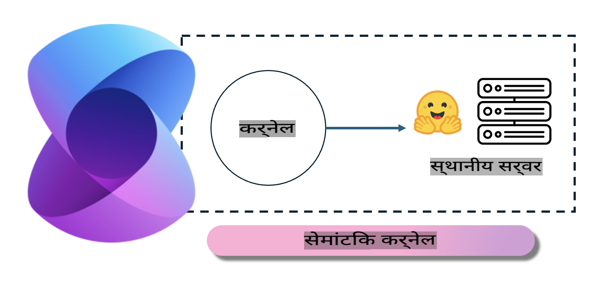
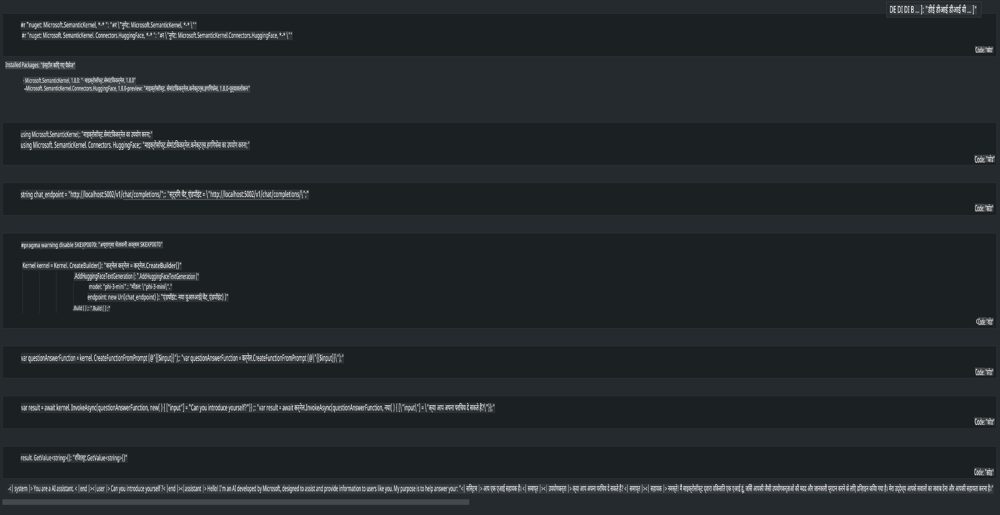

# **लोकल सर्वर पर Phi-3 का उपयोग**

हम Phi-3 को लोकल सर्वर पर डिप्लॉय कर सकते हैं। उपयोगकर्ता [Ollama](https://ollama.com) या [LM Studio](https://llamaedge.com) समाधान चुन सकते हैं, या फिर अपना खुद का कोड लिख सकते हैं। आप [Semantic Kernel](https://github.com/microsoft/semantic-kernel?WT.mc_id=aiml-138114-kinfeylo) या [Langchain](https://www.langchain.com/) के माध्यम से Phi-3 की लोकल सेवाओं को कनेक्ट कर सकते हैं और Copilot एप्लिकेशन बना सकते हैं।  

## **Phi-3-mini तक पहुंचने के लिए Semantic Kernel का उपयोग करें**

Copilot एप्लिकेशन में, हम Semantic Kernel / LangChain के माध्यम से एप्लिकेशन बनाते हैं। इस प्रकार का एप्लिकेशन फ्रेमवर्क आमतौर पर Azure OpenAI Service / OpenAI मॉडल्स के साथ संगत होता है, और Hugging Face पर उपलब्ध ओपन सोर्स मॉडल्स और लोकल मॉडल्स को भी सपोर्ट कर सकता है। यदि हमें Phi-3-mini तक पहुंचने के लिए Semantic Kernel का उपयोग करना हो तो हमें क्या करना चाहिए? .NET का उदाहरण लेते हुए, हम इसे Semantic Kernel में Hugging Face Connector के साथ मिला सकते हैं। डिफ़ॉल्ट रूप से, यह Hugging Face पर मौजूद मॉडल आईडी के साथ मेल खा सकता है (पहली बार उपयोग करने पर, मॉडल Hugging Face से डाउनलोड होगा, जिसमें समय लगता है)। आप इसे लोकल सर्वर से भी कनेक्ट कर सकते हैं। दोनों की तुलना में, हम बाद वाले का उपयोग करने की सलाह देते हैं क्योंकि यह अधिक स्वायत्तता प्रदान करता है, खासकर एंटरप्राइज़ एप्लिकेशंस में।  

  

चित्र से यह स्पष्ट होता है कि Semantic Kernel के माध्यम से लोकल सेवाओं तक पहुंचना आसान है और इसे स्वयं-निर्मित Phi-3-mini मॉडल सर्वर से कनेक्ट किया जा सकता है। यहां चलने वाले परिणाम दिए गए हैं।  

  

***नमूना कोड*** https://github.com/kinfey/Phi3MiniSamples/tree/main/semantickernel  

**अस्वीकरण**:  
यह दस्तावेज़ मशीन-आधारित एआई अनुवाद सेवाओं का उपयोग करके अनुवादित किया गया है। जबकि हम सटीकता के लिए प्रयासरत हैं, कृपया ध्यान दें कि स्वचालित अनुवाद में त्रुटियाँ या अशुद्धियाँ हो सकती हैं। मूल दस्तावेज़ को उसकी मूल भाषा में आधिकारिक स्रोत माना जाना चाहिए। महत्वपूर्ण जानकारी के लिए, पेशेवर मानव अनुवाद की सिफारिश की जाती है। इस अनुवाद के उपयोग से उत्पन्न किसी भी गलतफहमी या गलत व्याख्या के लिए हम उत्तरदायी नहीं हैं।