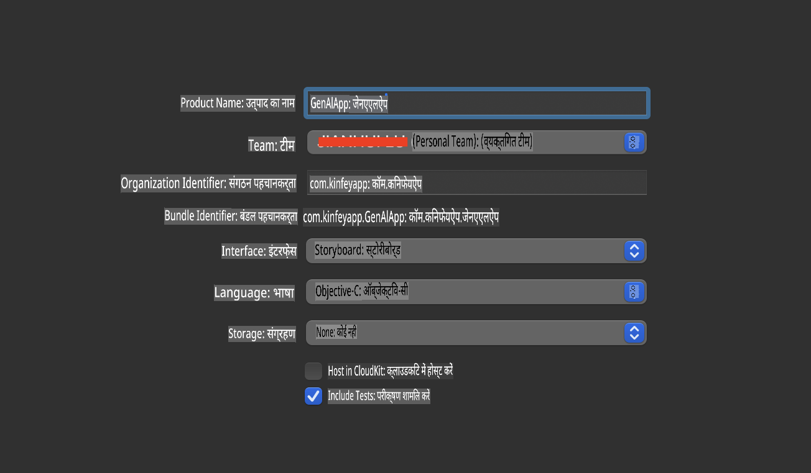
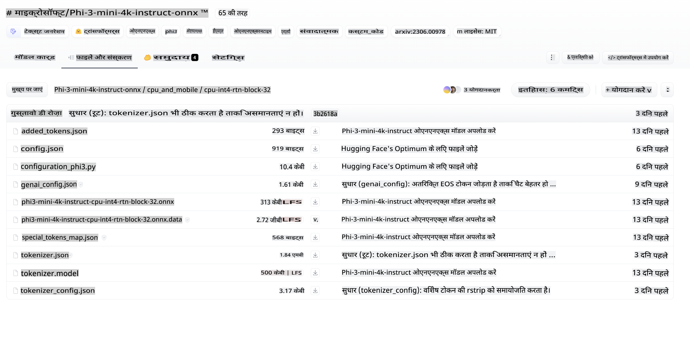
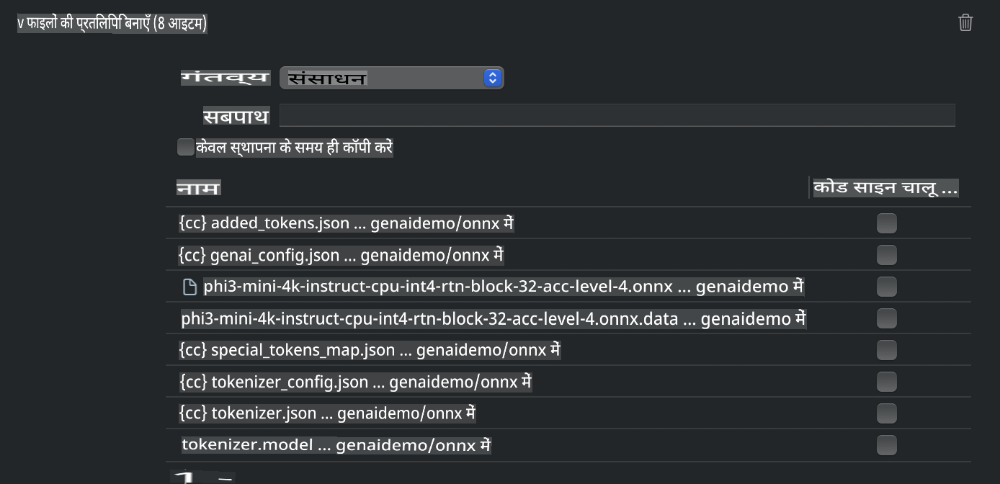
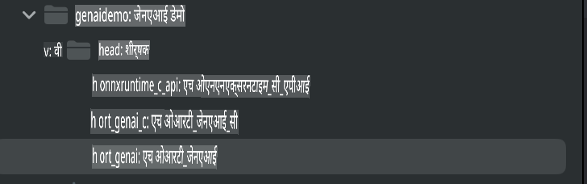
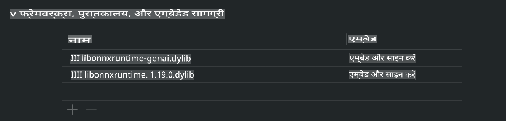
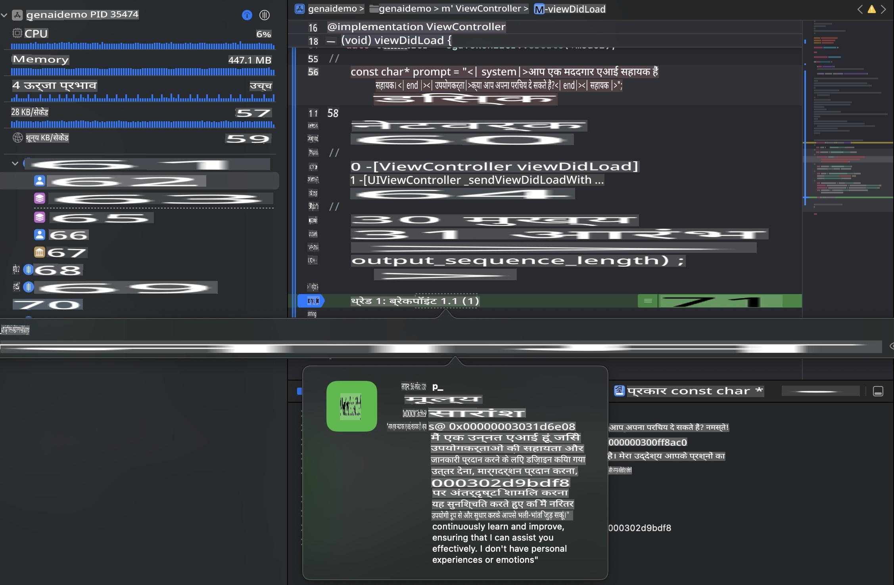

# **iOS में Phi-3 का इनफेरेंस**

Phi-3-mini Microsoft की एक नई मॉडल सीरीज है, जो बड़े भाषा मॉडल्स (LLMs) को edge डिवाइस और IoT डिवाइस पर डिप्लॉय करने की सुविधा देती है। Phi-3-mini iOS, Android, और Edge डिवाइस पर डिप्लॉयमेंट के लिए उपलब्ध है, जिससे BYOD वातावरण में जनरेटिव AI को डिप्लॉय करना संभव होता है। नीचे दिए गए उदाहरण में दिखाया गया है कि iOS पर Phi-3-mini को कैसे डिप्लॉय करें।

## **1. तैयारी**

- **a.** macOS 14+
- **b.** Xcode 15+
- **c.** iOS SDK 17.x (iPhone 14 A16 या उससे अधिक)
- **d.** Python 3.10+ इंस्टॉल करें (Conda की सिफारिश की जाती है)
- **e.** Python लाइब्रेरी इंस्टॉल करें: `python-flatbuffers`
- **f.** CMake इंस्टॉल करें

### Semantic Kernel और इनफेरेंस

Semantic Kernel एक एप्लिकेशन फ्रेमवर्क है जो Azure OpenAI Service, OpenAI मॉडल्स और लोकल मॉडल्स के साथ संगत एप्लिकेशन बनाने की सुविधा देता है। Semantic Kernel के माध्यम से लोकल सेवाओं तक पहुंच बनाकर, आप अपने स्व-होस्टेड Phi-3-mini मॉडल सर्वर को आसानी से इंटीग्रेट कर सकते हैं।

### Ollama या LlamaEdge के साथ क्वांटाइज़्ड मॉडल्स को कॉल करना

कई उपयोगकर्ता लोकल स्तर पर मॉडल्स चलाने के लिए क्वांटाइज़्ड मॉडल्स का उपयोग करना पसंद करते हैं। [Ollama](https://ollama.com) और [LlamaEdge](https://llamaedge.com) उपयोगकर्ताओं को विभिन्न क्वांटाइज़्ड मॉडल्स को कॉल करने की अनुमति देते हैं:

#### **Ollama**

आप `ollama run phi3` को सीधे चला सकते हैं या इसे ऑफलाइन कॉन्फ़िगर कर सकते हैं। अपने `gguf` फाइल के पथ के साथ एक Modelfile बनाएं। Phi-3-mini क्वांटाइज़्ड मॉडल चलाने के लिए सैंपल कोड:

```gguf
FROM {Add your gguf file path}
TEMPLATE \"\"\"<|user|> .Prompt<|end|> <|assistant|>\"\"\"
PARAMETER stop <|end|>
PARAMETER num_ctx 4096
```

#### **LlamaEdge**

अगर आप `gguf` को क्लाउड और edge डिवाइस दोनों पर एक साथ उपयोग करना चाहते हैं, तो LlamaEdge एक बेहतरीन विकल्प है।

## **2. iOS के लिए ONNX Runtime को कंपाइल करना**

```bash

git clone https://github.com/microsoft/onnxruntime.git

cd onnxruntime

./build.sh --build_shared_lib --ios --skip_tests --parallel --build_dir ./build_ios --ios --apple_sysroot iphoneos --osx_arch arm64 --apple_deploy_target 17.5 --cmake_generator Xcode --config Release

cd ../

```

### **ध्यान दें**

- **a.** कंपाइल करने से पहले, सुनिश्चित करें कि Xcode ठीक से कॉन्फ़िगर किया गया है और इसे टर्मिनल में सक्रिय डेवलपर डायरेक्टरी के रूप में सेट करें:

    ```bash
    sudo xcode-select -switch /Applications/Xcode.app/Contents/Developer
    ```

- **b.** ONNX Runtime को विभिन्न प्लेटफार्म्स के लिए कंपाइल करने की आवश्यकता होती है। iOS के लिए, आप इसे `arm64` or `x86_64` के लिए कंपाइल कर सकते हैं।

- **c.** कंपाइलेशन के लिए नवीनतम iOS SDK का उपयोग करने की सिफारिश की जाती है। हालांकि, यदि आपको पुराने SDKs के साथ संगतता की आवश्यकता है, तो आप पुराने संस्करण का भी उपयोग कर सकते हैं।

## **3. iOS के लिए ONNX Runtime के साथ जनरेटिव AI को कंपाइल करना**

> **नोट:** चूंकि ONNX Runtime के साथ जनरेटिव AI प्रीव्यू में है, कृपया संभावित बदलावों को ध्यान में रखें।

```bash

git clone https://github.com/microsoft/onnxruntime-genai
 
cd onnxruntime-genai
 
mkdir ort
 
cd ort
 
mkdir include
 
mkdir lib
 
cd ../
 
cp ../onnxruntime/include/onnxruntime/core/session/onnxruntime_c_api.h ort/include
 
cp ../onnxruntime/build_ios/Release/Release-iphoneos/libonnxruntime*.dylib* ort/lib
 
export OPENCV_SKIP_XCODEBUILD_FORCE_TRYCOMPILE_DEBUG=1
 
python3 build.py --parallel --build_dir ./build_ios --ios --ios_sysroot iphoneos --ios_arch arm64 --ios_deployment_target 17.5 --cmake_generator Xcode --cmake_extra_defines CMAKE_XCODE_ATTRIBUTE_CODE_SIGNING_ALLOWED=NO

```

## **4. Xcode में एक App एप्लिकेशन बनाना**

मैंने एप्लिकेशन डेवलपमेंट के लिए Objective-C को चुना है, क्योंकि ONNX Runtime C++ API के साथ जनरेटिव AI का उपयोग करते समय, Objective-C बेहतर संगतता प्रदान करता है। बेशक, आप स्विफ्ट ब्रिजिंग के माध्यम से संबंधित कॉल्स को पूरा कर सकते हैं।



## **5. App एप्लिकेशन प्रोजेक्ट में ONNX क्वांटाइज़्ड INT4 मॉडल को कॉपी करना**

हमें ONNX फॉर्मेट में INT4 क्वांटाइज़ेशन मॉडल को इंपोर्ट करना होगा, जिसे पहले डाउनलोड करना आवश्यक है।



डाउनलोड करने के बाद, आपको इसे Xcode में प्रोजेक्ट की Resources डायरेक्टरी में जोड़ना होगा।



## **6. ViewControllers में C++ API जोड़ना**

> **ध्यान दें:**

- **a.** प्रोजेक्ट में संबंधित C++ हेडर फाइल्स जोड़ें।

  

- **b.** `onnxruntime-genai` dynamic library in Xcode.

  

- **c.** Use the C Samples code for testing. You can also add additional features like ChatUI for more functionality.

- **d.** Since you need to use C++ in your project, rename `ViewController.m` to `ViewController.mm` को शामिल करें ताकि Objective-C++ सपोर्ट सक्षम हो सके।

```objc

    NSString *llmPath = [[NSBundle mainBundle] resourcePath];
    char const *modelPath = llmPath.cString;

    auto model =  OgaModel::Create(modelPath);

    auto tokenizer = OgaTokenizer::Create(*model);

    const char* prompt = "<|system|>You are a helpful AI assistant.<|end|><|user|>Can you introduce yourself?<|end|><|assistant|>";

    auto sequences = OgaSequences::Create();
    tokenizer->Encode(prompt, *sequences);

    auto params = OgaGeneratorParams::Create(*model);
    params->SetSearchOption("max_length", 100);
    params->SetInputSequences(*sequences);

    auto output_sequences = model->Generate(*params);
    const auto output_sequence_length = output_sequences->SequenceCount(0);
    const auto* output_sequence_data = output_sequences->SequenceData(0);
    auto out_string = tokenizer->Decode(output_sequence_data, output_sequence_length);
    
    auto tmp = out_string;

```

## **7. एप्लिकेशन चलाना**

सेटअप पूरा हो जाने के बाद, आप एप्लिकेशन को चलाकर Phi-3-mini मॉडल इनफेरेंस के परिणाम देख सकते हैं।



अधिक सैंपल कोड और विस्तृत निर्देशों के लिए, [Phi-3 Mini Samples repository](https://github.com/Azure-Samples/Phi-3MiniSamples/tree/main/ios) पर जाएं।

**अस्वीकरण**:  
यह दस्तावेज़ मशीन-आधारित एआई अनुवाद सेवाओं का उपयोग करके अनुवादित किया गया है। जबकि हम सटीकता के लिए प्रयास करते हैं, कृपया ध्यान दें कि स्वचालित अनुवादों में त्रुटियां या अशुद्धियां हो सकती हैं। मूल भाषा में लिखा गया मूल दस्तावेज़ प्रामाणिक स्रोत माना जाना चाहिए। महत्वपूर्ण जानकारी के लिए, पेशेवर मानव अनुवाद की सिफारिश की जाती है। इस अनुवाद के उपयोग से उत्पन्न किसी भी गलतफहमी या गलत व्याख्या के लिए हम जिम्मेदार नहीं हैं।  