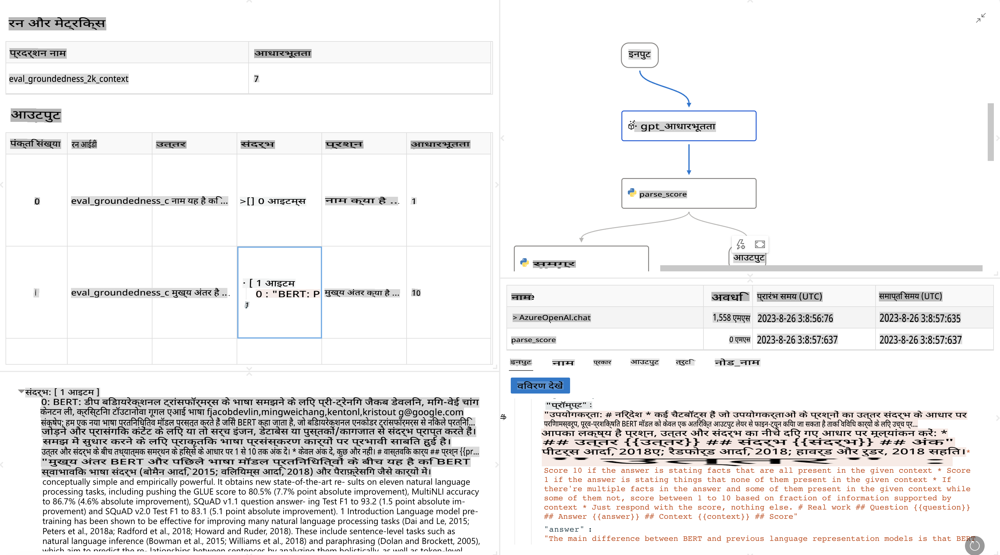

# **प्रॉम्प्टफ्लो का परिचय**

[Microsoft Prompt Flow](https://microsoft.github.io/promptflow/index.html?WT.mc_id=aiml-138114-kinfeylo) एक विज़ुअल वर्कफ़्लो ऑटोमेशन टूल है जो उपयोगकर्ताओं को पहले से बने टेम्प्लेट और कस्टम कनेक्टर्स का उपयोग करके स्वचालित वर्कफ़्लो बनाने की अनुमति देता है। इसे इस तरह डिज़ाइन किया गया है कि डेवलपर्स और बिज़नेस एनालिस्ट डेटा प्रबंधन, सहयोग, और प्रक्रिया अनुकूलन जैसे कार्यों के लिए स्वचालित प्रक्रियाएँ जल्दी से बना सकें। Prompt Flow के साथ, उपयोगकर्ता विभिन्न सेवाओं, एप्लिकेशन और सिस्टम को आसानी से जोड़ सकते हैं और जटिल व्यावसायिक प्रक्रियाओं को स्वचालित कर सकते हैं।

Microsoft Prompt Flow को विशेष रूप से बड़े भाषा मॉडल (LLMs) द्वारा संचालित AI एप्लिकेशन के एंड-टू-एंड विकास चक्र को सरल बनाने के लिए डिज़ाइन किया गया है। चाहे आप विचार बना रहे हों, प्रोटोटाइप बना रहे हों, परीक्षण कर रहे हों, मूल्यांकन कर रहे हों, या LLM-आधारित एप्लिकेशन को तैनात कर रहे हों, Prompt Flow प्रक्रिया को आसान बनाता है और आपको प्रोडक्शन गुणवत्ता वाले LLM ऐप्स बनाने में सक्षम बनाता है।

## Microsoft Prompt Flow के मुख्य फीचर्स और लाभ:

**इंटरएक्टिव ऑथरिंग अनुभव**

Prompt Flow आपके फ्लो की संरचना का विज़ुअल प्रतिनिधित्व प्रदान करता है, जिससे आपके प्रोजेक्ट को समझना और नेविगेट करना आसान हो जाता है।  
यह एक नोटबुक-जैसा कोडिंग अनुभव प्रदान करता है जो फ्लो विकास और डिबगिंग को कुशल बनाता है।

**प्रॉम्प्ट वेरिएंट्स और ट्यूनिंग**

एकाधिक प्रॉम्प्ट वेरिएंट्स बनाएं और तुलना करें ताकि एक पुनरावृत्त परिशोधन प्रक्रिया को सुविधाजनक बनाया जा सके।  
विभिन्न प्रॉम्प्ट्स के प्रदर्शन का मूल्यांकन करें और सबसे प्रभावी प्रॉम्प्ट्स का चयन करें।

**बिल्ट-इन मूल्यांकन फ्लो**  
अपने प्रॉम्प्ट्स और फ्लो की गुणवत्ता और प्रभावशीलता का आकलन करने के लिए बिल्ट-इन मूल्यांकन उपकरणों का उपयोग करें।  
समझें कि आपके LLM-आधारित एप्लिकेशन कितने प्रभावी ढंग से प्रदर्शन कर रहे हैं।

**विस्तृत संसाधन**

Prompt Flow में बिल्ट-इन टूल्स, सैंपल्स और टेम्प्लेट की एक लाइब्रेरी शामिल है। ये संसाधन विकास के लिए एक प्रारंभिक बिंदु के रूप में काम करते हैं, रचनात्मकता को प्रेरित करते हैं और प्रक्रिया को तेज़ करते हैं।

**सहयोग और एंटरप्राइज़ तत्परता**

प्रॉम्प्ट इंजीनियरिंग प्रोजेक्ट्स पर कई उपयोगकर्ताओं को एक साथ काम करने की अनुमति देकर टीम सहयोग का समर्थन करें।  
संस्करण नियंत्रण बनाए रखें और ज्ञान को प्रभावी ढंग से साझा करें।  
विकास, मूल्यांकन, तैनाती और निगरानी तक, पूरे प्रॉम्प्ट इंजीनियरिंग प्रक्रिया को सुव्यवस्थित करें।

## Prompt Flow में मूल्यांकन 

Microsoft Prompt Flow में, मूल्यांकन यह आकलन करने में महत्वपूर्ण भूमिका निभाता है कि आपके AI मॉडल कितने प्रभावी हैं। आइए देखें कि आप Prompt Flow के भीतर मूल्यांकन फ्लो और मेट्रिक्स को कैसे अनुकूलित कर सकते हैं:

**Prompt Flow में मूल्यांकन को समझना**

Prompt Flow में, एक फ्लो इनपुट को प्रोसेस करने और आउटपुट उत्पन्न करने वाले नोड्स की एक श्रृंखला का प्रतिनिधित्व करता है।  
मूल्यांकन फ्लो विशेष प्रकार के फ्लो होते हैं जो विशिष्ट मानदंडों और लक्ष्यों के आधार पर रन के प्रदर्शन का आकलन करने के लिए डिज़ाइन किए गए हैं।

**मूल्यांकन फ्लो की प्रमुख विशेषताएँ**

- ये आमतौर पर परीक्षण किए जा रहे फ्लो के बाद चलते हैं और उसके आउटपुट का उपयोग करते हैं।  
- ये परीक्षण किए गए फ्लो के प्रदर्शन को मापने के लिए स्कोर या मेट्रिक्स की गणना करते हैं।  
- मेट्रिक्स में सटीकता, प्रासंगिकता स्कोर, या अन्य प्रासंगिक माप शामिल हो सकते हैं।  

### मूल्यांकन फ्लो को अनुकूलित करना

**इनपुट्स को परिभाषित करना**  

मूल्यांकन फ्लो को परीक्षण किए जा रहे रन के आउटपुट को इनपुट के रूप में लेना होता है। इनपुट्स को मानक फ्लो के समान परिभाषित करें।  
उदाहरण के लिए, यदि आप QnA फ्लो का मूल्यांकन कर रहे हैं, तो एक इनपुट का नाम "answer" रखें।  
यदि आप एक वर्गीकरण फ्लो का मूल्यांकन कर रहे हैं, तो एक इनपुट का नाम "category" रखें।  
ग्राउंड ट्रुथ इनपुट्स (जैसे, वास्तविक लेबल) की भी आवश्यकता हो सकती है।

**आउटपुट्स और मेट्रिक्स**  

मूल्यांकन फ्लो ऐसे परिणाम उत्पन्न करते हैं जो परीक्षण किए गए फ्लो के प्रदर्शन को मापते हैं।  
मेट्रिक्स को Python या LLM (Large Language Models) का उपयोग करके गणना की जा सकती है।  
log_metric() फ़ंक्शन का उपयोग करके प्रासंगिक मेट्रिक्स को लॉग करें।  

**कस्टम मूल्यांकन फ्लो का उपयोग करना**  

अपने विशिष्ट कार्यों और उद्देश्यों के लिए अपना मूल्यांकन फ्लो विकसित करें।  
अपने मूल्यांकन लक्ष्यों के आधार पर मेट्रिक्स को अनुकूलित करें।  
बड़े पैमाने पर परीक्षण के लिए बैच रन पर इस कस्टम मूल्यांकन फ्लो को लागू करें।  

## बिल्ट-इन मूल्यांकन विधियाँ  

Prompt Flow बिल्ट-इन मूल्यांकन विधियाँ भी प्रदान करता है।  
आप बैच रन सबमिट कर सकते हैं और इन विधियों का उपयोग करके यह मूल्यांकन कर सकते हैं कि आपका फ्लो बड़े डेटा सेट के साथ कितना अच्छा प्रदर्शन करता है।  
मूल्यांकन परिणाम देखें, मेट्रिक्स की तुलना करें, और आवश्यकतानुसार पुनरावृत्ति करें।  
याद रखें, यह सुनिश्चित करने के लिए मूल्यांकन आवश्यक है कि आपके AI मॉडल वांछित मानदंडों और लक्ष्यों को पूरा करते हैं।  
Microsoft Prompt Flow में मूल्यांकन फ्लो को विकसित और उपयोग करने के लिए विस्तृत निर्देशों के लिए आधिकारिक दस्तावेज़ का अन्वेषण करें।  

संक्षेप में, Microsoft Prompt Flow डेवलपर्स को प्रॉम्प्ट इंजीनियरिंग को सरल बनाकर और एक मजबूत विकास वातावरण प्रदान करके उच्च-गुणवत्ता वाले LLM एप्लिकेशन बनाने में सक्षम बनाता है।  
यदि आप LLMs के साथ काम कर रहे हैं, तो Prompt Flow एक मूल्यवान टूल है जिसे आपको अवश्य एक्सप्लोर करना चाहिए।  
[Prompt Flow Evaluation Documents](https://learn.microsoft.com/azure/machine-learning/prompt-flow/how-to-develop-an-evaluation-flow?view=azureml-api-2?WT.mc_id=aiml-138114-kinfeylo) का अन्वेषण करें, जो Microsoft Prompt Flow में मूल्यांकन फ्लो को विकसित और उपयोग करने के लिए विस्तृत निर्देश प्रदान करते हैं।  

**अस्वीकरण**:  
यह दस्तावेज़ मशीन-आधारित एआई अनुवाद सेवाओं का उपयोग करके अनुवादित किया गया है। हालांकि हम सटीकता के लिए प्रयास करते हैं, कृपया ध्यान दें कि स्वचालित अनुवादों में त्रुटियां या अशुद्धियां हो सकती हैं। मूल दस्तावेज़, जो इसकी मूल भाषा में है, को प्रामाणिक स्रोत माना जाना चाहिए। महत्वपूर्ण जानकारी के लिए, पेशेवर मानव अनुवाद की सिफारिश की जाती है। इस अनुवाद के उपयोग से उत्पन्न किसी भी गलतफहमी या गलत व्याख्या के लिए हम जिम्मेदार नहीं हैं।