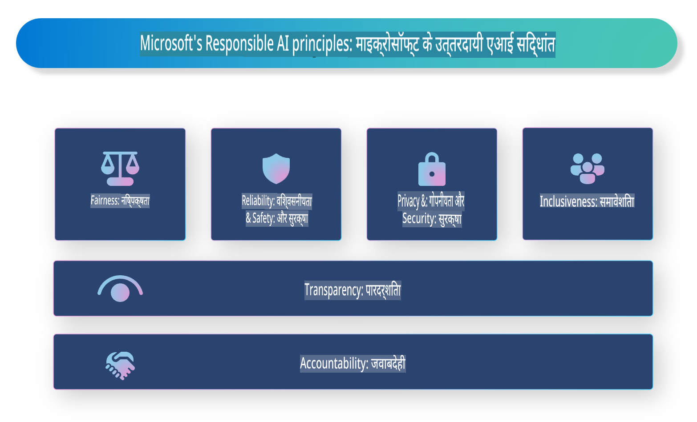

# **जिम्मेदार AI का परिचय**

[Microsoft Responsible AI](https://www.microsoft.com/ai/responsible-ai?WT.mc_id=aiml-138114-kinfeylo) एक पहल है जिसका उद्देश्य डेवलपर्स और संगठनों को ऐसे AI सिस्टम बनाने में मदद करना है जो पारदर्शी, भरोसेमंद और उत्तरदायी हों। यह पहल नैतिक सिद्धांतों जैसे कि गोपनीयता, निष्पक्षता और पारदर्शिता के अनुरूप जिम्मेदार AI समाधान विकसित करने के लिए मार्गदर्शन और संसाधन प्रदान करती है। हम जिम्मेदार AI सिस्टम बनाने से जुड़ी कुछ चुनौतियों और सर्वोत्तम प्रथाओं का भी अन्वेषण करेंगे।

## Microsoft Responsible AI का अवलोकन

**नैतिक सिद्धांत**

Microsoft Responsible AI गोपनीयता, निष्पक्षता, पारदर्शिता, उत्तरदायित्व और सुरक्षा जैसे नैतिक सिद्धांतों द्वारा निर्देशित है। ये सिद्धांत यह सुनिश्चित करने के लिए डिज़ाइन किए गए हैं कि AI सिस्टम नैतिक और जिम्मेदार तरीके से विकसित किए जाएं।

**पारदर्शी AI**

Microsoft Responsible AI AI सिस्टम में पारदर्शिता के महत्व पर जोर देता है। इसमें यह सुनिश्चित करना शामिल है कि AI मॉडल कैसे काम करते हैं, इसकी स्पष्ट व्याख्या प्रदान की जाए, साथ ही डेटा स्रोत और एल्गोरिदम सार्वजनिक रूप से उपलब्ध हों।

**उत्तरदायी AI**

[Microsoft Responsible AI](https://www.microsoft.com/ai/responsible-ai?WT.mc_id=aiml-138114-kinfeylo) उत्तरदायी AI सिस्टम के विकास को बढ़ावा देता है, जो यह अंतर्दृष्टि प्रदान कर सकते हैं कि AI मॉडल निर्णय कैसे लेते हैं। इससे उपयोगकर्ताओं को AI सिस्टम के परिणामों को समझने और उन पर भरोसा करने में मदद मिल सकती है।

**समावेशिता**

AI सिस्टम को सभी के लिए फायदेमंद बनाया जाना चाहिए। Microsoft ऐसा समावेशी AI बनाने का लक्ष्य रखता है जो विविध दृष्टिकोणों को ध्यान में रखता है और पूर्वाग्रह या भेदभाव से बचता है।

**विश्वसनीयता और सुरक्षा**

AI सिस्टम का विश्वसनीय और सुरक्षित होना अत्यंत महत्वपूर्ण है। Microsoft मजबूत मॉडल बनाने पर ध्यान केंद्रित करता है जो लगातार प्रदर्शन करते हैं और हानिकारक परिणामों से बचते हैं।

**AI में निष्पक्षता**

Microsoft Responsible AI यह मानता है कि AI सिस्टम पूर्वाग्रहों को बढ़ावा दे सकते हैं यदि उन्हें पूर्वाग्रहपूर्ण डेटा या एल्गोरिदम पर प्रशिक्षित किया गया हो। यह पहल ऐसे निष्पक्ष AI सिस्टम विकसित करने के लिए मार्गदर्शन प्रदान करती है जो जाति, लिंग या आयु जैसे कारकों के आधार पर भेदभाव नहीं करते।

**गोपनीयता और सुरक्षा**

Microsoft Responsible AI AI सिस्टम में उपयोगकर्ता गोपनीयता और डेटा सुरक्षा की सुरक्षा के महत्व पर जोर देता है। इसमें मजबूत डेटा एन्क्रिप्शन और एक्सेस नियंत्रण को लागू करना, साथ ही कमजोरियों के लिए AI सिस्टम का नियमित रूप से ऑडिट करना शामिल है।

**उत्तरदायित्व और जिम्मेदारी**

Microsoft Responsible AI AI के विकास और परिनियोजन में उत्तरदायित्व और जिम्मेदारी को बढ़ावा देता है। इसमें यह सुनिश्चित करना शामिल है कि डेवलपर्स और संगठन AI सिस्टम से जुड़े संभावित जोखिमों के बारे में जागरूक हों और उन जोखिमों को कम करने के लिए कदम उठाएं।

## जिम्मेदार AI सिस्टम बनाने के लिए सर्वोत्तम प्रथाएं

**विविध डेटा सेट का उपयोग करके AI मॉडल विकसित करें**

AI सिस्टम में पूर्वाग्रह से बचने के लिए, यह महत्वपूर्ण है कि ऐसे विविध डेटा सेट का उपयोग किया जाए जो विभिन्न दृष्टिकोणों और अनुभवों का प्रतिनिधित्व करते हों।

**स्पष्ट AI तकनीकों का उपयोग करें**

स्पष्ट AI तकनीकें उपयोगकर्ताओं को यह समझने में मदद कर सकती हैं कि AI मॉडल निर्णय कैसे लेते हैं, जिससे सिस्टम पर विश्वास बढ़ सकता है।

**AI सिस्टम का नियमित रूप से ऑडिट करें**

AI सिस्टम का नियमित ऑडिट संभावित जोखिमों और कमजोरियों की पहचान करने में मदद कर सकता है जिन्हें संबोधित करने की आवश्यकता है।

**मजबूत डेटा एन्क्रिप्शन और एक्सेस नियंत्रण लागू करें**

डेटा एन्क्रिप्शन और एक्सेस नियंत्रण AI सिस्टम में उपयोगकर्ता की गोपनीयता और सुरक्षा की रक्षा करने में मदद कर सकते हैं।

**AI विकास में नैतिक सिद्धांतों का पालन करें**

निष्पक्षता, पारदर्शिता और उत्तरदायित्व जैसे नैतिक सिद्धांतों का पालन करने से AI सिस्टम में विश्वास बढ़ाने और उन्हें जिम्मेदार तरीके से विकसित करने में मदद मिल सकती है।

## जिम्मेदार AI के लिए AI Foundry का उपयोग करना

[Azure AI Foundry](https://ai.azure.com?WT.mc_id=aiml-138114-kinfeylo) एक शक्तिशाली प्लेटफ़ॉर्म है जो डेवलपर्स और संगठनों को बुद्धिमान, अत्याधुनिक, बाजार के लिए तैयार और जिम्मेदार एप्लिकेशन तेजी से बनाने की अनुमति देता है। Azure AI Foundry की कुछ प्रमुख विशेषताएं और क्षमताएं निम्नलिखित हैं:

**तैयार APIs और मॉडल**

Azure AI Foundry पूर्व-निर्मित और अनुकूलन योग्य APIs और मॉडल प्रदान करता है। ये AI कार्यों की एक विस्तृत श्रृंखला को कवर करते हैं, जिनमें जनरेटिव AI, बातचीत के लिए प्राकृतिक भाषा प्रसंस्करण, खोज, निगरानी, अनुवाद, भाषण, दृष्टि और निर्णय लेना शामिल हैं।

**प्रॉम्प्ट फ्लो**

Azure AI Foundry में प्रॉम्प्ट फ्लो आपको संवादात्मक AI अनुभव बनाने की अनुमति देता है। यह आपको संवादात्मक प्रवाह डिज़ाइन और प्रबंधित करने देता है, जिससे चैटबॉट्स, वर्चुअल असिस्टेंट्स और अन्य इंटरैक्टिव एप्लिकेशन बनाना आसान हो जाता है।

**रिट्रीवल ऑगमेंटेड जनरेशन (RAG)**

RAG एक तकनीक है जो रिट्रीवल-आधारित और जनरेटिव-आधारित दृष्टिकोणों को जोड़ती है। यह पूर्व-विद्यमान ज्ञान (रिट्रीवल) और रचनात्मक पीढ़ी (जनरेशन) दोनों का लाभ उठाकर उत्पन्न प्रतिक्रियाओं की गुणवत्ता को बढ़ाता है।

**जनरेटिव AI के लिए मूल्यांकन और निगरानी मेट्रिक्स**

Azure AI Foundry जनरेटिव AI मॉडलों के मूल्यांकन और निगरानी के लिए उपकरण प्रदान करता है। आप उनके प्रदर्शन, निष्पक्षता और अन्य महत्वपूर्ण मेट्रिक्स का आकलन कर सकते हैं ताकि जिम्मेदार परिनियोजन सुनिश्चित किया जा सके। इसके अलावा, यदि आपने एक डैशबोर्ड बनाया है, तो आप Azure Machine Learning Studio में नो-कोड UI का उपयोग करके Responsible AI Dashboard और संबंधित स्कोरकार्ड को अनुकूलित और उत्पन्न कर सकते हैं, जो [Responsible AI Toolbox](https://responsibleaitoolbox.ai/?WT.mc_id=aiml-138114-kinfeylo) Python लाइब्रेरी पर आधारित है। यह स्कोरकार्ड तकनीकी और गैर-तकनीकी हितधारकों के साथ निष्पक्षता, फीचर महत्व और अन्य जिम्मेदार परिनियोजन विचारों से संबंधित प्रमुख अंतर्दृष्टि साझा करने में मदद करता है।

जिम्मेदार AI के साथ AI Foundry का उपयोग करने के लिए, आप इन सर्वोत्तम प्रथाओं का पालन कर सकते हैं:

**अपने AI सिस्टम की समस्या और उद्देश्य को परिभाषित करें**

विकास प्रक्रिया शुरू करने से पहले, यह स्पष्ट रूप से परिभाषित करना महत्वपूर्ण है कि आपका AI सिस्टम किस समस्या को हल करने या उद्देश्य को प्राप्त करने का प्रयास कर रहा है। इससे आपको प्रभावी मॉडल बनाने के लिए आवश्यक डेटा, एल्गोरिदम और संसाधनों की पहचान करने में मदद मिलेगी।

**संबंधित डेटा एकत्र करें और पूर्व-प्रसंस्कृत करें**

AI सिस्टम के प्रशिक्षण में उपयोग किए गए डेटा की गुणवत्ता और मात्रा इसके प्रदर्शन पर महत्वपूर्ण प्रभाव डाल सकती है। इसलिए, प्रासंगिक डेटा एकत्र करना, उसे साफ करना, पूर्व-प्रसंस्कृत करना और यह सुनिश्चित करना महत्वपूर्ण है कि यह उस जनसंख्या या समस्या का प्रतिनिधित्व करता हो जिसे आप हल करने का प्रयास कर रहे हैं।

**उपयुक्त मूल्यांकन चुनें**

विभिन्न मूल्यांकन एल्गोरिदम उपलब्ध हैं। यह महत्वपूर्ण है कि अपने डेटा और समस्या के आधार पर सबसे उपयुक्त एल्गोरिदम का चयन करें।

**मॉडल का मूल्यांकन और व्याख्या करें**

एक बार जब आपने AI मॉडल बना लिया है, तो इसके प्रदर्शन का उपयुक्त मेट्रिक्स का उपयोग करके मूल्यांकन करना और परिणामों को पारदर्शी तरीके से व्याख्या करना महत्वपूर्ण है। इससे आपको मॉडल में किसी भी पूर्वाग्रह या सीमाओं की पहचान करने और आवश्यकतानुसार सुधार करने में मदद मिलेगी।

**पारदर्शिता और व्याख्यात्मकता सुनिश्चित करें**

AI सिस्टम पारदर्शी और व्याख्यात्मक होने चाहिए ताकि उपयोगकर्ता समझ सकें कि वे कैसे काम करते हैं और निर्णय कैसे लिए जाते हैं। यह विशेष रूप से उन अनुप्रयोगों के लिए महत्वपूर्ण है जिनका मानव जीवन पर महत्वपूर्ण प्रभाव पड़ता है, जैसे स्वास्थ्य देखभाल, वित्त और कानूनी प्रणाली।

**मॉडल की निगरानी और अपडेट करें**

AI सिस्टम को लगातार निगरानी और अपडेट किया जाना चाहिए ताकि यह सुनिश्चित किया जा सके कि वे समय के साथ सटीक और प्रभावी बने रहें। इसके लिए मॉडल का निरंतर रखरखाव, परीक्षण और पुनः प्रशिक्षण आवश्यक है।

अंत में, Microsoft Responsible AI एक पहल है जिसका उद्देश्य डेवलपर्स और संगठनों को पारदर्शी, भरोसेमंद और उत्तरदायी AI सिस्टम बनाने में मदद करना है। याद रखें कि जिम्मेदार AI कार्यान्वयन महत्वपूर्ण है, और Azure AI Foundry इसे संगठनों के लिए व्यावहारिक बनाने का प्रयास करता है। नैतिक सिद्धांतों और सर्वोत्तम प्रथाओं का पालन करके, हम यह सुनिश्चित कर सकते हैं कि AI सिस्टम जिम्मेदार तरीके से विकसित और तैनात किए जाएं, जिससे समाज को समग्र रूप से लाभ हो।

**अस्वीकरण**:  
यह दस्तावेज़ मशीन-आधारित एआई अनुवाद सेवाओं का उपयोग करके अनुवादित किया गया है। जबकि हम सटीकता के लिए प्रयास करते हैं, कृपया ध्यान दें कि स्वचालित अनुवादों में त्रुटियां या गलतियां हो सकती हैं। मूल भाषा में मूल दस्तावेज़ को प्रामाणिक स्रोत माना जाना चाहिए। महत्वपूर्ण जानकारी के लिए, पेशेवर मानव अनुवाद की सिफारिश की जाती है। इस अनुवाद के उपयोग से उत्पन्न किसी भी गलतफहमी या गलत व्याख्या के लिए हम जिम्मेदार नहीं हैं।  