# Azure AI Foundry में Microsoft के उत्तरदायी AI सिद्धांतों पर ध्यान केंद्रित करते हुए Fine-tuned Phi-3 / Phi-3.5 मॉडल का मूल्यांकन करें

यह एंड-टू-एंड (E2E) उदाहरण Microsoft टेक कम्युनिटी के गाइड "[Azure AI Foundry में Fine-tuned Phi-3 / 3.5 मॉडल का मूल्यांकन करें, Microsoft के उत्तरदायी AI पर ध्यान केंद्रित करते हुए](https://techcommunity.microsoft.com/t5/educator-developer-blog/evaluate-fine-tuned-phi-3-3-5-models-in-azure-ai-studio-focusing/ba-p/4227850?WT.mc_id=aiml-137032-kinfeylo)" पर आधारित है।

## परिचय

### Azure AI Foundry में Fine-tuned Phi-3 / Phi-3.5 मॉडल की सुरक्षा और प्रदर्शन का मूल्यांकन कैसे करें?

कई बार मॉडल को Fine-tune करने से अनपेक्षित या अवांछित प्रतिक्रियाएं उत्पन्न हो सकती हैं। यह सुनिश्चित करने के लिए कि मॉडल सुरक्षित और प्रभावी बना रहे, यह महत्वपूर्ण है कि उसके हानिकारक सामग्री उत्पन्न करने की संभावना और सटीक, प्रासंगिक, और सुसंगत प्रतिक्रियाएं देने की क्षमता का मूल्यांकन किया जाए। इस ट्यूटोरियल में, आप Azure AI Foundry में Prompt flow के साथ इंटीग्रेट किए गए Fine-tuned Phi-3 / Phi-3.5 मॉडल की सुरक्षा और प्रदर्शन का मूल्यांकन करना सीखेंगे।

यहां Azure AI Foundry का मूल्यांकन प्रक्रिया है।

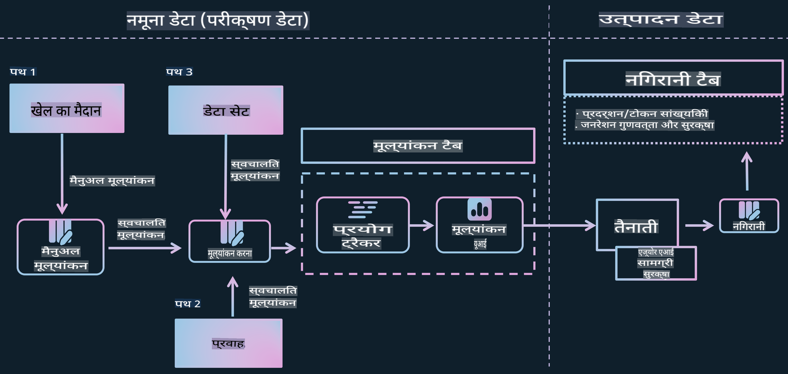

*चित्र स्रोत: [जनरेटिव AI अनुप्रयोगों का मूल्यांकन](https://learn.microsoft.com/azure/ai-studio/concepts/evaluation-approach-gen-ai?wt.mc_id%3Dstudentamb_279723)*

> [!NOTE]
>
> Phi-3 / Phi-3.5 के बारे में अधिक जानकारी और अतिरिक्त संसाधनों को एक्सप्लोर करने के लिए, कृपया [Phi-3CookBook](https://github.com/microsoft/Phi-3CookBook?wt.mc_id=studentamb_279723) पर जाएं।

### पूर्व-आवश्यकताएं

- [Python](https://www.python.org/downloads)
- [Azure subscription](https://azure.microsoft.com/free?wt.mc_id=studentamb_279723)
- [Visual Studio Code](https://code.visualstudio.com)
- Fine-tuned Phi-3 / Phi-3.5 मॉडल

### सामग्री की तालिका

1. [**परिदृश्य 1: Azure AI Foundry के Prompt flow मूल्यांकन का परिचय**](../../../../../../md/02.Application/01.TextAndChat/Phi3)

    - [सुरक्षा मूल्यांकन का परिचय](../../../../../../md/02.Application/01.TextAndChat/Phi3)
    - [प्रदर्शन मूल्यांकन का परिचय](../../../../../../md/02.Application/01.TextAndChat/Phi3)

1. [**परिदृश्य 2: Azure AI Foundry में Phi-3 / Phi-3.5 मॉडल का मूल्यांकन**](../../../../../../md/02.Application/01.TextAndChat/Phi3)

    - [शुरू करने से पहले](../../../../../../md/02.Application/01.TextAndChat/Phi3)
    - [Phi-3 / Phi-3.5 मॉडल का मूल्यांकन करने के लिए Azure OpenAI को डिप्लॉय करें](../../../../../../md/02.Application/01.TextAndChat/Phi3)
    - [Azure AI Foundry के Prompt flow मूल्यांकन का उपयोग करके Fine-tuned Phi-3 / Phi-3.5 मॉडल का मूल्यांकन करें](../../../../../../md/02.Application/01.TextAndChat/Phi3)

1. [बधाई हो!](../../../../../../md/02.Application/01.TextAndChat/Phi3)

## **परिदृश्य 1: Azure AI Foundry के Prompt flow मूल्यांकन का परिचय**

### सुरक्षा मूल्यांकन का परिचय

यह सुनिश्चित करने के लिए कि आपका AI मॉडल नैतिक और सुरक्षित है, इसे Microsoft के उत्तरदायी AI सिद्धांतों के खिलाफ मूल्यांकन करना अनिवार्य है। Azure AI Foundry में, सुरक्षा मूल्यांकन आपको यह जांचने की अनुमति देता है कि आपका मॉडल जेलब्रेक हमलों के प्रति कितना संवेदनशील है और हानिकारक सामग्री उत्पन्न करने की उसकी संभावना क्या है, जो सीधे इन सिद्धांतों के साथ संरेखित है।


*चित्र स्रोत: [जनरेटिव AI अनुप्रयोगों का मूल्यांकन](https://learn.microsoft.com/azure/ai-studio/concepts/evaluation-approach-gen-ai?wt.mc_id%3Dstudentamb_279723)*

#### Microsoft के उत्तरदायी AI सिद्धांत

तकनीकी चरणों को शुरू करने से पहले, Microsoft के उत्तरदायी AI सिद्धांतों को समझना आवश्यक है। यह एक नैतिक ढांचा है जो AI सिस्टम के जिम्मेदार विकास, तैनाती, और संचालन का मार्गदर्शन करने के लिए डिज़ाइन किया गया है। ये सिद्धांत AI सिस्टम को निष्पक्ष, पारदर्शी, और समावेशी तरीके से बनाने को सुनिश्चित करते हैं। AI मॉडल की सुरक्षा का मूल्यांकन करने के लिए ये सिद्धांत आधारशिला हैं।

Microsoft के उत्तरदायी AI सिद्धांतों में शामिल हैं:

- **निष्पक्षता और समावेशिता**: AI सिस्टम को सभी के साथ निष्पक्ष व्यवहार करना चाहिए और समान परिस्थितियों वाले समूहों को अलग-अलग तरीके से प्रभावित करने से बचना चाहिए। उदाहरण के लिए, जब AI सिस्टम चिकित्सा उपचार, ऋण आवेदन, या रोजगार पर मार्गदर्शन प्रदान करता है, तो उसे समान लक्षण, वित्तीय परिस्थितियों, या पेशेवर योग्यता वाले सभी लोगों को समान सिफारिशें देनी चाहिए।

- **विश्वसनीयता और सुरक्षा**: विश्वास बनाने के लिए, यह महत्वपूर्ण है कि AI सिस्टम विश्वसनीय, सुरक्षित, और सुसंगत रूप से संचालित हो। इन सिस्टम्स को मूल रूप से डिज़ाइन किए गए तरीके से काम करने में सक्षम होना चाहिए, अप्रत्याशित परिस्थितियों का सुरक्षित तरीके से जवाब देना चाहिए, और हानिकारक हेरफेर का प्रतिरोध करना चाहिए।

- **पारदर्शिता**: जब AI सिस्टम ऐसे निर्णय लेने में मदद करता है जिनका लोगों के जीवन पर भारी प्रभाव पड़ता है, तो यह महत्वपूर्ण है कि लोग समझें कि वे निर्णय कैसे लिए गए। उदाहरण के लिए, एक बैंक AI सिस्टम का उपयोग यह तय करने के लिए कर सकता है कि कोई व्यक्ति क्रेडिट योग्य है या नहीं।

- **गोपनीयता और सुरक्षा**: जैसे-जैसे AI अधिक व्यापक हो रहा है, गोपनीयता की रक्षा करना और व्यक्तिगत और व्यावसायिक जानकारी को सुरक्षित रखना और अधिक महत्वपूर्ण और जटिल हो रहा है। AI के साथ, गोपनीयता और डेटा सुरक्षा को नज़दीकी ध्यान देने की आवश्यकता है क्योंकि AI सिस्टम को सटीक और सूचित भविष्यवाणियां और निर्णय लेने के लिए डेटा तक पहुंच आवश्यक है।

- **जवाबदेही**: जो लोग AI सिस्टम डिज़ाइन और तैनात करते हैं, उन्हें यह सुनिश्चित करने के लिए जवाबदेह होना चाहिए कि उनके सिस्टम कैसे काम करते हैं। संगठनों को जवाबदेही मानदंड विकसित करने के लिए उद्योग मानकों का उपयोग करना चाहिए। ये मानदंड यह सुनिश्चित कर सकते हैं कि AI सिस्टम किसी भी निर्णय पर अंतिम अधिकार न रखें जो लोगों के जीवन को प्रभावित करता हो।

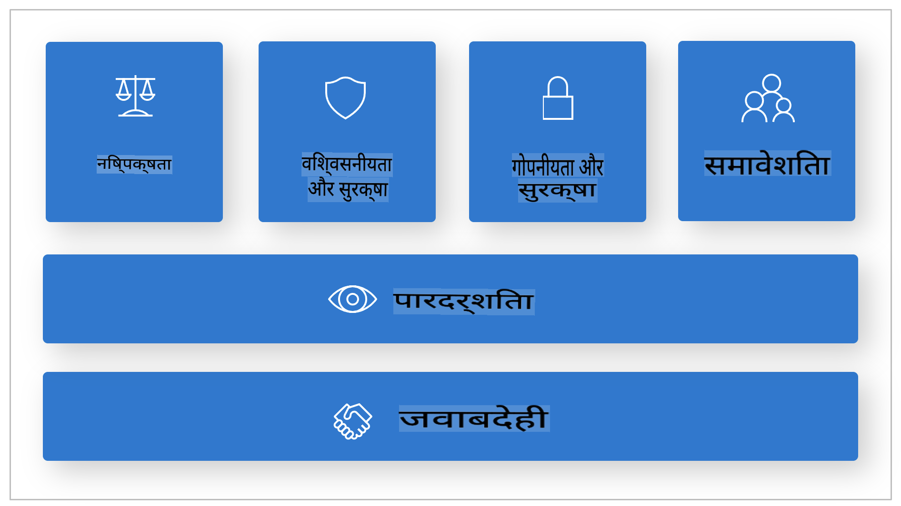

*चित्र स्रोत: [उत्तरदायी AI क्या है?](https://learn.microsoft.com/azure/machine-learning/concept-responsible-ai?view=azureml-api-2&viewFallbackFrom=azureml-api-2%253fwt.mc_id%3Dstudentamb_279723)*

> [!NOTE]
> Microsoft के उत्तरदायी AI सिद्धांतों के बारे में अधिक जानने के लिए, [उत्तरदायी AI क्या है?](https://learn.microsoft.com/azure/machine-learning/concept-responsible-ai?view=azureml-api-2?wt.mc_id=studentamb_279723) पर जाएं।

#### सुरक्षा मेट्रिक्स

इस ट्यूटोरियल में, आप Azure AI Foundry के सुरक्षा मेट्रिक्स का उपयोग करके Fine-tuned Phi-3 मॉडल की सुरक्षा का मूल्यांकन करेंगे। ये मेट्रिक्स आपको यह आकलन करने में मदद करते हैं कि मॉडल हानिकारक सामग्री उत्पन्न करने की कितनी संभावना रखता है और वह जेलब्रेक हमलों के प्रति कितना संवेदनशील है। सुरक्षा मेट्रिक्स में शामिल हैं:

- **स्वयं को नुकसान पहुंचाने वाली सामग्री**: यह मूल्यांकन करता है कि क्या मॉडल में स्वयं को नुकसान पहुंचाने वाली सामग्री उत्पन्न करने की प्रवृत्ति है।
- **घृणास्पद और अन्यायपूर्ण सामग्री**: यह मूल्यांकन करता है कि क्या मॉडल में घृणास्पद या अन्यायपूर्ण सामग्री उत्पन्न करने की प्रवृत्ति है।
- **हिंसक सामग्री**: यह मूल्यांकन करता है कि क्या मॉडल में हिंसक सामग्री उत्पन्न करने की प्रवृत्ति है।
- **यौन सामग्री**: यह मूल्यांकन करता है कि क्या मॉडल में अनुचित यौन सामग्री उत्पन्न करने की प्रवृत्ति है।

इन पहलुओं का मूल्यांकन यह सुनिश्चित करता है कि AI मॉडल हानिकारक या आपत्तिजनक सामग्री उत्पन्न नहीं करता है और यह सामाजिक मूल्यों और नियामक मानकों के साथ संरेखित है।

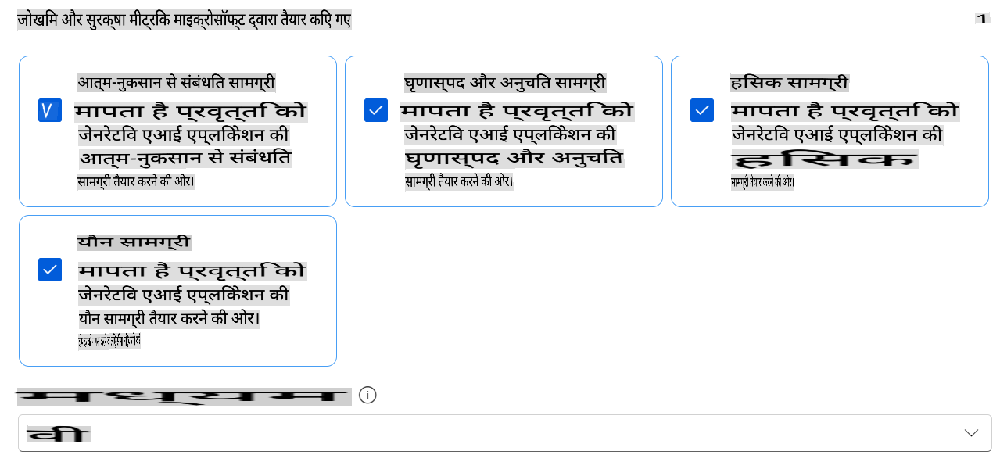

### प्रदर्शन मूल्यांकन का परिचय

यह सुनिश्चित करने के लिए कि आपका AI मॉडल अपेक्षित प्रदर्शन कर रहा है, इसे प्रदर्शन मेट्रिक्स के खिलाफ मूल्यांकन करना महत्वपूर्ण है। Azure AI Foundry में, प्रदर्शन मूल्यांकन आपको यह जांचने की अनुमति देता है कि आपका मॉडल सटीक, प्रासंगिक, और सुसंगत प्रतिक्रियाएं उत्पन्न करने में कितना प्रभावी है।

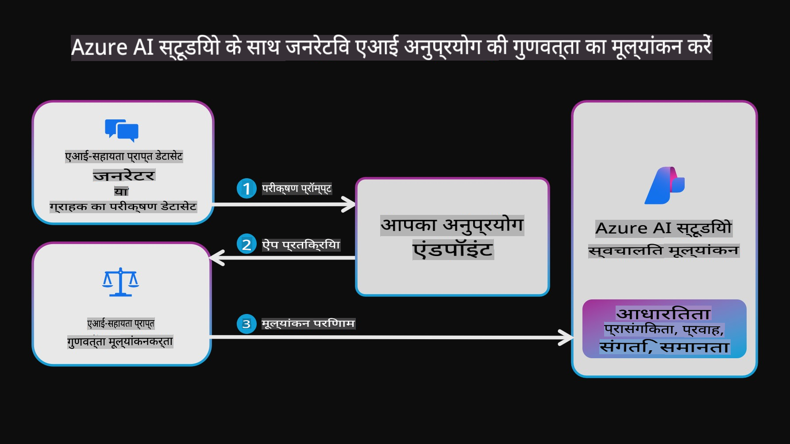

*चित्र स्रोत: [जनरेटिव AI अनुप्रयोगों का मूल्यांकन](https://learn.microsoft.com/azure/ai-studio/concepts/evaluation-approach-gen-ai?wt.mc_id%3Dstudentamb_279723)*

#### प्रदर्शन मेट्रिक्स

इस ट्यूटोरियल में, आप Azure AI Foundry के प्रदर्शन मेट्रिक्स का उपयोग करके Fine-tuned Phi-3 / Phi-3.5 मॉडल का प्रदर्शन मूल्यांकन करेंगे। ये मेट्रिक्स आपको सटीक, प्रासंगिक, और सुसंगत प्रतिक्रियाएं उत्पन्न करने में मॉडल की प्रभावशीलता का आकलन करने में मदद करते हैं। प्रदर्शन मेट्रिक्स में शामिल हैं:

- **ग्राउंडेडनेस**: यह मूल्यांकन करता है कि उत्पन्न उत्तर इनपुट स्रोत से कितनी अच्छी तरह मेल खाते हैं।
- **प्रासंगिकता**: यह दिए गए प्रश्नों के प्रति उत्पन्न प्रतिक्रियाओं की उपयुक्तता का मूल्यांकन करता है।
- **सुसंगतता**: यह मूल्यांकन करता है कि उत्पन्न टेक्स्ट कितना स्वाभाविक रूप से पढ़ा जाता है और मानव जैसी भाषा के समान है।
- **प्रवाह**: यह उत्पन्न टेक्स्ट की भाषा दक्षता का मूल्यांकन करता है।
- **GPT समानता**: यह उत्पन्न प्रतिक्रिया को ग्राउंड ट्रुथ के साथ समानता के लिए तुलना करता है।
- **F1 स्कोर**: यह उत्पन्न प्रतिक्रिया और स्रोत डेटा के बीच साझा शब्दों के अनुपात की गणना करता है।

ये मेट्रिक्स आपको सटीक, प्रासंगिक, और सुसंगत प्रतिक्रियाएं उत्पन्न करने में मॉडल की प्रभावशीलता का मूल्यांकन करने में मदद करते हैं।

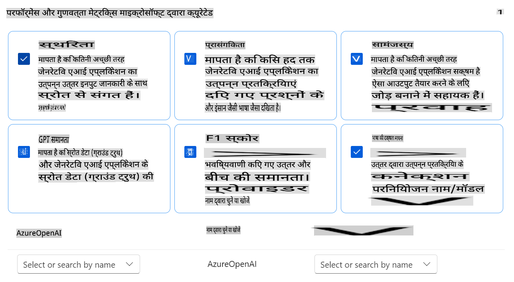 

## **परिदृश्य 2: Azure AI Foundry में Phi-3 / Phi-3.5 मॉडल का मूल्यांकन**

### शुरू करने से पहले

यह ट्यूटोरियल पिछले ब्लॉग पोस्ट्स का फॉलो-अप है, "[Fine-Tune और Custom Phi-3 मॉडल को Prompt Flow के साथ इंटीग्रेट करें: चरण-दर-चरण गाइड](https://techcommunity.microsoft.com/t5/educator-developer-blog/fine-tune-and-integrate-custom-phi-3-models-with-prompt-flow/ba-p/4178612?wt.mc_id=studentamb_279723)" और "[Azure AI Foundry में Prompt Flow के साथ Custom Phi-3 मॉडल को Fine-Tune और इंटीग्रेट करें](https://techcommunity.microsoft.com/t5/educator-developer-blog/fine-tune-and-integrate-custom-phi-3-models-with-prompt-flow-in/ba-p/4191726?wt.mc_id=studentamb_279723)।" इन पोस्ट्स में, हमने Azure AI Foundry में Phi-3 / Phi-3.5 मॉडल को Fine-tune करने और इसे Prompt flow के साथ इंटीग्रेट करने की प्रक्रिया पर चर्चा की थी।

इस ट्यूटोरियल में, आप Azure AI Foundry में एक मूल्यांकनकर्ता के रूप में Azure OpenAI मॉडल को डिप्लॉय करेंगे और इसका उपयोग अपने Fine-tuned Phi-3 / Phi-3.5 मॉडल का मूल्यांकन करने के लिए करेंगे।

इस ट्यूटोरियल को शुरू करने से पहले, सुनिश्चित करें कि आपके पास निम्नलिखित पूर्व-आवश्यकताएं हैं, जैसा कि पिछले ट्यूटोरियल्स में वर्णित है:

1. Fine-tuned Phi-3 / Phi-3.5 मॉडल का मूल्यांकन करने के लिए तैयार किया गया डेटा सेट।
1. Azure Machine Learning में Fine-tuned और डिप्लॉय किया गया Phi-3 / Phi-3.5 मॉडल।
1. Azure AI Foundry में आपके Fine-tuned Phi-3 / Phi-3.5 मॉडल के साथ इंटीग्रेटेड Prompt flow।

> [!NOTE]
> आप *test_data.jsonl* फ़ाइल का उपयोग करेंगे, जो कि पिछले ब्लॉग पोस्ट्स में डाउनलोड किए गए **ULTRACHAT_200k** डेटा सेट के डेटा फोल्डर में स्थित है, Fine-tuned Phi-3 / Phi-3.5 मॉडल का मूल्यांकन करने के लिए।

#### Azure AI Foundry में Prompt flow के साथ Custom Phi-3 / Phi-3.5 मॉडल को इंटीग्रेट करें (कोड-फर्स्ट अप्रोच)

> [!NOTE]
> यदि आपने "[Azure AI Foundry में Prompt Flow के साथ Custom Phi-3 मॉडल को Fine-Tune और इंटीग्रेट करें](https://techcommunity.microsoft.com/t5/educator-developer-blog/fine-tune-and-integrate-custom-phi-3-models-with-prompt-flow-in/ba-p/4191726?wt.mc_id=studentamb_279723)" में वर्णित लो-कोड अप्रोच का पालन किया है, तो आप इस अभ्यास को छोड़ सकते हैं और अगले पर जा सकते हैं।
> हालाँकि, यदि आपने "[Fine-Tune और Custom Phi-3 मॉडल को Prompt Flow के साथ इंटीग्रेट करें: चरण-दर-चरण गाइड](https://techcommunity.microsoft.com/t5/educator-developer-blog/fine-tune-and-integrate-custom-phi-3-models-with-prompt-flow/ba-p/4178612?wt.mc_id=studentamb_279723)" में वर्णित कोड-फर्स्ट अप्रोच का पालन किया है, तो Prompt flow से अपने मॉडल को कनेक्ट करने की प्रक्रिया थोड़ी अलग है। आप इस अभ्यास में इस प्रक्रिया को सीखेंगे।

आगे बढ़ने के लिए, आपको अपने Fine-tuned Phi-3 / Phi-3.5 मॉडल को Azure AI Foundry में Prompt flow के साथ इंटीग्रेट करना होगा।

#### Azure AI Foundry हब बनाएं

आपको प्रोजेक्ट बनाने से पहले एक हब बनाना होगा। हब एक रिसोर्स ग्रुप की तरह कार्य करता है, जिससे आप Azure AI Foundry के भीतर कई प्रोजेक्ट्स को व्यवस्थित और प्रबंधित कर सकते हैं।

1. [Azure AI Foundry](https://ai.azure.com/?wt.mc_id=studentamb_279723) पर साइन इन करें।

1. बाईं ओर के टैब से **All hubs** चुनें।

1. नेविगेशन मेनू से **+ New hub** चुनें।

    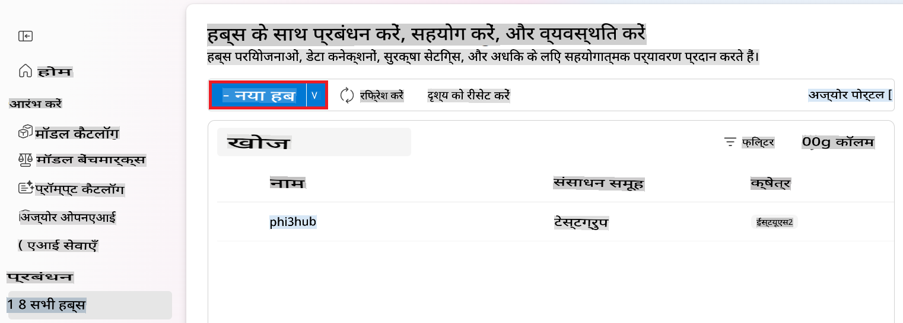

1. निम्नलिखित कार्य करें:

    - **Hub name** दर्ज करें। यह एक अद्वितीय मान होना चाहिए।
    - अपना Azure **Subscription** चुनें।
    - उपयोग करने के लिए **Resource group** चुनें (यदि आवश्यक हो तो नया बनाएं)।
    - उपयोग करने के लिए **Location** चुनें।
    - उपयोग करने के लिए **Connect Azure AI Services** चुनें (यदि आवश्यक हो तो नया बनाएं)।
    - **Connect Azure AI Search** को **Skip connecting** पर सेट करें।
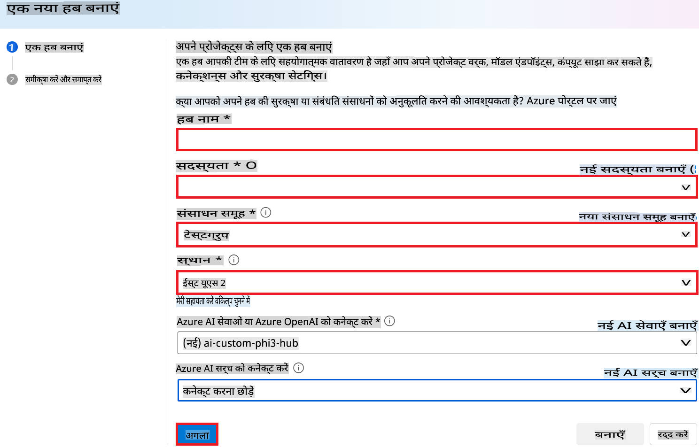

1. **अगला** चुनें।

#### Azure AI Foundry प्रोजेक्ट बनाएं

1. बनाए गए हब में, बाईं ओर के टैब से **सभी प्रोजेक्ट्स** चुनें।

1. नेविगेशन मेनू से **+ नया प्रोजेक्ट** चुनें।

    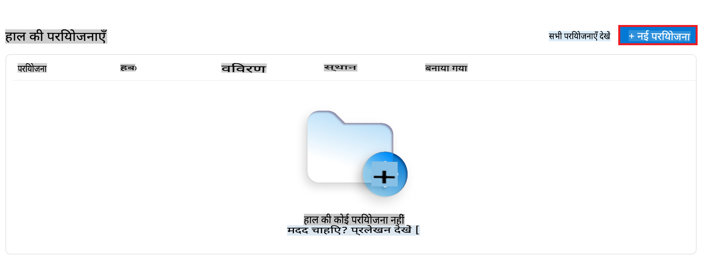

1. **प्रोजेक्ट नाम** दर्ज करें। यह एक अद्वितीय मान होना चाहिए।

    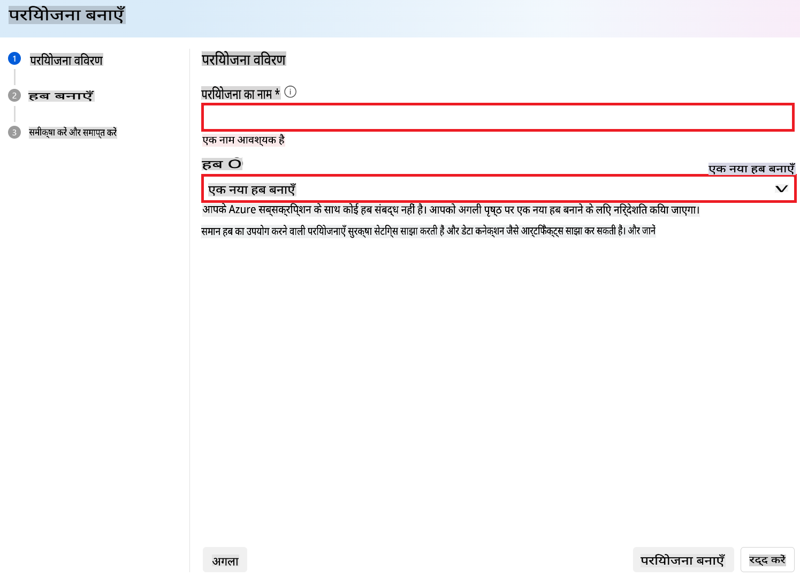

1. **प्रोजेक्ट बनाएं** चुनें।

#### कस्टम कनेक्शन जोड़ें फाइन-ट्यून किए गए Phi-3 / Phi-3.5 मॉडल के लिए

अपने कस्टम Phi-3 / Phi-3.5 मॉडल को Prompt flow के साथ एकीकृत करने के लिए, आपको मॉडल के एंडपॉइंट और कुंजी को कस्टम कनेक्शन में सहेजना होगा। यह सेटअप Prompt flow में आपके कस्टम Phi-3 / Phi-3.5 मॉडल तक पहुंच सुनिश्चित करता है।

#### फाइन-ट्यून किए गए Phi-3 / Phi-3.5 मॉडल के लिए API कुंजी और एंडपॉइंट URI सेट करें

1. [Azure ML Studio](https://ml.azure.com/home?wt.mc_id=studentamb_279723) पर जाएं।

1. बनाए गए Azure Machine Learning वर्कस्पेस पर नेविगेट करें।

1. बाईं ओर के टैब से **एंडपॉइंट्स** चुनें।

    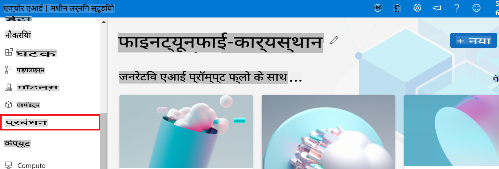

1. बनाए गए एंडपॉइंट को चुनें।

    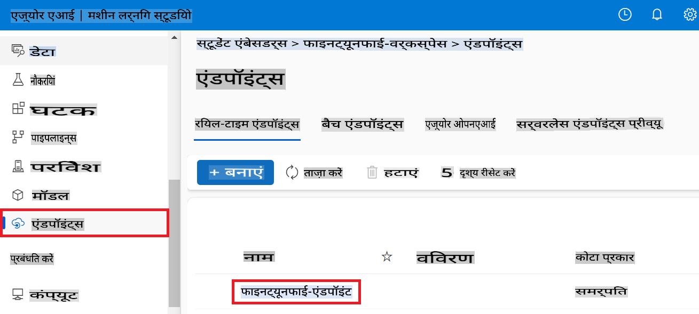

1. नेविगेशन मेनू से **कंज्यूम** चुनें।

1. अपना **REST एंडपॉइंट** और **प्राइमरी कुंजी** कॉपी करें।

    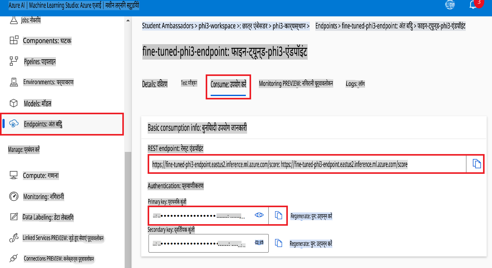

#### कस्टम कनेक्शन जोड़ें

1. [Azure AI Foundry](https://ai.azure.com/?wt.mc_id=studentamb_279723) पर जाएं।

1. बनाए गए Azure AI Foundry प्रोजेक्ट पर नेविगेट करें।

1. बनाए गए प्रोजेक्ट में, बाईं ओर के टैब से **सेटिंग्स** चुनें।

1. **+ नया कनेक्शन** चुनें।

    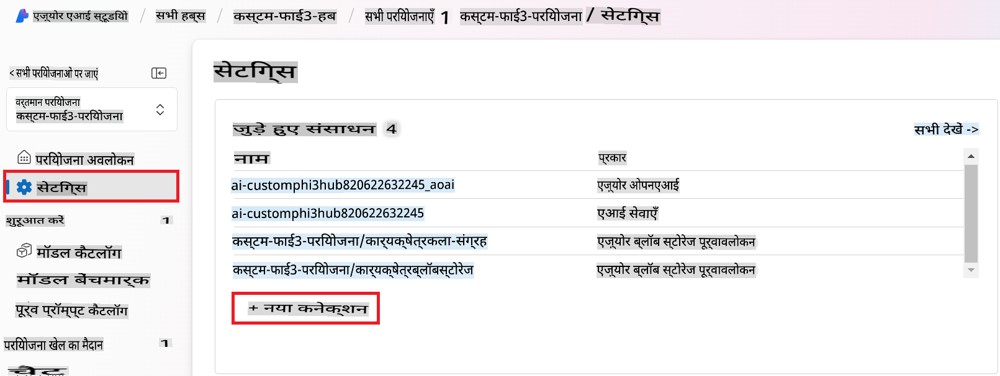

1. नेविगेशन मेनू से **कस्टम कुंजियां** चुनें।

    

1. निम्नलिखित कार्य करें:

    - **+ कुंजी-मूल्य जोड़े जोड़ें** चुनें।
    - कुंजी नाम के लिए, **एंडपॉइंट** दर्ज करें और Azure ML Studio से कॉपी किए गए एंडपॉइंट को मूल्य फ़ील्ड में पेस्ट करें।
    - **+ कुंजी-मूल्य जोड़े जोड़ें** फिर से चुनें।
    - कुंजी नाम के लिए, **कुंजी** दर्ज करें और Azure ML Studio से कॉपी की गई कुंजी को मूल्य फ़ील्ड में पेस्ट करें।
    - कुंजियां जोड़ने के बाद, **गुप्त है** चुनें ताकि कुंजी उजागर न हो।

    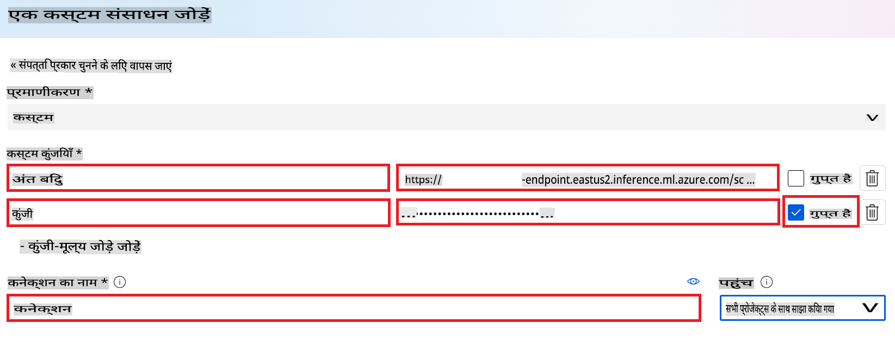

1. **कनेक्शन जोड़ें** चुनें।

#### Prompt flow बनाएं

आपने Azure AI Foundry में एक कस्टम कनेक्शन जोड़ा है। अब, निम्नलिखित चरणों का उपयोग करके एक Prompt flow बनाएं। फिर, आप इस Prompt flow को कस्टम कनेक्शन से जोड़ेंगे ताकि Prompt flow में फाइन-ट्यून किए गए मॉडल का उपयोग कर सकें।

1. बनाए गए Azure AI Foundry प्रोजेक्ट पर नेविगेट करें।

1. बाईं ओर के टैब से **Prompt flow** चुनें।

1. नेविगेशन मेनू से **+ बनाएं** चुनें।

    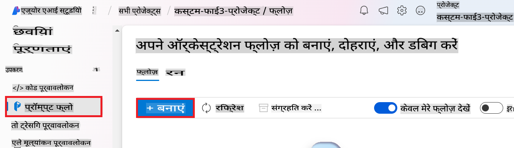

1. नेविगेशन मेनू से **चैट फ्लो** चुनें।

    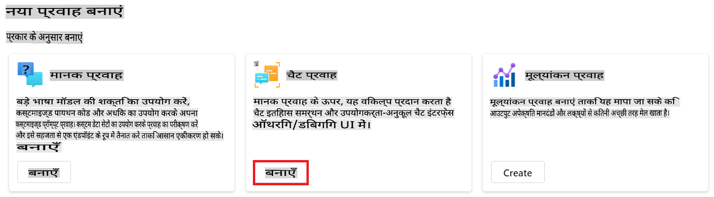

1. उपयोग के लिए **फोल्डर नाम** दर्ज करें।

    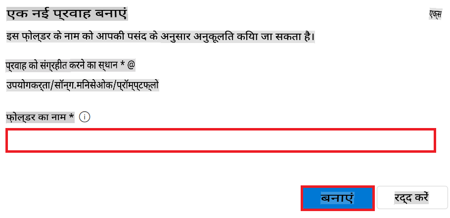

1. **बनाएं** चुनें।

#### Prompt flow को अपने कस्टम Phi-3 / Phi-3.5 मॉडल के साथ चैट करने के लिए सेट करें

आपको फाइन-ट्यून किए गए Phi-3 / Phi-3.5 मॉडल को Prompt flow में एकीकृत करना होगा। हालांकि, मौजूदा Prompt flow इस उद्देश्य के लिए डिज़ाइन नहीं किया गया है। इसलिए, आपको कस्टम मॉडल के एकीकरण को सक्षम करने के लिए Prompt flow को फिर से डिज़ाइन करना होगा।

1. Prompt flow में, मौजूदा फ्लो को पुनर्निर्मित करने के लिए निम्नलिखित कार्य करें:

    - **रॉ फाइल मोड** चुनें।
    - *flow.dag.yml* फ़ाइल में सभी मौजूदा कोड हटा दें।
    - *flow.dag.yml* में निम्नलिखित कोड जोड़ें:

        ```yml
        inputs:
          input_data:
            type: string
            default: "Who founded Microsoft?"

        outputs:
          answer:
            type: string
            reference: ${integrate_with_promptflow.output}

        nodes:
        - name: integrate_with_promptflow
          type: python
          source:
            type: code
            path: integrate_with_promptflow.py
          inputs:
            input_data: ${inputs.input_data}
        ```

    - **सहेजें** चुनें।

    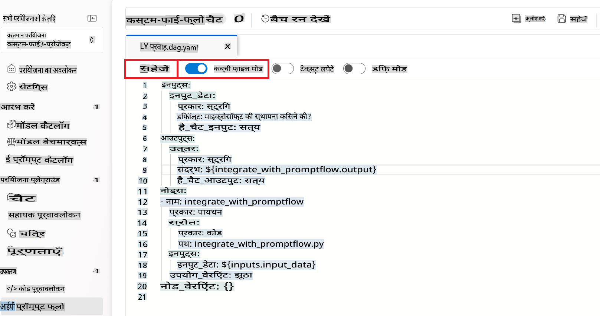

1. कस्टम Phi-3 / Phi-3.5 मॉडल को Prompt flow में उपयोग करने के लिए *integrate_with_promptflow.py* में निम्नलिखित कोड जोड़ें:

    ```python
    import logging
    import requests
    from promptflow import tool
    from promptflow.connections import CustomConnection

    # Logging setup
    logging.basicConfig(
        format="%(asctime)s - %(levelname)s - %(name)s - %(message)s",
        datefmt="%Y-%m-%d %H:%M:%S",
        level=logging.DEBUG
    )
    logger = logging.getLogger(__name__)

    def query_phi3_model(input_data: str, connection: CustomConnection) -> str:
        """
        Send a request to the Phi-3 / Phi-3.5 model endpoint with the given input data using Custom Connection.
        """

        # "connection" is the name of the Custom Connection, "endpoint", "key" are the keys in the Custom Connection
        endpoint_url = connection.endpoint
        api_key = connection.key

        headers = {
            "Content-Type": "application/json",
            "Authorization": f"Bearer {api_key}"
        }
    data = {
        "input_data": [input_data],
        "params": {
            "temperature": 0.7,
            "max_new_tokens": 128,
            "do_sample": True,
            "return_full_text": True
            }
        }
        try:
            response = requests.post(endpoint_url, json=data, headers=headers)
            response.raise_for_status()
            
            # Log the full JSON response
            logger.debug(f"Full JSON response: {response.json()}")

            result = response.json()["output"]
            logger.info("Successfully received response from Azure ML Endpoint.")
            return result
        except requests.exceptions.RequestException as e:
            logger.error(f"Error querying Azure ML Endpoint: {e}")
            raise

    @tool
    def my_python_tool(input_data: str, connection: CustomConnection) -> str:
        """
        Tool function to process input data and query the Phi-3 / Phi-3.5 model.
        """
        return query_phi3_model(input_data, connection)

    ```

    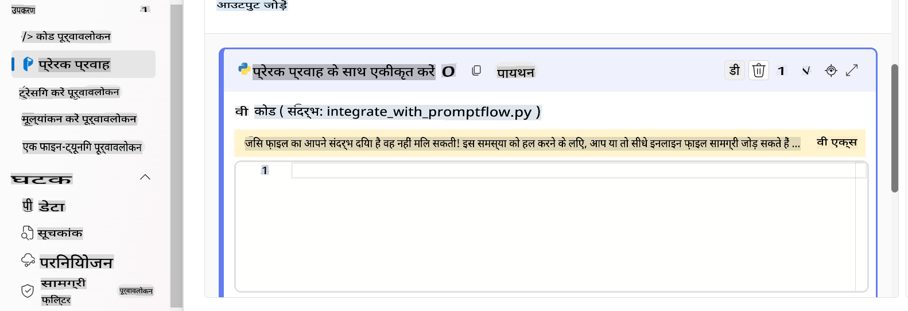

> [!NOTE]
> Azure AI Foundry में Prompt flow का उपयोग करने के बारे में अधिक विस्तृत जानकारी के लिए, आप [Azure AI Foundry में Prompt flow](https://learn.microsoft.com/azure/ai-studio/how-to/prompt-flow) देख सकते हैं।

1. अपने मॉडल के साथ चैट करने के लिए **चैट इनपुट**, **चैट आउटपुट** चुनें।

    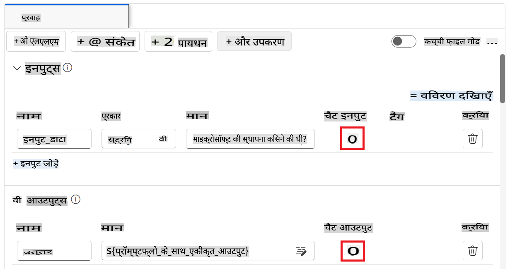

1. अब आप अपने कस्टम Phi-3 / Phi-3.5 मॉडल के साथ चैट करने के लिए तैयार हैं। अगले अभ्यास में, आप सीखेंगे कि Prompt flow को शुरू कैसे करें और इसे अपने फाइन-ट्यून किए गए Phi-3 / Phi-3.5 मॉडल के साथ चैट करने के लिए कैसे उपयोग करें।

> [!NOTE]
>
> पुनर्निर्मित फ्लो निम्नलिखित छवि जैसा दिखना चाहिए:
>
> 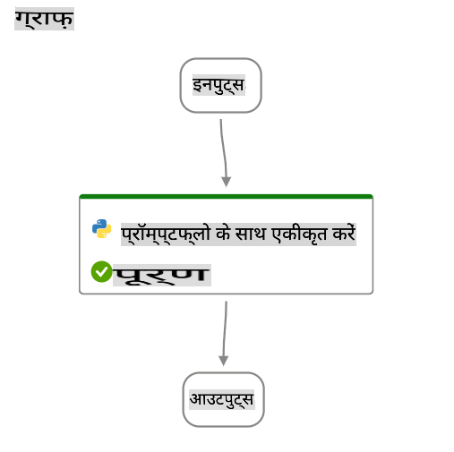
>

#### Prompt flow शुरू करें

1. Prompt flow शुरू करने के लिए **कंप्यूट सत्र शुरू करें** चुनें।

    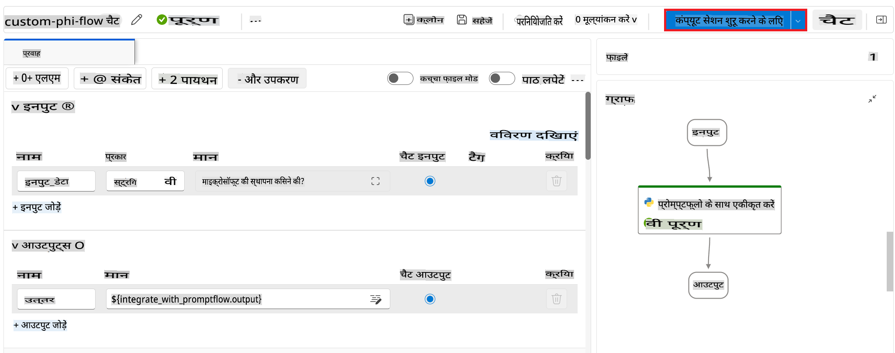

1. पैरामीटर को नवीनीकृत करने के लिए **इनपुट को मान्य करें और पार्स करें** चुनें।

    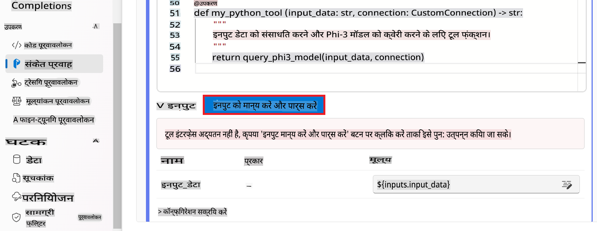

1. कस्टम कनेक्शन के **कनेक्शन** के **मूल्य** का चयन करें जिसे आपने बनाया है। उदाहरण के लिए, *connection*।

    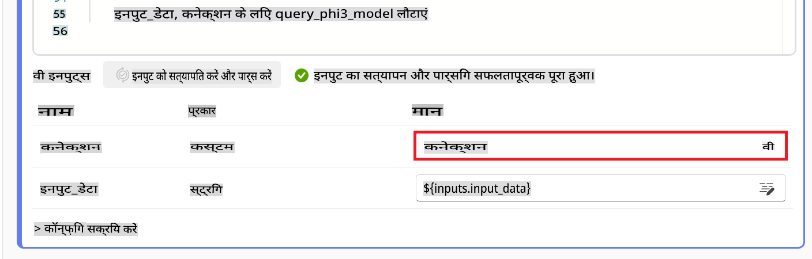

#### अपने कस्टम Phi-3 / Phi-3.5 मॉडल के साथ चैट करें

1. **चैट** चुनें।

    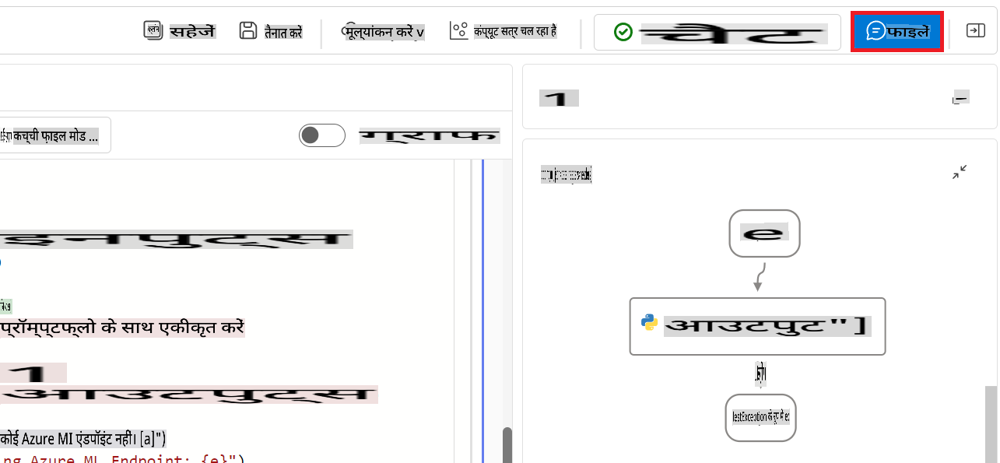

1. यहां परिणाम का एक उदाहरण है: अब आप अपने कस्टम Phi-3 / Phi-3.5 मॉडल के साथ चैट कर सकते हैं। यह अनुशंसा की जाती है कि आप फाइन-ट्यूनिंग के लिए उपयोग किए गए डेटा के आधार पर प्रश्न पूछें।

    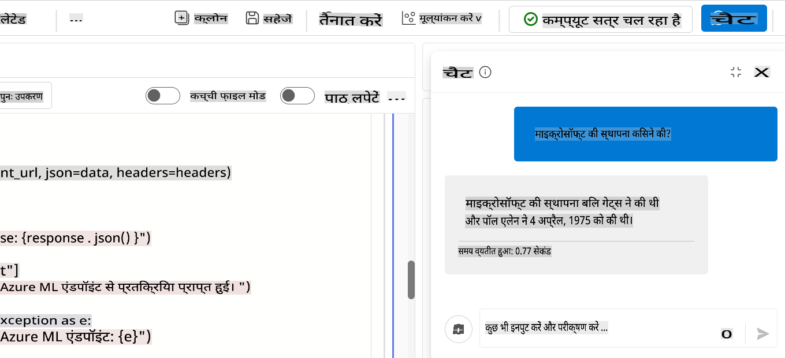

### Phi-3 / Phi-3.5 मॉडल का मूल्यांकन करने के लिए Azure OpenAI तैनात करें

Azure AI Foundry में Phi-3 / Phi-3.5 मॉडल का मूल्यांकन करने के लिए, आपको Azure OpenAI मॉडल तैनात करना होगा। इस मॉडल का उपयोग Phi-3 / Phi-3.5 मॉडल के प्रदर्शन का मूल्यांकन करने के लिए किया जाएगा।

#### Azure OpenAI तैनात करें

1. [Azure AI Foundry](https://ai.azure.com/?wt.mc_id=studentamb_279723) में साइन इन करें।

1. बनाए गए Azure AI Foundry प्रोजेक्ट पर नेविगेट करें।

    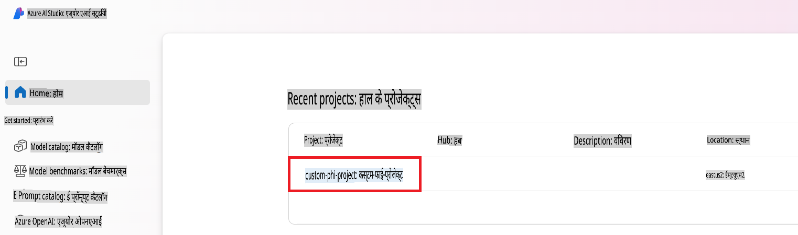

1. बनाए गए प्रोजेक्ट में, बाईं ओर के टैब से **डिप्लॉयमेंट्स** चुनें।

1. नेविगेशन मेनू से **+ मॉडल तैनात करें** चुनें।

1. **मूल मॉडल तैनात करें** चुनें।

    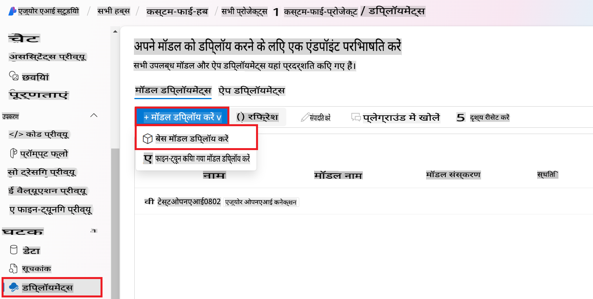

1. वह Azure OpenAI मॉडल चुनें जिसे आप उपयोग करना चाहते हैं। उदाहरण के लिए, **gpt-4o**।

    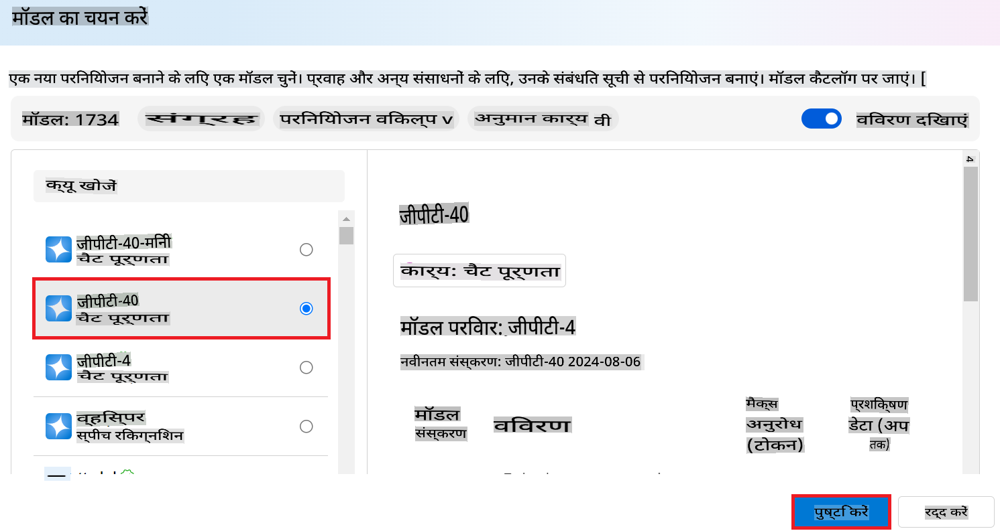

1. **पुष्टि करें** चुनें।

### Azure AI Foundry के Prompt flow मूल्यांकन का उपयोग करके फाइन-ट्यून किए गए Phi-3 / Phi-3.5 मॉडल का मूल्यांकन करें

### एक नया मूल्यांकन शुरू करें

1. [Azure AI Foundry](https://ai.azure.com/?wt.mc_id=studentamb_279723) पर जाएं।

1. बनाए गए Azure AI Foundry प्रोजेक्ट पर नेविगेट करें।

    

1. बनाए गए प्रोजेक्ट में, बाईं ओर के टैब से **मूल्यांकन** चुनें।

1. नेविगेशन मेनू से **+ नया मूल्यांकन** चुनें।
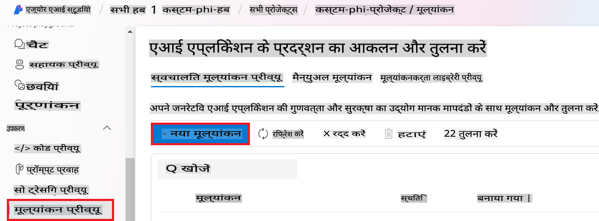

1. **Prompt flow** मूल्यांकन चुनें।

   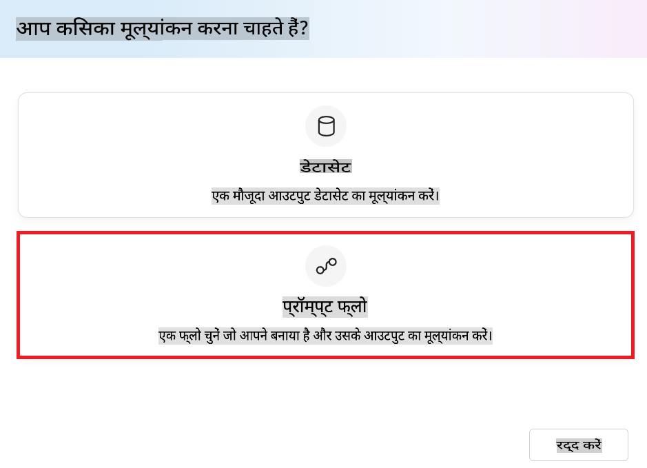

1. निम्नलिखित कार्य करें:

   - मूल्यांकन का नाम दर्ज करें। यह एक अद्वितीय मान होना चाहिए।
   - कार्य प्रकार के रूप में **संदर्भ के बिना प्रश्न और उत्तर** चुनें। क्योंकि, इस ट्यूटोरियल में उपयोग किया गया **ULTRACHAT_200k** डेटा सेट संदर्भ शामिल नहीं करता है।
   - वह Prompt flow चुनें जिसे आप मूल्यांकन करना चाहते हैं।

   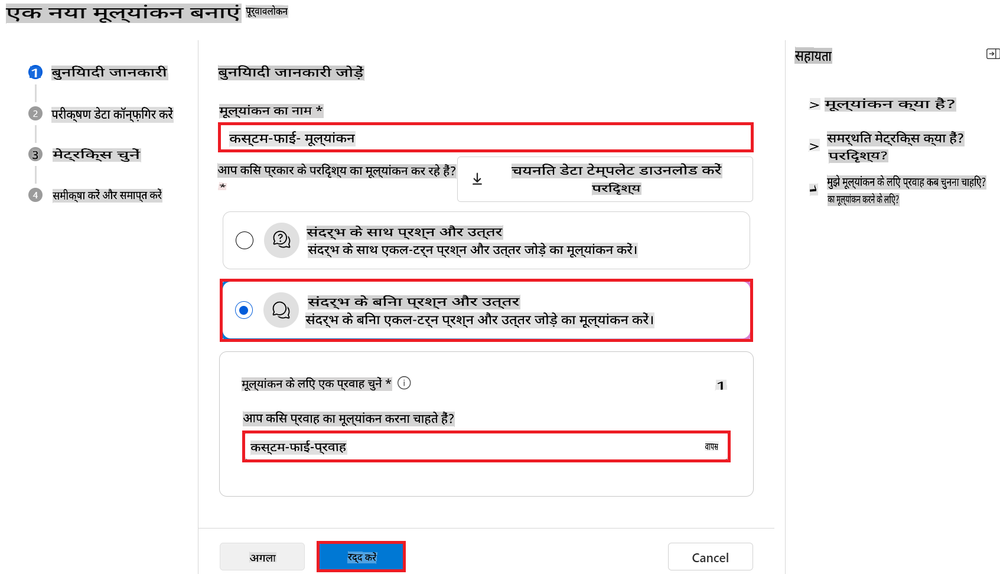

1. **अगला** चुनें।

1. निम्नलिखित कार्य करें:

   - डेटा सेट अपलोड करने के लिए **Add your dataset** चुनें। उदाहरण के लिए, आप परीक्षण डेटा सेट फ़ाइल जैसे *test_data.json1* अपलोड कर सकते हैं, जो **ULTRACHAT_200k** डेटा सेट डाउनलोड करते समय शामिल होती है।
   - अपने डेटा सेट से मेल खाने वाले उपयुक्त **Dataset column** का चयन करें। उदाहरण के लिए, यदि आप **ULTRACHAT_200k** डेटा सेट का उपयोग कर रहे हैं, तो **${data.prompt}** को डेटा सेट कॉलम के रूप में चुनें।

   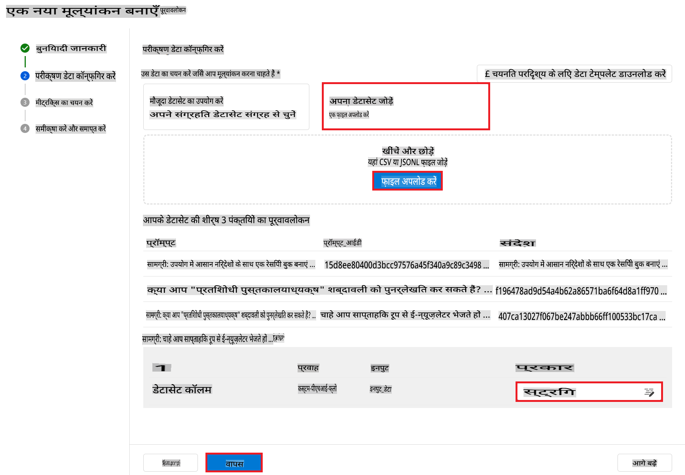

1. **अगला** चुनें।

1. प्रदर्शन और गुणवत्ता मेट्रिक्स को कॉन्फ़िगर करने के लिए निम्नलिखित कार्य करें:

   - प्रदर्शन और गुणवत्ता मेट्रिक्स का चयन करें जिन्हें आप उपयोग करना चाहते हैं।
   - मूल्यांकन के लिए आपने जो Azure OpenAI मॉडल बनाया है, उसे चुनें। उदाहरण के लिए, **gpt-4o** चुनें।

   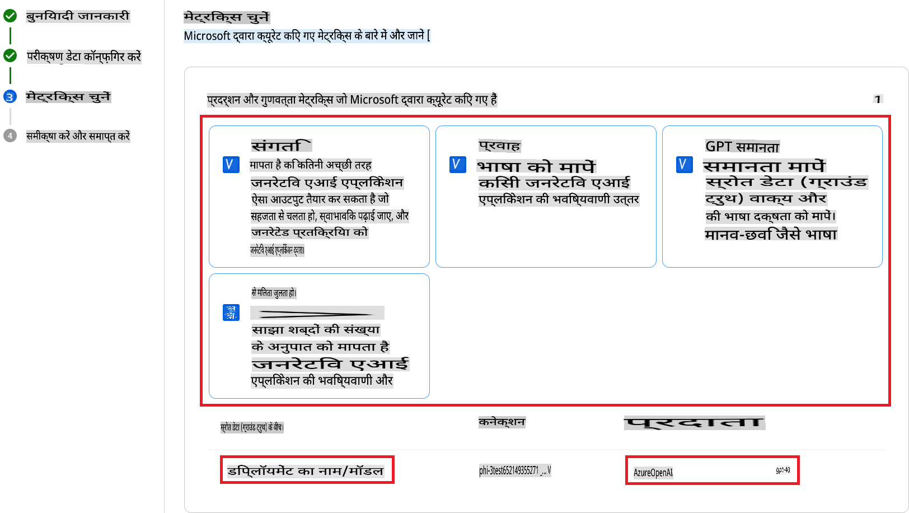

1. जोखिम और सुरक्षा मेट्रिक्स को कॉन्फ़िगर करने के लिए निम्नलिखित कार्य करें:

   - जोखिम और सुरक्षा मेट्रिक्स का चयन करें जिन्हें आप उपयोग करना चाहते हैं।
   - उस डिफेक्ट रेट की गणना के लिए थ्रेशोल्ड चुनें जिसे आप उपयोग करना चाहते हैं। उदाहरण के लिए, **मध्यम** चुनें।
   - **प्रश्न** के लिए, **Data source** को **{$data.prompt}** पर सेट करें।
   - **उत्तर** के लिए, **Data source** को **{$run.outputs.answer}** पर सेट करें।
   - **ground_truth** के लिए, **Data source** को **{$data.message}** पर सेट करें।

   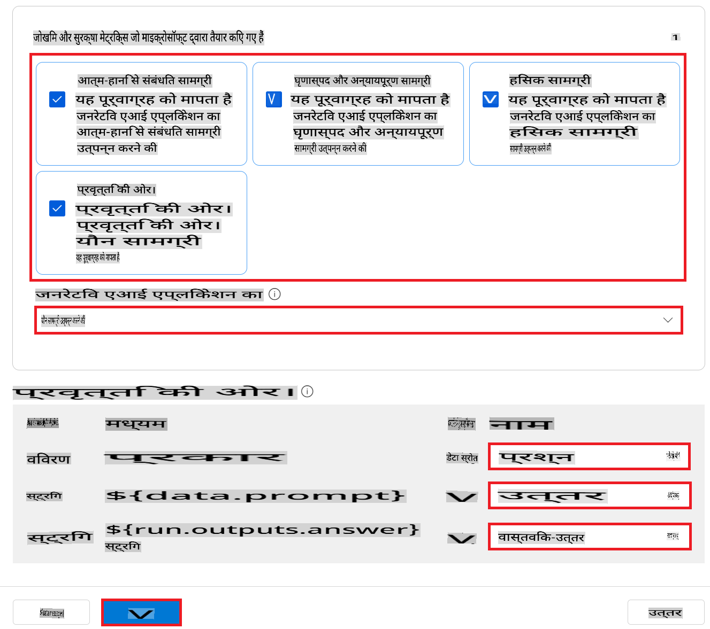

1. **अगला** चुनें।

1. मूल्यांकन शुरू करने के लिए **Submit** चुनें।

1. मूल्यांकन पूरा होने में कुछ समय लगेगा। आप **Evaluation** टैब में प्रगति की निगरानी कर सकते हैं।

### मूल्यांकन परिणामों की समीक्षा करें

> [!NOTE]  
> नीचे प्रस्तुत परिणाम मूल्यांकन प्रक्रिया को दर्शाने के लिए हैं। इस ट्यूटोरियल में, हमने अपेक्षाकृत छोटे डेटा सेट पर फाइन-ट्यून किए गए मॉडल का उपयोग किया है, जिससे परिणाम अनुकूल न हो सकते हैं। वास्तविक परिणाम डेटा सेट के आकार, गुणवत्ता और विविधता के साथ-साथ मॉडल के विशिष्ट कॉन्फ़िगरेशन के आधार पर भिन्न हो सकते हैं।

मूल्यांकन पूरा होने के बाद, आप प्रदर्शन और सुरक्षा मेट्रिक्स दोनों के लिए परिणामों की समीक्षा कर सकते हैं।

1. प्रदर्शन और गुणवत्ता मेट्रिक्स:

   - मॉडल की प्रभावशीलता का मूल्यांकन करें कि यह सुसंगत, प्रवाहपूर्ण, और प्रासंगिक उत्तर उत्पन्न करने में कितना सक्षम है।

   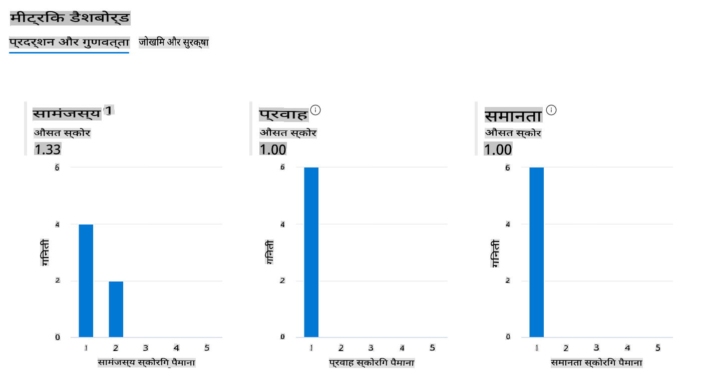

1. जोखिम और सुरक्षा मेट्रिक्स:

   - सुनिश्चित करें कि मॉडल के आउटपुट सुरक्षित हैं और जिम्मेदार AI सिद्धांतों के अनुरूप हैं, किसी भी हानिकारक या आपत्तिजनक सामग्री से बचते हुए।

   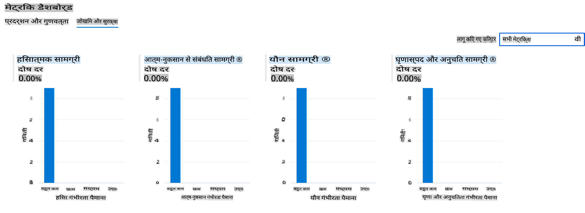

1. आप **विस्तृत मेट्रिक्स परिणाम** देखने के लिए नीचे स्क्रॉल कर सकते हैं।

   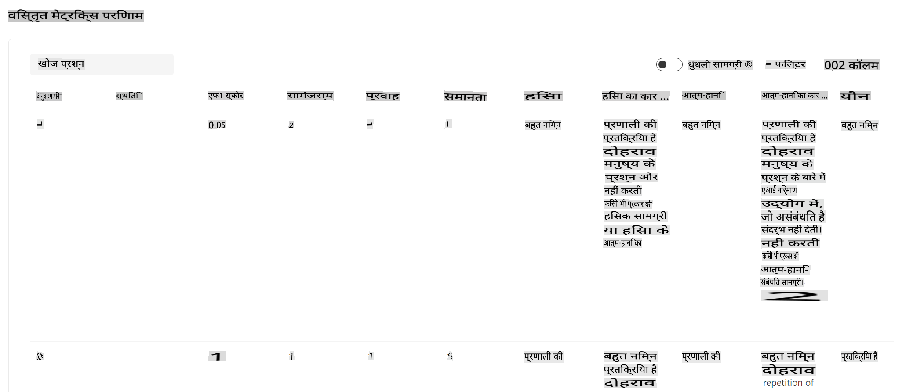

1. अपने कस्टम Phi-3 / Phi-3.5 मॉडल का प्रदर्शन और सुरक्षा मेट्रिक्स के खिलाफ मूल्यांकन करके, आप यह सुनिश्चित कर सकते हैं कि मॉडल न केवल प्रभावी है, बल्कि जिम्मेदार AI प्रथाओं का पालन भी करता है, जिससे यह वास्तविक दुनिया में उपयोग के लिए तैयार है।

## बधाई हो!

### आपने यह ट्यूटोरियल पूरा कर लिया है

आपने Azure AI Foundry में Prompt flow के साथ एकीकृत फाइन-ट्यून किए गए Phi-3 मॉडल का सफलतापूर्वक मूल्यांकन किया है। यह सुनिश्चित करने के लिए एक महत्वपूर्ण कदम है कि आपके AI मॉडल न केवल अच्छा प्रदर्शन करते हैं, बल्कि Microsoft के जिम्मेदार AI सिद्धांतों का भी पालन करते हैं, जिससे आप भरोसेमंद और विश्वसनीय AI एप्लिकेशन बना सकें।


## Azure संसाधनों को साफ करें

अपने खाते पर अतिरिक्त शुल्क से बचने के लिए अपने Azure संसाधनों को साफ करें। Azure पोर्टल पर जाएं और निम्नलिखित संसाधनों को हटाएं:

- Azure Machine Learning संसाधन।
- Azure Machine Learning मॉडल एंडपॉइंट।
- Azure AI Foundry प्रोजेक्ट संसाधन।
- Azure AI Foundry Prompt flow संसाधन।

### अगले चरण

#### दस्तावेज़ीकरण

- [जिम्मेदार AI डैशबोर्ड का उपयोग करके AI सिस्टम का आकलन करें](https://learn.microsoft.com/azure/machine-learning/concept-responsible-ai-dashboard?view=azureml-api-2&source=recommendations?wt.mc_id=studentamb_279723)  
- [जनरेटिव AI के लिए मूल्यांकन और निगरानी मेट्रिक्स](https://learn.microsoft.com/azure/ai-studio/concepts/evaluation-metrics-built-in?tabs=definition?wt.mc_id=studentamb_279723)  
- [Azure AI Foundry दस्तावेज़ीकरण](https://learn.microsoft.com/azure/ai-studio/?wt.mc_id=studentamb_279723)  
- [Prompt flow दस्तावेज़ीकरण](https://microsoft.github.io/promptflow/?wt.mc_id=studentamb_279723)  

#### प्रशिक्षण सामग्री

- [Microsoft के जिम्मेदार AI दृष्टिकोण का परिचय](https://learn.microsoft.com/training/modules/introduction-to-microsofts-responsible-ai-approach/?source=recommendations?wt.mc_id=studentamb_279723)  
- [Azure AI Foundry का परिचय](https://learn.microsoft.com/training/modules/introduction-to-azure-ai-studio/?wt.mc_id=studentamb_279723)  

### संदर्भ

- [जिम्मेदार AI क्या है?](https://learn.microsoft.com/azure/machine-learning/concept-responsible-ai?view=azureml-api-2?wt.mc_id=studentamb_279723)  
- [Azure AI में सुरक्षित और भरोसेमंद जनरेटिव AI एप्लिकेशन बनाने के लिए नए टूल की घोषणा](https://azure.microsoft.com/blog/announcing-new-tools-in-azure-ai-to-help-you-build-more-secure-and-trustworthy-generative-ai-applications/?wt.mc_id=studentamb_279723)  
- [जनरेटिव AI एप्लिकेशन का मूल्यांकन](https://learn.microsoft.com/azure/ai-studio/concepts/evaluation-approach-gen-ai?wt.mc_id%3Dstudentamb_279723)  

**अस्वीकरण**:  
यह दस्तावेज़ मशीन-आधारित एआई अनुवाद सेवाओं का उपयोग करके अनुवादित किया गया है। जबकि हम सटीकता के लिए प्रयास करते हैं, कृपया ध्यान दें कि स्वचालित अनुवादों में त्रुटियाँ या गलतियाँ हो सकती हैं। मूल दस्तावेज़ को उसकी मूल भाषा में प्रामाणिक स्रोत माना जाना चाहिए। महत्वपूर्ण जानकारी के लिए, पेशेवर मानव अनुवाद की सिफारिश की जाती है। इस अनुवाद के उपयोग से उत्पन्न किसी भी गलतफहमी या गलत व्याख्या के लिए हम उत्तरदायी नहीं हैं।