# फाइन-ट्यून करें और कस्टम Phi-3 मॉडल्स को प्रॉम्प्ट फ्लो के साथ इंटीग्रेट करें

यह एंड-टू-एंड (E2E) सैंपल Microsoft टेक कम्युनिटी की गाइड "[Fine-Tune and Integrate Custom Phi-3 Models with Prompt Flow: Step-by-Step Guide](https://techcommunity.microsoft.com/t5/educator-developer-blog/fine-tune-and-integrate-custom-phi-3-models-with-prompt-flow/ba-p/4178612?WT.mc_id=aiml-137032-kinfeylo)" पर आधारित है। इसमें कस्टम Phi-3 मॉडल्स को फाइन-ट्यून, डिप्लॉय और प्रॉम्प्ट फ्लो के साथ इंटीग्रेट करने की प्रक्रिया को समझाया गया है।

## परिचय

इस E2E सैंपल में, आप सीखेंगे कि Phi-3 मॉडल को फाइन-ट्यून कैसे करें और इसे प्रॉम्प्ट फ्लो के साथ इंटीग्रेट कैसे करें। Azure Machine Learning और प्रॉम्प्ट फ्लो का उपयोग करके, आप कस्टम AI मॉडल्स को डिप्लॉय और उपयोग करने के लिए एक वर्कफ़्लो स्थापित करेंगे। यह E2E सैंपल तीन परिदृश्यों में विभाजित है:

**परिदृश्य 1: Azure संसाधन सेट करें और फाइन-ट्यूनिंग के लिए तैयारी करें**

**परिदृश्य 2: Phi-3 मॉडल को फाइन-ट्यून करें और Azure Machine Learning Studio में डिप्लॉय करें**

**परिदृश्य 3: प्रॉम्प्ट फ्लो के साथ इंटीग्रेट करें और अपने कस्टम मॉडल से चैट करें**

यहाँ इस E2E सैंपल का एक अवलोकन है।

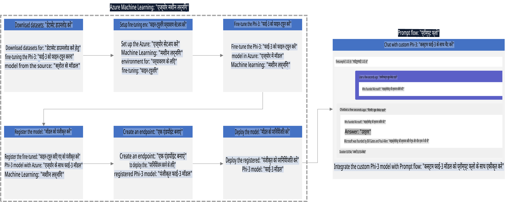

### सामग्री सूची

1. **[परिदृश्य 1: Azure संसाधन सेट करें और फाइन-ट्यूनिंग के लिए तैयारी करें](../../../../../../md/02.Application/01.TextAndChat/Phi3)**
    - [Azure Machine Learning Workspace बनाएं](../../../../../../md/02.Application/01.TextAndChat/Phi3)
    - [Azure सब्सक्रिप्शन में GPU कोटा का अनुरोध करें](../../../../../../md/02.Application/01.TextAndChat/Phi3)
    - [रोल असाइनमेंट जोड़ें](../../../../../../md/02.Application/01.TextAndChat/Phi3)
    - [प्रोजेक्ट सेट करें](../../../../../../md/02.Application/01.TextAndChat/Phi3)
    - [फाइन-ट्यूनिंग के लिए डेटा सेट तैयार करें](../../../../../../md/02.Application/01.TextAndChat/Phi3)

1. **[परिदृश्य 2: Phi-3 मॉडल को फाइन-ट्यून करें और Azure Machine Learning Studio में डिप्लॉय करें](../../../../../../md/02.Application/01.TextAndChat/Phi3)**
    - [Azure CLI सेट करें](../../../../../../md/02.Application/01.TextAndChat/Phi3)
    - [Phi-3 मॉडल को फाइन-ट्यून करें](../../../../../../md/02.Application/01.TextAndChat/Phi3)
    - [फाइन-ट्यून मॉडल को डिप्लॉय करें](../../../../../../md/02.Application/01.TextAndChat/Phi3)

1. **[परिदृश्य 3: प्रॉम्प्ट फ्लो के साथ इंटीग्रेट करें और अपने कस्टम मॉडल से चैट करें](../../../../../../md/02.Application/01.TextAndChat/Phi3)**
    - [कस्टम Phi-3 मॉडल को प्रॉम्प्ट फ्लो के साथ इंटीग्रेट करें](../../../../../../md/02.Application/01.TextAndChat/Phi3)
    - [अपने कस्टम मॉडल से चैट करें](../../../../../../md/02.Application/01.TextAndChat/Phi3)

## परिदृश्य 1: Azure संसाधन सेट करें और फाइन-ट्यूनिंग के लिए तैयारी करें

### Azure Machine Learning Workspace बनाएं

1. पोर्टल पेज के शीर्ष पर **सर्च बार** में *azure machine learning* टाइप करें और जो विकल्प दिखाई दें उनमें से **Azure Machine Learning** चुनें।

    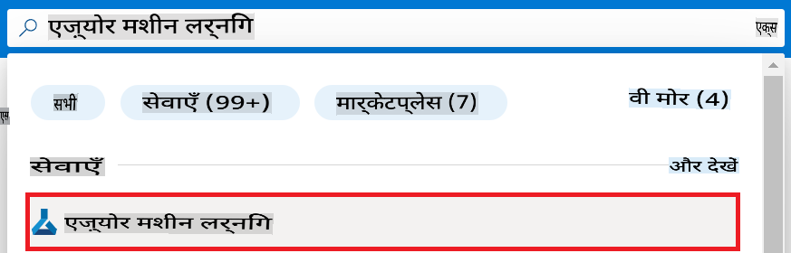

1. नेविगेशन मेनू से **+ Create** चुनें।

1. नेविगेशन मेनू से **New workspace** चुनें।

    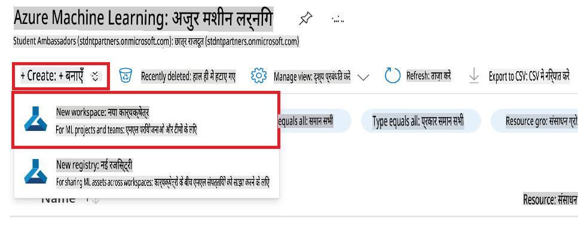

1. निम्नलिखित कार्य करें:

    - अपनी Azure **Subscription** चुनें।
    - उपयोग करने के लिए **Resource group** चुनें (यदि आवश्यक हो तो नया बनाएं)।
    - **Workspace Name** दर्ज करें। यह एक अद्वितीय मान होना चाहिए।
    - उपयोग करने के लिए **Region** चुनें।
    - उपयोग करने के लिए **Storage account** चुनें (यदि आवश्यक हो तो नया बनाएं)।
    - उपयोग करने के लिए **Key vault** चुनें (यदि आवश्यक हो तो नया बनाएं)।
    - उपयोग करने के लिए **Application insights** चुनें (यदि आवश्यक हो तो नया बनाएं)।
    - उपयोग करने के लिए **Container registry** चुनें (यदि आवश्यक हो तो नया बनाएं)।

    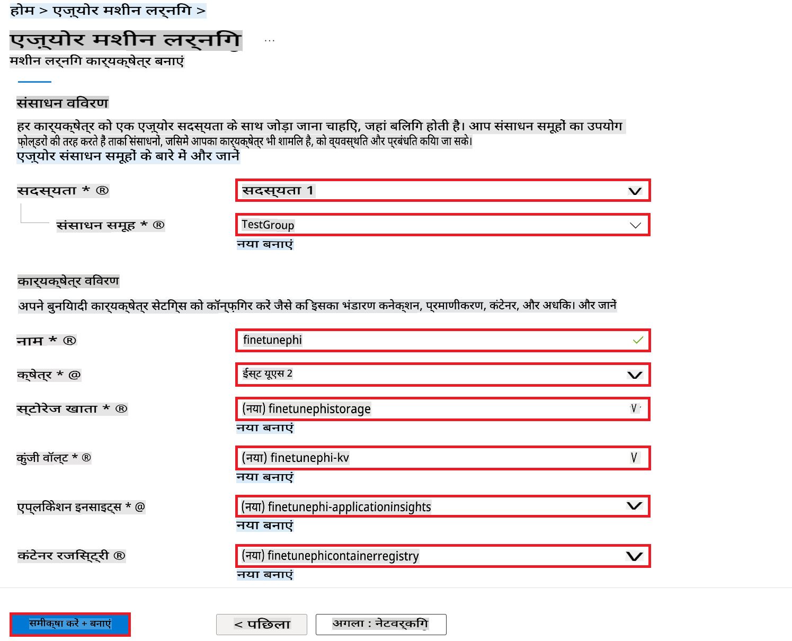

1. **Review + Create** चुनें।

1. **Create** चुनें।

### Azure सब्सक्रिप्शन में GPU कोटा का अनुरोध करें

इस E2E सैंपल में, आप फाइन-ट्यूनिंग के लिए *Standard_NC24ads_A100_v4 GPU* का उपयोग करेंगे, जिसके लिए कोटा अनुरोध की आवश्यकता होती है, और डिप्लॉयमेंट के लिए *Standard_E4s_v3* CPU का उपयोग करेंगे, जिसके लिए कोटा अनुरोध की आवश्यकता नहीं होती।

> [!NOTE]
>
> केवल Pay-As-You-Go सब्सक्रिप्शन (मानक सब्सक्रिप्शन प्रकार) GPU आवंटन के लिए पात्र हैं; लाभ सब्सक्रिप्शन वर्तमान में समर्थित नहीं हैं।
>
> जो लोग लाभ सब्सक्रिप्शन (जैसे Visual Studio Enterprise Subscription) का उपयोग कर रहे हैं या जो फाइन-ट्यूनिंग और डिप्लॉयमेंट प्रक्रिया को जल्दी से टेस्ट करना चाहते हैं, उनके लिए यह ट्यूटोरियल CPU का उपयोग करके न्यूनतम डेटा सेट के साथ फाइन-ट्यूनिंग के लिए भी मार्गदर्शन प्रदान करता है। हालांकि, यह ध्यान रखना महत्वपूर्ण है कि बड़े डेटा सेट के साथ GPU का उपयोग करने पर फाइन-ट्यूनिंग के परिणाम काफी बेहतर होते हैं।

1. [Azure ML Studio](https://ml.azure.com/home?wt.mc_id=studentamb_279723) पर जाएं।

1. *Standard NCADSA100v4 Family* कोटा का अनुरोध करने के लिए निम्नलिखित कार्य करें:

    - बाईं ओर के टैब से **Quota** चुनें।
    - उपयोग करने के लिए **Virtual machine family** चुनें। उदाहरण के लिए, **Standard NCADSA100v4 Family Cluster Dedicated vCPUs** चुनें, जिसमें *Standard_NC24ads_A100_v4* GPU शामिल है।
    - नेविगेशन मेनू से **Request quota** चुनें।

        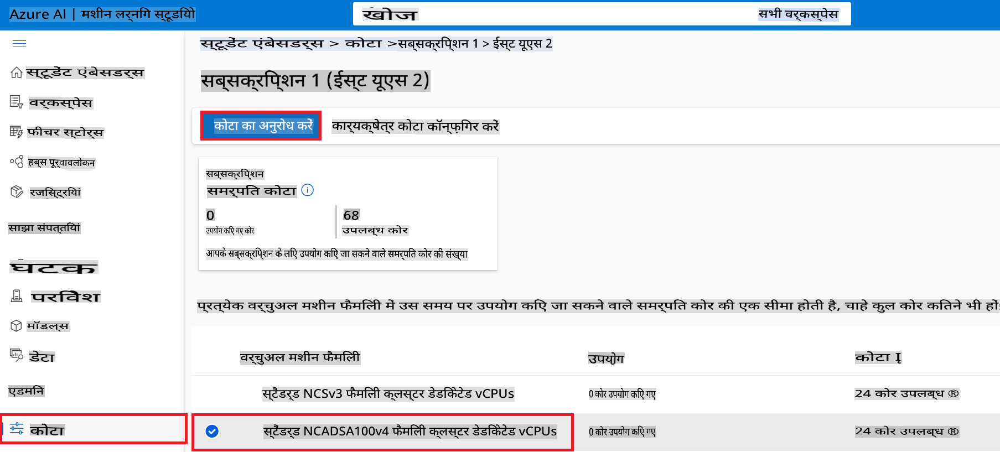

    - **Request quota** पेज के अंदर, उपयोग करने के लिए **New cores limit** दर्ज करें। उदाहरण के लिए, 24।
    - **Request quota** पेज के अंदर, GPU कोटा का अनुरोध करने के लिए **Submit** चुनें।

> [!NOTE]
> अपनी आवश्यकताओं के अनुसार उपयुक्त GPU या CPU का चयन करने के लिए [Sizes for Virtual Machines in Azure](https://learn.microsoft.com/azure/virtual-machines/sizes/overview?tabs=breakdownseries%2Cgeneralsizelist%2Ccomputesizelist%2Cmemorysizelist%2Cstoragesizelist%2Cgpusizelist%2Cfpgasizelist%2Chpcsizelist) दस्तावेज़ देखें।

### रोल असाइनमेंट जोड़ें

मॉडल्स को फाइन-ट्यून और डिप्लॉय करने के लिए, आपको पहले एक User Assigned Managed Identity (UAI) बनानी होगी और इसे उपयुक्त अनुमतियाँ असाइन करनी होंगी। यह UAI डिप्लॉयमेंट के दौरान प्रमाणन के लिए उपयोग की जाएगी। 

#### User Assigned Managed Identity (UAI) बनाएं

1. पोर्टल पेज के शीर्ष पर **सर्च बार** में *managed identities* टाइप करें और जो विकल्प दिखाई दें उनमें से **Managed Identities** चुनें।

    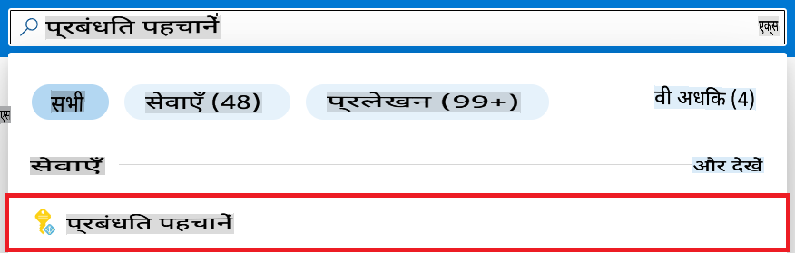

1. **+ Create** चुनें।

    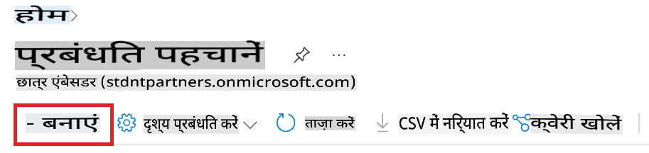

1. निम्नलिखित कार्य करें:

    - अपनी Azure **Subscription** चुनें।
    - उपयोग करने के लिए **Resource group** चुनें (यदि आवश्यक हो तो नया बनाएं)।
    - उपयोग करने के लिए **Region** चुनें।
    - **Name** दर्ज करें। यह एक अद्वितीय मान होना चाहिए।

1. **Review + create** चुनें।

1. **+ Create** चुनें।

#### Managed Identity को Contributor रोल असाइनमेंट जोड़ें

1. आपने जो Managed Identity बनाई है, उस संसाधन पर जाएं।

1. बाईं ओर के टैब से **Azure role assignments** चुनें।

1. नेविगेशन मेनू से **+Add role assignment** चुनें।

1. Add role assignment पेज के अंदर, निम्नलिखित कार्य करें:
    - **Scope** को **Resource group** पर सेट करें।
    - अपनी Azure **Subscription** चुनें।
    - उपयोग करने के लिए **Resource group** चुनें।
    - **Role** को **Contributor** पर सेट करें।

    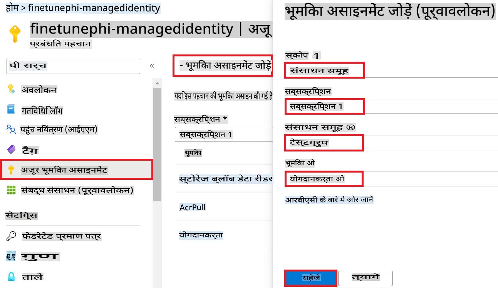

1. **Save** चुनें।

#### Managed Identity को Storage Blob Data Reader रोल असाइनमेंट जोड़ें

1. पोर्टल पेज के शीर्ष पर **सर्च बार** में *storage accounts* टाइप करें और जो विकल्प दिखाई दें उनमें से **Storage accounts** चुनें।

    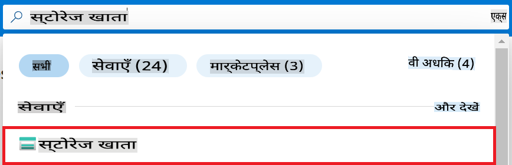

1. उस स्टोरेज अकाउंट को चुनें जो आपने बनाए गए Azure Machine Learning Workspace के साथ संबद्ध किया है। उदाहरण के लिए, *finetunephistorage*।

1. Add role assignment पेज पर जाने के लिए निम्नलिखित कार्य करें:

    - बनाए गए Azure Storage अकाउंट पर जाएं।
    - बाईं ओर के टैब से **Access Control (IAM)** चुनें।
    - नेविगेशन मेनू से **+ Add** चुनें।
    - नेविगेशन मेनू से **Add role assignment** चुनें।

    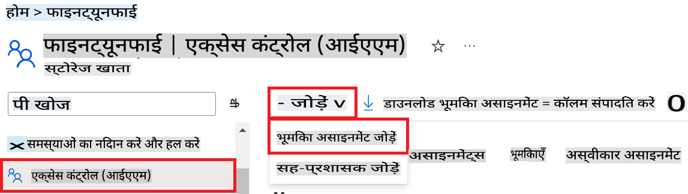

1. Add role assignment पेज के अंदर, निम्नलिखित कार्य करें:

    - Role पेज के अंदर, **Storage Blob Data Reader** को **सर्च बार** में टाइप करें और दिखाई देने वाले विकल्पों में से **Storage Blob Data Reader** चुनें।
    - Role पेज के अंदर, **Next** चुनें।
    - Members पेज के अंदर, **Assign access to** को **Managed identity** पर सेट करें।
    - Members पेज के अंदर, **+ Select members** चुनें।
    - Select managed identities पेज के अंदर, अपनी Azure **Subscription** चुनें।
    - Select managed identities पेज के अंदर, **Managed identity** को **Manage Identity** पर सेट करें।
    - Select managed identities पेज के अंदर, आपने जो Managed Identity बनाई है, उसे चुनें। उदाहरण के लिए, *finetunephi-managedidentity*।
    - Select managed identities पेज के अंदर, **Select** चुनें।

    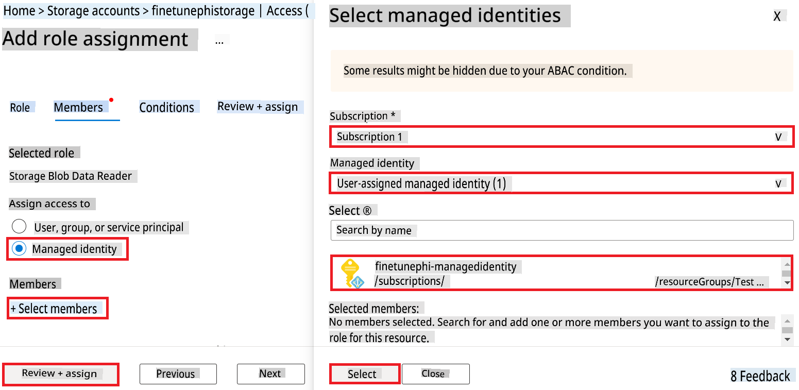

1. **Review + assign** चुनें।

#### Managed Identity को AcrPull रोल असाइनमेंट जोड़ें

1. पोर्टल पेज के शीर्ष पर **सर्च बार** में *container registries* टाइप करें और जो विकल्प दिखाई दें उनमें से **Container registries** चुनें।

    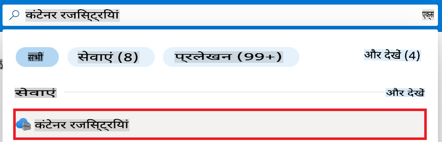

1. उस कंटेनर रजिस्ट्री को चुनें जो आपने बनाए गए Azure Machine Learning Workspace के साथ संबद्ध किया है। उदाहरण के लिए, *finetunephicontainerregistries*।

1. Add role assignment पेज पर जाने के लिए निम्नलिखित कार्य करें:

    - बाईं ओर के टैब से **Access Control (IAM)** चुनें।
    - नेविगेशन मेनू से **+ Add** चुनें।
    - नेविगेशन मेनू से **Add role assignment** चुनें।

1. Add role assignment पेज के अंदर, निम्नलिखित कार्य करें:

    - Role पेज के अंदर, **AcrPull** को **सर्च बार** में टाइप करें और दिखाई देने वाले विकल्पों में से **AcrPull** चुनें।
    - Role पेज के अंदर, **Next** चुनें।
    - Members पेज के अंदर, **Assign access to** को **Managed identity** पर सेट करें।
    - Members पेज के अंदर, **+ Select members** चुनें।
    - Select managed identities पेज के अंदर, अपनी Azure **Subscription** चुनें।
    - Select managed identities पेज के अंदर, **Managed identity** को **Manage Identity** पर सेट करें।
    - Select managed identities पेज के अंदर, आपने जो Managed Identity बनाई है, उसे चुनें। उदाहरण के लिए, *finetunephi-managedidentity*।
    - Select managed identities पेज के अंदर, **Select** चुनें।
    - **Review + assign** चुनें।

### प्रोजेक्ट सेट करें

अब, आप एक फोल्डर बनाएंगे जिसमें काम करेंगे और एक वर्चुअल एनवायरनमेंट सेट करेंगे ताकि उपयोगकर्ता के साथ इंटरैक्ट करने वाला प्रोग्राम विकसित किया जा सके और Azure Cosmos DB में संग्रहीत चैट इतिहास का उपयोग करके प्रतिक्रियाओं को सूचित किया जा सके।

#### एक फोल्डर बनाएं

1. टर्मिनल विंडो खोलें और *finetune-phi* नामक फोल्डर बनाने के लिए निम्नलिखित कमांड टाइप करें:

    ```console
    mkdir finetune-phi
    ```

1. टर्मिनल में *finetune-phi* फोल्डर पर नेविगेट करने के लिए निम्नलिखित कमांड टाइप करें:

    ```console
    cd finetune-phi
    ```

#### वर्चुअल एनवायरनमेंट बनाएं

1. टर्मिनल में निम्नलिखित कमांड टाइप करें ताकि *.venv* नामक वर्चुअल एनवायरनमेंट बनाया जा सके:

    ```console
    python -m venv .venv
    ```

1. वर्चुअल एनवायरनमेंट को सक्रिय करने के लिए टर्मिनल में निम्नलिखित कमांड टाइप करें:

    ```console
    .venv\Scripts\activate.bat
    ```

> [!NOTE]
>
> यदि यह सफल हुआ, तो आपको कमांड प्रॉम्प्ट के पहले *(.venv)* दिखाई देना चाहिए।

#### आवश्यक पैकेज इंस्टॉल करें

1. टर्मिनल में निम्नलिखित कमांड टाइप करें ताकि आवश्यक पैकेज इंस्टॉल किए जा सकें:

    ```console
    pip install datasets==2.19.1
    pip install transformers==4.41.1
    pip install azure-ai-ml==1.16.0
    pip install torch==2.3.1
    pip install trl==0.9.4
    pip install promptflow==1.12.0
    ```

#### प्रोजेक्ट फाइल्स बनाएं

इस एक्सरसाइज़ में, आप अपने प्रोजेक्ट के लिए आवश्यक फाइल्स बनाएंगे। इनमें डेटा सेट डाउनलोड करने, Azure Machine Learning एनवायरनमेंट सेट करने, Phi-3 मॉडल को फाइन-ट्यून करने, और फाइन-ट्यून मॉडल को डिप्लॉय करने के लिए स्क्रिप्ट्स शामिल हैं। आप फाइन-ट्यूनिंग एनवायरनमेंट सेट करने के लिए *conda.yml* फाइल भी बनाएंगे।

इस एक्सरसाइज़ में, आप निम्नलिखित करेंगे:

- *download_dataset.py* नामक फाइल बनाएंगे ताकि डेटा सेट डाउनलोड किया जा सके।
- *setup_ml.py* नामक फाइल बनाएंगे ताकि Azure Machine Learning एनवायरनमेंट सेट किया जा सके।
- *finetuning_dir* फोल्डर में *fine_tune.py* नामक फाइल बनाएंगे ताकि डेटा सेट का उपयोग करके Phi-3 मॉडल को फाइन-ट्यून किया जा सके।
- *conda.yml* फाइल बनाएंगे ताकि फाइन-ट्यूनिंग एनवायरनमेंट सेट किया जा सके।
- *deploy_model.py* नामक फाइल बनाएंगे ताकि फाइन-ट्यून मॉडल को डिप्लॉय किया जा सके।
- *integrate_with_promptflow.py* नामक फाइल बनाएंगे ताकि फाइन-ट्यून मॉडल को इंटीग्रेट किया जा सके और प्रॉम्प्ट फ्लो का उपयोग करके मॉडल को चलाया जा सके।
- *flow.dag.yml* नामक फाइल बनाएंगे ताकि प्रॉम्प्ट फ्लो के लिए वर्कफ़्लो स्ट्रक्चर सेट किया जा सके।
- *config.py* नामक फाइल बनाएंगे ताकि Azure जानकारी दर्ज की जा सके।

> [!NOTE]
>
> पूर्ण फोल्डर संरचना:
>
> ```text
> └── YourUserName
> .    └── finetune-phi
> .        ├── finetuning_dir
> .        │      └── fine_tune.py
> .        ├── conda.yml
> .        ├── config.py
> .        ├── deploy_model.py
> .        ├── download_dataset.py
> .        ├── flow.dag.yml
> .        ├── integrate_with_promptflow.py
> .        └── setup_ml.py
> ```

1. **Visual Studio Code** खोलें।

1. मेनू बार से **File** चुनें।

1. **Open Folder** चुनें।

1. *finetune-phi* फोल्डर चुनें जिसे आपने बनाया है, जो *C:\Users\yourUserName\finetune-phi* पर स्थित है।

    

1. Visual Studio Code के बाएँ पैनल में, राइट-क्लिक करें और **New File** चुनें ताकि *download_dataset.py* नामक नई फाइल बनाई जा सके।

1. Visual Studio Code के बाएँ पैनल में, राइट-क्लिक करें और **New File** चुनें ताकि *setup_ml.py* नामक नई फाइल बनाई जा सके।

1. Visual Studio Code के बाएँ पैनल में
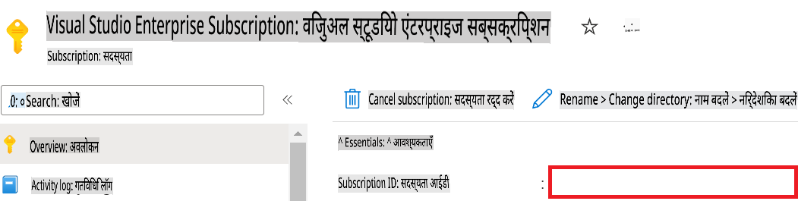

1. Azure Workspace Name जोड़ने के लिए निम्नलिखित कार्य करें:

    - उस Azure Machine Learning संसाधन पर जाएं जिसे आपने बनाया है।
    - अपने खाते का नाम कॉपी करें और *config.py* फ़ाइल में पेस्ट करें।

    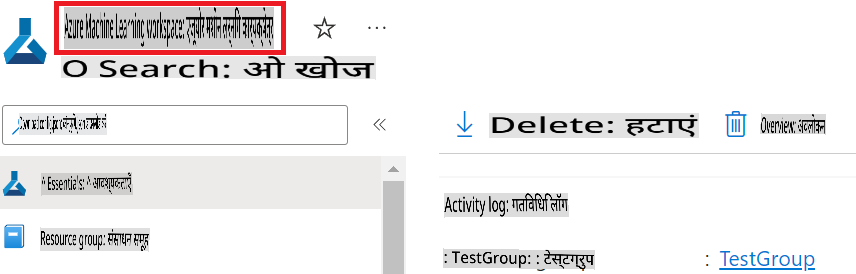

1. Azure Resource Group Name जोड़ने के लिए निम्नलिखित कार्य करें:

    - उस Azure Machine Learning संसाधन पर जाएं जिसे आपने बनाया है।
    - अपने Azure Resource Group Name को कॉपी करें और *config.py* फ़ाइल में पेस्ट करें।

    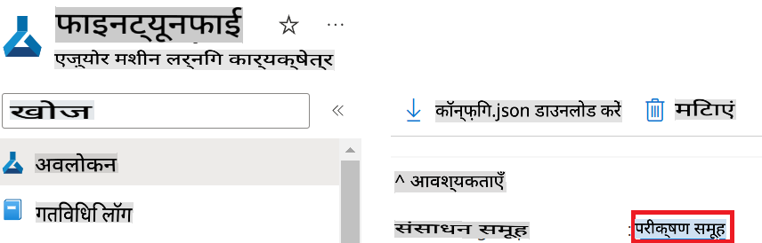

2. Azure Managed Identity नाम जोड़ने के लिए निम्नलिखित कार्य करें:

    - उस Managed Identities संसाधन पर जाएं जिसे आपने बनाया है।
    - अपने Azure Managed Identity नाम को कॉपी करें और *config.py* फ़ाइल में पेस्ट करें।

    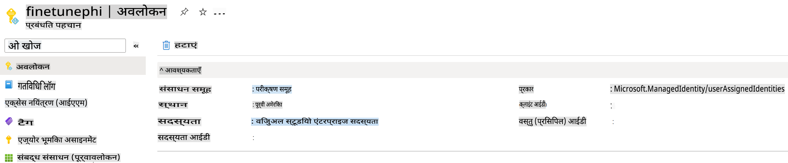

### फाइन-ट्यूनिंग के लिए डेटासेट तैयार करें

इस अभ्यास में, आप *download_dataset.py* फ़ाइल चलाकर *ULTRACHAT_200k* डेटासेट को अपने लोकल वातावरण में डाउनलोड करेंगे। इसके बाद, आप इस डेटासेट का उपयोग Azure Machine Learning में Phi-3 मॉडल को फाइन-ट्यून करने के लिए करेंगे।

#### *download_dataset.py* का उपयोग करके अपना डेटासेट डाउनलोड करें

1. Visual Studio Code में *download_dataset.py* फ़ाइल खोलें।

1. निम्नलिखित कोड *download_dataset.py* में जोड़ें।

    ```python
    import json
    import os
    from datasets import load_dataset
    from config import (
        TRAIN_DATA_PATH,
        TEST_DATA_PATH)

    def load_and_split_dataset(dataset_name, config_name, split_ratio):
        """
        Load and split a dataset.
        """
        # Load the dataset with the specified name, configuration, and split ratio
        dataset = load_dataset(dataset_name, config_name, split=split_ratio)
        print(f"Original dataset size: {len(dataset)}")
        
        # Split the dataset into train and test sets (80% train, 20% test)
        split_dataset = dataset.train_test_split(test_size=0.2)
        print(f"Train dataset size: {len(split_dataset['train'])}")
        print(f"Test dataset size: {len(split_dataset['test'])}")
        
        return split_dataset

    def save_dataset_to_jsonl(dataset, filepath):
        """
        Save a dataset to a JSONL file.
        """
        # Create the directory if it does not exist
        os.makedirs(os.path.dirname(filepath), exist_ok=True)
        
        # Open the file in write mode
        with open(filepath, 'w', encoding='utf-8') as f:
            # Iterate over each record in the dataset
            for record in dataset:
                # Dump the record as a JSON object and write it to the file
                json.dump(record, f)
                # Write a newline character to separate records
                f.write('\n')
        
        print(f"Dataset saved to {filepath}")

    def main():
        """
        Main function to load, split, and save the dataset.
        """
        # Load and split the ULTRACHAT_200k dataset with a specific configuration and split ratio
        dataset = load_and_split_dataset("HuggingFaceH4/ultrachat_200k", 'default', 'train_sft[:1%]')
        
        # Extract the train and test datasets from the split
        train_dataset = dataset['train']
        test_dataset = dataset['test']

        # Save the train dataset to a JSONL file
        save_dataset_to_jsonl(train_dataset, TRAIN_DATA_PATH)
        
        # Save the test dataset to a separate JSONL file
        save_dataset_to_jsonl(test_dataset, TEST_DATA_PATH)

    if __name__ == "__main__":
        main()

    ```

> [!TIP]
>
> **सीपीयू का उपयोग करके न्यूनतम डेटासेट के साथ फाइन-ट्यूनिंग के लिए गाइडेंस**
>
> यदि आप फाइन-ट्यूनिंग के लिए सीपीयू का उपयोग करना चाहते हैं, तो यह दृष्टिकोण उन लोगों के लिए आदर्श है जिनके पास लाभ सदस्यता (जैसे Visual Studio Enterprise Subscription) है या जो फाइन-ट्यूनिंग और डिप्लॉयमेंट प्रक्रिया को जल्दी से परीक्षण करना चाहते हैं।
>
> `dataset = load_and_split_dataset("HuggingFaceH4/ultrachat_200k", 'default', 'train_sft[:1%]')` with `dataset = load_and_split_dataset("HuggingFaceH4/ultrachat_200k", 'default', 'train_sft[:10]')` को बदलें।
>

1. टर्मिनल में निम्नलिखित कमांड टाइप करें ताकि स्क्रिप्ट को चलाया जा सके और डेटासेट को लोकल वातावरण में डाउनलोड किया जा सके।

    ```console
    python download_data.py
    ```

1. यह सुनिश्चित करें कि डेटासेट को सफलतापूर्वक आपके लोकल *finetune-phi/data* डायरेक्टरी में सेव किया गया है।

> [!NOTE]
>
> **डेटासेट का आकार और फाइन-ट्यूनिंग का समय**
>
> इस E2E सैंपल में, आप केवल 1% डेटासेट (`train_sft[:1%]`) का उपयोग करते हैं। यह डेटा की मात्रा को काफी हद तक कम कर देता है, जिससे अपलोड और फाइन-ट्यूनिंग प्रक्रिया तेज हो जाती है। आप प्रशिक्षण समय और मॉडल प्रदर्शन के बीच सही संतुलन खोजने के लिए प्रतिशत को समायोजित कर सकते हैं। डेटासेट के छोटे हिस्से का उपयोग करने से फाइन-ट्यूनिंग के लिए आवश्यक समय कम हो जाता है, जिससे प्रक्रिया E2E सैंपल के लिए अधिक प्रबंधनीय हो जाती है।

## परिदृश्य 2: Phi-3 मॉडल को फाइन-ट्यून करें और Azure Machine Learning Studio में डिप्लॉय करें

### Azure CLI सेट करें

आपको अपने वातावरण को प्रमाणित करने के लिए Azure CLI सेट करना होगा। Azure CLI आपको कमांड लाइन से सीधे Azure संसाधनों को प्रबंधित करने की अनुमति देता है और Azure Machine Learning को इन संसाधनों तक पहुंचने के लिए आवश्यक क्रेडेंशियल्स प्रदान करता है। शुरू करने के लिए [Azure CLI](https://learn.microsoft.com/cli/azure/install-azure-cli) इंस्टॉल करें।

1. एक टर्मिनल विंडो खोलें और अपने Azure खाते में लॉग इन करने के लिए निम्नलिखित कमांड टाइप करें।

    ```console
    az login
    ```

1. उपयोग के लिए अपना Azure खाता चुनें।

1. उपयोग के लिए अपना Azure सब्सक्रिप्शन चुनें।

    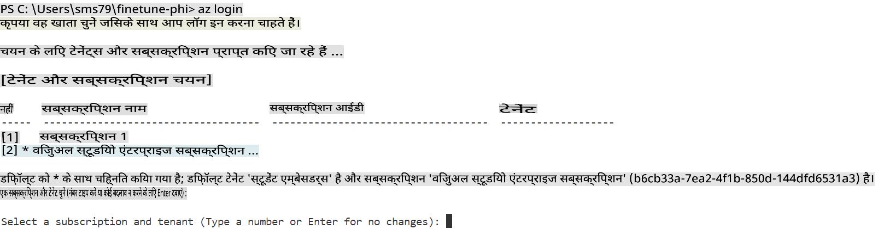

> [!TIP]
>
> यदि Azure में साइन इन करने में परेशानी हो रही है, तो डिवाइस कोड का उपयोग करने का प्रयास करें। एक टर्मिनल विंडो खोलें और अपने Azure खाते में साइन इन करने के लिए निम्नलिखित कमांड टाइप करें:
>
> ```console
> az login --use-device-code
> ```
>

### Phi-3 मॉडल को फाइन-ट्यून करें

इस अभ्यास में, आप प्रदान किए गए डेटासेट का उपयोग करके Phi-3 मॉडल को फाइन-ट्यून करेंगे। पहले, आप *fine_tune.py* फ़ाइल में फाइन-ट्यूनिंग प्रक्रिया को परिभाषित करेंगे। फिर, आप Azure Machine Learning वातावरण को कॉन्फ़िगर करेंगे और *setup_ml.py* फ़ाइल चलाकर फाइन-ट्यूनिंग प्रक्रिया शुरू करेंगे। यह स्क्रिप्ट सुनिश्चित करती है कि फाइन-ट्यूनिंग Azure Machine Learning वातावरण के भीतर होती है।

*setup_ml.py* चलाकर, आप Azure Machine Learning वातावरण में फाइन-ट्यूनिंग प्रक्रिया को चलाएंगे।

#### *fine_tune.py* फ़ाइल में कोड जोड़ें

1. *finetuning_dir* फ़ोल्डर पर जाएं और Visual Studio Code में *fine_tune.py* फ़ाइल खोलें।

1. निम्नलिखित कोड *fine_tune.py* में जोड़ें।

    ```python
    import argparse
    import sys
    import logging
    import os
    from datasets import load_dataset
    import torch
    import mlflow
    from transformers import AutoModelForCausalLM, AutoTokenizer, TrainingArguments
    from trl import SFTTrainer

    # To avoid the INVALID_PARAMETER_VALUE error in MLflow, disable MLflow integration
    os.environ["DISABLE_MLFLOW_INTEGRATION"] = "True"

    # Logging setup
    logging.basicConfig(
        format="%(asctime)s - %(levelname)s - %(name)s - %(message)s",
        datefmt="%Y-%m-%d %H:%M:%S",
        handlers=[logging.StreamHandler(sys.stdout)],
        level=logging.WARNING
    )
    logger = logging.getLogger(__name__)

    def initialize_model_and_tokenizer(model_name, model_kwargs):
        """
        Initialize the model and tokenizer with the given pretrained model name and arguments.
        """
        model = AutoModelForCausalLM.from_pretrained(model_name, **model_kwargs)
        tokenizer = AutoTokenizer.from_pretrained(model_name)
        tokenizer.model_max_length = 2048
        tokenizer.pad_token = tokenizer.unk_token
        tokenizer.pad_token_id = tokenizer.convert_tokens_to_ids(tokenizer.pad_token)
        tokenizer.padding_side = 'right'
        return model, tokenizer

    def apply_chat_template(example, tokenizer):
        """
        Apply a chat template to tokenize messages in the example.
        """
        messages = example["messages"]
        if messages[0]["role"] != "system":
            messages.insert(0, {"role": "system", "content": ""})
        example["text"] = tokenizer.apply_chat_template(
            messages, tokenize=False, add_generation_prompt=False
        )
        return example

    def load_and_preprocess_data(train_filepath, test_filepath, tokenizer):
        """
        Load and preprocess the dataset.
        """
        train_dataset = load_dataset('json', data_files=train_filepath, split='train')
        test_dataset = load_dataset('json', data_files=test_filepath, split='train')
        column_names = list(train_dataset.features)

        train_dataset = train_dataset.map(
            apply_chat_template,
            fn_kwargs={"tokenizer": tokenizer},
            num_proc=10,
            remove_columns=column_names,
            desc="Applying chat template to train dataset",
        )

        test_dataset = test_dataset.map(
            apply_chat_template,
            fn_kwargs={"tokenizer": tokenizer},
            num_proc=10,
            remove_columns=column_names,
            desc="Applying chat template to test dataset",
        )

        return train_dataset, test_dataset

    def train_and_evaluate_model(train_dataset, test_dataset, model, tokenizer, output_dir):
        """
        Train and evaluate the model.
        """
        training_args = TrainingArguments(
            bf16=True,
            do_eval=True,
            output_dir=output_dir,
            eval_strategy="epoch",
            learning_rate=5.0e-06,
            logging_steps=20,
            lr_scheduler_type="cosine",
            num_train_epochs=3,
            overwrite_output_dir=True,
            per_device_eval_batch_size=4,
            per_device_train_batch_size=4,
            remove_unused_columns=True,
            save_steps=500,
            seed=0,
            gradient_checkpointing=True,
            gradient_accumulation_steps=1,
            warmup_ratio=0.2,
        )

        trainer = SFTTrainer(
            model=model,
            args=training_args,
            train_dataset=train_dataset,
            eval_dataset=test_dataset,
            max_seq_length=2048,
            dataset_text_field="text",
            tokenizer=tokenizer,
            packing=True
        )

        train_result = trainer.train()
        trainer.log_metrics("train", train_result.metrics)

        mlflow.transformers.log_model(
            transformers_model={"model": trainer.model, "tokenizer": tokenizer},
            artifact_path=output_dir,
        )

        tokenizer.padding_side = 'left'
        eval_metrics = trainer.evaluate()
        eval_metrics["eval_samples"] = len(test_dataset)
        trainer.log_metrics("eval", eval_metrics)

    def main(train_file, eval_file, model_output_dir):
        """
        Main function to fine-tune the model.
        """
        model_kwargs = {
            "use_cache": False,
            "trust_remote_code": True,
            "torch_dtype": torch.bfloat16,
            "device_map": None,
            "attn_implementation": "eager"
        }

        # pretrained_model_name = "microsoft/Phi-3-mini-4k-instruct"
        pretrained_model_name = "microsoft/Phi-3.5-mini-instruct"

        with mlflow.start_run():
            model, tokenizer = initialize_model_and_tokenizer(pretrained_model_name, model_kwargs)
            train_dataset, test_dataset = load_and_preprocess_data(train_file, eval_file, tokenizer)
            train_and_evaluate_model(train_dataset, test_dataset, model, tokenizer, model_output_dir)

    if __name__ == "__main__":
        parser = argparse.ArgumentParser()
        parser.add_argument("--train-file", type=str, required=True, help="Path to the training data")
        parser.add_argument("--eval-file", type=str, required=True, help="Path to the evaluation data")
        parser.add_argument("--model_output_dir", type=str, required=True, help="Directory to save the fine-tuned model")
        args = parser.parse_args()
        main(args.train_file, args.eval_file, args.model_output_dir)

    ```

1. *fine_tune.py* फ़ाइल को सेव करें और बंद करें।

> [!TIP]
> **आप Phi-3.5 मॉडल को भी फाइन-ट्यून कर सकते हैं**
>
> *fine_tune.py* फ़ाइल में, आप `pretrained_model_name` from `"microsoft/Phi-3-mini-4k-instruct"` to any model you want to fine-tune. For example, if you change it to `"microsoft/Phi-3.5-mini-instruct"`, you'll be using the Phi-3.5-mini-instruct model for fine-tuning. To find and use the model name you prefer, visit [Hugging Face](https://huggingface.co/), search for the model you're interested in, and then copy and paste its name into the `pretrained_model_name` फ़ील्ड को बदल सकते हैं।
>
> :::image type="content" source="../../imgs/03/FineTuning-PromptFlow/finetunephi3.5.png" alt-text="Phi-3.5 को फाइन-ट्यून करें।":::
>

#### *setup_ml.py* फ़ाइल में कोड जोड़ें

1. Visual Studio Code में *setup_ml.py* फ़ाइल खोलें।

1. निम्नलिखित कोड *setup_ml.py* में जोड़ें।

    ```python
    import logging
    from azure.ai.ml import MLClient, command, Input
    from azure.ai.ml.entities import Environment, AmlCompute
    from azure.identity import AzureCliCredential
    from config import (
        AZURE_SUBSCRIPTION_ID,
        AZURE_RESOURCE_GROUP_NAME,
        AZURE_ML_WORKSPACE_NAME,
        TRAIN_DATA_PATH,
        TEST_DATA_PATH
    )

    # Constants

    # Uncomment the following lines to use a CPU instance for training
    # COMPUTE_INSTANCE_TYPE = "Standard_E16s_v3" # cpu
    # COMPUTE_NAME = "cpu-e16s-v3"
    # DOCKER_IMAGE_NAME = "mcr.microsoft.com/azureml/openmpi4.1.0-ubuntu20.04:latest"

    # Uncomment the following lines to use a GPU instance for training
    COMPUTE_INSTANCE_TYPE = "Standard_NC24ads_A100_v4"
    COMPUTE_NAME = "gpu-nc24s-a100-v4"
    DOCKER_IMAGE_NAME = "mcr.microsoft.com/azureml/curated/acft-hf-nlp-gpu:59"

    CONDA_FILE = "conda.yml"
    LOCATION = "eastus2" # Replace with the location of your compute cluster
    FINETUNING_DIR = "./finetuning_dir" # Path to the fine-tuning script
    TRAINING_ENV_NAME = "phi-3-training-environment" # Name of the training environment
    MODEL_OUTPUT_DIR = "./model_output" # Path to the model output directory in azure ml

    # Logging setup to track the process
    logger = logging.getLogger(__name__)
    logging.basicConfig(
        format="%(asctime)s - %(levelname)s - %(name)s - %(message)s",
        datefmt="%Y-%m-%d %H:%M:%S",
        level=logging.WARNING
    )

    def get_ml_client():
        """
        Initialize the ML Client using Azure CLI credentials.
        """
        credential = AzureCliCredential()
        return MLClient(credential, AZURE_SUBSCRIPTION_ID, AZURE_RESOURCE_GROUP_NAME, AZURE_ML_WORKSPACE_NAME)

    def create_or_get_environment(ml_client):
        """
        Create or update the training environment in Azure ML.
        """
        env = Environment(
            image=DOCKER_IMAGE_NAME,  # Docker image for the environment
            conda_file=CONDA_FILE,  # Conda environment file
            name=TRAINING_ENV_NAME,  # Name of the environment
        )
        return ml_client.environments.create_or_update(env)

    def create_or_get_compute_cluster(ml_client, compute_name, COMPUTE_INSTANCE_TYPE, location):
        """
        Create or update the compute cluster in Azure ML.
        """
        try:
            compute_cluster = ml_client.compute.get(compute_name)
            logger.info(f"Compute cluster '{compute_name}' already exists. Reusing it for the current run.")
        except Exception:
            logger.info(f"Compute cluster '{compute_name}' does not exist. Creating a new one with size {COMPUTE_INSTANCE_TYPE}.")
            compute_cluster = AmlCompute(
                name=compute_name,
                size=COMPUTE_INSTANCE_TYPE,
                location=location,
                tier="Dedicated",  # Tier of the compute cluster
                min_instances=0,  # Minimum number of instances
                max_instances=1  # Maximum number of instances
            )
            ml_client.compute.begin_create_or_update(compute_cluster).wait()  # Wait for the cluster to be created
        return compute_cluster

    def create_fine_tuning_job(env, compute_name):
        """
        Set up the fine-tuning job in Azure ML.
        """
        return command(
            code=FINETUNING_DIR,  # Path to fine_tune.py
            command=(
                "python fine_tune.py "
                "--train-file ${{inputs.train_file}} "
                "--eval-file ${{inputs.eval_file}} "
                "--model_output_dir ${{inputs.model_output}}"
            ),
            environment=env,  # Training environment
            compute=compute_name,  # Compute cluster to use
            inputs={
                "train_file": Input(type="uri_file", path=TRAIN_DATA_PATH),  # Path to the training data file
                "eval_file": Input(type="uri_file", path=TEST_DATA_PATH),  # Path to the evaluation data file
                "model_output": MODEL_OUTPUT_DIR
            }
        )

    def main():
        """
        Main function to set up and run the fine-tuning job in Azure ML.
        """
        # Initialize ML Client
        ml_client = get_ml_client()

        # Create Environment
        env = create_or_get_environment(ml_client)
        
        # Create or get existing compute cluster
        create_or_get_compute_cluster(ml_client, COMPUTE_NAME, COMPUTE_INSTANCE_TYPE, LOCATION)

        # Create and Submit Fine-Tuning Job
        job = create_fine_tuning_job(env, COMPUTE_NAME)
        returned_job = ml_client.jobs.create_or_update(job)  # Submit the job
        ml_client.jobs.stream(returned_job.name)  # Stream the job logs
        
        # Capture the job name
        job_name = returned_job.name
        print(f"Job name: {job_name}")

    if __name__ == "__main__":
        main()

    ```

1. `COMPUTE_INSTANCE_TYPE`, `COMPUTE_NAME`, and `LOCATION` को अपने विशिष्ट विवरण के साथ बदलें।

    ```python
   # Uncomment the following lines to use a GPU instance for training
    COMPUTE_INSTANCE_TYPE = "Standard_NC24ads_A100_v4"
    COMPUTE_NAME = "gpu-nc24s-a100-v4"
    ...
    LOCATION = "eastus2" # Replace with the location of your compute cluster
    ```

> [!TIP]
>
> **सीपीयू का उपयोग करके न्यूनतम डेटासेट के साथ फाइन-ट्यूनिंग के लिए गाइडेंस**
>
> यदि आप फाइन-ट्यूनिंग के लिए सीपीयू का उपयोग करना चाहते हैं, तो यह दृष्टिकोण उन लोगों के लिए आदर्श है जिनके पास लाभ सदस्यता (जैसे Visual Studio Enterprise Subscription) है या जो फाइन-ट्यूनिंग और डिप्लॉयमेंट प्रक्रिया को जल्दी से परीक्षण करना चाहते हैं।
>
> 1. *setup_ml* फ़ाइल खोलें।
> 1. `COMPUTE_INSTANCE_TYPE`, `COMPUTE_NAME`, and `DOCKER_IMAGE_NAME` with the following. If you do not have access to *Standard_E16s_v3*, you can use an equivalent CPU instance or request a new quota.
> 1. Replace `LOCATION` को अपने विशिष्ट विवरण के साथ बदलें।
>
>    ```python
>    # Uncomment the following lines to use a CPU instance for training
>    COMPUTE_INSTANCE_TYPE = "Standard_E16s_v3" # cpu
>    COMPUTE_NAME = "cpu-e16s-v3"
>    DOCKER_IMAGE_NAME = "mcr.microsoft.com/azureml/openmpi4.1.0-ubuntu20.04:latest"
>    LOCATION = "eastus2" # Replace with the location of your compute cluster
>    ```
>

1. *setup_ml.py* स्क्रिप्ट को चलाने और Azure Machine Learning में फाइन-ट्यूनिंग प्रक्रिया शुरू करने के लिए निम्नलिखित कमांड टाइप करें।

    ```python
    python setup_ml.py
    ```

1. इस अभ्यास में, आपने Azure Machine Learning का उपयोग करके Phi-3 मॉडल को सफलतापूर्वक फाइन-ट्यून किया। *setup_ml.py* स्क्रिप्ट चलाकर, आपने Azure Machine Learning वातावरण सेट किया और *fine_tune.py* फ़ाइल में परिभाषित फाइन-ट्यूनिंग प्रक्रिया शुरू की। कृपया ध्यान दें कि फाइन-ट्यूनिंग प्रक्रिया में काफी समय लग सकता है। `python setup_ml.py` command, you need to wait for the process to complete. You can monitor the status of the fine-tuning job by following the link provided in the terminal to the Azure Machine Learning portal.

    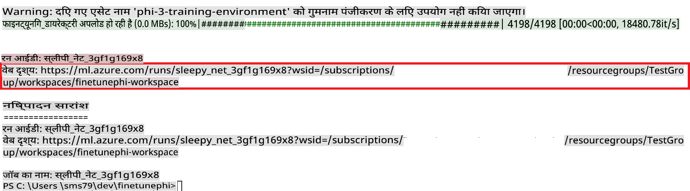

### Deploy the fine-tuned model

To integrate the fine-tuned Phi-3 model with Prompt Flow, you need to deploy the model to make it accessible for real-time inference. This process involves registering the model, creating an online endpoint, and deploying the model.

#### Set the model name, endpoint name, and deployment name for deployment

1. Open *config.py* file.

1. Replace `AZURE_MODEL_NAME = "your_fine_tuned_model_name"` with the desired name for your model.

1. Replace `AZURE_ENDPOINT_NAME = "your_fine_tuned_model_endpoint_name"` with the desired name for your endpoint.

1. Replace `AZURE_DEPLOYMENT_NAME = "your_fine_tuned_model_deployment_name"` को अपनी डिप्लॉयमेंट के लिए इच्छित नाम के साथ चलाने के बाद।

#### *deploy_model.py* फ़ाइल में कोड जोड़ें

*deploy_model.py* फ़ाइल को चलाना पूरी डिप्लॉयमेंट प्रक्रिया को स्वचालित करता है। यह मॉडल को पंजीकृत करता है, एक एंडपॉइंट बनाता है, और *config.py* फ़ाइल में निर्दिष्ट सेटिंग्स के आधार पर डिप्लॉयमेंट को निष्पादित करता है, जिसमें मॉडल का नाम, एंडपॉइंट नाम, और डिप्लॉयमेंट नाम शामिल है।

1. Visual Studio Code में *deploy_model.py* फ़ाइल खोलें।

1. निम्नलिखित कोड *deploy_model.py* में जोड़ें।

    ```python
    import logging
    from azure.identity import AzureCliCredential
    from azure.ai.ml import MLClient
    from azure.ai.ml.entities import Model, ProbeSettings, ManagedOnlineEndpoint, ManagedOnlineDeployment, IdentityConfiguration, ManagedIdentityConfiguration, OnlineRequestSettings
    from azure.ai.ml.constants import AssetTypes

    # Configuration imports
    from config import (
        AZURE_SUBSCRIPTION_ID,
        AZURE_RESOURCE_GROUP_NAME,
        AZURE_ML_WORKSPACE_NAME,
        AZURE_MANAGED_IDENTITY_RESOURCE_ID,
        AZURE_MANAGED_IDENTITY_CLIENT_ID,
        AZURE_MODEL_NAME,
        AZURE_ENDPOINT_NAME,
        AZURE_DEPLOYMENT_NAME
    )

    # Constants
    JOB_NAME = "your-job-name"
    COMPUTE_INSTANCE_TYPE = "Standard_E4s_v3"

    deployment_env_vars = {
        "SUBSCRIPTION_ID": AZURE_SUBSCRIPTION_ID,
        "RESOURCE_GROUP_NAME": AZURE_RESOURCE_GROUP_NAME,
        "UAI_CLIENT_ID": AZURE_MANAGED_IDENTITY_CLIENT_ID,
    }

    # Logging setup
    logging.basicConfig(
        format="%(asctime)s - %(levelname)s - %(name)s - %(message)s",
        datefmt="%Y-%m-%d %H:%M:%S",
        level=logging.DEBUG
    )
    logger = logging.getLogger(__name__)

    def get_ml_client():
        """Initialize and return the ML Client."""
        credential = AzureCliCredential()
        return MLClient(credential, AZURE_SUBSCRIPTION_ID, AZURE_RESOURCE_GROUP_NAME, AZURE_ML_WORKSPACE_NAME)

    def register_model(ml_client, model_name, job_name):
        """Register a new model."""
        model_path = f"azureml://jobs/{job_name}/outputs/artifacts/paths/model_output"
        logger.info(f"Registering model {model_name} from job {job_name} at path {model_path}.")
        run_model = Model(
            path=model_path,
            name=model_name,
            description="Model created from run.",
            type=AssetTypes.MLFLOW_MODEL,
        )
        model = ml_client.models.create_or_update(run_model)
        logger.info(f"Registered model ID: {model.id}")
        return model

    def delete_existing_endpoint(ml_client, endpoint_name):
        """Delete existing endpoint if it exists."""
        try:
            endpoint_result = ml_client.online_endpoints.get(name=endpoint_name)
            logger.info(f"Deleting existing endpoint {endpoint_name}.")
            ml_client.online_endpoints.begin_delete(name=endpoint_name).result()
            logger.info(f"Deleted existing endpoint {endpoint_name}.")
        except Exception as e:
            logger.info(f"No existing endpoint {endpoint_name} found to delete: {e}")

    def create_or_update_endpoint(ml_client, endpoint_name, description=""):
        """Create or update an endpoint."""
        delete_existing_endpoint(ml_client, endpoint_name)
        logger.info(f"Creating new endpoint {endpoint_name}.")
        endpoint = ManagedOnlineEndpoint(
            name=endpoint_name,
            description=description,
            identity=IdentityConfiguration(
                type="user_assigned",
                user_assigned_identities=[ManagedIdentityConfiguration(resource_id=AZURE_MANAGED_IDENTITY_RESOURCE_ID)]
            )
        )
        endpoint_result = ml_client.online_endpoints.begin_create_or_update(endpoint).result()
        logger.info(f"Created new endpoint {endpoint_name}.")
        return endpoint_result

    def create_or_update_deployment(ml_client, endpoint_name, deployment_name, model):
        """Create or update a deployment."""

        logger.info(f"Creating deployment {deployment_name} for endpoint {endpoint_name}.")
        deployment = ManagedOnlineDeployment(
            name=deployment_name,
            endpoint_name=endpoint_name,
            model=model.id,
            instance_type=COMPUTE_INSTANCE_TYPE,
            instance_count=1,
            environment_variables=deployment_env_vars,
            request_settings=OnlineRequestSettings(
                max_concurrent_requests_per_instance=3,
                request_timeout_ms=180000,
                max_queue_wait_ms=120000
            ),
            liveness_probe=ProbeSettings(
                failure_threshold=30,
                success_threshold=1,
                period=100,
                initial_delay=500,
            ),
            readiness_probe=ProbeSettings(
                failure_threshold=30,
                success_threshold=1,
                period=100,
                initial_delay=500,
            ),
        )
        deployment_result = ml_client.online_deployments.begin_create_or_update(deployment).result()
        logger.info(f"Created deployment {deployment.name} for endpoint {endpoint_name}.")
        return deployment_result

    def set_traffic_to_deployment(ml_client, endpoint_name, deployment_name):
        """Set traffic to the specified deployment."""
        try:
            # Fetch the current endpoint details
            endpoint = ml_client.online_endpoints.get(name=endpoint_name)
            
            # Log the current traffic allocation for debugging
            logger.info(f"Current traffic allocation: {endpoint.traffic}")
            
            # Set the traffic allocation for the deployment
            endpoint.traffic = {deployment_name: 100}
            
            # Update the endpoint with the new traffic allocation
            endpoint_poller = ml_client.online_endpoints.begin_create_or_update(endpoint)
            updated_endpoint = endpoint_poller.result()
            
            # Log the updated traffic allocation for debugging
            logger.info(f"Updated traffic allocation: {updated_endpoint.traffic}")
            logger.info(f"Set traffic to deployment {deployment_name} at endpoint {endpoint_name}.")
            return updated_endpoint
        except Exception as e:
            # Log any errors that occur during the process
            logger.error(f"Failed to set traffic to deployment: {e}")
            raise


    def main():
        ml_client = get_ml_client()

        registered_model = register_model(ml_client, AZURE_MODEL_NAME, JOB_NAME)
        logger.info(f"Registered model ID: {registered_model.id}")

        endpoint = create_or_update_endpoint(ml_client, AZURE_ENDPOINT_NAME, "Endpoint for finetuned Phi-3 model")
        logger.info(f"Endpoint {AZURE_ENDPOINT_NAME} is ready.")

        try:
            deployment = create_or_update_deployment(ml_client, AZURE_ENDPOINT_NAME, AZURE_DEPLOYMENT_NAME, registered_model)
            logger.info(f"Deployment {AZURE_DEPLOYMENT_NAME} is created for endpoint {AZURE_ENDPOINT_NAME}.")

            set_traffic_to_deployment(ml_client, AZURE_ENDPOINT_NAME, AZURE_DEPLOYMENT_NAME)
            logger.info(f"Traffic is set to deployment {AZURE_DEPLOYMENT_NAME} at endpoint {AZURE_ENDPOINT_NAME}.")
        except Exception as e:
            logger.error(f"Failed to create or update deployment: {e}")

    if __name__ == "__main__":
        main()

    ```

1. `JOB_NAME`:

    - Navigate to Azure Machine Learning resource that you created.
    - Select **Studio web URL** to open the Azure Machine Learning workspace.
    - Select **Jobs** from the left side tab.
    - Select the experiment for fine-tuning. For example, *finetunephi*.
    - Select the job that you created.
    - Copy and paste your job Name into the `JOB_NAME = "your-job-name"` in *deploy_model.py* file.

1. Replace `COMPUTE_INSTANCE_TYPE` के साथ अपने विशिष्ट विवरण को जोड़ने के लिए निम्नलिखित कार्य करें।

1. *deploy_model.py* स्क्रिप्ट को चलाने और Azure Machine Learning में डिप्लॉयमेंट प्रक्रिया शुरू करने के लिए निम्नलिखित कमांड टाइप करें।

    ```python
    python deploy_model.py
    ```

> [!WARNING]
> अपने खाते पर अतिरिक्त शुल्क से बचने के लिए, सुनिश्चित करें कि आप Azure Machine Learning वर्कस्पेस में बनाए गए एंडपॉइंट को हटा दें।
>

#### Azure Machine Learning Workspace में डिप्लॉयमेंट स्थिति की जांच करें

1. [Azure ML Studio](https://ml.azure.com/home?wt.mc_id=studentamb_279723) पर जाएं।

1. उस Azure Machine Learning वर्कस्पेस पर जाएं जिसे आपने बनाया है।

1. **Studio web URL** चुनें ताकि Azure Machine Learning वर्कस्पेस खुल सके।

1. बाईं ओर के टैब से **Endpoints** चुनें।

    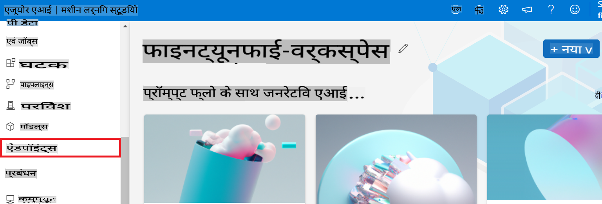

2. उस एंडपॉइंट को चुनें जिसे आपने बनाया है।

    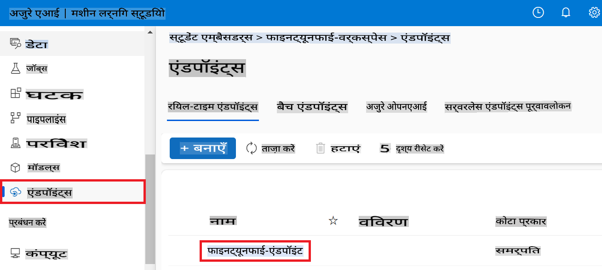

3. इस पेज पर, आप डिप्लॉयमेंट प्रक्रिया के दौरान बनाए गए एंडपॉइंट्स को प्रबंधित कर सकते हैं।

## परिदृश्य 3: Prompt Flow के साथ एकीकृत करें और अपने कस्टम मॉडल के साथ चैट करें

### कस्टम Phi-3 मॉडल को Prompt Flow के साथ एकीकृत करें

अपने फाइन-ट्यून किए गए मॉडल को सफलतापूर्वक डिप्लॉय करने के बाद, अब आप इसे Prompt Flow के साथ एकीकृत कर सकते हैं ताकि अपने मॉडल का वास्तविक समय के एप्लिकेशन में उपयोग कर सकें, जिससे आपके कस्टम Phi-3 मॉडल के साथ विभिन्न इंटरैक्टिव कार्य सक्षम हो सकें।

#### फाइन-ट्यून किए गए Phi-3 मॉडल का API कुंजी और एंडपॉइंट URI सेट करें

1. उस Azure Machine Learning वर्कस्पेस पर जाएं जिसे आपने बनाया है।
1. बाईं ओर के टैब से **Endpoints** चुनें।
1. उस एंडपॉइंट को चुनें जिसे आपने बनाया है।
1. नेविगेशन मेनू से **Consume** चुनें।
1. अपने **REST endpoint** को *config.py* फ़ाइल में कॉपी और पेस्ट करें, और `AZURE_ML_ENDPOINT = "your_fine_tuned_model_endpoint_uri"` with your **REST endpoint**.
1. Copy and paste your **Primary key** into the *config.py* file, replacing `AZURE_ML_API_KEY = "your_fine_tuned_model_api_key"` को अपने **Primary key** के साथ बदलें।

    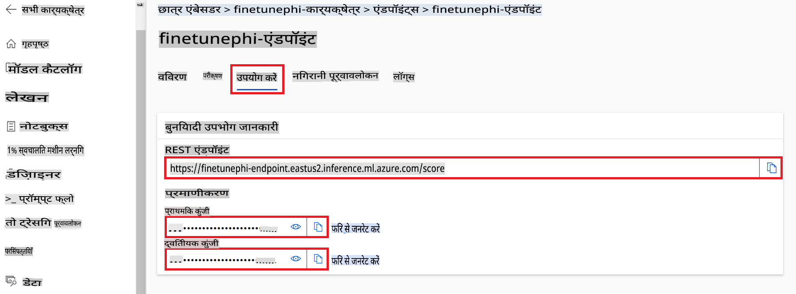

#### *flow.dag.yml* फ़ाइल में कोड जोड़ें

1. Visual Studio Code में *flow.dag.yml* फ़ाइल खोलें।

1. निम्नलिखित कोड *flow.dag.yml* में जोड़ें।

    ```yml
    inputs:
      input_data:
        type: string
        default: "Who founded Microsoft?"

    outputs:
      answer:
        type: string
        reference: ${integrate_with_promptflow.output}

    nodes:
    - name: integrate_with_promptflow
      type: python
      source:
        type: code
        path: integrate_with_promptflow.py
      inputs:
        input_data: ${inputs.input_data}
    ```

#### *integrate_with_promptflow.py* फ़ाइल में कोड जोड़ें

1. Visual Studio Code में *integrate_with_promptflow.py* फ़ाइल खोलें।

1. निम्नलिखित कोड *integrate_with_promptflow.py* में जोड़ें।

    ```python
    import logging
    import requests
    from promptflow.core import tool
    import asyncio
    import platform
    from config import (
        AZURE_ML_ENDPOINT,
        AZURE_ML_API_KEY
    )

    # Logging setup
    logging.basicConfig(
        format="%(asctime)s - %(levelname)s - %(name)s - %(message)s",
        datefmt="%Y-%m-%d %H:%M:%S",
        level=logging.DEBUG
    )
    logger = logging.getLogger(__name__)

    def query_azml_endpoint(input_data: list, endpoint_url: str, api_key: str) -> str:
        """
        Send a request to the Azure ML endpoint with the given input data.
        """
        headers = {
            "Content-Type": "application/json",
            "Authorization": f"Bearer {api_key}"
        }
        data = {
            "input_data": [input_data],
            "params": {
                "temperature": 0.7,
                "max_new_tokens": 128,
                "do_sample": True,
                "return_full_text": True
            }
        }
        try:
            response = requests.post(endpoint_url, json=data, headers=headers)
            response.raise_for_status()
            result = response.json()[0]
            logger.info("Successfully received response from Azure ML Endpoint.")
            return result
        except requests.exceptions.RequestException as e:
            logger.error(f"Error querying Azure ML Endpoint: {e}")
            raise

    def setup_asyncio_policy():
        """
        Setup asyncio event loop policy for Windows.
        """
        if platform.system() == 'Windows':
            asyncio.set_event_loop_policy(asyncio.WindowsSelectorEventLoopPolicy())
            logger.info("Set Windows asyncio event loop policy.")

    @tool
    def my_python_tool(input_data: str) -> str:
        """
        Tool function to process input data and query the Azure ML endpoint.
        """
        setup_asyncio_policy()
        return query_azml_endpoint(input_data, AZURE_ML_ENDPOINT, AZURE_ML_API_KEY)

    ```

### अपने कस्टम मॉडल के साथ चैट करें

1. *deploy_model.py* स्क्रिप्ट को चलाने और Azure Machine Learning में डिप्लॉयमेंट प्रक्रिया शुरू करने के लिए निम्नलिखित कमांड टाइप करें।

    ```python
    pf flow serve --source ./ --port 8080 --host localhost
    ```

1. यहां एक उदाहरण है: अब आप अपने कस्टम Phi-3 मॉडल के साथ चैट कर सकते हैं। अनुशंसा की जाती है कि आप फाइन-ट्यूनिंग के लिए उपयोग किए गए डेटा के आधार पर प्रश्न पूछें।

    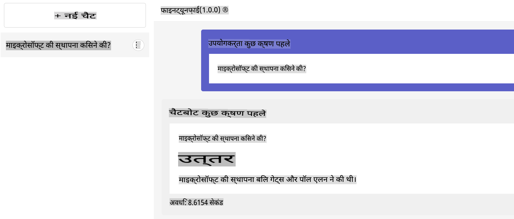

**अस्वीकरण**:  
यह दस्तावेज़ मशीन-आधारित एआई अनुवाद सेवाओं का उपयोग करके अनुवादित किया गया है। जबकि हम सटीकता के लिए प्रयास करते हैं, कृपया ध्यान दें कि स्वचालित अनुवादों में त्रुटियाँ या अशुद्धियाँ हो सकती हैं। मूल दस्तावेज़ को उसकी मूल भाषा में आधिकारिक स्रोत माना जाना चाहिए। महत्वपूर्ण जानकारी के लिए, पेशेवर मानव अनुवाद की सिफारिश की जाती है। इस अनुवाद के उपयोग से उत्पन्न किसी भी गलतफहमी या गलत व्याख्या के लिए हम जिम्मेदार नहीं हैं।