# Fine-tune और Azure AI Foundry में Prompt Flow के साथ कस्टम Phi-3 मॉडल को इंटीग्रेट करें

यह एंड-टू-एंड (E2E) सैंपल Microsoft Tech Community की गाइड "[Fine-Tune and Integrate Custom Phi-3 Models with Prompt Flow in Azure AI Foundry](https://techcommunity.microsoft.com/t5/educator-developer-blog/fine-tune-and-integrate-custom-phi-3-models-with-prompt-flow-in/ba-p/4191726?WT.mc_id=aiml-137032-kinfeylo)" पर आधारित है। इसमें कस्टम Phi-3 मॉडल को फाइन-ट्यून, डिप्लॉय और Prompt Flow के साथ इंटीग्रेट करने की प्रक्रिया का परिचय दिया गया है।  
E2E सैंपल "[Fine-Tune and Integrate Custom Phi-3 Models with Prompt Flow](./E2E_Phi-3-FineTuning_PromptFlow_Integration.md)" के विपरीत, जिसमें कोड को लोकली रन करना शामिल था, यह ट्यूटोरियल पूरी तरह Azure AI / ML Studio के भीतर आपके मॉडल को फाइन-ट्यून और इंटीग्रेट करने पर केंद्रित है।

## ओवरव्यू

इस E2E सैंपल में, आप सीखेंगे कि Phi-3 मॉडल को फाइन-ट्यून और Azure AI Foundry में Prompt Flow के साथ इंटीग्रेट कैसे करें। Azure AI / ML Studio का उपयोग करके, आप कस्टम AI मॉडल को डिप्लॉय और उपयोग करने के लिए एक वर्कफ़्लो स्थापित करेंगे। यह सैंपल तीन परिदृश्यों में विभाजित है:

**परिदृश्य 1: Azure संसाधनों को सेट अप करें और फाइन-ट्यूनिंग के लिए तैयारी करें**

**परिदृश्य 2: Phi-3 मॉडल को फाइन-ट्यून करें और Azure Machine Learning Studio में डिप्लॉय करें**

**परिदृश्य 3: Prompt Flow के साथ इंटीग्रेट करें और Azure AI Foundry में अपने कस्टम मॉडल के साथ चैट करें**

यहां इस E2E सैंपल का ओवरव्यू दिया गया है।

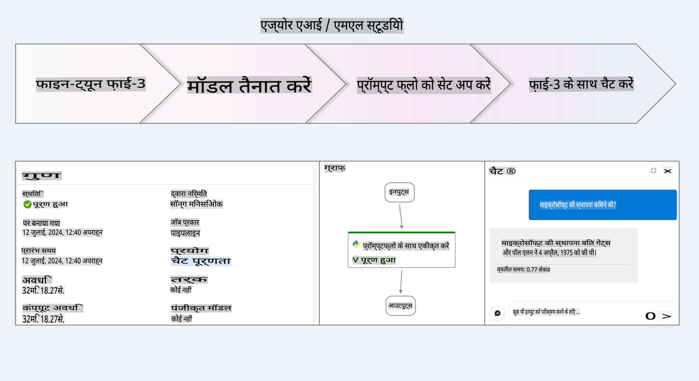

### सामग्री तालिका

1. **[परिदृश्य 1: Azure संसाधनों को सेट अप करें और फाइन-ट्यूनिंग के लिए तैयारी करें](../../../../../../md/02.Application/01.TextAndChat/Phi3)**
    - [Azure Machine Learning Workspace बनाएं](../../../../../../md/02.Application/01.TextAndChat/Phi3)
    - [Azure Subscription में GPU कोटा का अनुरोध करें](../../../../../../md/02.Application/01.TextAndChat/Phi3)
    - [भूमिका असाइनमेंट जोड़ें](../../../../../../md/02.Application/01.TextAndChat/Phi3)
    - [प्रोजेक्ट सेट अप करें](../../../../../../md/02.Application/01.TextAndChat/Phi3)
    - [फाइन-ट्यूनिंग के लिए डेटा सेट तैयार करें](../../../../../../md/02.Application/01.TextAndChat/Phi3)

1. **[परिदृश्य 2: Phi-3 मॉडल को फाइन-ट्यून करें और Azure Machine Learning Studio में डिप्लॉय करें](../../../../../../md/02.Application/01.TextAndChat/Phi3)**
    - [Phi-3 मॉडल को फाइन-ट्यून करें](../../../../../../md/02.Application/01.TextAndChat/Phi3)
    - [फाइन-ट्यून किए गए Phi-3 मॉडल को डिप्लॉय करें](../../../../../../md/02.Application/01.TextAndChat/Phi3)

1. **[परिदृश्य 3: Prompt Flow के साथ इंटीग्रेट करें और Azure AI Foundry में अपने कस्टम मॉडल के साथ चैट करें](../../../../../../md/02.Application/01.TextAndChat/Phi3)**
    - [कस्टम Phi-3 मॉडल को Prompt Flow के साथ इंटीग्रेट करें](../../../../../../md/02.Application/01.TextAndChat/Phi3)
    - [अपने कस्टम Phi-3 मॉडल के साथ चैट करें](../../../../../../md/02.Application/01.TextAndChat/Phi3)

## परिदृश्य 1: Azure संसाधनों को सेट अप करें और फाइन-ट्यूनिंग के लिए तैयारी करें

### Azure Machine Learning Workspace बनाएं

1. पोर्टल पेज के शीर्ष पर **सर्च बार** में *azure machine learning* टाइप करें और दिखाई देने वाले विकल्पों में से **Azure Machine Learning** को चुनें।

    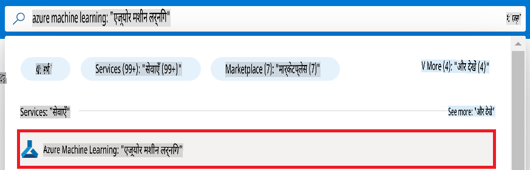

2. नेविगेशन मेनू से **+ Create** चुनें।

3. नेविगेशन मेनू से **New workspace** चुनें।

    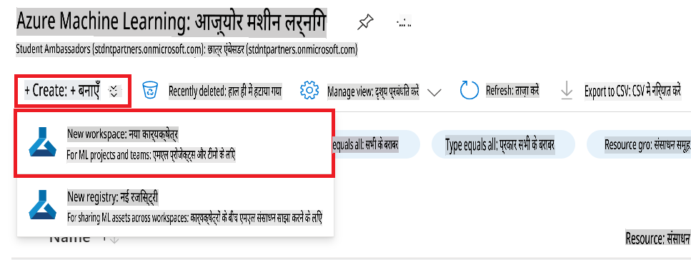

4. निम्नलिखित कार्य करें:

    - अपना Azure **Subscription** चुनें।
    - उपयोग के लिए **Resource group** चुनें (यदि आवश्यक हो तो नया बनाएं)।
    - **Workspace Name** दर्ज करें। यह एक यूनिक वैल्यू होनी चाहिए।
    - उपयोग के लिए **Region** चुनें।
    - उपयोग के लिए **Storage account** चुनें (यदि आवश्यक हो तो नया बनाएं)।
    - उपयोग के लिए **Key vault** चुनें (यदि आवश्यक हो तो नया बनाएं)।
    - उपयोग के लिए **Application insights** चुनें (यदि आवश्यक हो तो नया बनाएं)।
    - उपयोग के लिए **Container registry** चुनें (यदि आवश्यक हो तो नया बनाएं)।

    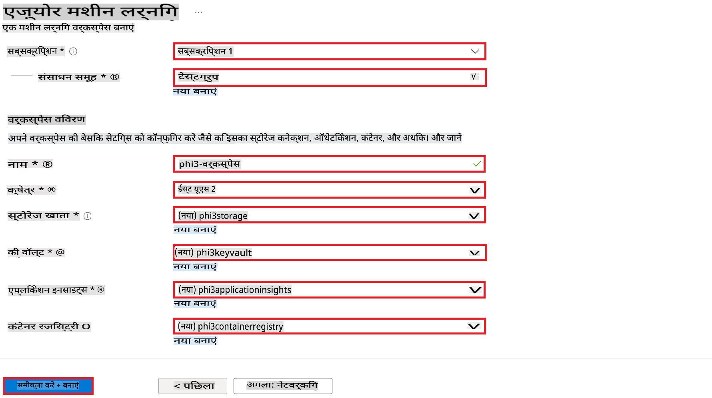

5. **Review + Create** चुनें।

6. **Create** चुनें।

### Azure Subscription में GPU कोटा का अनुरोध करें

इस ट्यूटोरियल में, आप GPU का उपयोग करके Phi-3 मॉडल को फाइन-ट्यून और डिप्लॉय करना सीखेंगे। फाइन-ट्यूनिंग के लिए, आप *Standard_NC24ads_A100_v4* GPU का उपयोग करेंगे, जिसके लिए कोटा अनुरोध की आवश्यकता होती है। डिप्लॉयमेंट के लिए, आप *Standard_NC6s_v3* GPU का उपयोग करेंगे, जिसके लिए भी कोटा अनुरोध की आवश्यकता होती है।

> [!NOTE]
>
> केवल Pay-As-You-Go सब्सक्रिप्शन (मानक सब्सक्रिप्शन प्रकार) GPU आवंटन के लिए पात्र हैं; लाभ सब्सक्रिप्शन वर्तमान में समर्थित नहीं हैं।
>

1. [Azure ML Studio](https://ml.azure.com/home?wt.mc_id=studentamb_279723) पर जाएं।

1. *Standard NCADSA100v4 Family* कोटा का अनुरोध करने के लिए निम्नलिखित कार्य करें:

    - बाईं ओर टैब से **Quota** चुनें।
    - उपयोग के लिए **Virtual machine family** चुनें। उदाहरण के लिए, **Standard NCADSA100v4 Family Cluster Dedicated vCPUs** चुनें, जिसमें *Standard_NC24ads_A100_v4* GPU शामिल है।
    - नेविगेशन मेनू से **Request quota** चुनें।

        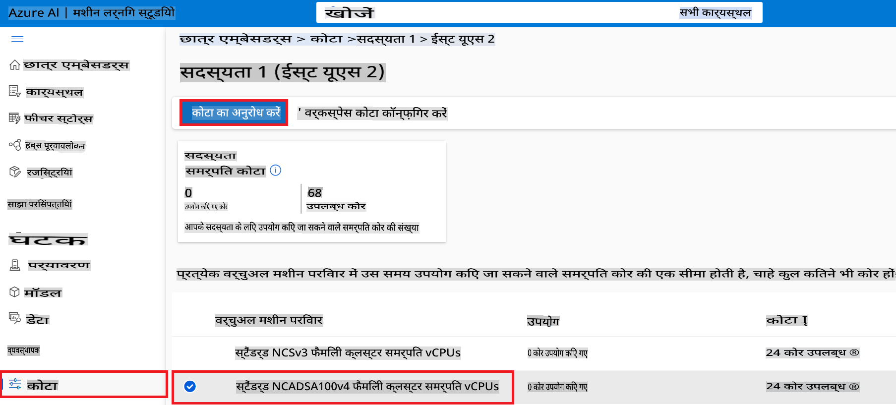

    - Request quota पेज के अंदर, वह **New cores limit** दर्ज करें जिसे आप उपयोग करना चाहते हैं। उदाहरण के लिए, 24।
    - Request quota पेज के अंदर, GPU कोटा का अनुरोध करने के लिए **Submit** चुनें।

1. *Standard NCSv3 Family* कोटा का अनुरोध करने के लिए निम्नलिखित कार्य करें:

    - बाईं ओर टैब से **Quota** चुनें।
    - उपयोग के लिए **Virtual machine family** चुनें। उदाहरण के लिए, **Standard NCSv3 Family Cluster Dedicated vCPUs** चुनें, जिसमें *Standard_NC6s_v3* GPU शामिल है।
    - नेविगेशन मेनू से **Request quota** चुनें।
    - Request quota पेज के अंदर, वह **New cores limit** दर्ज करें जिसे आप उपयोग करना चाहते हैं। उदाहरण के लिए, 24।
    - Request quota पेज के अंदर, GPU कोटा का अनुरोध करने के लिए **Submit** चुनें।

### भूमिका असाइनमेंट जोड़ें

अपने मॉडल को फाइन-ट्यून और डिप्लॉय करने के लिए, आपको पहले एक User Assigned Managed Identity (UAI) बनानी होगी और इसे उचित अनुमतियां असाइन करनी होंगी। यह UAI डिप्लॉयमेंट के दौरान प्रमाणन के लिए उपयोग की जाएगी।

#### User Assigned Managed Identity (UAI) बनाएं

1. पोर्टल पेज के शीर्ष पर **सर्च बार** में *managed identities* टाइप करें और दिखाई देने वाले विकल्पों में से **Managed Identities** को चुनें।

    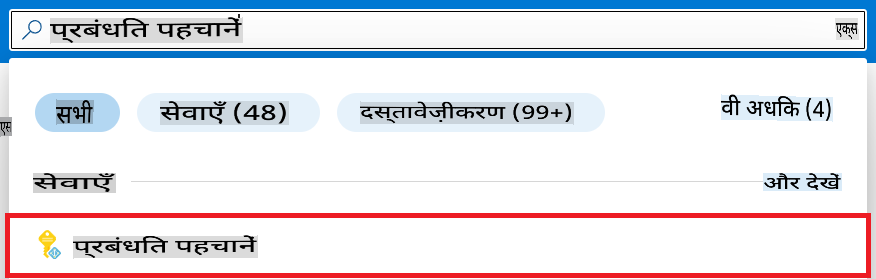

1. **+ Create** चुनें।

    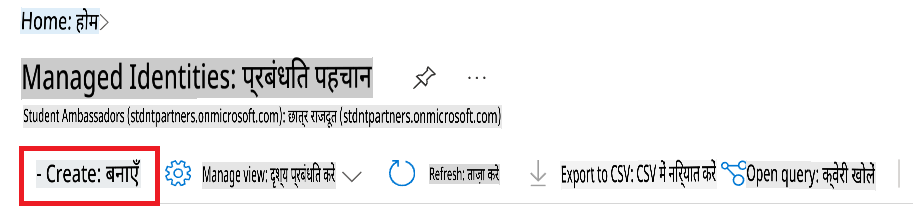

1. निम्नलिखित कार्य करें:

    - अपना Azure **Subscription** चुनें।
    - उपयोग के लिए **Resource group** चुनें (यदि आवश्यक हो तो नया बनाएं)।
    - उपयोग के लिए **Region** चुनें।
    - **Name** दर्ज करें। यह एक यूनिक वैल्यू होनी चाहिए।

    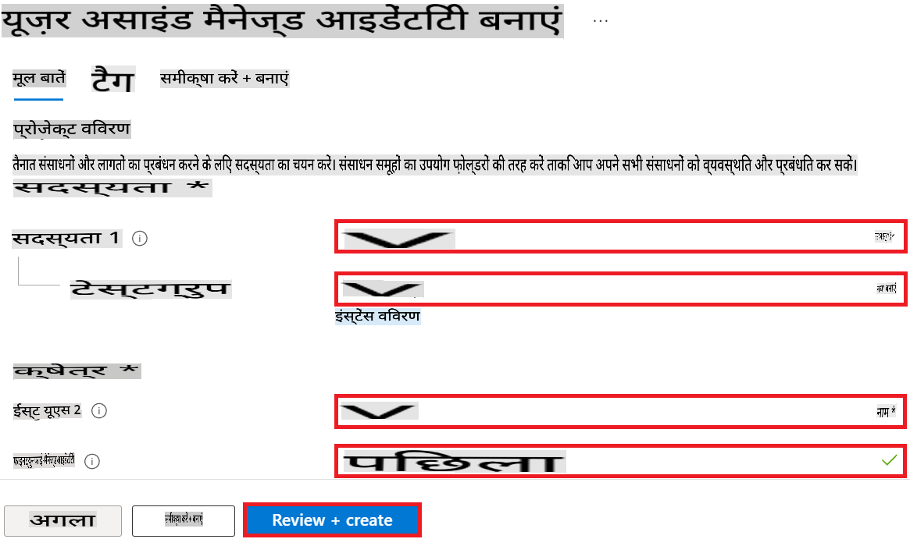

1. **Review + create** चुनें।

1. **+ Create** चुनें।

#### Managed Identity को Contributor भूमिका असाइन करें

1. उस Managed Identity संसाधन पर जाएं जिसे आपने बनाया है।

1. बाईं ओर टैब से **Azure role assignments** चुनें।

1. नेविगेशन मेनू से **+Add role assignment** चुनें।

1. Add role assignment पेज के अंदर, निम्नलिखित कार्य करें:
    - **Scope** को **Resource group** पर सेट करें।
    - अपना Azure **Subscription** चुनें।
    - उपयोग के लिए **Resource group** चुनें।
    - **Role** को **Contributor** पर सेट करें।

    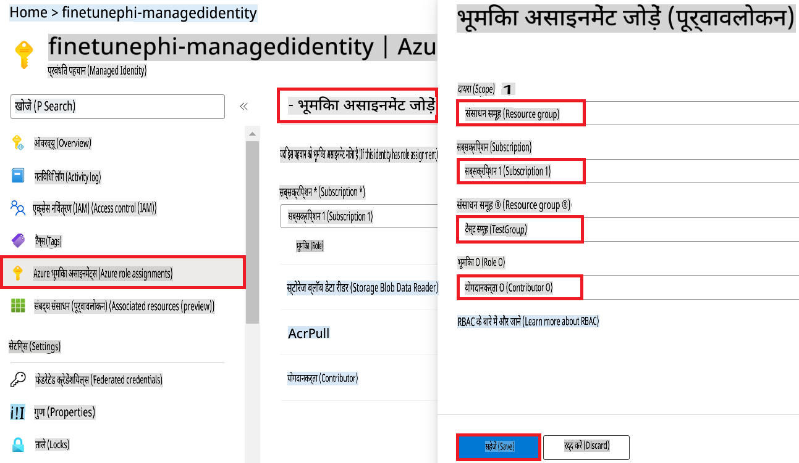

2. **Save** चुनें।

#### Managed Identity को Storage Blob Data Reader भूमिका असाइन करें

1. पोर्टल पेज के शीर्ष पर **सर्च बार** में *storage accounts* टाइप करें और दिखाई देने वाले विकल्पों में से **Storage accounts** को चुनें।

    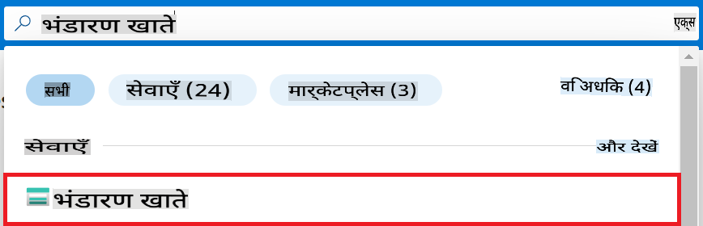

1. उस स्टोरेज अकाउंट का चयन करें जो आपने Azure Machine Learning Workspace के साथ एसोसिएट किया है। उदाहरण के लिए, *finetunephistorage*।

1. Add role assignment पेज पर जाने के लिए निम्नलिखित कार्य करें:

    - उस Azure Storage अकाउंट पर जाएं जिसे आपने बनाया है।
    - बाईं ओर टैब से **Access Control (IAM)** चुनें।
    - नेविगेशन मेनू से **+ Add** चुनें।
    - नेविगेशन मेनू से **Add role assignment** चुनें।

    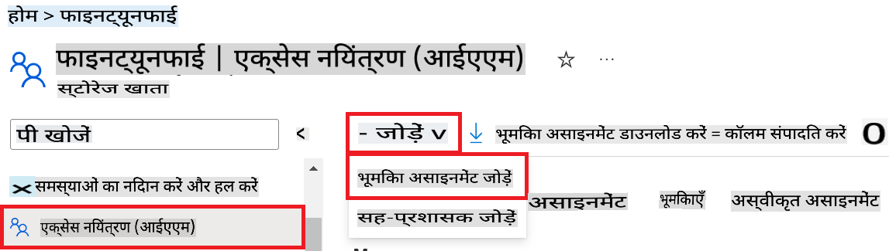

1. Add role assignment पेज के अंदर, निम्नलिखित कार्य करें:

    - **Role** पेज के अंदर, **Storage Blob Data Reader** को खोजें और चुनें।
    - **Role** पेज के अंदर, **Next** चुनें।
    - **Members** पेज के अंदर, **Assign access to** को **Managed identity** पर सेट करें।
    - **Members** पेज के अंदर, **+ Select members** चुनें।
    - Select managed identities पेज के अंदर, अपना Azure **Subscription** चुनें।
    - Select managed identities पेज के अंदर, **Managed identity** को चुनें।
    - Select managed identities पेज के अंदर, वह Managed Identity चुनें जिसे आपने बनाया है। उदाहरण के लिए, *finetunephi-managedidentity*।
    - Select managed identities पेज के अंदर, **Select** चुनें।

    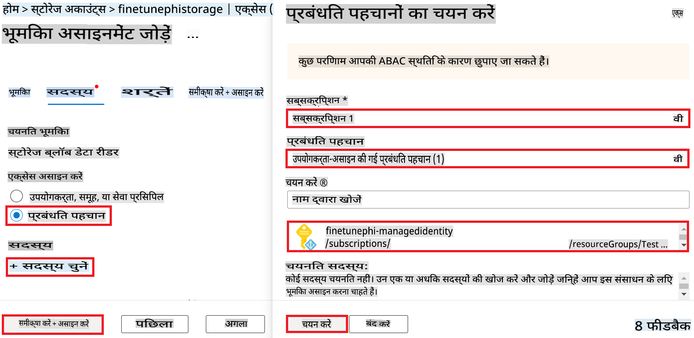

1. **Review + assign** चुनें।

#### Managed Identity को AcrPull भूमिका असाइन करें

1. पोर्टल पेज के शीर्ष पर **सर्च बार** में *container registries* टाइप करें और दिखाई देने वाले विकल्पों में से **Container registries** को चुनें।

    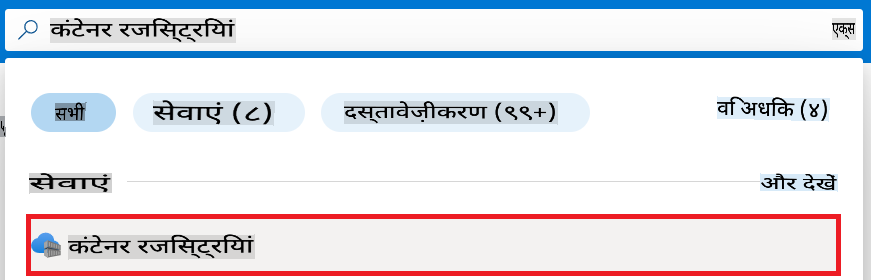

1. उस कंटेनर रजिस्ट्री का चयन करें जो Azure Machine Learning Workspace के साथ एसोसिएट है। उदाहरण के लिए, *finetunephicontainerregistry*

1. Add role assignment पेज पर जाने के लिए निम्नलिखित कार्य करें:

    - बाईं ओर टैब से **Access Control (IAM)** चुनें।
    - नेविगेशन मेनू से **+ Add** चुनें।
    - नेविगेशन मेनू से **Add role assignment** चुनें।

1. Add role assignment पेज के अंदर, निम्नलिखित कार्य करें:

    - **Role** पेज के अंदर, **AcrPull** को खोजें और चुनें।
    - **Role** पेज के अंदर, **Next** चुनें।
    - **Members** पेज के अंदर, **Assign access to** को **Managed identity** पर सेट करें।
    - **Members** पेज के अंदर, **+ Select members** चुनें।
    - Select managed identities पेज के अंदर, अपना Azure **Subscription** चुनें।
    - Select managed identities पेज के अंदर, **Managed identity** को चुनें।
    - Select managed identities पेज के अंदर, वह Managed Identity चुनें जिसे आपने बनाया है। उदाहरण के लिए, *finetunephi-managedidentity*।
    - Select managed identities पेज के अंदर, **Select** चुनें।
    - **Review + assign** चुनें।

### प्रोजेक्ट सेट अप करें

डेटासेट डाउनलोड करने के लिए एक लोकल वातावरण सेट अप करें।

इस अभ्यास में, आप:

- काम करने के लिए एक फ़ोल्डर बनाएंगे।
- एक वर्चुअल वातावरण बनाएंगे।
- आवश्यक पैकेज इंस्टॉल करेंगे।
- *download_dataset.py* फ़ाइल बनाएंगे ताकि डेटासेट डाउनलोड किया जा सके।

#### काम करने के लिए एक फ़ोल्डर बनाएँ

1. एक टर्मिनल विंडो खोलें और *finetune-phi* नाम का फ़ोल्डर बनाने के लिए निम्नलिखित कमांड टाइप करें।

    ```console
    mkdir finetune-phi
    ```

2. बनाए गए *finetune-phi* फ़ोल्डर पर नेविगेट करने के लिए निम्नलिखित कमांड टाइप करें।

    ```console
    cd finetune-phi
    ```

#### वर्चुअल वातावरण बनाएँ

1. एक वर्चुअल वातावरण *.venv* बनाने के लिए निम्नलिखित कमांड टाइप करें।

    ```console
    python -m venv .venv
    ```

2. वर्चुअल वातावरण को सक्रिय करने के लिए निम्नलिखित कमांड टाइप करें।

    ```console
    .venv\Scripts\activate.bat
    ```

> [!NOTE]
> यदि यह सफल हुआ, तो आपको कमांड प्रॉम्प्ट के पहले *(.venv)* दिखाई देगा।

#### आवश्यक पैकेज इंस्टॉल करें

1. आवश्यक पैकेज इंस्टॉल करने के लिए निम्नलिखित कमांड टाइप करें।

    ```console
    pip install datasets==2.19.1
    ```

#### `download_dataset.py` फ़ाइल बनाएँ

> [!NOTE]
> पूर्ण फ़ोल्डर संरचना:
>
> ```text
> └── YourUserName
> .    └── finetune-phi
> .        └── download_dataset.py
> ```

1. **Visual Studio Code** खोलें।

1. मेनू बार से **File** चुनें।

1. **Open Folder** चुनें।

1. *finetune-phi* फ़ोल्डर का चयन करें जिसे आपने बनाया है, जो *C:\Users\yourUserName\finetune-phi* पर स्थित है।

    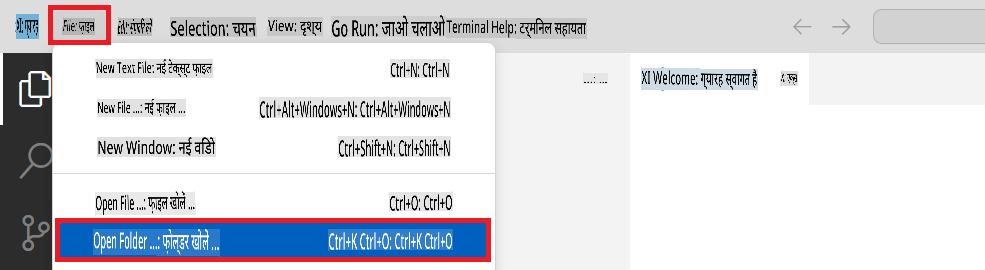

1. Visual Studio Code के बाएं पैन में, राइट-क्लिक करें और **New File** चुनें ताकि *download_dataset.py* नाम की नई फ़ाइल बनाई जा सके।

    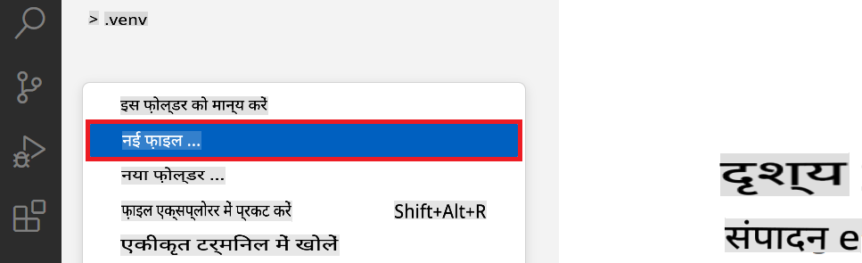

### फाइन-ट्यूनिंग के लिए डेटासेट तैयार करें

इस अभ्यास में, आप *download_dataset.py* फ़ाइल चलाकर *ultrachat_200k* डेटासेट को अपने लोकल वातावरण में डाउनलोड करेंगे। इसके बाद आप इस डेटासेट का उपयोग Azure Machine Learning में Phi-3 मॉडल को फाइन-ट्यून करने के लिए करेंगे।

इस अभ्यास में, आप:

- *download_dataset.py* फ़ाइल में कोड जोड़ेंगे ताकि डेटासेट डाउनलोड किया जा सके।
- *download_dataset.py* फ़ाइल चलाकर डेटासेट को अपने लोकल वातावरण में डाउनलोड करेंगे।

#### *download_dataset.py* का उपयोग करके डेटासेट डाउनलोड करें

1. Visual Studio Code में *download_dataset.py* फ़ाइल खोलें।

1. *download_dataset.py* फ़ाइल में निम्नलिखित कोड जोड़ें।

    ```python
    import json
    import os
    from datasets import load_dataset

    def load_and_split_dataset(dataset_name, config_name, split_ratio):
        """
        Load and split a dataset.
        """
        # Load the dataset with the specified name, configuration, and split ratio
        dataset = load_dataset(dataset_name, config_name, split=split_ratio)
        print(f"Original dataset size: {len(dataset)}")
        
        # Split the dataset into train and test sets (80% train, 20% test)
        split_dataset = dataset.train_test_split(test_size=0.2)
        print(f"Train dataset size: {len(split_dataset['train'])}")
        print(f"Test dataset size: {len(split_dataset['test'])}")
        
        return split_dataset

    def save_dataset_to_jsonl(dataset, filepath):
        """
        Save a dataset to a JSONL file.
        """
        # Create the directory if it does not exist
        os.makedirs(os.path.dirname(filepath), exist_ok=True)
        
        # Open the file in write mode
        with open(filepath, 'w', encoding='utf-8') as f:
            # Iterate over each record in the dataset
            for record in dataset:
                # Dump the record as a JSON object and write it to the file
                json.dump(record, f)
                # Write a newline character to separate records
                f.write('\n')
        
        print(f"Dataset saved to {filepath}")

    def main():
        """
        Main function to load, split, and save the dataset.
        """
        # Load and split the ULTRACHAT_200k dataset with a specific configuration and split ratio
        dataset = load_and_split_dataset("HuggingFaceH4/ultrachat_200k", 'default', 'train_sft[:1%]')
        
        # Extract the train and test datasets from the split
        train_dataset = dataset['train']
        test_dataset = dataset['test']

        # Save the train dataset to a JSONL file
        save_dataset_to_jsonl(train_dataset, "data/train_data.jsonl")
        
        # Save the test dataset to a separate JSONL file
        save_dataset_to_jsonl(test_dataset, "data/test_data.jsonl")

    if __name__ == "__main__":
        main()

    ```

1. स्क्रिप्ट चलाने और अपने लोकल वातावरण में डेटासेट डाउनलोड करने के लिए निम्नलिखित कमांड टाइप करें।

    ```console
    python download_dataset.py
    ```

1. यह सत्यापित करें कि डेटासेट सफलतापूर्वक आपके लोकल *finetune-phi/data* डायरेक्टरी में सेव हो गया है।

> [!NOTE]
>
> #### डेटासेट के आकार और फाइन-ट्यूनिंग समय पर नोट
>
> इस ट्यूटोरियल में, आप केवल 1% डेटासेट (`split='train[:1%]'`) का
1. [Azure ML Studio](https://ml.azure.com/home?wt.mc_id=studentamb_279723) पर जाएं।

1. बाईं ओर के टैब से **Compute** चुनें।

1. नेविगेशन मेनू से **Compute clusters** चुनें।

1. **+ New** पर क्लिक करें।

    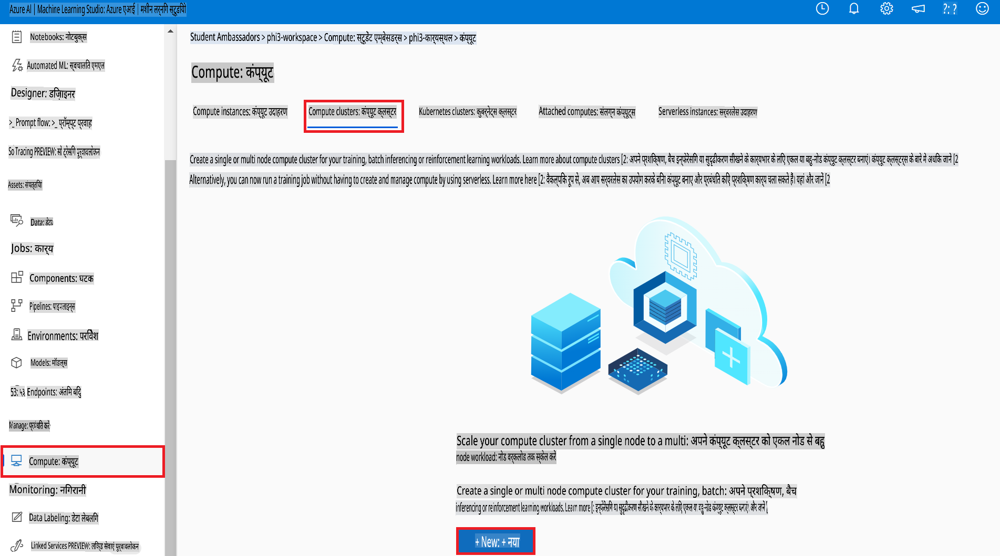

1. निम्नलिखित कार्य करें:

    - वह **Region** चुनें जिसे आप उपयोग करना चाहते हैं।
    - **Virtual machine tier** को **Dedicated** पर सेट करें।
    - **Virtual machine type** को **GPU** पर सेट करें।
    - **Virtual machine size** फिल्टर को **Select from all options** पर सेट करें।
    - **Virtual machine size** को **Standard_NC24ads_A100_v4** पर सेट करें।

    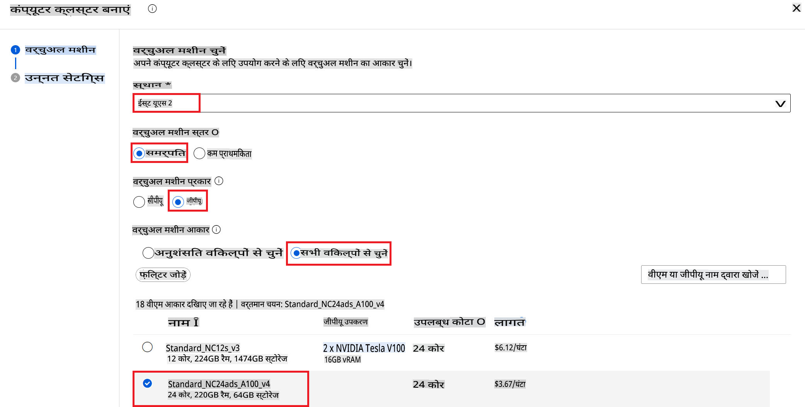

1. **Next** पर क्लिक करें।

1. निम्नलिखित कार्य करें:

    - **Compute name** दर्ज करें। यह एक अद्वितीय मान होना चाहिए।
    - **Minimum number of nodes** को **0** पर सेट करें।
    - **Maximum number of nodes** को **1** पर सेट करें।
    - **Idle seconds before scale down** को **120** पर सेट करें।

    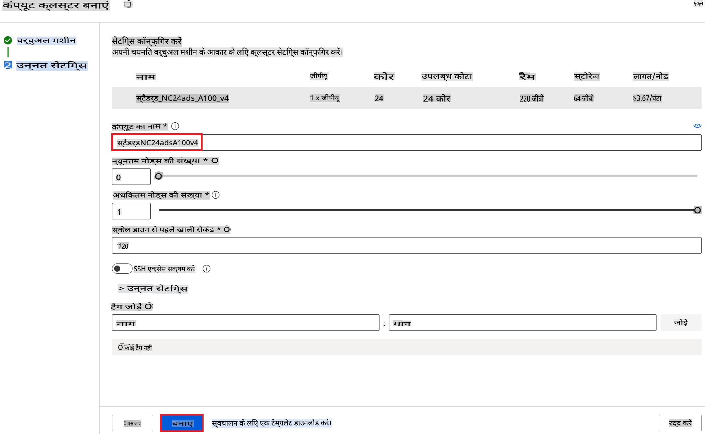

1. **Create** पर क्लिक करें।

#### Phi-3 मॉडल को फाइन-ट्यून करें

1. [Azure ML Studio](https://ml.azure.com/home?wt.mc_id=studentamb_279723) पर जाएं।

1. वह Azure Machine Learning कार्यक्षेत्र चुनें जिसे आपने बनाया है।

    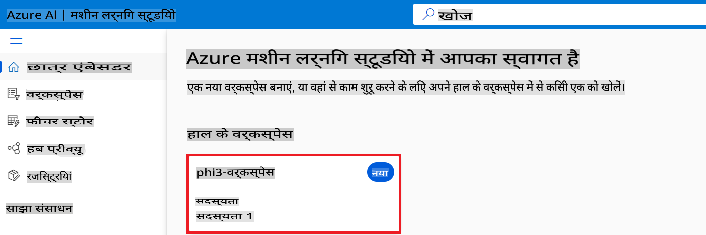

1. निम्नलिखित कार्य करें:

    - बाईं ओर के टैब से **Model catalog** चुनें।
    - **search bar** में *phi-3-mini-4k* टाइप करें और जो विकल्प दिखाई दें उनमें से **Phi-3-mini-4k-instruct** चुनें।

    

1. नेविगेशन मेनू से **Fine-tune** चुनें।

    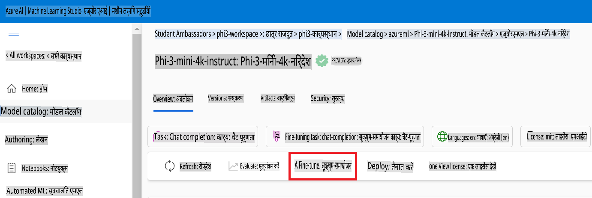

1. निम्नलिखित कार्य करें:

    - **Select task type** को **Chat completion** पर सेट करें।
    - **+ Select data** चुनें और **Training data** अपलोड करें।
    - Validation data अपलोड प्रकार को **Provide different validation data** पर सेट करें।
    - **+ Select data** चुनें और **Validation data** अपलोड करें।

    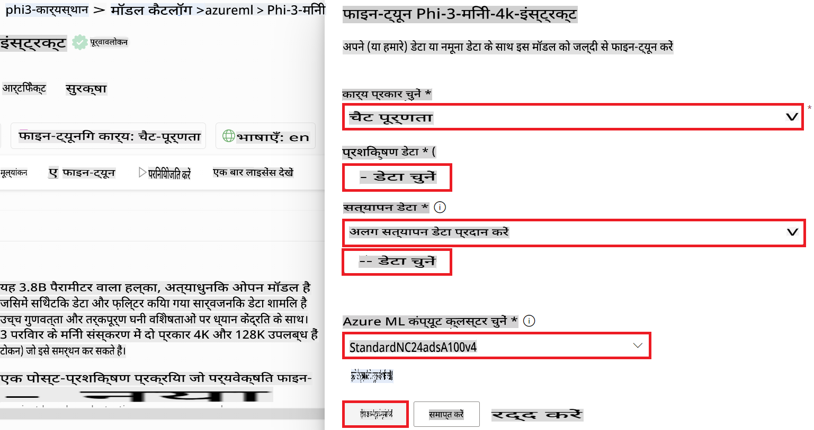

    > [!TIP]
    >
    > आप **Advanced settings** चुन सकते हैं ताकि आप **learning_rate** और **lr_scheduler_type** जैसी सेटिंग्स को कस्टमाइज़ कर सकें और फाइन-ट्यूनिंग प्रक्रिया को अपनी आवश्यकताओं के अनुसार अनुकूलित कर सकें।

1. **Finish** पर क्लिक करें।

1. इस अभ्यास में, आपने Azure Machine Learning का उपयोग करके Phi-3 मॉडल को सफलतापूर्वक फाइन-ट्यून किया। कृपया ध्यान दें कि फाइन-ट्यूनिंग प्रक्रिया में काफी समय लग सकता है। फाइन-ट्यूनिंग जॉब चलाने के बाद, आपको इसके पूरा होने का इंतजार करना होगा। आप अपने Azure Machine Learning कार्यक्षेत्र में बाईं ओर के **Jobs** टैब पर जाकर फाइन-ट्यूनिंग जॉब की स्थिति की निगरानी कर सकते हैं। अगली श्रृंखला में, आप फाइन-ट्यून किए गए मॉडल को तैनात करेंगे और इसे Prompt flow के साथ एकीकृत करेंगे।

    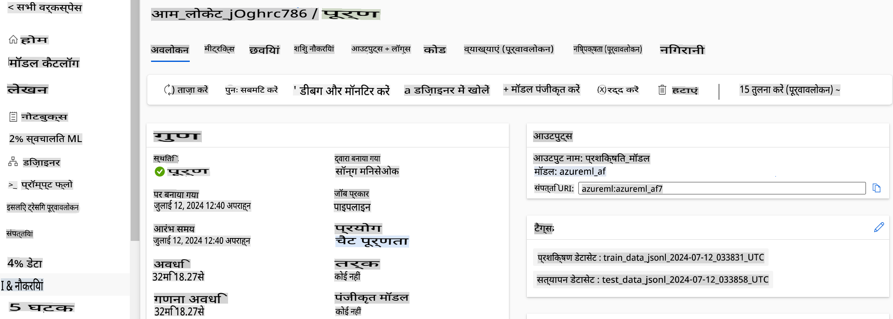

### फाइन-ट्यून किए गए Phi-3 मॉडल को तैनात करें

फाइन-ट्यून किए गए Phi-3 मॉडल को Prompt flow के साथ एकीकृत करने के लिए, आपको मॉडल को तैनात करना होगा ताकि यह रीयल-टाइम इन्फरेंस के लिए सुलभ हो सके। इस प्रक्रिया में मॉडल को रजिस्टर करना, एक ऑनलाइन एंडपॉइंट बनाना और मॉडल को तैनात करना शामिल है।

इस अभ्यास में, आप करेंगे:

- फाइन-ट्यून किए गए मॉडल को Azure Machine Learning कार्यक्षेत्र में रजिस्टर करें।
- एक ऑनलाइन एंडपॉइंट बनाएं।
- रजिस्टर किए गए फाइन-ट्यून किए गए Phi-3 मॉडल को तैनात करें।

#### फाइन-ट्यून किए गए मॉडल को रजिस्टर करें

1. [Azure ML Studio](https://ml.azure.com/home?wt.mc_id=studentamb_279723) पर जाएं।

1. वह Azure Machine Learning कार्यक्षेत्र चुनें जिसे आपने बनाया है।

    

1. बाईं ओर के टैब से **Models** चुनें।
1. **+ Register** चुनें।
1. **From a job output** चुनें।

    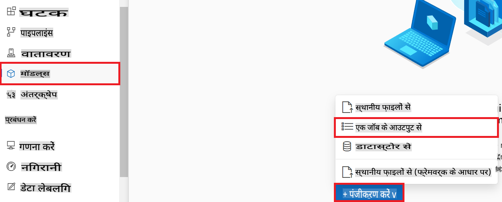

1. वह जॉब चुनें जिसे आपने बनाया था।

    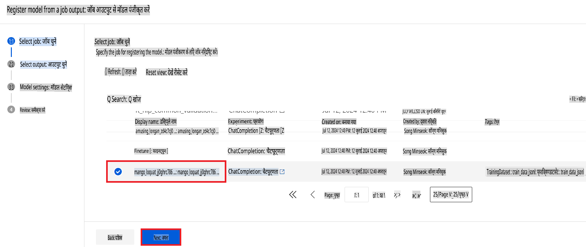

1. **Next** पर क्लिक करें।

1. **Model type** को **MLflow** पर सेट करें।

1. सुनिश्चित करें कि **Job output** चयनित है; यह स्वचालित रूप से चयनित होना चाहिए।

    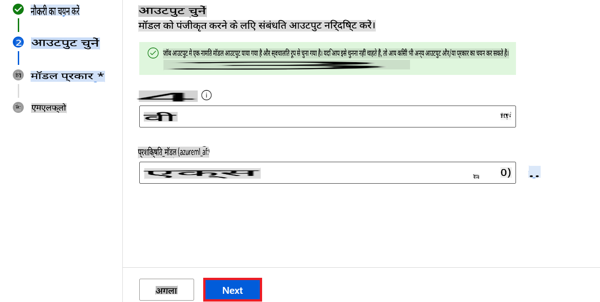

2. **Next** पर क्लिक करें।

3. **Register** पर क्लिक करें।

    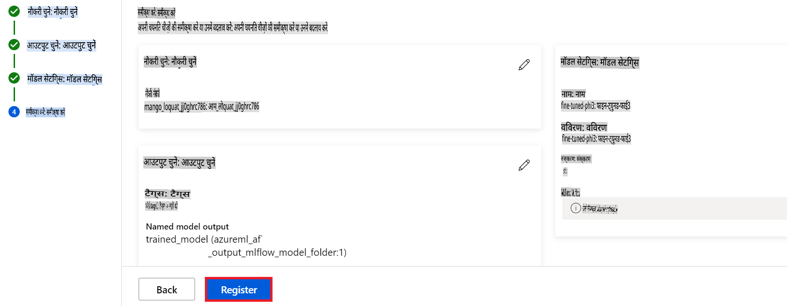

4. आप बाईं ओर के **Models** मेनू पर जाकर अपने रजिस्टर किए गए मॉडल को देख सकते हैं।

    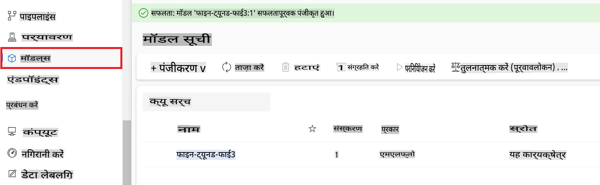

#### फाइन-ट्यून किए गए मॉडल को तैनात करें

1. उस Azure Machine Learning कार्यक्षेत्र पर जाएं जिसे आपने बनाया है।

1. बाईं ओर के टैब से **Endpoints** चुनें।

1. नेविगेशन मेनू से **Real-time endpoints** चुनें।

    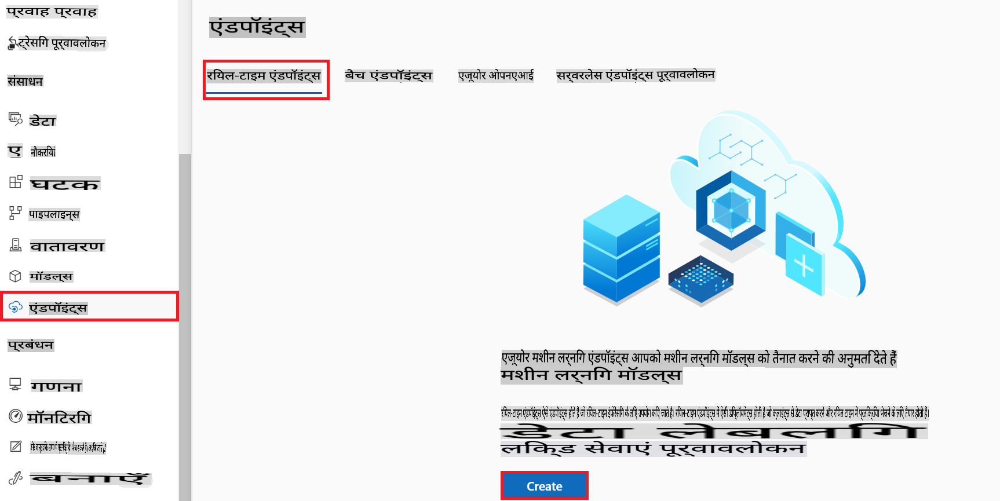

1. **Create** पर क्लिक करें।

1. वह रजिस्टर किया गया मॉडल चुनें जिसे आपने बनाया था।

    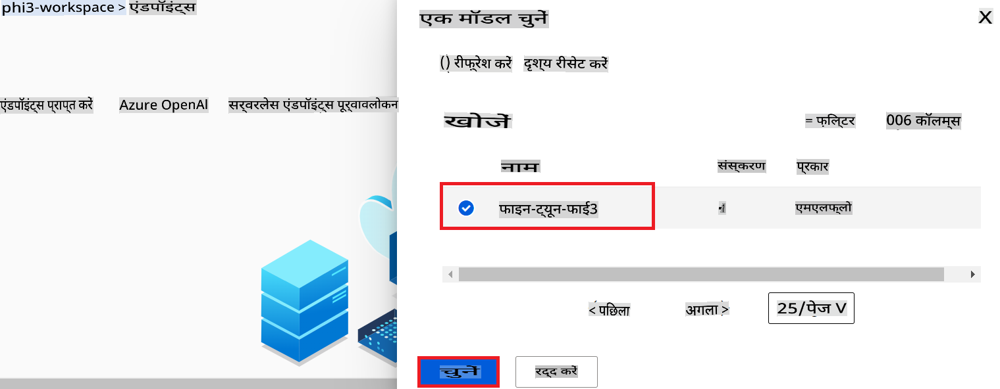

1. **Select** पर क्लिक करें।

1. निम्नलिखित कार्य करें:

    - **Virtual machine** को *Standard_NC6s_v3* पर सेट करें।
    - उपयोग के लिए **Instance count** चुनें। उदाहरण के लिए, *1*।
    - **Endpoint** को **New** पर सेट करें ताकि एक नया एंडपॉइंट बनाया जा सके।
    - **Endpoint name** दर्ज करें। यह एक अद्वितीय मान होना चाहिए।
    - **Deployment name** दर्ज करें। यह भी एक अद्वितीय मान होना चाहिए।

    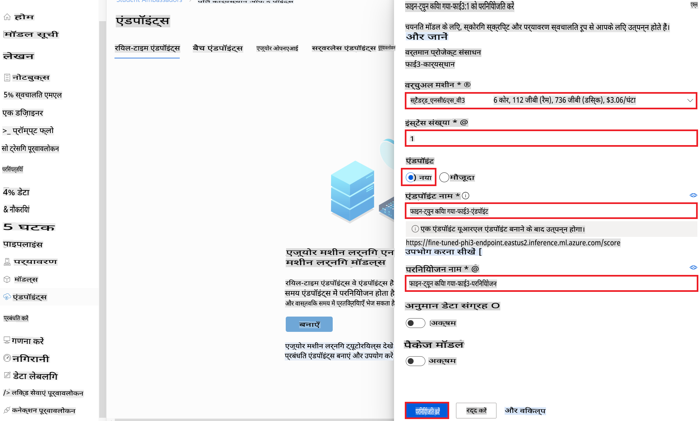

1. **Deploy** पर क्लिक करें।

> [!WARNING]
> अपने खाते में अतिरिक्त शुल्क से बचने के लिए, सुनिश्चित करें कि आप Azure Machine Learning कार्यक्षेत्र में बनाए गए एंडपॉइंट को हटा दें।
>

#### Azure Machine Learning कार्यक्षेत्र में तैनाती की स्थिति की जांच करें

1. उस Azure Machine Learning कार्यक्षेत्र पर जाएं जिसे आपने बनाया है।

1. बाईं ओर के टैब से **Endpoints** चुनें।

1. वह एंडपॉइंट चुनें जिसे आपने बनाया है।

    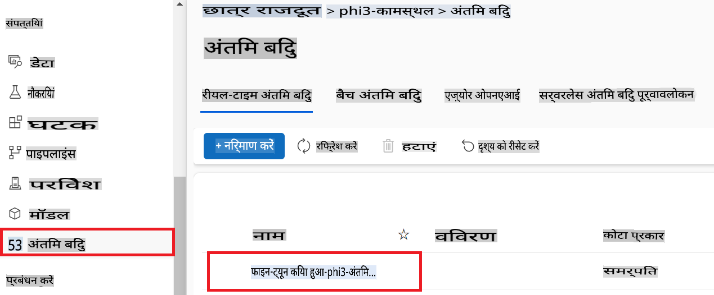

1. इस पेज पर, आप तैनाती प्रक्रिया के दौरान एंडपॉइंट्स को प्रबंधित कर सकते हैं।

> [!NOTE]
> एक बार तैनाती पूरी हो जाने के बाद, सुनिश्चित करें कि **Live traffic** को **100%** पर सेट किया गया है। यदि ऐसा नहीं है, तो ट्रैफिक सेटिंग्स को समायोजित करने के लिए **Update traffic** चुनें। ध्यान दें कि यदि ट्रैफिक 0% पर सेट है तो आप मॉडल का परीक्षण नहीं कर सकते।
>
> 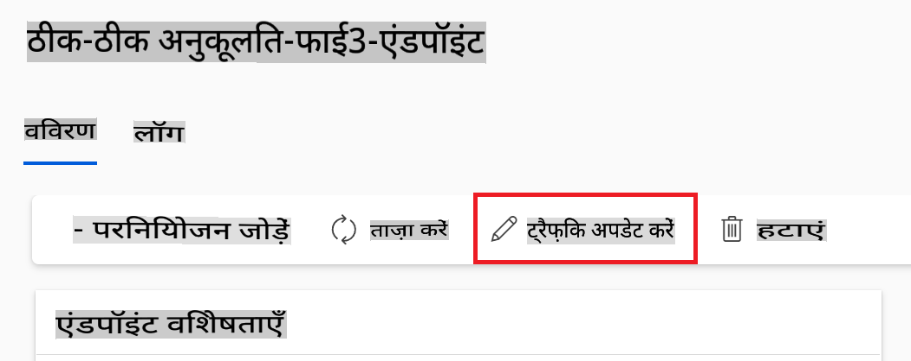
>

## परिदृश्य 3: Prompt flow के साथ एकीकृत करें और Azure AI Foundry में अपने कस्टम मॉडल के साथ चैट करें

### कस्टम Phi-3 मॉडल को Prompt flow के साथ एकीकृत करें

अपने फाइन-ट्यून किए गए मॉडल को सफलतापूर्वक तैनात करने के बाद, अब आप इसे Prompt Flow के साथ एकीकृत कर सकते हैं ताकि आप अपने मॉडल को वास्तविक समय के अनुप्रयोगों में उपयोग कर सकें, जिससे आपके कस्टम Phi-3 मॉडल के साथ विभिन्न इंटरैक्टिव कार्य सक्षम हो सकें।

इस अभ्यास में, आप करेंगे:

- Azure AI Foundry Hub बनाएं।
- Azure AI Foundry Project बनाएं।
- Prompt flow बनाएं।
- फाइन-ट्यून किए गए Phi-3 मॉडल के लिए एक कस्टम कनेक्शन जोड़ें।
- Prompt flow को अपने कस्टम Phi-3 मॉडल के साथ चैट के लिए सेट करें।

> [!NOTE]
> आप Azure ML Studio का उपयोग करके भी Promptflow के साथ एकीकृत कर सकते हैं। एकीकरण की वही प्रक्रिया Azure ML Studio पर लागू की जा सकती है।

#### Azure AI Foundry Hub बनाएं

आपको प्रोजेक्ट बनाने से पहले एक हब बनाना होगा। हब एक Resource Group की तरह काम करता है, जिससे आप Azure AI Foundry के भीतर कई प्रोजेक्ट्स को व्यवस्थित और प्रबंधित कर सकते हैं।

1. [Azure AI Foundry](https://ai.azure.com/?WT.mc_id=aiml-137032-kinfeylo) पर जाएं।

1. बाईं ओर के टैब से **All hubs** चुनें।

1. नेविगेशन मेनू से **+ New hub** चुनें।

    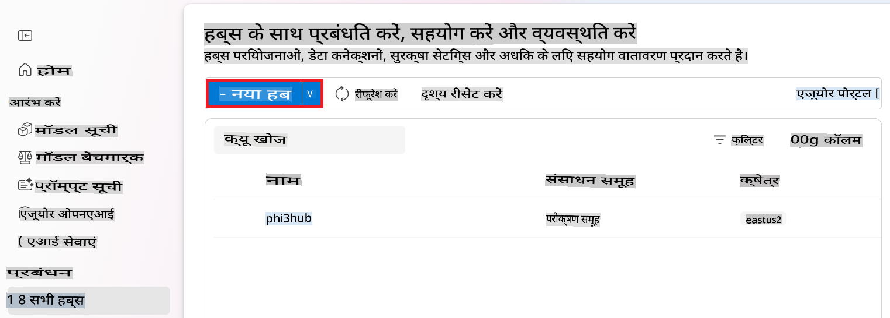

1. निम्नलिखित कार्य करें:

    - **Hub name** दर्ज करें। यह एक अद्वितीय मान होना चाहिए।
    - अपना Azure **Subscription** चुनें।
    - उपयोग के लिए **Resource group** चुनें (आवश्यक होने पर एक नया बनाएं)।
    - वह **Location** चुनें जिसे आप उपयोग करना चाहते हैं।
    - उपयोग के लिए **Connect Azure AI Services** चुनें (आवश्यक होने पर एक नया बनाएं)।
    - **Connect Azure AI Search** को **Skip connecting** पर सेट करें।

    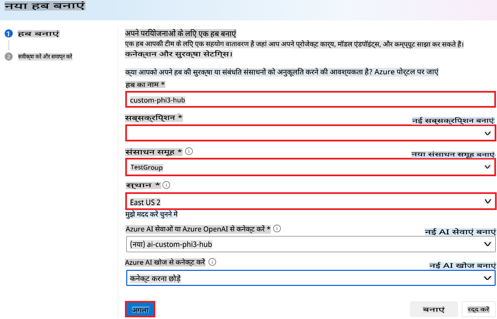

1. **Next** पर क्लिक करें।

#### Azure AI Foundry Project बनाएं

1. आपने जो हब बनाया है उसमें, बाईं ओर के टैब से **All projects** चुनें।

1. नेविगेशन मेनू से **+ New project** चुनें।

    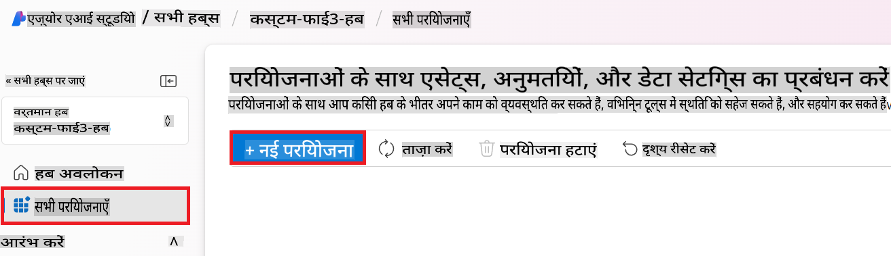

1. **Project name** दर्ज करें। यह एक अद्वितीय मान होना चाहिए।

    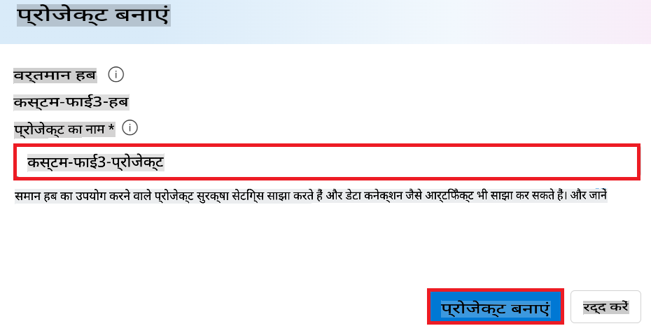

1. **Create a project** पर क्लिक करें।

#### फाइन-ट्यून किए गए Phi-3 मॉडल के लिए एक कस्टम कनेक्शन जोड़ें

अपने कस्टम Phi-3 मॉडल को Prompt flow के साथ एकीकृत करने के लिए, आपको मॉडल के एंडपॉइंट और कुंजी को एक कस्टम कनेक्शन में सहेजना होगा। यह सेटअप Prompt flow में आपके कस्टम Phi-3 मॉडल तक पहुंच सुनिश्चित करता है।

#### फाइन-ट्यून किए गए Phi-3 मॉडल के लिए API कुंजी और एंडपॉइंट URI सेट करें

1. [Azure ML Studio](https://ml.azure.com/home?WT.mc_id=aiml-137032-kinfeylo) पर जाएं।

1. उस Azure Machine Learning कार्यक्षेत्र पर जाएं जिसे आपने बनाया है।

1. बाईं ओर के टैब से **Endpoints** चुनें।

    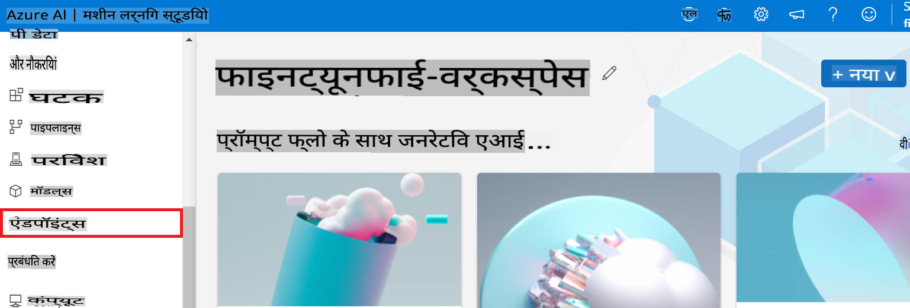

1. वह एंडपॉइंट चुनें जिसे आपने बनाया है।

    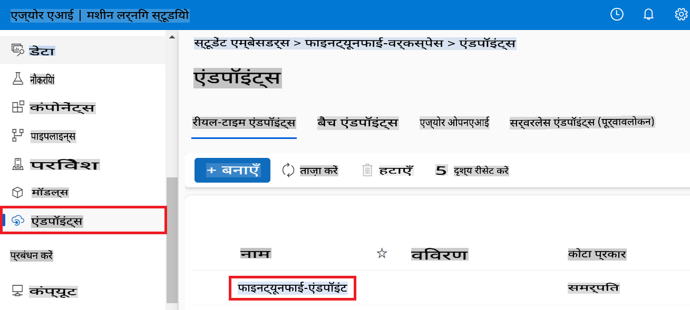

1. नेविगेशन मेनू से **Consume** चुनें।

1. अपने **REST endpoint** और **Primary key** को कॉपी करें।
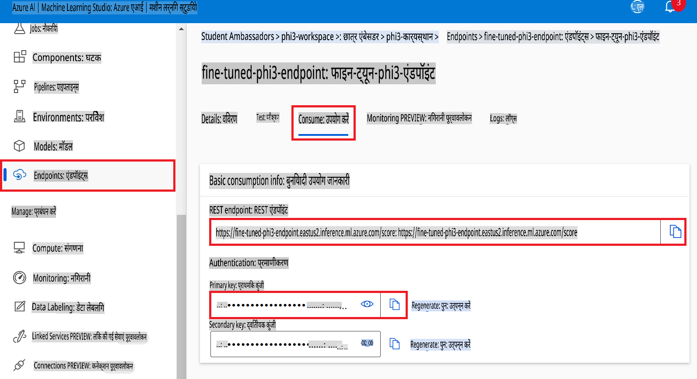

#### कस्टम कनेक्शन जोड़ें

1. [Azure AI Foundry](https://ai.azure.com/?WT.mc_id=aiml-137032-kinfeylo) पर जाएं।

1. उस Azure AI Foundry प्रोजेक्ट पर नेविगेट करें जो आपने बनाया था।

1. बनाए गए प्रोजेक्ट में, बाईं ओर के टैब से **Settings** चुनें।

1. **+ New connection** पर क्लिक करें।

   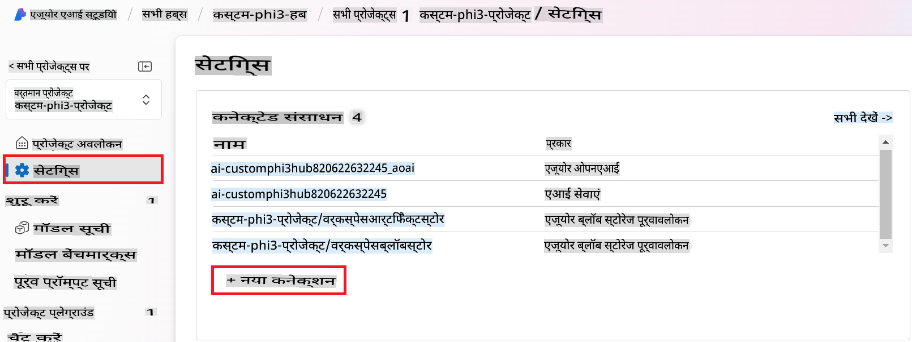

1. नेविगेशन मेनू से **Custom keys** चुनें।

   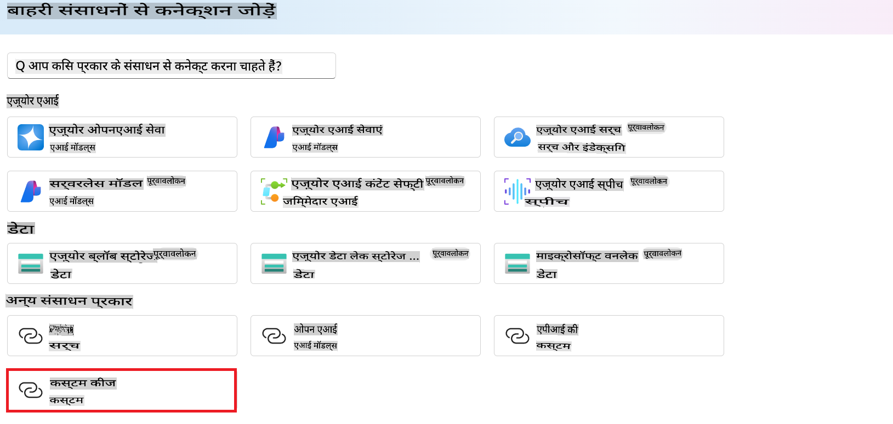

1. निम्नलिखित कार्य करें:

   - **+ Add key value pairs** चुनें।
   - कुंजी नाम के लिए **endpoint** दर्ज करें और Azure ML Studio से कॉपी किया गया एंडपॉइंट वैल्यू फील्ड में पेस्ट करें।
   - **+ Add key value pairs** फिर से चुनें।
   - कुंजी नाम के लिए **key** दर्ज करें और Azure ML Studio से कॉपी की गई कुंजी वैल्यू फील्ड में पेस्ट करें।
   - कुंजियां जोड़ने के बाद, **is secret** चुनें ताकि कुंजी एक्सपोज़ न हो।

   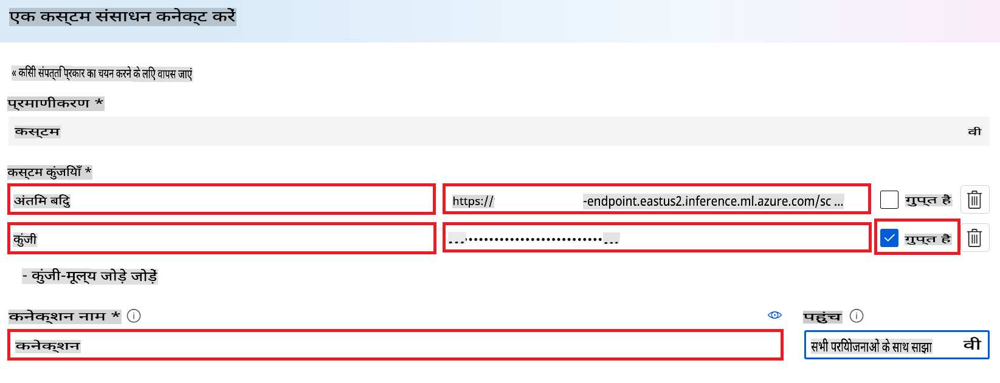

1. **Add connection** पर क्लिक करें।

#### Prompt flow बनाएं

आपने Azure AI Foundry में एक कस्टम कनेक्शन जोड़ लिया है। अब, निम्नलिखित चरणों का उपयोग करके एक Prompt flow बनाएं। इसके बाद, आप इस Prompt flow को कस्टम कनेक्शन से जोड़ेंगे ताकि आप Prompt flow के भीतर फाइन-ट्यून किए गए मॉडल का उपयोग कर सकें।

1. उस Azure AI Foundry प्रोजेक्ट पर नेविगेट करें जो आपने बनाया था।

1. बाईं ओर के टैब से **Prompt flow** चुनें।

1. नेविगेशन मेनू से **+ Create** चुनें।

   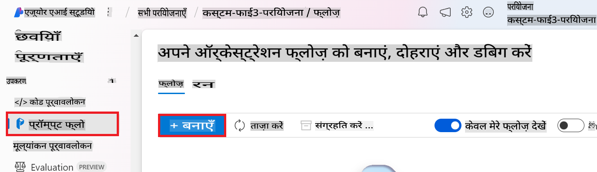

1. नेविगेशन मेनू से **Chat flow** चुनें।

   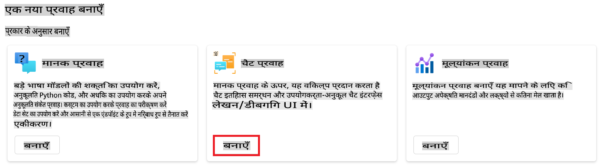

1. उपयोग के लिए **Folder name** दर्ज करें।

   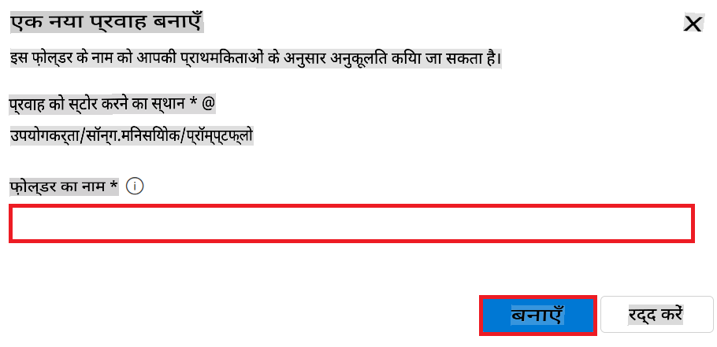

2. **Create** पर क्लिक करें।

#### अपने कस्टम Phi-3 मॉडल के साथ चैट करने के लिए Prompt flow सेट करें

आपको फाइन-ट्यून किए गए Phi-3 मॉडल को Prompt flow में एकीकृत करना होगा। हालांकि, मौजूदा Prompt flow इसके लिए डिज़ाइन नहीं किया गया है। इसलिए, आपको कस्टम मॉडल के एकीकरण को सक्षम करने के लिए Prompt flow को फिर से डिज़ाइन करना होगा।

1. Prompt flow में, मौजूदा फ्लो को पुनर्निर्मित करने के लिए निम्नलिखित कार्य करें:

   - **Raw file mode** चुनें।
   - *flow.dag.yml* फाइल में मौजूद सभी कोड को हटा दें।
   - *flow.dag.yml* फाइल में निम्नलिखित कोड जोड़ें:

     ```yml
        inputs:
          input_data:
            type: string
            default: "Who founded Microsoft?"

        outputs:
          answer:
            type: string
            reference: ${integrate_with_promptflow.output}

        nodes:
        - name: integrate_with_promptflow
          type: python
          source:
            type: code
            path: integrate_with_promptflow.py
          inputs:
            input_data: ${inputs.input_data}
        ```

   - **Save** पर क्लिक करें।

   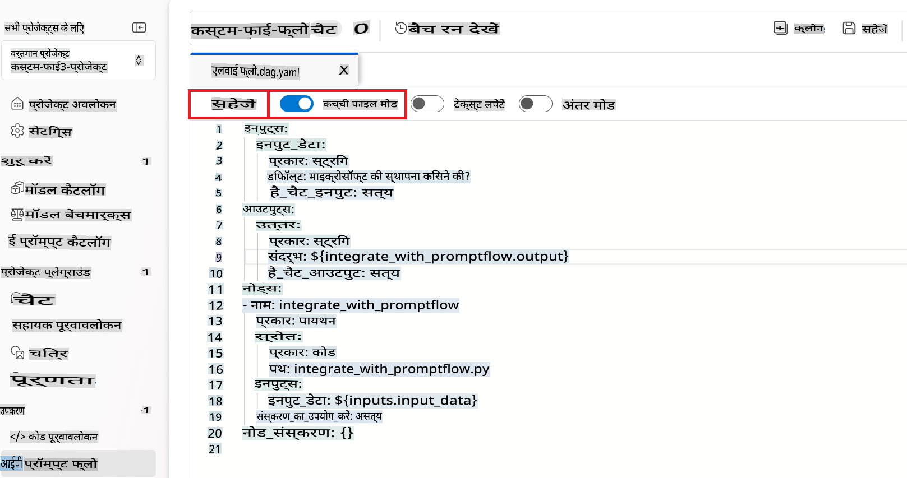

1. Prompt flow में कस्टम Phi-3 मॉडल का उपयोग करने के लिए *integrate_with_promptflow.py* फाइल में निम्नलिखित कोड जोड़ें:

   ```python
    import logging
    import requests
    from promptflow import tool
    from promptflow.connections import CustomConnection

    # Logging setup
    logging.basicConfig(
        format="%(asctime)s - %(levelname)s - %(name)s - %(message)s",
        datefmt="%Y-%m-%d %H:%M:%S",
        level=logging.DEBUG
    )
    logger = logging.getLogger(__name__)

    def query_phi3_model(input_data: str, connection: CustomConnection) -> str:
        """
        Send a request to the Phi-3 model endpoint with the given input data using Custom Connection.
        """

        # "connection" is the name of the Custom Connection, "endpoint", "key" are the keys in the Custom Connection
        endpoint_url = connection.endpoint
        api_key = connection.key

        headers = {
            "Content-Type": "application/json",
            "Authorization": f"Bearer {api_key}"
        }
        data = {
            "input_data": {
                "input_string": [
                    {"role": "user", "content": input_data}
                ],
                "parameters": {
                    "temperature": 0.7,
                    "max_new_tokens": 128
                }
            }
        }
        try:
            response = requests.post(endpoint_url, json=data, headers=headers)
            response.raise_for_status()
            
            # Log the full JSON response
            logger.debug(f"Full JSON response: {response.json()}")

            result = response.json()["output"]
            logger.info("Successfully received response from Azure ML Endpoint.")
            return result
        except requests.exceptions.RequestException as e:
            logger.error(f"Error querying Azure ML Endpoint: {e}")
            raise

    @tool
    def my_python_tool(input_data: str, connection: CustomConnection) -> str:
        """
        Tool function to process input data and query the Phi-3 model.
        """
        return query_phi3_model(input_data, connection)

    ```

   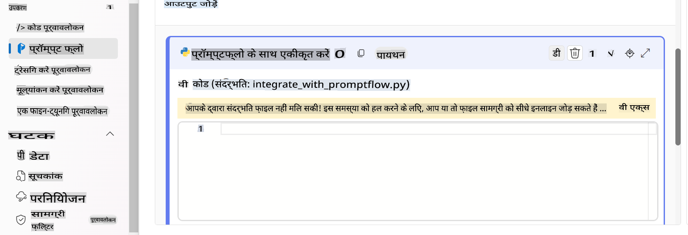

> [!NOTE]  
> Azure AI Foundry में Prompt flow का उपयोग करने के बारे में अधिक जानकारी के लिए, आप [Prompt flow in Azure AI Foundry](https://learn.microsoft.com/azure/ai-studio/how-to/prompt-flow) देख सकते हैं।

1. **Chat input**, **Chat output** चुनें ताकि आप अपने मॉडल के साथ चैट कर सकें।

   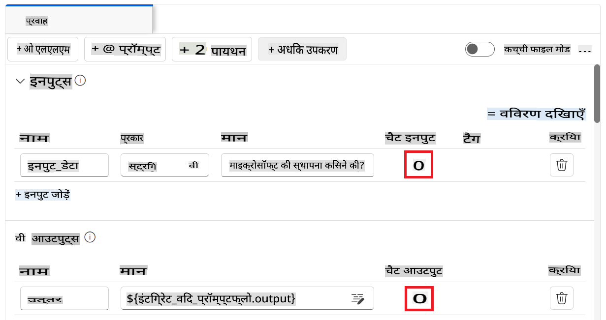

1. अब आप अपने कस्टम Phi-3 मॉडल के साथ चैट करने के लिए तैयार हैं। अगले अभ्यास में, आप सीखेंगे कि Prompt flow कैसे शुरू करें और अपने फाइन-ट्यून किए गए Phi-3 मॉडल के साथ चैट करने के लिए इसका उपयोग कैसे करें।

> [!NOTE]  
> पुनर्निर्मित फ्लो निम्न चित्र जैसा दिखना चाहिए:  
> 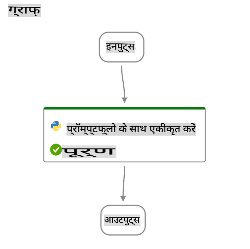

### अपने कस्टम Phi-3 मॉडल के साथ चैट करें

अब जब आपने अपने कस्टम Phi-3 मॉडल को फाइन-ट्यून और Prompt flow के साथ एकीकृत कर लिया है, तो आप इसके साथ इंटरैक्ट करना शुरू कर सकते हैं। यह अभ्यास आपको Prompt flow का उपयोग करके अपने मॉडल के साथ चैट सेट करने और शुरू करने की प्रक्रिया के माध्यम से मार्गदर्शन करेगा। इन चरणों का पालन करके, आप अपने फाइन-ट्यून किए गए Phi-3 मॉडल की क्षमताओं का विभिन्न कार्यों और वार्तालापों के लिए पूरा उपयोग कर पाएंगे।

- Prompt flow का उपयोग करके अपने कस्टम Phi-3 मॉडल के साथ चैट करें।

#### Prompt flow शुरू करें

1. Prompt flow शुरू करने के लिए **Start compute sessions** चुनें।

   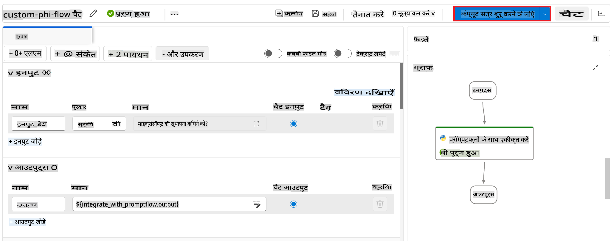

1. पैरामीटर को नवीनीकृत करने के लिए **Validate and parse input** चुनें।

   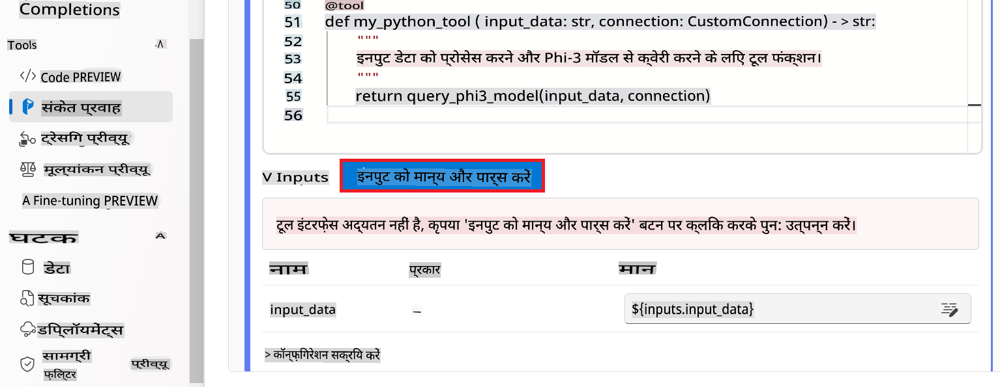

1. कस्टम कनेक्शन के लिए बनाए गए **connection** का **Value** चुनें। उदाहरण के लिए, *connection*।

   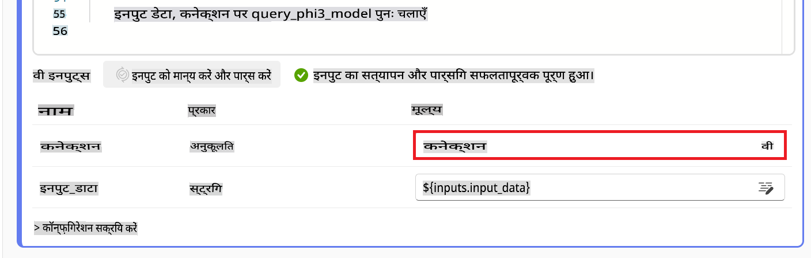

#### अपने कस्टम मॉडल के साथ चैट करें

1. **Chat** चुनें।

   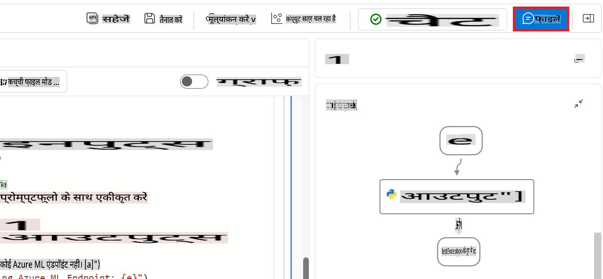

1. परिणामों का एक उदाहरण यहां है: अब आप अपने कस्टम Phi-3 मॉडल के साथ चैट कर सकते हैं। यह अनुशंसा की जाती है कि आप फाइन-ट्यूनिंग के लिए उपयोग किए गए डेटा के आधार पर प्रश्न पूछें।

   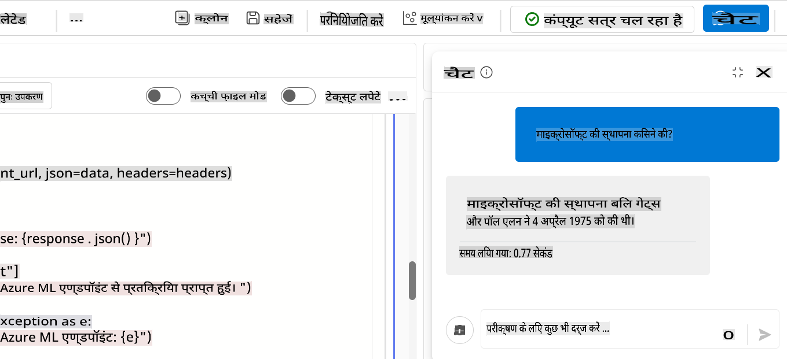

**अस्वीकरण**:  
यह दस्तावेज़ मशीन-आधारित एआई अनुवाद सेवाओं का उपयोग करके अनुवादित किया गया है। जबकि हम सटीकता सुनिश्चित करने का प्रयास करते हैं, कृपया ध्यान दें कि स्वचालित अनुवाद में त्रुटियाँ या अशुद्धियाँ हो सकती हैं। मूल दस्तावेज़, जो इसकी मूल भाषा में है, को आधिकारिक स्रोत माना जाना चाहिए। महत्वपूर्ण जानकारी के लिए, पेशेवर मानव अनुवाद की सिफारिश की जाती है। इस अनुवाद के उपयोग से उत्पन्न किसी भी गलतफहमी या गलत व्याख्या के लिए हम उत्तरदायी नहीं हैं।