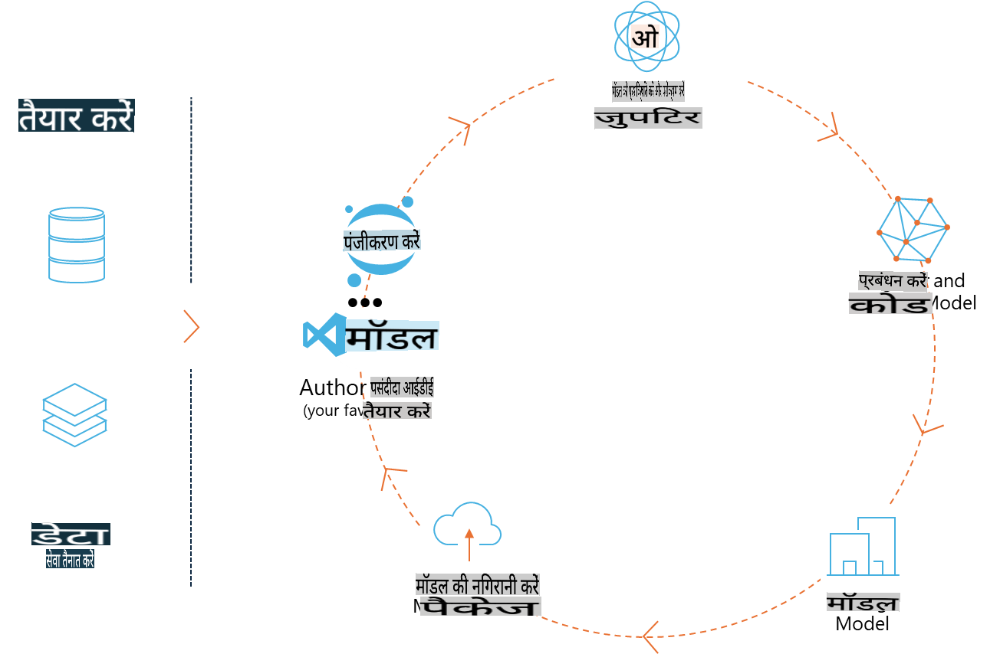
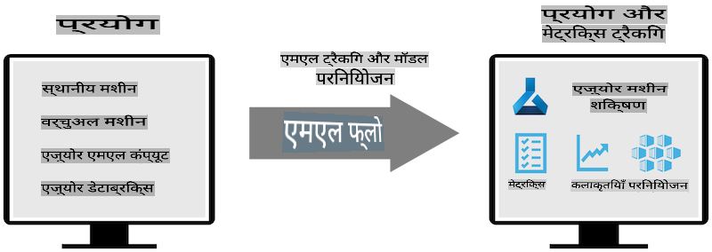
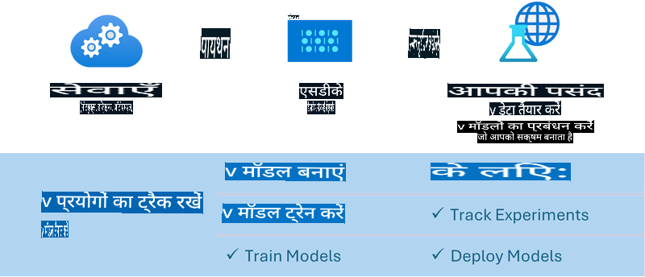

# MLflow

[MLflow](https://mlflow.org/) एक ओपन-सोर्स प्लेटफ़ॉर्म है जिसे मशीन लर्निंग के जीवन चक्र को प्रबंधित करने के लिए डिज़ाइन किया गया है।



MLFlow का उपयोग ML जीवन चक्र प्रबंधन के लिए किया जाता है, जिसमें प्रयोग, पुनरुत्पादन, परिनियोजन और एक केंद्रीय मॉडल रजिस्ट्री शामिल हैं। वर्तमान में MLFlow चार घटक प्रदान करता है:

- **MLflow Tracking:** प्रयोगों, कोड, डेटा कॉन्फ़िगरेशन और परिणामों को रिकॉर्ड और क्वेरी करें।
- **MLflow Projects:** डेटा साइंस कोड को एक ऐसे प्रारूप में पैकेज करें जो किसी भी प्लेटफ़ॉर्म पर रन को पुन: उत्पन्न कर सके।
- **MLflow Models:** मशीन लर्निंग मॉडल को विभिन्न सर्विंग वातावरणों में परिनियोजित करें।
- **Model Registry:** मॉडल को एक केंद्रीय रिपॉजिटरी में संग्रहीत, एनोटेट और प्रबंधित करें।

यह प्रयोगों को ट्रैक करने, कोड को पुन: उत्पन्न करने योग्य रन में पैकेज करने और मॉडल को साझा करने और परिनियोजित करने की क्षमताएं प्रदान करता है। MLFlow, Databricks में एकीकृत है और विभिन्न ML लाइब्रेरीज़ को सपोर्ट करता है, जिससे यह लाइब्रेरी-अज्ञेयवादी बनता है। इसे किसी भी मशीन लर्निंग लाइब्रेरी और किसी भी प्रोग्रामिंग भाषा के साथ उपयोग किया जा सकता है, क्योंकि यह सुविधा के लिए REST API और CLI प्रदान करता है।



MLFlow की प्रमुख विशेषताएं हैं:

- **Experiment Tracking:** पैरामीटर और परिणाम रिकॉर्ड और तुलना करें।
- **Model Management:** विभिन्न सर्विंग और इन्फरेंस प्लेटफ़ॉर्म पर मॉडल को परिनियोजित करें।
- **Model Registry:** MLFlow Models के जीवन चक्र को सहयोगात्मक रूप से प्रबंधित करें, जिसमें संस्करण और एनोटेशन शामिल हैं।
- **Projects:** ML कोड को साझा करने या उत्पादन उपयोग के लिए पैकेज करें।

MLFlow, MLOps लूप को भी सपोर्ट करता है, जिसमें डेटा तैयार करना, मॉडल पंजीकरण और प्रबंधन, मॉडल को निष्पादन के लिए पैकेज करना, सेवाओं को परिनियोजित करना और मॉडलों की निगरानी शामिल है। इसका उद्देश्य प्रोटोटाइप से उत्पादन वर्कफ़्लो में जाने की प्रक्रिया को सरल बनाना है, खासकर क्लाउड और एज वातावरण में।

## E2E परिदृश्य - Phi-3 को MLFlow मॉडल के रूप में उपयोग करने के लिए एक रैपर बनाना

इस E2E नमूने में, हम Phi-3 छोटे भाषा मॉडल (SLM) के चारों ओर एक रैपर बनाने के दो अलग-अलग दृष्टिकोण प्रदर्शित करेंगे और फिर इसे MLFlow मॉडल के रूप में स्थानीय रूप से या क्लाउड में चलाएंगे, जैसे कि Azure Machine Learning वर्कस्पेस में।



| प्रोजेक्ट | विवरण | स्थान |
| ------------ | ----------- | -------- |
| Transformer Pipeline | Transformer Pipeline सबसे आसान विकल्प है यदि आप MLFlow के प्रायोगिक ट्रांसफॉर्मर्स फ्लेवर के साथ HuggingFace मॉडल का उपयोग करना चाहते हैं। | [**TransformerPipeline.ipynb**](../../../../../../code/06.E2E/E2E_Phi-3-MLflow_TransformerPipeline.ipynb) |
| Custom Python Wrapper | इस लेखन के समय, ट्रांसफॉर्मर पाइपलाइन ONNX प्रारूप में HuggingFace मॉडलों के लिए MLFlow रैपर जेनरेशन का समर्थन नहीं करती थी, भले ही प्रायोगिक Optimum Python पैकेज का उपयोग किया गया हो। ऐसे मामलों में, आप MLFlow मोड के लिए अपना कस्टम Python रैपर बना सकते हैं। | [**CustomPythonWrapper.ipynb**](../../../../../../code/06.E2E/E2E_Phi-3-MLflow_CustomPythonWrapper.ipynb) |

## प्रोजेक्ट: Transformer Pipeline

1. आपको MLFlow और HuggingFace से संबंधित Python पैकेजों की आवश्यकता होगी:

    ``` Python
    import mlflow
    import transformers
    ```

2. इसके बाद, आपको HuggingFace रजिस्ट्री में लक्ष्य Phi-3 मॉडल का संदर्भ देकर एक ट्रांसफॉर्मर पाइपलाइन शुरू करनी चाहिए। जैसा कि _Phi-3-mini-4k-instruct_ के मॉडल कार्ड से देखा जा सकता है, इसका कार्य "Text Generation" प्रकार का है:

    ``` Python
    pipeline = transformers.pipeline(
        task = "text-generation",
        model = "microsoft/Phi-3-mini-4k-instruct"
    )
    ```

3. अब आप अपने Phi-3 मॉडल की ट्रांसफॉर्मर पाइपलाइन को MLFlow प्रारूप में सहेज सकते हैं और अतिरिक्त विवरण प्रदान कर सकते हैं, जैसे लक्ष्य आर्टिफैक्ट्स पथ, विशिष्ट मॉडल कॉन्फ़िगरेशन सेटिंग्स और इन्फरेंस API प्रकार:

    ``` Python
    model_info = mlflow.transformers.log_model(
        transformers_model = pipeline,
        artifact_path = "phi3-mlflow-model",
        model_config = model_config,
        task = "llm/v1/chat"
    )
    ```

## प्रोजेक्ट: Custom Python Wrapper

1. हम यहां Microsoft के [ONNX Runtime generate() API](https://github.com/microsoft/onnxruntime-genai) का उपयोग कर सकते हैं ONNX मॉडल के इन्फरेंस और टोकन एन्कोडिंग/डिकोडिंग के लिए। आपको अपने लक्षित कंप्यूट के लिए _onnxruntime_genai_ पैकेज चुनना होगा, नीचे का उदाहरण CPU को लक्षित करता है:

    ``` Python
    import mlflow
    from mlflow.models import infer_signature
    import onnxruntime_genai as og
    ```

1. हमारी कस्टम क्लास दो विधियों को लागू करती है: _load_context()_ जो Phi-3 Mini 4K Instruct के **ONNX मॉडल**, **जनरेटर पैरामीटर** और **टोकनाइज़र** को प्रारंभ करती है; और _predict()_ जो दिए गए प्रॉम्प्ट के लिए आउटपुट टोकन उत्पन्न करता है:

    ``` Python
    class Phi3Model(mlflow.pyfunc.PythonModel):
        def load_context(self, context):
            # Retrieving model from the artifacts
            model_path = context.artifacts["phi3-mini-onnx"]
            model_options = {
                 "max_length": 300,
                 "temperature": 0.2,         
            }
        
            # Defining the model
            self.phi3_model = og.Model(model_path)
            self.params = og.GeneratorParams(self.phi3_model)
            self.params.set_search_options(**model_options)
            
            # Defining the tokenizer
            self.tokenizer = og.Tokenizer(self.phi3_model)
    
        def predict(self, context, model_input):
            # Retrieving prompt from the input
            prompt = model_input["prompt"][0]
            self.params.input_ids = self.tokenizer.encode(prompt)
    
            # Generating the model's response
            response = self.phi3_model.generate(self.params)
    
            return self.tokenizer.decode(response[0][len(self.params.input_ids):])
    ```

1. अब आप _mlflow.pyfunc.log_model()_ फ़ंक्शन का उपयोग करके Phi-3 मॉडल के लिए एक कस्टम Python रैपर (पिकल प्रारूप में) उत्पन्न कर सकते हैं, साथ ही मूल ONNX मॉडल और आवश्यक निर्भरताओं के साथ:

    ``` Python
    model_info = mlflow.pyfunc.log_model(
        artifact_path = artifact_path,
        python_model = Phi3Model(),
        artifacts = {
            "phi3-mini-onnx": "cpu_and_mobile/cpu-int4-rtn-block-32-acc-level-4",
        },
        input_example = input_example,
        signature = infer_signature(input_example, ["Run"]),
        extra_pip_requirements = ["torch", "onnxruntime_genai", "numpy"],
    )
    ```

## उत्पन्न MLFlow मॉडलों के सिग्नेचर

1. ऊपर Transformer Pipeline प्रोजेक्ट के चरण 3 में, हमने MLFlow मॉडल के कार्य को "_llm/v1/chat_" पर सेट किया। इस तरह का निर्देश मॉडल का API रैपर उत्पन्न करता है, जो OpenAI के Chat API के साथ संगत होता है जैसा कि नीचे दिखाया गया है:

    ``` Python
    {inputs: 
      ['messages': Array({content: string (required), name: string (optional), role: string (required)}) (required), 'temperature': double (optional), 'max_tokens': long (optional), 'stop': Array(string) (optional), 'n': long (optional), 'stream': boolean (optional)],
    outputs: 
      ['id': string (required), 'object': string (required), 'created': long (required), 'model': string (required), 'choices': Array({finish_reason: string (required), index: long (required), message: {content: string (required), name: string (optional), role: string (required)} (required)}) (required), 'usage': {completion_tokens: long (required), prompt_tokens: long (required), total_tokens: long (required)} (required)],
    params: 
      None}
    ```

1. परिणामस्वरूप, आप अपना प्रॉम्प्ट निम्नलिखित प्रारूप में सबमिट कर सकते हैं:

    ``` Python
    messages = [{"role": "user", "content": "What is the capital of Spain?"}]
    ```

1. फिर, OpenAI API-संगत पोस्ट-प्रोसेसिंग का उपयोग करें, जैसे _response[0][‘choices’][0][‘message’][‘content’]_ अपने आउटपुट को इस तरह सुंदर बनाने के लिए:

    ``` JSON
    Question: What is the capital of Spain?
    
    Answer: The capital of Spain is Madrid. It is the largest city in Spain and serves as the political, economic, and cultural center of the country. Madrid is located in the center of the Iberian Peninsula and is known for its rich history, art, and architecture, including the Royal Palace, the Prado Museum, and the Plaza Mayor.
    
    Usage: {'prompt_tokens': 11, 'completion_tokens': 73, 'total_tokens': 84}
    ```

1. ऊपर Custom Python Wrapper प्रोजेक्ट के चरण 3 में, हम MLFlow पैकेज को दिए गए इनपुट उदाहरण से मॉडल का सिग्नेचर उत्पन्न करने की अनुमति देते हैं। हमारे MLFlow रैपर का सिग्नेचर इस तरह दिखेगा:

    ``` Python
    {inputs: 
      ['prompt': string (required)],
    outputs: 
      [string (required)],
    params: 
      None}
    ```

1. इसलिए, हमारे प्रॉम्प्ट को "prompt" डिक्शनरी कुंजी शामिल करनी होगी, इस तरह:

    ``` Python
    {"prompt": "<|system|>You are a stand-up comedian.<|end|><|user|>Tell me a joke about atom<|end|><|assistant|>",}
    ```

1. मॉडल का आउटपुट तब स्ट्रिंग प्रारूप में प्रदान किया जाएगा:

    ``` JSON
    Alright, here's a little atom-related joke for you!
    
    Why don't electrons ever play hide and seek with protons?
    
    Because good luck finding them when they're always "sharing" their electrons!
    
    Remember, this is all in good fun, and we're just having a little atomic-level humor!
    ```

**अस्वीकरण**:  
यह दस्तावेज़ मशीन-आधारित एआई अनुवाद सेवाओं का उपयोग करके अनुवादित किया गया है। जबकि हम सटीकता सुनिश्चित करने का प्रयास करते हैं, कृपया ध्यान दें कि स्वचालित अनुवादों में त्रुटियां या अशुद्धियां हो सकती हैं। मूल दस्तावेज़ को उसकी मूल भाषा में प्रामाणिक स्रोत माना जाना चाहिए। महत्वपूर्ण जानकारी के लिए, पेशेवर मानव अनुवाद की सिफारिश की जाती है। इस अनुवाद के उपयोग से उत्पन्न किसी भी गलतफहमी या गलत व्याख्या के लिए हम उत्तरदायी नहीं हैं।