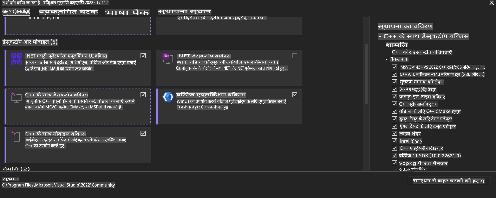
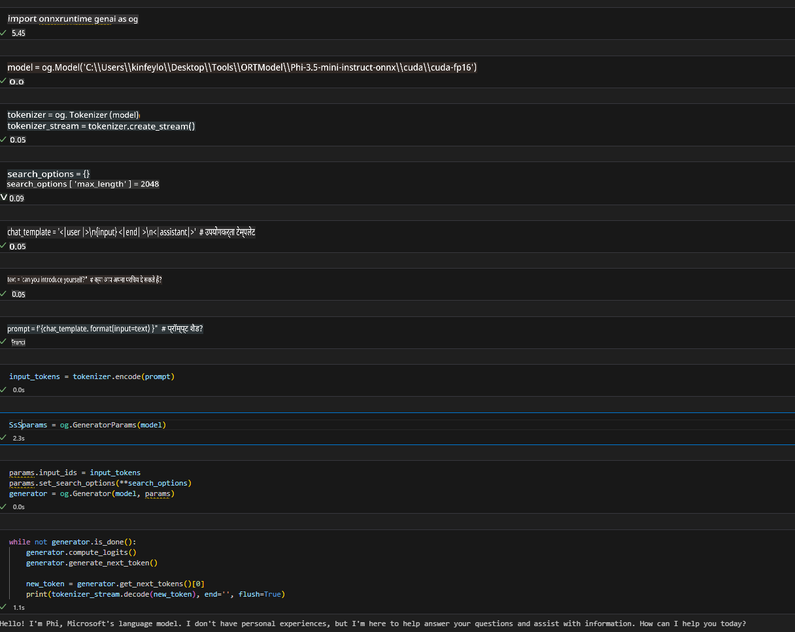
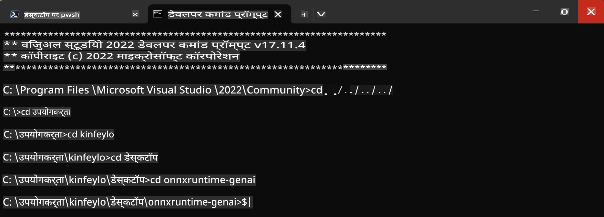

# **OnnxRuntime GenAI Windows GPU के लिए मार्गदर्शिका**

यह मार्गदर्शिका Windows पर GPU के साथ ONNX Runtime (ORT) सेटअप और उपयोग करने के चरण प्रदान करती है। इसका उद्देश्य आपके मॉडलों के लिए GPU एक्सेलेरेशन का लाभ उठाकर प्रदर्शन और दक्षता में सुधार करना है।

इस दस्तावेज़ में निम्नलिखित पर मार्गदर्शन दिया गया है:

- पर्यावरण सेटअप: आवश्यक डिपेंडेंसीज़ जैसे CUDA, cuDNN, और ONNX Runtime को इंस्टॉल करने के निर्देश।
- कॉन्फ़िगरेशन: GPU संसाधनों का प्रभावी ढंग से उपयोग करने के लिए पर्यावरण और ONNX Runtime को कॉन्फ़िगर करने का तरीका।
- अनुकूलन सुझाव: इष्टतम प्रदर्शन के लिए GPU सेटिंग्स को ठीक करने के सुझाव।

### **1. Python 3.10.x /3.11.8**

   ***नोट*** [miniforge](https://github.com/conda-forge/miniforge/releases/latest/download/Miniforge3-Windows-x86_64.exe) को अपने Python पर्यावरण के रूप में उपयोग करने की सलाह दी जाती है।

   ```bash

   conda create -n pydev python==3.11.8

   conda activate pydev

   ```

   ***याद रखें*** यदि आपने Python ONNX लाइब्रेरी से संबंधित कुछ भी इंस्टॉल किया है, तो कृपया उसे अनइंस्टॉल करें।

### **2. CMake को winget के साथ इंस्टॉल करें**

   ```bash

   winget install -e --id Kitware.CMake

   ```

### **3. Visual Studio 2022 - C++ के साथ डेस्कटॉप डेवलपमेंट इंस्टॉल करें**

   ***नोट*** यदि आप कम्पाइल नहीं करना चाहते हैं, तो आप इस चरण को छोड़ सकते हैं।



### **4. NVIDIA ड्राइवर इंस्टॉल करें**

1. **NVIDIA GPU ड्राइवर** [https://www.nvidia.com/en-us/drivers/](https://www.nvidia.com/en-us/drivers/)

2. **NVIDIA CUDA 12.4** [https://developer.nvidia.com/cuda-12-4-0-download-archive](https://developer.nvidia.com/cuda-12-4-0-download-archive)

3. **NVIDIA CUDNN 9.4** [https://developer.nvidia.com/cudnn-downloads](https://developer.nvidia.com/cudnn-downloads)

***याद रखें*** इंस्टॉलेशन प्रक्रिया के दौरान डिफ़ॉल्ट सेटिंग्स का उपयोग करें।

### **5. NVIDIA पर्यावरण सेट करें**

NVIDIA CUDNN 9.4 की lib, bin, और include फाइल्स को NVIDIA CUDA 12.4 की lib, bin, और include फोल्डर में कॉपी करें।

- *'C:\Program Files\NVIDIA\CUDNN\v9.4\bin\12.6'* की फाइल्स को *'C:\Program Files\NVIDIA GPU Computing Toolkit\CUDA\v12.4\bin'* में कॉपी करें।

- *'C:\Program Files\NVIDIA\CUDNN\v9.4\include\12.6'* की फाइल्स को *'C:\Program Files\NVIDIA GPU Computing Toolkit\CUDA\v12.4\include'* में कॉपी करें।

- *'C:\Program Files\NVIDIA\CUDNN\v9.4\lib\12.6'* की फाइल्स को *'C:\Program Files\NVIDIA GPU Computing Toolkit\CUDA\v12.4\lib\x64'* में कॉपी करें।

### **6. Phi-3.5-mini-instruct-onnx डाउनलोड करें**

   ```bash

   winget install -e --id Git.Git

   winget install -e --id GitHub.GitLFS

   git lfs install

   git clone https://huggingface.co/microsoft/Phi-3.5-mini-instruct-onnx

   ```

### **7. InferencePhi35Instruct.ipynb चलाएं**

   [Notebook](../../../../../../code/09.UpdateSamples/Aug/ortgpu-phi35-instruct.ipynb) खोलें और निष्पादित करें।



### **8. ORT GenAI GPU कम्पाइल करें**

   ***नोट*** 
   
   1. कृपया पहले सभी ONNX, ONNX Runtime और ONNX Runtime-GenAI से संबंधित चीज़ों को अनइंस्टॉल करें।

   ```bash

   pip list 
   
   ```

   फिर सभी ONNX Runtime लाइब्रेरीज़ को अनइंस्टॉल करें, जैसे:

   ```bash

   pip uninstall onnxruntime

   pip uninstall onnxruntime-genai

   pip uninstall onnxruntume-genai-cuda
   
   ```

   2. Visual Studio एक्सटेंशन सपोर्ट जांचें।

   यह सुनिश्चित करें कि C:\Program Files\NVIDIA GPU Computing Toolkit\CUDA\v12.4\extras में C:\Program Files\NVIDIA GPU Computing Toolkit\CUDA\v12.4\extras\visual_studio_integration मौजूद है। 

   यदि यह मौजूद नहीं है, तो अन्य CUDA टूलकिट ड्राइवर फोल्डर्स की जांच करें और visual_studio_integration फोल्डर और उसकी सामग्री को C:\Program Files\NVIDIA GPU Computing Toolkit\CUDA\v12.4\extras\visual_studio_integration में कॉपी करें।

   - यदि आप कम्पाइल नहीं करना चाहते हैं, तो आप इस चरण को छोड़ सकते हैं।

   ```bash

   git clone https://github.com/microsoft/onnxruntime-genai

   ```

   - [https://github.com/microsoft/onnxruntime/releases/download/v1.19.2/onnxruntime-win-x64-gpu-1.19.2.zip](https://github.com/microsoft/onnxruntime/releases/download/v1.19.2/onnxruntime-win-x64-gpu-1.19.2.zip) डाउनलोड करें।

   - onnxruntime-win-x64-gpu-1.19.2.zip को अनज़िप करें और इसे **ort** नाम दें, फिर ort फोल्डर को onnxruntime-genai में कॉपी करें।

   - Windows Terminal का उपयोग करें, VS 2022 के लिए डेवलपर कमांड प्रॉम्प्ट पर जाएं और onnxruntime-genai में जाएं।



   - इसे अपने Python पर्यावरण के साथ कम्पाइल करें।

   ```bash

   cd onnxruntime-genai

   python build.py --use_cuda  --cuda_home "C:\Program Files\NVIDIA GPU Computing Toolkit\CUDA\v12.4" --config Release
 

   cd build/Windows/Release/Wheel

   pip install .whl

   ```

**अस्वीकरण**:  
यह दस्तावेज़ मशीन-आधारित एआई अनुवाद सेवाओं का उपयोग करके अनुवादित किया गया है। जबकि हम सटीकता के लिए प्रयास करते हैं, कृपया ध्यान दें कि स्वचालित अनुवाद में त्रुटियां या अशुद्धियां हो सकती हैं। मूल भाषा में लिखा गया मूल दस्तावेज़ प्रामाणिक स्रोत माना जाना चाहिए। महत्वपूर्ण जानकारी के लिए, पेशेवर मानव अनुवाद की सिफारिश की जाती है। इस अनुवाद के उपयोग से उत्पन्न किसी भी गलतफहमी या गलत व्याख्या के लिए हम उत्तरदायी नहीं हैं।