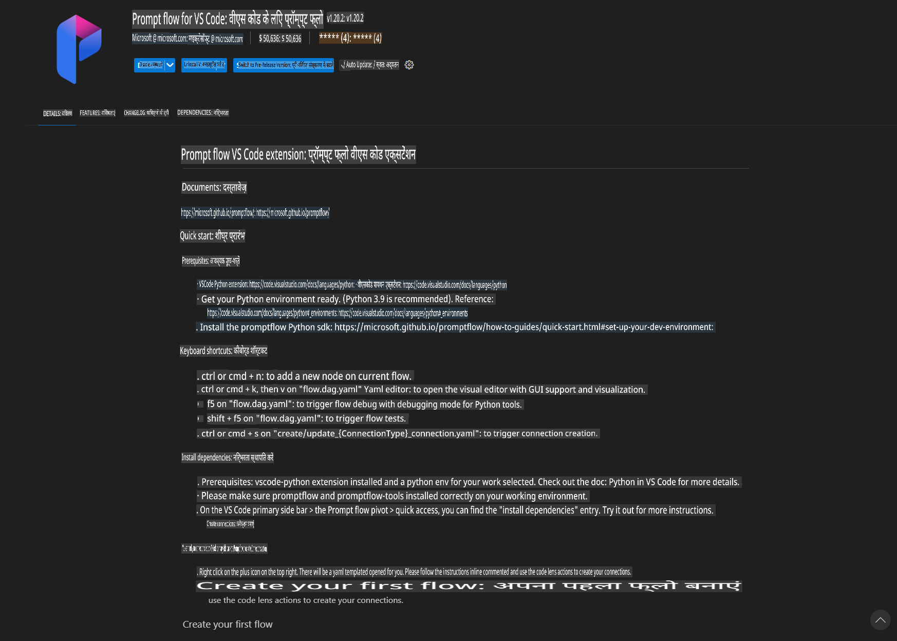
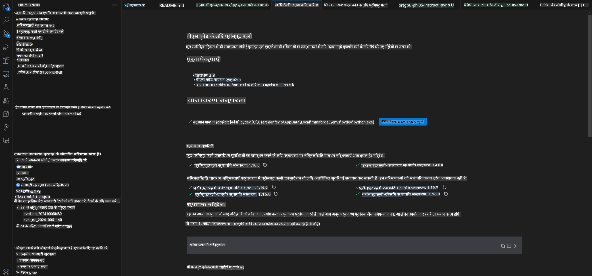
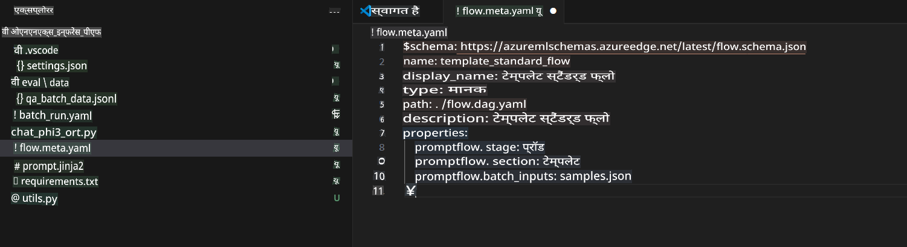
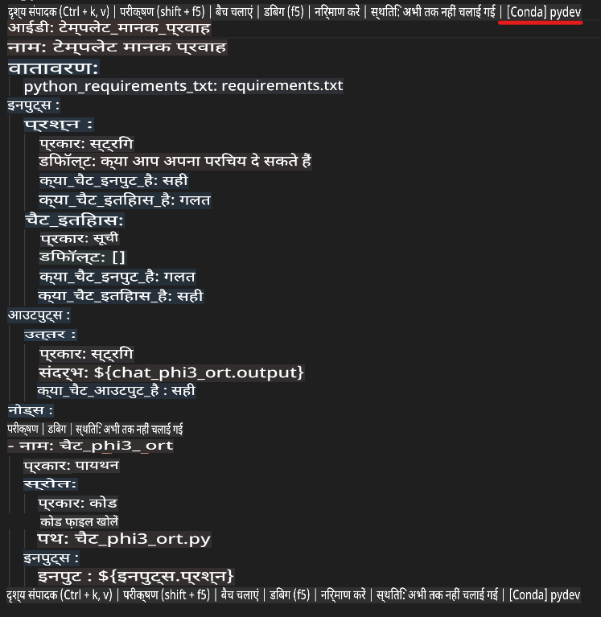
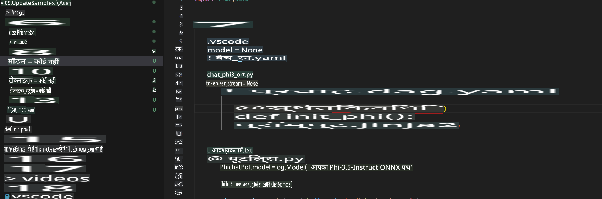
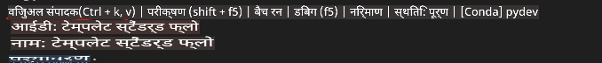
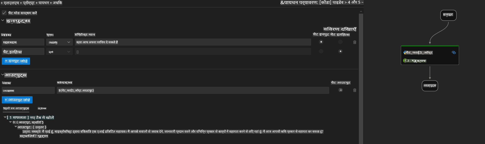
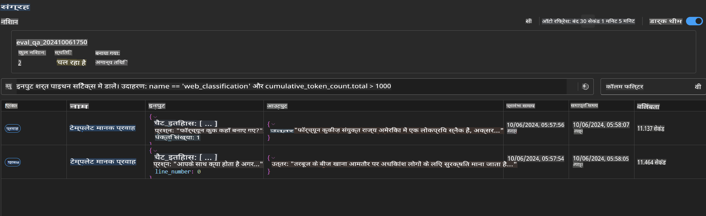

# विंडोज़ GPU का उपयोग करके Phi-3.5-Instruct ONNX के साथ Prompt Flow समाधान बनाना

यह दस्तावेज़ Phi-3 मॉडल्स पर आधारित AI एप्लिकेशन विकसित करने के लिए ONNX (Open Neural Network Exchange) के साथ PromptFlow का उपयोग करने का एक उदाहरण है।

PromptFlow एक डेवलपमेंट टूल्स का सेट है, जिसे LLM-आधारित (Large Language Model) AI एप्लिकेशनों के विकास चक्र को सुचारू बनाने के लिए डिज़ाइन किया गया है, जिसमें विचार निर्माण, प्रोटोटाइपिंग, परीक्षण और मूल्यांकन शामिल हैं।

PromptFlow को ONNX के साथ एकीकृत करके, डेवलपर्स निम्नलिखित लाभ प्राप्त कर सकते हैं:

- **मॉडल प्रदर्शन को अनुकूलित करें**: कुशल मॉडल इनफेरेंस और डिप्लॉयमेंट के लिए ONNX का उपयोग करें।
- **डेवलपमेंट को सरल बनाएं**: वर्कफ़्लो को प्रबंधित करने और दोहराव वाले कार्यों को स्वचालित करने के लिए PromptFlow का उपयोग करें।
- **सहयोग को बढ़ावा दें**: टीम के सदस्यों के बीच बेहतर सहयोग को प्रोत्साहित करें, एकीकृत विकास वातावरण प्रदान करके।

**Prompt flow** एक डेवलपमेंट टूल्स का सेट है, जिसे LLM-आधारित AI एप्लिकेशनों के विकास चक्र को सुचारू बनाने के लिए डिज़ाइन किया गया है। यह विचार निर्माण, प्रोटोटाइपिंग, परीक्षण, मूल्यांकन से लेकर उत्पादन डिप्लॉयमेंट और मॉनिटरिंग तक का काम करता है। यह प्रॉम्प्ट इंजीनियरिंग को बहुत आसान बनाता है और आपको प्रोडक्शन क्वालिटी के साथ LLM ऐप्स बनाने में सक्षम बनाता है।

Prompt flow OpenAI, Azure OpenAI Service, और कस्टमाइज़ेबल मॉडल्स (Huggingface, लोकल LLM/SLM) से कनेक्ट हो सकता है। हम Phi-3.5 के क्वांटाइज़्ड ONNX मॉडल को लोकल एप्लिकेशनों में डिप्लॉय करना चाहते हैं। Prompt flow हमें अपने व्यवसाय की बेहतर योजना बनाने और Phi-3.5 पर आधारित लोकल समाधानों को पूरा करने में मदद कर सकता है। इस उदाहरण में, हम Windows GPU पर आधारित Prompt flow समाधान को पूरा करने के लिए ONNX Runtime GenAI लाइब्रेरी को जोड़ेंगे।

## **इंस्टॉलेशन**

### **Windows GPU के लिए ONNX Runtime GenAI**

Windows GPU के लिए ONNX Runtime GenAI सेट करने के लिए इस गाइडलाइन को पढ़ें [यहां क्लिक करें](./ORTWindowGPUGuideline.md)

### **VSCode में Prompt flow सेट करें**

1. Prompt flow VS Code एक्सटेंशन इंस्टॉल करें।



2. Prompt flow VS Code एक्सटेंशन इंस्टॉल करने के बाद, एक्सटेंशन पर क्लिक करें, और **Installation dependencies** चुनें। इस गाइडलाइन के अनुसार अपने वातावरण में Prompt flow SDK इंस्टॉल करें।



3. [सैंपल कोड](../../../../../../code/09.UpdateSamples/Aug/pf/onnx_inference_pf) डाउनलोड करें और इस सैंपल को VS Code में खोलें।



4. **flow.dag.yaml** खोलें और अपना Python वातावरण चुनें।



   **chat_phi3_ort.py** खोलें और अपने Phi-3.5-instruct ONNX मॉडल का स्थान बदलें।



5. अपने Prompt flow को टेस्ट करने के लिए चलाएं।

**flow.dag.yaml** खोलें और विजुअल एडिटर पर क्लिक करें।



इसके बाद, इस पर क्लिक करें और इसे चलाकर टेस्ट करें।



1. अधिक परिणामों की जांच के लिए आप टर्मिनल में बैच चला सकते हैं।

```bash

pf run create --file batch_run.yaml --stream --name 'Your eval qa name'    

```

आप अपने डिफॉल्ट ब्राउज़र में परिणाम देख सकते हैं।



**अस्वीकरण**:  
यह दस्तावेज़ मशीन-आधारित एआई अनुवाद सेवाओं का उपयोग करके अनुवादित किया गया है। जबकि हम सटीकता के लिए प्रयास करते हैं, कृपया ध्यान दें कि स्वचालित अनुवादों में त्रुटियां या अशुद्धियां हो सकती हैं। मूल दस्तावेज़, जो इसकी मूल भाषा में है, को प्रामाणिक स्रोत माना जाना चाहिए। महत्वपूर्ण जानकारी के लिए, पेशेवर मानव अनुवाद की सिफारिश की जाती है। इस अनुवाद के उपयोग से उत्पन्न किसी भी गलतफहमी या गलत व्याख्या के लिए हम उत्तरदायी नहीं हैं।