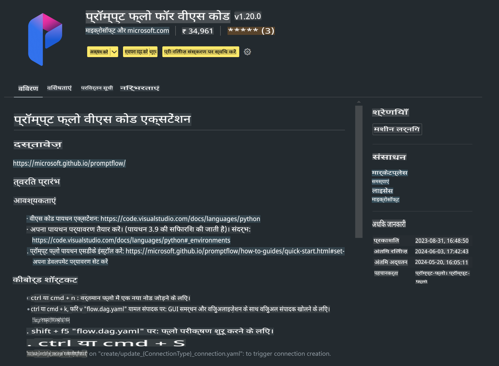

# **लैब 0 - इंस्टॉलेशन**

जब हम लैब में प्रवेश करते हैं, तो हमें संबंधित वातावरण को कॉन्फ़िगर करना होगा:

### **1. Python 3.11+**

अपने Python वातावरण को कॉन्फ़िगर करने के लिए मिनीफोर्ज का उपयोग करने की सिफारिश की जाती है।

मिनीफोर्ज को कॉन्फ़िगर करने के लिए, कृपया [https://github.com/conda-forge/miniforge](https://github.com/conda-forge/miniforge) देखें।

मिनीफोर्ज कॉन्फ़िगर करने के बाद, Power Shell में निम्नलिखित कमांड चलाएँ:

```bash

conda create -n pyenv python==3.11.8 -y

conda activate pyenv

```

### **2. प्रॉम्प्ट फ्लो SDK इंस्टॉल करें**

लैब 1 में, हम प्रॉम्प्ट फ्लो का उपयोग करते हैं, इसलिए आपको प्रॉम्प्ट फ्लो SDK को कॉन्फ़िगर करना होगा।

```bash

pip install promptflow --upgrade

```

आप इस कमांड के जरिए प्रॉम्प्ट फ्लो SDK की जांच कर सकते हैं:

```bash

pf --version

```

### **3. Visual Studio Code प्रॉम्प्ट फ्लो एक्सटेंशन इंस्टॉल करें**



### **4. Intel NPU एक्सेलरेशन लाइब्रेरी**

Intel की नई पीढ़ी के प्रोसेसर NPU का समर्थन करते हैं। यदि आप LLMs / SLMs को लोकली चलाने के लिए NPU का उपयोग करना चाहते हैं, तो आप ***Intel NPU एक्सेलरेशन लाइब्रेरी*** का उपयोग कर सकते हैं। अधिक जानकारी के लिए, आप [https://github.com/microsoft/PhiCookBook/blob/main/md/01.Introduction/03/AIPC_Inference.md](https://github.com/microsoft/PhiCookBook/blob/main/md/01.Introduction/03/AIPC_Inference.md) पढ़ सकते हैं।

बाश में Intel NPU एक्सेलरेशन लाइब्रेरी इंस्टॉल करें:

```bash

pip install intel-npu-acceleration-library

```

***नोट***: कृपया ध्यान दें कि यह लाइब्रेरी ***4.40.2*** वर्ज़न के ट्रांसफॉर्मर्स को सपोर्ट करती है, कृपया वर्ज़न की पुष्टि करें।

### **5. अन्य Python लाइब्रेरी**

requirements.txt बनाएं और इसमें यह सामग्री जोड़ें:

```txt

notebook
numpy 
scipy 
scikit-learn 
matplotlib 
pandas 
pillow 
graphviz

```

### **6. NVM इंस्टॉल करें**

Power Shell में NVM इंस्टॉल करें:

```bash

winget install -e --id CoreyButler.NVMforWindows

```

Node.js 18.20 इंस्टॉल करें:

```bash

nvm install 18.20.0

nvm use 18.20.0

```

### **7. Visual Studio Code डेवलपमेंट सपोर्ट इंस्टॉल करें**

```bash

npm install --global yo generator-code

```

बधाई हो! आपने सफलतापूर्वक SDK को कॉन्फ़िगर कर लिया है। अब, अगले हैंड्स-ऑन चरणों की ओर बढ़ें।

**अस्वीकरण**:  
यह दस्तावेज़ मशीन-आधारित एआई अनुवाद सेवाओं का उपयोग करके अनुवादित किया गया है। जबकि हम सटीकता सुनिश्चित करने का प्रयास करते हैं, कृपया ध्यान दें कि स्वचालित अनुवाद में त्रुटियां या गलतियां हो सकती हैं। मूल दस्तावेज़, जो इसकी मूल भाषा में है, को आधिकारिक स्रोत माना जाना चाहिए। महत्वपूर्ण जानकारी के लिए, पेशेवर मानव अनुवाद की सिफारिश की जाती है। इस अनुवाद के उपयोग से उत्पन्न किसी भी गलतफहमी या गलत व्याख्या के लिए हम उत्तरदायी नहीं हैं।