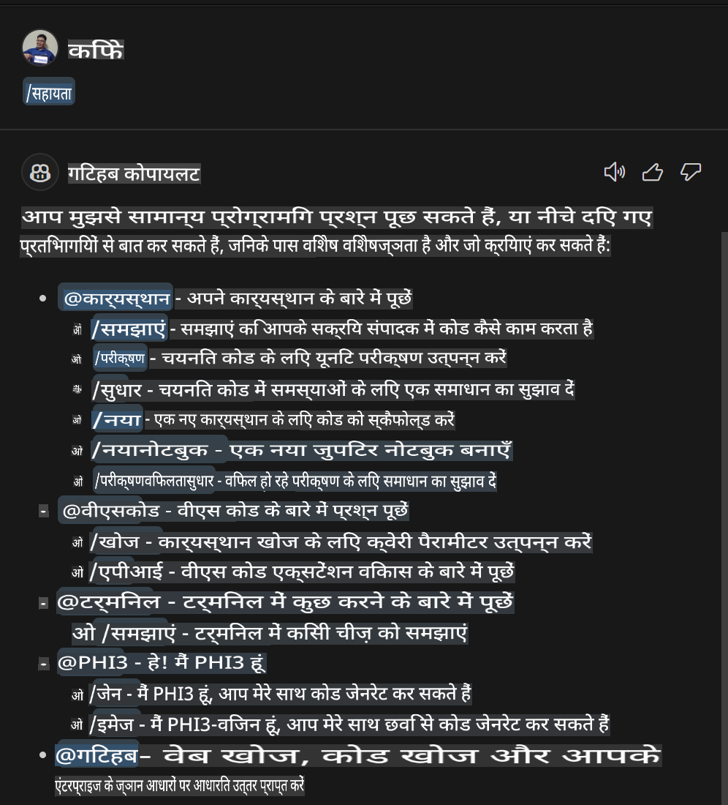
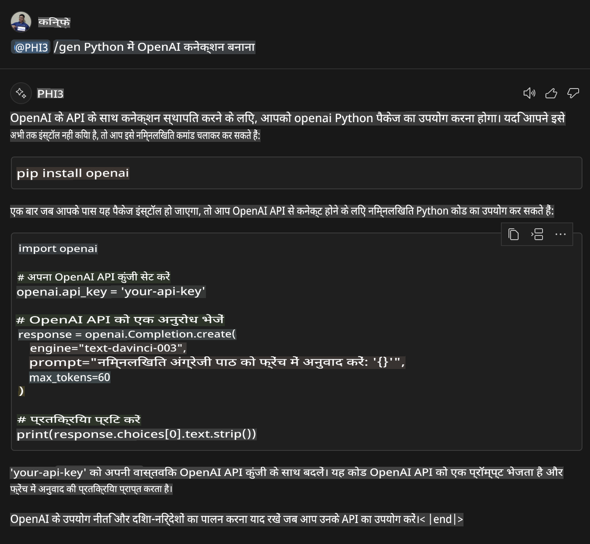
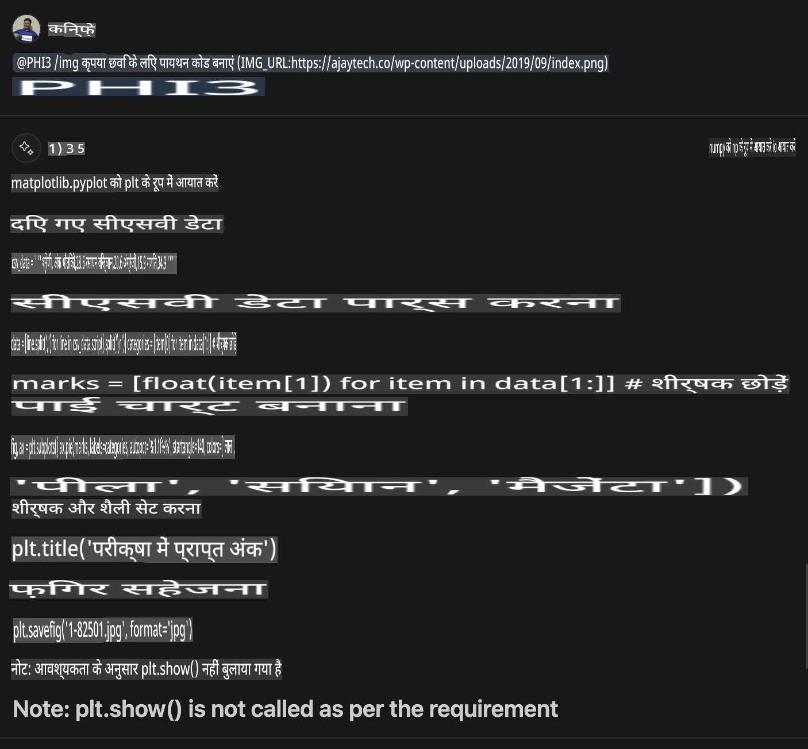

# **लैब 3 - GitHub Copilot Chat में @PHI3 एजेंट बनाएं**

Visual Studio Code Copilot Chat में, आप @workspace के माध्यम से पूरे प्रोजेक्ट को प्रबंधित कर सकते हैं। एंटरप्राइज़ परिदृश्यों के लिए, हम Copilot Chat के एजेंट को और अधिक लचीले तरीके से कस्टमाइज़ कर सकते हैं। 

पिछली लैब में, हमने NPU और क्लाउड को मिलाकर Phi3 एजेंट के लिए एक Visual Studio Code Extension पूरा किया था।



### **1. VSCode डेवलपमेंट एक्सटेंशन बनाएं**

कृपया इस लिंक [https://code.visualstudio.com/api/get-started/your-first-extension](https://code.visualstudio.com/api/get-started/your-first-extension) का संदर्भ लें और एक एक्सटेंशन प्रोजेक्ट बनाएं।

***NOTE:*** कृपया इस प्रोजेक्ट के लिए Typescript और WebPack को तकनीकी समाधान के रूप में उपयोग करें।

### **2. vscode.d.ts जोड़ें**

Visual Studio Code Chat API को अभी तक कोड API में मर्ज नहीं किया गया है, लेकिन इसे एक्सटेंशनों के माध्यम से जोड़ा जा सकता है।

vscode.d.ts डाउनलोड करें [https://github.com/microsoft/vscode/blob/main/src/vscode-dts/vscode.d.ts](https://github.com/microsoft/vscode/blob/main/src/vscode-dts/vscode.d.ts)

***NOTE:*** कृपया इसे Visual Studio Code Insiders 1.90+ में चलाएं।

### **3. package.json अपडेट करें**

```json

{
  "name": "phi3ext",
  "displayName": "phi3ext",
  "description": "",
  "version": "0.0.1",
  "engines": {
    "vscode": "^1.90.0"
  },
  "categories": [
      "AI",
      "Chat"
  ],
  "activationEvents": [],
  "enabledApiProposals": [
      "chatVariableResolver"
  ],
  "main": "./dist/extension.js",
  "contributes": {
      "chatParticipants": [
          {
              "id": "chat.PHI3",
              "name": "PHI3",
              "description": "Hey! I am PHI3",
              "isSticky": true,
              "commands": [
                  {
                      "name": "gen",
                      "description": "I am PHI3, you can gen code with me"
                  },
                  {
                      "name": "img",
                      "description": "I am PHI3-vision, you can gen code from img with me"
                  }
              ]
          }
      ],
      "commands": [
          {
              "command": "PHI3.namesInEditor",
              "title": "Use PHI3 in Editor"
          }
      ]
  },  
  "scripts": {
    "vscode:prepublish": "npm run package",
    "compile": "webpack",
    "watch": "webpack --watch",
    "package": "webpack --mode production --devtool hidden-source-map",
    "compile-tests": "tsc -p . --outDir out",
    "watch-tests": "tsc -p . -w --outDir out",
    "pretest": "npm run compile-tests && npm run compile && npm run lint",
    "lint": "eslint src --ext ts",
    "test": "vscode-test"
  },
  "devDependencies": {
    "@types/vscode": "^1.90.0",
    "@types/mocha": "^10.0.6",
    "@types/node": "18.x",
    "@typescript-eslint/eslint-plugin": "^7.11.0",
    "@typescript-eslint/parser": "^7.11.0",
    "eslint": "^8.57.0",
    "typescript": "^5.4.5",
    "ts-loader": "^9.5.1",
    "webpack": "^5.91.0",
    "webpack-cli": "^5.1.4",
    "@vscode/test-cli": "^0.0.9",
    "@vscode/test-electron": "^2.4.0"
  },
  "dependencies": {
    "@types/node-fetch": "^2.6.11",
    "node-fetch": "^3.3.2"
  }
}

```

आप टर्मिनल में **npm install** चला सकते हैं और अपने एक्सटेंशन को डिबग करके परीक्षण कर सकते हैं।

***नमूना कोड डाउनलोड करें*** [यहां क्लिक करें](../../../../../../../../../code/07.Lab/01/AIPC)

### **4. src/extension.ts बदलें**

```ts

// The module 'vscode' contains the VS Code extensibility API
// Import the module and reference it with the alias vscode in your code below
import * as vscode from 'vscode';


interface IPHI3ChatResult extends vscode.ChatResult {
    metadata: {
        command: string;
    }
}


// This method is called when your extension is activated
// Your extension is activated the very first time the command is executed
export function activate(extcontext: vscode.ExtensionContext) {


	// Define a SHEIN chat handler. 
	const phi3handler: vscode.ChatRequestHandler = async (request: vscode.ChatRequest, context: vscode.ChatContext, stream: vscode.ChatResponseStream, token: vscode.CancellationToken): Promise<IPHI3ChatResult> => {

		if (request.command == 'gen') {

			const content = "Welcome to Phi-3 to gen code";

			

			const result = await gen(request.prompt);

			const code = result;
			
			
			stream.progress("```txt"+"\n"+code+ +"\n"+"```")


            return { metadata: { command: 'gen' } };

		}
		if (request.command == 'img') {

			const content = "Welcome to Phi-3 vision to gen code in image";

			const prompt = request.prompt;

			if(prompt.indexOf("(IMG_URL:")>-1){

				const img_url = prompt.split("(IMG_URL:")[1].split(")")[0];
				const question = prompt.split("(IMG_URL:")[0];
				const tmp = question;

				const result = await genImage(question,img_url);
	
				const code = result;
				
				
				stream.progress(code)
	
	
				return { metadata: { command: 'img' } };
			}
			else
			{
				var result = "```txt"+"\n\n"+"कृपया इस तरह से प्रश्न पूछें Your question (IMG_URL:https://example.com/image.jpg)"+"\n\n"++"```";
				stream.progress(result);

			}


            return { metadata: { command: 'img' } };

		}


		return { metadata: { command: '' } };

	}


	const xp = vscode.chat.createChatParticipant("chat.PHI3", phi3handler);

	xp.iconPath = new vscode.ThemeIcon('sparkle');


    xp.followupProvider = {
        provideFollowups(result: IPHI3ChatResult, context: vscode.ChatContext, token: vscode.CancellationToken) {
            return [{
                prompt: 'let us code with Phi-3 Family',
                label: vscode.l10n.t('Dev with Phi-3 Family'),
                command: 'help'
            } satisfies vscode.ChatFollowup];
        }
    };

	extcontext.subscriptions.push(xp);
}


interface GenCode {
	question: string;
}

interface ImgGenCodeResponse {
	output: string;
}


interface GenCodeResponse {
	answer: string;
}

async function gen(prompt: string) {

	const postData: GenCode = {
		question: prompt
	};
	const response = await fetch('http://localhost:8080/score', {
		method: 'POST',
		body: JSON.stringify(postData),
		headers: { 'Content-Type': 'application/json' }
	});
	const post = await response.json();
	const resultResponse = post as GenCodeResponse;
	return resultResponse.answer;
}

async function genImage(prompt: string, img_url: string) {

	const response = await fetch('Your Phi-3-Vision Endpoint', {
		method: 'POST',
		body: JSON.stringify({
			"input_data":{
			  "input_string":[
				{
				  "role":"user",
				  "content":[ 
					{
					  "type": "text",
					  "text": prompt
					},
					{
						"type": "image_url",
						"image_url": {
						  "url": img_url
						}
					}
				  ]
				}
			  ],
			  "parameters":{
					"temperature": 0.6,
					"top_p": 0.9,
					"do_sample": false,
					"max_new_tokens": 2048
			  }
			}
		}),
		headers: { 'Content-Type': 'application/json', 'Authorization' : 'Bearer Your Phi-3-Vision Endpoint Key', 'azureml-model-deployment': 'Your Phi-3-Vision Deployment name' }
	});
	const post = await response.json();
	const resultResponse = post as ImgGenCodeResponse;
	return resultResponse.output;
}

// This method is called when your extension is deactivated
export function deactivate() {}


```

बधाई हो! आपने सभी लैब्स पूरी कर ली हैं। मुझे उम्मीद है कि इससे आपको Phi-3 फैमिली और GitHub Copilot Chat का उपयोग करने का तरीका समझने में मदद मिलेगी।

आप ***@PHI3 /gen*** आज़मा सकते हैं। 



आप ***@PHI3 /img*** आज़मा सकते हैं। 



**अस्वीकरण**:  
यह दस्तावेज़ मशीन-आधारित एआई अनुवाद सेवाओं का उपयोग करके अनुवादित किया गया है। जबकि हम सटीकता के लिए प्रयास करते हैं, कृपया ध्यान दें कि स्वचालित अनुवादों में त्रुटियां या अशुद्धियां हो सकती हैं। मूल दस्तावेज़ को उसकी मूल भाषा में प्रामाणिक स्रोत माना जाना चाहिए। महत्वपूर्ण जानकारी के लिए, पेशेवर मानव अनुवाद की सिफारिश की जाती है। इस अनुवाद के उपयोग से उत्पन्न किसी भी गलतफहमी या गलत व्याख्या के लिए हम उत्तरदायी नहीं हैं।