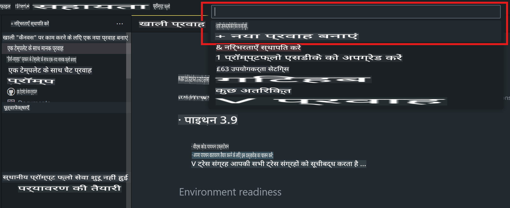
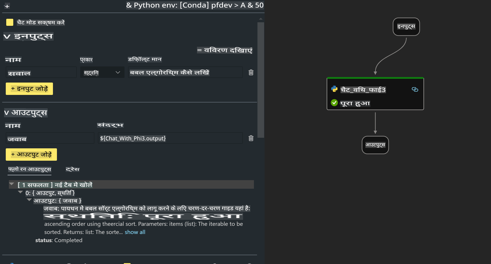

# **लैब 2 - AIPC में Phi-3-mini के साथ प्रॉम्प्ट फ्लो चलाएं**

## **प्रॉम्प्ट फ्लो क्या है**

प्रॉम्प्ट फ्लो एक ऐसा डेवलपमेंट टूल है जो LLM-आधारित AI एप्लिकेशन के एंड-टू-एंड विकास चक्र को आसान बनाता है। इसमें विचार, प्रोटोटाइपिंग, परीक्षण, मूल्यांकन, प्रोडक्शन डिप्लॉयमेंट और मॉनिटरिंग शामिल हैं। यह प्रॉम्प्ट इंजीनियरिंग को सरल बनाता है और आपको प्रोडक्शन क्वालिटी के साथ LLM ऐप्स बनाने में सक्षम बनाता है।

प्रॉम्प्ट फ्लो के साथ आप यह कर सकते हैं:

- LLMs, प्रॉम्प्ट्स, Python कोड और अन्य टूल्स को एक साथ जोड़कर एक कार्यशील वर्कफ़्लो तैयार करें।

- अपने फ्लोज़ को डिबग और संशोधित करें, खासकर LLMs के साथ इंटरैक्शन को आसानी से।

- अपने फ्लोज़ का मूल्यांकन करें और बड़े डेटा सेट्स के साथ गुणवत्ता और प्रदर्शन मेट्रिक्स की गणना करें।

- परीक्षण और मूल्यांकन को अपने CI/CD सिस्टम में एकीकृत करें ताकि फ्लो की गुणवत्ता सुनिश्चित हो सके।

- अपने फ्लोज़ को अपनी पसंद के सर्विंग प्लेटफ़ॉर्म पर डिप्लॉय करें या अपने ऐप के कोड बेस में आसानी से एकीकृत करें।

- (वैकल्पिक लेकिन अत्यधिक अनुशंसित) Azure AI में प्रॉम्प्ट फ्लो के क्लाउड संस्करण का उपयोग करके अपनी टीम के साथ सहयोग करें।


## **Apple Silicon पर जनरेशन कोड फ्लोज़ बनाना**

***नोट*** ：यदि आपने अभी तक पर्यावरण इंस्टॉलेशन पूरा नहीं किया है, तो कृपया [लैब 0 - इंस्टॉलेशन्स](./01.Installations.md) पर जाएं।

1. Visual Studio Code में प्रॉम्प्ट फ्लो एक्सटेंशन खोलें और एक खाली फ्लो प्रोजेक्ट बनाएं।



2. इनपुट्स और आउटपुट्स पैरामीटर जोड़ें और Python कोड को एक नए फ्लो के रूप में जोड़ें।



आप इस संरचना (flow.dag.yaml) का संदर्भ लेकर अपना फ्लो बना सकते हैं।

```yaml

inputs:
  prompt:
    type: string
    default: Write python code for Fibonacci serie. Please use markdown as output
outputs:
  result:
    type: string
    reference: ${gen_code_by_phi3.output}
nodes:
- name: gen_code_by_phi3
  type: python
  source:
    type: code
    path: gen_code_by_phi3.py
  inputs:
    prompt: ${inputs.prompt}


```

3. phi-3-mini को क्वांटिफाई करें।

हम स्थानीय डिवाइस पर SLM को बेहतर तरीके से चलाना चाहते हैं। आमतौर पर, हम मॉडल को क्वांटिफाई करते हैं (INT4, FP16, FP32)।

```bash

python -m mlx_lm.convert --hf-path microsoft/Phi-3-mini-4k-instruct

```

**नोट:** डिफ़ॉल्ट फ़ोल्डर mlx_model है।

4. ***Chat_With_Phi3.py*** में कोड जोड़ें।

```python


from promptflow import tool

from mlx_lm import load, generate


# The inputs section will change based on the arguments of the tool function, after you save the code
# Adding type to arguments and return value will help the system show the types properly
# Please update the function name/signature per need
@tool
def my_python_tool(prompt: str) -> str:

    model_id = './mlx_model_phi3_mini'

    model, tokenizer = load(model_id)

    # <|user|>\nWrite python code for Fibonacci serie. Please use markdown as output<|end|>\n<|assistant|>

    response = generate(model, tokenizer, prompt="<|user|>\n" + prompt  + "<|end|>\n<|assistant|>", max_tokens=2048, verbose=True)

    return response


```

4. आप Debug या Run से फ्लो को टेस्ट कर सकते हैं ताकि यह सुनिश्चित हो सके कि जनरेशन कोड सही है या नहीं।


5. टर्मिनल में फ्लो को डेवलपमेंट API के रूप में चलाएं।

```

pf flow serve --source ./ --port 8080 --host localhost   

```

आप इसे Postman / Thunder Client में टेस्ट कर सकते हैं।  


### **नोट**

1. पहली बार रन करने में काफी समय लगता है। यह अनुशंसा की जाती है कि आप Hugging Face CLI से phi-3 मॉडल डाउनलोड करें।

2. Intel NPU की सीमित कंप्यूटिंग क्षमता को ध्यान में रखते हुए, Phi-3-mini-4k-instruct का उपयोग करने की सिफारिश की जाती है।

3. हम INT4 रूपांतरण को क्वांटिफाई करने के लिए Intel NPU Acceleration का उपयोग करते हैं, लेकिन यदि आप सेवा को फिर से चलाते हैं, तो आपको कैश और nc_workshop फ़ोल्डर को हटाने की आवश्यकता होगी।


## **संसाधन**

1. प्रॉम्प्ट फ्लो सीखें [https://microsoft.github.io/promptflow/](https://microsoft.github.io/promptflow/)

2. Intel NPU Acceleration सीखें [https://github.com/intel/intel-npu-acceleration-library](https://github.com/intel/intel-npu-acceleration-library)

3. सैंपल कोड डाउनलोड करें [Local NPU Agent Sample Code](../../../../../../../../../code/07.Lab/01/AIPC/local-npu-agent)

**अस्वीकरण**:  
यह दस्तावेज़ मशीन-आधारित एआई अनुवाद सेवाओं का उपयोग करके अनुवादित किया गया है। हालांकि हम सटीकता के लिए प्रयास करते हैं, कृपया ध्यान दें कि स्वचालित अनुवादों में त्रुटियां या अशुद्धियां हो सकती हैं। मूल भाषा में लिखा गया मूल दस्तावेज़ ही आधिकारिक स्रोत माना जाना चाहिए। महत्वपूर्ण जानकारी के लिए, पेशेवर मानव अनुवाद की सिफारिश की जाती है। इस अनुवाद के उपयोग से उत्पन्न किसी भी गलतफहमी या गलत व्याख्या के लिए हम उत्तरदायी नहीं हैं।