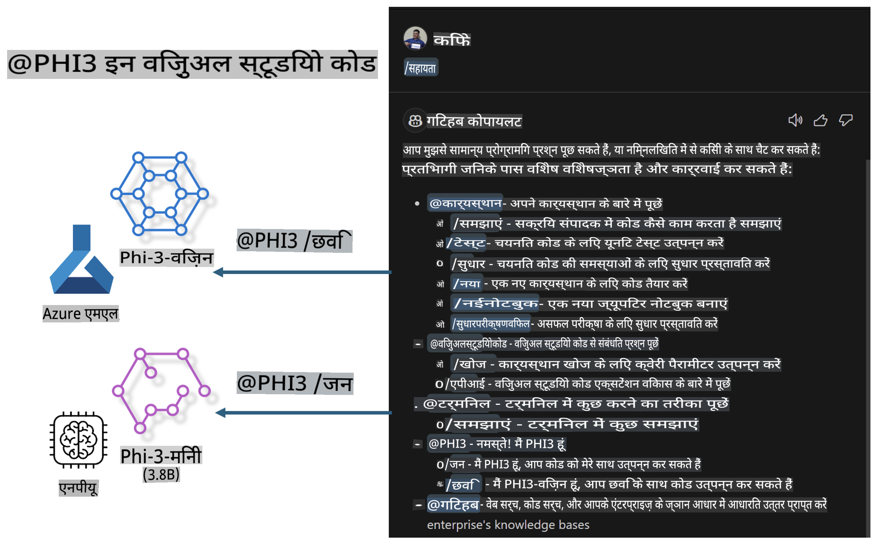

# **अपना खुद का Visual Studio Code GitHub Copilot Chat Microsoft Phi-3 Family के साथ बनाएं**

क्या आपने GitHub Copilot Chat में वर्कस्पेस एजेंट का उपयोग किया है? क्या आप अपनी टीम के लिए एक कोड एजेंट बनाना चाहते हैं? यह हैंड्स-ऑन लैब ओपन सोर्स मॉडल को मिलाकर एंटरप्राइज़-स्तरीय कोड बिज़नेस एजेंट बनाने का लक्ष्य रखता है।

## **बुनियाद**

### **Microsoft Phi-3 क्यों चुनें**

Phi-3 एक फैमिली सीरीज है, जिसमें अलग-अलग ट्रेनिंग पैरामीटर्स के आधार पर टेक्स्ट जनरेशन, डायलॉग कम्प्लीशन और कोड जनरेशन के लिए phi-3-mini, phi-3-small, और phi-3-medium शामिल हैं। Vision पर आधारित phi-3-vision भी है। यह एंटरप्राइज़ या विभिन्न टीमों के लिए ऑफलाइन जनरेटिव AI समाधान बनाने के लिए उपयुक्त है।

इस लिंक को पढ़ने की सिफारिश की जाती है [https://github.com/microsoft/PhiCookBook/blob/main/md/01.Introduction/01/01.PhiFamily.md](https://github.com/microsoft/PhiCookBook/blob/main/md/01.Introduction/01/01.PhiFamily.md)

### **Microsoft GitHub Copilot Chat**

GitHub Copilot Chat एक्सटेंशन आपको एक चैट इंटरफ़ेस देता है, जिससे आप GitHub Copilot के साथ बातचीत कर सकते हैं और कोडिंग से संबंधित प्रश्नों के उत्तर सीधे VS Code में प्राप्त कर सकते हैं, बिना डॉक्यूमेंटेशन खोजने या ऑनलाइन फोरम ब्राउज़ करने की आवश्यकता के।

Copilot Chat सिंटैक्स हाइलाइटिंग, इंडेंटेशन, और अन्य फॉर्मेटिंग फीचर्स का उपयोग कर सकता है ताकि उत्तर को अधिक स्पष्टता दी जा सके। उपयोगकर्ता के प्रश्न के प्रकार के आधार पर, परिणाम में संदर्भ लिंक हो सकते हैं, जैसे कि सोर्स कोड फाइलें या डॉक्यूमेंटेशन, या VS Code कार्यक्षमता तक पहुंचने के लिए बटन।

- Copilot Chat आपके डेवलपर फ्लो में एकीकृत होता है और आपको वहीं सहायता प्रदान करता है जहां इसकी आवश्यकता है:

- कोडिंग करते समय सहायता के लिए सीधे एडिटर या टर्मिनल से एक इनलाइन चैट वार्तालाप शुरू करें

- किसी भी समय सहायता के लिए साइड में AI असिस्टेंट के रूप में Chat व्यू का उपयोग करें

- Quick Chat लॉन्च करें, एक त्वरित प्रश्न पूछें और फिर अपने काम में लौटें

आप GitHub Copilot Chat का उपयोग विभिन्न परिदृश्यों में कर सकते हैं, जैसे:

- किसी समस्या को हल करने के सर्वोत्तम तरीकों पर कोडिंग प्रश्नों का उत्तर देना

- किसी और के कोड को समझाना और सुधार का सुझाव देना

- कोड फिक्स का प्रस्ताव देना

- यूनिट टेस्ट केस जनरेट करना

- कोड डॉक्यूमेंटेशन बनाना

इस लिंक को पढ़ने की सिफारिश की जाती है [https://code.visualstudio.com/docs/copilot/copilot-chat](https://code.visualstudio.com/docs/copilot/copilot-chat?WT.mc_id=aiml-137032-kinfeylo)

###  **Microsoft GitHub Copilot Chat @workspace**

Copilot Chat में **@workspace** का संदर्भ देते हुए, आप अपने पूरे कोडबेस के बारे में प्रश्न पूछ सकते हैं। प्रश्न के आधार पर, Copilot बुद्धिमानी से प्रासंगिक फाइलें और प्रतीक ढूंढता है, जिन्हें वह अपने उत्तर में लिंक और कोड उदाहरणों के रूप में संदर्भित करता है। 

आपके प्रश्न का उत्तर देने के लिए, **@workspace** उन्हीं स्रोतों को खोजता है जिनका उपयोग एक डेवलपर कोडबेस नेविगेट करने के लिए करता है:

- वर्कस्पेस में सभी फाइलें, सिवाय उन फाइलों के जो .gitignore फाइल द्वारा अनदेखी की गई हैं

- डायरेक्टरी संरचना जिसमें नेस्टेड फोल्डर और फाइल नाम शामिल हैं

- GitHub का कोड सर्च इंडेक्स, अगर वर्कस्पेस एक GitHub रिपॉजिटरी है और कोड सर्च द्वारा इंडेक्स किया गया है

- वर्कस्पेस में प्रतीक और परिभाषाएं

- सक्रिय एडिटर में चयनित टेक्स्ट या दृश्यमान टेक्स्ट

नोट: .gitignore को बायपास किया जाता है यदि आपके पास कोई फाइल खुली है या किसी अनदेखी फाइल में टेक्स्ट चयनित है।

इस लिंक को पढ़ने की सिफारिश की जाती है [[https://code.visualstudio.com/docs/copilot/copilot-chat](https://code.visualstudio.com/docs/copilot/workspace-context?WT.mc_id=aiml-137032-kinfeylo)]

## **इस लैब के बारे में अधिक जानें**

GitHub Copilot ने एंटरप्राइज़ की प्रोग्रामिंग दक्षता को काफी बढ़ाया है, और हर एंटरप्राइज़ GitHub Copilot के प्रासंगिक कार्यों को कस्टमाइज़ करना चाहता है। कई एंटरप्राइज़ ने अपने व्यावसायिक परिदृश्यों और ओपन सोर्स मॉडल के आधार पर GitHub Copilot के समान एक्सटेंशन्स को कस्टमाइज़ किया है। एंटरप्राइज़ के लिए, कस्टमाइज़्ड एक्सटेंशन्स को नियंत्रित करना आसान है, लेकिन यह उपयोगकर्ता अनुभव को भी प्रभावित करता है। आखिरकार, GitHub Copilot के पास सामान्य परिदृश्यों और व्यावसायिकता से निपटने में अधिक मजबूत कार्यक्षमता है। यदि अनुभव को सुसंगत रखा जा सके, तो एंटरप्राइज़ के अपने एक्सटेंशन को कस्टमाइज़ करना बेहतर होगा। GitHub Copilot Chat एंटरप्राइज़ को चैट अनुभव में विस्तार के लिए प्रासंगिक APIs प्रदान करता है। एक सुसंगत अनुभव बनाए रखना और कस्टमाइज़्ड कार्यक्षमता होना एक बेहतर उपयोगकर्ता अनुभव है।

यह लैब मुख्य रूप से Phi-3 मॉडल का उपयोग करता है, जिसे स्थानीय NPU और Azure हाइब्रिड के साथ जोड़ा गया है, GitHub Copilot Chat ***@PHI3*** में एक कस्टम एजेंट बनाने के लिए, जो एंटरप्राइज़ डेवलपर्स को कोड जनरेशन ***(@PHI3 /gen)*** और छवियों के आधार पर कोड जनरेशन ***(@PHI3 /img)*** को पूरा करने में सहायता करता है।

### ***नोट:*** 

यह लैब वर्तमान में Intel CPU और Apple Silicon के AIPC में लागू किया गया है। हम Qualcomm संस्करण के NPU को अपडेट करना जारी रखेंगे। 

## **लैब**

| नाम | विवरण | AIPC | Apple |
| ------------ | ----------- | -------- |-------- |
| Lab0 - इंस्टॉलेशन (✅) | संबंधित वातावरण और इंस्टॉलेशन टूल्स को कॉन्फ़िगर और इंस्टॉल करें | [जाएं](./HOL/AIPC/01.Installations.md) |[जाएं](./HOL/Apple/01.Installations.md) |
| Lab1 - Phi-3-mini के साथ Prompt Flow चलाएं (✅) | AIPC / Apple Silicon के साथ, स्थानीय NPU का उपयोग करके Phi-3-mini के माध्यम से कोड जनरेशन बनाएं | [जाएं](./HOL/AIPC/02.PromptflowWithNPU.md) |  [जाएं](./HOL/Apple/02.PromptflowWithMLX.md) |
| Lab2 - Azure Machine Learning Service पर Phi-3-vision को डिप्लॉय करें (✅) | Azure Machine Learning Service के Model Catalog - Phi-3-vision छवि को डिप्लॉय करके कोड जनरेट करें | [जाएं](./HOL/AIPC/03.DeployPhi3VisionOnAzure.md) |[जाएं](./HOL/Apple/03.DeployPhi3VisionOnAzure.md) |
| Lab3 - GitHub Copilot Chat में @phi-3 एजेंट बनाएं (✅)  | GitHub Copilot Chat में एक कस्टम Phi-3 एजेंट बनाएं जो कोड जनरेशन, ग्राफ जनरेशन कोड, RAG आदि को पूरा करता है | [जाएं](./HOL/AIPC/04.CreatePhi3AgentInVSCode.md) | [जाएं](./HOL/Apple/04.CreatePhi3AgentInVSCode.md) |
| सैंपल कोड (✅)  | सैंपल कोड डाउनलोड करें | [जाएं](../../../../../../../code/07.Lab/01/AIPC) | [जाएं](../../../../../../../code/07.Lab/01/Apple) |

## **संसाधन**

1. Phi-3 Cookbook [https://github.com/microsoft/Phi-3CookBook](https://github.com/microsoft/Phi-3CookBook)

2. GitHub Copilot के बारे में और जानें [https://learn.microsoft.com/training/paths/copilot/](https://learn.microsoft.com/training/paths/copilot/?WT.mc_id=aiml-137032-kinfeylo)

3. GitHub Copilot Chat के बारे में और जानें [https://learn.microsoft.com/training/paths/accelerate-app-development-using-github-copilot/](https://learn.microsoft.com/training/paths/accelerate-app-development-using-github-copilot/?WT.mc_id=aiml-137032-kinfeylo)

4. GitHub Copilot Chat API के बारे में और जानें [https://code.visualstudio.com/api/extension-guides/chat](https://code.visualstudio.com/api/extension-guides/chat?WT.mc_id=aiml-137032-kinfeylo)

5. Azure AI Foundry के बारे में और जानें [https://learn.microsoft.com/training/paths/create-custom-copilots-ai-studio/](https://learn.microsoft.com/training/paths/create-custom-copilots-ai-studio/?WT.mc_id=aiml-137032-kinfeylo)

6. Azure AI Foundry के Model Catalog के बारे में और जानें [https://learn.microsoft.com/azure/ai-studio/how-to/model-catalog-overview](https://learn.microsoft.com/azure/ai-studio/how-to/model-catalog-overview)

**अस्वीकरण**:  
यह दस्तावेज़ मशीन-आधारित एआई अनुवाद सेवाओं का उपयोग करके अनुवादित किया गया है। जबकि हम सटीकता सुनिश्चित करने का प्रयास करते हैं, कृपया ध्यान दें कि स्वचालित अनुवाद में त्रुटियां या गलतियां हो सकती हैं। मूल दस्तावेज़ को उसकी मूल भाषा में प्रामाणिक स्रोत माना जाना चाहिए। महत्वपूर्ण जानकारी के लिए, पेशेवर मानव अनुवाद की सिफारिश की जाती है। इस अनुवाद के उपयोग से उत्पन्न किसी भी गलतफहमी या गलत व्याख्या के लिए हम जिम्मेदार नहीं हैं।