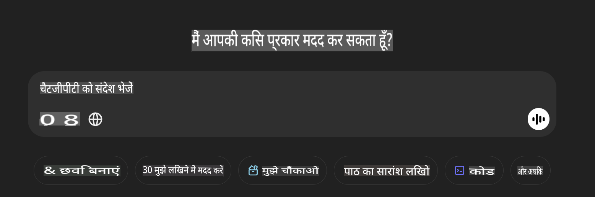

## **Phi-4-मल्टीमोडल का उपयोग करके छवियों को पढ़ें और कोड उत्पन्न करें**

Phi-4-मल्टीमोडल में छवियों को पढ़ने की मजबूत क्षमताएँ हैं। आइए Python का उपयोग करके निम्नलिखित कार्यों को लागू करने का प्रयास करें। छवि एक ChatGPT पेज है।



### **उदाहरण कोड**

```python

import requests
import torch
from PIL import Image
import soundfile
from transformers import AutoModelForCausalLM, AutoProcessor, GenerationConfig,pipeline,AutoTokenizer

model_path = 'Your Phi-4-multimodal location'

kwargs = {}
kwargs['torch_dtype'] = torch.bfloat16

processor = AutoProcessor.from_pretrained(model_path, trust_remote_code=True)

model = AutoModelForCausalLM.from_pretrained(
    model_path,
    trust_remote_code=True,
    torch_dtype='auto',
    _attn_implementation='flash_attention_2',
).cuda()

generation_config = GenerationConfig.from_pretrained(model_path, 'generation_config.json')

user_prompt = '<|user|>'
assistant_prompt = '<|assistant|>'
prompt_suffix = '<|end|>'

prompt = f'{user_prompt}Can you generate HTML + JS code about this image <|image_1|> ? Please step by step {prompt_suffix}{assistant_prompt}'

image = Image.open("./demo.png")

inputs = processor(text=prompt, images=[image], return_tensors='pt').to('cuda:0')

generate_ids = model.generate(
    **inputs,
    max_new_tokens=4096,
    generation_config=generation_config,
)

generate_ids = generate_ids[:, inputs['input_ids'].shape[1] :]

response = processor.batch_decode(
    generate_ids, skip_special_tokens=True, clean_up_tokenization_spaces=False
)[0]

print(response)

```

**अस्वीकरण**:  
यह दस्तावेज़ मशीन-आधारित एआई अनुवाद सेवाओं का उपयोग करके अनुवादित किया गया है। जबकि हम सटीकता के लिए प्रयासरत हैं, कृपया ध्यान दें कि स्वचालित अनुवादों में त्रुटियाँ या अशुद्धियाँ हो सकती हैं। मूल दस्तावेज़, जो इसकी मूल भाषा में है, को प्रामाणिक स्रोत माना जाना चाहिए। महत्वपूर्ण जानकारी के लिए, पेशेवर मानव अनुवाद की सिफारिश की जाती है। इस अनुवाद के उपयोग से उत्पन्न किसी भी गलतफहमी या गलत व्याख्या के लिए हम उत्तरदायी नहीं हैं।