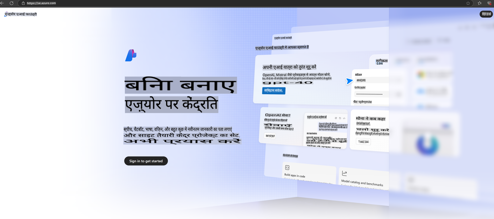

# **Azure AI Foundry में Phi-3 का उपयोग करना**

जनरेटिव AI के विकास के साथ, हम एकीकृत प्लेटफ़ॉर्म का उपयोग करके विभिन्न LLM और SLM, एंटरप्राइज़ डेटा इंटीग्रेशन, फाइन-ट्यूनिंग/RAG ऑपरेशन्स और LLM और SLM को एंटरप्राइज़ व्यवसायों में एकीकृत करने के बाद उनके मूल्यांकन जैसे कार्यों को प्रबंधित करना चाहते हैं, ताकि जनरेटिव AI के स्मार्ट अनुप्रयोग बेहतर तरीके से लागू किए जा सकें। [Azure AI Foundry](https://ai.azure.com) एक एंटरप्राइज़-स्तरीय जनरेटिव AI एप्लिकेशन प्लेटफ़ॉर्म है।

Azure AI Foundry के साथ, आप बड़े भाषा मॉडल (LLM) प्रतिक्रियाओं का मूल्यांकन कर सकते हैं और बेहतर प्रदर्शन के लिए प्रॉम्प्ट फ्लो के साथ प्रॉम्प्ट एप्लिकेशन घटकों को ऑर्केस्ट्रेट कर सकते हैं। यह प्लेटफ़ॉर्म प्रूफ ऑफ कॉन्सेप्ट को आसानी से पूर्ण-स्तरीय प्रोडक्शन में बदलने के लिए स्केलेबिलिटी प्रदान करता है। निरंतर मॉनिटरिंग और परिष्करण दीर्घकालिक सफलता का समर्थन करते हैं।

हम सरल चरणों के माध्यम से Azure AI Foundry पर Phi-3 मॉडल को जल्दी से तैनात कर सकते हैं, और फिर Azure AI Foundry का उपयोग करके Phi-3 संबंधित Playground/Chat, फाइन-ट्यूनिंग, मूल्यांकन और अन्य संबंधित कार्य पूरे कर सकते हैं।

## **1. तैयारी**

यदि आपके पास पहले से ही [Azure Developer CLI](https://learn.microsoft.com/azure/developer/azure-developer-cli/overview?WT.mc_id=aiml-138114-kinfeylo) आपके सिस्टम पर इंस्टॉल है, तो इस टेम्पलेट का उपयोग करना एक नई डायरेक्टरी में इस कमांड को चलाने जितना आसान है।

## मैनुअल निर्माण

Microsoft Azure AI Foundry प्रोजेक्ट और हब बनाना आपके AI कार्य को संगठित और प्रबंधित करने का एक शानदार तरीका है। यहां आरंभ करने के लिए चरण-दर-चरण मार्गदर्शिका दी गई है:

### Azure AI Foundry में प्रोजेक्ट बनाना

1. **Azure AI Foundry पर जाएं**: Azure AI Foundry पोर्टल में साइन इन करें।
2. **प्रोजेक्ट बनाएं**:
   - यदि आप किसी प्रोजेक्ट में हैं, तो होम पेज पर जाने के लिए पृष्ठ के शीर्ष बाईं ओर "Azure AI Foundry" चुनें।
   - "+ Create project" पर क्लिक करें।
   - प्रोजेक्ट के लिए एक नाम दर्ज करें।
   - यदि आपके पास एक हब है, तो वह डिफ़ॉल्ट रूप से चयनित होगा। यदि आपके पास एक से अधिक हब तक पहुंच है, तो आप ड्रॉपडाउन से एक अलग हब चुन सकते हैं। यदि आप एक नया हब बनाना चाहते हैं, तो "Create new hub" चुनें और एक नाम प्रदान करें।
   - "Create" पर क्लिक करें।

### Azure AI Foundry में हब बनाना

1. **Azure AI Foundry पर जाएं**: अपने Azure खाते से साइन इन करें।
2. **हब बनाएं**:
   - बाईं मेनू से प्रबंधन केंद्र (Management center) चुनें।
   - "All resources" चुनें, फिर "+ New project" के बगल में डाउन एरो पर क्लिक करें और "+ New hub" चुनें।
   - "Create a new hub" डायलॉग में, अपने हब के लिए एक नाम दर्ज करें (जैसे, contoso-hub) और अन्य फ़ील्ड्स को अपनी आवश्यकता अनुसार संशोधित करें।
   - "Next" पर क्लिक करें, जानकारी की समीक्षा करें, और फिर "Create" चुनें।

अधिक विस्तृत निर्देशों के लिए, आप आधिकारिक [Microsoft डाक्यूमेंटेशन](https://learn.microsoft.com/azure/ai-studio/how-to/create-projects) देख सकते हैं।

सफल निर्माण के बाद, आप [ai.azure.com](https://ai.azure.com/) के माध्यम से बनाए गए स्टूडियो तक पहुंच सकते हैं।

एक AI Foundry पर कई प्रोजेक्ट हो सकते हैं। AI Foundry में एक प्रोजेक्ट बनाएं और तैयारी करें।

Azure AI Foundry [QuickStarts](https://learn.microsoft.com/azure/ai-studio/quickstarts/get-started-code) बनाएं।

## **2. Azure AI Foundry में Phi मॉडल तैनात करना**

प्रोजेक्ट के Explore विकल्प पर क्लिक करें, Model Catalog में प्रवेश करें और Phi-3 चुनें।

Phi-3-mini-4k-instruct का चयन करें।

Phi-3-mini-4k-instruct मॉडल को तैनात करने के लिए 'Deploy' पर क्लिक करें।

> [!NOTE]
>
> तैनात करते समय आप कंप्यूटिंग पावर का चयन कर सकते हैं।

## **3. Azure AI Foundry में Playground Chat Phi**

डिप्लॉयमेंट पेज पर जाएं, Playground चुनें, और Azure AI Foundry के Phi-3 के साथ चैट करें।

## **4. Azure AI Foundry से मॉडल तैनात करना**

Azure Model Catalog से मॉडल तैनात करने के लिए, आप निम्न चरणों का पालन कर सकते हैं:

- Azure AI Foundry में साइन इन करें।
- Azure AI Foundry मॉडल कैटलॉग से वह मॉडल चुनें जिसे आप तैनात करना चाहते हैं।
- मॉडल के Details पेज पर, Deploy चुनें और फिर Serverless API with Azure AI Content Safety चुनें।
- वह प्रोजेक्ट चुनें जिसमें आप अपने मॉडल तैनात करना चाहते हैं। Serverless API ऑफ़रिंग का उपयोग करने के लिए, आपका वर्कस्पेस East US 2 या Sweden Central क्षेत्र से संबंधित होना चाहिए। आप डिप्लॉयमेंट नाम को कस्टमाइज़ कर सकते हैं।
- डिप्लॉयमेंट विज़ार्ड पर, Pricing और Terms का चयन करें और उपयोग की शर्तों के बारे में जानें।
- Deploy चुनें। जब तक डिप्लॉयमेंट तैयार न हो जाए और आपको डिप्लॉयमेंट पेज पर पुनः निर्देशित न कर दिया जाए, तब तक प्रतीक्षा करें।
- मॉडल के साथ इंटरैक्ट करने के लिए Open in playground चुनें।
- आप डिप्लॉयमेंट पेज पर वापस जा सकते हैं, डिप्लॉयमेंट चुन सकते हैं, और Target URL और Secret Key नोट कर सकते हैं, जिनका उपयोग आप डिप्लॉयमेंट को कॉल करने और कंप्लीशन जनरेट करने के लिए कर सकते हैं।
- आप हमेशा Build टैब पर जाकर और Components सेक्शन से Deployments चुनकर एंडपॉइंट का विवरण, URL और एक्सेस कीज़ देख सकते हैं।

> [!NOTE]
> कृपया ध्यान दें कि इन चरणों को करने के लिए आपके खाते में Resource Group पर Azure AI Developer रोल अनुमतियां होनी चाहिए।

## **5. Azure AI Foundry में Phi API का उपयोग करना**

आप Postman GET के माध्यम से https://{Your project name}.region.inference.ml.azure.com/swagger.json तक पहुंच सकते हैं और Key के साथ इसे जोड़कर प्रदान किए गए इंटरफेस के बारे में जान सकते हैं।

आप बहुत आसानी से रिक्वेस्ट पैरामीटर्स और रिस्पॉन्स पैरामीटर्स प्राप्त कर सकते हैं।

**अस्वीकरण**:  
यह दस्तावेज़ मशीन-आधारित एआई अनुवाद सेवाओं का उपयोग करके अनुवादित किया गया है। जबकि हम सटीकता सुनिश्चित करने का प्रयास करते हैं, कृपया ध्यान दें कि स्वचालित अनुवादों में त्रुटियां या गलतियां हो सकती हैं। मूल भाषा में उपलब्ध मूल दस्तावेज़ को प्रामाणिक स्रोत माना जाना चाहिए। महत्वपूर्ण जानकारी के लिए, पेशेवर मानव अनुवाद की सिफारिश की जाती है। इस अनुवाद के उपयोग से उत्पन्न किसी भी गलतफहमी या गलत व्याख्या के लिए हम उत्तरदायी नहीं हैं।