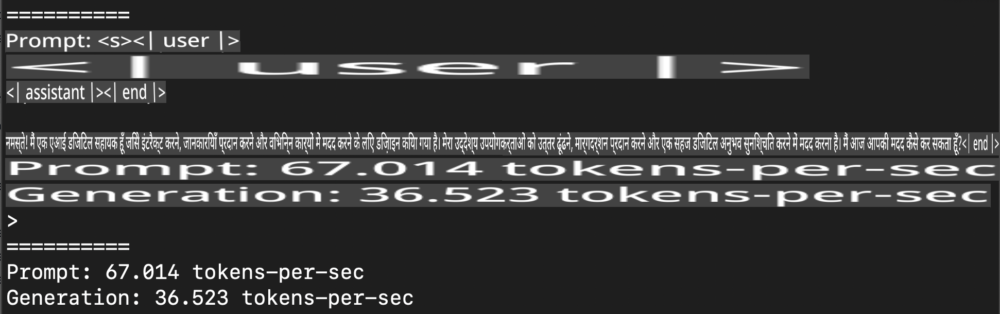
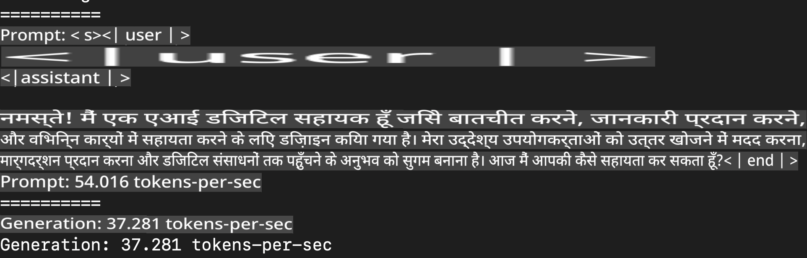
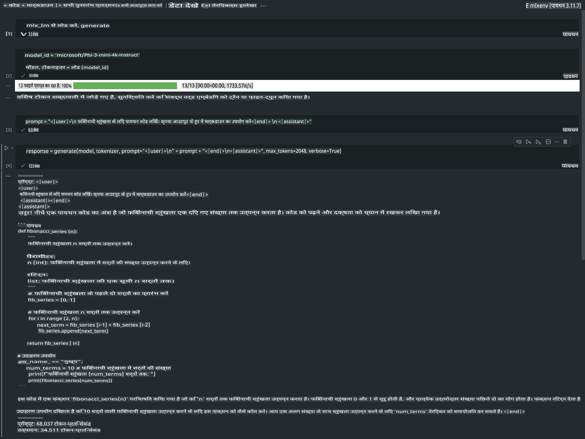

# **Apple MLX फ्रेमवर्क के साथ Phi-3 का इंफरेंस**

## **MLX फ्रेमवर्क क्या है**

MLX एक ऐरे फ्रेमवर्क है जो Apple सिलिकॉन पर मशीन लर्निंग अनुसंधान के लिए बनाया गया है, और इसे Apple मशीन लर्निंग अनुसंधान टीम द्वारा पेश किया गया है।

MLX को मशीन लर्निंग शोधकर्ताओं द्वारा मशीन लर्निंग शोधकर्ताओं के लिए डिज़ाइन किया गया है। यह फ्रेमवर्क उपयोगकर्ता के लिए सहज है लेकिन फिर भी मॉडल को प्रशिक्षित और लागू करने में प्रभावी है। फ्रेमवर्क का डिज़ाइन भी अवधारणात्मक रूप से सरल है। हमारा उद्देश्य है कि शोधकर्ताओं के लिए MLX को विस्तारित और बेहतर बनाना आसान हो, ताकि वे नई विचारधाराओं का तेजी से परीक्षण कर सकें।

Apple सिलिकॉन डिवाइसों पर MLX के माध्यम से LLMs को तेज़ किया जा सकता है, और मॉडल को स्थानीय रूप से बहुत ही सुविधाजनक तरीके से चलाया जा सकता है।

## **MLX का उपयोग करके Phi-3-mini का इंफरेंस**

### **1. अपना MLX पर्यावरण सेट करें**

1. Python 3.11.x
2. MLX लाइब्रेरी इंस्टॉल करें

```bash

pip install mlx-lm

```

### **2. MLX के साथ टर्मिनल में Phi-3-mini चलाना**

```bash

python -m mlx_lm.generate --model microsoft/Phi-3-mini-4k-instruct --max-token 2048 --prompt  "<|user|>\nCan you introduce yourself<|end|>\n<|assistant|>"

```

परिणाम (मेरा पर्यावरण Apple M1 Max, 64GB) इस प्रकार है:



### **3. टर्मिनल में MLX के साथ Phi-3-mini को क्वांटाइज़ करना**

```bash

python -m mlx_lm.convert --hf-path microsoft/Phi-3-mini-4k-instruct

```

***नोट:*** मॉडल को mlx_lm.convert के माध्यम से क्वांटाइज़ किया जा सकता है, और डिफ़ॉल्ट क्वांटाइज़ेशन INT4 है। इस उदाहरण में Phi-3-mini को INT4 में क्वांटाइज़ किया गया है।

मॉडल को mlx_lm.convert के माध्यम से क्वांटाइज़ किया जा सकता है, और डिफ़ॉल्ट क्वांटाइज़ेशन INT4 है। इस उदाहरण में Phi-3-mini को INT4 में क्वांटाइज़ किया गया है। क्वांटाइज़ेशन के बाद, इसे डिफ़ॉल्ट निर्देशिका ./mlx_model में संग्रहीत किया जाएगा।

हम MLX के साथ क्वांटाइज़ किए गए मॉडल को टर्मिनल से टेस्ट कर सकते हैं।

```bash

python -m mlx_lm.generate --model ./mlx_model/ --max-token 2048 --prompt  "<|user|>\nCan you introduce yourself<|end|>\n<|assistant|>"

```

परिणाम इस प्रकार है:



### **4. Jupyter Notebook में MLX के साथ Phi-3-mini चलाना**



***नोट:*** कृपया इस नमूने को पढ़ें [इस लिंक पर क्लिक करें](../../../../../code/03.Inference/MLX/MLX_DEMO.ipynb)

## **संसाधन**

1. Apple MLX फ्रेमवर्क के बारे में जानें [https://ml-explore.github.io](https://ml-explore.github.io/mlx/build/html/index.html)

2. Apple MLX GitHub रिपॉजिटरी [https://github.com/ml-explore](https://github.com/ml-explore)

**अस्वीकरण**:  
यह दस्तावेज़ मशीन-आधारित एआई अनुवाद सेवाओं का उपयोग करके अनुवादित किया गया है। जबकि हम सटीकता के लिए प्रयासरत हैं, कृपया ध्यान दें कि स्वचालित अनुवाद में त्रुटियां या अशुद्धियां हो सकती हैं। मूल दस्तावेज़, जो इसकी मूल भाषा में है, को आधिकारिक स्रोत माना जाना चाहिए। महत्वपूर्ण जानकारी के लिए, पेशेवर मानव अनुवाद की सिफारिश की जाती है। इस अनुवाद के उपयोग से उत्पन्न किसी भी गलतफहमी या गलत व्याख्या के लिए हम उत्तरदायी नहीं हैं।