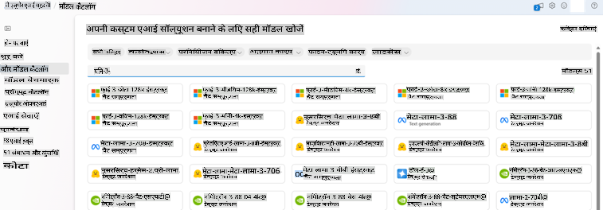
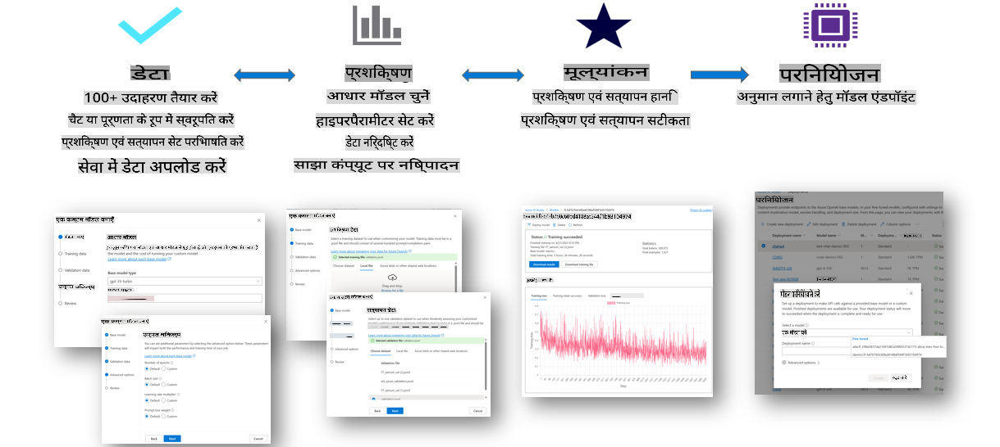
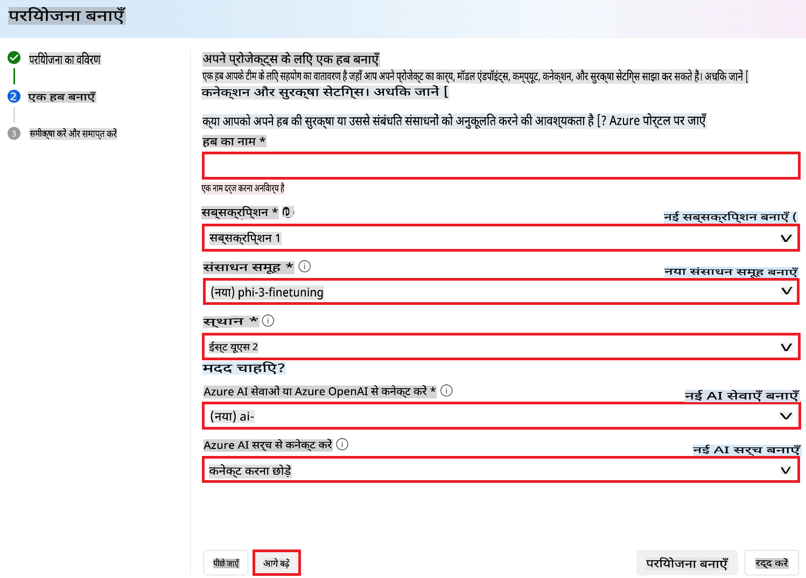
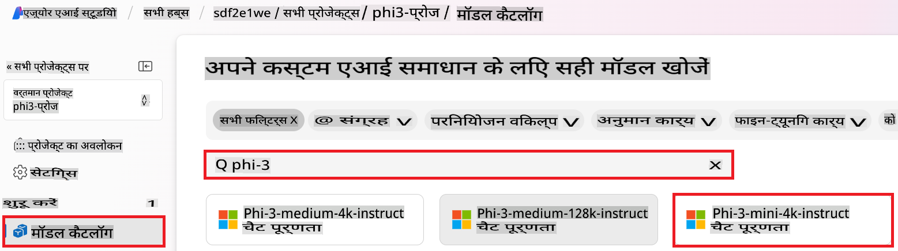
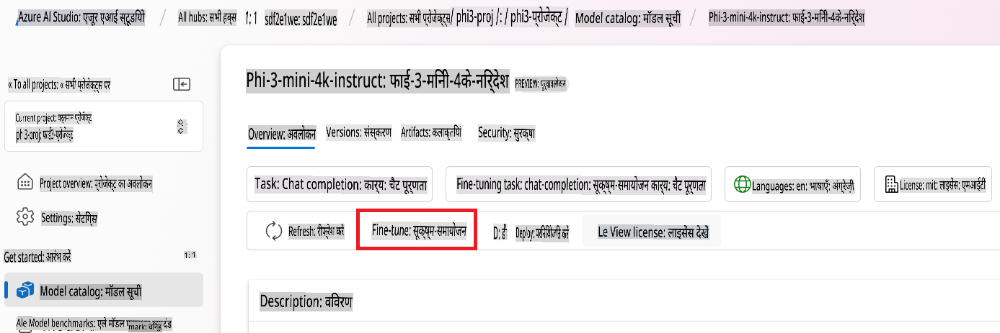
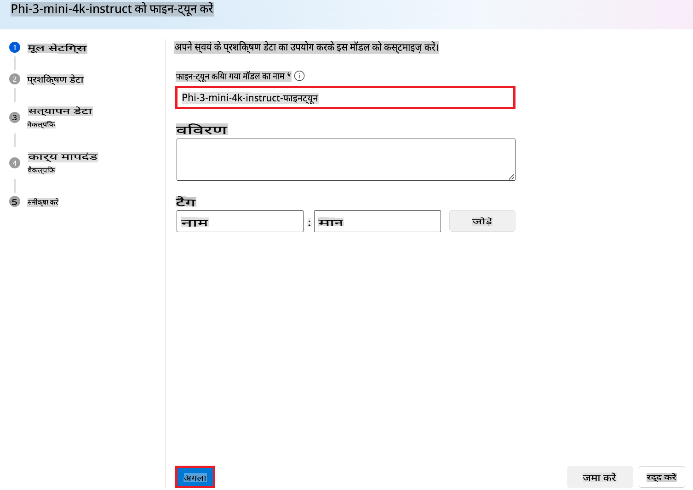
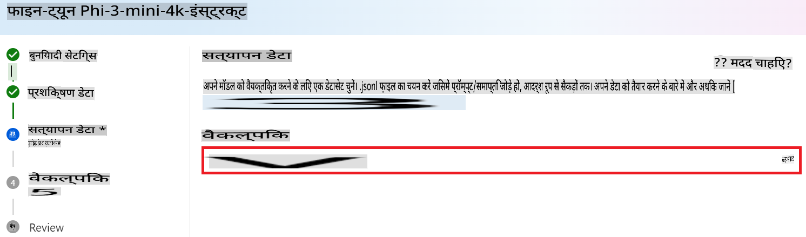
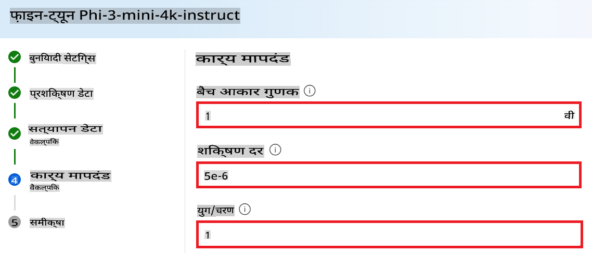
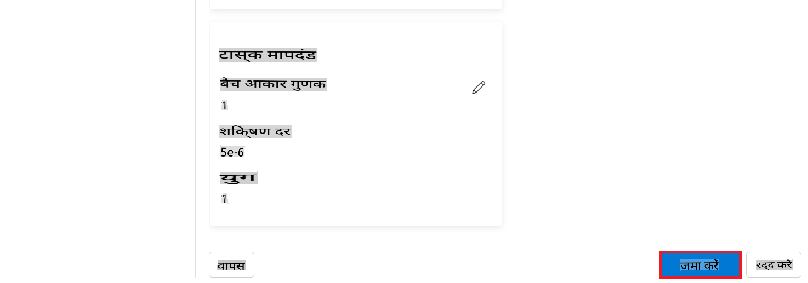
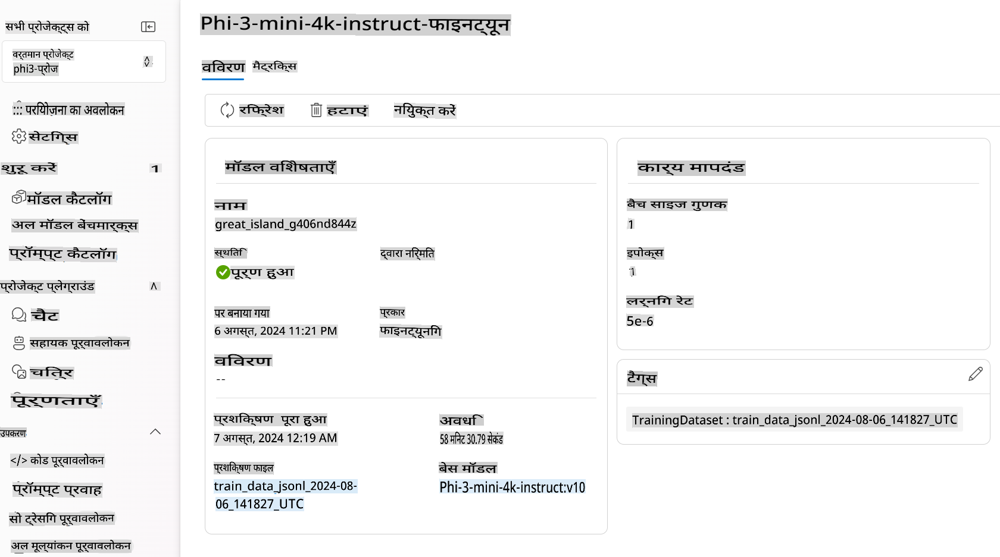

# Azure AI Foundry के साथ Phi-3 को फाइन-ट्यून करना

आइए Microsoft के Phi-3 Mini भाषा मॉडल को Azure AI Foundry का उपयोग करके फाइन-ट्यून करने की प्रक्रिया को समझें। फाइन-ट्यूनिंग आपको Phi-3 Mini को विशिष्ट कार्यों के लिए अनुकूलित करने की अनुमति देती है, जिससे यह और भी शक्तिशाली और संदर्भ-संवेदनशील बन जाता है।

## विचारणीय बातें

- **क्षमताएँ:** कौन से मॉडल फाइन-ट्यून किए जा सकते हैं? बेस मॉडल को किस प्रकार के कार्यों के लिए फाइन-ट्यून किया जा सकता है?
- **लागत:** फाइन-ट्यूनिंग के लिए मूल्य निर्धारण मॉडल क्या है?
- **कस्टमाइज़ेबिलिटी:** बेस मॉडल को कितना और किन तरीकों से संशोधित किया जा सकता है?
- **सुविधा:** फाइन-ट्यूनिंग कैसे की जाती है – क्या इसके लिए कस्टम कोड लिखने की आवश्यकता है? क्या मुझे अपनी खुद की कंप्यूटिंग संसाधन लाने होंगे?
- **सुरक्षा:** फाइन-ट्यून किए गए मॉडल में सुरक्षा जोखिम हो सकते हैं – क्या अनपेक्षित नुकसान से बचाने के लिए कोई सुरक्षा उपाय हैं?



## फाइन-ट्यूनिंग के लिए तैयारी

### आवश्यकताएँ

> [!NOTE]
> Phi-3 परिवार के मॉडल के लिए, पे-एज़-यू-गो मॉडल फाइन-ट्यूनिंग की पेशकश केवल **East US 2** क्षेत्रों में बनाए गए हब्स के साथ उपलब्ध है।

- एक Azure सदस्यता। यदि आपके पास Azure सदस्यता नहीं है, तो [पेड Azure अकाउंट](https://azure.microsoft.com/pricing/purchase-options/pay-as-you-go) बनाकर शुरू करें।

- एक [AI Foundry प्रोजेक्ट](https://ai.azure.com?WT.mc_id=aiml-138114-kinfeylo)।
- Azure रोल-आधारित एक्सेस नियंत्रण (Azure RBAC) का उपयोग Azure AI Foundry में संचालन के लिए एक्सेस प्रदान करने के लिए किया जाता है। इस लेख में दिए गए चरणों को पूरा करने के लिए, आपके उपयोगकर्ता खाते को __Azure AI Developer रोल__ को संसाधन समूह पर असाइन किया जाना चाहिए।

### सब्सक्रिप्शन प्रोवाइडर पंजीकरण

सुनिश्चित करें कि सब्सक्रिप्शन `Microsoft.Network` संसाधन प्रोवाइडर के लिए पंजीकृत है।

1. [Azure पोर्टल](https://portal.azure.com) में साइन इन करें।
1. बाईं ओर मेनू से **Subscriptions** चुनें।
1. उस सब्सक्रिप्शन का चयन करें जिसे आप उपयोग करना चाहते हैं।
1. बाईं ओर मेनू से **AI project settings** > **Resource providers** चुनें।
1. सुनिश्चित करें कि **Microsoft.Network** संसाधन प्रोवाइडर्स की सूची में है। यदि नहीं, तो इसे जोड़ें।

### डेटा की तैयारी

अपने मॉडल को फाइन-ट्यून करने के लिए प्रशिक्षण और सत्यापन डेटा तैयार करें। आपका प्रशिक्षण डेटा और सत्यापन डेटा सेट इनपुट और आउटपुट उदाहरणों से मिलकर बना होता है, जो यह दर्शाते हैं कि आप मॉडल को कैसे प्रदर्शन करना चाहते हैं।

सुनिश्चित करें कि आपके सभी प्रशिक्षण उदाहरण अनुमान के अपेक्षित प्रारूप का पालन करते हैं। मॉडल को प्रभावी ढंग से फाइन-ट्यून करने के लिए, एक संतुलित और विविध डेटासेट सुनिश्चित करें।

इसमें डेटा संतुलन बनाए रखना, विभिन्न परिदृश्यों को शामिल करना, और वास्तविक दुनिया की अपेक्षाओं के साथ प्रशिक्षण डेटा को संरेखित करने के लिए समय-समय पर इसे परिष्कृत करना शामिल है, जिससे अंततः अधिक सटीक और संतुलित मॉडल प्रतिक्रियाएँ प्राप्त होती हैं।

विभिन्न मॉडल प्रकारों के लिए प्रशिक्षण डेटा के अलग-अलग प्रारूप की आवश्यकता होती है।

### चैट कम्प्लीशन

आप जो प्रशिक्षण और सत्यापन डेटा उपयोग करते हैं, उसे **JSON Lines (JSONL)** दस्तावेज़ के रूप में स्वरूपित किया जाना चाहिए। `Phi-3-mini-128k-instruct` के लिए, फाइन-ट्यूनिंग डेटासेट को उस संवादात्मक प्रारूप में स्वरूपित किया जाना चाहिए, जिसका उपयोग चैट कम्प्लीशन एपीआई द्वारा किया जाता है।

### उदाहरण फ़ाइल प्रारूप

```json
    {"messages": [{"role": "system", "content": "You are an Xbox customer support agent whose primary goal is to help users with issues they are experiencing with their Xbox devices. You are friendly and concise. You only provide factual answers to queries, and do not provide answers that are not related to Xbox."}, {"role": "user", "content": "Is Xbox better than PlayStation?"}, {"role": "assistant", "content": "I apologize, but I cannot provide personal opinions. My primary job is to assist you with any issues related to your Xbox device. Do you have any Xbox-related issues that need addressing?"}]}
    {"messages": [{"role": "system", "content": "You are an Xbox customer support agent whose primary goal is to help users with issues they are experiencing with their Xbox devices. You are friendly and concise. You only provide factual answers to queries, and do not provide answers that are not related to Xbox."}, {"role": "user", "content": "Can I play PC games on my Xbox?"}, {"role": "assistant", "content": "While Xbox consoles don't natively support PC games, they can play an array of Xbox games, many of which are also available on PC. Can I assist you with finding games compatible with your Xbox device?"}]}
    {"messages": [{"role": "system", "content": "You are an Xbox customer support agent whose primary goal is to help users with issues they are experiencing with their Xbox devices. You are friendly and concise. You only provide factual answers to queries, and do not provide answers that are not related to Xbox."}, {"role": "user", "content": "I'm having trouble connecting my Xbox to the Wi-Fi."}, {"role": "assistant", "content": "No worries, let's go through the network settings on your Xbox. Can you please tell me what happens when you try to connect it to the Wi-Fi?"}]}
```

समर्थित फ़ाइल प्रकार JSON Lines है। फ़ाइलों को डिफ़ॉल्ट डेटा स्टोर में अपलोड किया जाता है और आपके प्रोजेक्ट में उपलब्ध कराया जाता है।

## Azure AI Foundry के साथ Phi-3 को फाइन-ट्यून करना

Azure AI Foundry आपको फाइन-ट्यूनिंग नामक प्रक्रिया का उपयोग करके बड़े भाषा मॉडल को अपने व्यक्तिगत डेटासेट के अनुसार अनुकूलित करने की अनुमति देता है। फाइन-ट्यूनिंग महत्वपूर्ण मूल्य प्रदान करता है क्योंकि यह विशिष्ट कार्यों और अनुप्रयोगों के लिए अनुकूलन और अनुकूलन को सक्षम बनाता है। यह प्रदर्शन में सुधार, लागत दक्षता, विलंबता में कमी और अनुकूलित आउटपुट की ओर ले जाता है।



### एक नया प्रोजेक्ट बनाना

1. [Azure AI Foundry](https://ai.azure.com) में साइन इन करें।

1. Azure AI Foundry में नया प्रोजेक्ट बनाने के लिए **+New project** चुनें।

    

1. निम्नलिखित कार्य करें:

    - प्रोजेक्ट **Hub name**। यह एक अद्वितीय मान होना चाहिए।
    - उपयोग करने के लिए **Hub** चुनें (यदि आवश्यक हो तो नया बनाएं)।

    

1. नया हब बनाने के लिए निम्नलिखित कार्य करें:

    - **Hub name** दर्ज करें। यह एक अद्वितीय मान होना चाहिए।
    - अपनी Azure **Subscription** चुनें।
    - उपयोग करने के लिए **Resource group** चुनें (यदि आवश्यक हो तो नया बनाएं)।
    - वह **Location** चुनें जिसका आप उपयोग करना चाहते हैं।
    - उपयोग करने के लिए **Connect Azure AI Services** चुनें (यदि आवश्यक हो तो नया बनाएं)।
    - **Connect Azure AI Search** को **Skip connecting** पर सेट करें।

    

1. **Next** चुनें।
1. **Create a project** चुनें।

### डेटा की तैयारी

फाइन-ट्यूनिंग से पहले, अपने कार्य से संबंधित डेटासेट को एकत्र करें या बनाएँ, जैसे कि चैट निर्देश, प्रश्न-उत्तर जोड़े, या अन्य प्रासंगिक पाठ डेटा। शोर को हटाकर, अनुपलब्ध मानों को संभालकर, और पाठ को टोकनाइज़ करके इस डेटा को साफ और पूर्व-प्रक्रिया करें।

### Azure AI Foundry में Phi-3 मॉडल को फाइन-ट्यून करना

> [!NOTE]
> Phi-3 मॉडल की फाइन-ट्यूनिंग वर्तमान में East US 2 में स्थित प्रोजेक्ट्स में समर्थित है।

1. बाईं ओर टैब से **Model catalog** चुनें।

1. **सर्च बार** में *phi-3* टाइप करें और उस phi-3 मॉडल को चुनें जिसे आप उपयोग करना चाहते हैं।

    

1. **Fine-tune** चुनें।

    

1. **Fine-tuned model name** दर्ज करें।

    

1. **Next** चुनें।

1. निम्नलिखित कार्य करें:

    - **Task type** को **Chat completion** पर सेट करें।
    - उपयोग करने के लिए **Training data** चुनें। आप इसे Azure AI Foundry के डेटा या अपने स्थानीय वातावरण से अपलोड कर सकते हैं।

    

1. **Next** चुनें।

1. उपयोग करने के लिए **Validation data** अपलोड करें, या आप **Automatic split of training data** चुन सकते हैं।

    

1. **Next** चुनें।

1. निम्नलिखित कार्य करें:

    - उपयोग करने के लिए **Batch size multiplier** चुनें।
    - उपयोग करने के लिए **Learning rate** चुनें।
    - उपयोग करने के लिए **Epochs** चुनें।

    

1. फाइन-ट्यूनिंग प्रक्रिया शुरू करने के लिए **Submit** चुनें।

    

1. एक बार आपका मॉडल फाइन-ट्यून हो जाने पर, स्थिति **Completed** के रूप में प्रदर्शित होगी, जैसा कि नीचे दी गई छवि में दिखाया गया है। अब आप मॉडल को तैनात कर सकते हैं और इसे अपने स्वयं के अनुप्रयोग में, प्लेग्राउंड में, या प्रॉम्प्ट फ्लो में उपयोग कर सकते हैं। अधिक जानकारी के लिए, देखें [Azure AI Foundry के साथ Phi-3 छोटे भाषा मॉडल को कैसे तैनात करें](https://learn.microsoft.com/azure/ai-studio/how-to/deploy-models-phi-3?tabs=phi-3-5&pivots=programming-language-python)।

    

> [!NOTE]
> Phi-3 को फाइन-ट्यून करने पर अधिक विस्तृत जानकारी के लिए, कृपया देखें [Azure AI Foundry में Phi-3 मॉडल को फाइन-ट्यून करें](https://learn.microsoft.com/azure/ai-studio/how-to/fine-tune-phi-3?tabs=phi-3-mini)।

## फाइन-ट्यून किए गए मॉडल को साफ करना

आप फाइन-ट्यूनिंग मॉडल सूची से या मॉडल विवरण पृष्ठ से [Azure AI Foundry](https://ai.azure.com) में फाइन-ट्यून किए गए मॉडल को हटा सकते हैं। फाइन-ट्यूनिंग पृष्ठ से हटाने के लिए फाइन-ट्यून किए गए मॉडल का चयन करें, और फिर फाइन-ट्यून किए गए मॉडल को हटाने के लिए Delete बटन चुनें।

> [!NOTE]
> आप किसी कस्टम मॉडल को तब तक नहीं हटा सकते जब तक कि उसकी कोई मौजूदा तैनाती हो। आपको पहले अपने मॉडल की तैनाती को हटाना होगा, फिर आप अपने कस्टम मॉडल को हटा सकते हैं।

## लागत और कोटा

### सेवा के रूप में फाइन-ट्यून किए गए Phi-3 मॉडल के लिए लागत और कोटा विचार

Phi मॉडल सेवा के रूप में Microsoft द्वारा फाइन-ट्यून किए गए और Azure AI Foundry के साथ उपयोग के लिए एकीकृत किए गए हैं। आप मूल्य निर्धारण को [तैनाती](https://learn.microsoft.com/azure/ai-studio/how-to/deploy-models-phi-3?tabs=phi-3-5&pivots=programming-language-python) या मॉडल को फाइन-ट्यूनिंग करते समय, डिप्लॉयमेंट विज़ार्ड के Pricing and terms टैब के तहत देख सकते हैं।

## सामग्री फ़िल्टरिंग

पे-एज़-यू-गो सेवा के रूप में तैनात मॉडल Azure AI Content Safety द्वारा सुरक्षित होते हैं। वास्तविक समय के एंडपॉइंट पर तैनात होने पर, आप इस सुविधा से बाहर निकलने का विकल्प चुन सकते हैं। Azure AI Content Safety सक्षम होने पर, प्रॉम्प्ट और कम्प्लीशन दोनों एक वर्गीकरण मॉडल के समूह से गुजरते हैं, जिसका उद्देश्य हानिकारक सामग्री के आउटपुट को रोकना है। सामग्री फ़िल्टरिंग सिस्टम इनपुट प्रॉम्प्ट्स और आउटपुट कम्प्लीशन दोनों में संभावित हानिकारक सामग्री की विशिष्ट श्रेणियों का पता लगाता है और कार्रवाई करता है। अधिक जानें [Azure AI Content Safety](https://learn.microsoft.com/azure/ai-studio/concepts/content-filtering)।

**फाइन-ट्यूनिंग कॉन्फ़िगरेशन**

हाइपरपैरामीटर: लर्निंग रेट, बैच साइज, और प्रशिक्षण इपोक्स की संख्या जैसे हाइपरपैरामीटर परिभाषित करें।

**लॉस फंक्शन**

अपने कार्य के लिए उपयुक्त लॉस फंक्शन चुनें (जैसे, क्रॉस-एंट्रॉपी)।

**ऑप्टिमाइज़र**

प्रशिक्षण के दौरान ग्रेडिएंट अपडेट्स के लिए एक ऑप्टिमाइज़र (जैसे, Adam) का चयन करें।

**फाइन-ट्यूनिंग प्रक्रिया**

- पूर्व-प्रशिक्षित मॉडल लोड करें: Phi-3 Mini चेकपॉइंट लोड करें।
- कस्टम लेयर्स जोड़ें: कार्य-विशिष्ट लेयर्स जोड़ें (जैसे, चैट निर्देशों के लिए वर्गीकरण हेड)।

**मॉडल को प्रशिक्षित करें**
अपने तैयार किए गए डेटासेट का उपयोग करके मॉडल को फाइन-ट्यून करें। प्रशिक्षण प्रगति की निगरानी करें और आवश्यकतानुसार हाइपरपैरामीटर समायोजित करें।

**मूल्यांकन और सत्यापन**

सत्यापन सेट: अपने डेटा को प्रशिक्षण और सत्यापन सेटों में विभाजित करें।

**प्रदर्शन का मूल्यांकन करें**

सटीकता, F1-स्कोर, या perplexity जैसे मेट्रिक्स का उपयोग करके मॉडल के प्रदर्शन का आकलन करें।

## फाइन-ट्यून किए गए मॉडल को सहेजें

**चेकपॉइंट**
भविष्य में उपयोग के लिए फाइन-ट्यून किए गए मॉडल का चेकपॉइंट सहेजें।

## तैनाती

- वेब सेवा के रूप में तैनात करें: अपने फाइन-ट्यून किए गए मॉडल को Azure AI Foundry में एक वेब सेवा के रूप में तैनात करें।
- एंडपॉइंट का परीक्षण करें: तैनात एंडपॉइंट पर परीक्षण क्वेरी भेजें और इसकी कार्यक्षमता सत्यापित करें।

## पुनरावृत्ति और सुधार

पुनरावृत्ति करें: यदि प्रदर्शन संतोषजनक नहीं है, तो हाइपरपैरामीटर को समायोजित करके, अधिक डेटा जोड़कर, या अतिरिक्त इपोक्स के लिए फाइन-ट्यूनिंग करके पुनरावृत्ति करें।

## निगरानी और परिष्कृत करें

मॉडल के व्यवहार की निरंतर निगरानी करें और आवश्यकतानुसार इसे परिष्कृत करें।

## कस्टमाइज़ और विस्तारित करें

कस्टम कार्य: Phi-3 Mini को चैट निर्देशों से परे विभिन्न कार्यों के लिए फाइन-ट्यून किया जा सकता है। अन्य उपयोग मामलों का अन्वेषण करें!
प्रयोग करें: प्रदर्शन बढ़ाने के लिए विभिन्न आर्किटेक्चर, लेयर संयोजनों और तकनीकों को आज़माएं।

> [!NOTE]
> फाइन-ट्यूनिंग एक पुनरावृत्त प्रक्रिया है। प्रयोग करें, सीखें, और अपने विशिष्ट कार्य के लिए सर्वोत्तम परिणाम प्राप्त करने के लिए अपने मॉडल को अनुकूलित करें!

**अस्वीकरण**:  
यह दस्तावेज़ मशीन-आधारित एआई अनुवाद सेवाओं का उपयोग करके अनुवादित किया गया है। जबकि हम सटीकता सुनिश्चित करने का प्रयास करते हैं, कृपया ध्यान दें कि स्वचालित अनुवादों में त्रुटियाँ या अशुद्धियाँ हो सकती हैं। मूल भाषा में लिखा गया मूल दस्तावेज़ ही प्रामाणिक स्रोत माना जाना चाहिए। महत्वपूर्ण जानकारी के लिए, पेशेवर मानव अनुवाद की सिफारिश की जाती है। इस अनुवाद के उपयोग से उत्पन्न किसी भी गलतफहमी या गलत व्याख्या के लिए हम उत्तरदायी नहीं हैं।