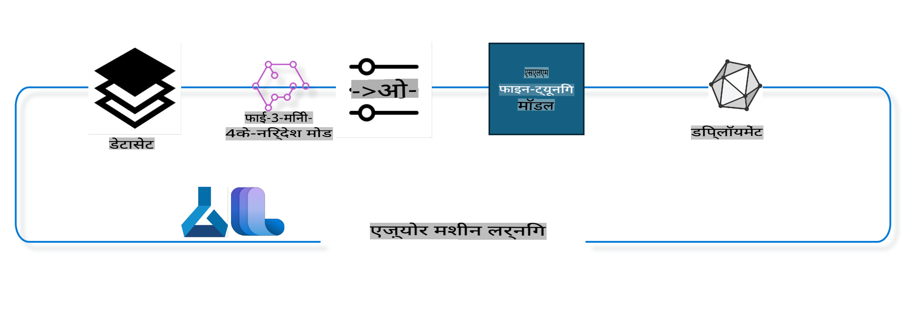

## Azure ML सिस्टम रजिस्ट्री से चैट-कम्प्लीशन कंपोनेंट्स का उपयोग करके मॉडल को फाइन-ट्यून कैसे करें

इस उदाहरण में, हम Phi-3-mini-4k-instruct मॉडल को दो व्यक्तियों के बीच बातचीत को पूरा करने के लिए ultrachat_200k डेटा सेट का उपयोग करके फाइन-ट्यून करेंगे।



यह उदाहरण आपको दिखाएगा कि Azure ML SDK और Python का उपयोग करके फाइन-ट्यूनिंग कैसे की जाए और फिर वास्तविक समय अनुमान के लिए फाइन-ट्यून किए गए मॉडल को एक ऑनलाइन एंडपॉइंट पर कैसे डिप्लॉय करें।

### प्रशिक्षण डेटा

हम ultrachat_200k डेटा सेट का उपयोग करेंगे। यह UltraChat डेटा सेट का एक भारी फिल्टर किया गया संस्करण है और Zephyr-7B-β, एक अत्याधुनिक 7b चैट मॉडल को प्रशिक्षित करने के लिए उपयोग किया गया था।

### मॉडल

हम Phi-3-mini-4k-instruct मॉडल का उपयोग करेंगे ताकि यह दिखाया जा सके कि उपयोगकर्ता चैट-कम्प्लीशन टास्क के लिए मॉडल को फाइन-ट्यून कैसे कर सकते हैं। यदि आपने यह नोटबुक किसी विशेष मॉडल कार्ड से खोली है, तो कृपया उस मॉडल के नाम को बदलें।

### कार्य

- फाइन-ट्यून करने के लिए एक मॉडल चुनें।
- प्रशिक्षण डेटा का चयन और अन्वेषण करें।
- फाइन-ट्यूनिंग जॉब को कॉन्फ़िगर करें।
- फाइन-ट्यूनिंग जॉब चलाएं।
- प्रशिक्षण और मूल्यांकन मेट्रिक्स की समीक्षा करें।
- फाइन-ट्यून किए गए मॉडल को रजिस्टर करें।
- वास्तविक समय अनुमान के लिए फाइन-ट्यून किए गए मॉडल को डिप्लॉय करें।
- संसाधनों को साफ करें।

## 1. प्री-रिक्विज़िट्स सेट करें

- डिपेंडेंसीज़ इंस्टॉल करें।
- AzureML वर्कस्पेस से कनेक्ट करें। SDK ऑथेंटिकेशन सेट अप के बारे में और जानें। नीचे <WORKSPACE_NAME>, <RESOURCE_GROUP>, और <SUBSCRIPTION_ID> को बदलें।
- AzureML सिस्टम रजिस्ट्री से कनेक्ट करें।
- एक वैकल्पिक प्रयोग नाम सेट करें।
- कंप्यूट की जांच करें या बनाएँ।

> [!NOTE]
> आवश्यकताएँ: एक सिंगल GPU नोड में कई GPU कार्ड हो सकते हैं। उदाहरण के लिए, Standard_NC24rs_v3 के एक नोड में 4 NVIDIA V100 GPUs होते हैं जबकि Standard_NC12s_v3 में 2 NVIDIA V100 GPUs होते हैं। इस जानकारी के लिए डॉक्स देखें। नोड प्रति GPU कार्ड की संख्या नीचे gpus_per_node पैरामीटर में सेट की जाती है। इस मान को सही ढंग से सेट करने से नोड के सभी GPUs का उपयोग सुनिश्चित होगा। अनुशंसित GPU कंप्यूट SKUs यहां और यहां मिल सकते हैं।

### Python लाइब्रेरीज़

नीचे दिए गए सेल को चलाकर डिपेंडेंसीज़ इंस्टॉल करें। यदि आप नए एनवायरनमेंट में काम कर रहे हैं तो यह कदम अनिवार्य है।

```bash
pip install azure-ai-ml
pip install azure-identity
pip install datasets==2.9.0
pip install mlflow
pip install azureml-mlflow
```

### Azure ML के साथ इंटरैक्ट करना

1. यह Python स्क्रिप्ट Azure Machine Learning (Azure ML) सेवा के साथ इंटरैक्ट करने के लिए उपयोग की जाती है। इसका विवरण इस प्रकार है:

    - यह azure.ai.ml, azure.identity, और azure.ai.ml.entities पैकेजों से आवश्यक मॉड्यूल इम्पोर्ट करता है। यह time मॉड्यूल भी इम्पोर्ट करता है।

    - यह DefaultAzureCredential() का उपयोग करके ऑथेंटिकेट करने की कोशिश करता है, जो Azure क्लाउड में एप्लिकेशन विकसित करने के लिए एक सरलीकृत ऑथेंटिकेशन अनुभव प्रदान करता है। यदि यह विफल रहता है, तो यह InteractiveBrowserCredential() पर वापस आता है, जो एक इंटरैक्टिव लॉगिन प्रॉम्प्ट प्रदान करता है।

    - यह from_config मेथड का उपयोग करके एक MLClient इंस्टेंस बनाने की कोशिश करता है, जो डिफ़ॉल्ट कॉन्फ़िग फाइल (config.json) से कॉन्फ़िगरेशन पढ़ता है। यदि यह विफल रहता है, तो यह मैन्युअल रूप से subscription_id, resource_group_name, और workspace_name प्रदान करके MLClient इंस्टेंस बनाता है।

    - यह "azureml" नामक Azure ML रजिस्ट्री के लिए एक और MLClient इंस्टेंस बनाता है। इस रजिस्ट्री में मॉडल, फाइन-ट्यूनिंग पाइपलाइन्स और एनवायरनमेंट्स स्टोर किए जाते हैं।

    - यह experiment_name को "chat_completion_Phi-3-mini-4k-instruct" सेट करता है।

    - यह एक यूनिक टाइमस्टैम्प जेनरेट करता है, जो वर्तमान समय (सेकंड में) को एक इंटीजर और फिर एक स्ट्रिंग में बदलता है। यह टाइमस्टैम्प यूनिक नाम और वर्ज़न बनाने के लिए उपयोग किया जा सकता है।

    ```python
    # Import necessary modules from Azure ML and Azure Identity
    from azure.ai.ml import MLClient
    from azure.identity import (
        DefaultAzureCredential,
        InteractiveBrowserCredential,
    )
    from azure.ai.ml.entities import AmlCompute
    import time  # Import time module
    
    # Try to authenticate using DefaultAzureCredential
    try:
        credential = DefaultAzureCredential()
        credential.get_token("https://management.azure.com/.default")
    except Exception as ex:  # If DefaultAzureCredential fails, use InteractiveBrowserCredential
        credential = InteractiveBrowserCredential()
    
    # Try to create an MLClient instance using the default config file
    try:
        workspace_ml_client = MLClient.from_config(credential=credential)
    except:  # If that fails, create an MLClient instance by manually providing the details
        workspace_ml_client = MLClient(
            credential,
            subscription_id="<SUBSCRIPTION_ID>",
            resource_group_name="<RESOURCE_GROUP>",
            workspace_name="<WORKSPACE_NAME>",
        )
    
    # Create another MLClient instance for the Azure ML registry named "azureml"
    # This registry is where models, fine-tuning pipelines, and environments are stored
    registry_ml_client = MLClient(credential, registry_name="azureml")
    
    # Set the experiment name
    experiment_name = "chat_completion_Phi-3-mini-4k-instruct"
    
    # Generate a unique timestamp that can be used for names and versions that need to be unique
    timestamp = str(int(time.time()))
    ```

## 2. फाइन-ट्यून करने के लिए एक फाउंडेशन मॉडल चुनें

1. Phi-3-mini-4k-instruct एक 3.8B पैरामीटर, हल्का, अत्याधुनिक ओपन मॉडल है, जो Phi-2 के लिए उपयोग किए गए डेटा सेट्स पर आधारित है। यह मॉडल Phi-3 मॉडल परिवार का हिस्सा है, और Mini संस्करण 4K और 128K के दो वेरिएंट्स में आता है, जो वह कॉन्टेक्स्ट लंबाई (टोकन्स में) है जिसे यह सपोर्ट कर सकता है। हमें इसे अपने विशिष्ट उद्देश्य के लिए फाइन-ट्यून करने की आवश्यकता है। आप AzureML स्टूडियो के मॉडल कैटलॉग में चैट-कम्प्लीशन टास्क द्वारा फ़िल्टर करके इन मॉडलों को ब्राउज़ कर सकते हैं। इस उदाहरण में, हम Phi-3-mini-4k-instruct मॉडल का उपयोग करते हैं। यदि आपने यह नोटबुक किसी अन्य मॉडल के लिए खोली है, तो मॉडल का नाम और वर्ज़न बदलें।

    > [!NOTE]
    > मॉडल का id प्रॉपर्टी। इसे फाइन-ट्यूनिंग जॉब के इनपुट के रूप में पास किया जाएगा। यह AzureML स्टूडियो मॉडल कैटलॉग में मॉडल विवरण पृष्ठ में Asset ID फ़ील्ड के रूप में भी उपलब्ध है।

2. यह Python स्क्रिप्ट Azure Machine Learning (Azure ML) सेवा के साथ इंटरैक्ट कर रही है। इसका विवरण इस प्रकार है:

    - यह model_name को "Phi-3-mini-4k-instruct" पर सेट करता है।

    - यह registry_ml_client ऑब्जेक्ट की models प्रॉपर्टी के get मेथड का उपयोग करके Azure ML रजिस्ट्री से निर्दिष्ट नाम वाले मॉडल के नवीनतम वर्ज़न को पुनः प्राप्त करता है। get मेथड को दो आर्गुमेंट्स के साथ कॉल किया जाता है: मॉडल का नाम और एक लेबल जो यह निर्दिष्ट करता है कि मॉडल का नवीनतम वर्ज़न पुनः प्राप्त किया जाना चाहिए।

    - यह एक संदेश प्रिंट करता है जिसमें यह संकेत दिया जाता है कि फाइन-ट्यूनिंग के लिए उपयोग किए जाने वाले मॉडल का नाम, वर्ज़न, और id क्या है। स्ट्रिंग के format मेथड का उपयोग नाम, वर्ज़न, और id को संदेश में डालने के लिए किया जाता है। मॉडल का नाम, वर्ज़न, और id foundation_model ऑब्जेक्ट की प्रॉपर्टीज़ के रूप में एक्सेस किए जाते हैं।

    ```python
    # Set the model name
    model_name = "Phi-3-mini-4k-instruct"
    
    # Get the latest version of the model from the Azure ML registry
    foundation_model = registry_ml_client.models.get(model_name, label="latest")
    
    # Print the model name, version, and id
    # This information is useful for tracking and debugging
    print(
        "\n\nUsing model name: {0}, version: {1}, id: {2} for fine tuning".format(
            foundation_model.name, foundation_model.version, foundation_model.id
        )
    )
    ```

## 3. जॉब के साथ उपयोग करने के लिए एक कंप्यूट बनाएं

फाइन-ट्यूनिंग जॉब केवल GPU कंप्यूट के साथ काम करता है। कंप्यूट का आकार इस बात पर निर्भर करता है कि मॉडल कितना बड़ा है, और अधिकांश मामलों में सही कंप्यूट का चयन करना जटिल हो सकता है। इस सेल में, हम उपयोगकर्ता को जॉब के लिए सही कंप्यूट चुनने का मार्गदर्शन करते हैं।

> [!NOTE]
> नीचे सूचीबद्ध कंप्यूट्स सबसे अनुकूलित कॉन्फ़िगरेशन के साथ काम करते हैं। कॉन्फ़िगरेशन में कोई भी बदलाव Cuda Out Of Memory त्रुटि का कारण बन सकता है। ऐसे मामलों में, बड़े कंप्यूट आकार में अपग्रेड करने का प्रयास करें।

> [!NOTE]
> नीचे compute_cluster_size का चयन करते समय, सुनिश्चित करें कि कंप्यूट आपके रिसोर्स ग्रुप में उपलब्ध है। यदि कोई विशेष कंप्यूट उपलब्ध नहीं है, तो आप कंप्यूट रिसोर्सेज़ तक पहुंच प्राप्त करने का अनुरोध कर सकते हैं।

### फाइन-ट्यूनिंग समर्थन के लिए मॉडल की जांच

1. यह Python स्क्रिप्ट Azure Machine Learning (Azure ML) मॉडल के साथ इंटरैक्ट कर रही है। इसका विवरण इस प्रकार है:

    - यह ast मॉड्यूल को इम्पोर्ट करती है, जो Python के abstract syntax grammar के ट्रीज़ को प्रोसेस करने के लिए फ़ंक्शंस प्रदान करता है।

    - यह जांचती है कि foundation_model ऑब्जेक्ट (जो Azure ML में एक मॉडल का प्रतिनिधित्व करता है) में finetune_compute_allow_list नामक एक टैग है या नहीं। Azure ML में टैग्स key-value पेयर्स होते हैं जिन्हें आप मॉडल्स को फ़िल्टर और सॉर्ट करने के लिए बना सकते हैं और उपयोग कर सकते हैं।

    - यदि finetune_compute_allow_list टैग मौजूद है, तो यह ast.literal_eval फ़ंक्शन का उपयोग करके टैग के मान (एक स्ट्रिंग) को सुरक्षित रूप से एक Python सूची में पार्स करती है। यह सूची computes_allow_list वेरिएबल को असाइन की जाती है। फिर यह एक संदेश प्रिंट करती है जो यह संकेत देता है कि सूची में से एक कंप्यूट बनाया जाना चाहिए।

    - यदि finetune_compute_allow_list टैग मौजूद नहीं है, तो यह computes_allow_list को None पर सेट करती है और एक संदेश प्रिंट करती है जो यह संकेत देता है कि finetune_compute_allow_list टैग मॉडल के टैग्स का हिस्सा नहीं है।

    - संक्षेप में, यह स्क्रिप्ट मॉडल के मेटाडेटा में एक विशिष्ट टैग की जांच कर रही है, टैग के मान को एक सूची में परिवर्तित कर रही है यदि यह मौजूद है, और उपयोगकर्ता को तदनुसार प्रतिक्रिया प्रदान कर रही है।

    ```python
    # Import the ast module, which provides functions to process trees of the Python abstract syntax grammar
    import ast
    
    # Check if the 'finetune_compute_allow_list' tag is present in the model's tags
    if "finetune_compute_allow_list" in foundation_model.tags:
        # If the tag is present, use ast.literal_eval to safely parse the tag's value (a string) into a Python list
        computes_allow_list = ast.literal_eval(
            foundation_model.tags["finetune_compute_allow_list"]
        )  # convert string to python list
        # Print a message indicating that a compute should be created from the list
        print(f"Please create a compute from the above list - {computes_allow_list}")
    else:
        # If the tag is not present, set computes_allow_list to None
        computes_allow_list = None
        # Print a message indicating that the 'finetune_compute_allow_list' tag is not part of the model's tags
        print("`finetune_compute_allow_list` is not part of model tags")
    ```

### कंप्यूट इंस्टेंस की जांच

1. यह Python स्क्रिप्ट Azure Machine Learning (Azure ML) सेवा के साथ इंटरैक्ट कर रही है और एक कंप्यूट इंस्टेंस पर कई चेक्स कर रही है। इसका विवरण इस प्रकार है:

    - यह Azure ML वर्कस्पेस से compute_cluster में संग्रहीत नाम के साथ कंप्यूट इंस्टेंस पुनः प्राप्त करने का प्रयास करती है। यदि कंप्यूट इंस्टेंस की provisioning state "failed" है, तो यह एक ValueError उठाती है।

    - यह जांचती है कि computes_allow_list None नहीं है। यदि यह None नहीं है, तो यह सूची में सभी कंप्यूट आकारों को लोअरकेस में परिवर्तित करती है और जांचती है कि वर्तमान कंप्यूट इंस्टेंस का आकार सूची में है या नहीं। यदि यह नहीं है, तो यह ValueError उठाती है।

    - यदि computes_allow_list None है, तो यह जांचती है कि कंप्यूट इंस्टेंस का आकार असमर्थित GPU VM आकारों की सूची में है या नहीं। यदि ऐसा है, तो यह ValueError उठाती है।

    - यह वर्कस्पेस में सभी उपलब्ध कंप्यूट आकारों की सूची पुनः प्राप्त करती है। फिर यह इस सूची के माध्यम से पुनरावृत्ति करती है, और प्रत्येक कंप्यूट आकार के लिए, यह जांचती है कि उसका नाम वर्तमान कंप्यूट इंस्टेंस के आकार से मेल खाता है या नहीं। यदि ऐसा है, तो यह उस कंप्यूट आकार के लिए GPU की संख्या पुनः प्राप्त करती है और gpu_count_found को True पर सेट करती है।

    - यदि gpu_count_found True है, तो यह कंप्यूट इंस्टेंस में GPU की संख्या प्रिंट करती है। यदि gpu_count_found False है, तो यह ValueError उठाती है।

    - संक्षेप में, यह स्क्रिप्ट Azure ML वर्कस्पेस में एक कंप्यूट इंस्टेंस पर कई चेक्स कर रही है, जिसमें इसकी provisioning state, allow list या deny list के विरुद्ध इसका आकार, और इसमें GPU की संख्या शामिल है।

    ```python
    # Print the exception message
    print(e)
    # Raise a ValueError if the compute size is not available in the workspace
    raise ValueError(
        f"WARNING! Compute size {compute_cluster_size} not available in workspace"
    )
    
    # Retrieve the compute instance from the Azure ML workspace
    compute = workspace_ml_client.compute.get(compute_cluster)
    # Check if the provisioning state of the compute instance is "failed"
    if compute.provisioning_state.lower() == "failed":
        # Raise a ValueError if the provisioning state is "failed"
        raise ValueError(
            f"Provisioning failed, Compute '{compute_cluster}' is in failed state. "
            f"please try creating a different compute"
        )
    
    # Check if computes_allow_list is not None
    if computes_allow_list is not None:
        # Convert all compute sizes in computes_allow_list to lowercase
        computes_allow_list_lower_case = [x.lower() for x in computes_allow_list]
        # Check if the size of the compute instance is in computes_allow_list_lower_case
        if compute.size.lower() not in computes_allow_list_lower_case:
            # Raise a ValueError if the size of the compute instance is not in computes_allow_list_lower_case
            raise ValueError(
                f"VM size {compute.size} is not in the allow-listed computes for finetuning"
            )
    else:
        # Define a list of unsupported GPU VM sizes
        unsupported_gpu_vm_list = [
            "standard_nc6",
            "standard_nc12",
            "standard_nc24",
            "standard_nc24r",
        ]
        # Check if the size of the compute instance is in unsupported_gpu_vm_list
        if compute.size.lower() in unsupported_gpu_vm_list:
            # Raise a ValueError if the size of the compute instance is in unsupported_gpu_vm_list
            raise ValueError(
                f"VM size {compute.size} is currently not supported for finetuning"
            )
    
    # Initialize a flag to check if the number of GPUs in the compute instance has been found
    gpu_count_found = False
    # Retrieve a list of all available compute sizes in the workspace
    workspace_compute_sku_list = workspace_ml_client.compute.list_sizes()
    available_sku_sizes = []
    # Iterate over the list of available compute sizes
    for compute_sku in workspace_compute_sku_list:
        available_sku_sizes.append(compute_sku.name)
        # Check if the name of the compute size matches the size of the compute instance
        if compute_sku.name.lower() == compute.size.lower():
            # If it does, retrieve the number of GPUs for that compute size and set gpu_count_found to True
            gpus_per_node = compute_sku.gpus
            gpu_count_found = True
    # If gpu_count_found is True, print the number of GPUs in the compute instance
    if gpu_count_found:
        print(f"Number of GPU's in compute {compute.size}: {gpus_per_node}")
    else:
        # If gpu_count_found is False, raise a ValueError
        raise ValueError(
            f"Number of GPU's in compute {compute.size} not found. Available skus are: {available_sku_sizes}."
            f"This should not happen. Please check the selected compute cluster: {compute_cluster} and try again."
        )
    ```

## 4. फाइन-ट्यूनिंग के लिए डेटा सेट चुनें

1. हम ultrachat_200k डेटा सेट का उपयोग करते हैं। डेटा सेट में चार विभाजन हैं, जो Supervised फाइन-ट्यूनिंग (sft) और Generation रैंकिंग (gen) के लिए उपयुक्त हैं। विभाजन के प्रति उदाहरण की संख्या निम्नानुसार है:

    ```bash
    train_sft test_sft  train_gen  test_gen
    207865  23110  256032  28304
    ```

1. निम्नलिखित सेल फाइन-ट्यूनिंग के लिए बुनियादी डेटा तैयारी दिखाते हैं:

### कुछ डेटा पंक्तियों को विज़ुअलाइज़ करें

हम चाहते हैं कि यह सैंपल जल्दी चले, इसलिए train_sft और test_sft फाइलें सेव करें जिनमें पहले से छँटी हुई पंक्तियों का 5% हो। इसका मतलब है कि फाइन-ट्यून किया गया मॉडल कम सटीकता वाला होगा, इसलिए इसे वास्तविक दुनिया में उपयोग के लिए नहीं रखा जाना चाहिए। download-dataset.py स्क्रिप्ट का उपयोग ultrachat_200k डेटा सेट डाउनलोड करने और डेटा सेट को फाइन-ट्यून पाइपलाइन कंपोनेंट उपभोग योग्य स्वरूप में बदलने के लिए किया जाता है। चूंकि डेटा सेट बड़ा है, इसलिए यहाँ केवल डेटा सेट का एक हिस्सा है।

1. नीचे दी गई स्क्रिप्ट चलाने से केवल डेटा का 5% डाउनलोड होता है। इसे dataset_split_pc पैरामीटर को इच्छित प्रतिशत में बदलकर बढ़ाया जा सकता है।

    > [!NOTE]
    > कुछ भाषा मॉडल्स में विभिन्न भाषा कोड होते हैं और इसलिए डेटा सेट में कॉलम नाम उसी के अनुसार होने चाहिए।

1. यहाँ एक उदाहरण है कि डेटा कैसा दिखना चाहिए:
चैट-कम्प्लीशन डेटा सेट पार्केट फॉर्मेट में संग्रहीत है, जिसमें प्रत्येक प्रविष्टि निम्नलिखित स्कीमा का उपयोग करती है:

    - यह एक JSON (JavaScript Object Notation) दस्तावेज़ है, जो डेटा विनिमय के लिए एक लोकप्रिय प्रारूप है। यह निष्पादन योग्य कोड नहीं है, बल्कि डेटा को संग्रहीत और परिवहन करने का एक तरीका है। इसकी संरचना का विवरण इस प्रकार है:

    - "prompt": यह कुंजी एक स्ट्रिंग मान रखती है जो एक एआई सहायक के लिए एक कार्य या प्रश्न का प्रतिनिधित्व करती है।

    - "messages": यह कुंजी ऑब्जेक्ट्स की एक श्रृंखला रखती है। प्रत्येक ऑब्जेक्ट एक उपयोगकर्ता और एआई सहायक के बीच एक बातचीत में एक संदेश का प्रतिनिधित्व करता है। प्रत्येक संदेश ऑब्जेक्ट में दो कुंजियाँ होती हैं:

    - "content": यह कुंजी एक स्ट्रिंग मान रखती है जो संदेश की सामग्री का प्रतिनिधित्व करती है।
    - "role": यह कुंजी एक स्ट्रिंग मान रखती है जो संदेश भेजने वाले इकाई की भूमिका का प्रतिनिधित्व करती है। यह "user" या "assistant" हो सकती है।
    - "prompt_id": यह कुंजी एक अद्वितीय पहचानकर्ता के लिए एक स्ट्रिंग मान रखती है।

1. इस विशिष्ट JSON दस्तावेज़ में, एक बातचीत को दर्शाया गया है जहाँ एक उपयोगकर्ता एक एआई सहायक से एक डिस्टोपियन कहानी के लिए एक नायक बनाने के लिए कहता है। सहायक जवाब देता है, और फिर उपयोगकर्ता अधिक विवरण मांगता है। सहायक अधिक विवरण प्रदान करने के लिए सहमत होता है। पूरी बातचीत एक विशिष्ट prompt id से जुड़ी होती है।

    ```python
    {
        // The task or question posed to an AI assistant
        "prompt": "Create a fully-developed protagonist who is challenged to survive within a dystopian society under the rule of a tyrant. ...",
        
        // An array of objects, each representing a message in a conversation between a user and an AI assistant
        "messages":[
            {
                // The content of the user's message
                "content": "Create a fully-developed protagonist who is challenged to survive within a dystopian society under the rule of a tyrant. ...",
                // The role of the entity that sent the message
                "role": "user"
            },
            {
                // The content of the assistant's message
                "content": "Name: Ava\n\n Ava was just 16 years old when the world as she knew it came crashing down. The government had collapsed, leaving behind a chaotic and lawless society. ...",
                // The role of the entity that sent the message
                "role": "assistant"
            },
            {
                // The content of the user's message
                "content": "Wow, Ava's story is so intense and inspiring! Can you provide me with more details.  ...",
                // The role of the entity that sent the message
                "role": "user"
            }, 
            {
                // The content of the assistant's message
                "content": "Certainly! ....",
                // The role of the entity that sent the message
                "role": "assistant"
            }
        ],
        
        // A unique identifier for the prompt
        "prompt_id": "d938b65dfe31f05f80eb8572964c6673eddbd68eff3db6bd234d7f1e3b86c2af"
    }
    ```

### डेटा डाउनलोड करें

1. यह Python स्क्रिप्ट एक सहायक स्क्रिप्ट download-dataset.py का उपयोग करके डेटा सेट डाउनलोड करने के लिए उपयोग की जाती है। इसका विवरण इस प्रकार है:

    - यह os मॉड्यूल को इम्पोर्ट करती है, जो ऑपरेटिंग सिस्टम-निर्भर कार्यक्षमता का पोर्टेबल उपयोग प्रदान करता है।

    - यह os.system फ़ंक्शन का उपयोग करके शेल में download-dataset.py स्क्रिप्ट को विशिष्ट कमांड-लाइन आर्गुमेंट्स के साथ चलाती है। आर्गुमेंट्स यह निर्दिष्ट करते हैं कि कौन सा डेटा सेट डाउनलोड करना है (HuggingFaceH4/ultrachat_200k), इसे किस डायरेक्टरी में डाउनलोड करना है (ultrachat_200k_dataset), और डेटा सेट को विभाजित करने का प्रतिशत (5)। os.system फ़ंक्शन उस कमांड की एग्ज़िट स्थिति लौटाता है जिसे उसने निष्पादित किया; यह स्थिति exit_status वेरिएबल में संग्रहीत होती है।

    - यह जांचती है कि exit_status 0 नहीं है। यूनिक्स जैसे ऑपरेटिंग सिस्टम में, 0 की एग्ज़िट स्थिति आमतौर पर यह संकेत देती है कि एक कमांड सफल रहा है, जबकि कोई भी अन्य संख्या एक त्रुटि का संकेत देती है। यदि exit_status 0 नहीं है, तो यह एक Exception उठाती है जिसमें यह संकेत दिया जाता है कि डेटा सेट डाउनलोड करने में त्रुटि हुई है।

    - संक्षेप में, यह स्क्रिप्ट एक सहायक स्क्रिप्ट का उपयोग करके डेटा सेट डाउनलोड करने के लिए एक कमांड चला रही है, और यदि कमांड विफल रहता है तो एक अपवाद उठाती है।

    ```python
    # Import the os module, which provides a way of using operating system dependent functionality
    import os
    
    # Use the os.system function to run the download-dataset.py script in the shell with specific command-line arguments
    # The arguments specify the dataset to download (HuggingFaceH4/ultrachat_200k), the directory to download it to (ultrachat_200k_dataset), and the percentage of the dataset to split (5)
    # The os.system function returns the exit status of the command it executed; this status is stored in the exit_status variable
    exit_status = os.system(
        "python ./download-dataset.py --dataset HuggingFaceH4/ultrachat_200k --download_dir ultrachat_200k_dataset --dataset_split_pc 5"
    )
    
    # Check if exit_status is not 0
    # In Unix-like operating systems, an exit status of 0 usually indicates that a command has succeeded, while any other number indicates an error
    # If exit_status is not 0, raise an Exception with a message indicating that there was an error downloading the dataset
    if exit_status != 0:
        raise Exception("Error downloading dataset")
    ```

### डेटा को एक DataFrame में लोड करना

1. यह Python स्क्रिप्ट एक JSON Lines फ़ाइल को pandas DataFrame में लोड कर रही है और पहले 5 पंक्तियाँ प्रदर्शित कर रही है। इसका विवरण इस प्रकार है:

    - यह pandas लाइब्रेरी को इम्पोर्ट करती है, जो डेटा हेरफेर और विश्लेषण के लिए एक शक्तिशाली लाइब्रेरी है।

    - यह pandas के डिस्प्ले विकल्पों के लिए अधिकतम कॉलम चौड़ाई को 0 पर सेट करती है। इसका मतलब है कि DataFrame को प्रिंट करते समय प्रत्येक कॉलम के पूरे टेक्स्ट को बिना काटे प्रदर्शित किया जाएगा।

    - यह pd.read_json फ़ंक्शन का उपयोग करके ultrachat_200k_dataset डायरेक्टरी से train_sft.jsonl फ़ाइल को DataFrame में लोड करती है। lines=True आर्गुमेंट यह संकेत देता है कि फ़ाइल JSON Lines प्रारूप में है, जहाँ प्रत्येक पंक्ति
### प्रशिक्षण पाइपलाइन

विभिन्न पैरामीटर के आधार पर एक प्रशिक्षण पाइपलाइन सेटअप करना और फिर उसका डिस्प्ले नाम प्रिंट करना।  
```python
    # Define a function to generate a display name for the training pipeline
    def get_pipeline_display_name():
        # Calculate the total batch size by multiplying the per-device batch size, the number of gradient accumulation steps, the number of GPUs per node, and the number of nodes used for fine-tuning
        batch_size = (
            int(finetune_parameters.get("per_device_train_batch_size", 1))
            * int(finetune_parameters.get("gradient_accumulation_steps", 1))
            * int(gpus_per_node)
            * int(finetune_parameters.get("num_nodes_finetune", 1))
        )
        # Retrieve the learning rate scheduler type
        scheduler = finetune_parameters.get("lr_scheduler_type", "linear")
        # Retrieve whether DeepSpeed is applied
        deepspeed = finetune_parameters.get("apply_deepspeed", "false")
        # Retrieve the DeepSpeed stage
        ds_stage = finetune_parameters.get("deepspeed_stage", "2")
        # If DeepSpeed is applied, include "ds" followed by the DeepSpeed stage in the display name; if not, include "nods"
        if deepspeed == "true":
            ds_string = f"ds{ds_stage}"
        else:
            ds_string = "nods"
        # Retrieve whether Layer-wise Relevance Propagation (LoRa) is applied
        lora = finetune_parameters.get("apply_lora", "false")
        # If LoRa is applied, include "lora" in the display name; if not, include "nolora"
        if lora == "true":
            lora_string = "lora"
        else:
            lora_string = "nolora"
        # Retrieve the limit on the number of model checkpoints to keep
        save_limit = finetune_parameters.get("save_total_limit", -1)
        # Retrieve the maximum sequence length
        seq_len = finetune_parameters.get("max_seq_length", -1)
        # Construct the display name by concatenating all these parameters, separated by hyphens
        return (
            model_name
            + "-"
            + "ultrachat"
            + "-"
            + f"bs{batch_size}"
            + "-"
            + f"{scheduler}"
            + "-"
            + ds_string
            + "-"
            + lora_string
            + f"-save_limit{save_limit}"
            + f"-seqlen{seq_len}"
        )
    
    # Call the function to generate the display name
    pipeline_display_name = get_pipeline_display_name()
    # Print the display name
    print(f"Display name used for the run: {pipeline_display_name}")
    ```  

### पाइपलाइन को कॉन्फ़िगर करना

यह Python स्क्रिप्ट Azure Machine Learning SDK का उपयोग करके एक मशीन लर्निंग पाइपलाइन को परिभाषित और कॉन्फ़िगर कर रही है। इसका विवरण इस प्रकार है:  
1. यह Azure AI ML SDK से आवश्यक मॉड्यूल आयात करता है।  
2. यह "chat_completion_pipeline" नामक एक पाइपलाइन कंपोनेंट को रजिस्ट्री से प्राप्त करता है।  
3. यह `@pipeline` decorator and the function `create_pipeline`. The name of the pipeline is set to `pipeline_display_name`.

1. Inside the `create_pipeline` function, it initializes the fetched pipeline component with various parameters, including the model path, compute clusters for different stages, dataset splits for training and testing, the number of GPUs to use for fine-tuning, and other fine-tuning parameters.

1. It maps the output of the fine-tuning job to the output of the pipeline job. This is done so that the fine-tuned model can be easily registered, which is required to deploy the model to an online or batch endpoint.

1. It creates an instance of the pipeline by calling the `create_pipeline` function.

1. It sets the `force_rerun` setting of the pipeline to `True`, meaning that cached results from previous jobs will not be used.

1. It sets the `continue_on_step_failure` setting of the pipeline to `False` का उपयोग करके एक पाइपलाइन जॉब को परिभाषित करता है, जिसका मतलब है कि यदि कोई स्टेप फेल होता है, तो पाइपलाइन रुक जाएगी।  
4. संक्षेप में, यह स्क्रिप्ट Azure Machine Learning SDK का उपयोग करके एक चैट कंप्लीशन टास्क के लिए एक मशीन लर्निंग पाइपलाइन को परिभाषित और कॉन्फ़िगर कर रही है।  

```python
    # Import necessary modules from the Azure AI ML SDK
    from azure.ai.ml.dsl import pipeline
    from azure.ai.ml import Input
    
    # Fetch the pipeline component named "chat_completion_pipeline" from the registry
    pipeline_component_func = registry_ml_client.components.get(
        name="chat_completion_pipeline", label="latest"
    )
    
    # Define the pipeline job using the @pipeline decorator and the function create_pipeline
    # The name of the pipeline is set to pipeline_display_name
    @pipeline(name=pipeline_display_name)
    def create_pipeline():
        # Initialize the fetched pipeline component with various parameters
        # These include the model path, compute clusters for different stages, dataset splits for training and testing, the number of GPUs to use for fine-tuning, and other fine-tuning parameters
        chat_completion_pipeline = pipeline_component_func(
            mlflow_model_path=foundation_model.id,
            compute_model_import=compute_cluster,
            compute_preprocess=compute_cluster,
            compute_finetune=compute_cluster,
            compute_model_evaluation=compute_cluster,
            # Map the dataset splits to parameters
            train_file_path=Input(
                type="uri_file", path="./ultrachat_200k_dataset/train_sft.jsonl"
            ),
            test_file_path=Input(
                type="uri_file", path="./ultrachat_200k_dataset/test_sft.jsonl"
            ),
            # Training settings
            number_of_gpu_to_use_finetuning=gpus_per_node,  # Set to the number of GPUs available in the compute
            **finetune_parameters
        )
        return {
            # Map the output of the fine tuning job to the output of pipeline job
            # This is done so that we can easily register the fine tuned model
            # Registering the model is required to deploy the model to an online or batch endpoint
            "trained_model": chat_completion_pipeline.outputs.mlflow_model_folder
        }
    
    # Create an instance of the pipeline by calling the create_pipeline function
    pipeline_object = create_pipeline()
    
    # Don't use cached results from previous jobs
    pipeline_object.settings.force_rerun = True
    
    # Set continue on step failure to False
    # This means that the pipeline will stop if any step fails
    pipeline_object.settings.continue_on_step_failure = False
    ```  

### जॉब सबमिट करना

1. यह Python स्क्रिप्ट Azure Machine Learning वर्कस्पेस में एक मशीन लर्निंग पाइपलाइन जॉब सबमिट कर रही है और फिर उसके पूरा होने का इंतजार कर रही है। इसका विवरण इस प्रकार है:  
   - यह `create_or_update` मेथड का उपयोग करके वर्कस्पेस में पाइपलाइन जॉब सबमिट करता है। पाइपलाइन को `pipeline_object` द्वारा और जॉब को `experiment_name` के तहत चलाया जाता है।  
   - इसके बाद यह `stream` मेथड का उपयोग करके पाइपलाइन जॉब पूरा होने का इंतजार करता है। जॉब का नाम `pipeline_job` ऑब्जेक्ट के `name` एट्रिब्यूट द्वारा निर्दिष्ट किया गया है।  
   - संक्षेप में, यह स्क्रिप्ट Azure Machine Learning वर्कस्पेस में एक मशीन लर्निंग पाइपलाइन जॉब सबमिट कर रही है और उसके पूरा होने का इंतजार कर रही है।  

```python
    # Submit the pipeline job to the Azure Machine Learning workspace
    # The pipeline to be run is specified by pipeline_object
    # The experiment under which the job is run is specified by experiment_name
    pipeline_job = workspace_ml_client.jobs.create_or_update(
        pipeline_object, experiment_name=experiment_name
    )
    
    # Wait for the pipeline job to complete
    # The job to wait for is specified by the name attribute of the pipeline_job object
    workspace_ml_client.jobs.stream(pipeline_job.name)
    ```  

## 6. फाइन-ट्यून किए गए मॉडल को वर्कस्पेस में रजिस्टर करना

हम फाइन-ट्यूनिंग जॉब के आउटपुट से मॉडल को रजिस्टर करेंगे। यह फाइन-ट्यून किए गए मॉडल और फाइन-ट्यूनिंग जॉब के बीच लीनिएज को ट्रैक करेगा। फाइन-ट्यूनिंग जॉब आगे फाउंडेशन मॉडल, डेटा और ट्रेनिंग कोड के साथ लीनिएज को ट्रैक करता है।  

### ML मॉडल को रजिस्टर करना

1. यह Python स्क्रिप्ट Azure Machine Learning पाइपलाइन में प्रशिक्षित एक मशीन लर्निंग मॉडल को रजिस्टर कर रही है। इसका विवरण इस प्रकार है:  
   - यह Azure AI ML SDK से आवश्यक मॉड्यूल आयात करता है।  
   - यह `workspace_ml_client` में `jobs` ऑब्जेक्ट का उपयोग करके पाइपलाइन जॉब के आउटपुट `trained_model` की उपलब्धता की जांच करता है।  
   - यह पाइपलाइन जॉब के नाम और आउटपुट ("trained_model") के साथ एक पथ बनाता है।  
   - यह मूल मॉडल के नाम में "-ultrachat-200k" जोड़कर और किसी भी स्लैश को हाइफ़न से बदलकर फाइन-ट्यून किए गए मॉडल के लिए एक नाम परिभाषित करता है।  
   - यह मॉडल को रजिस्टर करने के लिए एक `Model` ऑब्जेक्ट तैयार करता है जिसमें मॉडल का पथ, प्रकार (MLflow मॉडल), नाम, संस्करण और विवरण जैसे विभिन्न पैरामीटर शामिल होते हैं।  
   - यह `workspace_ml_client` के `models` ऑब्जेक्ट में `create_or_update` मेथड का उपयोग करके मॉडल को रजिस्टर करता है।  
   - यह रजिस्टर किए गए मॉडल को प्रिंट करता है।  
   - संक्षेप में, यह स्क्रिप्ट Azure Machine Learning पाइपलाइन में प्रशिक्षित एक मशीन लर्निंग मॉडल को रजिस्टर कर रही है।  

```python
    # Import necessary modules from the Azure AI ML SDK
    from azure.ai.ml.entities import Model
    from azure.ai.ml.constants import AssetTypes
    
    # Check if the `trained_model` output is available from the pipeline job
    print("pipeline job outputs: ", workspace_ml_client.jobs.get(pipeline_job.name).outputs)
    
    # Construct a path to the trained model by formatting a string with the name of the pipeline job and the name of the output ("trained_model")
    model_path_from_job = "azureml://jobs/{0}/outputs/{1}".format(
        pipeline_job.name, "trained_model"
    )
    
    # Define a name for the fine-tuned model by appending "-ultrachat-200k" to the original model name and replacing any slashes with hyphens
    finetuned_model_name = model_name + "-ultrachat-200k"
    finetuned_model_name = finetuned_model_name.replace("/", "-")
    
    print("path to register model: ", model_path_from_job)
    
    # Prepare to register the model by creating a Model object with various parameters
    # These include the path to the model, the type of the model (MLflow model), the name and version of the model, and a description of the model
    prepare_to_register_model = Model(
        path=model_path_from_job,
        type=AssetTypes.MLFLOW_MODEL,
        name=finetuned_model_name,
        version=timestamp,  # Use timestamp as version to avoid version conflict
        description=model_name + " fine tuned model for ultrachat 200k chat-completion",
    )
    
    print("prepare to register model: \n", prepare_to_register_model)
    
    # Register the model by calling the create_or_update method of the models object in the workspace_ml_client with the Model object as the argument
    registered_model = workspace_ml_client.models.create_or_update(
        prepare_to_register_model
    )
    
    # Print the registered model
    print("registered model: \n", registered_model)
    ```  

## 7. फाइन-ट्यून किए गए मॉडल को ऑनलाइन एंडपॉइंट पर डिप्लॉय करना

ऑनलाइन एंडपॉइंट एक स्थायी REST API प्रदान करते हैं, जिसे उन एप्लिकेशन में इंटीग्रेट किया जा सकता है जिन्हें मॉडल का उपयोग करना है।  

### एंडपॉइंट को प्रबंधित करना

1. यह Python स्क्रिप्ट Azure Machine Learning में एक रजिस्टर किए गए मॉडल के लिए एक प्रबंधित ऑनलाइन एंडपॉइंट बना रही है। इसका विवरण इस प्रकार है:  
   - यह Azure AI ML SDK से आवश्यक मॉड्यूल आयात करता है।  
   - यह "ultrachat-completion-" स्ट्रिंग में एक टाइमस्टैम्प जोड़कर ऑनलाइन एंडपॉइंट के लिए एक यूनिक नाम परिभाषित करता है।  
   - यह एंडपॉइंट को बनाने के लिए `ManagedOnlineEndpoint` ऑब्जेक्ट तैयार करता है जिसमें एंडपॉइंट का नाम, विवरण और ऑथेंटिकेशन मोड ("key") जैसे विभिन्न पैरामीटर शामिल होते हैं।  
   - यह `workspace_ml_client` के `begin_create_or_update` मेथड का उपयोग करके ऑनलाइन एंडपॉइंट बनाता है। इसके बाद यह `wait` मेथड का उपयोग करके निर्माण प्रक्रिया के पूरा होने का इंतजार करता है।  
   - संक्षेप में, यह स्क्रिप्ट Azure Machine Learning में एक रजिस्टर किए गए मॉडल के लिए एक प्रबंधित ऑनलाइन एंडपॉइंट बना रही है।  

```python
    # Import necessary modules from the Azure AI ML SDK
    from azure.ai.ml.entities import (
        ManagedOnlineEndpoint,
        ManagedOnlineDeployment,
        ProbeSettings,
        OnlineRequestSettings,
    )
    
    # Define a unique name for the online endpoint by appending a timestamp to the string "ultrachat-completion-"
    online_endpoint_name = "ultrachat-completion-" + timestamp
    
    # Prepare to create the online endpoint by creating a ManagedOnlineEndpoint object with various parameters
    # These include the name of the endpoint, a description of the endpoint, and the authentication mode ("key")
    endpoint = ManagedOnlineEndpoint(
        name=online_endpoint_name,
        description="Online endpoint for "
        + registered_model.name
        + ", fine tuned model for ultrachat-200k-chat-completion",
        auth_mode="key",
    )
    
    # Create the online endpoint by calling the begin_create_or_update method of the workspace_ml_client with the ManagedOnlineEndpoint object as the argument
    # Then wait for the creation operation to complete by calling the wait method
    workspace_ml_client.begin_create_or_update(endpoint).wait()
    ```  

> [!NOTE]  
> यहां आप डिप्लॉयमेंट के लिए समर्थित SKU की सूची पा सकते हैं - [Managed online endpoints SKU list](https://learn.microsoft.com/azure/machine-learning/reference-managed-online-endpoints-vm-sku-list)  

### ML मॉडल को डिप्लॉय करना

1. यह Python स्क्रिप्ट Azure Machine Learning में एक प्रबंधित ऑनलाइन एंडपॉइंट पर एक रजिस्टर किए गए मशीन लर्निंग मॉडल को डिप्लॉय कर रही है। इसका विवरण इस प्रकार है:  
   - यह `ast` मॉड्यूल आयात करता है, जो Python के एब्सट्रैक्ट सिंटैक्स ट्री को प्रोसेस करने के लिए फंक्शन्स प्रदान करता है।  
   - यह डिप्लॉयमेंट के लिए इंस्टेंस टाइप को "Standard_NC6s_v3" पर सेट करता है।  
   - यह जांचता है कि `inference_compute_allow_list` टैग फाउंडेशन मॉडल में मौजूद है या नहीं। यदि यह मौजूद है, तो यह टैग वैल्यू को एक स्ट्रिंग से Python लिस्ट में बदलता है।  
   - यह जांचता है कि निर्दिष्ट इंस्टेंस टाइप अलाउ लिस्ट में है या नहीं। यदि नहीं, तो यह उपयोगकर्ता को अलाउ लिस्ट से एक इंस्टेंस टाइप चुनने का संदेश प्रिंट करता है।  
   - यह डिप्लॉयमेंट बनाने के लिए `ManagedOnlineDeployment` ऑब्जेक्ट तैयार करता है, जिसमें डिप्लॉयमेंट का नाम, एंडपॉइंट का नाम, मॉडल का ID, इंस्टेंस टाइप और काउंट, लिवनेस प्रॉब सेटिंग्स और रिक्वेस्ट सेटिंग्स जैसे पैरामीटर शामिल होते हैं।  
   - यह `workspace_ml_client` के `begin_create_or_update` मेथड का उपयोग करके डिप्लॉयमेंट बनाता है और इसके पूरा होने का इंतजार करता है।  
   - यह एंडपॉइंट के ट्रैफिक को "demo" डिप्लॉयमेंट पर 100% डायरेक्ट करता है।  
   - यह `workspace_ml_client` के `begin_create_or_update` मेथड का उपयोग करके एंडपॉइंट को अपडेट करता है और इसके पूरा होने का इंतजार करता है।  
   - संक्षेप में, यह स्क्रिप्ट Azure Machine Learning में एक प्रबंधित ऑनलाइन एंडपॉइंट पर एक रजिस्टर किए गए मशीन लर्निंग मॉडल को डिप्लॉय कर रही है।  

```python
    # Import the ast module, which provides functions to process trees of the Python abstract syntax grammar
    import ast
    
    # Set the instance type for the deployment
    instance_type = "Standard_NC6s_v3"
    
    # Check if the `inference_compute_allow_list` tag is present in the foundation model
    if "inference_compute_allow_list" in foundation_model.tags:
        # If it is, convert the tag value from a string to a Python list and assign it to `inference_computes_allow_list`
        inference_computes_allow_list = ast.literal_eval(
            foundation_model.tags["inference_compute_allow_list"]
        )
        print(f"Please create a compute from the above list - {computes_allow_list}")
    else:
        # If it's not, set `inference_computes_allow_list` to `None`
        inference_computes_allow_list = None
        print("`inference_compute_allow_list` is not part of model tags")
    
    # Check if the specified instance type is in the allow list
    if (
        inference_computes_allow_list is not None
        and instance_type not in inference_computes_allow_list
    ):
        print(
            f"`instance_type` is not in the allow listed compute. Please select a value from {inference_computes_allow_list}"
        )
    
    # Prepare to create the deployment by creating a `ManagedOnlineDeployment` object with various parameters
    demo_deployment = ManagedOnlineDeployment(
        name="demo",
        endpoint_name=online_endpoint_name,
        model=registered_model.id,
        instance_type=instance_type,
        instance_count=1,
        liveness_probe=ProbeSettings(initial_delay=600),
        request_settings=OnlineRequestSettings(request_timeout_ms=90000),
    )
    
    # Create the deployment by calling the `begin_create_or_update` method of the `workspace_ml_client` with the `ManagedOnlineDeployment` object as the argument
    # Then wait for the creation operation to complete by calling the `wait` method
    workspace_ml_client.online_deployments.begin_create_or_update(demo_deployment).wait()
    
    # Set the traffic of the endpoint to direct 100% of the traffic to the "demo" deployment
    endpoint.traffic = {"demo": 100}
    
    # Update the endpoint by calling the `begin_create_or_update` method of the `workspace_ml_client` with the `endpoint` object as the argument
    # Then wait for the update operation to complete by calling the `result` method
    workspace_ml_client.begin_create_or_update(endpoint).result()
    ```  

## 8. सैंपल डेटा के साथ एंडपॉइंट का परीक्षण

हम टेस्ट डेटासेट से कुछ सैंपल डेटा लेंगे और उसे अनुमान के लिए ऑनलाइन एंडपॉइंट पर सबमिट करेंगे। इसके बाद हम ग्राउंड ट्रुथ लेबल्स के साथ स्कोर किए गए लेबल्स को दिखाएंगे।  

### परिणाम पढ़ना

1. यह Python स्क्रिप्ट एक JSON Lines फाइल को pandas DataFrame में पढ़ रही है, एक रैंडम सैंपल ले रही है, और इंडेक्स को रीसेट कर रही है। इसका विवरण इस प्रकार है:  
   - यह `./ultrachat_200k_dataset/test_gen.jsonl` फाइल को pandas DataFrame में पढ़ती है। `read_json` फंक्शन का उपयोग `lines=True` आर्ग्युमेंट के साथ किया जाता है क्योंकि फाइल JSON Lines फॉर्मेट में है।  
   - यह DataFrame से 1 पंक्ति का रैंडम सैंपल लेती है।  
   - यह DataFrame के इंडेक्स को रीसेट करती है।  
   - यह DataFrame की पहली 2 पंक्तियां दिखाती है। हालांकि, सैंपलिंग के बाद DataFrame में केवल 1 पंक्ति होती है, इसलिए यह केवल वही पंक्ति दिखाएगी।  
   - संक्षेप में, यह स्क्रिप्ट JSON Lines फाइल को pandas DataFrame में पढ़ रही है, 1 पंक्ति का रैंडम सैंपल ले रही है, इंडेक्स को रीसेट कर रही है, और पहली पंक्ति दिखा रही है।  

```python
    # Import pandas library
    import pandas as pd
    
    # Read the JSON Lines file './ultrachat_200k_dataset/test_gen.jsonl' into a pandas DataFrame
    # The 'lines=True' argument indicates that the file is in JSON Lines format, where each line is a separate JSON object
    test_df = pd.read_json("./ultrachat_200k_dataset/test_gen.jsonl", lines=True)
    
    # Take a random sample of 1 row from the DataFrame
    # The 'n=1' argument specifies the number of random rows to select
    test_df = test_df.sample(n=1)
    
    # Reset the index of the DataFrame
    # The 'drop=True' argument indicates that the original index should be dropped and replaced with a new index of default integer values
    # The 'inplace=True' argument indicates that the DataFrame should be modified in place (without creating a new object)
    test_df.reset_index(drop=True, inplace=True)
    
    # Display the first 2 rows of the DataFrame
    # However, since the DataFrame only contains one row after the sampling, this will only display that one row
    test_df.head(2)
    ```  

### JSON ऑब्जेक्ट बनाना

1. यह Python स्क्रिप्ट विशिष्ट पैरामीटर के साथ एक JSON ऑब्जेक्ट बना रही है और इसे फाइल में सेव कर रही है। इसका विवरण इस प्रकार है:  
   - यह `json` मॉड्यूल आयात करती है।  
   - यह पैरामीटर के लिए एक डिक्शनरी बनाती है।  
   - यह `sample_score.json` नामक फाइल खोलती है।  

```python
    # Import the json module, which provides functions to work with JSON data
    import json
    
    # Create a dictionary `parameters` with keys and values that represent parameters for a machine learning model
    # The keys are "temperature", "top_p", "do_sample", and "max_new_tokens", and their corresponding values are 0.6, 0.9, True, and 200 respectively
    parameters = {
        "temperature": 0.6,
        "top_p": 0.9,
        "do_sample": True,
        "max_new_tokens": 200,
    }
    
    # Create another dictionary `test_json` with two keys: "input_data" and "params"
    # The value of "input_data" is another dictionary with keys "input_string" and "parameters"
    # The value of "input_string" is a list containing the first message from the `test_df` DataFrame
    # The value of "parameters" is the `parameters` dictionary created earlier
    # The value of "params" is an empty dictionary
    test_json = {
        "input_data": {
            "input_string": [test_df["messages"][0]],
            "parameters": parameters,
        },
        "params": {},
    }
    
    # Open a file named `sample_score.json` in the `./ultrachat_200k_dataset` directory in write mode
    with open("./ultrachat_200k_dataset/sample_score.json", "w") as f:
        # Write the `test_json` dictionary to the file in JSON format using the `json.dump` function
        json.dump(test_json, f)
    ```  

### एंडपॉइंट को कॉल करना

1. यह Python स्क्रिप्ट Azure Machine Learning में एक ऑनलाइन एंडपॉइंट को कॉल कर रही है ताकि JSON फाइल को स्कोर किया जा सके। इसका विवरण इस प्रकार है:  
   - यह `invoke` मेथड का उपयोग करके एंडपॉइंट को कॉल करती है।  
   - यह एंडपॉइंट और डिप्लॉयमेंट के नाम निर्दिष्ट करती है।  
   - यह JSON फाइल के पथ को निर्दिष्ट करती है।  
   - यह प्रतिक्रिया को `response` वेरिएबल में स्टोर करती है।  
   - यह प्रतिक्रिया को प्रिंट करती है।  
   - संक्षेप में, यह स्क्रिप्ट Azure Machine Learning में एक ऑनलाइन एंडपॉइंट को कॉल कर रही है और प्रतिक्रिया प्रिंट कर रही है।  

```python
    # Invoke the online endpoint in Azure Machine Learning to score the `sample_score.json` file
    # The `invoke` method of the `online_endpoints` property of the `workspace_ml_client` object is used to send a request to an online endpoint and get a response
    # The `endpoint_name` argument specifies the name of the endpoint, which is stored in the `online_endpoint_name` variable
    # The `deployment_name` argument specifies the name of the deployment, which is "demo"
    # The `request_file` argument specifies the path to the JSON file to be scored, which is `./ultrachat_200k_dataset/sample_score.json`
    response = workspace_ml_client.online_endpoints.invoke(
        endpoint_name=online_endpoint_name,
        deployment_name="demo",
        request_file="./ultrachat_200k_dataset/sample_score.json",
    )
    
    # Print the raw response from the endpoint
    print("raw response: \n", response, "\n")
    ```  

## 9. ऑनलाइन एंडपॉइंट को हटाना

1. ऑनलाइन एंडपॉइंट को हटाना न भूलें, अन्यथा एंडपॉइंट द्वारा उपयोग की जाने वाली कंप्यूट के लिए बिलिंग चालू रहेगी। यह Python कोड Azure Machine Learning में एक ऑनलाइन एंडपॉइंट को हटा रहा है। इसका विवरण इस प्रकार है:  
   - यह `workspace_ml_client` के `begin_delete` मेथड का उपयोग करके ऑनलाइन एंडपॉइंट को हटाना शुरू करता है।  
   - यह एंडपॉइंट का नाम निर्दिष्ट करता है।  
   - यह `wait` मेथड का उपयोग करके डिलीशन प्रक्रिया के पूरा होने का इंतजार करता है।  
   - संक्षेप में, यह कोड Azure Machine Learning में एक ऑनलाइन एंडपॉइंट को हटाने की प्रक्रिया शुरू करता है और इसके पूरा होने का इंतजार करता है।  

```python
    # Delete the online endpoint in Azure Machine Learning
    # The `begin_delete` method of the `online_endpoints` property of the `workspace_ml_client` object is used to start the deletion of an online endpoint
    # The `name` argument specifies the name of the endpoint to be deleted, which is stored in the `online_endpoint_name` variable
    # The `wait` method is called to wait for the deletion operation to complete. This is a blocking operation, meaning that it will prevent the script from continuing until the deletion is finished
    workspace_ml_client.online_endpoints.begin_delete(name=online_endpoint_name).wait()
    ```  

**अस्वीकरण**:  
यह दस्तावेज़ मशीन-आधारित एआई अनुवाद सेवाओं का उपयोग करके अनुवादित किया गया है। जबकि हम सटीकता के लिए प्रयास करते हैं, कृपया ध्यान दें कि स्वचालित अनुवादों में त्रुटियां या गलतियां हो सकती हैं। मूल दस्तावेज़ को उसकी मूल भाषा में प्रामाणिक स्रोत माना जाना चाहिए। महत्वपूर्ण जानकारी के लिए, पेशेवर मानव अनुवाद की सिफारिश की जाती है। इस अनुवाद के उपयोग से उत्पन्न किसी भी गलतफहमी या गलत व्याख्या के लिए हम जिम्मेदार नहीं हैं।  