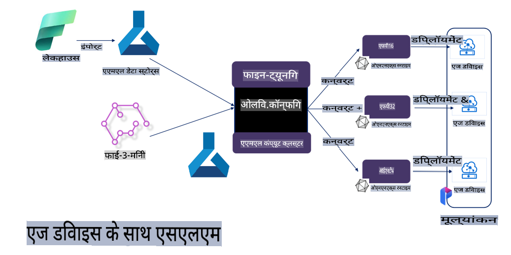

# **Microsoft Olive के साथ Phi-3 का फाइन-ट्यूनिंग**

[Olive](https://github.com/microsoft/OLive?WT.mc_id=aiml-138114-kinfeylo) एक उपयोग में आसान हार्डवेयर-अनुकूल मॉडल ऑप्टिमाइजेशन टूल है, जो मॉडल कंप्रेशन, ऑप्टिमाइजेशन और कंपाइलेशन में उद्योग-अग्रणी तकनीकों को एक साथ लाता है।

यह मशीन लर्निंग मॉडलों को ऑप्टिमाइज़ करने की प्रक्रिया को सरल बनाने के लिए डिज़ाइन किया गया है, ताकि वे विशिष्ट हार्डवेयर आर्किटेक्चर का सबसे कुशल उपयोग कर सकें।

चाहे आप क्लाउड-आधारित एप्लिकेशन पर काम कर रहे हों या एज डिवाइस पर, Olive आपके मॉडलों को आसानी और प्रभावी ढंग से ऑप्टिमाइज़ करने में सक्षम बनाता है।

## मुख्य विशेषताएं:
- Olive वांछित हार्डवेयर लक्ष्यों के लिए ऑप्टिमाइजेशन तकनीकों को एकत्रित और स्वचालित करता है।
- कोई एकल ऑप्टिमाइजेशन तकनीक सभी परिस्थितियों के लिए उपयुक्त नहीं होती, इसलिए Olive विशेषज्ञों को अपनी इनोवेटिव तकनीकों को जोड़ने की अनुमति देकर विस्तारशीलता प्रदान करता है।

## इंजीनियरिंग प्रयास को कम करें:
- डेवलपर्स को अक्सर प्रशिक्षित मॉडलों को डिप्लॉयमेंट के लिए तैयार और ऑप्टिमाइज़ करने के लिए कई हार्डवेयर वेंडर-विशिष्ट टूलचेन सीखने और उपयोग करने की आवश्यकता होती है।
- Olive इस अनुभव को सरल बनाता है, वांछित हार्डवेयर के लिए ऑप्टिमाइजेशन तकनीकों को स्वचालित करता है।

## तैयार-से-उपयोग एंड-टू-एंड ऑप्टिमाइजेशन समाधान:

एकीकृत तकनीकों को संयोजित और ट्यून करके, Olive एंड-टू-एंड ऑप्टिमाइजेशन के लिए एकीकृत समाधान प्रदान करता है।
यह मॉडल्स को ऑप्टिमाइज़ करते समय सटीकता और विलंबता जैसी बाधाओं को ध्यान में रखता है।

## Microsoft Olive का उपयोग करके फाइन-ट्यूनिंग

Microsoft Olive एक बहुत ही आसान-से-उपयोग करने वाला ओपन सोर्स मॉडल ऑप्टिमाइजेशन टूल है, जो जनरेटिव आर्टिफिशियल इंटेलिजेंस के क्षेत्र में फाइन-ट्यूनिंग और रेफरेंस दोनों को कवर कर सकता है। यह केवल सरल कॉन्फ़िगरेशन की आवश्यकता रखता है, और ओपन सोर्स छोटे भाषा मॉडलों और संबंधित रनटाइम वातावरण (AzureML / लोकल GPU, CPU, DirectML) के उपयोग के साथ, आप स्वचालित ऑप्टिमाइजेशन के माध्यम से मॉडल का फाइन-ट्यूनिंग या रेफरेंस पूरा कर सकते हैं और क्लाउड या एज डिवाइस पर डिप्लॉय करने के लिए सबसे अच्छा मॉडल पा सकते हैं। यह उद्यमों को ऑन-प्रिमाइसेस और क्लाउड पर अपने स्वयं के उद्योग-विशिष्ट वर्टिकल मॉडल बनाने की अनुमति देता है।


## Microsoft Olive के साथ Phi-3 फाइन-ट्यूनिंग 



## Phi-3 Olive का सैंपल कोड और उदाहरण
इस उदाहरण में आप Olive का उपयोग करेंगे:

- Sad, Joy, Fear, Surprise जैसी भावनाओं में वाक्यों को वर्गीकृत करने के लिए एक LoRA एडाप्टर का फाइन-ट्यूनिंग।
- एडाप्टर वज़न को बेस मॉडल में मर्ज करना।
- मॉडल को int4 में ऑप्टिमाइज़ और क्वांटाइज़ करना।

[सैंपल कोड](../../code/03.Finetuning/olive-ort-example/README.md)

### Microsoft Olive सेटअप करें

Microsoft Olive का इंस्टॉलेशन बहुत सरल है, और इसे CPU, GPU, DirectML और Azure ML के लिए भी इंस्टॉल किया जा सकता है।

```bash
pip install olive-ai
```

यदि आप CPU के साथ ONNX मॉडल चलाना चाहते हैं, तो आप इसका उपयोग कर सकते हैं:

```bash
pip install olive-ai[cpu]
```

यदि आप GPU के साथ ONNX मॉडल चलाना चाहते हैं, तो आप इसका उपयोग कर सकते हैं:

```python
pip install olive-ai[gpu]
```

यदि आप Azure ML का उपयोग करना चाहते हैं, तो आप इसका उपयोग कर सकते हैं:

```python
pip install git+https://github.com/microsoft/Olive#egg=olive-ai[azureml]
```

**नोट**
OS आवश्यकताएँ: Ubuntu 20.04 / 22.04 

### **Microsoft Olive का Config.json**

इंस्टॉलेशन के बाद, आप Config फ़ाइल के माध्यम से विभिन्न मॉडल-विशिष्ट सेटिंग्स को कॉन्फ़िगर कर सकते हैं, जिसमें डेटा, कंप्यूटिंग, ट्रेनिंग, डिप्लॉयमेंट और मॉडल जनरेशन शामिल हैं।

**1. डेटा**

Microsoft Olive पर, लोकल डेटा और क्लाउड डेटा दोनों पर ट्रेनिंग का समर्थन किया जा सकता है, और इसे सेटिंग्स में कॉन्फ़िगर किया जा सकता है।

*लोकल डेटा सेटिंग्स*

आप आसानी से उस डेटा सेट को सेट कर सकते हैं जिसे फाइन-ट्यूनिंग के लिए प्रशिक्षित करने की आवश्यकता है, आमतौर पर json प्रारूप में, और इसे डेटा टेम्पलेट के साथ अनुकूलित कर सकते हैं। यह मॉडल की आवश्यकताओं के आधार पर समायोजित किया जाना चाहिए (उदाहरण के लिए, इसे Microsoft Phi-3-mini द्वारा आवश्यक प्रारूप के साथ अनुकूलित करें। यदि आपके पास अन्य मॉडल हैं, तो कृपया अन्य मॉडलों के लिए आवश्यक फाइन-ट्यूनिंग प्रारूपों को देखें।)

```json

    "data_configs": [
        {
            "name": "dataset_default_train",
            "type": "HuggingfaceContainer",
            "load_dataset_config": {
                "params": {
                    "data_name": "json", 
                    "data_files":"dataset/dataset-classification.json",
                    "split": "train"
                }
            },
            "pre_process_data_config": {
                "params": {
                    "dataset_type": "corpus",
                    "text_cols": [
                            "phrase",
                            "tone"
                    ],
                    "text_template": "### Text: {phrase}\n### The tone is:\n{tone}",
                    "corpus_strategy": "join",
                    "source_max_len": 2048,
                    "pad_to_max_len": false,
                    "use_attention_mask": false
                }
            }
        }
    ],
```

**क्लाउड डेटा स्रोत सेटिंग्स**

Azure AI Studio/Azure Machine Learning Service के डेटा स्टोर को लिंक करके क्लाउड में डेटा को लिंक करें, आप Microsoft Fabric और Azure Data के माध्यम से Azure AI Studio/Azure Machine Learning Service में विभिन्न डेटा स्रोतों को पेश करने का विकल्प चुन सकते हैं, जो डेटा के फाइन-ट्यूनिंग के लिए समर्थन प्रदान करता है।

```json

    "data_configs": [
        {
            "name": "dataset_default_train",
            "type": "HuggingfaceContainer",
            "load_dataset_config": {
                "params": {
                    "data_name": "json", 
                    "data_files": {
                        "type": "azureml_datastore",
                        "config": {
                            "azureml_client": {
                                "subscription_id": "Your Azure Subscrition ID",
                                "resource_group": "Your Azure Resource Group",
                                "workspace_name": "Your Azure ML Workspaces name"
                            },
                            "datastore_name": "workspaceblobstore",
                            "relative_path": "Your train_data.json Azure ML Location"
                        }
                    },
                    "split": "train"
                }
            },
            "pre_process_data_config": {
                "params": {
                    "dataset_type": "corpus",
                    "text_cols": [
                            "Question",
                            "Best Answer"
                    ],
                    "text_template": "<|user|>\n{Question}<|end|>\n<|assistant|>\n{Best Answer}\n<|end|>",
                    "corpus_strategy": "join",
                    "source_max_len": 2048,
                    "pad_to_max_len": false,
                    "use_attention_mask": false
                }
            }
        }
    ],
    
```

**2. कंप्यूटिंग कॉन्फ़िगरेशन**

यदि आपको लोकल होना है, तो आप सीधे लोकल डेटा संसाधनों का उपयोग कर सकते हैं। यदि आपको Azure AI Studio / Azure Machine Learning Service के संसाधनों का उपयोग करना है, तो आपको संबंधित Azure पैरामीटर, कंप्यूटिंग पावर नाम आदि को कॉन्फ़िगर करना होगा।

```json

    "systems": {
        "aml": {
            "type": "AzureML",
            "config": {
                "accelerators": ["gpu"],
                "hf_token": true,
                "aml_compute": "Your Azure AI Studio / Azure Machine Learning Service Compute Name",
                "aml_docker_config": {
                    "base_image": "Your Azure AI Studio / Azure Machine Learning Service docker",
                    "conda_file_path": "conda.yaml"
                }
            }
        },
        "azure_arc": {
            "type": "AzureML",
            "config": {
                "accelerators": ["gpu"],
                "aml_compute": "Your Azure AI Studio / Azure Machine Learning Service Compute Name",
                "aml_docker_config": {
                    "base_image": "Your Azure AI Studio / Azure Machine Learning Service docker",
                    "conda_file_path": "conda.yaml"
                }
            }
        }
    },
```

***नोट***

क्योंकि यह Azure AI Studio/Azure Machine Learning Service पर एक कंटेनर के माध्यम से चलाया जाता है, इसलिए आवश्यक वातावरण को कॉन्फ़िगर करने की आवश्यकता होती है। यह conda.yaml वातावरण में कॉन्फ़िगर किया जाता है।

```yaml

name: project_environment
channels:
  - defaults
dependencies:
  - python=3.8.13
  - pip=22.3.1
  - pip:
      - einops
      - accelerate
      - azure-keyvault-secrets
      - azure-identity
      - bitsandbytes
      - datasets
      - huggingface_hub
      - peft
      - scipy
      - sentencepiece
      - torch>=2.2.0
      - transformers
      - git+https://github.com/microsoft/Olive@jiapli/mlflow_loading_fix#egg=olive-ai[gpu]
      - --extra-index-url https://aiinfra.pkgs.visualstudio.com/PublicPackages/_packaging/ORT-Nightly/pypi/simple/ 
      - ort-nightly-gpu==1.18.0.dev20240307004
      - --extra-index-url https://aiinfra.pkgs.visualstudio.com/PublicPackages/_packaging/onnxruntime-genai/pypi/simple/
      - onnxruntime-genai-cuda

    

```

**3. अपना SLM चुनें**

आप सीधे Hugging Face से मॉडल का उपयोग कर सकते हैं, या आप Azure AI Studio / Azure Machine Learning के Model Catalog के साथ इसे सीधे संयोजित करके उपयोग करने के लिए मॉडल का चयन कर सकते हैं। नीचे दिए गए कोड उदाहरण में हम Microsoft Phi-3-mini को एक उदाहरण के रूप में उपयोग करेंगे।

यदि आपके पास मॉडल लोकल है, तो आप इस विधि का उपयोग कर सकते हैं:

```json

    "input_model":{
        "type": "PyTorchModel",
        "config": {
            "hf_config": {
                "model_name": "model-cache/microsoft/phi-3-mini",
                "task": "text-generation",
                "model_loading_args": {
                    "trust_remote_code": true
                }
            }
        }
    },
```

यदि आप Azure AI Studio / Azure Machine Learning Service से मॉडल का उपयोग करना चाहते हैं, तो आप इस विधि का उपयोग कर सकते हैं:

```json

    "input_model":{
        "type": "PyTorchModel",
        "config": {
            "model_path": {
                "type": "azureml_registry_model",
                "config": {
                    "name": "microsoft/Phi-3-mini-4k-instruct",
                    "registry_name": "azureml-msr",
                    "version": "11"
                }
            },
             "model_file_format": "PyTorch.MLflow",
             "hf_config": {
                "model_name": "microsoft/Phi-3-mini-4k-instruct",
                "task": "text-generation",
                "from_pretrained_args": {
                    "trust_remote_code": true
                }
            }
        }
    },
```

**नोट:**
हमें Azure AI Studio / Azure Machine Learning Service के साथ एकीकृत करना होगा, इसलिए मॉडल सेट करते समय, कृपया संस्करण संख्या और संबंधित नामकरण को देखें।

Azure पर सभी मॉडलों को PyTorch.MLflow पर सेट करना आवश्यक है।

आपके पास Hugging Face खाता होना चाहिए और इसे Azure AI Studio / Azure Machine Learning की Key Value से जोड़ना चाहिए।

**4. एल्गोरिदम**

Microsoft Olive ने LoRA और QLoRA फाइन-ट्यूनिंग एल्गोरिदम को बहुत अच्छे से एनकैप्सुलेट किया है। आपको केवल कुछ प्रासंगिक पैरामीटर कॉन्फ़िगर करने की आवश्यकता है। यहाँ मैं QLoRA को एक उदाहरण के रूप में लेता हूँ।

```json
        "lora": {
            "type": "LoRA",
            "config": {
                "target_modules": [
                    "o_proj",
                    "qkv_proj"
                ],
                "double_quant": true,
                "lora_r": 64,
                "lora_alpha": 64,
                "lora_dropout": 0.1,
                "train_data_config": "dataset_default_train",
                "eval_dataset_size": 0.3,
                "training_args": {
                    "seed": 0,
                    "data_seed": 42,
                    "per_device_train_batch_size": 1,
                    "per_device_eval_batch_size": 1,
                    "gradient_accumulation_steps": 4,
                    "gradient_checkpointing": false,
                    "learning_rate": 0.0001,
                    "num_train_epochs": 3,
                    "max_steps": 10,
                    "logging_steps": 10,
                    "evaluation_strategy": "steps",
                    "eval_steps": 187,
                    "group_by_length": true,
                    "adam_beta2": 0.999,
                    "max_grad_norm": 0.3
                }
            }
        },
```

यदि आप क्वांटाइज़ेशन रूपांतरण करना चाहते हैं, तो Microsoft Olive मुख्य शाखा पहले से ही onnxruntime-genai विधि का समर्थन करती है। आप इसे अपनी आवश्यकताओं के अनुसार सेट कर सकते हैं:

1. एडाप्टर वज़न को बेस मॉडल में मर्ज करें।
2. ModelBuilder द्वारा आवश्यक सटीकता के साथ मॉडल को ONNX मॉडल में कन्वर्ट करें।

उदाहरण के लिए, क्वांटाइज़्ड INT4 में कन्वर्ट करना:

```json

        "merge_adapter_weights": {
            "type": "MergeAdapterWeights"
        },
        "builder": {
            "type": "ModelBuilder",
            "config": {
                "precision": "int4"
            }
        }
```

**नोट** 
- यदि आप QLoRA का उपयोग करते हैं, तो ONNXRuntime-genai का क्वांटाइज़ेशन रूपांतरण फिलहाल समर्थित नहीं है।

- यह यहाँ ध्यान दिया जाना चाहिए कि आप उपरोक्त चरणों को अपनी आवश्यकताओं के अनुसार सेट कर सकते हैं। उपरोक्त सभी चरणों को पूरी तरह से कॉन्फ़िगर करना आवश्यक नहीं है। अपनी आवश्यकताओं के अनुसार, आप एल्गोरिदम के चरणों का उपयोग सीधे फाइन-ट्यूनिंग के बिना कर सकते हैं। अंत में आपको संबंधित इंजन को कॉन्फ़िगर करना होगा।

```json

    "engine": {
        "log_severity_level": 0,
        "host": "aml",
        "target": "aml",
        "search_strategy": false,
        "execution_providers": ["CUDAExecutionProvider"],
        "cache_dir": "../model-cache/models/phi3-finetuned/cache",
        "output_dir" : "../model-cache/models/phi3-finetuned"
    }
```

**5. फाइन-ट्यूनिंग पूरा हुआ**

कमांड लाइन पर, olive-config.json की डायरेक्टरी में जाकर निष्पादित करें:

```bash
olive run --config olive-config.json  
```

**अस्वीकरण**:  
यह दस्तावेज़ मशीन-आधारित एआई अनुवाद सेवाओं का उपयोग करके अनुवादित किया गया है। जबकि हम सटीकता सुनिश्चित करने का प्रयास करते हैं, कृपया ध्यान दें कि स्वचालित अनुवादों में त्रुटियां या अशुद्धियां हो सकती हैं। मूल दस्तावेज़ को उसकी मूल भाषा में प्रामाणिक स्रोत माना जाना चाहिए। महत्वपूर्ण जानकारी के लिए, पेशेवर मानव अनुवाद की सिफारिश की जाती है। इस अनुवाद के उपयोग से उत्पन्न किसी भी गलतफहमी या व्याख्या के लिए हम उत्तरदायी नहीं हैं।