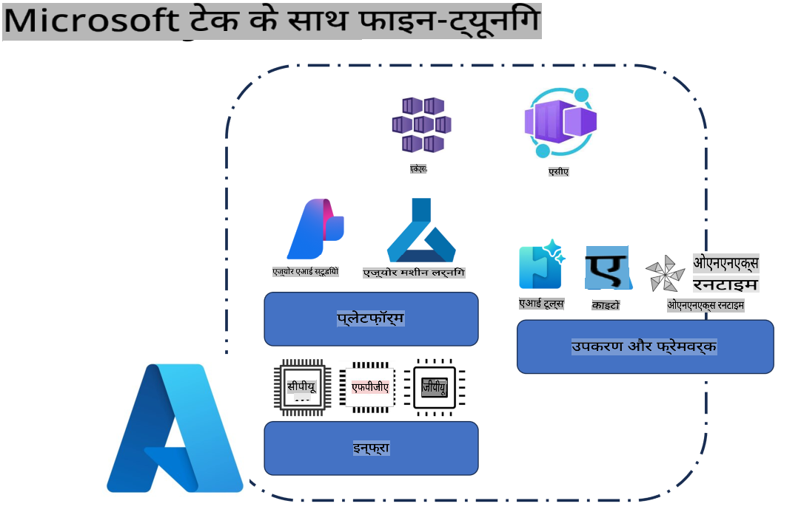
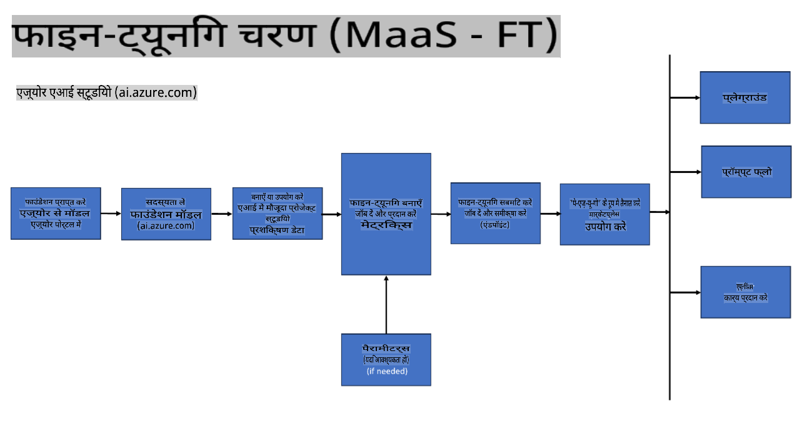
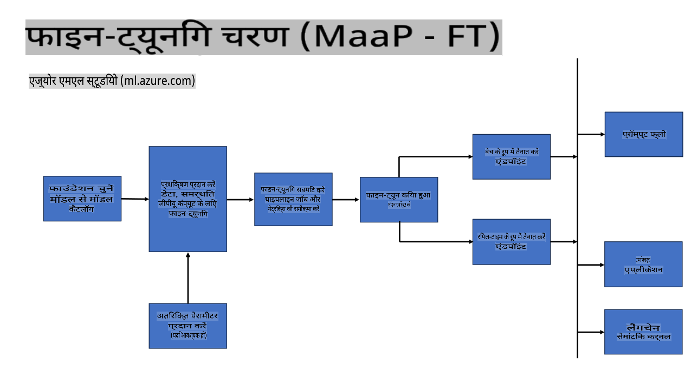
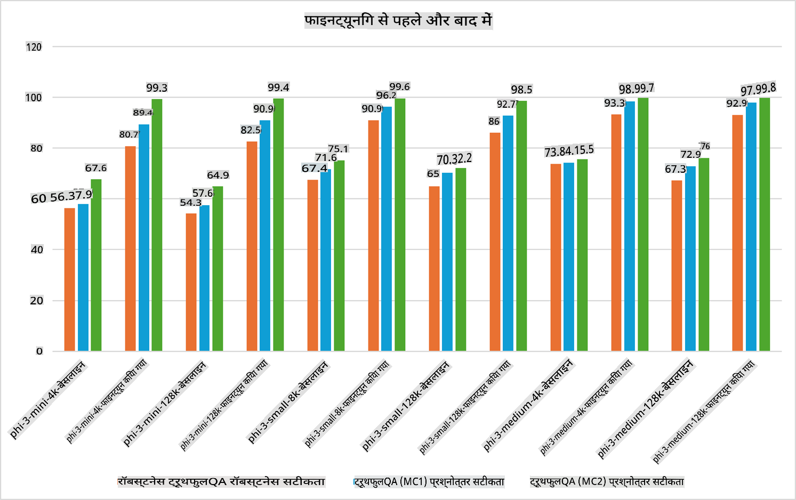

## फाइन-ट्यूनिंग परिदृश्य

**प्लैटफ़ॉर्म** इसमें Azure AI Foundry, Azure Machine Learning, AI Tools, Kaito, और ONNX Runtime जैसी विभिन्न तकनीकों को शामिल किया गया है।

**इन्फ्रास्ट्रक्चर** इसमें CPU और FPGA शामिल हैं, जो फाइन-ट्यूनिंग प्रक्रिया के लिए आवश्यक हैं। आइए, इन तकनीकों के प्रतीक चिह्न दिखाते हैं।

**टूल्स और फ्रेमवर्क** इसमें ONNX Runtime और ONNX Runtime शामिल हैं। आइए, इन तकनीकों के प्रतीक चिह्न दिखाते हैं।  
[ONNX Runtime और ONNX Runtime के प्रतीक चिह्न जोड़ें]

Microsoft तकनीकों के साथ फाइन-ट्यूनिंग प्रक्रिया में विभिन्न घटक और टूल्स शामिल हैं। इन तकनीकों को समझकर और उपयोग करके, हम अपनी एप्लिकेशन को प्रभावी ढंग से फाइन-ट्यून कर सकते हैं और बेहतर समाधान बना सकते हैं।

## मॉडल-एज़-ए-सर्विस

कंप्यूट को बनाए और प्रबंधित किए बिना होस्टेड फाइन-ट्यूनिंग का उपयोग करके मॉडल को फाइन-ट्यून करें।

Phi-3-mini और Phi-3-medium मॉडलों के लिए सर्वरलेस फाइन-ट्यूनिंग उपलब्ध है, जिससे डेवलपर्स क्लाउड और एज परिदृश्यों के लिए मॉडलों को जल्दी और आसानी से अनुकूलित कर सकते हैं, बिना कंप्यूट का प्रबंधन किए। हमने यह भी घोषणा की है कि Phi-3-small अब हमारे Models-as-a-Service ऑफरिंग के माध्यम से उपलब्ध है, ताकि डेवलपर्स बुनियादी ढांचे का प्रबंधन किए बिना AI विकास शुरू कर सकें।

## मॉडल-एज़-ए-प्लैटफ़ॉर्म

उपयोगकर्ता अपने स्वयं के कंप्यूट का प्रबंधन करते हैं ताकि वे अपने मॉडल को फाइन-ट्यून कर सकें।

[फाइन-ट्यूनिंग नमूना](https://github.com/Azure/azureml-examples/blob/main/sdk/python/foundation-models/system/finetune/chat-completion/chat-completion.ipynb)

## फाइन-ट्यूनिंग परिदृश्य

| | | | | | | |
|-|-|-|-|-|-|-|
|परिदृश्य|LoRA|QLoRA|PEFT|DeepSpeed|ZeRO|DORA|
|पूर्व-प्रशिक्षित LLMs को विशिष्ट कार्यों या डोमेन में अनुकूलित करना|हाँ|हाँ|हाँ|हाँ|हाँ|हाँ|
|NLP कार्यों जैसे टेक्स्ट क्लासिफिकेशन, नामित इकाई पहचान, और मशीन अनुवाद के लिए फाइन-ट्यूनिंग|हाँ|हाँ|हाँ|हाँ|हाँ|हाँ|
|QA कार्यों के लिए फाइन-ट्यूनिंग|हाँ|हाँ|हाँ|हाँ|हाँ|हाँ|
|चैटबॉट्स में मानव-समान उत्तर उत्पन्न करने के लिए फाइन-ट्यूनिंग|हाँ|हाँ|हाँ|हाँ|हाँ|हाँ|
|संगीत, कला, या अन्य रचनात्मकता उत्पन्न करने के लिए फाइन-ट्यूनिंग|हाँ|हाँ|हाँ|हाँ|हाँ|हाँ|
|गणनात्मक और वित्तीय लागत को कम करना|हाँ|हाँ|नहीं|हाँ|हाँ|नहीं|
|मेमोरी उपयोग को कम करना|नहीं|हाँ|नहीं|हाँ|हाँ|हाँ|
|कुशल फाइन-ट्यूनिंग के लिए कम पैरामीटर का उपयोग करना|नहीं|हाँ|हाँ|नहीं|नहीं|हाँ|
|डेटा पैरललिज़्म का मेमोरी-कुशल रूप जो सभी उपलब्ध GPU डिवाइसों की समग्र GPU मेमोरी तक पहुंच प्रदान करता है|नहीं|नहीं|नहीं|हाँ|हाँ|हाँ|

## फाइन-ट्यूनिंग प्रदर्शन उदाहरण

**अस्वीकरण**:  
यह दस्तावेज़ मशीन-आधारित एआई अनुवाद सेवाओं का उपयोग करके अनुवादित किया गया है। जबकि हम सटीकता के लिए प्रयास करते हैं, कृपया ध्यान दें कि स्वचालित अनुवादों में त्रुटियां या अशुद्धियां हो सकती हैं। मूल दस्तावेज़ को उसकी मूल भाषा में प्रामाणिक स्रोत माना जाना चाहिए। महत्वपूर्ण जानकारी के लिए, पेशेवर मानव अनुवाद की सिफारिश की जाती है। इस अनुवाद के उपयोग से उत्पन्न किसी भी गलतफहमी या गलत व्याख्या के लिए हम जिम्मेदार नहीं हैं।