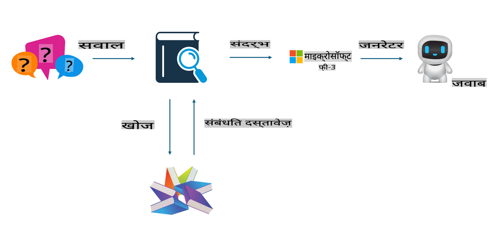

## फाइन-ट्यूनिंग बनाम RAG

## रिट्रीवल ऑगमेंटेड जनरेशन

RAG डेटा रिट्रीवल + टेक्स्ट जनरेशन है। एंटरप्राइज के संरचित और असंरचित डेटा को वेक्टर डेटाबेस में संग्रहीत किया जाता है। जब संबंधित सामग्री खोजी जाती है, तो संबंधित सारांश और सामग्री को ढूंढकर एक संदर्भ तैयार किया जाता है, और फिर LLM/SLM की टेक्स्ट पूर्णता क्षमता का उपयोग करके सामग्री तैयार की जाती है।

## RAG प्रक्रिया

## फाइन-ट्यूनिंग
फाइन-ट्यूनिंग किसी विशेष मॉडल के सुधार पर आधारित है। इसे मॉडल एल्गोरिदम से शुरू करने की आवश्यकता नहीं होती, लेकिन डेटा को लगातार एकत्रित करना पड़ता है। यदि आपको उद्योग अनुप्रयोगों में अधिक सटीक शब्दावली और भाषा अभिव्यक्ति की आवश्यकता है, तो फाइन-ट्यूनिंग बेहतर विकल्प है। लेकिन यदि आपका डेटा बार-बार बदलता है, तो फाइन-ट्यूनिंग जटिल हो सकती है।

## कैसे चुनें
यदि हमारे उत्तर के लिए बाहरी डेटा को शामिल करना आवश्यक है, तो RAG सबसे अच्छा विकल्प है।

यदि आपको स्थिर और सटीक उद्योग ज्ञान आउटपुट करने की आवश्यकता है, तो फाइन-ट्यूनिंग एक अच्छा विकल्प होगा। RAG प्रासंगिक सामग्री को प्राथमिकता देता है, लेकिन यह हमेशा विशेषीकृत बारीकियों को सटीक रूप से नहीं पकड़ सकता।

फाइन-ट्यूनिंग के लिए एक उच्च-गुणवत्ता वाला डेटा सेट आवश्यक है, और यदि यह केवल एक छोटे दायरे का डेटा है, तो यह ज्यादा अंतर नहीं लाएगा। RAG अधिक लचीला है।  
फाइन-ट्यूनिंग एक ब्लैक बॉक्स है, एक रहस्य, और इसके आंतरिक तंत्र को समझना कठिन है। लेकिन RAG डेटा के स्रोत को ढूंढना आसान बनाता है, जिससे भ्रम या सामग्री त्रुटियों को प्रभावी ढंग से समायोजित किया जा सकता है और बेहतर पारदर्शिता प्रदान की जा सकती है।

**अस्वीकरण**:  
यह दस्तावेज़ मशीन-आधारित एआई अनुवाद सेवाओं का उपयोग करके अनुवादित किया गया है। जबकि हम सटीकता के लिए प्रयास करते हैं, कृपया ध्यान दें कि स्वचालित अनुवाद में त्रुटियाँ या अशुद्धियाँ हो सकती हैं। मूल भाषा में मूल दस्तावेज़ को प्रामाणिक स्रोत माना जाना चाहिए। महत्वपूर्ण जानकारी के लिए, पेशेवर मानव अनुवाद की सिफारिश की जाती है। इस अनुवाद के उपयोग से उत्पन्न किसी भी गलतफहमी या गलत व्याख्या के लिए हम जिम्मेदार नहीं हैं।