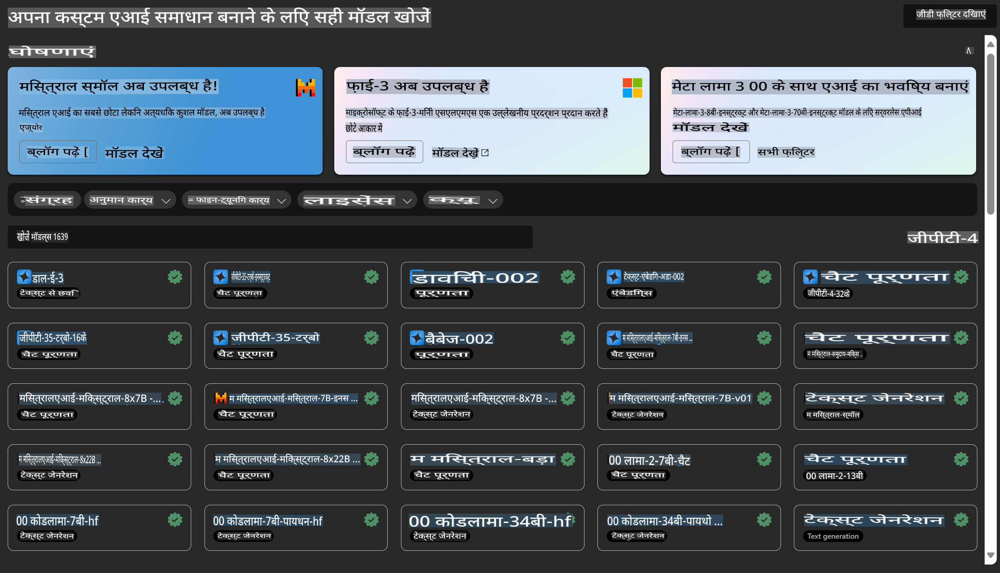

# **Azure मशीन लर्निंग सर्विस का परिचय**

[Azure Machine Learning](https://ml.azure.com?WT.mc_id=aiml-138114-kinfeylo) एक क्लाउड सेवा है जो मशीन लर्निंग (ML) प्रोजेक्ट लाइफसाइकिल को तेज़ और प्रबंधित करने के लिए डिज़ाइन की गई है।

ML पेशेवर, डेटा वैज्ञानिक और इंजीनियर इसे अपने दैनिक वर्कफ़्लो में उपयोग कर सकते हैं:

- मॉडल ट्रेन और डिप्लॉय करें।
- मशीन लर्निंग ऑपरेशन्स (MLOps) को प्रबंधित करें।
- आप Azure Machine Learning में मॉडल बना सकते हैं या PyTorch, TensorFlow, या scikit-learn जैसे ओपन-सोर्स प्लेटफ़ॉर्म से बनाए गए मॉडल का उपयोग कर सकते हैं।
- MLOps टूल्स आपको मॉडल की निगरानी, पुनः प्रशिक्षण और पुनः डिप्लॉय करने में मदद करते हैं।

## Azure Machine Learning किसके लिए है?

**डेटा वैज्ञानिक और ML इंजीनियर**

वे अपने दैनिक वर्कफ़्लो को तेज़ और स्वचालित करने के लिए टूल्स का उपयोग कर सकते हैं।  
Azure ML निष्पक्षता, व्याख्यात्मकता, ट्रैकिंग, और ऑडिटेबिलिटी के लिए फीचर्स प्रदान करता है।  

**एप्लिकेशन डेवलपर्स**

वे मॉडल्स को एप्लिकेशन या सेवाओं में आसानी से इंटीग्रेट कर सकते हैं।

**प्लेटफ़ॉर्म डेवलपर्स**

उन्हें Azure Resource Manager APIs द्वारा समर्थित एक मज़बूत टूलसेट तक पहुंच मिलती है।  
ये टूल उन्नत ML टूलिंग बनाने की अनुमति देते हैं।

**एंटरप्राइज़**

Microsoft Azure क्लाउड में काम करते हुए, एंटरप्राइज़ परिचित सुरक्षा और रोल-आधारित एक्सेस कंट्रोल का लाभ उठा सकते हैं।  
संरक्षित डेटा और विशिष्ट ऑपरेशन्स तक पहुंच को नियंत्रित करने के लिए प्रोजेक्ट सेटअप करें।

## टीम के हर सदस्य के लिए उत्पादकता

ML प्रोजेक्ट्स को बनाने और बनाए रखने के लिए अक्सर विभिन्न कौशल सेट वाली टीम की आवश्यकता होती है।  

Azure ML ऐसे टूल्स प्रदान करता है जो आपको सक्षम बनाते हैं:
- साझा नोटबुक, कंप्यूट संसाधन, सर्वरलेस कंप्यूट, डेटा और वातावरण के माध्यम से अपनी टीम के साथ सहयोग करें।
- मॉडल्स को निष्पक्षता, व्याख्यात्मकता, ट्रैकिंग और ऑडिटेबिलिटी के साथ विकसित करें ताकि वंशावली और ऑडिट अनुपालन आवश्यकताओं को पूरा किया जा सके।
- ML मॉडल्स को बड़े पैमाने पर जल्दी और आसानी से डिप्लॉय करें, और MLOps के साथ उन्हें कुशलतापूर्वक प्रबंधित और नियंत्रित करें।
- अंतर्निहित गवर्नेंस, सुरक्षा, और अनुपालन के साथ कहीं भी मशीन लर्निंग वर्कलोड्स चलाएं।

## क्रॉस-कम्पैटिबल प्लेटफ़ॉर्म टूल्स

ML टीम का कोई भी सदस्य अपनी पसंदीदा टूल्स का उपयोग करके कार्य कर सकता है।  
चाहे आप तेज़ी से प्रयोग कर रहे हों, हाइपरपैरामीटर ट्यूनिंग कर रहे हों, पाइपलाइन्स बना रहे हों, या इनफरेंसेस प्रबंधित कर रहे हों, आप परिचित इंटरफेसेस का उपयोग कर सकते हैं, जिनमें शामिल हैं:
- Azure Machine Learning Studio
- Python SDK (v2)
- Azure CLI (v2)
- Azure Resource Manager REST APIs

जैसे ही आप मॉडल्स को परिष्कृत करते हैं और विकास चक्र के दौरान सहयोग करते हैं, आप Azure Machine Learning studio UI में एसेट्स, संसाधन, और मेट्रिक्स को साझा और ढूंढ सकते हैं।

## **Azure ML में LLM/SLM**

Azure ML ने LLM/SLM से संबंधित कई कार्यक्षमताएं जोड़ी हैं, जो LLMOps और SLMOps को मिलाकर एक एंटरप्राइज़-स्तरीय जनरेटिव आर्टिफिशियल इंटेलिजेंस टेक्नोलॉजी प्लेटफ़ॉर्म बनाती हैं।

### **मॉडल कैटलॉग**

एंटरप्राइज़ उपयोगकर्ता विभिन्न व्यवसाय परिदृश्यों के अनुसार विभिन्न मॉडल्स को मॉडल कैटलॉग के माध्यम से डिप्लॉय कर सकते हैं और मॉडल को सेवा के रूप में (Model as Service) प्रदान कर सकते हैं ताकि एंटरप्राइज़ डेवलपर्स या उपयोगकर्ता इसे एक्सेस कर सकें।

Azure Machine Learning studio में मॉडल कैटलॉग जनरेटिव AI एप्लिकेशन बनाने के लिए विभिन्न मॉडल्स का पता लगाने और उपयोग करने का केंद्र है।  
मॉडल कैटलॉग में Azure OpenAI सेवा, Mistral, Meta, Cohere, Nvidia, Hugging Face जैसे मॉडल प्रदाताओं के सैकड़ों मॉडल शामिल हैं, जिनमें Microsoft द्वारा प्रशिक्षित मॉडल भी हैं।  
Microsoft के अलावा अन्य प्रदाताओं के मॉडल Microsoft के प्रोडक्ट टर्म्स में Non-Microsoft Products के रूप में परिभाषित हैं और मॉडल के साथ प्रदान की गई शर्तों के अधीन हैं।

### **जॉब पाइपलाइन**

मशीन लर्निंग पाइपलाइन का मुख्य उद्देश्य एक पूर्ण मशीन लर्निंग कार्य को एक बहु-चरणीय वर्कफ़्लो में विभाजित करना है।  
प्रत्येक चरण एक प्रबंधनीय घटक होता है जिसे व्यक्तिगत रूप से विकसित, अनुकूलित, कॉन्फ़िगर और स्वचालित किया जा सकता है।  
चरणों को अच्छी तरह से परिभाषित इंटरफेसेस के माध्यम से जोड़ा जाता है।  
Azure Machine Learning पाइपलाइन सेवा पाइपलाइन चरणों के बीच सभी निर्भरताओं को स्वचालित रूप से व्यवस्थित करती है।

SLM/LLM को फाइन-ट्यून करते समय, हम पाइपलाइन के माध्यम से अपने डेटा, प्रशिक्षण और जेनरेशन प्रक्रियाओं को प्रबंधित कर सकते हैं।

### **प्रॉम्प्ट फ्लो**

Azure Machine Learning प्रॉम्प्ट फ्लो का उपयोग करने के लाभ  
Azure Machine Learning प्रॉम्प्ट फ्लो उपयोगकर्ताओं को विचार से प्रयोग और अंततः प्रोडक्शन-रेडी LLM-आधारित एप्लिकेशन तक स्थानांतरित करने में मदद करने वाले कई लाभ प्रदान करता है:

**प्रॉम्प्ट इंजीनियरिंग में फुर्ती**

- इंटरैक्टिव ऑथरिंग अनुभव: Azure Machine Learning प्रॉम्प्ट फ्लो फ्लो की संरचना का एक विज़ुअल प्रतिनिधित्व प्रदान करता है, जिससे उपयोगकर्ता अपने प्रोजेक्ट्स को आसानी से समझ और नेविगेट कर सकते हैं।  
  यह कुशल फ्लो विकास और डीबगिंग के लिए एक नोटबुक जैसी कोडिंग अनुभव भी प्रदान करता है।  
- प्रॉम्प्ट ट्यूनिंग के लिए वेरिएंट्स: उपयोगकर्ता कई प्रॉम्प्ट वेरिएंट्स बना और तुलना कर सकते हैं, जो एक पुनरावृत्त परिष्करण प्रक्रिया को सक्षम बनाता है।  
- मूल्यांकन: अंतर्निहित मूल्यांकन फ्लो उपयोगकर्ताओं को उनके प्रॉम्प्ट्स और फ्लो की गुणवत्ता और प्रभावशीलता का आकलन करने की अनुमति देते हैं।  
- व्यापक संसाधन: Azure Machine Learning प्रॉम्प्ट फ्लो में अंतर्निहित टूल्स, सैंपल्स, और टेम्पलेट्स की एक लाइब्रेरी शामिल है, जो विकास के लिए एक प्रारंभिक बिंदु के रूप में कार्य करती है, रचनात्मकता को प्रेरित करती है और प्रक्रिया को तेज़ करती है।  

**LLM-आधारित एप्लिकेशन के लिए एंटरप्राइज़ रेडीनेस**

- सहयोग: Azure Machine Learning प्रॉम्प्ट फ्लो टीम सहयोग का समर्थन करता है, जिससे कई उपयोगकर्ता प्रॉम्प्ट इंजीनियरिंग प्रोजेक्ट्स पर एक साथ काम कर सकते हैं, ज्ञान साझा कर सकते हैं, और संस्करण नियंत्रण बनाए रख सकते हैं।  
- ऑल-इन-वन प्लेटफ़ॉर्म: Azure Machine Learning प्रॉम्प्ट फ्लो पूरे प्रॉम्प्ट इंजीनियरिंग प्रक्रिया को सुव्यवस्थित करता है, विकास और मूल्यांकन से लेकर डिप्लॉयमेंट और निगरानी तक।  
  उपयोगकर्ता अपने फ्लो को Azure Machine Learning एंडपॉइंट्स के रूप में आसानी से डिप्लॉय कर सकते हैं और उनके प्रदर्शन की रीयल-टाइम में निगरानी कर सकते हैं, इष्टतम संचालन और निरंतर सुधार सुनिश्चित कर सकते हैं।  
- Azure Machine Learning एंटरप्राइज़ रेडीनेस सॉल्यूशंस: प्रॉम्प्ट फ्लो Azure Machine Learning के मज़बूत एंटरप्राइज़ रेडीनेस सॉल्यूशंस का लाभ उठाता है, जो फ्लो के विकास, प्रयोग, और डिप्लॉयमेंट के लिए एक सुरक्षित, स्केलेबल और विश्वसनीय आधार प्रदान करता है।  

Azure Machine Learning प्रॉम्प्ट फ्लो के साथ, उपयोगकर्ता अपनी प्रॉम्प्ट इंजीनियरिंग में फुर्ती ला सकते हैं, प्रभावी ढंग से सहयोग कर सकते हैं, और सफल LLM-आधारित एप्लिकेशन विकास और डिप्लॉयमेंट के लिए एंटरप्राइज़-ग्रेड सॉल्यूशंस का लाभ उठा सकते हैं।  

Azure ML की कम्प्यूटिंग शक्ति, डेटा, और विभिन्न घटकों को मिलाकर, एंटरप्राइज़ डेवलपर्स आसानी से अपने खुद के आर्टिफिशियल इंटेलिजेंस एप्लिकेशन बना सकते हैं।  

**अस्वीकरण**:  
यह दस्तावेज़ मशीन-आधारित एआई अनुवाद सेवाओं का उपयोग करके अनुवादित किया गया है। जबकि हम सटीकता के लिए प्रयासरत हैं, कृपया ध्यान दें कि स्वचालित अनुवादों में त्रुटियाँ या अशुद्धियाँ हो सकती हैं। मूल भाषा में उपलब्ध मूल दस्तावेज़ को प्रामाणिक स्रोत माना जाना चाहिए। महत्वपूर्ण जानकारी के लिए, पेशेवर मानव अनुवाद की सिफारिश की जाती है। इस अनुवाद के उपयोग से उत्पन्न किसी भी गलतफहमी या गलत व्याख्या के लिए हम उत्तरदायी नहीं हैं।