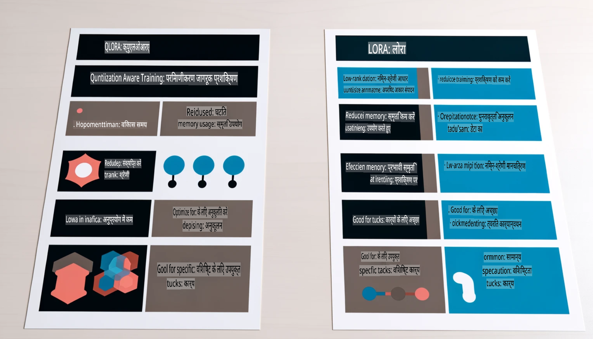

# **Phi-3 को एक उद्योग विशेषज्ञ बनाएं**

Phi-3 मॉडल को किसी उद्योग में लागू करने के लिए, आपको उद्योग से संबंधित व्यावसायिक डेटा Phi-3 मॉडल में जोड़ना होगा। हमारे पास दो विकल्प हैं: पहला है RAG (Retrieval Augmented Generation) और दूसरा है Fine Tuning।

## **RAG बनाम Fine-Tuning**

### **Retrieval Augmented Generation**

RAG डेटा पुनःप्राप्ति + टेक्स्ट निर्माण है। उद्यम के संरचित और असंरचित डेटा को वेक्टर डेटाबेस में संग्रहीत किया जाता है। जब प्रासंगिक सामग्री खोजी जाती है, तो संबंधित सारांश और सामग्री को संदर्भ के रूप में उपयोग किया जाता है, और LLM/SLM की टेक्स्ट पूर्णता क्षमता के साथ सामग्री उत्पन्न की जाती है।

### **Fine-tuning**

Fine-tuning किसी मॉडल के सुधार पर आधारित है। इसे मॉडल एल्गोरिदम से शुरू करने की आवश्यकता नहीं होती, लेकिन डेटा को लगातार एकत्रित करने की जरूरत होती है। यदि उद्योग अनुप्रयोगों में अधिक सटीक शब्दावली और भाषा अभिव्यक्ति की आवश्यकता हो, तो Fine-tuning बेहतर विकल्प है। लेकिन अगर आपका डेटा बार-बार बदलता है, तो Fine-tuning जटिल हो सकता है।

### **कैसे चुनें**

1. यदि हमारे उत्तर में बाहरी डेटा को शामिल करने की आवश्यकता है, तो RAG सबसे अच्छा विकल्प है।

2. यदि आपको स्थिर और सटीक उद्योग ज्ञान आउटपुट करने की आवश्यकता है, तो Fine-tuning एक अच्छा विकल्प होगा। RAG प्रासंगिक सामग्री को प्राथमिकता देता है, लेकिन हमेशा विशेष जटिलताओं को सही तरीके से नहीं पकड़ पाता।

3. Fine-tuning के लिए उच्च-गुणवत्ता वाले डेटा सेट की आवश्यकता होती है, और यदि यह केवल छोटे पैमाने का डेटा है, तो इसका अधिक अंतर नहीं होगा। RAG अधिक लचीला है।

4. Fine-tuning एक ब्लैक बॉक्स है, एक रहस्य, और इसके आंतरिक तंत्र को समझना कठिन है। लेकिन RAG डेटा के स्रोत को समझने में मदद कर सकता है, जिससे भ्रम या सामग्री की त्रुटियों को प्रभावी ढंग से समायोजित किया जा सकता है और बेहतर पारदर्शिता प्रदान की जा सकती है।

### **उपयोग के मामले**

1. वर्टिकल उद्योगों को विशिष्ट पेशेवर शब्दावली और अभिव्यक्ति की आवश्यकता होती है, ***Fine-tuning*** सबसे अच्छा विकल्प होगा।

2. QA सिस्टम, जिसमें विभिन्न ज्ञान बिंदुओं का संश्लेषण शामिल होता है, ***RAG*** सबसे अच्छा विकल्प होगा।

3. स्वचालित व्यावसायिक प्रवाह का संयोजन ***RAG + Fine-tuning*** सबसे अच्छा विकल्प है।

## **RAG का उपयोग कैसे करें**

एक वेक्टर डेटाबेस डेटा का एक संग्रह है जिसे गणितीय रूप में संग्रहीत किया जाता है। वेक्टर डेटाबेस मशीन लर्निंग मॉडल को पिछले इनपुट याद रखने में मदद करता है, जिससे खोज, सिफारिश और टेक्स्ट निर्माण जैसे उपयोग मामलों का समर्थन करना आसान हो जाता है। डेटा को समानता मेट्रिक्स के आधार पर पहचाना जा सकता है, सटीक मेल के बजाय, जिससे कंप्यूटर मॉडल डेटा के संदर्भ को समझ सकता है।

वेक्टर डेटाबेस RAG को साकार करने की कुंजी है। हम टेक्स्ट-एंबेडिंग-3, jina-ai-embedding आदि जैसे वेक्टर मॉडलों के माध्यम से डेटा को वेक्टर स्टोरेज में बदल सकते हैं।

RAG एप्लिकेशन बनाने के बारे में अधिक जानें [https://github.com/microsoft/Phi-3CookBook](https://github.com/microsoft/Phi-3CookBook?WT.mc_id=aiml-138114-kinfeylo)

## **Fine-tuning का उपयोग कैसे करें**

Fine-tuning में आमतौर पर उपयोग किए जाने वाले एल्गोरिदम Lora और QLora हैं। कैसे चुनें?
- [इस सैंपल नोटबुक के साथ और जानें](../../../../code/04.Finetuning/Phi_3_Inference_Finetuning.ipynb)
- [Python FineTuning का उदाहरण](../../../../code/04.Finetuning/FineTrainingScript.py)

### **Lora और QLora**

LoRA (Low-Rank Adaptation) और QLoRA (Quantized Low-Rank Adaptation) दोनों ही बड़े भाषा मॉडलों (LLMs) को Parameter Efficient Fine Tuning (PEFT) तकनीकों का उपयोग करके फाइन-ट्यून करने की विधियां हैं। PEFT तकनीकें पारंपरिक तरीकों की तुलना में मॉडलों को अधिक कुशलता से प्रशिक्षित करने के लिए डिज़ाइन की गई हैं।  
LoRA एक स्वतंत्र फाइन-ट्यूनिंग तकनीक है जो वेट अपडेट मैट्रिक्स पर लो-रैंक एप्रॉक्सिमेशन लागू करके मेमोरी उपयोग को कम करती है। यह तेज़ प्रशिक्षण समय प्रदान करता है और पारंपरिक फाइन-ट्यूनिंग विधियों के करीब प्रदर्शन बनाए रखता है।

QLoRA LoRA का एक विस्तारित संस्करण है जो मेमोरी उपयोग को और कम करने के लिए क्वांटाइज़ेशन तकनीकों को शामिल करता है। QLoRA प्री-ट्रेंड LLM के वेट पैरामीटर की सटीकता को 4-बिट तक कम कर देता है, जो LoRA की तुलना में अधिक मेमोरी कुशल है। हालांकि, QLoRA का प्रशिक्षण LoRA प्रशिक्षण की तुलना में लगभग 30% धीमा है क्योंकि इसमें अतिरिक्त क्वांटाइज़ेशन और डी-क्वांटाइज़ेशन चरण शामिल होते हैं।

QLoRA क्वांटाइज़ेशन के दौरान उत्पन्न त्रुटियों को ठीक करने के लिए LoRA का सहायक के रूप में उपयोग करता है। QLoRA बड़े पैमाने के मॉडलों को, जिनमें अरबों पैरामीटर होते हैं, अपेक्षाकृत छोटे और आसानी से उपलब्ध GPUs पर फाइन-ट्यून करने की अनुमति देता है। उदाहरण के लिए, QLoRA एक 70B पैरामीटर मॉडल को फाइन-ट्यून कर सकता है जिसे 36 GPUs की आवश्यकता होती है, केवल 2 GPUs पर।

**अस्वीकरण**:  
यह दस्तावेज़ मशीन-आधारित एआई अनुवाद सेवाओं का उपयोग करके अनुवादित किया गया है। जबकि हम सटीकता के लिए प्रयास करते हैं, कृपया ध्यान दें कि स्वचालित अनुवादों में त्रुटियाँ या गलतियाँ हो सकती हैं। मूल भाषा में उपलब्ध मूल दस्तावेज़ को आधिकारिक स्रोत माना जाना चाहिए। महत्वपूर्ण जानकारी के लिए, पेशेवर मानव अनुवाद की सिफारिश की जाती है। इस अनुवाद के उपयोग से उत्पन्न किसी भी गलतफहमी या गलत व्याख्या के लिए हम उत्तरदायी नहीं हैं।