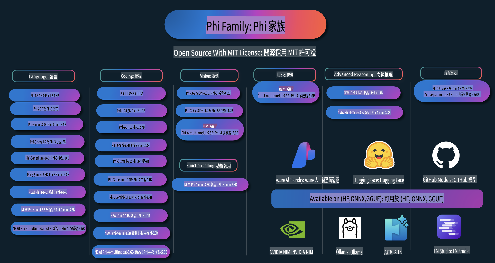

# Phi Cookbook: 微軟 Phi 模型實戰範例

  

  
  
  

  
  

Phi 是微軟開發的一系列開源 AI 模型。

Phi 是目前最強大且具成本效益的小型語言模型（SLM），在多語言、推理、文本/聊天生成、程式碼、圖片、音訊及其他場景中表現出色。

你可以將 Phi 部署到雲端或邊緣設備，並能在有限的運算資源下輕鬆構建生成式 AI 應用程式。

按照以下步驟開始使用這些資源：
1. **Fork 儲存庫**：點擊   
2. **Clone 儲存庫**：`git clone https://github.com/microsoft/PhiCookBook.git`  
3. [**加入微軟 AI Discord 社群，與專家和開發者交流**](https://discord.com/invite/ByRwuEEgH4?WT.mc_id=aiml-137032-kinfeylo)

## 目錄

- 簡介
  - [歡迎加入 Phi 家族](./md/01.Introduction/01/01.PhiFamily.md)
  - [設置你的開發環境](./md/01.Introduction/01/01.EnvironmentSetup.md)
  - [了解關鍵技術](./md/01.Introduction/01/01.Understandingtech.md)
  - [Phi 模型的 AI 安全性](./md/01.Introduction/01/01.AISafety.md)
  - [Phi 硬體支援](./md/01.Introduction/01/01.Hardwaresupport.md)
  - [Phi 模型與跨平台可用性](./md/01.Introduction/01/01.Edgeandcloud.md)
  - [使用 Guidance-ai 與 Phi](./md/01.Introduction/01/01.Guidance.md)
  - [GitHub Marketplace 模型](https://github.com/marketplace/models)
  - [Azure AI 模型目錄](https://ai.azure.com)

- 在不同環境中推理 Phi 模型
    -  [Hugging Face](./md/01.Introduction/02/01.HF.md)
    -  [GitHub 模型](./md/01.Introduction/02/02.GitHubModel.md)
    -  [Azure AI Foundry 模型目錄](./md/01.Introduction/02/03.AzureAIFoundry.md)
    -  [Ollama](./md/01.Introduction/02/04.Ollama.md)
    -  [AI Toolkit VSCode (AITK)](./md/01.Introduction/02/05.AITK.md)
    -  [NVIDIA NIM](./md/01.Introduction/02/06.NVIDIA.md)

- Phi 家族推理
    - [在 iOS 上推理 Phi](./md/01.Introduction/03/iOS_Inference.md)
    - [在 Android 上推理 Phi](./md/01.Introduction/03/Android_Inference.md)
- [Jetson 上的 Phi 推理](./md/01.Introduction/03/Jetson_Inference.md)  
    - [AI PC 上的 Phi 推理](./md/01.Introduction/03/AIPC_Inference.md)  
    - [使用 Apple MLX Framework 進行 Phi 推理](./md/01.Introduction/03/MLX_Inference.md)  
    - [本地服務器上的 Phi 推理](./md/01.Introduction/03/Local_Server_Inference.md)  
    - [使用 AI Toolkit 在遠程服務器上進行 Phi 推理](./md/01.Introduction/03/Remote_Interence.md)  
    - [使用 Rust 進行 Phi 推理](./md/01.Introduction/03/Rust_Inference.md)  
    - [本地的 Phi--Vision 推理](./md/01.Introduction/03/Vision_Inference.md)  
    - [使用 Kaito AKS 和 Azure Containers（官方支持）進行 Phi 推理](./md/01.Introduction/03/Kaito_Inference.md)  

- [Phi 家族的量化](./md/01.Introduction/04/QuantifyingPhi.md)  
    - [使用 llama.cpp 量化 Phi-3.5 / 4](./md/01.Introduction/04/UsingLlamacppQuantifyingPhi.md)  
    - [使用 onnxruntime 的生成式 AI 擴展進行 Phi-3.5 / 4 量化](./md/01.Introduction/04/UsingORTGenAIQuantifyingPhi.md)  
    - [使用 Intel OpenVINO 量化 Phi-3.5 / 4](./md/01.Introduction/04/UsingIntelOpenVINOQuantifyingPhi.md)  
    - [使用 Apple MLX Framework 量化 Phi-3.5 / 4](./md/01.Introduction/04/UsingAppleMLXQuantifyingPhi.md)  

- 評估 Phi  
    - [負責任的 AI](./md/01.Introduction/05/ResponsibleAI.md)  
    - [Azure AI Foundry 用於評估](./md/01.Introduction/05/AIFoundry.md)  
    - [使用 Promptflow 進行評估](./md/01.Introduction/05/Promptflow.md)  

- 使用 Azure AI Search 的 RAG  
    - [如何使用 Phi-4-mini 和 Phi-4-multimodal（RAG）與 Azure AI Search](https://github.com/microsoft/PhiCookBook/blob/main/code/06.E2E/E2E_Phi-4-RAG-Azure-AI-Search.ipynb)  

- Phi 應用開發範例  
  - 文本與聊天應用  
    - Phi-4 範例 🆕  
      - [📓] [使用 Phi-4-mini ONNX 模型進行聊天](./md/02.Application/01.TextAndChat/Phi4/ChatWithPhi4ONNX/README.md)  
      - [使用本地 ONNX 模型 .NET 進行 Phi-4 聊天](../../md/04.HOL/dotnet/src/LabsPhi4-Chat-01OnnxRuntime)  
      - [使用 Sementic Kernel 的 Phi-4 ONNX 聊天 .NET 控制台應用](../../md/04.HOL/dotnet/src/LabsPhi4-Chat-02SK)  
    - Phi-3 / 3.5 範例  
      - [使用 Phi3、ONNX Runtime Web 和 WebGPU 在瀏覽器中建立本地聊天機器人](https://github.com/microsoft/onnxruntime-inference-examples/tree/main/js/chat)  
      - [OpenVino 聊天](./md/02.Application/01.TextAndChat/Phi3/E2E_OpenVino_Chat.md)  
      - [多模型 - Phi-3-mini 與 OpenAI Whisper 的互動](./md/02.Application/01.TextAndChat/Phi3/E2E_Phi-3-mini_with_whisper.md)  
      - [MLFlow - 構建包裝器並使用 Phi-3 與 MLFlow](./md//02.Application/01.TextAndChat/Phi3/E2E_Phi-3-MLflow.md)  
      - [模型優化 - 如何使用 Olive 優化 Phi-3-mini 模型以適配 ONNX Runtime Web](https://github.com/microsoft/Olive/tree/main/examples/phi3)  
      - [WinUI3 應用與 Phi-3 mini-4k-instruct-onnx](https://github.com/microsoft/Phi3-Chat-WinUI3-Sample/)  
      - [WinUI3 多模型 AI 驅動的筆記應用範例](https://github.com/microsoft/ai-powered-notes-winui3-sample)  
      - [微調並整合自定義 Phi-3 模型與 Prompt flow](./md/02.Application/01.TextAndChat/Phi3/E2E_Phi-3-FineTuning_PromptFlow_Integration.md)  
      - [在 Azure AI Foundry 中微調並整合自定義 Phi-3 模型與 Prompt flow](./md/02.Application/01.TextAndChat/Phi3/E2E_Phi-3-FineTuning_PromptFlow_Integration_AIFoundry.md)  
      - [基於 Microsoft 的負責任 AI 原則，在 Azure AI Foundry 中評估微調的 Phi-3 / Phi-3.5 模型](./md/02.Application/01.TextAndChat/Phi3/E2E_Phi-3-Evaluation_AIFoundry.md)  
- [📓] [Phi-3.5-mini-instruct 語言預測範例 (中文/英文)](../../md/02.Application/01.TextAndChat/Phi3/phi3-instruct-demo.ipynb)
      - [Phi-3.5-Instruct WebGPU RAG 聊天機器人](./md/02.Application/01.TextAndChat/Phi3/WebGPUWithPhi35Readme.md)
      - [使用 Windows GPU 與 Phi-3.5-Instruct ONNX 建立 Prompt flow 解決方案](./md/02.Application/01.TextAndChat/Phi3/UsingPromptFlowWithONNX.md)
      - [使用 Microsoft Phi-3.5 tflite 建立 Android 應用程式](./md/02.Application/01.TextAndChat/Phi3/UsingPhi35TFLiteCreateAndroidApp.md)
      - [使用本地 ONNX Phi-3 模型與 Microsoft.ML.OnnxRuntime 的 Q&A .NET 範例](../../md/04.HOL/dotnet/src/LabsPhi301)
      - [使用 Semantic Kernel 和 Phi-3 的主控台聊天 .NET 應用程式](../../md/04.HOL/dotnet/src/LabsPhi302)

  - Azure AI Inference SDK 基於程式碼的範例 
    - Phi-4 範例 🆕
      - [📓] [使用 Phi-4-multimodal 生成專案程式碼](./md/02.Application/02.Code/Phi4/GenProjectCode/README.md)
    - Phi-3 / 3.5 範例
      - [建立自己的 Visual Studio Code GitHub Copilot Chat 與 Microsoft Phi-3 系列](./md/02.Application/02.Code/Phi3/VSCodeExt/README.md)
      - [使用 Phi-3.5 與 GitHub 模型創建 Visual Studio Code 聊天助理代理](./md/02.Application/02.Code/Phi3/CreateVSCodeChatAgentWithGitHubModels.md)

  - 進階推理範例
    - Phi-4 範例 🆕
      - [📓] [Phi-4-mini 推理範例](./md/02.Application/03.AdvancedReasoning/Phi4/AdvancedResoningPhi4mini/README.md)
  
  - 展示
      - [Phi-4-mini 示範於 Hugging Face Spaces](https://huggingface.co/spaces/microsoft/phi-4-mini?WT.mc_id=aiml-137032-kinfeylo)
      - [Phi-4-multimodal 示範於 Hugging Face Spaces](https://huggingface.co/spaces/microsoft/phi-4-multimodal?WT.mc_id=aiml-137032-kinfeylo)
  - 視覺範例
    - Phi-4 範例 🆕
      - [📓] [使用 Phi-4-multimodal 閱讀圖片並生成程式碼](./md/02.Application/04.Vision/Phi4/CreateFrontend/README.md) 
    - Phi-3 / 3.5 範例
      -  [📓][Phi-3-vision-圖片文字轉文字](../../md/02.Application/04.Vision/Phi3/E2E_Phi-3-vision-image-text-to-text-online-endpoint.ipynb)
      - [Phi-3-vision-ONNX](https://onnxruntime.ai/docs/genai/tutorials/phi3-v.html)
      - [📓][Phi-3-vision CLIP 嵌入](../../md/02.Application/04.Vision/Phi3/E2E_Phi-3-vision-image-text-to-text-online-endpoint.ipynb)
      - [展示: Phi-3 回收應用](https://github.com/jennifermarsman/PhiRecycling/)
      - [Phi-3-vision - 視覺語言助理 - 使用 Phi3-Vision 與 OpenVINO](https://docs.openvino.ai/nightly/notebooks/phi-3-vision-with-output.html)
      - [Phi-3 Vision Nvidia NIM](./md/02.Application/04.Vision/Phi3/E2E_Nvidia_NIM_Vision.md)
      - [Phi-3 Vision OpenVino](./md/02.Application/04.Vision/Phi3/E2E_OpenVino_Phi3Vision.md)
      - [📓][Phi-3.5 Vision 多幀或多圖片範例](../../md/02.Application/04.Vision/Phi3/phi3-vision-demo.ipynb)
      - [使用 Microsoft.ML.OnnxRuntime .NET 的 Phi-3 Vision 本地 ONNX 模型](../../md/04.HOL/dotnet/src/LabsPhi303)
      - [基於選單的 Phi-3 Vision 本地 ONNX 模型，使用 Microsoft.ML.OnnxRuntime .NET](../../md/04.HOL/dotnet/src/LabsPhi304)

  - 音訊範例
    - Phi-4 範例 🆕
      - [📓] [使用 Phi-4-multimodal 提取音訊轉錄](./md/02.Application/05.Audio/Phi4/Transciption/README.md)
      - [📓] [Phi-4-multimodal 音訊範例](../../md/02.Application/05.Audio/Phi4/Siri/demo.ipynb)
      - [📓] [Phi-4-multimodal 語音翻譯範例](../../md/02.Application/05.Audio/Phi4/Translate/demo.ipynb)
      - [.NET 主控台應用程式，使用 Phi-4-multimodal 音訊分析音檔並生成轉錄](../../md/04.HOL/dotnet/src/LabsPhi4-MultiModal-02Audio)

  - MOE 範例
    - Phi-3 / 3.5 範例
      - [📓] [Phi-3.5 混合專家模型 (MoEs) 社交媒體範例](../../md/02.Application/06.MoE/Phi3/phi3_moe_demo.ipynb)
      - [📓] [使用 NVIDIA NIM Phi-3 MOE、Azure AI Search 和 LlamaIndex 建立檢索增強生成 (RAG) 管道](../../md/02.Application/06.MoE/Phi3/azure-ai-search-nvidia-rag.ipynb)
  - 函數調用範例
    - Phi-4 範例 🆕
      -  [📓] [使用 Phi-4-mini 進行函數調用](./md/02.Application/07.FunctionCalling/Phi4/FunctionCallingBasic/README.md)
  - 多模態混合範例
    - Phi-4 範例 🆕
-  [📓] [作為科技記者使用 Phi-4-multimodal](../../md/02.Application/08.Multimodel/Phi4/TechJournalist/phi_4_mm_audio_text_publish_news.ipynb)
      - [.NET 控制台應用程式使用 Phi-4-multimodal 分析圖片](../../md/04.HOL/dotnet/src/LabsPhi4-MultiModal-01Images)

- Phi 樣本的微調
  - [微調場景](./md/03.FineTuning/FineTuning_Scenarios.md)
  - [微調 vs RAG](./md/03.FineTuning/FineTuning_vs_RAG.md)
  - [微調讓 Phi-3 成為行業專家](./md/03.FineTuning/LetPhi3gotoIndustriy.md)
  - [使用 VS Code 的 AI 工具包微調 Phi-3](./md/03.FineTuning/Finetuning_VSCodeaitoolkit.md)
  - [使用 Azure Machine Learning Service 微調 Phi-3](./md/03.FineTuning/Introduce_AzureML.md)
  - [使用 Lora 微調 Phi-3](./md/03.FineTuning/FineTuning_Lora.md)
  - [使用 QLora 微調 Phi-3](./md/03.FineTuning/FineTuning_Qlora.md)
  - [使用 Azure AI Foundry 微調 Phi-3](./md/03.FineTuning/FineTuning_AIFoundry.md)
  - [使用 Azure ML CLI/SDK 微調 Phi-3](./md/03.FineTuning/FineTuning_MLSDK.md)
  - [使用 Microsoft Olive 微調](./md/03.FineTuning/FineTuning_MicrosoftOlive.md)
  - [使用 Microsoft Olive 實作實驗室進行微調](./md/03.FineTuning/olive-lab/readme.md)
  - [使用 Weights and Bias 微調 Phi-3-vision](./md/03.FineTuning/FineTuning_Phi-3-visionWandB.md)
  - [使用 Apple MLX Framework 微調 Phi-3](./md/03.FineTuning/FineTuning_MLX.md)
  - [微調 Phi-3-vision（官方支援）](./md/03.FineTuning/FineTuning_Vision.md)
  - [使用 Kaito AKS、Azure Containers 微調 Phi-3（官方支援）](./md/03.FineTuning/FineTuning_Kaito.md)
  - [微調 Phi-3 和 3.5 Vision](https://github.com/2U1/Phi3-Vision-Finetune)

- 實作實驗室
  - [探索尖端模型：LLMs、SLMs、本地開發等](https://github.com/microsoft/aitour-exploring-cutting-edge-models)
  - [釋放 NLP 潛力：使用 Microsoft Olive 進行微調](https://github.com/azure/Ignite_FineTuning_workshop)

- 學術研究論文和出版物
  - [《Textbooks Are All You Need II》：phi-1.5 技術報告](https://arxiv.org/abs/2309.05463)
  - [Phi-3 技術報告：在手機本地運行的高效語言模型](https://arxiv.org/abs/2404.14219)
  - [Phi-4 技術報告](https://arxiv.org/abs/2412.08905)
  - [為車內功能調用優化的小型語言模型](https://arxiv.org/abs/2501.02342)
  - [(WhyPHI) 微調 PHI-3 以解答多選問題：方法、結果與挑戰](https://arxiv.org/abs/2501.01588)

## 使用 Phi 模型

### 在 Azure AI Foundry 上使用 Phi

你可以學習如何使用 Microsoft Phi，並在不同硬體設備上構建端到端解決方案。想要親身體驗 Phi，可以先試用這些模型，並根據你的需求自訂 Phi，請參考 [Azure AI Foundry Azure AI 模型目錄](https://aka.ms/phi3-azure-ai)。你也可以進一步了解 [Azure AI Foundry 快速入門](/md/02.QuickStart/AzureAIFoundry_QuickStart.md)。

**Playground**  
每個模型都有專屬的 Playground 可以測試：[Azure AI Playground](https://aka.ms/try-phi3)。

### 在 GitHub 模型上使用 Phi

你可以學習如何使用 Microsoft Phi，並在不同硬體設備上構建端到端解決方案。想要親身體驗 Phi，可以先試用這些模型，並根據你的需求自訂 Phi，請參考 [GitHub 模型目錄](https://github.com/marketplace/models?WT.mc_id=aiml-137032-kinfeylo)。你也可以進一步了解 [GitHub 模型目錄快速入門](/md/02.QuickStart/GitHubModel_QuickStart.md)。

**Playground**  
每個模型都有專屬的[測試模型的操作平台](/md/02.QuickStart/GitHubModel_QuickStart.md)。

### Phi on Hugging Face

你亦可以在 [Hugging Face](https://huggingface.co/microsoft) 上找到該模型。

**操作平台**  
[Hugging Chat 操作平台](https://huggingface.co/chat/models/microsoft/Phi-3-mini-4k-instruct)

## 負責任的 AI

Microsoft 致力於幫助客戶負責任地使用我們的 AI 產品，分享我們的經驗，並透過如透明度說明和影響評估等工具建立基於信任的合作關係。許多相關資源可以在 [https://aka.ms/RAI](https://aka.ms/RAI) 找到。  
Microsoft 的負責任 AI 方法基於我們的 AI 原則，包括公平性、可靠性與安全性、隱私與安全性、包容性、透明度以及問責性。

大規模的自然語言、影像和語音模型（例如此範例中使用的模型）可能會以不公平、不可靠或冒犯的方式運作，從而造成傷害。請參閱 [Azure OpenAI 服務透明度說明](https://learn.microsoft.com/legal/cognitive-services/openai/transparency-note?tabs=text)，了解相關風險和限制。

建議的風險緩解方法是將安全系統納入您的架構中，以檢測和防止有害行為。[Azure AI Content Safety](https://learn.microsoft.com/azure/ai-services/content-safety/overview) 提供一個獨立的保護層，可以檢測應用程式和服務中的用戶生成和 AI 生成的有害內容。Azure AI Content Safety 包括文本和圖像 API，能夠檢測有害材料。在 Azure AI Foundry 中，Content Safety 服務讓您能檢視、探索並試用檢測不同模式下有害內容的範例程式碼。以下的[快速入門文檔](https://learn.microsoft.com/azure/ai-services/content-safety/quickstart-text?tabs=visual-studio%2Clinux&pivots=programming-language-rest)會指導您如何向服務發出請求。

另一個需要考慮的方面是整體應用程式性能。對於多模態和多模型應用程式來說，性能意味著系統能如您和用戶所期望地運作，包括不生成有害輸出。評估整體應用程式性能時，可以使用 [Performance and Quality and Risk and Safety evaluators](https://learn.microsoft.com/azure/ai-studio/concepts/evaluation-metrics-built-in)。您亦可以創建並使用[自定義評估器](https://learn.microsoft.com/azure/ai-studio/how-to/develop/evaluate-sdk#custom-evaluators)。

您可以在開發環境中使用 [Azure AI Evaluation SDK](https://microsoft.github.io/promptflow/index.html) 評估您的 AI 應用程式。無論是使用測試數據集還是目標，您的生成式 AI 應用程式生成的內容都會透過內建評估器或您選擇的自定義評估器進行定量測量。若要開始使用 Azure AI Evaluation SDK 評估系統，可以參考[快速入門指南](https://learn.microsoft.com/azure/ai-studio/how-to/develop/flow-evaluate-sdk)。執行評估後，您可以在 [Azure AI Foundry 中視覺化結果](https://learn.microsoft.com/azure/ai-studio/how-to/evaluate-flow-results)。

## 商標

此專案可能包含專案、產品或服務的商標或標誌。授權使用 Microsoft 商標或標誌必須遵循並符合 [Microsoft 的商標與品牌指南](https://www.microsoft.com/legal/intellectualproperty/trademarks/usage/general)。  
在修改版本的專案中使用 Microsoft 商標或標誌時，不得引起混淆或暗示 Microsoft 的贊助。使用第三方商標或標誌需遵循該第三方的政策。

**免責聲明**：  
本文件經由機器翻譯人工智能服務翻譯。我們致力於提供準確的翻譯，但請注意，自動翻譯可能會包含錯誤或不準確之處。應以原始語言的文件作為權威來源。對於關鍵資訊，建議使用專業的人手翻譯。我們對因使用本翻譯而引起的任何誤解或誤讀不承擔責任。