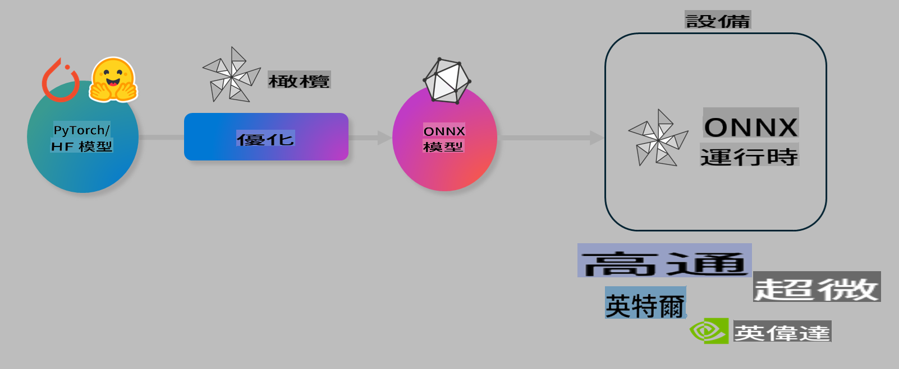

# Lab. 優化 AI 模型以進行裝置端推論

## 簡介

> [!IMPORTANT]
> 這個實驗需要一個 **Nvidia A10 或 A100 GPU**，並安裝相關驅動程式和 CUDA 工具包（版本 12+）。

> [!NOTE]
> 這是一個 **35 分鐘** 的實驗，將帶你動手體驗使用 OLIVE 優化裝置端推論模型的核心概念。

## 學習目標

完成本實驗後，你將能使用 OLIVE 來：

- 使用 AWQ 量化方法對 AI 模型進行量化。
- 為特定任務微調 AI 模型。
- 生成適用於 ONNX Runtime 的 LoRA 配接器（微調後的模型），以實現高效的裝置端推論。

### 什麼是 Olive

Olive (*O*NNX *live*) 是一個模型優化工具包，並配有 CLI，能幫助你為 ONNX runtime +++https://onnxruntime.ai+++ 提供高品質和高效能的模型。



Olive 的輸入通常是一個 PyTorch 或 Hugging Face 模型，輸出則是一個經過優化的 ONNX 模型，能在運行 ONNX runtime 的裝置（部署目標）上執行。Olive 會根據硬體供應商（如 Qualcomm、AMD、Nvidia 或 Intel）提供的 AI 加速器（NPU、GPU、CPU）來優化模型。

Olive 執行一個 *工作流程*，這是一系列有序的模型優化任務，稱為 *passes*，例如：模型壓縮、圖形捕獲、量化、圖形優化。每個 pass 都有一組參數，可以進行調整以達到最佳的準確性和延遲等評估指標。Olive 使用搜尋策略和演算法，逐一或組合調整各個 pass 的參數。

#### Olive 的優勢

- **減少試錯的挫折和時間**：手動嘗試不同圖形優化、壓縮和量化技術的過程可能很繁瑣。你只需定義品質和效能的限制條件，Olive 就會自動幫你找到最佳模型。
- **超過 40 種內建模型優化元件**：涵蓋量化、壓縮、圖形優化和微調等前沿技術。
- **易於使用的 CLI**：用於常見的模型優化任務，例如 `olive quantize`、`olive auto-opt`、`olive finetune`。
- 內建的模型打包和部署功能。
- 支援生成適用於 **Multi LoRA serving** 的模型。
- 使用 YAML/JSON 構建工作流程來協調模型優化和部署任務。
- 與 **Hugging Face** 和 **Azure AI** 整合。
- 內建 **快取機制**，可 **節省成本**。

## 實驗指導

> [!NOTE]
> 請確保你已按 Lab 1 的指導完成 Azure AI Hub 和專案的配置，並設置好 A100 計算資源。

### 步驟 0：連接到 Azure AI 計算資源

你將使用 **VS Code** 的遠端功能連接到 Azure AI 計算資源。

1. 打開你的 **VS Code** 桌面應用程式：
2. 使用 **Shift+Ctrl+P** 打開 **命令面板**。
3. 在命令面板中搜尋 **AzureML - remote: Connect to compute instance in New Window**。
4. 按照螢幕上的指示連接到計算資源，這包括選擇你在 Lab 1 中設置的 Azure 訂閱、資源群組、專案和計算名稱。
5. 成功連接後，**VS Code 左下角**會顯示連接狀態 `><Azure ML: Compute Name`。

### 步驟 1：克隆這個儲存庫

在 VS Code 中，使用 **Ctrl+J** 打開新終端，並克隆這個儲存庫：

在終端中輸入提示：

```
azureuser@computername:~/cloudfiles/code$ 
```
克隆解決方案：

```bash
cd ~/localfiles
git clone https://github.com/microsoft/phi-3cookbook.git
```

### 步驟 2：在 VS Code 中開啟資料夾

要在 VS Code 中開啟相關資料夾，請在終端執行以下命令，這會打開一個新視窗：

```bash
code phi-3cookbook/code/04.Finetuning/Olive-lab
```

或者，選擇 **檔案** > **開啟資料夾** 手動開啟。

### 步驟 3：安裝依賴項

在 Azure AI 計算實例中，於 VS Code 打開終端視窗（提示：**Ctrl+J**），執行以下命令安裝依賴項：

```bash
conda create -n olive-ai python=3.11 -y
conda activate olive-ai
pip install -r requirements.txt
az extension remove -n azure-cli-ml
az extension add -n ml
```

> [!NOTE]
> 安裝所有依賴項大約需要 **5 分鐘**。

在本實驗中，你將下載並上傳模型到 Azure AI 模型目錄。為了訪問模型目錄，你需要使用以下命令登錄 Azure：

```bash
az login
```

> [!NOTE]
> 登錄時會要求你選擇訂閱。請確保選擇為此實驗提供的訂閱。

### 步驟 4：執行 Olive 命令

在 Azure AI 計算實例中，於 VS Code 打開終端視窗（提示：**Ctrl+J**），並確保 `olive-ai` conda 環境已啟動：

```bash
conda activate olive-ai
```

接下來，在命令行執行以下 Olive 命令。

1. **檢查數據：** 在此範例中，你將微調 Phi-3.5-Mini 模型，使其專注於回答旅行相關問題。以下代碼顯示數據集的前幾條記錄，數據格式為 JSON lines：

    ```bash
    head data/data_sample_travel.jsonl
    ```
2. **量化模型：** 在訓練模型之前，先使用 Active Aware Quantization (AWQ) 技術進行量化 +++https://arxiv.org/abs/2306.00978+++。AWQ 根據推論過程中生成的激活值來量化模型的權重，這樣可以更好地保留模型準確性，相較於傳統權重量化方法。

    ```bash
    olive quantize \
       --model_name_or_path microsoft/Phi-3.5-mini-instruct \
       --trust_remote_code \
       --algorithm awq \
       --output_path models/phi/awq \
       --log_level 1
    ```
    
    完成 AWQ 量化約需 **8 分鐘**，這將 **將模型大小從約 7.5GB 減少到約 2.5GB**。
   
   在本實驗中，我們展示如何從 Hugging Face 輸入模型（例如：`microsoft/Phi-3.5-mini-instruct`). However, Olive also allows you to input models from the Azure AI catalog by updating the `model_name_or_path` argument to an Azure AI asset ID (for example:  `azureml://registries/azureml/models/Phi-3.5-mini-instruct/versions/4`). 

1. **Train the model:** Next, the `olive finetune` 命令微調量化後的模型。先量化再微調能得到更好的準確性，因為微調過程能恢復部分量化損失。

    ```bash
    olive finetune \
        --method lora \
        --model_name_or_path models/phi/awq \
        --data_files "data/data_sample_travel.jsonl" \
        --data_name "json" \
        --text_template "<|user|>\n{prompt}<|end|>\n<|assistant|>\n{response}<|end|>" \
        --max_steps 100 \
        --output_path ./models/phi/ft \
        --log_level 1
    ```
    
    微調（100 步）約需 **6 分鐘** 完成。

3. **優化：** 模型訓練完成後，使用 Olive 的 `auto-opt` command, which will capture the ONNX graph and automatically perform a number of optimizations to improve the model performance for CPU by compressing the model and doing fusions. It should be noted, that you can also optimize for other devices such as NPU or GPU by just updating the `--device` and `--provider` 參數優化模型。但在本實驗中，我們將使用 CPU。

    ```bash
    olive auto-opt \
       --model_name_or_path models/phi/ft/model \
       --adapter_path models/phi/ft/adapter \
       --device cpu \
       --provider CPUExecutionProvider \
       --use_ort_genai \
       --output_path models/phi/onnx-ao \
       --log_level 1
    ```
    
    完成優化約需 **5 分鐘**。

### 步驟 5：模型推論快速測試

為測試模型推論，請在資料夾中創建一個名為 **app.py** 的 Python 文件，並複製以下代碼：

```python
import onnxruntime_genai as og
import numpy as np

print("loading model and adapters...", end="", flush=True)
model = og.Model("models/phi/onnx-ao/model")
adapters = og.Adapters(model)
adapters.load("models/phi/onnx-ao/model/adapter_weights.onnx_adapter", "travel")
print("DONE!")

tokenizer = og.Tokenizer(model)
tokenizer_stream = tokenizer.create_stream()

params = og.GeneratorParams(model)
params.set_search_options(max_length=100, past_present_share_buffer=False)
user_input = "what is the best thing to see in chicago"
params.input_ids = tokenizer.encode(f"<|user|>\n{user_input}<|end|>\n<|assistant|>\n")

generator = og.Generator(model, params)

generator.set_active_adapter(adapters, "travel")

print(f"{user_input}")

while not generator.is_done():
    generator.compute_logits()
    generator.generate_next_token()

    new_token = generator.get_next_tokens()[0]
    print(tokenizer_stream.decode(new_token), end='', flush=True)

print("\n")
```

執行代碼：

```bash
python app.py
```

### 步驟 6：將模型上傳到 Azure AI

將模型上傳到 Azure AI 模型儲存庫可以讓團隊其他成員共享模型，並處理模型的版本控制。運行以下命令上傳模型：

> [!NOTE]
> 更新 `{}` placeholders with the name of your resource group and Azure AI Project Name. 

To find your resource group `` 中的 `resourceGroup` 和 Azure AI 專案名稱，執行以下命令：

```
az ml workspace show
```

或者，訪問 +++ai.azure.com+++，選擇 **管理中心** > **專案** > **概覽**。

更新 `{}` 佔位符為你的資源群組和 Azure AI 專案名稱。

```bash
az ml model create \
    --name ft-for-travel \
    --version 1 \
    --path ./models/phi/onnx-ao \
    --resource-group {RESOURCE_GROUP_NAME} \
    --workspace-name {PROJECT_NAME}
```
你可以在 https://ml.azure.com/model/list 查看已上傳的模型並進行部署。

**免責聲明**：  
本文件使用機器人工智能翻譯服務進行翻譯。我們致力於確保準確性，但請注意，自動翻譯可能包含錯誤或不準確之處。應以原文作為權威來源。如涉及關鍵信息，建議尋求專業人工翻譯。我們對因使用此翻譯而引起的任何誤解或誤讀概不負責。