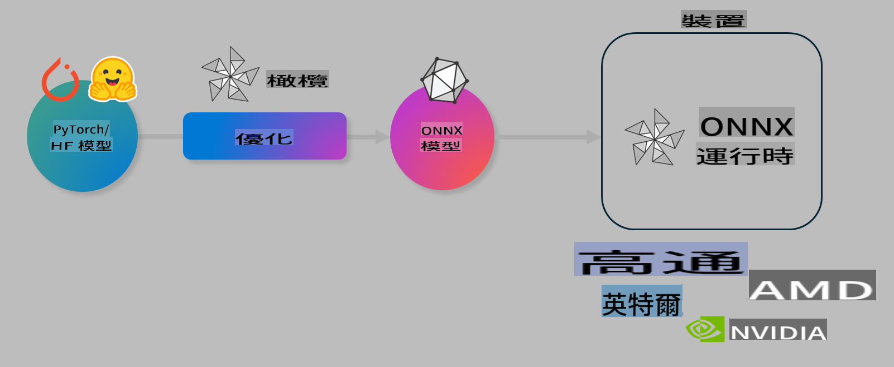

# 實驗室：優化 AI 模型以進行設備端推理

## 簡介

> [!IMPORTANT]  
> 本實驗室需要安裝 **Nvidia A10 或 A100 GPU**，並配有相關驅動程序和 CUDA 工具包（版本 12+）。

> [!NOTE]  
> 這是一個 **35 分鐘** 的實驗室，將讓您親身體驗如何使用 OLIVE 優化模型以進行設備端推理的核心概念。

## 學習目標

完成本實驗室後，您將能夠使用 OLIVE 來：

- 使用 AWQ 量化方法對 AI 模型進行量化。
- 為特定任務微調 AI 模型。
- 為 ONNX Runtime 生成 LoRA 適配器（微調模型），以提高設備端推理效率。

### 什麼是 Olive

Olive (*O*NNX *live*) 是一個模型優化工具包，配備命令行界面 (CLI)，幫助您為 ONNX runtime +++https://onnxruntime.ai+++ 部署高質量、高性能的模型。



Olive 的輸入通常是一個 PyTorch 或 Hugging Face 模型，輸出則是一個優化後的 ONNX 模型，該模型可在運行 ONNX runtime 的設備（部署目標）上執行。Olive 將根據硬件供應商（如 Qualcomm、AMD、Nvidia 或 Intel）提供的 AI 加速器（NPU、GPU、CPU）來優化模型。

Olive 執行一個 *工作流程*，這是一系列有序的模型優化任務，稱為 *passes*——例如模型壓縮、圖形捕獲、量化、圖形優化等。每個 pass 都有一組參數，可以調整以實現最佳的指標（例如準確性和延遲），這些指標由相應的評估器進行評估。Olive 使用搜索算法自動調整每個 pass 或多個 pass 的參數，來達到最佳效果。

#### Olive 的優勢

- **減少挫敗感和時間**：避免手動試驗各種圖形優化、壓縮和量化技術的反覆試錯。只需定義您的質量和性能約束，Olive 將自動為您找到最佳模型。
- **40+ 種內置模型優化組件**：涵蓋量化、壓縮、圖形優化和微調的尖端技術。
- **簡單易用的 CLI**：針對常見模型優化任務，例如 `olive quantize`、`olive auto-opt`、`olive finetune`。
- 內置模型打包和部署功能。
- 支持生成 **多 LoRA 服務** 模型。
- 使用 YAML/JSON 構建工作流程，協調模型優化和部署任務。
- **Hugging Face** 和 **Azure AI** 集成。
- 內置 **緩存機制**，以 **節省成本**。

## 實驗室說明

> [!NOTE]  
> 請確保您已按照實驗室 1 的要求，設置好您的 Azure AI Hub 和項目，以及 A100 計算資源。

### 步驟 0：連接到您的 Azure AI 計算資源

您將使用 **VS Code** 的遠程功能連接到 Azure AI 計算資源。

1. 打開 **VS Code** 桌面應用程式：  
1. 使用 **Shift+Ctrl+P** 打開 **命令面板**。  
1. 在命令面板中搜索 **AzureML - remote: Connect to compute instance in New Window**。  
1. 按照屏幕上的指示連接到計算資源，這包括選擇您在實驗室 1 中設置的 Azure 訂閱、資源組、項目和計算資源名稱。  
1. 成功連接後，您將在 **VS Code 左下角** 看到連接狀態 `><Azure ML: Compute Name`。

### 步驟 1：克隆此倉庫

在 VS Code 中，使用 **Ctrl+J** 打開新終端並克隆此倉庫：

在終端中，您應該看到提示：

```
azureuser@computername:~/cloudfiles/code$ 
```  
克隆解決方案  

```bash
cd ~/localfiles
git clone https://github.com/microsoft/phi-3cookbook.git
```  

### 步驟 2：在 VS Code 中打開資料夾

要在相關資料夾中打開 VS Code，請在終端中執行以下命令，這將打開一個新窗口：

```bash
code phi-3cookbook/code/04.Finetuning/Olive-lab
```  

或者，您也可以通過選擇 **文件** > **打開資料夾** 來手動打開。

### 步驟 3：安裝依賴項

在 VS Code 的 Azure AI 計算資源上打開一個終端窗口（提示：**Ctrl+J**），並執行以下命令以安裝依賴項：

```bash
conda create -n olive-ai python=3.11 -y
conda activate olive-ai
pip install -r requirements.txt
az extension remove -n azure-cli-ml
az extension add -n ml
```  

> [!NOTE]  
> 安裝所有依賴項約需 **5 分鐘**。

在本實驗室中，您將下載並上傳模型到 Azure AI 模型目錄。為了訪問模型目錄，您需要登錄 Azure：

```bash
az login
```  

> [!NOTE]  
> 登錄時系統會要求您選擇訂閱。請確保選擇本實驗室提供的訂閱。

### 步驟 4：執行 Olive 命令

在 VS Code 的 Azure AI 計算資源上打開一個終端窗口（提示：**Ctrl+J**），並確保激活 `olive-ai` conda 環境：

```bash
conda activate olive-ai
```  

接下來，在命令行中執行以下 Olive 命令。

1. **檢查數據**：在此示例中，您將微調 Phi-3.5-Mini 模型，使其專注於回答與旅行相關的問題。以下代碼顯示數據集的前幾條記錄（JSON lines 格式）：

    ```bash
    head data/data_sample_travel.jsonl
    ```  

1. **量化模型**：在訓練模型之前，先使用以下命令進行量化，該命令採用名為 Active Aware Quantization (AWQ) 的技術 +++https://arxiv.org/abs/2306.00978+++。AWQ 根據推理期間生成的激活值來量化模型的權重，這意味著量化過程考慮了激活數據的實際分佈，相較於傳統權重量化方法能更好地保留模型準確性。

    ```bash
    olive quantize \
       --model_name_or_path microsoft/Phi-3.5-mini-instruct \
       --trust_remote_code \
       --algorithm awq \
       --output_path models/phi/awq \
       --log_level 1
    ```  

    完成 AWQ 量化約需 **8 分鐘**，這將 **把模型大小從 ~7.5GB 減少到 ~2.5GB**。

    在本實驗室中，我們將展示如何從 Hugging Face 載入模型（例如：`microsoft/Phi-3.5-mini-instruct`). However, Olive also allows you to input models from the Azure AI catalog by updating the `model_name_or_path` argument to an Azure AI asset ID (for example:  `azureml://registries/azureml/models/Phi-3.5-mini-instruct/versions/4`). 

1. **Train the model:** Next, the `olive finetune` 命令微調量化模型）。在微調之前進行量化，而不是之後，能提供更好的準確性，因為微調過程能恢復一些因量化而損失的性能。

    ```bash
    olive finetune \
        --method lora \
        --model_name_or_path models/phi/awq \
        --data_files "data/data_sample_travel.jsonl" \
        --data_name "json" \
        --text_template "<|user|>\n{prompt}<|end|>\n<|assistant|>\n{response}<|end|>" \
        --max_steps 100 \
        --output_path ./models/phi/ft \
        --log_level 1
    ```  

    微調約需 **6 分鐘**（100 步）。

1. **優化模型**：模型訓練完成後，您可以使用 Olive 的 `auto-opt` command, which will capture the ONNX graph and automatically perform a number of optimizations to improve the model performance for CPU by compressing the model and doing fusions. It should be noted, that you can also optimize for other devices such as NPU or GPU by just updating the `--device` and `--provider` 參數來優化模型——但在本實驗室中，我們將使用 CPU。

    ```bash
    olive auto-opt \
       --model_name_or_path models/phi/ft/model \
       --adapter_path models/phi/ft/adapter \
       --device cpu \
       --provider CPUExecutionProvider \
       --use_ort_genai \
       --output_path models/phi/onnx-ao \
       --log_level 1
    ```  

    優化約需 **5 分鐘**。

### 步驟 5：快速測試模型推理

為測試模型推理，請在資料夾中創建一個名為 **app.py** 的 Python 文件，並將以下代碼複製粘貼進去：

```python
import onnxruntime_genai as og
import numpy as np

print("loading model and adapters...", end="", flush=True)
model = og.Model("models/phi/onnx-ao/model")
adapters = og.Adapters(model)
adapters.load("models/phi/onnx-ao/model/adapter_weights.onnx_adapter", "travel")
print("DONE!")

tokenizer = og.Tokenizer(model)
tokenizer_stream = tokenizer.create_stream()

params = og.GeneratorParams(model)
params.set_search_options(max_length=100, past_present_share_buffer=False)
user_input = "what is the best thing to see in chicago"
params.input_ids = tokenizer.encode(f"<|user|>\n{user_input}<|end|>\n<|assistant|>\n")

generator = og.Generator(model, params)

generator.set_active_adapter(adapters, "travel")

print(f"{user_input}")

while not generator.is_done():
    generator.compute_logits()
    generator.generate_next_token()

    new_token = generator.get_next_tokens()[0]
    print(tokenizer_stream.decode(new_token), end='', flush=True)

print("\n")
```  

使用以下命令執行代碼：

```bash
python app.py
```  

### 步驟 6：將模型上傳到 Azure AI

將模型上傳到 Azure AI 模型倉庫，可以讓您的開發團隊成員共享模型，並處理模型的版本控制。運行以下命令上傳模型：

> [!NOTE]  
> 更新 `{}` 中的 `resourceGroup` 和 Azure AI 項目名稱，然後運行以下命令：

```
az ml workspace show
```  

或者，您可以通過訪問 +++ai.azure.com+++，選擇 **管理中心** > **項目** > **概覽** 來進行操作。

更新 `{}` 佔位符，填入您的資源組名稱和 Azure AI 項目名稱。

```bash
az ml model create \
    --name ft-for-travel \
    --version 1 \
    --path ./models/phi/onnx-ao \
    --resource-group {RESOURCE_GROUP_NAME} \
    --workspace-name {PROJECT_NAME}
```  

您可以在 https://ml.azure.com/model/list 查看已上傳的模型並進行部署。

**免責聲明**：  
本文件經由機器翻譯人工智能服務進行翻譯。雖然我們努力確保準確性，但請注意，自動翻譯可能包含錯誤或不準確之處。應以原文文件作為權威來源。對於關鍵信息，建議使用專業人工翻譯。我們對因使用本翻譯而引起的任何誤解或誤讀概不負責。