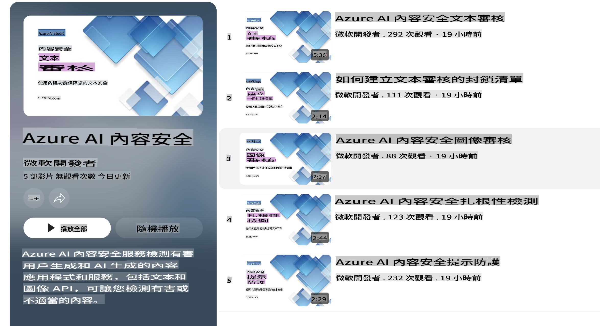

# Phi 模型的 AI 安全性  
Phi 系列模型根據 [Microsoft Responsible AI Standard](https://query.prod.cms.rt.microsoft.com/cms/api/am/binary/RE5cmFl) 開發，該標準是基於以下六項原則的公司級別要求：問責性、透明性、公平性、可靠性與安全性、隱私與安全性，以及包容性，這些構成了 [Microsoft 的負責任 AI 原則](https://www.microsoft.com/ai/responsible-ai)。  

與之前的 Phi 模型一樣，我們採用了多方面的安全評估和安全後訓練方法，並針對此次版本的多語言能力採取了額外措施。我們的安全訓練和評估方法，包括在多種語言和風險類別中的測試，詳見 [Phi Safety Post-Training Paper](https://arxiv.org/abs/2407.13833)。雖然 Phi 模型受益於這些方法，但開發者應該採用負責任的 AI 最佳實踐，包括根據具體使用場景以及文化和語言背景來映射、衡量和減輕相關風險。  

## 最佳實踐  

與其他模型一樣，Phi 系列模型可能表現出不公平、不可靠或冒犯性的行為。  

需要注意的一些 SLM 和 LLM 限制行為包括：  

- **服務質量：** Phi 模型主要基於英文文本進行訓練。非英文語言的性能會較差，而在訓練數據中代表性較低的英語變體，其性能可能比標準美式英語更差。  
- **傷害表徵與刻板印象延續：** 這些模型可能會過度或不足地表徵某些群體，抹去某些群體的表徵，或強化貶低或負面的刻板印象。儘管進行了安全後訓練，由於不同群體的代表性差異或訓練數據中反映現實世界模式和社會偏見的負面刻板印象示例的存在，這些限制可能仍然存在。  
- **不當或冒犯性內容：** 這些模型可能生成其他類型的不當或冒犯性內容，這可能使其在敏感情境中部署時不合適，除非採取針對具體使用場景的額外緩解措施。  
- **信息可靠性：** 語言模型可能生成無意義的內容或捏造聽起來合理但實際不準確或過時的內容。  
- **代碼範圍有限：** Phi-3 訓練數據的大部分基於 Python，並使用常見的包如 "typing, math, random, collections, datetime, itertools"。如果模型生成的 Python 腳本使用了其他包或其他語言的腳本，我們強烈建議用戶手動驗證所有 API 的使用。  

開發者應該應用負責任的 AI 最佳實踐，並確保特定使用場景符合相關法律和法規（如隱私、貿易等）。  

## 負責任 AI 的考量  

與其他語言模型一樣，Phi 系列模型可能表現出不公平、不可靠或冒犯性的行為。需要注意的一些限制行為包括：  

**服務質量：** Phi 模型主要基於英文文本進行訓練。非英文語言的性能會較差，而在訓練數據中代表性較低的英語變體，其性能可能比標準美式英語更差。  

**傷害表徵與刻板印象延續：** 這些模型可能會過度或不足地表徵某些群體，抹去某些群體的表徵，或強化貶低或負面的刻板印象。儘管進行了安全後訓練，由於不同群體的代表性差異或訓練數據中反映現實世界模式和社會偏見的負面刻板印象示例的存在，這些限制可能仍然存在。  

**不當或冒犯性內容：** 這些模型可能生成其他類型的不當或冒犯性內容，這可能使其在敏感情境中部署時不合適，除非採取針對具體使用場景的額外緩解措施。  

**信息可靠性：** 語言模型可能生成無意義的內容或捏造聽起來合理但實際不準確或過時的內容。  

**代碼範圍有限：** Phi-3 訓練數據的大部分基於 Python，並使用常見的包如 "typing, math, random, collections, datetime, itertools"。如果模型生成的 Python 腳本使用了其他包或其他語言的腳本，我們強烈建議用戶手動驗證所有 API 的使用。  

開發者應該應用負責任的 AI 最佳實踐，並確保特定使用場景符合相關法律和法規（如隱私、貿易等）。需要重點考慮的領域包括：  

**資源分配：** 模型可能不適合對法律地位或資源或生活機會分配（如住房、就業、信貸等）有重大影響的場景，除非進行進一步的評估和額外的去偏技術。  

**高風險場景：** 開發者應評估模型在高風險場景中的適用性，因為不公平、不可靠或冒犯性的輸出可能帶來極高成本或造成傷害。這包括在敏感或專業領域提供建議的情境中，準確性和可靠性至關重要（如法律或健康建議）。應根據部署背景在應用層實施額外的保護措施。  

**錯誤信息：** 模型可能生成不準確的信息。開發者應遵循透明性最佳實踐，告知終端用戶他們正在與 AI 系統互動。在應用層，開發者可以構建反饋機制和管道，將回應基於特定使用場景的上下文信息，這種技術稱為檢索增強生成（Retrieval Augmented Generation，RAG）。  

**生成有害內容：** 開發者應根據上下文評估輸出，並使用適合其使用場景的安全分類器或定制解決方案。  

**濫用：** 其他形式的濫用（如欺詐、垃圾郵件或惡意軟件生產）可能會發生，開發者應確保其應用不違反適用的法律和法規。  

### 微調與 AI 內容安全  

在對模型進行微調後，我們強烈建議利用 [Azure AI Content Safety](https://learn.microsoft.com/azure/ai-services/content-safety/overview) 措施來監控模型生成的內容，識別並阻止潛在的風險、威脅和質量問題。  

  

[Azure AI Content Safety](https://learn.microsoft.com/azure/ai-services/content-safety/overview) 支援文字和圖片內容。它可以部署在雲端、斷開連接的容器，以及邊緣/嵌入式設備上。  

## Azure AI 內容安全概覽  

Azure AI 內容安全並非一刀切的解決方案；它可以根據企業的具體政策進行定制。此外，其多語言模型使其能夠同時理解多種語言。  

  

- **Azure AI Content Safety**  
- **Microsoft Developer**  
- **5 部影片**  

Azure AI Content Safety 服務可檢測應用和服務中用戶生成和 AI 生成的有害內容。它包括文字和圖片 API，可檢測有害或不適當的材料。  

[AI Content Safety 播放清單](https://www.youtube.com/playlist?list=PLlrxD0HtieHjaQ9bJjyp1T7FeCbmVcPkQ)  

**免責聲明**：  
此文件經由機器翻譯人工智能服務翻譯而成。我們致力於提供準確的翻譯，但請注意，自動翻譯可能包含錯誤或不準確之處。應以原文文件為權威來源。如涉及關鍵資訊，建議尋求專業人工翻譯。我們對因使用此翻譯而產生的任何誤解或誤讀概不負責。