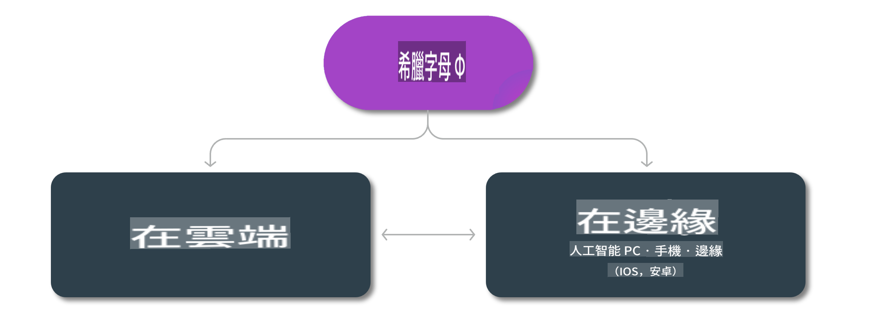

# Phi 模型及跨平台可用性

## Edge 和雲端場景

## 模型可用性及資源

| | | | | | | | | |
|-|-|-|-|-|-|-|-|-|
|模型|輸入|內容長度|Azure AI (MaaS)|Azure ML (MaaP)|ONNX|Hugging Face|Ollama|Nvidia NIM|
|Phi-3-vision-128k-instruct|文字+圖片|128k|[Playground 和部署](https://ai.azure.com/explore/models/Phi-3-vision-128k-instruct/version/2/registry/azureml)|[Playground、部署和微調](https://ml.azure.com/registries/azureml/models/Phi-3-vision-128k-instruct/version/2)|[CUDA](https://huggingface.co/microsoft/Phi-3-vision-128k-instruct-onnx-cuda/tree/main)、[CPU](https://huggingface.co/microsoft/Phi-3-vision-128k-instruct-onnx-cpu/tree/main)、[DirectML](https://huggingface.co/microsoft/Phi-3-vision-128k-instruct-onnx-directml/tree/main)|[下載](https://huggingface.co/microsoft/Phi-3-vision-128k-instruct)|-NA-|[NIM APIs](https://build.nvidia.com/microsoft/phi-3-vision-128k-instruct)|
|Phi-3-mini-4k-instruct|文字|4k|[Playground 和部署](https://aka.ms/phi3-mini-4k-azure-ml)|[Playground、部署](https://aka.ms/phi3-mini-4k-azure-ml) 和微調|[CUDA](https://huggingface.co/microsoft/Phi-3-mini-4k-instruct-onnx)、[Web](https://huggingface.co/microsoft/Phi-3-mini-4k-instruct-onnx)|[Playground 和下載](https://huggingface.co/chat/models/microsoft/Phi-3-mini-4k-instruct)|[GGUF](https://huggingface.co/microsoft/Phi-3-mini-4k-instruct-gguf)|[NIM APIs](https://build.nvidia.com/microsoft/phi-3-mini-4k)|
|Phi-3-mini-128k-instruct|文字|128k|[Playground 和部署](https://ai.azure.com/explore/models/Phi-3-mini-128k-instruct/version/9/registry/azureml)|[Playground、部署](https://ai.azure.com/explore/models/Phi-3-mini-128k-instruct/version/9/registry/azureml) 和微調|[CUDA](https://huggingface.co/microsoft/Phi-3-mini-128k-instruct-onnx)|[下載](https://huggingface.co/microsoft/Phi-3-mini-128k-instruct-onnx)|-NA-|[NIM APIs](https://build.nvidia.com/microsoft/phi-3-mini)|
|Phi-3-small-8k-instruct|文字|8k|[Playground 和部署](https://ml.azure.com/registries/azureml/models/Phi-3-small-8k-instruct/version/2)|[Playground、部署](https://ai.azure.com/explore/models/Phi-3-small-8k-instruct/version/2/registry/azureml) 和微調|[CUDA](https://huggingface.co/microsoft/Phi-3-small-8k-instruct-onnx-cuda)|[下載](https://huggingface.co/microsoft/Phi-3-small-8k-instruct-onnx-cuda)|-NA-|[NIM APIs](https://build.nvidia.com/microsoft/phi-3-small-8k-instruct?docker=false)|
|Phi-3-small-128k-instruct|文字|128k|[Playground 和部署](https://ai.azure.com/explore/models/Phi-3-small-128k-instruct/version/2/registry/azureml)|[Playground、部署](https://ml.azure.com/registries/azureml/models/Phi-3-small-128k-instruct/version/2) 和微調|[CUDA](https://huggingface.co/microsoft/Phi-3-medium-128k-instruct-onnx-cuda)|[下載](https://huggingface.co/microsoft/Phi-3-small-128k-instruct)|-NA-|[NIM APIs](https://build.nvidia.com/microsoft/phi-3-small-128k-instruct?docker=false)|
|Phi-3-medium-4k-instruct|文字|4k|[試玩及部署](https://huggingface.co/microsoft/Phi-3-medium-4k-instruct)|[試玩, 部署](https://ml.azure.com/registries/azureml/models/Phi-3-medium-4k-instruct/version/2) 及微調|[CUDA](https://huggingface.co/microsoft/Phi-3-medium-4k-instruct-onnx-cuda/tree/main), [CPU](https://huggingface.co/microsoft/Phi-3-medium-4k-instruct-onnx-cpu/tree/main), [DirectML](https://huggingface.co/microsoft/Phi-3-medium-4k-instruct-onnx-directml/tree/main)|[下載](https://huggingface.co/microsoft/Phi-3-medium-4k-instruct)|-不適用-|[NIM APIs](https://build.nvidia.com/microsoft/phi-3-medium-4k-instruct?docker=false)|
|Phi-3-medium-128k-instruct|文字|128k|[試玩及部署](https://ai.azure.com/explore/models/Phi-3-medium-128k-instruct/version/2)|[試玩, 部署](https://ml.azure.com/registries/azureml/models/Phi-3-medium-128k-instruct/version/2) 及微調|[CUDA](https://huggingface.co/microsoft/Phi-3-medium-128k-instruct-onnx-cuda/tree/main), [CPU](https://huggingface.co/microsoft/Phi-3-medium-128k-instruct-onnx-cpu/tree/main), [DirectML](https://huggingface.co/microsoft/Phi-3-medium-128k-instruct-onnx-directml/tree/main)|[下載](https://huggingface.co/microsoft/Phi-3-medium-128k-instruct)|-不適用-|-不適用-|

**免責聲明**:  
本文件使用機器翻譯人工智能服務進行翻譯。我們致力於提供準確的翻譯，但請注意，自動翻譯可能包含錯誤或不準確之處。原文的母語版本應被視為權威來源。對於關鍵資訊，建議使用專業人工翻譯。我們對於使用此翻譯所引起的任何誤解或錯誤解釋概不負責。