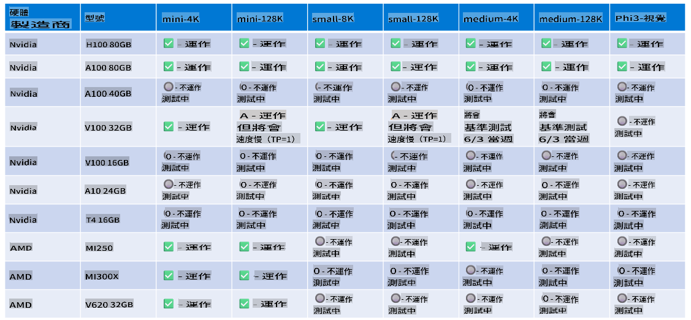

# Phi 硬件支援

Microsoft Phi 已針對 ONNX Runtime 進行優化，並支援 Windows DirectML。它在多種硬件類型上表現良好，包括 GPU、CPU，甚至是移動設備。

## 設備硬件
具體支援的硬件包括：

- GPU 型號：RTX 4090 (DirectML)
- GPU 型號：1 A100 80GB (CUDA)
- CPU 型號：Standard F64s v2 (64 vCPUs, 128 GiB 記憶體)

## 移動設備型號

- Android - Samsung Galaxy S21
- Apple iPhone 14 或更高版本 A16/A17 處理器

## Phi 硬件規格

- 最低配置要求：
  - Windows: 支援 DirectX 12 的 GPU 和至少 4GB 的總 RAM

CUDA: NVIDIA GPU，計算能力 >= 7.02



## 在多 GPU 上運行 onnxruntime

目前可用的 Phi ONNX 模型僅支援 1 個 GPU。Phi 模型是可以支援多 GPU 的，但使用 ORT 配合 2 個 GPU 並不保證會比使用 2 個 ORT 實例提供更高的吞吐量。請參閱 [ONNX Runtime](https://onnxruntime.ai/) 獲取最新資訊。

在 [Build 2024 GenAI ONNX 團隊](https://youtu.be/WLW4SE8M9i8?si=EtG04UwDvcjunyfC) 宣佈，他們已為 Phi 模型啟用了多實例模式，而非多 GPU 模式。

目前，這使您可以通過如下設置 CUDA_VISIBLE_DEVICES 環境變量來運行一個 onnxruntime 或 onnxruntime-genai 實例。

```Python
CUDA_VISIBLE_DEVICES=0 python infer.py
CUDA_VISIBLE_DEVICES=1 python infer.py
```

歡迎到 [Azure AI Foundry](https://ai.azure.com) 探索更多關於 Phi 的資訊。

**免責聲明**:  
此文件乃使用機器翻譯人工智能服務進行翻譯。雖然我們致力於提供準確的翻譯，但請注意，自動翻譯可能包含錯誤或不準確之處。應以原文文件為權威來源。如涉及關鍵資訊，建議尋求專業人工翻譯。我們對因使用此翻譯而產生的任何誤解或誤釋概不負責。