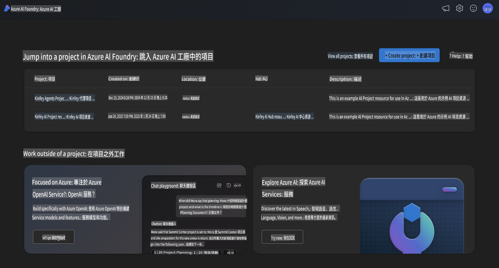
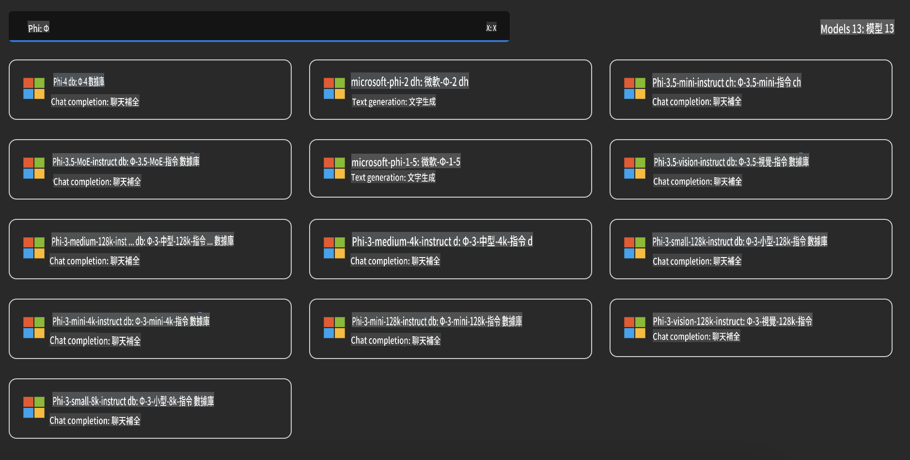
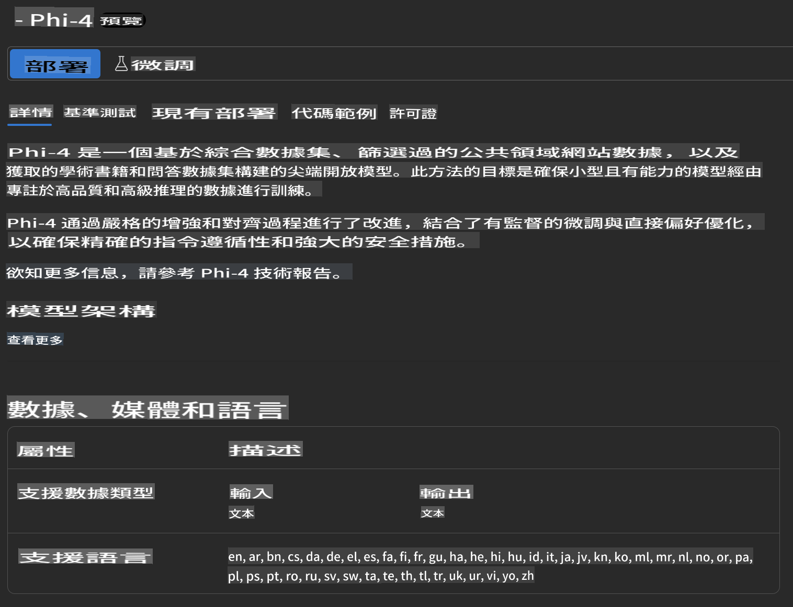
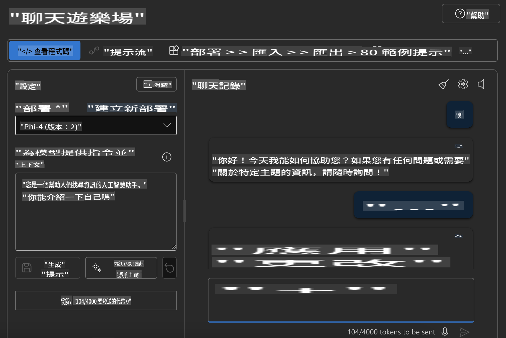

## Azure AI Foundry 中的 Phi 系列

[Azure AI Foundry](https://ai.azure.com) 是一個值得信賴的平台，讓開發者能以安全、可靠且負責任的方式，利用 AI 推動創新，塑造未來。

[Azure AI Foundry](https://ai.azure.com) 為開發者提供以下功能：

- 在企業級平台上構建生成式 AI 應用程式。
- 使用最先進的 AI 工具和機器學習模型進行探索、構建、測試和部署，並以負責任的 AI 實踐為基礎。
- 與團隊合作，覆蓋應用程式開發的全生命周期。

透過 Azure AI Foundry，你可以探索多種模型、服務和功能，並開始構建最能滿足你目標的 AI 應用程式。Azure AI Foundry 平台支援從概念驗證到全面生產應用的無縫擴展。持續的監控和改進為長期成功提供保障。



除了在 Azure AI Foundry 中使用 Azure AOAI 服務外，你還可以在 Azure AI Foundry 模型目錄中使用第三方模型。如果你希望將 Azure AI Foundry 作為你的 AI 解決方案平台，這是一個不錯的選擇。

我們可以通過 Azure AI Foundry 的模型目錄快速部署 Phi 系列模型。



### **在 Azure AI Foundry 中部署 Phi-4**



### **在 Azure AI Foundry Playground 測試 Phi-4**



### **執行 Python 程式碼以調用 Azure AI Foundry Phi-4**

```python

import os  
import base64
from openai import AzureOpenAI  
from azure.identity import DefaultAzureCredential, get_bearer_token_provider  
        
endpoint = os.getenv("ENDPOINT_URL", "Your Azure AOAI Service Endpoint")  
deployment = os.getenv("DEPLOYMENT_NAME", "Phi-4")  
      
token_provider = get_bearer_token_provider(  
    DefaultAzureCredential(),  
    "https://cognitiveservices.azure.com/.default"  
)  
  
client = AzureOpenAI(  
    azure_endpoint=endpoint,  
    azure_ad_token_provider=token_provider,  
    api_version="2024-05-01-preview",  
)  
  

chat_prompt = [
    {
        "role": "system",
        "content": "You are an AI assistant that helps people find information."
    },
    {
        "role": "user",
        "content": "can you introduce yourself"
    }
] 
    
# Include speech result if speech is enabled  
messages = chat_prompt 

completion = client.chat.completions.create(  
    model=deployment,  
    messages=messages,
    max_tokens=800,  
    temperature=0.7,  
    top_p=0.95,  
    frequency_penalty=0,  
    presence_penalty=0,
    stop=None,  
    stream=False  
)  
  
print(completion.to_json())  

```

**免責聲明**：  
本文件經由機器翻譯人工智能服務進行翻譯。我們致力於提供準確的翻譯，但請注意，自動翻譯可能包含錯誤或不準確之處。原文檔的母語版本應被視為具有權威性的來源。如需處理關鍵信息，建議使用專業人工翻譯。我們對因使用此翻譯而引起的任何誤解或誤釋概不承擔責任。