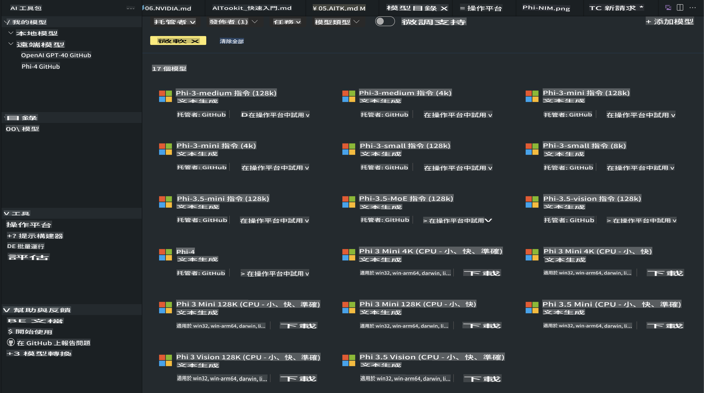
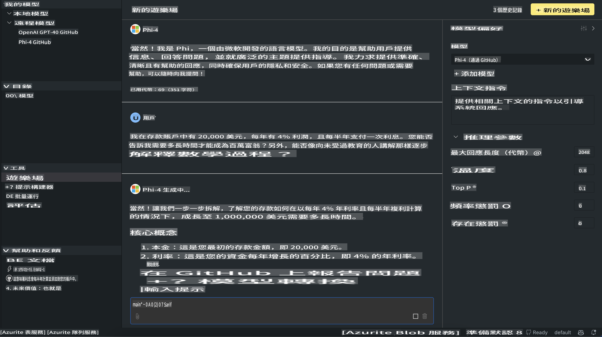

# AITK 中的 Phi 家族

[AI Toolkit for VS Code](https://marketplace.visualstudio.com/items?itemName=ms-windows-ai-studio.windows-ai-studio) 令生成式 AI 應用開發變得更簡單，結合了最先進的 AI 開發工具和來自 Azure AI Foundry Catalog 以及其他平台（如 Hugging Face）的模型。你可以瀏覽由 GitHub Models 和 Azure AI Foundry Model Catalogs 支援的 AI 模型目錄，並將它們下載到本地或遠端，進行微調、測試，然後在你的應用程式中使用。

AI Toolkit 預覽版會在本地運行。本地推理或微調取決於你選擇的模型，你可能需要像 NVIDIA CUDA GPU 這樣的 GPU。你也可以直接使用 AITK 運行 GitHub Models。

## 開始使用

[了解如何安裝 Windows 子系統 Linux](https://learn.microsoft.com/windows/wsl/install?WT.mc_id=aiml-137032-kinfeylo)

以及[更改預設的 Linux 發行版本](https://learn.microsoft.com/windows/wsl/install#change-the-default-linux-distribution-installed)。

[AI Toolkit GitHub Repo](https://github.com/microsoft/vscode-ai-toolkit/)

- Windows、Linux、macOS
  
- 若要在 Windows 和 Linux 上進行微調，你需要一張 Nvidia GPU。此外，**Windows** 需要安裝帶有 Ubuntu 18.4 或更高版本的子系統 Linux。[了解如何安裝 Windows 子系統 Linux](https://learn.microsoft.com/windows/wsl/install) 以及[更改預設的 Linux 發行版本](https://learn.microsoft.com/windows/wsl/install#change-the-default-linux-distribution-installed)。

### 安裝 AI Toolkit

AI Toolkit 是以 [Visual Studio Code 擴展](https://code.visualstudio.com/docs/setup/additional-components#_vs-code-extensions) 的形式提供的，因此你需要先安裝 [VS Code](https://code.visualstudio.com/docs/setup/windows?WT.mc_id=aiml-137032-kinfeylo)，然後從 [VS Marketplace](https://marketplace.visualstudio.com/items?itemName=ms-windows-ai-studio.windows-ai-studio) 下載 AI Toolkit。  
[AI Toolkit 可以在 Visual Studio Marketplace 中找到](https://marketplace.visualstudio.com/items?itemName=ms-windows-ai-studio.windows-ai-studio)，安裝方式與其他 VS Code 擴展一樣。

如果你不熟悉安裝 VS Code 擴展，可以按照以下步驟：

### 登入

1. 在 VS Code 的活動欄中選擇 **Extensions**
2. 在擴展搜索欄中輸入 "AI Toolkit"
3. 選擇 "AI Toolkit for Visual Studio code"
4. 點擊 **Install**

現在，你已經準備好使用這個擴展了！

系統會提示你登入 GitHub，請點擊 "Allow" 繼續。你將被重定向到 GitHub 登入頁面。

請登入並按照流程完成步驟。成功完成後，你將被重定向回 VS Code。

當擴展安裝完成後，你會在活動欄中看到 AI Toolkit 的圖標。

現在讓我們來探索可用的功能吧！

### 可用的功能

AI Toolkit 的主側邊欄包含以下功能：

- **Models**
- **Resources**
- **Playground**
- **Fine-tuning**
- **Evaluation**

這些功能可以在 Resources 部分找到。要開始，請選擇 **Model Catalog**。

### 從目錄中下載模型

在 VS Code 側邊欄啟動 AI Toolkit 後，你可以選擇以下選項：



- 在 **Model Catalog** 中找到支援的模型並下載到本地
- 在 **Model Playground** 中測試模型推理
- 在 **Model Fine-tuning** 中本地或遠端進行模型微調
- 通過 AI Toolkit 的命令面板將微調的模型部署到雲端
- 評估模型

> [!NOTE]
>
> **GPU 與 CPU**
>
> 你會注意到模型卡片顯示了模型大小、平台和加速器類型（CPU、GPU）。為了在**至少有一張 GPU 的 Windows 設備**上獲得最佳性能，請選擇僅針對 Windows 的模型版本。
>
> 這可以確保你使用的模型已針對 DirectML 加速器進行優化。
>
> 模型名稱的格式為：
>
> - `{model_name}-{accelerator}-{quantization}-{format}`。
>
>要檢查你的 Windows 設備是否有 GPU，打開 **Task Manager**，然後選擇 **Performance** 標籤。如果有 GPU，它們會顯示為 "GPU 0" 或 "GPU 1" 等名稱。

### 在 Playground 中運行模型

當所有參數設置完成後，點擊 **Generate Project**。

當模型下載完成後，請在目錄中的模型卡片上選擇 **Load in Playground**：

- 啟動模型下載
- 安裝所有必要的前置條件和依賴項
- 創建 VS Code 工作區



### 在應用程式中使用 REST API

AI Toolkit 提供了一個本地 REST API 網頁伺服器，運行於 **5272 端口**，並使用 [OpenAI chat completions 格式](https://platform.openai.com/docs/api-reference/chat/create)。

這使你能夠在本地測試應用程式，而不需要依賴雲端 AI 模型服務。例如，以下 JSON 文件展示了如何配置請求的主體：

```json
{
    "model": "Phi-4",
    "messages": [
        {
            "role": "user",
            "content": "what is the golden ratio?"
        }
    ],
    "temperature": 0.7,
    "top_p": 1,
    "top_k": 10,
    "max_tokens": 100,
    "stream": true
}
```

你可以使用 [Postman](https://www.postman.com/) 或 CURL（Client URL）工具來測試 REST API：

```bash
curl -vX POST http://127.0.0.1:5272/v1/chat/completions -H 'Content-Type: application/json' -d @body.json
```

### 使用 OpenAI Python 客戶端庫

```python
from openai import OpenAI

client = OpenAI(
    base_url="http://127.0.0.1:5272/v1/", 
    api_key="x" # required for the API but not used
)

chat_completion = client.chat.completions.create(
    messages=[
        {
            "role": "user",
            "content": "what is the golden ratio?",
        }
    ],
    model="Phi-4",
)

print(chat_completion.choices[0].message.content)
```

### 使用 Azure OpenAI .NET 客戶端庫

使用 NuGet 將 [Azure OpenAI .NET 客戶端庫](https://www.nuget.org/packages/Azure.AI.OpenAI/) 添加到你的項目中：

```bash
dotnet add {project_name} package Azure.AI.OpenAI --version 1.0.0-beta.17
```

新增一個名為 **OverridePolicy.cs** 的 C# 文件到你的項目中，並粘貼以下代碼：

```csharp
// OverridePolicy.cs
using Azure.Core.Pipeline;
using Azure.Core;

internal partial class OverrideRequestUriPolicy(Uri overrideUri)
    : HttpPipelineSynchronousPolicy
{
    private readonly Uri _overrideUri = overrideUri;

    public override void OnSendingRequest(HttpMessage message)
    {
        message.Request.Uri.Reset(_overrideUri);
    }
}
```

接下來，將以下代碼粘貼到你的 **Program.cs** 文件中：

```csharp
// Program.cs
using Azure.AI.OpenAI;

Uri localhostUri = new("http://localhost:5272/v1/chat/completions");

OpenAIClientOptions clientOptions = new();
clientOptions.AddPolicy(
    new OverrideRequestUriPolicy(localhostUri),
    Azure.Core.HttpPipelinePosition.BeforeTransport);
OpenAIClient client = new(openAIApiKey: "unused", clientOptions);

ChatCompletionsOptions options = new()
{
    DeploymentName = "Phi-4",
    Messages =
    {
        new ChatRequestSystemMessage("You are a helpful assistant. Be brief and succinct."),
        new ChatRequestUserMessage("What is the golden ratio?"),
    }
};

StreamingResponse<StreamingChatCompletionsUpdate> streamingChatResponse
    = await client.GetChatCompletionsStreamingAsync(options);

await foreach (StreamingChatCompletionsUpdate chatChunk in streamingChatResponse)
{
    Console.Write(chatChunk.ContentUpdate);
}
```

## 使用 AI Toolkit 進行微調

- 從模型探索和 Playground 開始
- 使用本地計算資源進行模型微調和推理
- 使用 Azure 資源進行遠端微調和推理

[使用 AI Toolkit 進行微調](../../03.FineTuning/Finetuning_VSCodeaitoolkit.md)

## AI Toolkit 問答資源

請參考我們的 [問答頁面](https://github.com/microsoft/vscode-ai-toolkit/blob/main/archive/QA.md)，了解最常見的問題及解決方法

**免責聲明**：  
本文件是使用機器翻譯人工智能服務進行翻譯的。我們努力確保翻譯的準確性，但請注意，自動翻譯可能包含錯誤或不準確之處。原文的母語版本應被視為具有權威性的來源。對於關鍵資訊，建議使用專業人工翻譯。我們對因使用此翻譯而引起的任何誤解或誤釋不承擔責任。