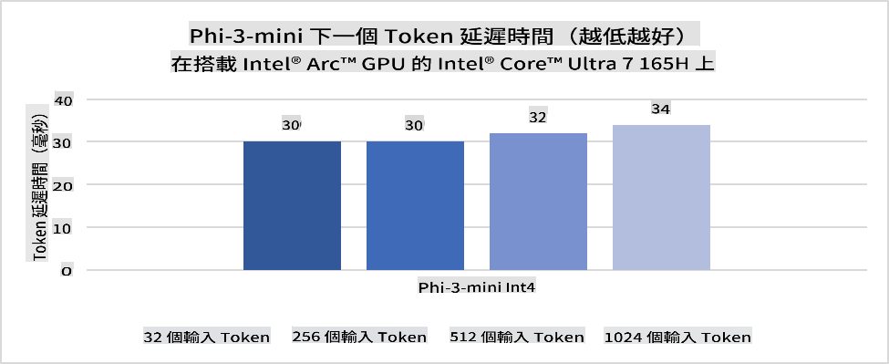
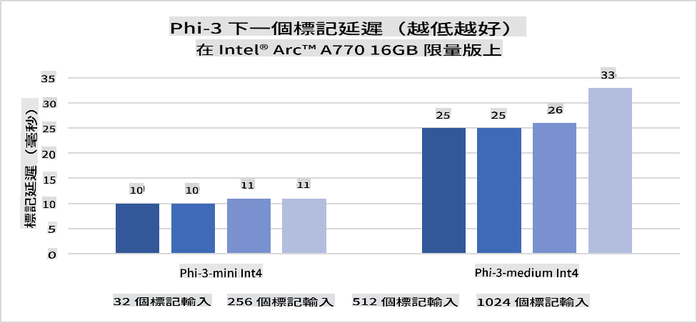
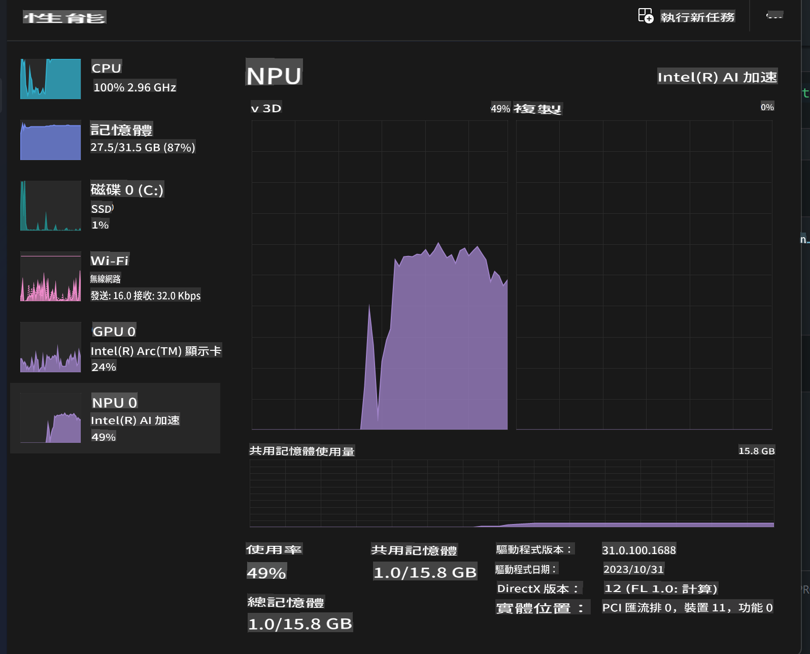
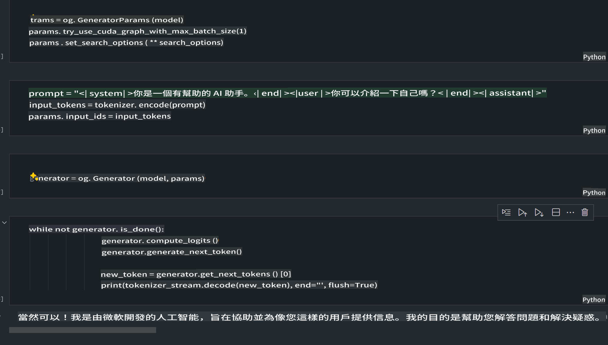
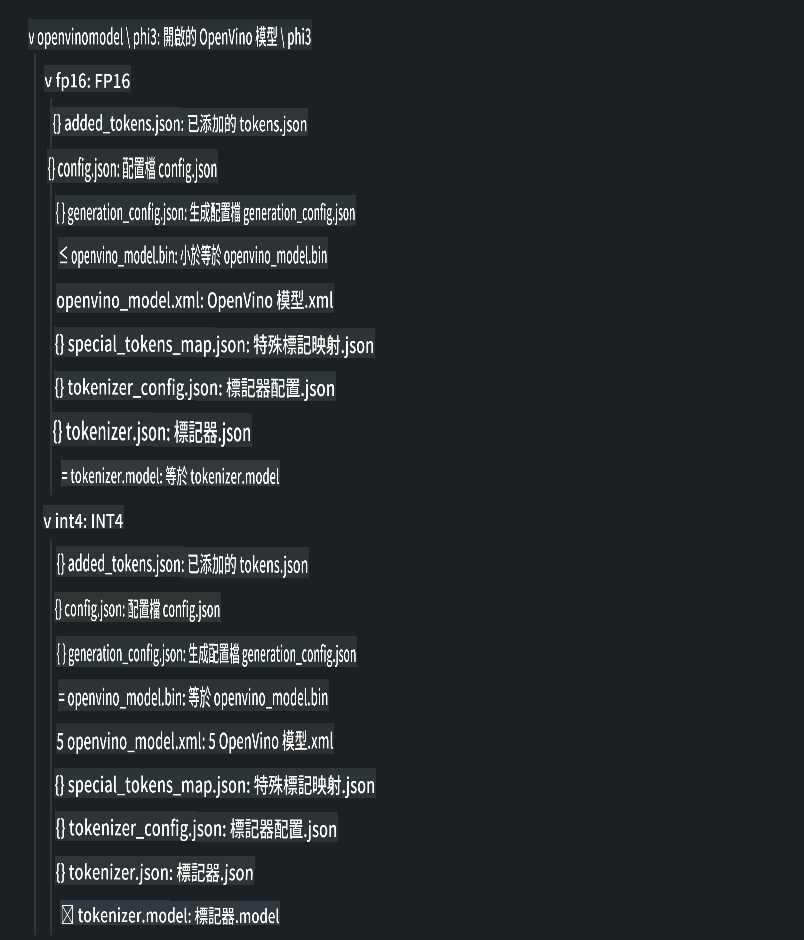
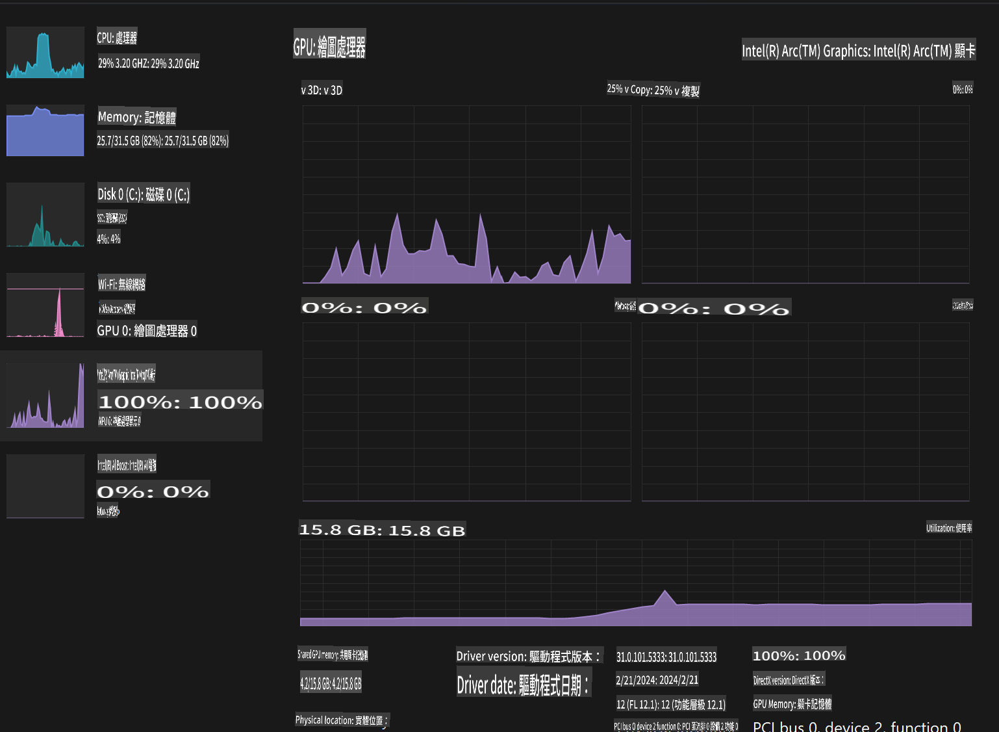

# **AI PC 上部署 Phi-3 模型**

隨著生成式 AI 的進步及邊緣設備硬件能力的提升，越來越多生成式 AI 模型可以集成到用戶的自帶設備 (BYOD) 中。AI PC 就是其中之一。從 2024 年開始，Intel、AMD 和 Qualcomm 與 PC 製造商合作，通過硬件改進推出支持本地化生成式 AI 模型部署的 AI PC。在這次討論中，我們將聚焦於 Intel AI PC，並探討如何在 Intel AI PC 上部署 Phi-3 模型。

### 什麼是 NPU

NPU（神經處理單元）是一種專門設計用於加速神經網絡運算和 AI 任務的處理器或處理單元，集成在更大的 SoC 上。與通用的 CPU 和 GPU 不同，NPU 專為數據驅動的並行計算優化，能高效處理大量多媒體數據（如視頻和圖像），以及神經網絡所需的數據處理。它特別擅長處理與 AI 相關的任務，比如語音識別、視頻通話中的背景模糊，以及物體檢測等照片或視頻編輯流程。

## NPU 與 GPU 的比較

儘管許多 AI 和機器學習工作負載可以在 GPU 上運行，但 GPU 和 NPU 之間有一個關鍵區別。
GPU 以其並行計算能力著稱，但並非所有 GPU 在處理圖形之外的任務時都同樣高效。而 NPU 是專為神經網絡運算中的複雜計算設計的，對 AI 任務的處理效果非常出色。

總結來說，NPU 就像數學天才，能極速完成 AI 計算，並在 AI PC 的新時代中扮演關鍵角色！

***本例基於 Intel 最新的 Intel Core Ultra 處理器***

## **1. 使用 NPU 運行 Phi-3 模型**

Intel® NPU 設備是一種 AI 推理加速器，集成於 Intel 客戶端 CPU 中，從 Intel® Core™ Ultra 系列處理器（前稱 Meteor Lake）開始提供支持。它可以高效執行人工神經網絡任務。





**Intel NPU 加速庫**

Intel NPU 加速庫 [https://github.com/intel/intel-npu-acceleration-library](https://github.com/intel/intel-npu-acceleration-library) 是一個 Python 庫，旨在利用 Intel 神經處理單元（NPU）的強大計算能力，在兼容硬件上執行高速運算，提高應用程序的效率。

基於 Intel® Core™ Ultra 處理器的 AI PC 上運行 Phi-3-mini 的示例。


使用 pip 安裝 Python 庫

```bash

   pip install intel-npu-acceleration-library

```

***注意*** 該項目仍在開發中，但參考模型已經非常完整。

### **使用 Intel NPU 加速庫運行 Phi-3 模型**

利用 Intel NPU 加速，該庫不會影響傳統的編碼過程。只需使用該庫對原始 Phi-3 模型進行量化，例如 FP16、INT8、INT4 等。

```python
from transformers import AutoTokenizer, pipeline,TextStreamer
from intel_npu_acceleration_library import NPUModelForCausalLM, int4
from intel_npu_acceleration_library.compiler import CompilerConfig
import warnings

model_id = "microsoft/Phi-3-mini-4k-instruct"

compiler_conf = CompilerConfig(dtype=int4)
model = NPUModelForCausalLM.from_pretrained(
    model_id, use_cache=True, config=compiler_conf, attn_implementation="sdpa"
).eval()

tokenizer = AutoTokenizer.from_pretrained(model_id)

text_streamer = TextStreamer(tokenizer, skip_prompt=True)
```

量化成功後，繼續執行代碼以調用 NPU 運行 Phi-3 模型。

```python
generation_args = {
   "max_new_tokens": 1024,
   "return_full_text": False,
   "temperature": 0.3,
   "do_sample": False,
   "streamer": text_streamer,
}

pipe = pipeline(
   "text-generation",
   model=model,
   tokenizer=tokenizer,
)

query = "<|system|>You are a helpful AI assistant.<|end|><|user|>Can you introduce yourself?<|end|><|assistant|>"

with warnings.catch_warnings():
    warnings.simplefilter("ignore")
    pipe(query, **generation_args)
```

執行代碼時，可以通過任務管理器查看 NPU 的運行狀態。



***示例*** : [AIPC_NPU_DEMO.ipynb](../../../../../code/03.Inference/AIPC/AIPC_NPU_DEMO.ipynb)

## **2. 使用 DirectML + ONNX Runtime 運行 Phi-3 模型**

### **什麼是 DirectML**

[DirectML](https://github.com/microsoft/DirectML) 是一個高性能、硬件加速的 DirectX 12 機器學習庫。DirectML 為常見的機器學習任務提供 GPU 加速，支持多種硬件和驅動程序，包括 AMD、Intel、NVIDIA 和 Qualcomm 的所有支持 DirectX 12 的 GPU。

當獨立使用時，DirectML API 是一個低級別的 DirectX 12 庫，適合高性能、低延遲的應用程序，例如框架、遊戲和其他實時應用程序。DirectML 與 Direct3D 12 的無縫互操作性，以及其低開銷和硬件一致性，使其成為在需要高性能和硬件結果可靠性時，加速機器學習的理想選擇。

***注意*** : 最新的 DirectML 已支持 NPU(https://devblogs.microsoft.com/directx/introducing-neural-processor-unit-npu-support-in-directml-developer-preview/)

###  DirectML 與 CUDA 的能力與性能對比：

**DirectML** 是由 Microsoft 開發的機器學習庫，設計用於加速 Windows 設備（包括桌面、筆記本和邊緣設備）上的機器學習工作負載。
- 基於 DX12：DirectML 構建於 DirectX 12（DX12）之上，支持多種 GPU 硬件，包括 NVIDIA 和 AMD。
- 更廣泛的支持：由於利用了 DX12，DirectML 可以在任何支持 DX12 的 GPU（甚至是集成 GPU）上運行。
- 圖像處理：DirectML 使用神經網絡處理圖像和其他數據，適合圖像識別、物體檢測等任務。
- 簡單易用：DirectML 的設置非常簡單，無需 GPU 廠商提供的特定 SDK 或庫。
- 性能：在某些情況下，DirectML 表現良好，甚至可能比 CUDA 更快，特別是針對某些工作負載。
- 局限性：但在處理 float16 的大批量數據時，DirectML 有時可能較慢。

**CUDA** 是 NVIDIA 的並行計算平台和編程模型。它允許開發者利用 NVIDIA GPU 的強大性能來進行通用計算，包括機器學習和科學模擬。
- NVIDIA 專屬：CUDA 與 NVIDIA GPU 緊密集成，專為其設計。
- 高度優化：對於 GPU 加速任務（尤其是在使用 NVIDIA GPU 時），CUDA 提供卓越的性能。
- 廣泛使用：許多機器學習框架和庫（如 TensorFlow 和 PyTorch）支持 CUDA。
- 高度定制化：開發者可以針對特定任務微調 CUDA 設置，實現最佳性能。
- 局限性：但 CUDA 依賴於 NVIDIA 硬件，對於需要更廣泛兼容性的情況可能有限制。

### 選擇 DirectML 還是 CUDA

選擇 DirectML 或 CUDA 取決於您的具體使用場景、硬件可用性和偏好。
如果您希望獲得更廣泛的兼容性和更簡單的設置，DirectML 是一個不錯的選擇。然而，如果您擁有 NVIDIA GPU 並需要高度優化的性能，CUDA 是一個強有力的競爭者。總之，DirectML 和 CUDA 各有優勢，請根據您的需求和硬件情況做出選擇。

### **使用 ONNX Runtime 部署生成式 AI**

在 AI 時代，AI 模型的可移植性非常重要。ONNX Runtime 可以輕鬆將訓練好的模型部署到不同設備。開發者無需關注推理框架，只需使用統一的 API 即可完成模型推理。在生成式 AI 時代，ONNX Runtime 也進行了代碼優化（https://onnxruntime.ai/docs/genai/）。通過優化的 ONNX Runtime，量化後的生成式 AI 模型可以在不同終端上進行推理。在使用 ONNX Runtime 的生成式 AI 中，您可以通過 Python、C#、C/C++ 調用 AI 模型 API。當然，在 iPhone 上部署時可以利用 C++ 的 Generative AI with ONNX Runtime API。

[示例代碼](https://github.com/Azure-Samples/Phi-3MiniSamples/tree/main/onnx)

***編譯生成式 AI 的 ONNX Runtime 庫***

```bash

winget install --id=Kitware.CMake  -e

git clone https://github.com/microsoft/onnxruntime.git

cd .\onnxruntime\

./build.bat --build_shared_lib --skip_tests --parallel --use_dml --config Release

cd ../

git clone https://github.com/microsoft/onnxruntime-genai.git

cd .\onnxruntime-genai\

mkdir ort

cd ort

mkdir include

mkdir lib

copy ..\onnxruntime\include\onnxruntime\core\providers\dml\dml_provider_factory.h ort\include

copy ..\onnxruntime\include\onnxruntime\core\session\onnxruntime_c_api.h ort\include

copy ..\onnxruntime\build\Windows\Release\Release\*.dll ort\lib

copy ..\onnxruntime\build\Windows\Release\Release\onnxruntime.lib ort\lib

python build.py --use_dml


```

**安裝庫**

```bash

pip install .\onnxruntime_genai_directml-0.3.0.dev0-cp310-cp310-win_amd64.whl

```

這是運行結果：



***示例*** : [AIPC_DirectML_DEMO.ipynb](../../../../../code/03.Inference/AIPC/AIPC_DirectML_DEMO.ipynb)

## **3. 使用 Intel OpenVino 運行 Phi-3 模型**

### **什麼是 OpenVINO**

[OpenVINO](https://github.com/openvinotoolkit/openvino) 是一個開源工具包，用於優化和部署深度學習模型。它為來自流行框架（如 TensorFlow、PyTorch 等）的視覺、音頻和語言模型提供增強的深度學習性能。通過 OpenVINO 開始使用。OpenVINO 也可以結合 CPU 和 GPU 運行 Phi-3 模型。

***注意***：目前 OpenVINO 不支持 NPU。

### **安裝 OpenVINO 庫**

```bash

 pip install git+https://github.com/huggingface/optimum-intel.git

 pip install git+https://github.com/openvinotoolkit/nncf.git

 pip install openvino-nightly

```

### **使用 OpenVINO 運行 Phi-3 模型**

與 NPU 類似，OpenVINO 通過運行量化模型來調用生成式 AI 模型。我們需要先對 Phi-3 模型進行量化，並通過命令行使用 optimum-cli 完成模型量化。

**INT4**

```bash

optimum-cli export openvino --model "microsoft/Phi-3-mini-4k-instruct" --task text-generation-with-past --weight-format int4 --group-size 128 --ratio 0.6  --sym  --trust-remote-code ./openvinomodel/phi3/int4

```

**FP16**

```bash

optimum-cli export openvino --model "microsoft/Phi-3-mini-4k-instruct" --task text-generation-with-past --weight-format fp16 --trust-remote-code ./openvinomodel/phi3/fp16

```

轉換後的格式如下所示：



通過 OVModelForCausalLM 加載模型路徑（model_dir）、相關配置（ov_config = {"PERFORMANCE_HINT": "LATENCY", "NUM_STREAMS": "1", "CACHE_DIR": ""}）和硬件加速設備（GPU.0）。

```python

ov_model = OVModelForCausalLM.from_pretrained(
     model_dir,
     device='GPU.0',
     ov_config=ov_config,
     config=AutoConfig.from_pretrained(model_dir, trust_remote_code=True),
     trust_remote_code=True,
)

```

執行代碼時，可以通過任務管理器查看 GPU 的運行狀態。



***示例*** : [AIPC_OpenVino_Demo.ipynb](../../../../../code/03.Inference/AIPC/AIPC_OpenVino_Demo.ipynb)

### ***注意*** : 上述三種方法各有優勢，但建議在 AI PC 推理中優先使用 NPU 加速。

**免責聲明**：  
本文件是使用機器翻譯人工智能服務進行翻譯的。雖然我們努力確保準確性，但請注意，自動翻譯可能會包含錯誤或不準確之處。應以原始語言的文件作為權威來源。對於關鍵信息，建議尋求專業人工翻譯。我們對因使用本翻譯而引起的任何誤解或誤讀不承擔責任。