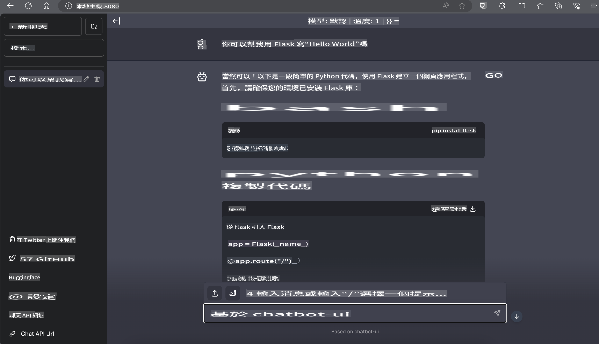

# **在 Nvidia Jetson 上推理 Phi-3**

Nvidia Jetson 是 Nvidia 推出的嵌入式計算板系列。Jetson TK1、TX1 和 TX2 型號都配備了 Nvidia 的 Tegra 處理器（或 SoC），該處理器整合了一個基於 ARM 架構的中央處理單元（CPU）。Jetson 是一個低功耗系統，專為加速機器學習應用而設計。Nvidia Jetson 被專業開發者用於創建各行業的突破性 AI 產品，也被學生和愛好者用於實踐 AI 學習並製作驚人的項目。SLM 被部署於如 Jetson 這樣的邊緣設備上，可更好地實現工業生成式 AI 應用場景。

## 在 NVIDIA Jetson 上的部署：
從事自主機器人和嵌入式設備開發的開發者可以利用 Phi-3 Mini。Phi-3 的小巧體積使其非常適合邊緣部署。在訓練過程中參數經過精心調整，確保回應的高準確性。

### TensorRT-LLM 優化：
NVIDIA 的 [TensorRT-LLM 庫](https://github.com/NVIDIA/TensorRT-LLM?WT.mc_id=aiml-138114-kinfeylo) 對大型語言模型推理進行了優化。它支持 Phi-3 Mini 的長上下文窗口，提升了吞吐量和延遲表現。優化技術包括 LongRoPE、FP8 和 inflight batching。

### 可用性和部署：
開發者可以通過 [NVIDIA's AI](https://www.nvidia.com/en-us/ai-data-science/generative-ai/) 探索具有 128K 上下文窗口的 Phi-3 Mini。它被打包為 NVIDIA NIM，一個帶有標準 API 的微服務，可以部署到任何地方。此外，還有 [GitHub 上的 TensorRT-LLM 實現](https://github.com/NVIDIA/TensorRT-LLM)。

## **1. 準備工作**

a. Jetson Orin NX / Jetson NX

b. JetPack 5.1.2+
   
c. Cuda 11.8
   
d. Python 3.8+

## **2. 在 Jetson 上運行 Phi-3**

我們可以選擇 [Ollama](https://ollama.com) 或 [LlamaEdge](https://llamaedge.com)

如果您想在雲端和邊緣設備上同時使用 gguf，LlamaEdge 可以理解為 WasmEdge（WasmEdge 是一個輕量、高性能、可擴展的 WebAssembly 運行時，適用於雲原生、邊緣和去中心化應用。它支持無伺服器應用、嵌入式功能、微服務、智能合約和物聯網設備）。您可以通過 LlamaEdge 將 gguf 的量化模型部署到邊緣設備和雲端。


以下是使用步驟：

1. 安裝並下載相關庫和文件

```bash

curl -sSf https://raw.githubusercontent.com/WasmEdge/WasmEdge/master/utils/install.sh | bash -s -- --plugin wasi_nn-ggml

curl -LO https://github.com/LlamaEdge/LlamaEdge/releases/latest/download/llama-api-server.wasm

curl -LO https://github.com/LlamaEdge/chatbot-ui/releases/latest/download/chatbot-ui.tar.gz

tar xzf chatbot-ui.tar.gz

```

**注意**: llama-api-server.wasm 和 chatbot-ui 需要在同一目錄下

2. 在終端中運行腳本

```bash

wasmedge --dir .:. --nn-preload default:GGML:AUTO:{Your gguf path} llama-api-server.wasm -p phi-3-chat

```

以下是運行結果：



***範例代碼*** [Phi-3 mini WASM Notebook Sample](https://github.com/Azure-Samples/Phi-3MiniSamples/tree/main/wasm)

總結來說，Phi-3 Mini 在語言建模方面實現了重大突破，結合了高效性、上下文感知以及 NVIDIA 的優化能力。不論是構建機器人還是邊緣應用，Phi-3 Mini 都是一個值得關注的強大工具。

**免責聲明**：  
本文件已使用機器翻譯人工智能服務進行翻譯。我們致力於提供準確的翻譯，但請注意，自動翻譯可能包含錯誤或不準確之處。應以原語言的原始文件作為權威來源。對於關鍵信息，建議尋求專業的人手翻譯。我們對因使用本翻譯而引起的任何誤解或誤讀概不負責。