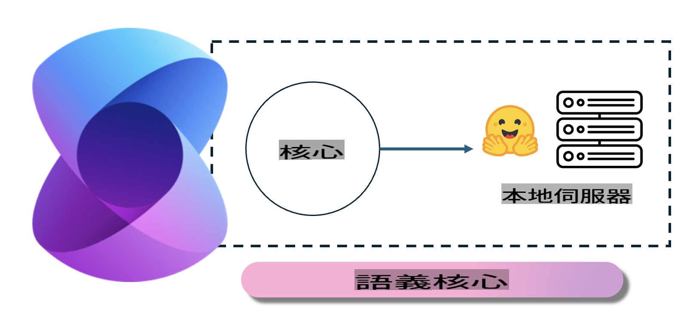
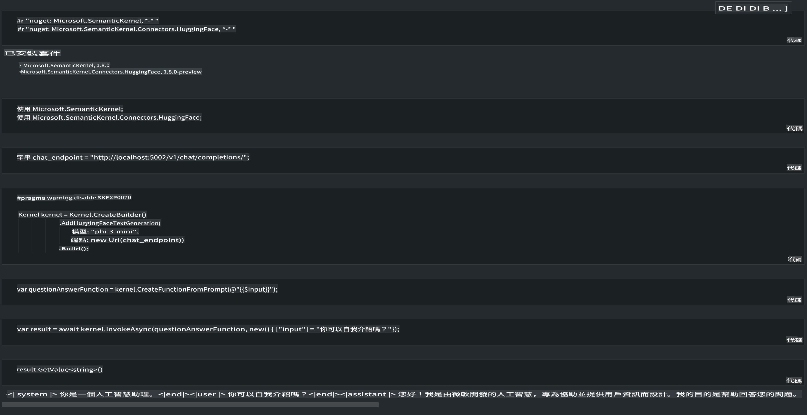

# **本地伺服器上部署 Phi-3**

我哋可以喺本地伺服器上部署 Phi-3，用戶可以揀 [Ollama](https://ollama.com) 或 [LM Studio](https://llamaedge.com) 呢啲解決方案，或者寫自己嘅代碼。你可以通過 [Semantic Kernel](https://github.com/microsoft/semantic-kernel?WT.mc_id=aiml-138114-kinfeylo) 或 [Langchain](https://www.langchain.com/) 連接 Phi-3 嘅本地服務，從而構建 Copilot 應用。

## **使用 Semantic Kernel 訪問 Phi-3-mini**

喺 Copilot 應用中，我哋可以通過 Semantic Kernel / LangChain 來構建應用。呢類應用框架通常可以兼容 Azure OpenAI Service / OpenAI 模型，亦可以支持 Hugging Face 上嘅開源模型同本地模型。如果我哋想用 Semantic Kernel 訪問 Phi-3-mini，應該點做呢？以 .NET 為例，我哋可以將其同 Semantic Kernel 嘅 Hugging Face Connector 結合使用。默認情況下，佢可以對應 Hugging Face 上嘅模型 ID（第一次使用時，模型會從 Hugging Face 下載，時間較長）。亦可以連接到自建嘅本地服務。相比之下，我哋建議用後者，因為喺企業應用中，後者嘅自主性更高。

從圖中可以睇到，通過 Semantic Kernel 訪問本地服務，可以輕鬆連接自建嘅 Phi-3-mini 模型伺服器。以下係運行結果：

***示例代碼*** https://github.com/kinfey/Phi3MiniSamples/tree/main/semantickernel

**免責聲明**:  
本文件使用機器翻譯人工智能服務進行翻譯。我們雖然致力於提供準確的翻譯，但請注意，自動翻譯可能會包含錯誤或不準確之處。應以原文文件作為最具權威性的參考來源。如涉及關鍵資訊，建議尋求專業的人手翻譯。我們對因使用此翻譯而引起的任何誤解或誤釋不承擔責任。