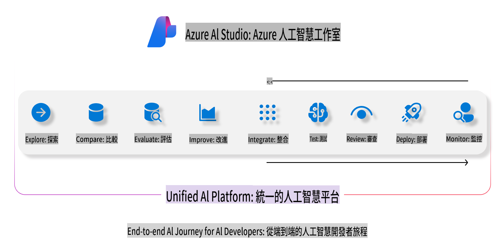
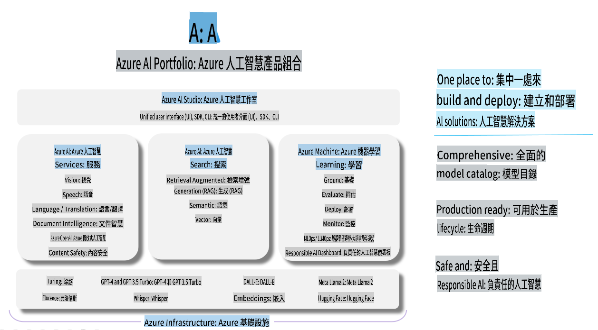

# **使用 Azure AI Foundry 進行評估**

如何使用 [Azure AI Foundry](https://ai.azure.com?WT.mc_id=aiml-138114-kinfeylo) 評估你的生成式 AI 應用程式。不論是單輪對話還是多輪對話，Azure AI Foundry 都提供工具來評估模型的效能與安全性。

## 如何使用 Azure AI Foundry 評估生成式 AI 應用程式
如需更詳細的指引，請參考 [Azure AI Foundry 文件](https://learn.microsoft.com/azure/ai-studio/how-to/evaluate-generative-ai-app?WT.mc_id=aiml-138114-kinfeylo)。

以下是開始的步驟：

## 在 Azure AI Foundry 中評估生成式 AI 模型

**必要條件**

- 一個以 CSV 或 JSON 格式儲存的測試數據集。
- 一個已部署的生成式 AI 模型（例如 Phi-3、GPT 3.5、GPT 4 或 Davinci 模型）。
- 一個包含運算實例的執行環境，用於執行評估。

## 內建評估指標

Azure AI Foundry 支援評估單輪對話以及更複雜的多輪對話。
針對基於特定數據的檢索增強生成（RAG）場景，你可以使用內建的評估指標來衡量模型效能。
此外，你還可以評估一般的單輪問答場景（非 RAG）。

## 建立評估執行

從 Azure AI Foundry 的介面，導航到 "Evaluate" 頁面或 "Prompt Flow" 頁面。
按照評估建立精靈的指引來設定評估執行。為你的評估提供一個可選的名稱。
選擇與你的應用目標相符的場景。
選擇一個或多個評估指標來評估模型的輸出。

## 自訂評估流程（可選）

若需要更大的靈活性，你可以建立自訂的評估流程。根據你的特定需求調整評估方式。

## 檢視結果

在執行評估後，記錄、檢視並分析 Azure AI Foundry 中的詳細評估指標。深入了解你的應用程式的能力與限制。

**注意** Azure AI Foundry 目前處於公開預覽階段，因此僅供實驗與開發使用。針對生產環境工作負載，請考慮其他選項。探索官方 [AI Foundry 文件](https://learn.microsoft.com/azure/ai-studio/?WT.mc_id=aiml-138114-kinfeylo)，以取得更多詳細資訊與分步指引。

**免責聲明**：  
此文件已使用機器人工智能翻譯服務進行翻譯。我們致力於提供準確的翻譯，但請注意，自動翻譯可能包含錯誤或不準確之處。原文檔的母語版本應被視為權威來源。對於關鍵資訊，建議尋求專業的人手翻譯。我們對因使用此翻譯而產生的任何誤解或錯誤解釋概不負責。