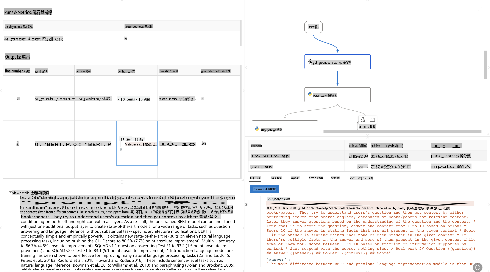

# **介紹 Promptflow**

[Microsoft Prompt Flow](https://microsoft.github.io/promptflow/index.html?WT.mc_id=aiml-138114-kinfeylo) 係一個視覺化嘅工作流程自動化工具，俾用戶可以用預設嘅範本同自定義嘅連接器去創建自動化工作流程。呢個工具設計嚟幫助開發者同業務分析師快速構建數據管理、協作同流程優化等任務嘅自動化過程。通過 Prompt Flow，用戶可以輕鬆連接唔同嘅服務、應用同系統，自動化複雜嘅業務流程。

Microsoft Prompt Flow 旨在簡化基於大型語言模型（LLMs）嘅人工智能應用程序從頭到尾嘅開發週期。無論係構思、原型設計、測試、評估定係部署 LLM 應用程序，Prompt Flow 都可以簡化呢個過程，幫助你構建具備生產質量嘅 LLM 應用。

## 以下係使用 Microsoft Prompt Flow 嘅主要功能同好處：

**互動式編輯體驗**

Prompt Flow 提供工作流程結構嘅視覺化表示，令你更容易理解同導航項目。
佢提供類似筆記本嘅編碼體驗，用於高效嘅流程開發同調試。

**提示變體同調優**

創建同比較多個提示變體，促進迭代改進過程。評估唔同提示嘅表現，揀出最有效嘅嗰啲。

**內置評估流程**

使用內置評估工具評估提示同流程嘅質量同效能。
了解你基於 LLM 嘅應用程序表現得幾好。

**全面嘅資源**

Prompt Flow 包括一個內置工具、示例同範本嘅庫。呢啲資源可以作為開發嘅起點，激發創意，加速開發過程。

**協作同企業就緒**

支持團隊協作，容許多個用戶一齊參與提示工程項目。
保持版本控制，有效分享知識。簡化從開發、評估到部署同監控嘅整個提示工程過程。

## Prompt Flow 嘅評估

喺 Microsoft Prompt Flow 入面，評估係評估你人工智能模型表現嘅重要部分。以下係點樣喺 Prompt Flow 入面自定義評估流程同指標：

**了解 Prompt Flow 嘅評估**

喺 Prompt Flow 入面，一個流程代表一系列處理輸入同生成輸出嘅節點。評估流程係一種特殊類型嘅流程，專門用嚟根據特定標準同目標評估一次運行嘅表現。

**評估流程嘅主要特點**

通常喺被測試嘅流程之後運行，使用其輸出。佢哋計算分數或者指標嚟衡量被測流程嘅表現。指標可以包括準確性、相關性分數或者其他相關嘅衡量標準。

### 自定義評估流程

**定義輸入**

評估流程需要接收被測流程嘅輸出。定義輸入嘅方式同標準流程類似。
例如，如果你評估一個問答流程，可以將輸入命名為「answer」。如果係評估分類流程，可以將輸入命名為「category」。可能仲需要地面真相輸入（例如實際標籤）。

**輸出同指標**

評估流程會生成衡量被測流程表現嘅結果。指標可以用 Python 或者 LLM（大型語言模型）計算。使用 log_metric() 函數記錄相關指標。

**使用自定義評估流程**

開發針對你具體任務同目標嘅評估流程。根據評估目標自定義指標。
將自定義嘅評估流程應用到批量運行，用於大規模測試。

## 內置評估方法

Prompt Flow 同樣提供內置評估方法。
你可以提交批量運行，用呢啲方法評估你嘅流程喺大型數據集上嘅表現。
查看評估結果，對比指標，按需要進行迭代。
記住，評估係確保你人工智能模型達到預期標準同目標嘅關鍵。查閱官方文檔了解有關喺 Microsoft Prompt Flow 入面開發同使用評估流程嘅詳細說明。

總結嚟講，Microsoft Prompt Flow 通過簡化提示工程同提供穩健嘅開發環境，幫助開發者創建高質量嘅 LLM 應用。如果你喺使用 LLM，Prompt Flow 係一個值得探索嘅工具。探索 [Prompt Flow 評估文檔](https://learn.microsoft.com/azure/machine-learning/prompt-flow/how-to-develop-an-evaluation-flow?view=azureml-api-2?WT.mc_id=aiml-138114-kinfeylo) 了解有關喺 Microsoft Prompt Flow 入面開發同使用評估流程嘅詳細說明。

**免責聲明**:  
本文件經由機器翻譯AI服務進行翻譯。我們致力於提供準確的翻譯，但請注意，自動翻譯可能包含錯誤或不準確之處。應以原文檔的原始語言版本作為權威來源。對於關鍵資訊，建議使用專業的人工作翻譯。我們對因使用此翻譯而產生的任何誤解或誤讀概不負責。