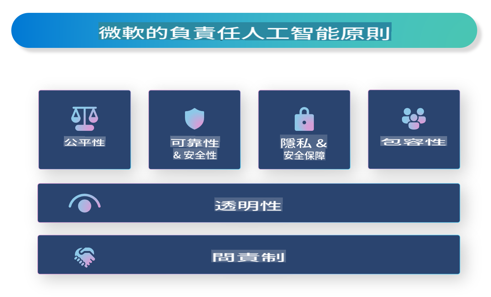

# **介紹負責任的人工智能**

[Microsoft 負責任的人工智能](https://www.microsoft.com/ai/responsible-ai?WT.mc_id=aiml-138114-kinfeylo) 是一個幫助開發者和組織建立透明、可信賴和負責任的人工智能系統的計劃。該計劃提供指導和資源，幫助開發符合道德原則（如隱私、公平和透明）的負責任人工智能解決方案。我們還將探討建立負責任人工智能系統所面臨的一些挑戰和最佳實踐。

## Microsoft 負責任人工智能概覽

**道德原則**

Microsoft 負責任人工智能以一系列道德原則為指導，例如隱私、公平、透明、問責和安全性。這些原則旨在確保人工智能系統以道德且負責任的方式開發。

**透明的人工智能**

Microsoft 負責任人工智能強調人工智能系統的透明性，包括清楚解釋人工智能模型的運作方式，以及確保數據來源和算法公開可用。

**負責任的人工智能**

[Microsoft 負責任的人工智能](https://www.microsoft.com/ai/responsible-ai?WT.mc_id=aiml-138114-kinfeylo) 推動開發可以提供決策過程洞察的負責任人工智能系統，幫助用戶理解並信任人工智能系統的輸出結果。

**包容性**

人工智能系統應該為所有人帶來益處。Microsoft 致力於創建考慮多元觀點並避免偏見或歧視的包容性人工智能。

**可靠性與安全性**

確保人工智能系統的可靠性和安全性至關重要。Microsoft 專注於構建穩健的模型，保證其穩定運行並避免產生有害後果。

**人工智能中的公平性**

Microsoft 負責任人工智能認識到，如果人工智能系統基於有偏見的數據或算法進行訓練，可能會延續偏見。該計劃提供指導，幫助開發不因種族、性別或年齡等因素而歧視的公平人工智能系統。

**隱私與安全**

Microsoft 負責任人工智能強調保護用戶隱私和數據安全的重要性，包括實施強大的數據加密和訪問控制，以及定期審核人工智能系統的漏洞。

**問責與責任**

Microsoft 負責任人工智能提倡在人工智能的開發和部署中保持問責與責任，確保開發者和組織意識到人工智能系統的潛在風險，並採取措施減少這些風險。

## 建立負責任人工智能系統的最佳實踐

**使用多元數據集開發人工智能模型**

為避免人工智能系統中的偏見，使用能夠代表多種觀點和經歷的多元數據集非常重要。

**採用可解釋的人工智能技術**

可解釋的人工智能技術能幫助用戶理解人工智能模型如何做出決策，從而增加對系統的信任。

**定期審核人工智能系統的漏洞**

定期審核人工智能系統可以幫助識別需要解決的潛在風險和漏洞。

**實施強大的數據加密和訪問控制**

數據加密和訪問控制有助於保護人工智能系統中的用戶隱私和安全。

**遵循人工智能開發的道德原則**

遵循公平、透明和問責等道德原則有助於建立對人工智能系統的信任，並確保其以負責任的方式開發。

## 使用 AI Foundry 促進負責任人工智能

[Azure AI Foundry](https://ai.azure.com?WT.mc_id=aiml-138114-kinfeylo) 是一個強大的平台，幫助開發者和組織快速創建智能、尖端、面向市場且負責任的應用程序。以下是 Azure AI Foundry 的一些關鍵功能和能力：

**現成的 API 和模型**

Azure AI Foundry 提供預構建和可自定義的 API 和模型，涵蓋多種人工智能任務，包括生成式人工智能、對話自然語言處理、搜索、監控、翻譯、語音、視覺和決策。

**Prompt Flow**

Azure AI Foundry 中的 Prompt Flow 讓您可以創建對話式人工智能體驗，設計和管理對話流程，更輕鬆地構建聊天機器人、虛擬助手等交互式應用。

**檢索增強生成 (RAG)**

RAG 是一種結合基於檢索和生成的技術，通過利用現有知識（檢索）和創造性生成（生成）來提升生成結果的質量。

**生成式人工智能的評估與監控指標**

Azure AI Foundry 提供工具來評估和監控生成式人工智能模型的性能、公平性等重要指標，確保負責任的部署。此外，如果您已創建儀表板，還可以使用 Azure Machine Learning Studio 的無代碼界面自定義並生成基於 [Responsible AI Toolbox](https://responsibleaitoolbox.ai/?WT.mc_id=aiml-138114-kinfeylo) Python 庫的負責任人工智能儀表板和相關得分卡。這些得分卡幫助您與技術和非技術利益相關者分享與公平性、特徵重要性及其他負責任部署考量相關的關鍵洞察。

要在負責任人工智能中使用 AI Foundry，您可以遵循以下最佳實踐：

**明確人工智能系統的問題和目標**

在開發過程開始之前，明確人工智能系統希望解決的問題或目標非常重要。這有助於確定構建有效模型所需的數據、算法和資源。

**收集和預處理相關數據**

訓練人工智能系統所用數據的質量和數量對其性能影響重大。因此，收集相關數據，進行清理和預處理，並確保數據能代表您希望解決的群體或問題至關重要。

**選擇合適的評估方法**

有多種評估算法可用，根據您的數據和問題選擇最合適的算法非常重要。

**評估並解釋模型**

在構建人工智能模型後，使用適當的指標評估其性能，並以透明的方式解釋結果。這有助於識別模型中的偏見或限制，並進行必要的改進。

**確保透明性和可解釋性**

人工智能系統應該是透明且可解釋的，讓用戶能理解其工作原理和決策過程。這對於對人類生活有重大影響的應用（如醫療、金融和法律系統）尤為重要。

**監控並更新模型**

人工智能系統應該被持續監控和更新，確保其隨時間保持準確和有效。這需要不斷的維護、測試和重新訓練模型。

總之，Microsoft 負責任人工智能是一項旨在幫助開發者和組織建立透明、可信賴和負責任人工智能系統的計劃。記住，實現負責任人工智能至關重要，而 Azure AI Foundry 致力於幫助組織將其付諸實踐。通過遵循道德原則和最佳實踐，我們可以確保人工智能系統以負責任的方式開發和部署，造福整個社會。

**免責聲明**:  
本文件經由機器翻譯AI服務進行翻譯。我們致力於提供準確的翻譯，但請注意，自動翻譯可能包含錯誤或不準確之處。應以原文文件作為權威來源。如涉及關鍵信息，建議尋求專業人員進行人工翻譯。我們對因使用本翻譯而引起的任何誤解或誤釋不承擔責任。