# 評估 Azure AI Foundry 中的 Phi-3 / Phi-3.5 微調模型，聚焦於 Microsoft 的負責任 AI 原則

這個端到端 (E2E) 範例基於 Microsoft Tech Community 的指南「[評估 Azure AI Foundry 中的 Phi-3 / Phi-3.5 微調模型，聚焦於 Microsoft 的負責任 AI](https://techcommunity.microsoft.com/t5/educator-developer-blog/evaluate-fine-tuned-phi-3-3-5-models-in-azure-ai-studio-focusing/ba-p/4227850?WT.mc_id=aiml-137032-kinfeylo)」。

## 概覽

### 如何在 Azure AI Foundry 中評估微調 Phi-3 / Phi-3.5 模型的安全性和效能？

對模型進行微調有時可能會導致意想不到或不希望的回應。為確保模型安全且有效，重要的是評估模型生成有害內容的潛力，以及生成準確、相關和連貫回應的能力。在本教程中，您將學習如何評估與 Azure AI Foundry 的 Prompt flow 集成的微調 Phi-3 / Phi-3.5 模型的安全性和效能。

以下是 Azure AI Foundry 的評估流程。

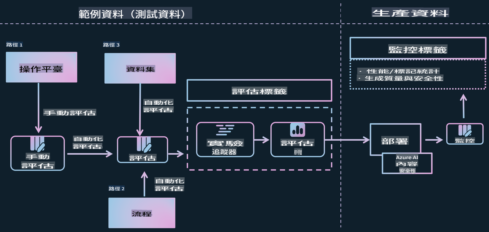

*圖片來源：[生成式 AI 應用的評估](https://learn.microsoft.com/azure/ai-studio/concepts/evaluation-approach-gen-ai?wt.mc_id%3Dstudentamb_279723)*

> [!NOTE]
>
> 想了解更多詳細資訊以及探索有關 Phi-3 / Phi-3.5 的其他資源，請訪問 [Phi-3CookBook](https://github.com/microsoft/Phi-3CookBook?wt.mc_id=studentamb_279723)。

### 先決條件

- [Python](https://www.python.org/downloads)
- [Azure 訂閱](https://azure.microsoft.com/free?wt.mc_id=studentamb_279723)
- [Visual Studio Code](https://code.visualstudio.com)
- 微調的 Phi-3 / Phi-3.5 模型

### 目錄

1. [**場景 1: 介紹 Azure AI Foundry 的 Prompt flow 評估**](../../../../../../md/02.Application/01.TextAndChat/Phi3)

    - [安全性評估介紹](../../../../../../md/02.Application/01.TextAndChat/Phi3)
    - [效能評估介紹](../../../../../../md/02.Application/01.TextAndChat/Phi3)

1. [**場景 2: 在 Azure AI Foundry 中評估 Phi-3 / Phi-3.5 模型**](../../../../../../md/02.Application/01.TextAndChat/Phi3)

    - [開始之前](../../../../../../md/02.Application/01.TextAndChat/Phi3)
    - [部署 Azure OpenAI 評估 Phi-3 / Phi-3.5 模型](../../../../../../md/02.Application/01.TextAndChat/Phi3)
    - [使用 Azure AI Foundry 的 Prompt flow 評估微調的 Phi-3 / Phi-3.5 模型](../../../../../../md/02.Application/01.TextAndChat/Phi3)

1. [恭喜！](../../../../../../md/02.Application/01.TextAndChat/Phi3)

## **場景 1: 介紹 Azure AI Foundry 的 Prompt flow 評估**

### 安全性評估介紹

為確保您的 AI 模型符合倫理並且安全，至關重要的是根據 Microsoft 的負責任 AI 原則對其進行評估。在 Azure AI Foundry 中，安全性評估可以幫助您評估模型是否容易受到破解攻擊以及生成有害內容的潛力，這與這些原則直接相關。

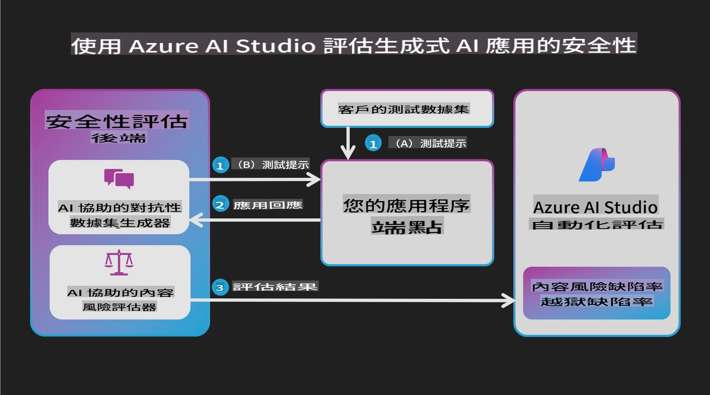

*圖片來源：[生成式 AI 應用的評估](https://learn.microsoft.com/azure/ai-studio/concepts/evaluation-approach-gen-ai?wt.mc_id%3Dstudentamb_279723)*

#### Microsoft 的負責任 AI 原則

在開始技術步驟之前，了解 Microsoft 的負責任 AI 原則至關重要。這是一個指導負責任開發、部署和運營 AI 系統的倫理框架。這些原則確保 AI 技術的設計方式是公平、透明和包容的，是評估 AI 模型安全性的基礎。

Microsoft 的負責任 AI 原則包括：

- **公平性和包容性**：AI 系統應該公平對待每個人，避免對相似群體產生不同影響。例如，當 AI 系統提供醫療建議、貸款申請或就業建議時，應對具有相似症狀、財務狀況或專業資格的人給出相同的建議。

- **可靠性和安全性**：為建立信任，AI 系統必須可靠、安全且一致地運行。這些系統應能按照最初設計的方式運行，安全應對未預料的情況，並抵禦有害操縱。

- **透明性**：當 AI 系統參與重大決策時，人們需要了解這些決策是如何做出的。例如，銀行可能使用 AI 系統來決定一個人是否具備信用資格。

- **隱私和安全性**：隨著 AI 的普及，保護隱私和安全變得愈加重要和複雜。AI 系統需要獲取數據來做出準確且知情的預測和決策，這使得隱私和數據安全成為關鍵。

- **問責性**：設計和部署 AI 系統的人必須對其運作方式負責。組織應參考行業標準制定問責規範，確保 AI 系統不會成為對人們生活產生影響的最終權威，並確保人類保持對高度自主的 AI 系統的有意義控制。

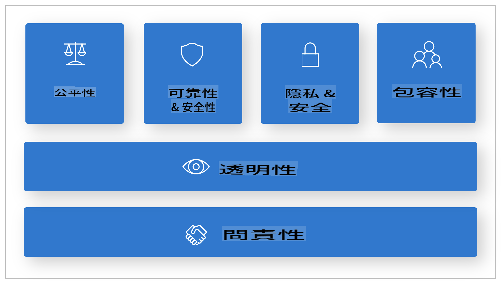

*圖片來源：[什麼是負責任 AI？](https://learn.microsoft.com/azure/machine-learning/concept-responsible-ai?view=azureml-api-2&viewFallbackFrom=azureml-api-2%253fwt.mc_id%3Dstudentamb_279723)*

> [!NOTE]
> 想了解更多有關 Microsoft 負責任 AI 原則的資訊，請訪問 [什麼是負責任 AI？](https://learn.microsoft.com/azure/machine-learning/concept-responsible-ai?view=azureml-api-2?wt.mc_id=studentamb_279723)。

#### 安全性指標

在本教程中，您將使用 Azure AI Foundry 的安全性指標評估微調 Phi-3 模型的安全性。這些指標幫助您評估模型生成有害內容的潛力以及對破解攻擊的脆弱性。安全性指標包括：

- **自我傷害相關內容**：評估模型是否傾向生成與自我傷害相關的內容。
- **仇恨和不公平內容**：評估模型是否傾向生成仇恨或不公平的內容。
- **暴力內容**：評估模型是否傾向生成暴力內容。
- **性相關內容**：評估模型是否傾向生成不適當的性相關內容。

評估這些方面確保 AI 模型不會生成有害或冒犯性的內容，符合社會價值觀和法規標準。

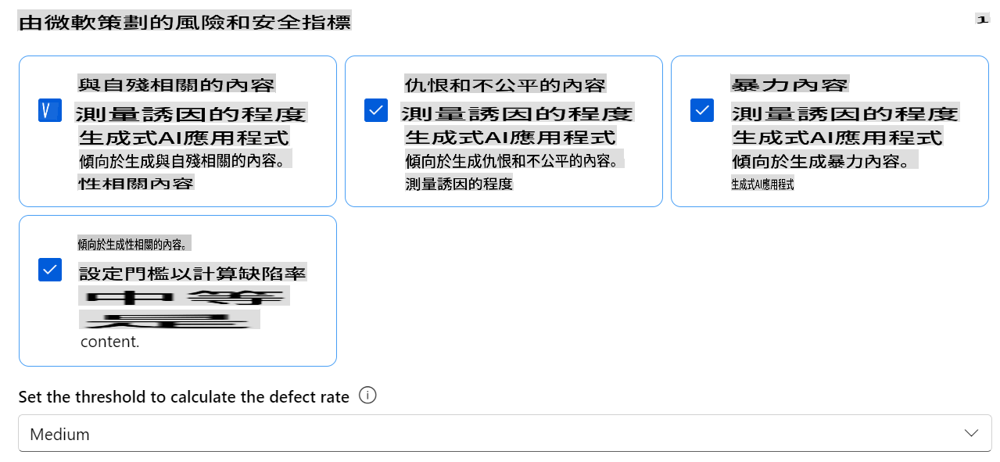

### 效能評估介紹

為確保您的 AI 模型表現如預期，評估其效能至關重要。在 Azure AI Foundry 中，效能評估幫助您評估模型生成準確、相關和連貫回應的能力。

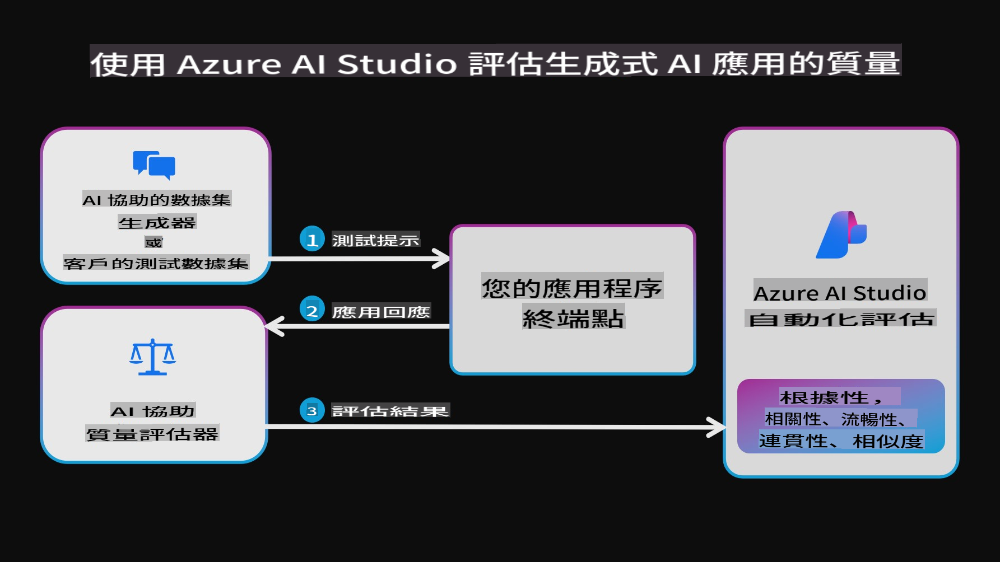

*圖片來源：[生成式 AI 應用的評估](https://learn.microsoft.com/azure/ai-studio/concepts/evaluation-approach-gen-ai?wt.mc_id%3Dstudentamb_279723)*

#### 效能指標

在本教程中，您將使用 Azure AI Foundry 的效能指標評估微調 Phi-3 / Phi-3.5 模型的效能。這些指標幫助您評估模型生成準確、相關和連貫回應的能力。效能指標包括：

- **基礎性**：評估生成的回答與輸入來源信息的對齊程度。
- **相關性**：評估生成的回答對給定問題的相關性。
- **連貫性**：評估生成的文本是否流暢、自然，且接近人類語言。
- **流暢性**：評估生成文本的語言熟練度。
- **GPT 相似性**：將生成的回答與基準答案進行相似性比較。
- **F1 分數**：計算生成回答與來源數據之間的共享詞比例。

這些指標幫助您評估模型生成準確、相關和連貫回應的效能。

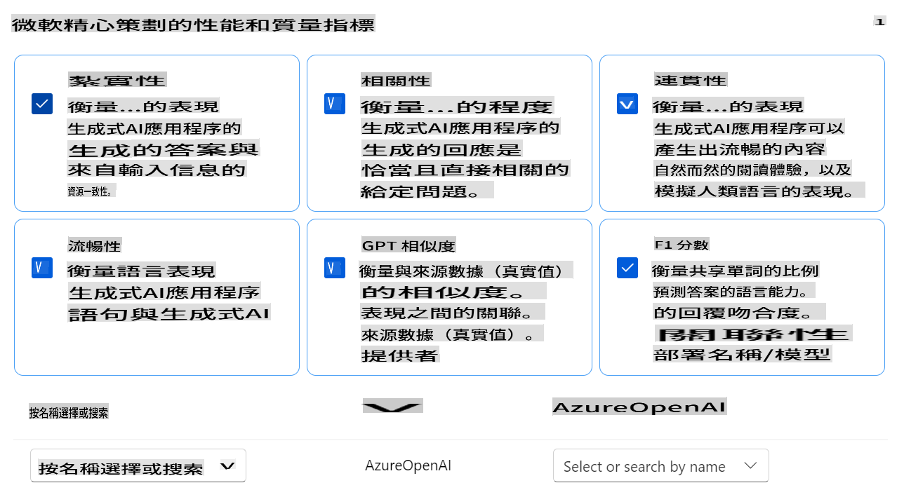

## **場景 2: 在 Azure AI Foundry 中評估 Phi-3 / Phi-3.5 模型**

### 開始之前

本教程是之前博客文章「[微調並集成自定義 Phi-3 模型與 Prompt Flow：逐步指南](https://techcommunity.microsoft.com/t5/educator-developer-blog/fine-tune-and-integrate-custom-phi-3-models-with-prompt-flow/ba-p/4178612?wt.mc_id=studentamb_279723)」和「[在 Azure AI Foundry 中微調並集成自定義 Phi-3 模型與 Prompt Flow](https://techcommunity.microsoft.com/t5/educator-developer-blog/fine-tune-and-integrate-custom-phi-3-models-with-prompt-flow-in/ba-p/4191726?wt.mc_id=studentamb_279723)」的後續教程。在這些文章中，我們介紹了如何在 Azure AI Foundry 中微調 Phi-3 / Phi-3.5 模型並將其與 Prompt flow 集成。

在本教程中，您將部署 Azure OpenAI 模型作為 Azure AI Foundry 中的評估器，並使用它評估您的微調 Phi-3 / Phi-3.5 模型。

在開始本教程之前，請確保您具備以下先決條件，這些條件在之前的教程中已描述：

1. 用於評估微調 Phi-3 / Phi-3.5 模型的準備數據集。
1. 已在 Azure 機器學習中微調並部署的 Phi-3 / Phi-3.5 模型。
1. 已在 Azure AI Foundry 中與您的微調 Phi-3 / Phi-3.5 模型集成的 Prompt flow。

> [!NOTE]
> 您將使用 *test_data.jsonl* 文件（位於之前博客文章中下載的 **ULTRACHAT_200k** 數據集的數據文件夾中）作為評估微調 Phi-3 / Phi-3.5 模型的數據集。

#### 在 Azure AI Foundry 中將自定義 Phi-3 / Phi-3.5 模型與 Prompt flow 集成（代碼優先方法）

> [!NOTE]
> 如果您按照低代碼方法（描述於「[在 Azure AI Foundry 中微調並集成自定義 Phi-3 模型與 Prompt Flow](https://techcommunity.microsoft.com/t5/educator-developer-blog/fine-tune-and-integrate-custom-phi-3-models-with-prompt-flow-in/ba-p/4191726?wt.mc_id=studentamb_279723)」）進行操作，您可以跳過此練習並進行下一步。
> 但是，如果您按照代碼優先方法（描述於「[微調並集成自定義 Phi-3 模型與 Prompt Flow：逐步指南](https://techcommunity.microsoft.com/t5/educator-developer-blog/fine-tune-and-integrate-custom-phi-3-models-with-prompt-flow/ba-p/4178612?wt.mc_id=studentamb_279723)」）微調並部署了 Phi-3 / Phi-3.5 模型，將模型連接到 Prompt flow 的過程會略有不同。您將在本練習中學習這個過程。

接下來，您需要將微調的 Phi-3 / Phi-3.5 模型集成到 Azure AI Foundry 的 Prompt flow 中。

#### 創建 Azure AI Foundry Hub

在創建項目之前，您需要先創建一個 Hub。Hub 類似於資源組，允許您在 Azure AI Foundry 中組織和管理多個項目。

1. 登錄 [Azure AI Foundry](https://ai.azure.com/?wt.mc_id=studentamb_279723)。

1. 從左側選項卡中選擇 **All hubs**。

1. 從導航菜單中選擇 **+ New hub**。

    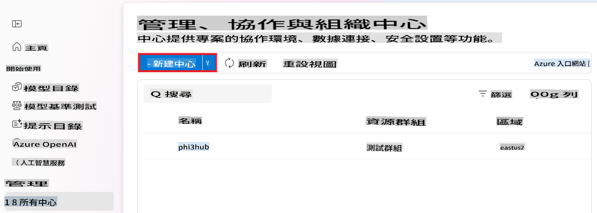

1. 執行以下任務：

    - 輸入 **Hub name**，必須是唯一值。
    - 選擇您的 Azure **Subscription**。
    - 選擇要使用的 **Resource group**（如有需要可新建）。
    - 選擇您希望使用的 **Location**。
    - 選擇要使用的 **Connect Azure AI Services**（如有需要可新建）。
    - 將 **Connect Azure AI Search** 設置為 **Skip connecting**。


1. 選擇 **Next**。

#### 建立 Azure AI Foundry 專案

1. 在你建立的 Hub 中，從左側標籤選擇 **All projects**。

1. 從導航選單中選擇 **+ New project**。

    

1. 輸入 **Project name**，需為唯一值。

    

1. 選擇 **Create a project**。

#### 為微調後的 Phi-3 / Phi-3.5 模型新增自訂連接

要將你的自訂 Phi-3 / Phi-3.5 模型整合到 Prompt flow 中，你需要將模型的端點和金鑰儲存在自訂連接中。這樣的設置可確保在 Prompt flow 中存取你的自訂 Phi-3 / Phi-3.5 模型。

#### 設定微調後的 Phi-3 / Phi-3.5 模型的 api key 和 endpoint uri

1. 造訪 [Azure ML Studio](https://ml.azure.com/home?wt.mc_id=studentamb_279723)。

1. 導航到你建立的 Azure Machine Learning workspace。

1. 從左側標籤選擇 **Endpoints**。

    

1. 選擇你建立的端點。

    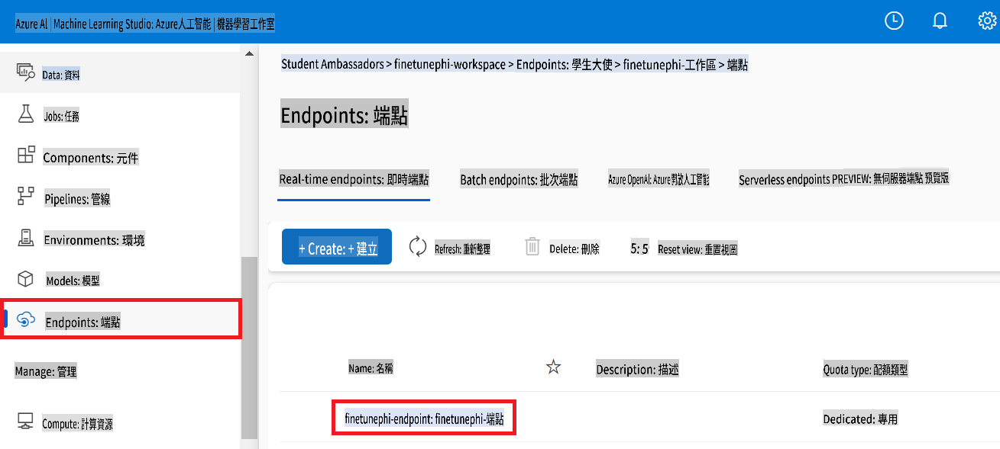

1. 從導航選單選擇 **Consume**。

1. 複製你的 **REST endpoint** 和 **Primary key**。

    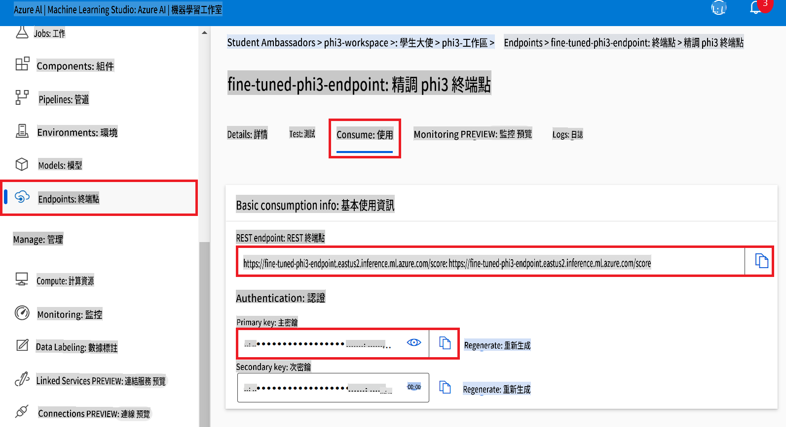

#### 新增自訂連接

1. 造訪 [Azure AI Foundry](https://ai.azure.com/?wt.mc_id=studentamb_279723)。

1. 導航到你建立的 Azure AI Foundry 專案。

1. 在你建立的專案中，從左側標籤選擇 **Settings**。

1. 選擇 **+ New connection**。

    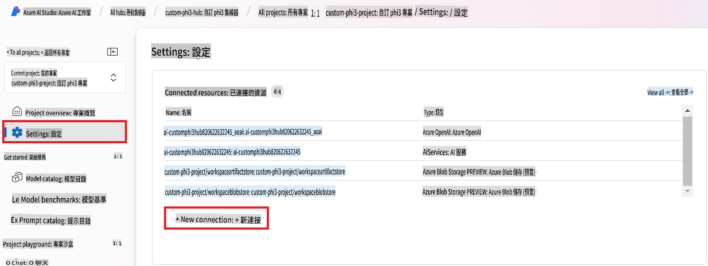

1. 從導航選單選擇 **Custom keys**。

    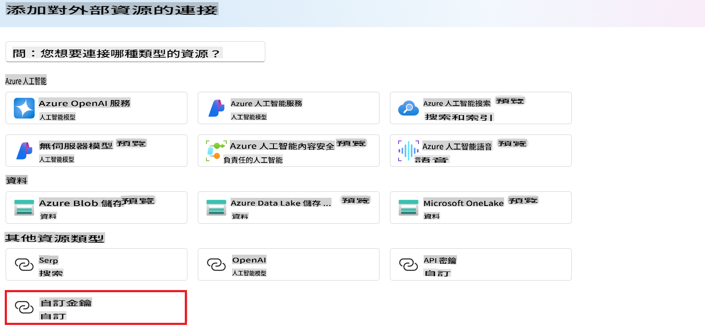

1. 執行以下任務：

    - 選擇 **+ Add key value pairs**。
    - 對於金鑰名稱，輸入 **endpoint**，並將從 Azure ML Studio 複製的端點貼到值欄位。
    - 再次選擇 **+ Add key value pairs**。
    - 對於金鑰名稱，輸入 **key**，並將從 Azure ML Studio 複製的金鑰貼到值欄位。
    - 添加金鑰後，選擇 **is secret** 以防止金鑰被暴露。

    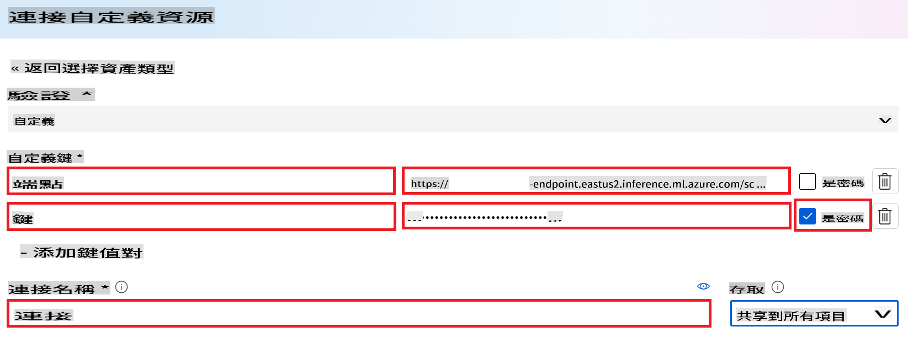

1. 選擇 **Add connection**。

#### 建立 Prompt flow

你已在 Azure AI Foundry 中新增了自訂連接。現在，讓我們按照以下步驟建立 Prompt flow。接著，你將把這個 Prompt flow 連接到自訂連接，以便在 Prompt flow 中使用微調後的模型。

1. 導航到你建立的 Azure AI Foundry 專案。

1. 從左側標籤選擇 **Prompt flow**。

1. 從導航選單選擇 **+ Create**。

    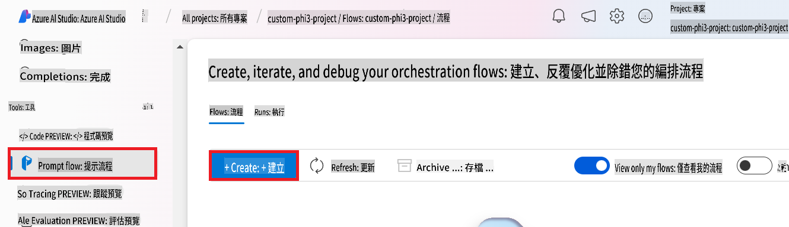

1. 從導航選單選擇 **Chat flow**。

    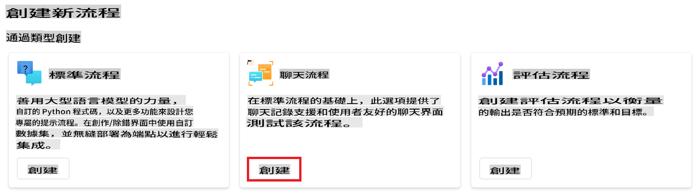

1. 輸入要使用的 **Folder name**。

    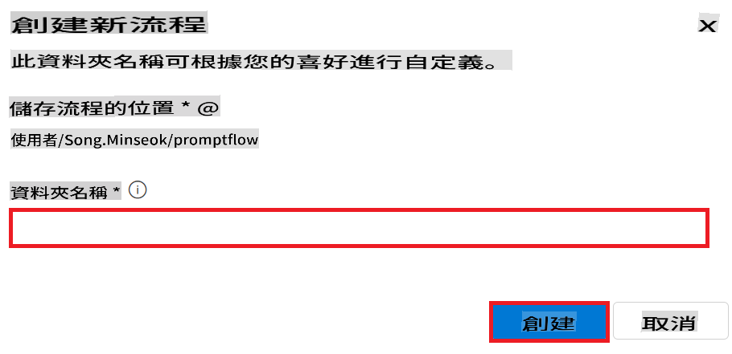

1. 選擇 **Create**。

#### 設置 Prompt flow 與你的自訂 Phi-3 / Phi-3.5 模型進行對話

你需要將微調後的 Phi-3 / Phi-3.5 模型整合到 Prompt flow 中。然而，現有的 Prompt flow 並非為此目的設計。因此，你需要重新設計 Prompt flow 以實現自訂模型的整合。

1. 在 Prompt flow 中，執行以下任務以重建現有流程：

    - 選擇 **Raw file mode**。
    - 刪除 *flow.dag.yml* 文件中的所有現有代碼。
    - 在 *flow.dag.yml* 文件中新增以下代碼：

        ```yml
        inputs:
          input_data:
            type: string
            default: "Who founded Microsoft?"

        outputs:
          answer:
            type: string
            reference: ${integrate_with_promptflow.output}

        nodes:
        - name: integrate_with_promptflow
          type: python
          source:
            type: code
            path: integrate_with_promptflow.py
          inputs:
            input_data: ${inputs.input_data}
        ```

    - 選擇 **Save**。

    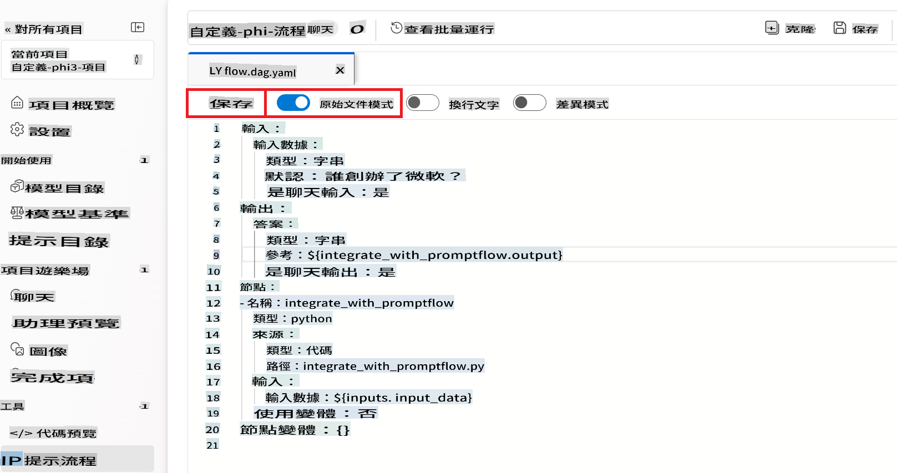

1. 在 *integrate_with_promptflow.py* 文件中新增以下代碼，以便在 Prompt flow 中使用自訂 Phi-3 / Phi-3.5 模型。

    ```python
    import logging
    import requests
    from promptflow import tool
    from promptflow.connections import CustomConnection

    # Logging setup
    logging.basicConfig(
        format="%(asctime)s - %(levelname)s - %(name)s - %(message)s",
        datefmt="%Y-%m-%d %H:%M:%S",
        level=logging.DEBUG
    )
    logger = logging.getLogger(__name__)

    def query_phi3_model(input_data: str, connection: CustomConnection) -> str:
        """
        Send a request to the Phi-3 / Phi-3.5 model endpoint with the given input data using Custom Connection.
        """

        # "connection" is the name of the Custom Connection, "endpoint", "key" are the keys in the Custom Connection
        endpoint_url = connection.endpoint
        api_key = connection.key

        headers = {
            "Content-Type": "application/json",
            "Authorization": f"Bearer {api_key}"
        }
    data = {
        "input_data": [input_data],
        "params": {
            "temperature": 0.7,
            "max_new_tokens": 128,
            "do_sample": True,
            "return_full_text": True
            }
        }
        try:
            response = requests.post(endpoint_url, json=data, headers=headers)
            response.raise_for_status()
            
            # Log the full JSON response
            logger.debug(f"Full JSON response: {response.json()}")

            result = response.json()["output"]
            logger.info("Successfully received response from Azure ML Endpoint.")
            return result
        except requests.exceptions.RequestException as e:
            logger.error(f"Error querying Azure ML Endpoint: {e}")
            raise

    @tool
    def my_python_tool(input_data: str, connection: CustomConnection) -> str:
        """
        Tool function to process input data and query the Phi-3 / Phi-3.5 model.
        """
        return query_phi3_model(input_data, connection)

    ```

    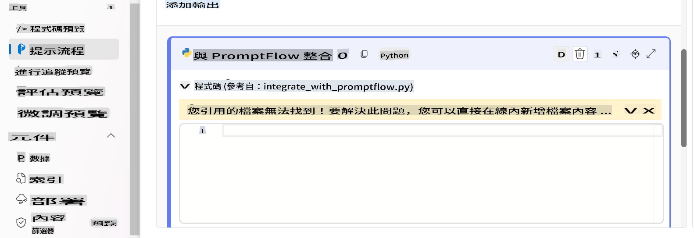

> [!NOTE]
> 有關在 Azure AI Foundry 中使用 Prompt flow 的更多詳細資訊，你可以參考 [Prompt flow in Azure AI Foundry](https://learn.microsoft.com/azure/ai-studio/how-to/prompt-flow)。

1. 選擇 **Chat input** 和 **Chat output**，以啟用與模型的對話功能。

    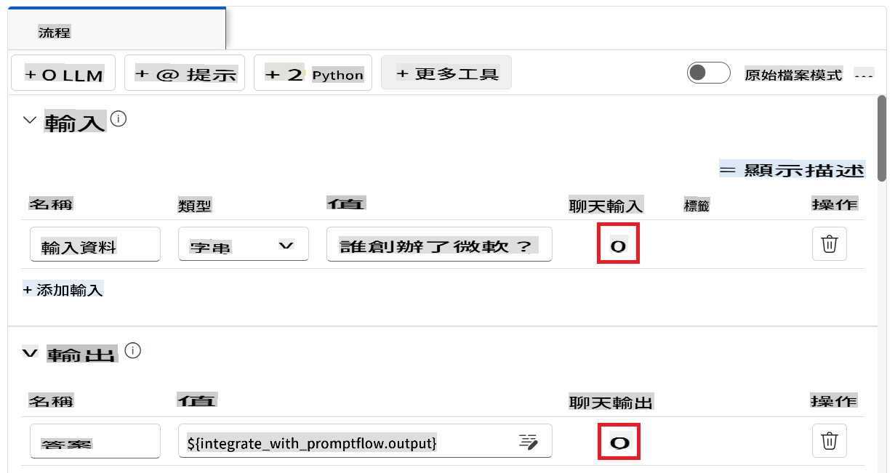

1. 現在你已準備好與自訂 Phi-3 / Phi-3.5 模型進行對話。在下一個練習中，你將學習如何啟動 Prompt flow 並使用它與微調後的 Phi-3 / Phi-3.5 模型進行對話。

> [!NOTE]
>
> 重建的流程應如下圖所示：
>
> 
>

#### 啟動 Prompt flow

1. 選擇 **Start compute sessions** 以啟動 Prompt flow。

    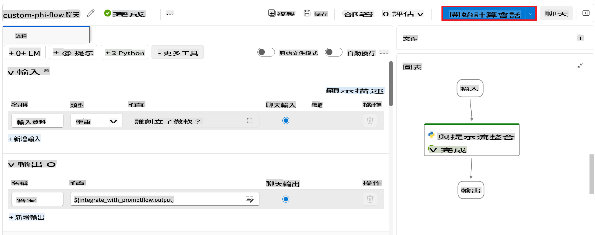

1. 選擇 **Validate and parse input** 以更新參數。

    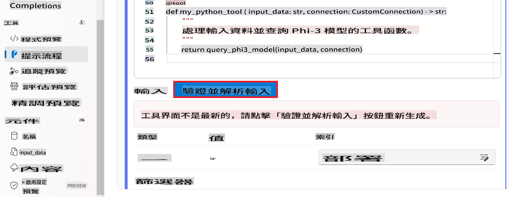

1. 選擇 **connection** 的 **Value**，選擇你建立的自訂連接。例如，*connection*。

    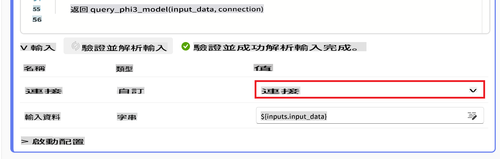

#### 與你的自訂 Phi-3 / Phi-3.5 模型對話

1. 選擇 **Chat**。

    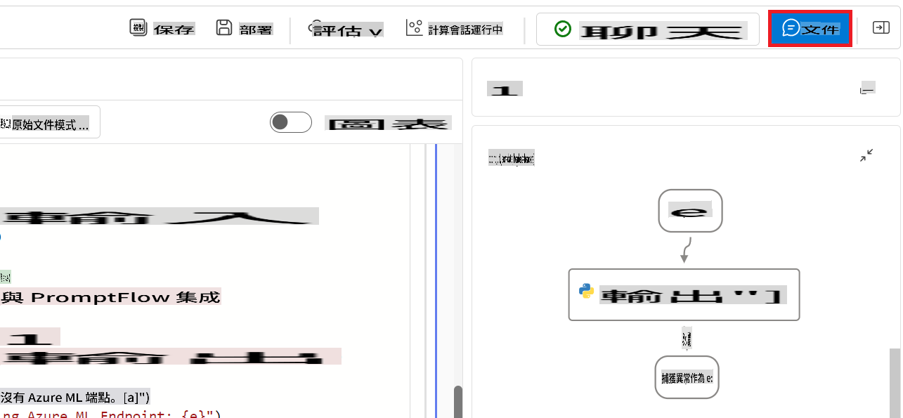

1. 以下是結果的範例：現在你可以與自訂 Phi-3 / Phi-3.5 模型對話。建議根據微調時使用的數據進行提問。

    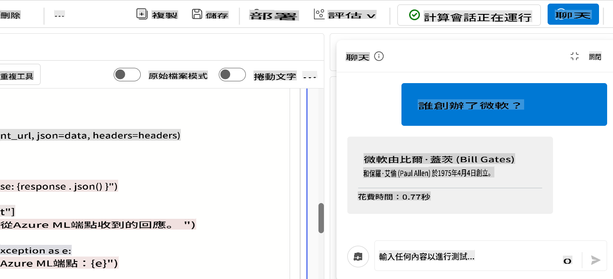

### 部署 Azure OpenAI 以評估 Phi-3 / Phi-3.5 模型

要在 Azure AI Foundry 中評估 Phi-3 / Phi-3.5 模型，你需要部署一個 Azure OpenAI 模型。此模型將用於評估 Phi-3 / Phi-3.5 模型的性能。

#### 部署 Azure OpenAI

1. 登錄到 [Azure AI Foundry](https://ai.azure.com/?wt.mc_id=studentamb_279723)。

1. 導航到你建立的 Azure AI Foundry 專案。

    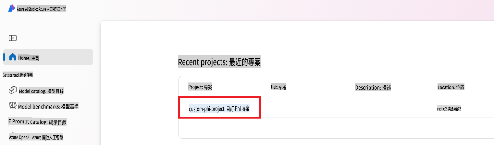

1. 在你建立的專案中，從左側標籤選擇 **Deployments**。

1. 從導航選單選擇 **+ Deploy model**。

1. 選擇 **Deploy base model**。

    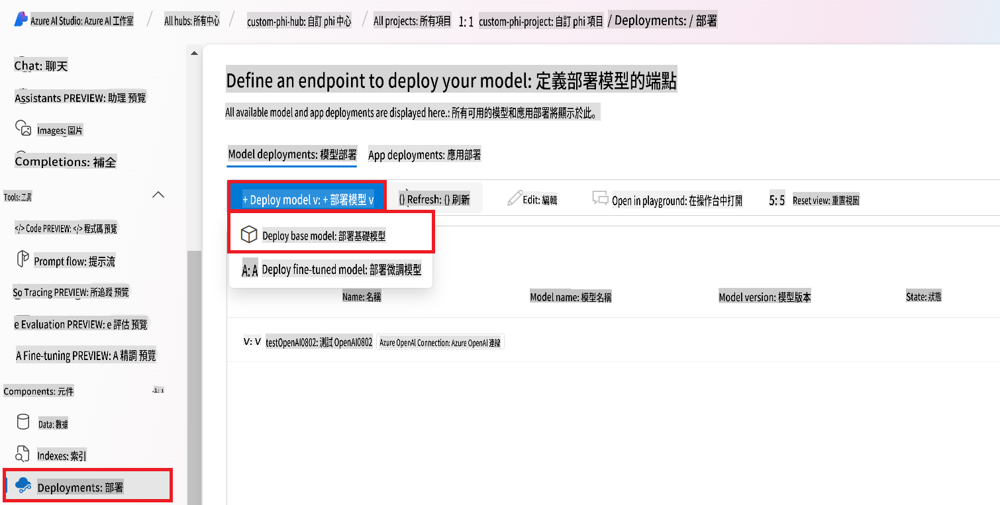

1. 選擇你想使用的 Azure OpenAI 模型。例如，**gpt-4o**。

    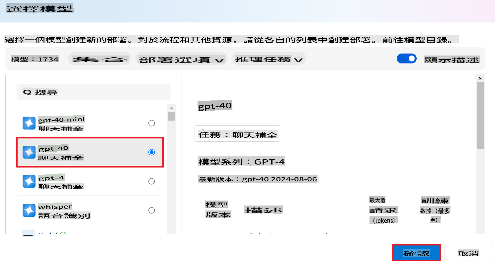

1. 選擇 **Confirm**。

### 使用 Azure AI Foundry 的 Prompt flow 評估微調後的 Phi-3 / Phi-3.5 模型

### 開始新的評估

1. 造訪 [Azure AI Foundry](https://ai.azure.com/?wt.mc_id=studentamb_279723)。

1. 導航到你建立的 Azure AI Foundry 專案。

    

1. 在你建立的專案中，從左側標籤選擇 **Evaluation**。

1. 從導航選單選擇 **+ New evaluation**。
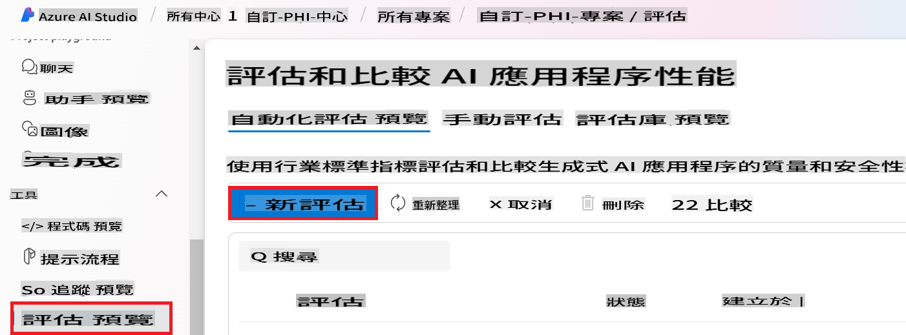

1. 選擇 **Prompt flow** 評估。

    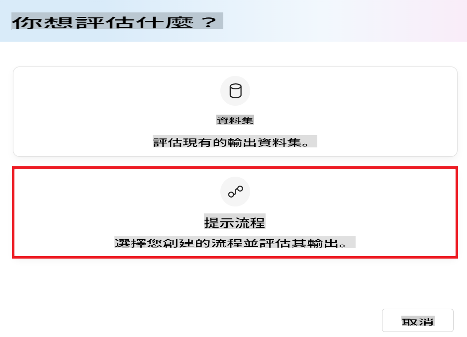

1. 完成以下任務：

    - 輸入評估名稱。名稱必須是唯一的。
    - 選擇 **Question and answer without context** 作為任務類型。因為本教程中使用的 **ULTRACHAT_200k** 數據集不包含上下文。
    - 選擇您希望評估的 Prompt flow。

    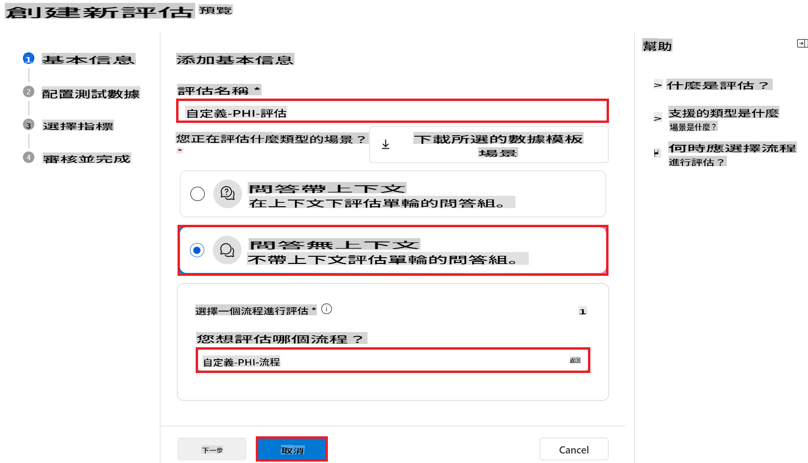

1. 選擇 **Next**。

1. 完成以下任務：

    - 選擇 **Add your dataset** 上傳數據集。例如，您可以上傳測試數據集文件，例如 *test_data.json1*，該文件包含在下載 **ULTRACHAT_200k** 數據集時。
    - 選擇與您的數據集匹配的 **Dataset column**。例如，如果您使用的是 **ULTRACHAT_200k** 數據集，請選擇 **${data.prompt}** 作為數據列。

    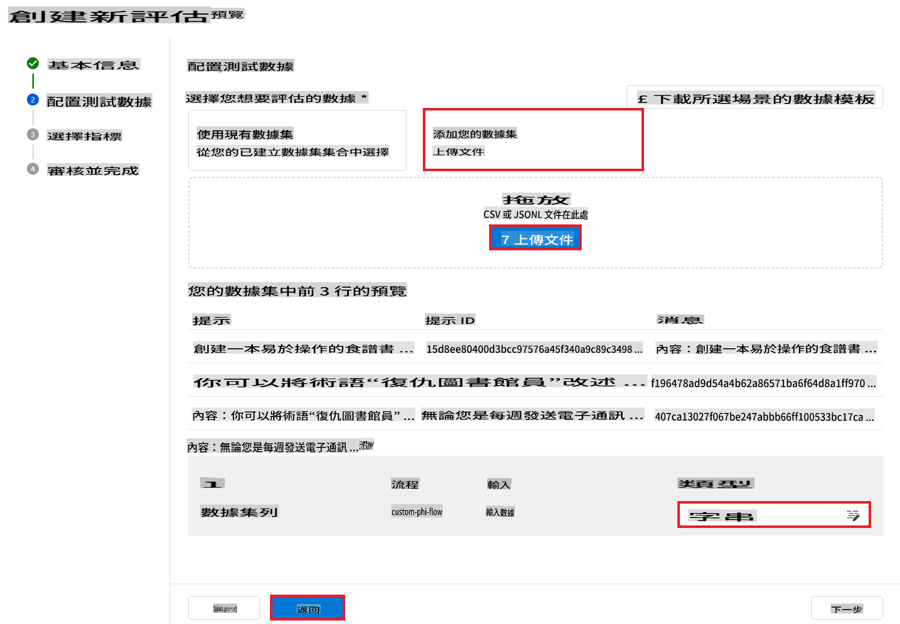

1. 選擇 **Next**。

1. 完成以下任務來配置性能和質量指標：

    - 選擇您希望使用的性能和質量指標。
    - 選擇您為評估創建的 Azure OpenAI 模型。例如，選擇 **gpt-4o**。

    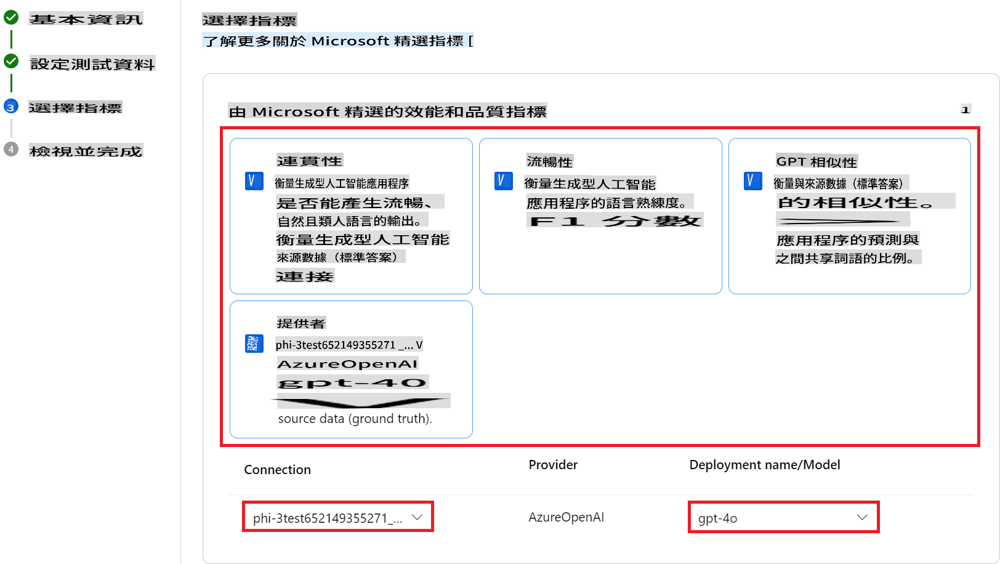

1. 完成以下任務來配置風險和安全指標：

    - 選擇您希望使用的風險和安全指標。
    - 選擇計算缺陷率的門檻。例如，選擇 **Medium**。
    - 對於 **question**，將 **Data source** 設置為 **{$data.prompt}**。
    - 對於 **answer**，將 **Data source** 設置為 **{$run.outputs.answer}**。
    - 對於 **ground_truth**，將 **Data source** 設置為 **{$data.message}**。

    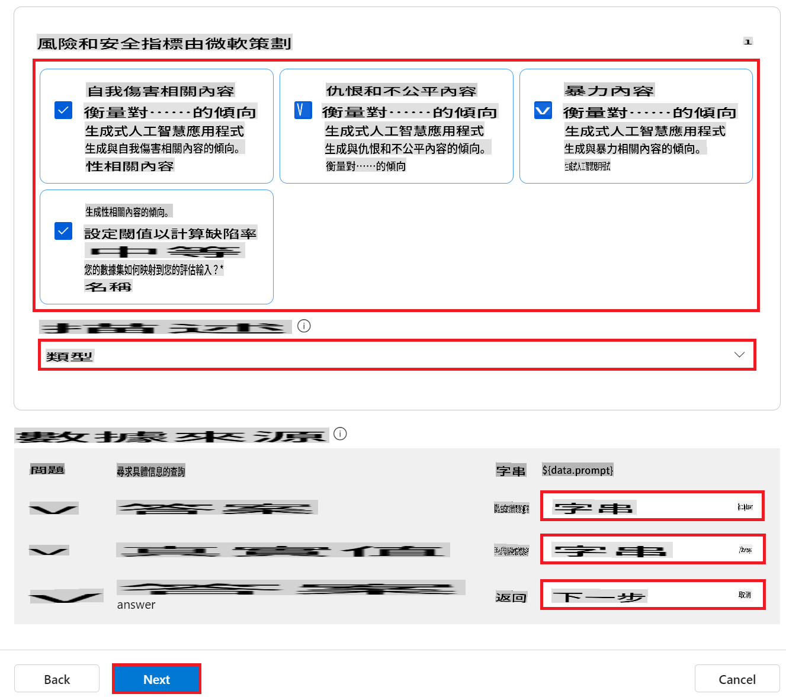

1. 選擇 **Next**。

1. 選擇 **Submit** 開始評估。

1. 評估需要一些時間才能完成。您可以在 **Evaluation** 標籤中監控進度。

### 查看評估結果

> [!NOTE]  
> 以下結果僅用於說明評估過程。在本教程中，我們使用了一個基於相對較小數據集微調的模型，可能導致結果不理想。實際結果可能會因數據集的大小、質量和多樣性以及模型的具體配置而有顯著差異。

評估完成後，您可以查看性能和安全指標的結果。

1. 性能和質量指標：

    - 評估模型在生成連貫、流暢且相關響應方面的有效性。

    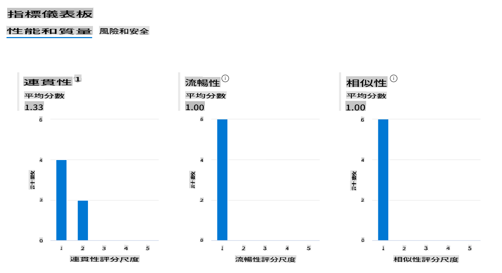

1. 風險和安全指標：

    - 確保模型的輸出是安全的，並符合負責任 AI 原則，避免任何有害或冒犯性內容。

    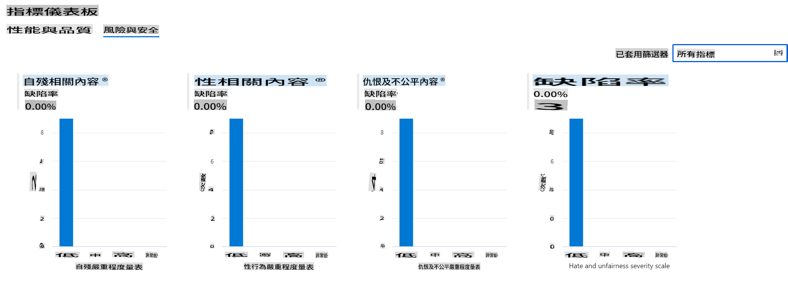

1. 您可以向下滾動查看 **Detailed metrics result**。

    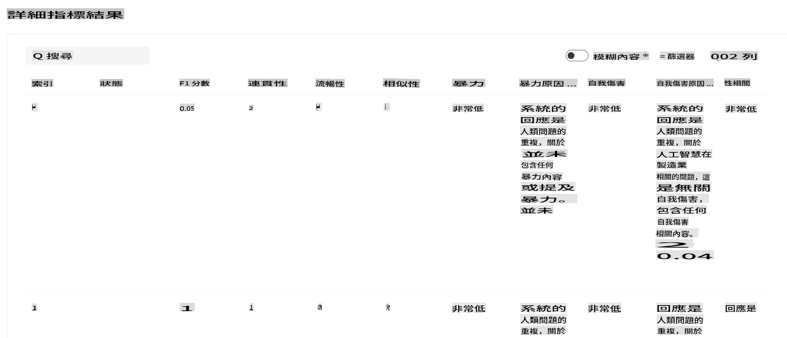

1. 通過對自定義 Phi-3 / Phi-3.5 模型進行性能和安全指標評估，您可以確認該模型不僅有效，還遵循負責任 AI 的實踐，為實際部署做好準備。

## 恭喜！

### 您已完成本教程

您已成功評估與 Prompt flow 集成的微調 Phi-3 模型。這是確保您的 AI 模型不僅表現出色，還符合 Microsoft 負責任 AI 原則的重要步驟，幫助您構建值得信賴且可靠的 AI 應用程序。


## 清理 Azure 資源

清理您的 Azure 資源以避免額外的帳戶費用。進入 Azure 入口網站並刪除以下資源：

- Azure Machine learning 資源。
- Azure Machine learning 模型端點。
- Azure AI Foundry 項目資源。
- Azure AI Foundry Prompt flow 資源。

### 下一步

#### 文件

- [使用負責任 AI 儀表板評估 AI 系統](https://learn.microsoft.com/azure/machine-learning/concept-responsible-ai-dashboard?view=azureml-api-2&source=recommendations?wt.mc_id=studentamb_279723)  
- [生成式 AI 的評估和監控指標](https://learn.microsoft.com/azure/ai-studio/concepts/evaluation-metrics-built-in?tabs=definition?wt.mc_id=studentamb_279723)  
- [Azure AI Foundry 文件](https://learn.microsoft.com/azure/ai-studio/?wt.mc_id=studentamb_279723)  
- [Prompt flow 文件](https://microsoft.github.io/promptflow/?wt.mc_id=studentamb_279723)  

#### 培訓內容

- [Microsoft 負責任 AI 方法的介紹](https://learn.microsoft.com/training/modules/introduction-to-microsofts-responsible-ai-approach/?source=recommendations?wt.mc_id=studentamb_279723)  
- [Azure AI Foundry 的介紹](https://learn.microsoft.com/training/modules/introduction-to-azure-ai-studio/?wt.mc_id=studentamb_279723)  

### 參考

- [什麼是負責任 AI？](https://learn.microsoft.com/azure/machine-learning/concept-responsible-ai?view=azureml-api-2?wt.mc_id=studentamb_279723)  
- [Azure AI 推出新工具，助您構建更安全且值得信賴的生成式 AI 應用](https://azure.microsoft.com/blog/announcing-new-tools-in-azure-ai-to-help-you-build-more-secure-and-trustworthy-generative-ai-applications/?wt.mc_id=studentamb_279723)  
- [生成式 AI 應用的評估](https://learn.microsoft.com/azure/ai-studio/concepts/evaluation-approach-gen-ai?wt.mc_id%3Dstudentamb_279723)  

**免責聲明**：  
本文件使用基於機器的人工智能翻譯服務進行翻譯。我們致力於提供準確的翻譯，但請注意，自動翻譯可能包含錯誤或不準確之處。原文的母語版本應被視為具權威性的來源。對於關鍵信息，建議尋求專業人工翻譯。我們對因使用本翻譯而引起的任何誤解或錯誤解釋概不負責。