# 微調整及整合自訂 Phi-3 模型與 Azure AI Foundry 的 Prompt Flow

此端到端 (E2E) 範例基於 Microsoft 技術社群的指南 "[Fine-Tune and Integrate Custom Phi-3 Models with Prompt Flow in Azure AI Foundry](https://techcommunity.microsoft.com/t5/educator-developer-blog/fine-tune-and-integrate-custom-phi-3-models-with-prompt-flow-in/ba-p/4191726?WT.mc_id=aiml-137032-kinfeylo)"，介紹如何微調、部署及整合自訂 Phi-3 模型與 Azure AI Foundry 的 Prompt Flow。  
不同於端到端範例 "[Fine-Tune and Integrate Custom Phi-3 Models with Prompt Flow](./E2E_Phi-3-FineTuning_PromptFlow_Integration.md)"，該範例需要在本地執行程式碼，本教程完全專注於在 Azure AI / ML Studio 中微調及整合模型。

## 概述

在此端到端範例中，你將學習如何微調 Phi-3 模型並將其與 Azure AI Foundry 的 Prompt Flow 整合。透過 Azure AI / ML Studio，你將建立部署及使用自訂 AI 模型的工作流程。本範例分為三個場景：

**場景 1：設定 Azure 資源並準備微調**  
**場景 2：微調 Phi-3 模型並在 Azure Machine Learning Studio 中部署**  
**場景 3：與 Prompt Flow 整合，並在 Azure AI Foundry 中與你的自訂模型互動**  

以下是本端到端範例的概覽。

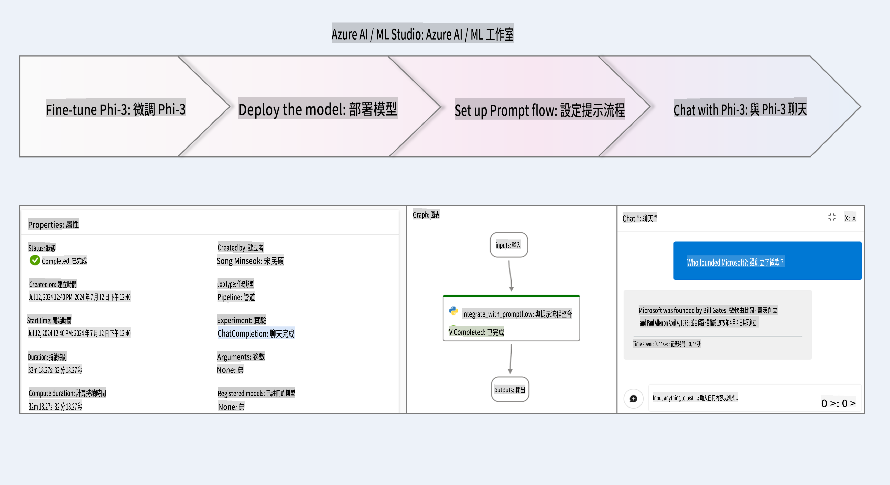

### 目錄

1. **[場景 1：設定 Azure 資源並準備微調](../../../../../../md/02.Application/01.TextAndChat/Phi3)**  
    - [建立 Azure Machine Learning Workspace](../../../../../../md/02.Application/01.TextAndChat/Phi3)  
    - [在 Azure 訂閱中申請 GPU 配額](../../../../../../md/02.Application/01.TextAndChat/Phi3)  
    - [新增角色指派](../../../../../../md/02.Application/01.TextAndChat/Phi3)  
    - [設定專案](../../../../../../md/02.Application/01.TextAndChat/Phi3)  
    - [準備微調所需的資料集](../../../../../../md/02.Application/01.TextAndChat/Phi3)  

2. **[場景 2：微調 Phi-3 模型並在 Azure Machine Learning Studio 中部署](../../../../../../md/02.Application/01.TextAndChat/Phi3)**  
    - [微調 Phi-3 模型](../../../../../../md/02.Application/01.TextAndChat/Phi3)  
    - [部署微調完成的 Phi-3 模型](../../../../../../md/02.Application/01.TextAndChat/Phi3)  

3. **[場景 3：與 Prompt Flow 整合，並在 Azure AI Foundry 中與你的自訂模型互動](../../../../../../md/02.Application/01.TextAndChat/Phi3)**  
    - [將自訂 Phi-3 模型與 Prompt Flow 整合](../../../../../../md/02.Application/01.TextAndChat/Phi3)  
    - [與你的自訂 Phi-3 模型互動](../../../../../../md/02.Application/01.TextAndChat/Phi3)  

## 場景 1：設定 Azure 資源並準備微調

### 建立 Azure Machine Learning Workspace

1. 在入口網站頂部的 **搜尋欄** 中輸入 *azure machine learning*，然後從出現的選項中選擇 **Azure Machine Learning**。

    

2. 從導航菜單中選擇 **+ 建立**。

3. 從導航菜單中選擇 **新建工作區**。

    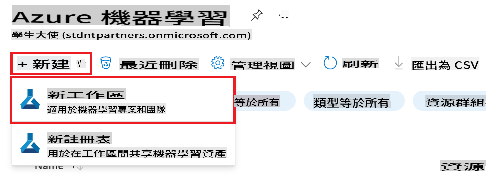

4. 執行以下任務：  
    - 選擇你的 Azure **訂閱**。  
    - 選擇要使用的 **資源群組**（如有需要可新建）。  
    - 輸入 **工作區名稱**，該名稱必須是唯一的。  
    - 選擇你想使用的 **區域**。  
    - 選擇要使用的 **儲存帳戶**（如有需要可新建）。  
    - 選擇要使用的 **金鑰保存庫**（如有需要可新建）。  
    - 選擇要使用的 **應用程式洞察**（如有需要可新建）。  
    - 選擇要使用的 **容器登錄**（如有需要可新建）。  

    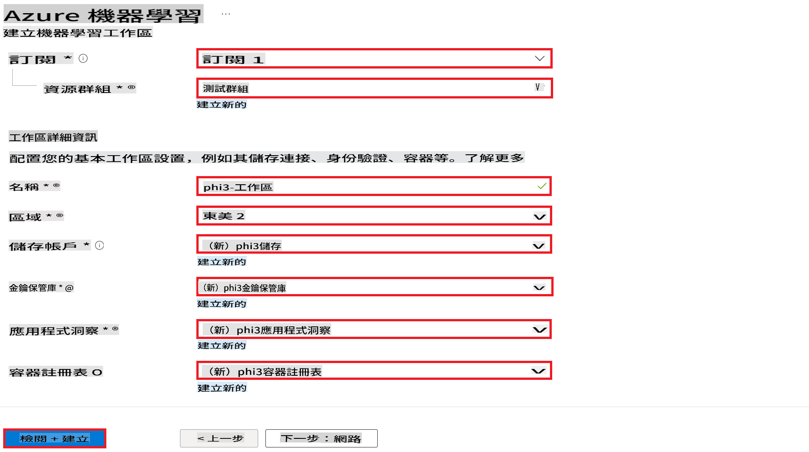

5. 選擇 **檢閱 + 建立**。

6. 選擇 **建立**。

### 在 Azure 訂閱中申請 GPU 配額

在此教程中，你將學習如何使用 GPU 微調及部署 Phi-3 模型。微調將使用 *Standard_NC24ads_A100_v4* GPU，這需要申請配額；部署將使用 *Standard_NC6s_v3* GPU，也需要申請配額。

> [!NOTE]  
> 只有按需付費訂閱（標準訂閱類型）才符合 GPU 配額申請資格；目前不支援福利訂閱。

1. 訪問 [Azure ML Studio](https://ml.azure.com/home?wt.mc_id=studentamb_279723)。

1. 執行以下任務以申請 *Standard NCADSA100v4 Family* 配額：  
    - 從左側選單中選擇 **配額**。  
    - 選擇要使用的 **虛擬機器系列**。例如，選擇 **Standard NCADSA100v4 Family Cluster Dedicated vCPUs**，它包括 *Standard_NC24ads_A100_v4* GPU。  
    - 從導航菜單中選擇 **申請配額**。

        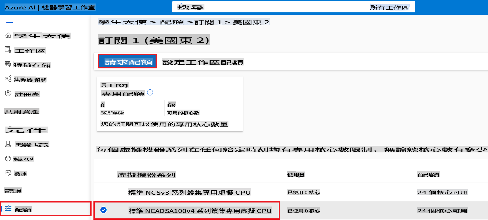

    - 在配額申請頁面中，輸入你想使用的 **新核心限制**，例如 24。  
    - 在配額申請頁面中，選擇 **提交** 以申請 GPU 配額。

1. 執行以下任務以申請 *Standard NCSv3 Family* 配額：  
    - 從左側選單中選擇 **配額**。  
    - 選擇要使用的 **虛擬機器系列**。例如，選擇 **Standard NCSv3 Family Cluster Dedicated vCPUs**，它包括 *Standard_NC6s_v3* GPU。  
    - 從導航菜單中選擇 **申請配額**。  
    - 在配額申請頁面中，輸入你想使用的 **新核心限制**，例如 24。  
    - 在配額申請頁面中，選擇 **提交** 以申請 GPU 配額。

### 新增角色指派

為了微調及部署你的模型，你必須先建立使用者分配的受管理身份 (UAI)，並為其分配適當的權限。此 UAI 將在部署過程中用於身份驗證。

#### 建立使用者分配的受管理身份 (UAI)

1. 在入口網站頂部的 **搜尋欄** 中輸入 *managed identities*，然後從出現的選項中選擇 **Managed Identities**。

    

1. 選擇 **+ 建立**。

    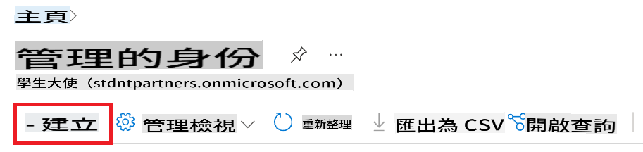

1. 執行以下任務：  
    - 選擇你的 Azure **訂閱**。  
    - 選擇要使用的 **資源群組**（如有需要可新建）。  
    - 選擇你想使用的 **區域**。  
    - 輸入 **名稱**，該名稱必須是唯一的。

    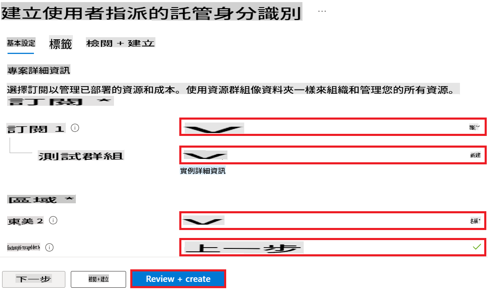

1. 選擇 **檢閱 + 建立**。

1. 選擇 **+ 建立**。

#### 新增 Contributor 角色指派至受管理身份

1. 導航至你建立的受管理身份資源。

1. 從左側選單中選擇 **Azure 角色指派**。

1. 從導航菜單中選擇 **+新增角色指派**。

1. 在新增角色指派頁面中，執行以下任務：  
    - 將 **範圍** 設為 **資源群組**。  
    - 選擇你的 Azure **訂閱**。  
    - 選擇要使用的 **資源群組**。  
    - 將 **角色** 設為 **Contributor**。

    

2. 選擇 **儲存**。

#### 新增 Storage Blob Data Reader 角色指派至受管理身份

1. 在入口網站頂部的 **搜尋欄** 中輸入 *storage accounts*，然後從出現的選項中選擇 **Storage accounts**。

    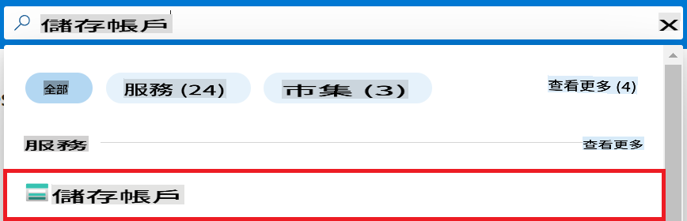

1. 選擇與你建立的 Azure Machine Learning 工作區相關聯的儲存帳戶。例如，*finetunephistorage*。

1. 執行以下任務以進入新增角色指派頁面：  
    - 導航至你建立的 Azure 儲存帳戶。  
    - 從左側選單中選擇 **存取控制 (IAM)**。  
    - 從導航菜單中選擇 **+ 新增**。  
    - 從導航菜單中選擇 **新增角色指派**。

    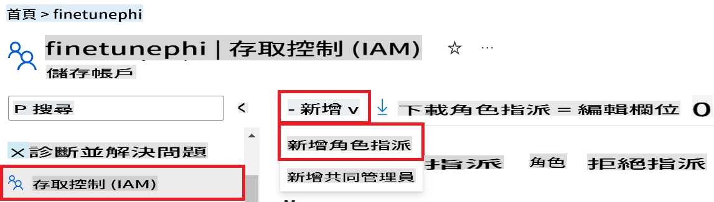

1. 在新增角色指派頁面中，執行以下任務：  
    - 在角色頁面中，於 **搜尋欄** 輸入 *Storage Blob Data Reader*，並從出現的選項中選擇 **Storage Blob Data Reader**。  
    - 在角色頁面中，選擇 **下一步**。  
    - 在成員頁面中，選擇 **指派存取權給** **受管理身份**。  
    - 在成員頁面中，選擇 **+ 選擇成員**。  
    - 在選擇受管理身份頁面中，選擇你的 Azure **訂閱**。  
    - 在選擇受管理身份頁面中，選擇 **受管理身份** 為 **Manage Identity**。  
    - 在選擇受管理身份頁面中，選擇你建立的受管理身份。例如，*finetunephi-managedidentity*。  
    - 在選擇受管理身份頁面中，選擇 **選擇**。

    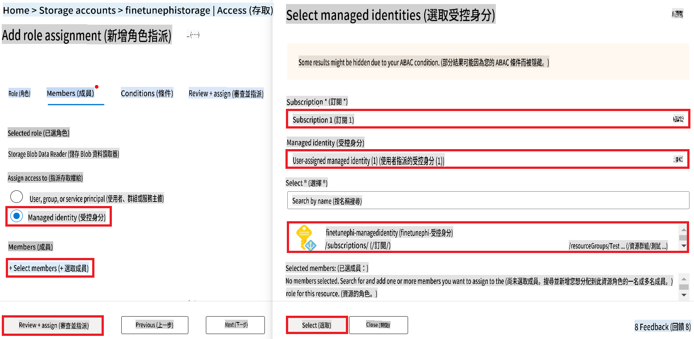

1. 選擇 **檢閱 + 指派**。

#### 新增 AcrPull 角色指派至受管理身份

1. 在入口網站頂部的 **搜尋欄** 中輸入 *container registries*，然後從出現的選項中選擇 **Container registries**。

    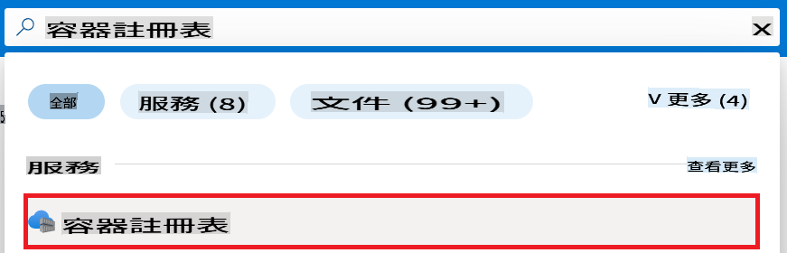

1. 選擇與 Azure Machine Learning 工作區相關聯的容器登錄。例如，*finetunephicontainerregistry*。

1. 執行以下任務以進入新增角色指派頁面：  
    - 從左側選單中選擇 **存取控制 (IAM)**。  
    - 從導航菜單中選擇 **+ 新增**。  
    - 從導航菜單中選擇 **新增角色指派**。

1. 在新增角色指派頁面中，執行以下任務：  
    - 在角色頁面中，於 **搜尋欄** 輸入 *AcrPull*，並從出現的選項中選擇 **AcrPull**。  
    - 在角色頁面中，選擇 **下一步**。  
    - 在成員頁面中，選擇 **指派存取權給** **受管理身份**。  
    - 在成員頁面中，選擇 **+ 選擇成員**。  
    - 在選擇受管理身份頁面中，選擇你的 Azure **訂閱**。  
    - 在選擇受管理身份頁面中，選擇 **受管理身份** 為 **Manage Identity**。  
    - 在選擇受管理身份頁面中，選擇你建立的受管理身份。例如，*finetunephi-managedidentity*。  
    - 在選擇受管理身份頁面中，選擇 **選擇**。  
    - 選擇 **檢閱 + 指派**。

### 設定專案

為了下載微調所需的資料集，你需要設定本地環境。

在此練習中，你將：  
- 建立一個資料夾來進行操作。  
- 建立虛擬環境。  
- 安裝必要的套件。  
- 建立一個 *download_dataset.py* 文件來下載資料集。

#### 建立一個資料夾來進行操作

1. 打開終端機，輸入以下指令以在預設路徑中建立名為 *finetune-phi* 的資料夾。

    ```console
    mkdir finetune-phi
    ```

2. 在終端機中輸入以下指令以進入你建立的 *finetune-phi* 資料夾。

    ```console
    cd finetune-phi
    ```

#### 建立虛擬環境

1. 在終端機中輸入以下指令以建立名為 *.venv* 的虛擬環境。

    ```console
    python -m venv .venv
    ```

2. 在終端機中輸入以下指令以啟動虛擬環境。

    ```console
    .venv\Scripts\activate.bat
    ```

> [!NOTE]  
> 如果成功啟動，你應該會看到 *(.venv)* 顯示在指令提示符之前。

#### 安裝必要的套件

1. 在終端機中輸入以下指令以安裝必要的套件。

    ```console
    pip install datasets==2.19.1
    ```

#### 建立 `download_dataset.py`

> [!NOTE]  
> 完整資料夾結構：  
>  
> ```text
> └── YourUserName
> .    └── finetune-phi
> .        └── download_dataset.py
> ```

1. 打開 **Visual Studio Code**。

1. 從選單欄中選擇 **檔案**。

1. 選擇 **開啟資料夾**。

1. 選擇你建立的 *finetune-phi* 資料夾，位於 *C:\Users\yourUserName\finetune-phi*。

    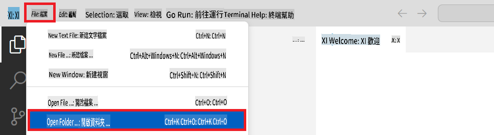

1. 在 Visual Studio Code 的左側窗格中，右鍵點擊並選擇 **新建檔案**，以建立名為 *download_dataset.py* 的新檔案。

    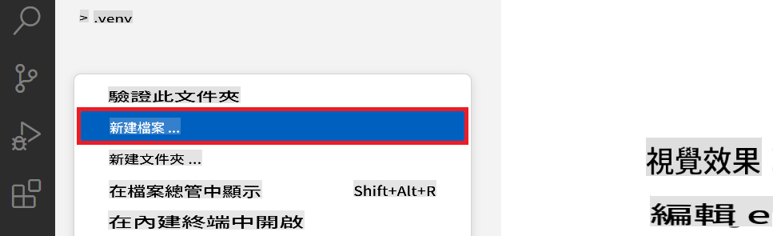

### 準備微調所需的資料集

在此練習中，你將執行 *download_dataset.py* 文件，以將 *ultrachat_200k* 資料集下載到本地環境。然後，你將使用此資料集在 Azure Machine Learning 中微調 Phi-3 模型。

在此練習中，你將：  
- 在 *download_dataset.py* 文件中新增程式碼以下載資料集。  
- 執行 *download_dataset.py* 文件，將資料集下載到本地環境。

#### 使用 *download_dataset.py* 下載資料集

1. 在 Visual Studio Code 中打開 *download_dataset.py* 文件。

1. 將以下程式碼新增到 *download_dataset.py* 文件中。

    ```python
    import json
    import os
    from datasets import load_dataset

    def load_and_split_dataset(dataset_name, config_name, split_ratio):
        """
        Load and split a dataset.
        """
        # Load the dataset with the specified name, configuration, and split ratio
        dataset = load_dataset(dataset_name, config_name, split=split_ratio)
        print(f"Original dataset size: {len(dataset)}")
        
        # Split the dataset into train and test sets (80% train, 20% test)
        split_dataset = dataset.train_test_split(test_size=0.2)
        print(f"Train dataset size: {len(split_dataset['train'])}")
        print(f"Test dataset size: {len(split_dataset['test'])}")
        
        return split_dataset

    def save_dataset_to_jsonl(dataset, filepath):
        """
        Save a dataset to a JSONL file.
        """
        # Create the directory if it does not exist
        os.makedirs(os.path.dirname(filepath), exist_ok=True)
        
        # Open the file in write mode
        with open(filepath, 'w', encoding='utf-8') as f:
            # Iterate over each record in the dataset
            for record in dataset:
                # Dump the record as a JSON object and write it to the file
                json.dump(record, f)
                # Write a newline character to separate records
                f.write('\n')
        
        print(f"Dataset saved to {filepath}")

    def main():
        """
        Main function to load, split, and save the dataset.
        """
        # Load and split the ULTRACHAT_200k dataset with a specific configuration and split ratio
        dataset = load_and_split_dataset("HuggingFaceH4/ultrachat_200k", 'default', 'train_sft[:1%]')
        
        # Extract the train and test datasets from the split
        train_dataset = dataset['train']
        test_dataset = dataset['test']

        # Save the train dataset to a JSONL file
        save_dataset_to_jsonl(train_dataset, "data/train_data.jsonl")
        
        # Save the test dataset to a separate JSONL file
        save_dataset_to_jsonl(test_dataset, "data/test_data.jsonl")

    if __name__ == "__main__":
        main()

    ```

1. 在終端機中輸入以下指令以執行程式碼並將資料集下載到本地環境。

    ```console
    python download_dataset.py
    ```

1. 確認資料集已成功儲存至本地 *finetune-phi/data* 資料夾。

> [!NOTE]  
>
> #### 關於資料集大小與微調時間的注意事項  
>
> 在此教程中，你只使用 1% 的
1. 造訪 [Azure ML Studio](https://ml.azure.com/home?wt.mc_id=studentamb_279723)。

1. 從左側選單中選擇 **Compute**。

1. 選擇 **Compute clusters**。

1. 點擊 **+ New**。

    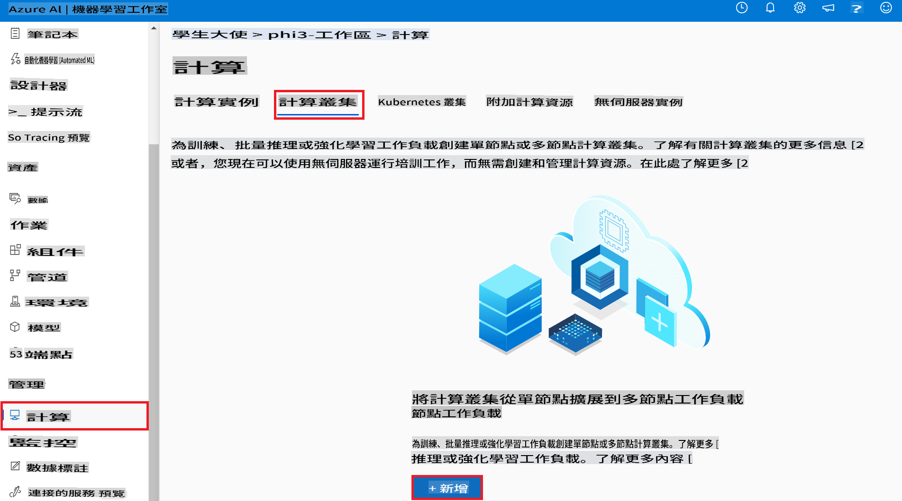

1. 完成以下步驟：

    - 選擇你想使用的 **Region**。
    - 將 **Virtual machine tier** 設為 **Dedicated**。
    - 將 **Virtual machine type** 設為 **GPU**。
    - 將 **Virtual machine size** 篩選器設為 **Select from all options**。
    - 將 **Virtual machine size** 設為 **Standard_NC24ads_A100_v4**。

    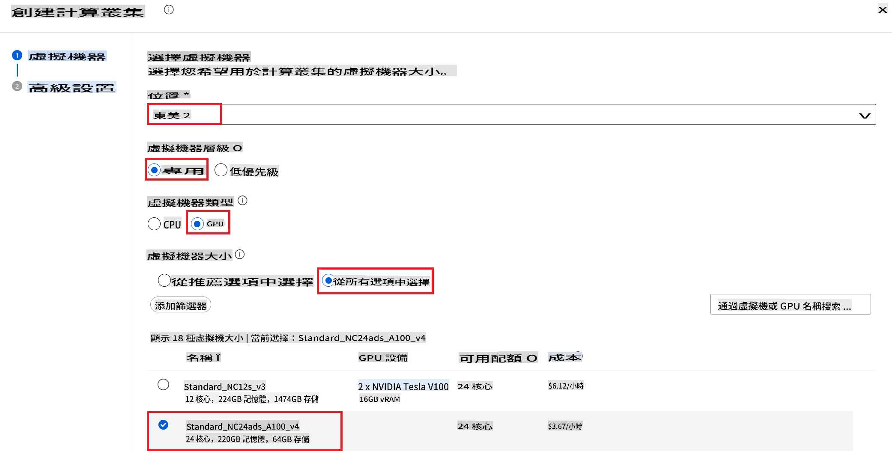

1. 點擊 **Next**。

1. 完成以下步驟：

    - 輸入 **Compute name**，需為唯一值。
    - 將 **Minimum number of nodes** 設為 **0**。
    - 將 **Maximum number of nodes** 設為 **1**。
    - 將 **Idle seconds before scale down** 設為 **120**。

    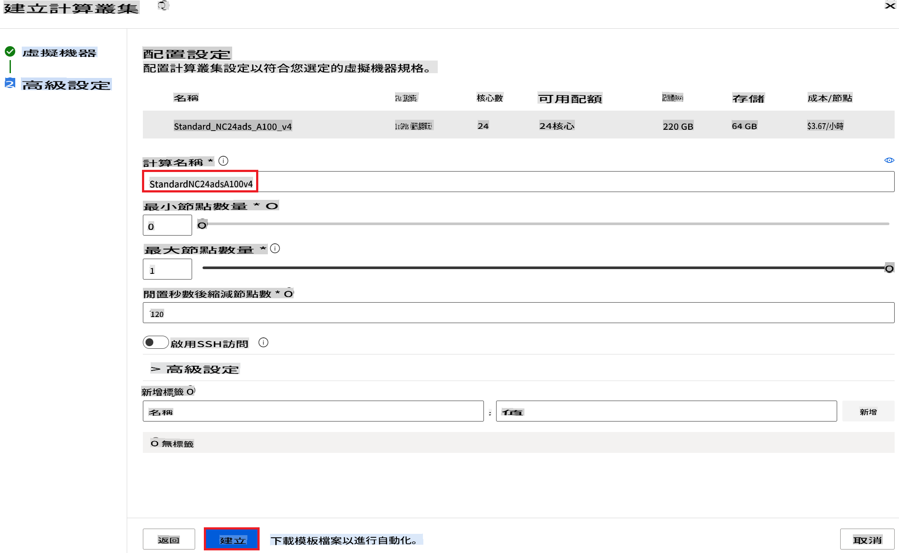

1. 點擊 **Create**。

#### 微調 Phi-3 模型

1. 造訪 [Azure ML Studio](https://ml.azure.com/home?wt.mc_id=studentamb_279723)。

1. 選擇你已建立的 Azure Machine Learning workspace。

    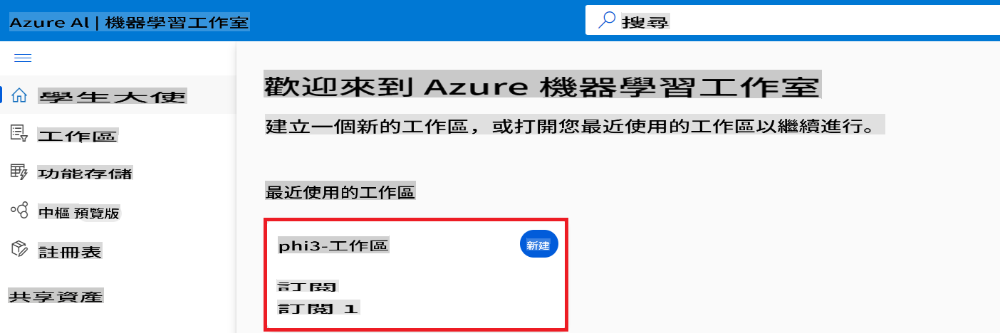

1. 完成以下步驟：

    - 從左側選單中選擇 **Model catalog**。
    - 在 **search bar** 中輸入 *phi-3-mini-4k*，並從出現的選項中選擇 **Phi-3-mini-4k-instruct**。

    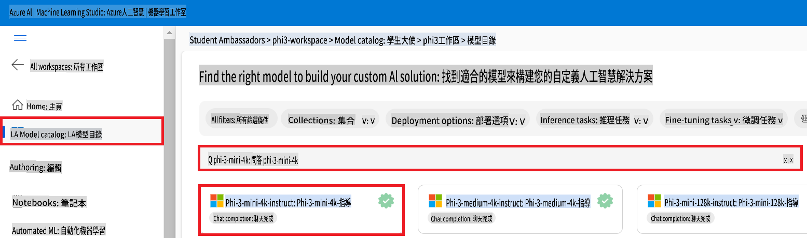

1. 從導航菜單中選擇 **Fine-tune**。

    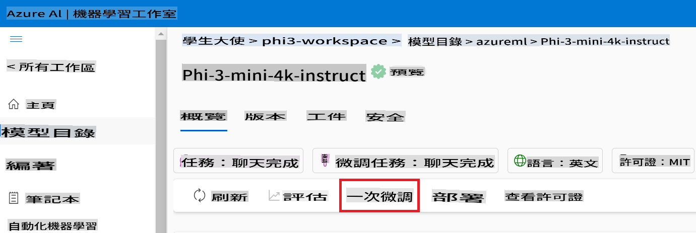

1. 完成以下步驟：

    - 將 **Select task type** 設為 **Chat completion**。
    - 點擊 **+ Select data** 上傳 **Training data**。
    - 將 Validation data 上傳類型設為 **Provide different validation data**。
    - 點擊 **+ Select data** 上傳 **Validation data**。

    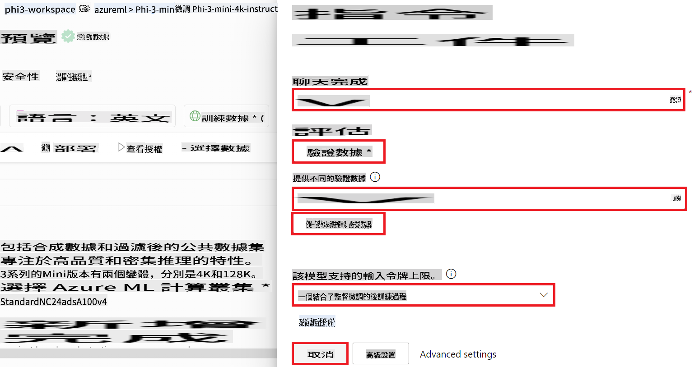

    > [!TIP]
    >
    > 你可以選擇 **Advanced settings** 來自訂如 **learning_rate** 和 **lr_scheduler_type** 等設定，以根據你的需求最佳化微調過程。

1. 點擊 **Finish**。

1. 在這次練習中，你已成功使用 Azure Machine Learning 微調 Phi-3 模型。請注意，微調過程可能需要較長時間。執行微調工作後，你需要等待其完成。你可以透過進入 Azure Machine Learning Workspace 左側的 Jobs 分頁來監控微調工作的狀態。在接下來的系列中，你將部署微調後的模型並將其整合到 Prompt flow 中。

    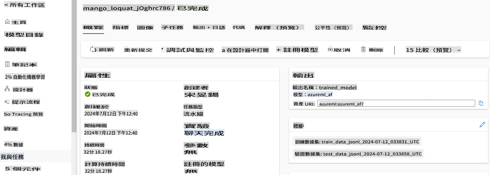

### 部署微調後的 Phi-3 模型

為了將微調後的 Phi-3 模型與 Prompt flow 整合，你需要部署該模型以供即時推理使用。這個過程包括註冊模型、建立線上端點並部署模型。

在這次練習中，你將：

- 在 Azure Machine Learning workspace 中註冊微調後的模型。
- 建立線上端點。
- 部署已註冊的微調後 Phi-3 模型。

#### 註冊微調後的模型

1. 造訪 [Azure ML Studio](https://ml.azure.com/home?wt.mc_id=studentamb_279723)。

1. 選擇你已建立的 Azure Machine Learning workspace。

    

1. 從左側選單中選擇 **Models**。
1. 點擊 **+ Register**。
1. 選擇 **From a job output**。

    

1. 選擇你已建立的工作。

    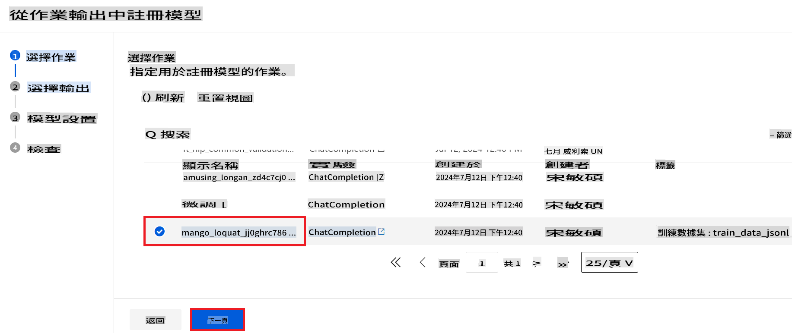

1. 點擊 **Next**。

1. 將 **Model type** 設為 **MLflow**。

1. 確保 **Job output** 已選擇，應該會自動選擇。

    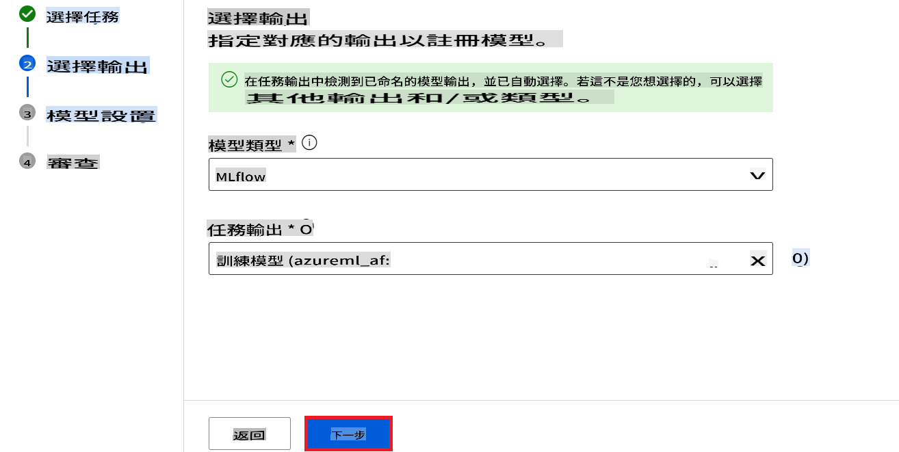

2. 點擊 **Next**。

3. 點擊 **Register**。

    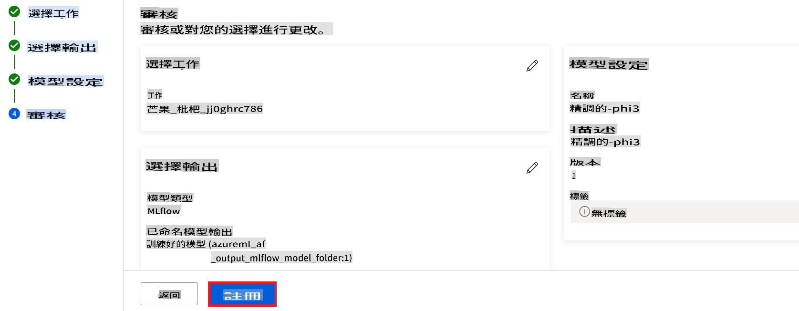

4. 你可以透過左側選單中的 **Models** 查看已註冊的模型。

    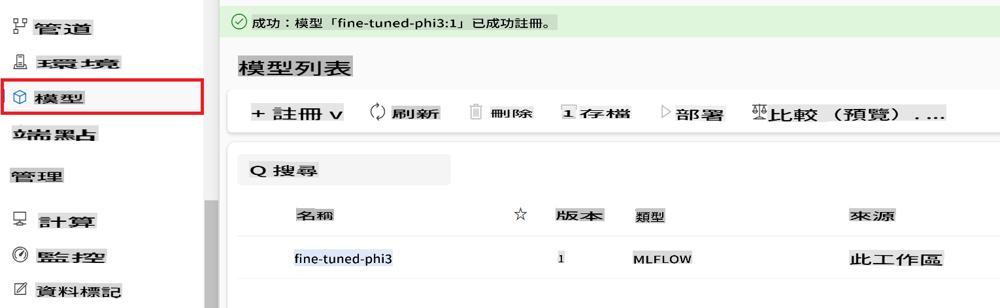

#### 部署微調後的模型

1. 前往你已建立的 Azure Machine Learning workspace。

1. 從左側選單中選擇 **Endpoints**。

1. 從導航菜單中選擇 **Real-time endpoints**。

    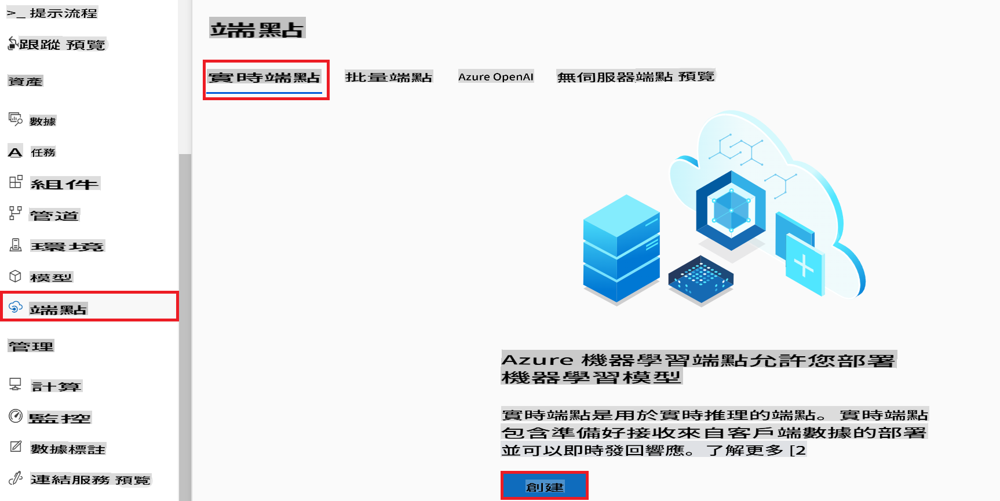

1. 點擊 **Create**。

1. 選擇你已註冊的模型。

    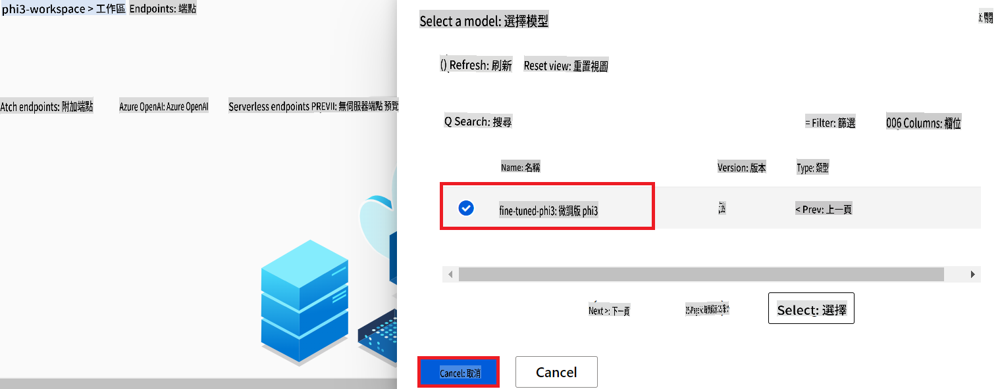

1. 點擊 **Select**。

1. 完成以下步驟：

    - 將 **Virtual machine** 設為 *Standard_NC6s_v3*。
    - 選擇你需要的 **Instance count**，例如 *1*。
    - 將 **Endpoint** 設為 **New** 以建立新端點。
    - 輸入 **Endpoint name**，需為唯一值。
    - 輸入 **Deployment name**，需為唯一值。

    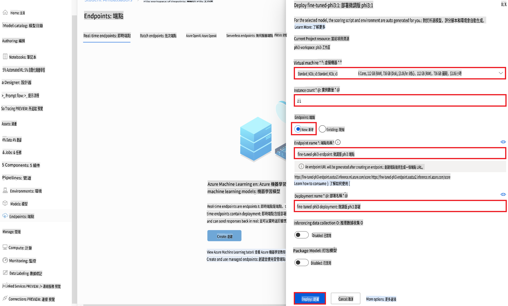

1. 點擊 **Deploy**。

> [!WARNING]
> 為避免額外的帳戶費用，請確保刪除在 Azure Machine Learning workspace 中建立的端點。
>

#### 在 Azure Machine Learning Workspace 中檢查部署狀態

1. 前往你已建立的 Azure Machine Learning workspace。

1. 從左側選單中選擇 **Endpoints**。

1. 選擇你已建立的端點。

    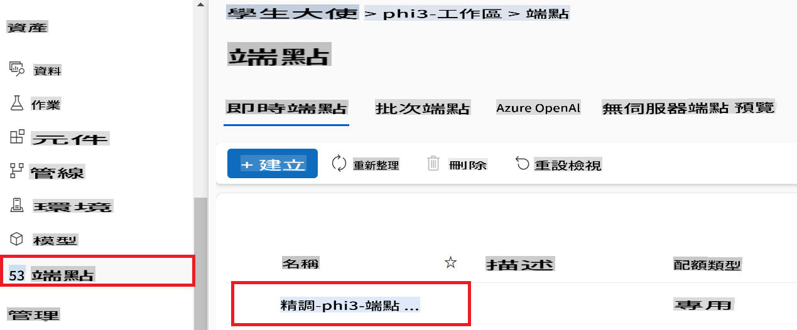

1. 在此頁面中，你可以管理部署過程中的端點。

> [!NOTE]
> 部署完成後，請確保 **Live traffic** 設為 **100%**。如果不是，請選擇 **Update traffic** 來調整流量設定。注意，如果流量設為 0%，你將無法測試模型。
>
> 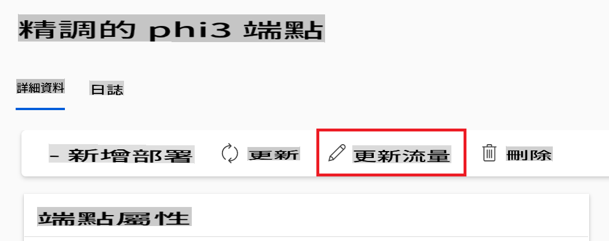
>

## 場景 3：整合 Prompt flow 並與自訂模型在 Azure AI Foundry 中互動

### 將自訂 Phi-3 模型與 Prompt flow 整合

成功部署微調後的模型後，你現在可以將其整合到 Prompt Flow 中，實現即時應用中的互動功能，讓你的自訂 Phi-3 模型執行多種互動任務。

在這次練習中，你將：

- 建立 Azure AI Foundry Hub。
- 建立 Azure AI Foundry Project。
- 建立 Prompt flow。
- 為微調後的 Phi-3 模型新增自訂連線。
- 設置 Prompt flow 與你的自訂 Phi-3 模型互動。

> [!NOTE]
> 你也可以透過 Azure ML Studio 整合到 Promptflow。相同的整合過程適用於 Azure ML Studio。

#### 建立 Azure AI Foundry Hub

在建立 Project 之前，你需要先建立 Hub。Hub 就像是一個資源群組，讓你能夠在 Azure AI Foundry 中組織和管理多個 Projects。

1. 造訪 [Azure AI Foundry](https://ai.azure.com/?WT.mc_id=aiml-137032-kinfeylo)。

1. 從左側選單中選擇 **All hubs**。

1. 點擊導航菜單中的 **+ New hub**。

    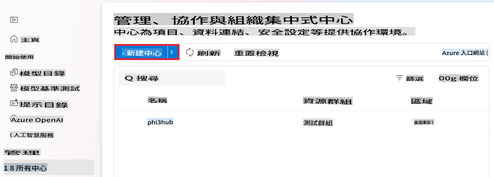

1. 完成以下步驟：

    - 輸入 **Hub name**，需為唯一值。
    - 選擇你的 Azure **Subscription**。
    - 選擇要使用的 **Resource group**（如有需要可新建）。
    - 選擇你想使用的 **Location**。
    - 選擇 **Connect Azure AI Services**（如有需要可新建）。
    - 將 **Connect Azure AI Search** 設為 **Skip connecting**。

    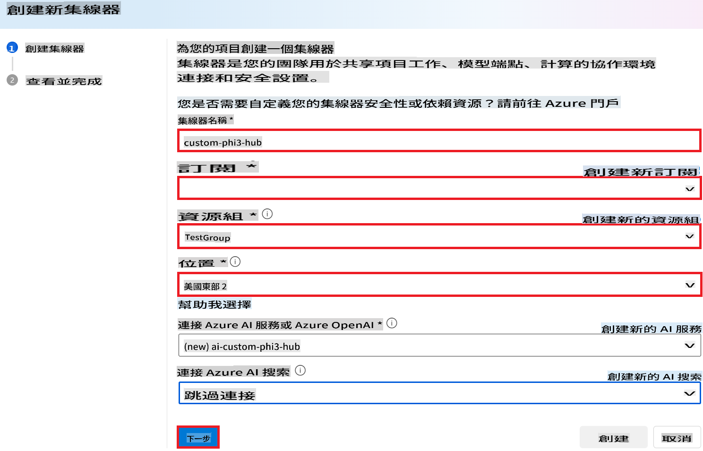

1. 點擊 **Next**。

#### 建立 Azure AI Foundry Project

1. 在你建立的 Hub 中，從左側選單中選擇 **All projects**。

1. 點擊導航菜單中的 **+ New project**。

    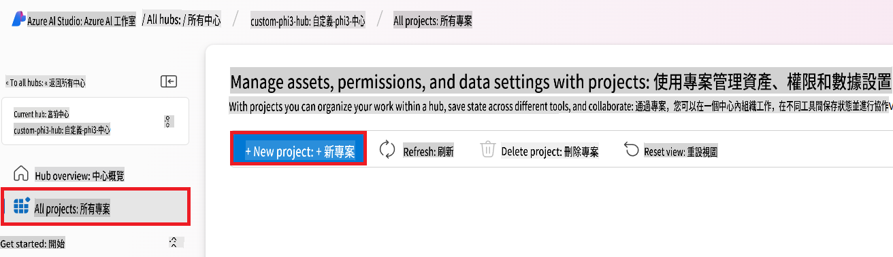

1. 輸入 **Project name**，需為唯一值。

    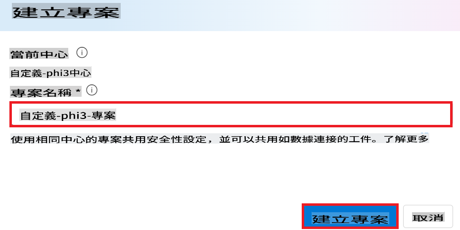

1. 點擊 **Create a project**。

#### 為微調後的 Phi-3 模型新增自訂連線

為了將你的自訂 Phi-3 模型整合到 Prompt flow 中，你需要將模型的端點和金鑰儲存在自訂連線中。此設置確保你能在 Prompt flow 中訪問你的自訂 Phi-3 模型。

#### 設置微調後 Phi-3 模型的 api key 和端點 uri

1. 造訪 [Azure ML Studio](https://ml.azure.com/home?WT.mc_id=aiml-137032-kinfeylo)。

1. 前往你已建立的 Azure Machine Learning workspace。

1. 從左側選單中選擇 **Endpoints**。

    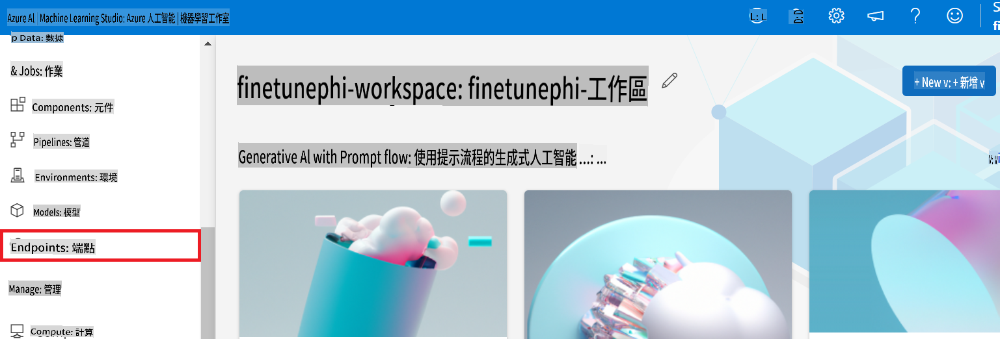

1. 選擇你已建立的端點。

    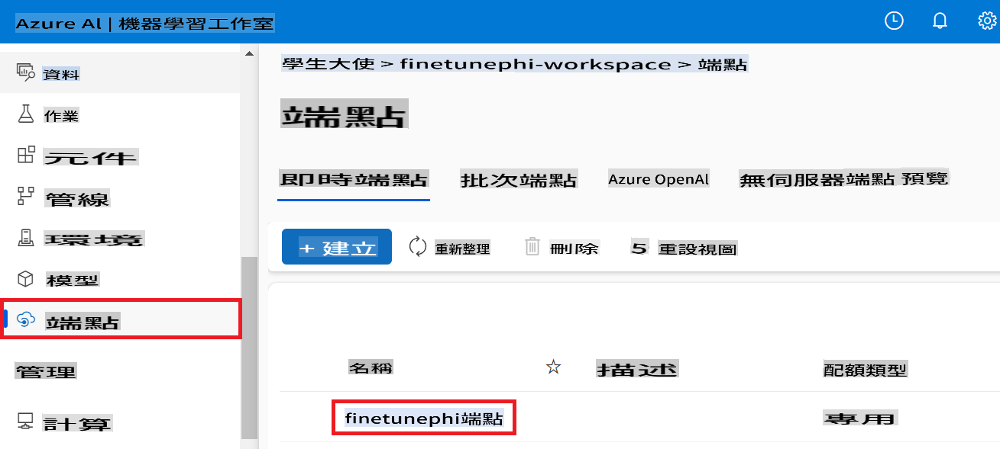

1. 從導航菜單中選擇 **Consume**。

1. 複製你的 **REST endpoint** 和 **Primary key**。
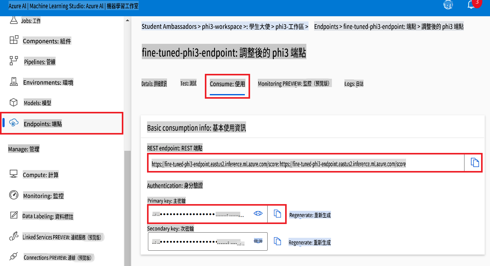

#### 新增自訂連線

1. 瀏覽 [Azure AI Foundry](https://ai.azure.com/?WT.mc_id=aiml-137032-kinfeylo)。

1. 進入你已建立的 Azure AI Foundry 專案。

1. 在你建立的專案中，從左側選單選擇 **Settings**。

1. 選擇 **+ New connection**。

    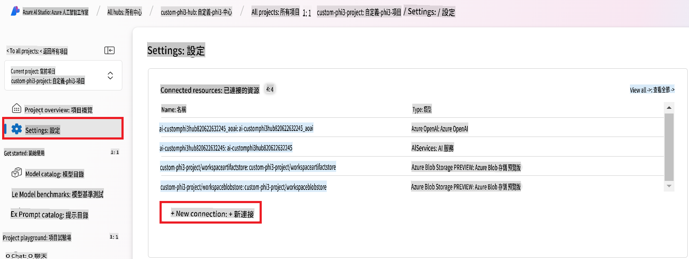

1. 從導航選單中選擇 **Custom keys**。

    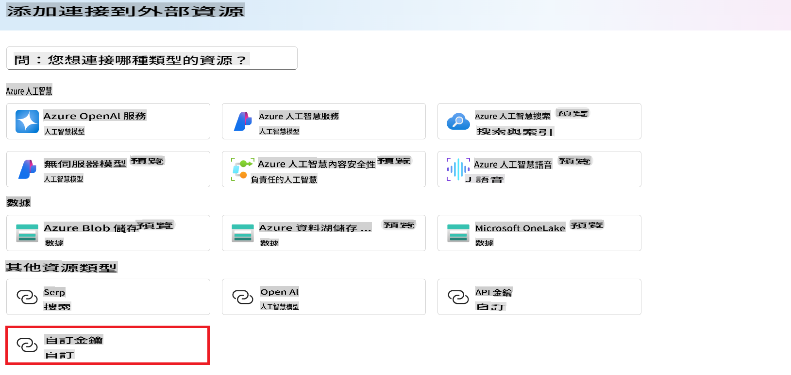

1. 執行以下操作：

    - 選擇 **+ Add key value pairs**。
    - 在金鑰名稱輸入 **endpoint**，並將從 Azure ML Studio 複製的端點貼到值的欄位中。
    - 再次選擇 **+ Add key value pairs**。
    - 在金鑰名稱輸入 **key**，並將從 Azure ML Studio 複製的金鑰貼到值的欄位中。
    - 添加金鑰後，選擇 **is secret** 以防止金鑰被暴露。

    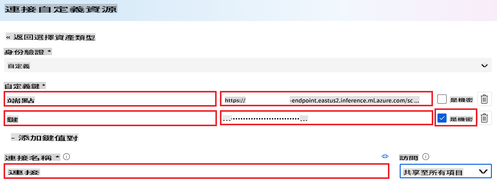

1. 選擇 **Add connection**。

#### 建立 Prompt flow

你已經在 Azure AI Foundry 中新增了一個自訂連線。現在，讓我們使用以下步驟建立一個 Prompt flow。然後，你將把這個 Prompt flow 連接到自訂連線，以便在 Prompt flow 中使用微調後的模型。

1. 進入你已建立的 Azure AI Foundry 專案。

1. 從左側選單選擇 **Prompt flow**。

1. 從導航選單選擇 **+ Create**。

    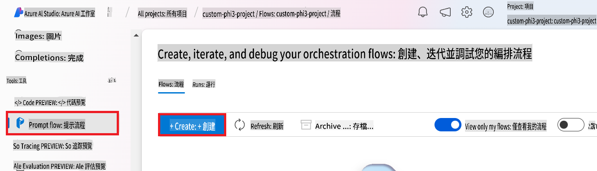

1. 從導航選單選擇 **Chat flow**。

    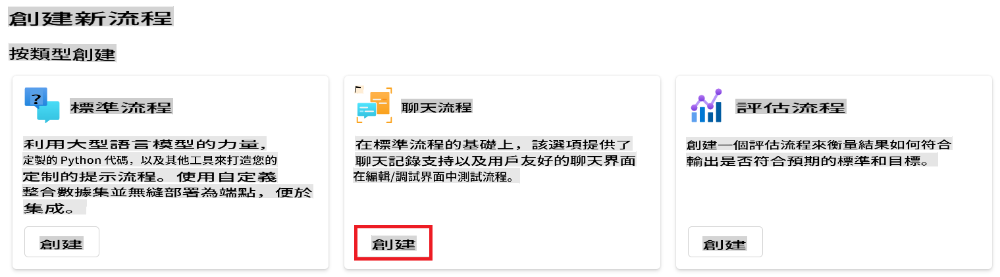

1. 輸入要使用的 **Folder name**。

    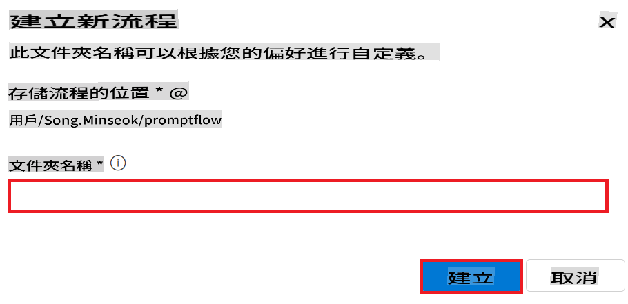

2. 選擇 **Create**。

#### 設置 Prompt flow 與自訂 Phi-3 模型進行對話

你需要將微調後的 Phi-3 模型整合到 Prompt flow 中。不過，現有的 Prompt flow 並非為此目的設計，因此你需要重新設計 Prompt flow，讓它可以整合自訂模型。

1. 在 Prompt flow 中，執行以下操作來重建現有流程：

    - 選擇 **Raw file mode**。
    - 刪除 *flow.dag.yml* 文件中的所有現有程式碼。
    - 在 *flow.dag.yml* 文件中新增以下程式碼。

        ```yml
        inputs:
          input_data:
            type: string
            default: "Who founded Microsoft?"

        outputs:
          answer:
            type: string
            reference: ${integrate_with_promptflow.output}

        nodes:
        - name: integrate_with_promptflow
          type: python
          source:
            type: code
            path: integrate_with_promptflow.py
          inputs:
            input_data: ${inputs.input_data}
        ```

    - 選擇 **Save**。

    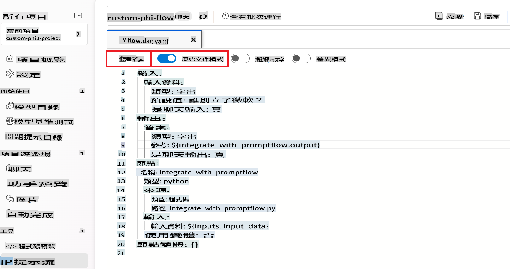

1. 在 *integrate_with_promptflow.py* 文件中新增以下程式碼，以便在 Prompt flow 中使用自訂 Phi-3 模型。

    ```python
    import logging
    import requests
    from promptflow import tool
    from promptflow.connections import CustomConnection

    # Logging setup
    logging.basicConfig(
        format="%(asctime)s - %(levelname)s - %(name)s - %(message)s",
        datefmt="%Y-%m-%d %H:%M:%S",
        level=logging.DEBUG
    )
    logger = logging.getLogger(__name__)

    def query_phi3_model(input_data: str, connection: CustomConnection) -> str:
        """
        Send a request to the Phi-3 model endpoint with the given input data using Custom Connection.
        """

        # "connection" is the name of the Custom Connection, "endpoint", "key" are the keys in the Custom Connection
        endpoint_url = connection.endpoint
        api_key = connection.key

        headers = {
            "Content-Type": "application/json",
            "Authorization": f"Bearer {api_key}"
        }
        data = {
            "input_data": {
                "input_string": [
                    {"role": "user", "content": input_data}
                ],
                "parameters": {
                    "temperature": 0.7,
                    "max_new_tokens": 128
                }
            }
        }
        try:
            response = requests.post(endpoint_url, json=data, headers=headers)
            response.raise_for_status()
            
            # Log the full JSON response
            logger.debug(f"Full JSON response: {response.json()}")

            result = response.json()["output"]
            logger.info("Successfully received response from Azure ML Endpoint.")
            return result
        except requests.exceptions.RequestException as e:
            logger.error(f"Error querying Azure ML Endpoint: {e}")
            raise

    @tool
    def my_python_tool(input_data: str, connection: CustomConnection) -> str:
        """
        Tool function to process input data and query the Phi-3 model.
        """
        return query_phi3_model(input_data, connection)

    ```

    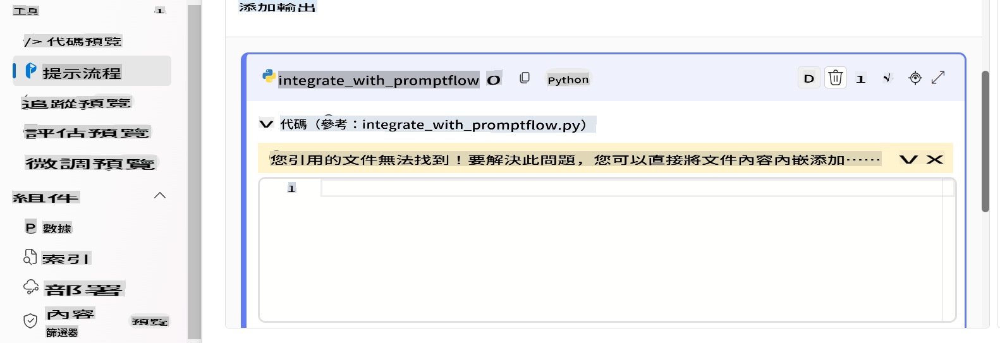

> [!NOTE]
> 有關在 Azure AI Foundry 中使用 Prompt flow 的更多詳細資訊，可參考 [Prompt flow in Azure AI Foundry](https://learn.microsoft.com/azure/ai-studio/how-to/prompt-flow)。

1. 選擇 **Chat input** 和 **Chat output**，以啟用與模型的對話功能。

    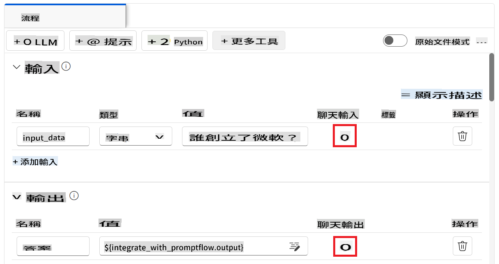

1. 現在你已準備好與自訂 Phi-3 模型進行對話。在下一個練習中，你將學習如何啟動 Prompt flow 並使用它與微調後的 Phi-3 模型對話。

> [!NOTE]
>
> 重建後的流程應如下圖所示：
>
> 
>

### 與自訂 Phi-3 模型對話

現在你已經微調並整合自訂 Phi-3 模型到 Prompt flow 中，你可以開始與它進行互動。本練習將指導你如何設置並啟動與模型的對話。透過這些步驟，你將能夠充分利用微調後的 Phi-3 模型來完成各種任務和對話。

- 使用 Prompt flow 與自訂 Phi-3 模型對話。

#### 啟動 Prompt flow

1. 選擇 **Start compute sessions** 以啟動 Prompt flow。

    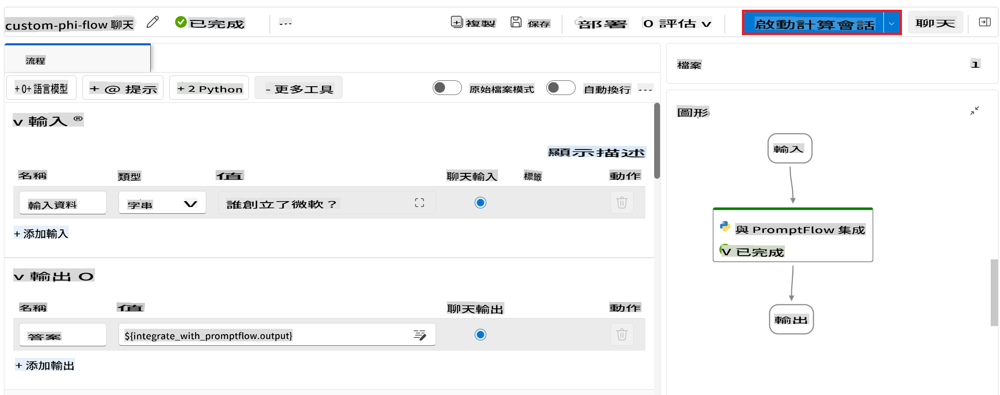

1. 選擇 **Validate and parse input** 以更新參數。

    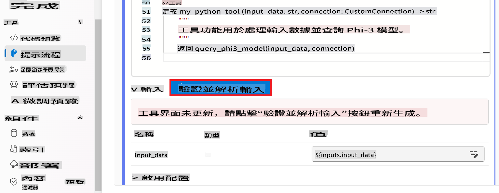

1. 選擇 **connection** 的 **Value**，並選擇你建立的自訂連線。例如，*connection*。

    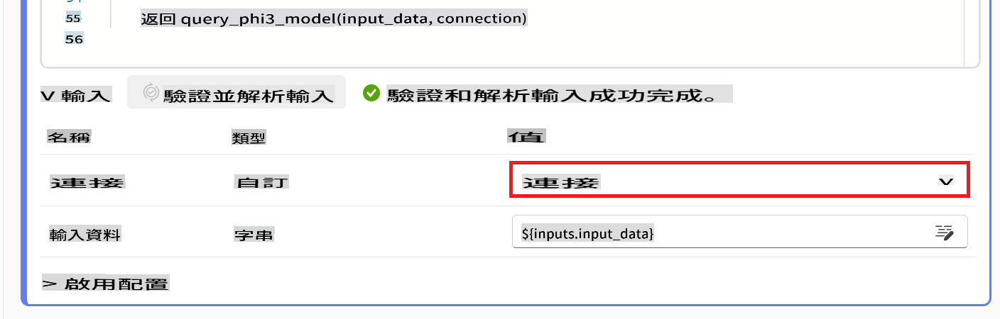

#### 與自訂模型對話

1. 選擇 **Chat**。

    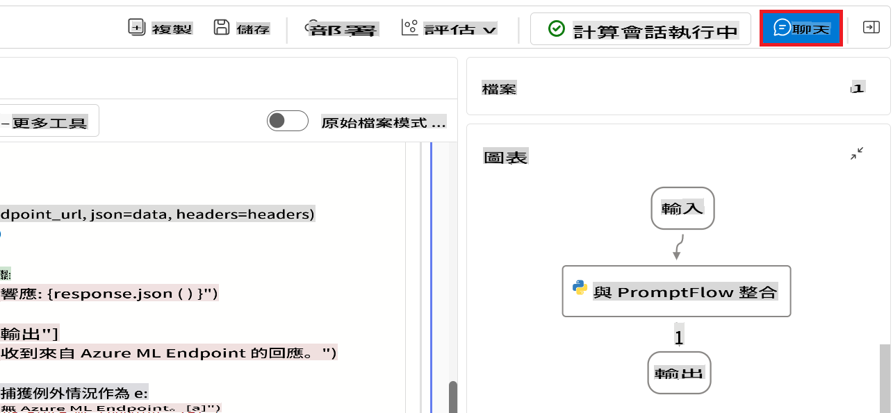

1. 以下是結果範例：現在你可以與自訂 Phi-3 模型對話。建議根據用於微調的數據提出問題。

    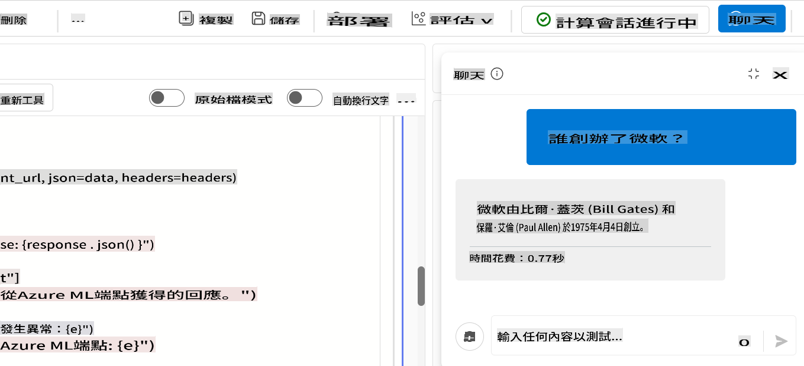

**免責聲明**：  
本文件使用機器翻譯人工智能服務進行翻譯。儘管我們努力確保準確性，但請注意，自動翻譯可能包含錯誤或不準確之處。應以原始語言的文件作為權威來源。對於關鍵信息，建議尋求專業人工翻譯。我們對因使用此翻譯而引起的任何誤解或錯誤解釋概不負責。