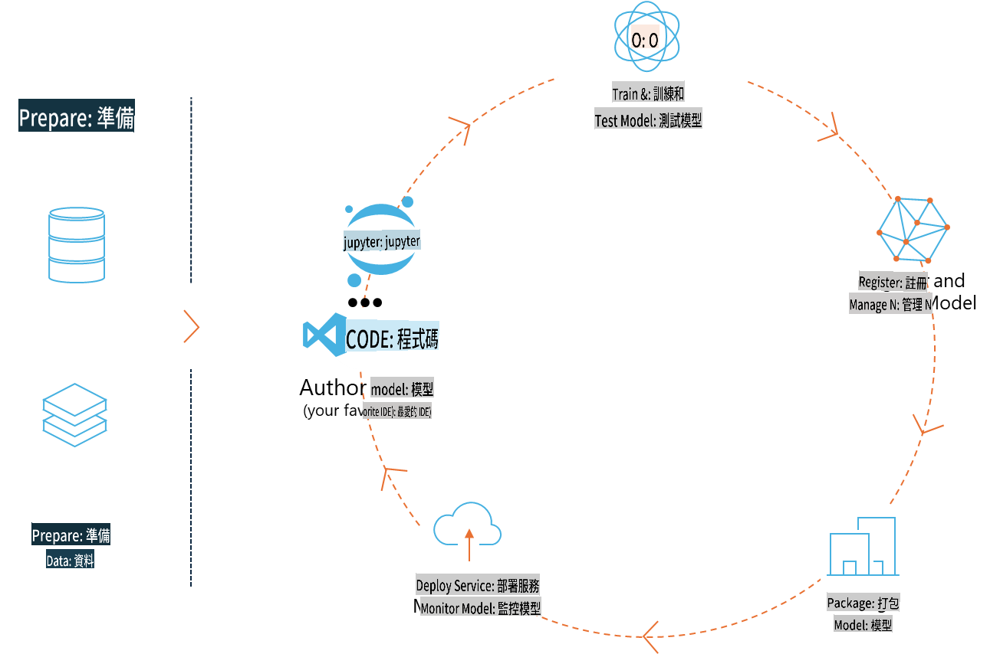

# MLflow

[MLflow](https://mlflow.org/) 係一個開源平台，專為管理機器學習全生命周期而設計。



MLFlow 用於管理機器學習生命周期，包括實驗、可重複性、部署以及中央模型註冊。MLFlow 而家提供四個主要組件：

- **MLflow Tracking:** 記錄同查詢實驗、代碼、數據配置同結果。
- **MLflow Projects:** 以一個格式封裝數據科學代碼，方便喺任何平台重現執行。
- **Mlflow Models:** 喺唔同嘅服務環境部署機器學習模型。
- **Model Registry:** 喺中央存儲庫存儲、註解同管理模型。

MLFlow 包括實驗追蹤、將代碼打包成可重現執行嘅功能，以及分享同部署模型嘅能力。MLFlow 同 Databricks 集成，並支持多種機器學習庫，使其成為與庫無關的平台。佢可以用於任何機器學習庫同任何編程語言，因為佢提供 REST API 同 CLI，方便使用。


MLFlow 嘅主要功能包括：

- **實驗追蹤：** 記錄同比較參數同結果。
- **模型管理：** 將模型部署到各種服務同推理平台。
- **模型註冊：** 協作管理 MLFlow 模型嘅生命周期，包括版本控制同註解。
- **項目：** 將機器學習代碼打包以便分享或者生產使用。

MLFlow 仲支持 MLOps 流程，包括準備數據、註冊同管理模型、將模型打包執行、部署服務同監控模型。佢目標係簡化從原型到生產工作流程嘅過程，特別係喺雲端同邊緣環境。

## 端到端場景 - 建立封裝器並使用 Phi-3 作為 MLFlow 模型

喺呢個端到端示例中，我哋會展示兩種唔同嘅方法，嚟建立一個圍繞 Phi-3 小語言模型（SLM）嘅封裝器，然後喺本地或者雲端（例如 Azure Machine Learning 工作區）作為 MLFlow 模型運行。


| 項目 | 描述 | 位置 |
| ------------ | ----------- | -------- |
| Transformer Pipeline | 如果你想用 HuggingFace 模型同 MLFlow 嘅實驗性 transformers flavour，一個最簡單嘅選擇就係用 Transformer Pipeline 嚟建立封裝器。 | [**TransformerPipeline.ipynb**](../../../../../../code/06.E2E/E2E_Phi-3-MLflow_TransformerPipeline.ipynb) |
| 自定義 Python 封裝器 | 喺撰寫本文時，transformer pipeline 唔支持 HuggingFace 模型嘅 ONNX 格式嘅 MLFlow 封裝器生成，即使使用實驗性嘅 optimum Python 套件都唔得。喺呢啲情況下，你可以建立一個自定義嘅 Python 封裝器嚟支持 MLFlow 模式。 | [**CustomPythonWrapper.ipynb**](../../../../../../code/06.E2E/E2E_Phi-3-MLflow_CustomPythonWrapper.ipynb) |

## 項目：Transformer Pipeline

1. 你需要 MLFlow 同 HuggingFace 嘅相關 Python 套件：

    ``` Python
    import mlflow
    import transformers
    ```

2. 接住，你應該喺 HuggingFace registry 參考目標 Phi-3 模型，初始化一個 transformer pipeline。正如 _Phi-3-mini-4k-instruct_ 嘅模型卡所示，其任務係「文本生成」類型：

    ``` Python
    pipeline = transformers.pipeline(
        task = "text-generation",
        model = "microsoft/Phi-3-mini-4k-instruct"
    )
    ```

3. 而家你可以將 Phi-3 模型嘅 transformer pipeline 保存為 MLFlow 格式，並提供額外嘅細節，例如目標 artifacts 路徑、特定模型配置設置同推理 API 類型：

    ``` Python
    model_info = mlflow.transformers.log_model(
        transformers_model = pipeline,
        artifact_path = "phi3-mlflow-model",
        model_config = model_config,
        task = "llm/v1/chat"
    )
    ```

## 項目：自定義 Python 封裝器

1. 喺呢度，我哋可以利用 Microsoft 嘅 [ONNX Runtime generate() API](https://github.com/microsoft/onnxruntime-genai) 進行 ONNX 模型嘅推理同 tokens 編碼/解碼。你需要根據目標計算資源選擇 _onnxruntime_genai_ 套件，以下例子係針對 CPU 嘅：

    ``` Python
    import mlflow
    from mlflow.models import infer_signature
    import onnxruntime_genai as og
    ```

2. 我哋嘅自定義類實現咗兩個方法：_load_context()_ 用嚟初始化 **Phi-3 Mini 4K Instruct 嘅 ONNX 模型**、**生成器參數**同**tokenizer**；_predict()_ 用嚟生成輸出 tokens，根據提供嘅提示：

    ``` Python
    class Phi3Model(mlflow.pyfunc.PythonModel):
        def load_context(self, context):
            # Retrieving model from the artifacts
            model_path = context.artifacts["phi3-mini-onnx"]
            model_options = {
                 "max_length": 300,
                 "temperature": 0.2,         
            }
        
            # Defining the model
            self.phi3_model = og.Model(model_path)
            self.params = og.GeneratorParams(self.phi3_model)
            self.params.set_search_options(**model_options)
            
            # Defining the tokenizer
            self.tokenizer = og.Tokenizer(self.phi3_model)
    
        def predict(self, context, model_input):
            # Retrieving prompt from the input
            prompt = model_input["prompt"][0]
            self.params.input_ids = self.tokenizer.encode(prompt)
    
            # Generating the model's response
            response = self.phi3_model.generate(self.params)
    
            return self.tokenizer.decode(response[0][len(self.params.input_ids):])
    ```

3. 而家你可以使用 _mlflow.pyfunc.log_model()_ 函數，為 Phi-3 模型生成一個自定義嘅 Python 封裝器（pickle 格式），以及原始 ONNX 模型同所需依賴項：

    ``` Python
    model_info = mlflow.pyfunc.log_model(
        artifact_path = artifact_path,
        python_model = Phi3Model(),
        artifacts = {
            "phi3-mini-onnx": "cpu_and_mobile/cpu-int4-rtn-block-32-acc-level-4",
        },
        input_example = input_example,
        signature = infer_signature(input_example, ["Run"]),
        extra_pip_requirements = ["torch", "onnxruntime_genai", "numpy"],
    )
    ```

## 生成嘅 MLFlow 模型簽名

1. 喺上面 Transformer Pipeline 項目嘅步驟 3 中，我哋將 MLFlow 模型嘅任務設置為「_llm/v1/chat_」。呢個指令會生成一個兼容 OpenAI Chat API 嘅模型 API 封裝，如下所示：

    ``` Python
    {inputs: 
      ['messages': Array({content: string (required), name: string (optional), role: string (required)}) (required), 'temperature': double (optional), 'max_tokens': long (optional), 'stop': Array(string) (optional), 'n': long (optional), 'stream': boolean (optional)],
    outputs: 
      ['id': string (required), 'object': string (required), 'created': long (required), 'model': string (required), 'choices': Array({finish_reason: string (required), index: long (required), message: {content: string (required), name: string (optional), role: string (required)} (required)}) (required), 'usage': {completion_tokens: long (required), prompt_tokens: long (required), total_tokens: long (required)} (required)],
    params: 
      None}
    ```

2. 咁樣，你可以以下面格式提交提示：

    ``` Python
    messages = [{"role": "user", "content": "What is the capital of Spain?"}]
    ```

3. 然後，使用 OpenAI API 兼容嘅後處理，例如 _response[0][‘choices’][0][‘message’][‘content’]_，將輸出美化成如下格式：

    ``` JSON
    Question: What is the capital of Spain?
    
    Answer: The capital of Spain is Madrid. It is the largest city in Spain and serves as the political, economic, and cultural center of the country. Madrid is located in the center of the Iberian Peninsula and is known for its rich history, art, and architecture, including the Royal Palace, the Prado Museum, and the Plaza Mayor.
    
    Usage: {'prompt_tokens': 11, 'completion_tokens': 73, 'total_tokens': 84}
    ```

4. 喺上面 Custom Python Wrapper 項目嘅步驟 3 中，我哋允許 MLFlow 套件根據提供嘅輸入示例生成模型嘅簽名。我哋嘅 MLFlow 封裝器嘅簽名會如下所示：

    ``` Python
    {inputs: 
      ['prompt': string (required)],
    outputs: 
      [string (required)],
    params: 
      None}
    ```

5. 所以，我哋嘅提示需要包含 "prompt" 呢個字典鍵，類似如下：

    ``` Python
    {"prompt": "<|system|>You are a stand-up comedian.<|end|><|user|>Tell me a joke about atom<|end|><|assistant|>",}
    ```

6. 模型嘅輸出會以字符串格式提供：

    ``` JSON
    Alright, here's a little atom-related joke for you!
    
    Why don't electrons ever play hide and seek with protons?
    
    Because good luck finding them when they're always "sharing" their electrons!
    
    Remember, this is all in good fun, and we're just having a little atomic-level humor!
    ```

**免責聲明**:  
本文件經由機器翻譯人工智能服務翻譯而成。我們致力於提供準確的翻譯，但請注意，自動翻譯可能包含錯誤或不準確之處。應以原語言的原始文件作為權威來源。對於關鍵資訊，建議尋求專業人工翻譯。我們對因使用此翻譯而產生的任何誤解或誤釋不承擔責任。