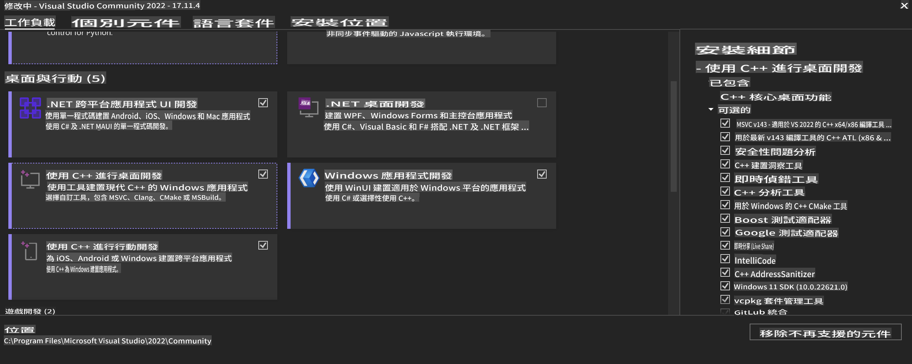
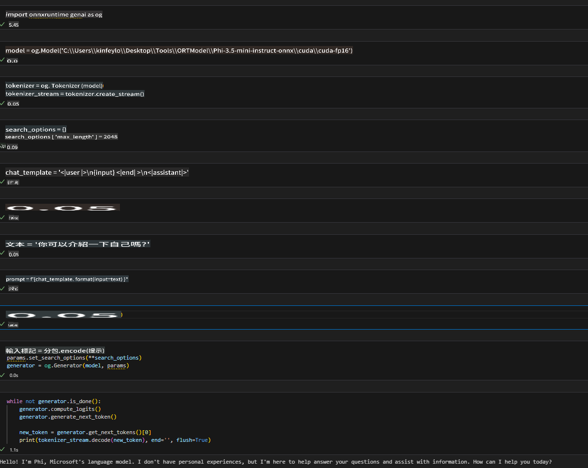
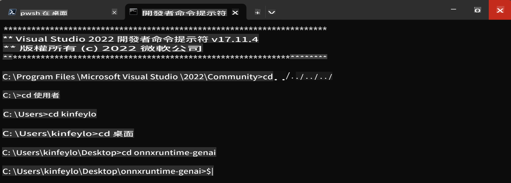

# **OnnxRuntime GenAI Windows GPU 使用指引**

本指引提供在 Windows 上使用 GPU 配置 ONNX Runtime (ORT) 的步驟，幫助你利用 GPU 加速模型運行，提升效能與效率。

本文件涵蓋以下內容：

- 環境配置：安裝所需依賴項，例如 CUDA、cuDNN 和 ONNX Runtime 的指引。
- 配置方法：如何有效配置環境和 ONNX Runtime 以充分利用 GPU 資源。
- 優化建議：調整 GPU 設定以達到最佳效能的建議。

### **1. Python 3.10.x / 3.11.8**

   ***注意*** 建議使用 [miniforge](https://github.com/conda-forge/miniforge/releases/latest/download/Miniforge3-Windows-x86_64.exe) 作為你的 Python 環境。

   ```bash

   conda create -n pydev python==3.11.8

   conda activate pydev

   ```

   ***提醒*** 如果你已經安裝任何與 Python ONNX 有關的庫，請先卸載它們。

### **2. 使用 winget 安裝 CMake**

   ```bash

   winget install -e --id Kitware.CMake

   ```

### **3. 安裝 Visual Studio 2022 - C++ 桌面開發**

   ***注意*** 如果你不需要自行編譯，可以跳過這一步。



### **4. 安裝 NVIDIA 驅動**

1. **NVIDIA GPU 驅動** [https://www.nvidia.com/en-us/drivers/](https://www.nvidia.com/en-us/drivers/)

2. **NVIDIA CUDA 12.4** [https://developer.nvidia.com/cuda-12-4-0-download-archive](https://developer.nvidia.com/cuda-12-4-0-download-archive)

3. **NVIDIA CUDNN 9.4** [https://developer.nvidia.com/cudnn-downloads](https://developer.nvidia.com/cudnn-downloads)

***提醒*** 請在安裝過程中使用默認設置。

### **5. 設置 NVIDIA 環境變數**

將 NVIDIA CUDNN 9.4 的 lib、bin、include 文件複製到 NVIDIA CUDA 12.4 的對應文件夾中：

- 將 *'C:\Program Files\NVIDIA\CUDNN\v9.4\bin\12.6'* 文件複製到 *'C:\Program Files\NVIDIA GPU Computing Toolkit\CUDA\v12.4\bin'*。

- 將 *'C:\Program Files\NVIDIA\CUDNN\v9.4\include\12.6'* 文件複製到 *'C:\Program Files\NVIDIA GPU Computing Toolkit\CUDA\v12.4\include'*。

- 將 *'C:\Program Files\NVIDIA\CUDNN\v9.4\lib\12.6'* 文件複製到 *'C:\Program Files\NVIDIA GPU Computing Toolkit\CUDA\v12.4\lib\x64'*。

### **6. 下載 Phi-3.5-mini-instruct-onnx**

   ```bash

   winget install -e --id Git.Git

   winget install -e --id GitHub.GitLFS

   git lfs install

   git clone https://huggingface.co/microsoft/Phi-3.5-mini-instruct-onnx

   ```

### **7. 運行 InferencePhi35Instruct.ipynb**

   打開 [Notebook](../../../../../../code/09.UpdateSamples/Aug/ortgpu-phi35-instruct.ipynb) 並執行。



### **8. 編譯 ORT GenAI GPU**

   ***注意*** 
   
   1. 請先卸載所有與 onnx、onnxruntime 和 onnxruntime-genai 有關的庫。

   ```bash

   pip list 
   
   ```

   然後卸載所有 ONNX Runtime 庫，例如：

   ```bash

   pip uninstall onnxruntime

   pip uninstall onnxruntime-genai

   pip uninstall onnxruntume-genai-cuda
   
   ```

   2. 檢查 Visual Studio 擴展支持。

   檢查 `C:\Program Files\NVIDIA GPU Computing Toolkit\CUDA\v12.4\extras` 是否包含 `C:\Program Files\NVIDIA GPU Computing Toolkit\CUDA\v12.4\extras\visual_studio_integration` 文件夾。

   如果沒有，請檢查其他 CUDA 工具包驅動文件夾，並將 `visual_studio_integration` 文件夾及其內容複製到 `C:\Program Files\NVIDIA GPU Computing Toolkit\CUDA\v12.4\extras\visual_studio_integration`。

   - 如果你不需要自行編譯，可以跳過這一步。

   ```bash

   git clone https://github.com/microsoft/onnxruntime-genai

   ```

   - 下載 [https://github.com/microsoft/onnxruntime/releases/download/v1.19.2/onnxruntime-win-x64-gpu-1.19.2.zip](https://github.com/microsoft/onnxruntime/releases/download/v1.19.2/onnxruntime-win-x64-gpu-1.19.2.zip)。

   - 解壓縮 `onnxruntime-win-x64-gpu-1.19.2.zip`，並將其重命名為 **ort**，然後將 ort 文件夾複製到 onnxruntime-genai。

   - 使用 Windows Terminal，進入 Visual Studio 2022 的開發者命令提示符，並導航到 onnxruntime-genai。



   - 使用你的 Python 環境進行編譯。

   ```bash

   cd onnxruntime-genai

   python build.py --use_cuda  --cuda_home "C:\Program Files\NVIDIA GPU Computing Toolkit\CUDA\v12.4" --config Release
 

   cd build/Windows/Release/Wheel

   pip install .whl

   ```

**免責聲明**：  
本文件是使用機器人工智能翻譯服務翻譯而成。我們雖然致力於提供準確的翻譯，但請注意，自動翻譯可能包含錯誤或不準確之處。應以原文文件作為權威來源。對於關鍵資訊，建議尋求專業人工翻譯。我們對於因使用此翻譯而引起的任何誤解或誤讀概不負責。