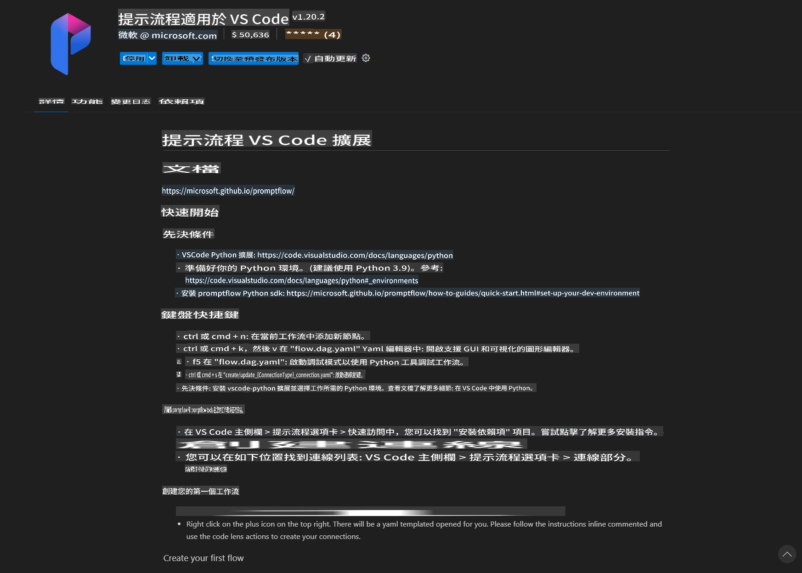
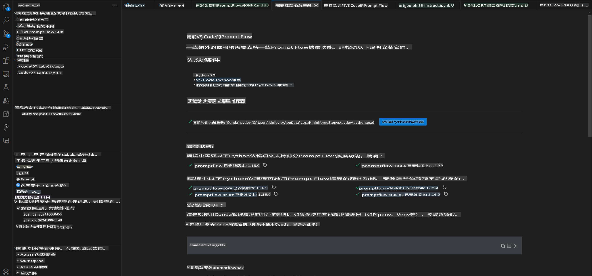
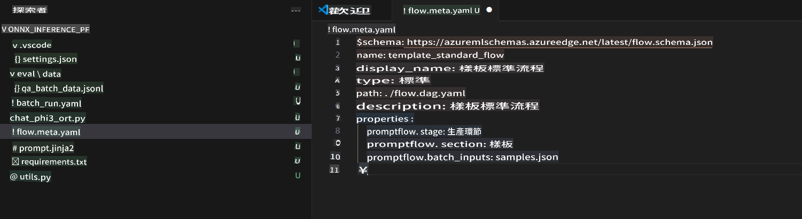
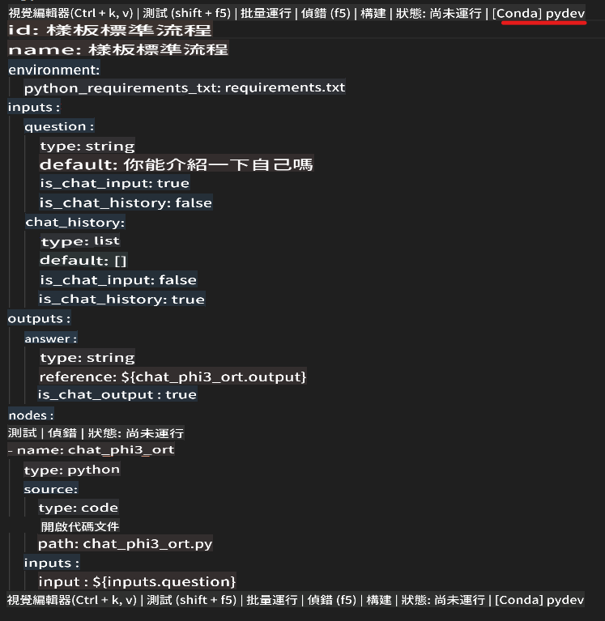
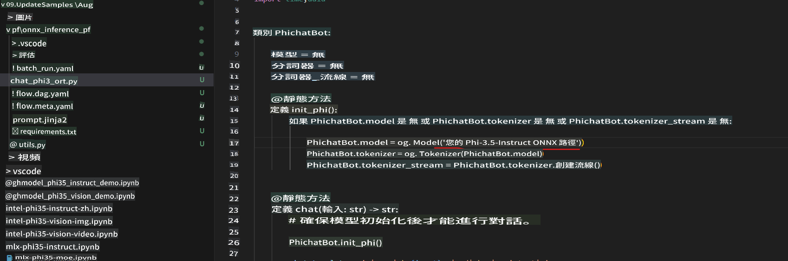
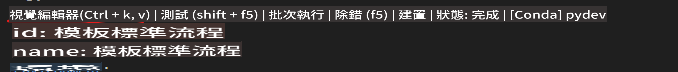
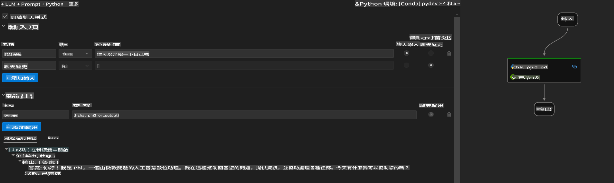
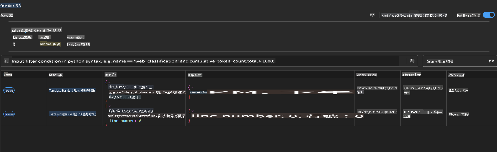

# 使用 Windows GPU 建立 Phi-3.5-Instruct ONNX 的 Prompt Flow 解決方案

以下文件是一個使用 PromptFlow 與 ONNX（Open Neural Network Exchange）來開發基於 Phi-3 模型的 AI 應用程式的範例。

PromptFlow 是一套開發工具，專為簡化基於大型語言模型（LLM）的 AI 應用程式的端到端開發流程而設計，涵蓋從構思、原型設計到測試和評估的全過程。

將 PromptFlow 與 ONNX 結合，開發者可以：

- **優化模型效能**：利用 ONNX 進行高效的模型推理與部署。
- **簡化開發流程**：使用 PromptFlow 管理工作流程並自動化重複性任務。
- **加強團隊合作**：透過提供統一的開發環境，促進團隊成員之間的更好合作。

**Prompt flow** 是一套開發工具，專為簡化基於 LLM 的 AI 應用程式的端到端開發流程而設計，涵蓋從構思、原型設計、測試、評估到生產部署與監控的全過程。它使提示工程變得更加簡單，並幫助你建立具有生產質量的 LLM 應用程式。

Prompt flow 可以連接到 OpenAI、Azure OpenAI Service，以及可自定義的模型（如 Huggingface、本地 LLM/SLM）。我們希望將 Phi-3.5 的量化 ONNX 模型部署到本地應用程式中。Prompt flow 可以幫助我們更好地規劃業務，並完成基於 Phi-3.5 的本地解決方案。在這個範例中，我們將結合 ONNX Runtime GenAI Library，完成基於 Windows GPU 的 Prompt flow 解決方案。

## **安裝**

### **Windows GPU 的 ONNX Runtime GenAI**

閱讀此指南以設置 Windows GPU 的 ONNX Runtime GenAI [點擊這裡](./ORTWindowGPUGuideline.md)

### **在 VSCode 中設置 Prompt flow**

1. 安裝 Prompt flow VS Code 擴展



2. 安裝 Prompt flow VS Code 擴展後，點擊該擴展，選擇 **Installation dependencies**，按照此指南在你的環境中安裝 Prompt flow SDK



3. 下載 [範例程式碼](../../../../../../code/09.UpdateSamples/Aug/pf/onnx_inference_pf)，並使用 VS Code 開啟該範例



4. 打開 **flow.dag.yaml**，選擇你的 Python 環境



   打開 **chat_phi3_ort.py**，更改你的 Phi-3.5-instruct ONNX 模型位置



5. 運行你的 Prompt flow 進行測試

打開 **flow.dag.yaml**，點擊視覺化編輯器



點擊後運行以進行測試



1. 你可以在終端中批量運行以檢查更多結果

```bash

pf run create --file batch_run.yaml --stream --name 'Your eval qa name'    

```

你可以在默認瀏覽器中查看結果



**免責聲明**：  
本文件使用機器人工智能翻譯服務進行翻譯。儘管我們努力確保準確性，但請注意，自動翻譯可能包含錯誤或不準確之處。應以原文檔的母語版本作為權威來源。對於關鍵信息，建議尋求專業人工翻譯。我們對因使用此翻譯而產生的任何誤解或誤讀概不負責。