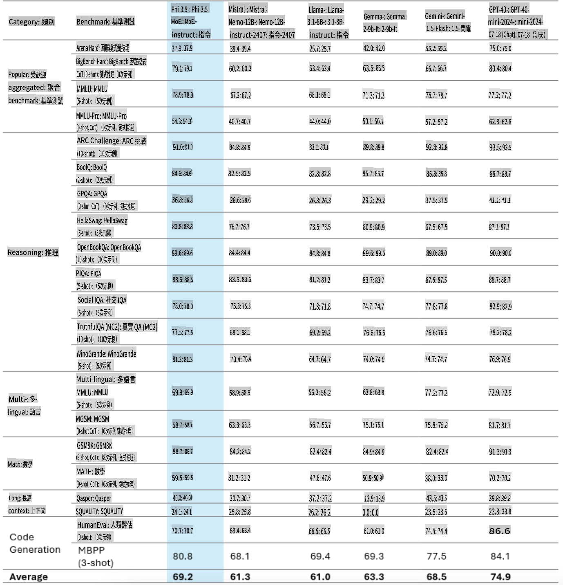
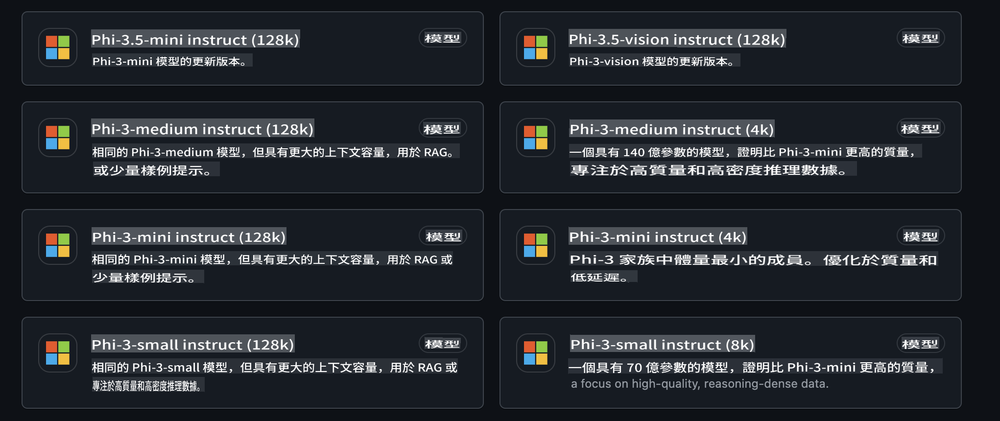
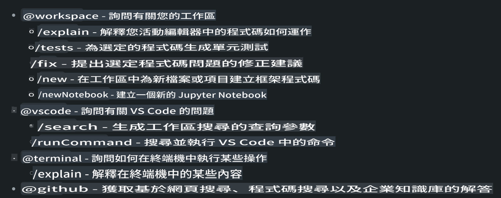
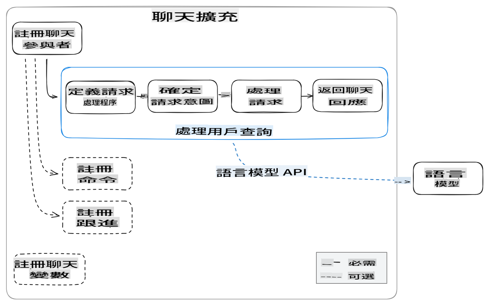
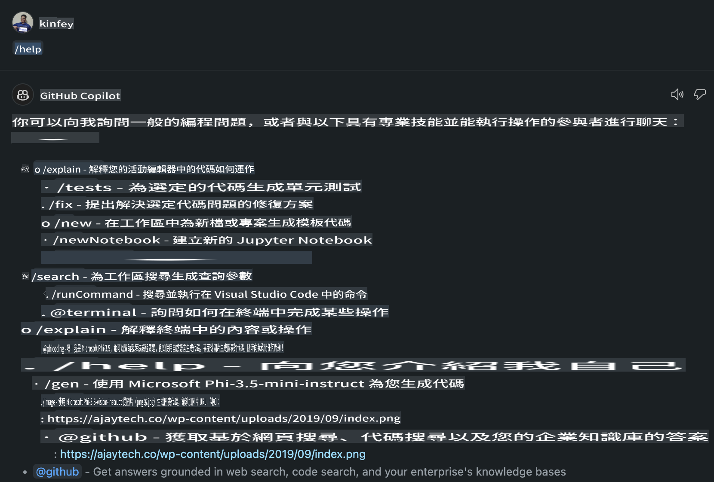
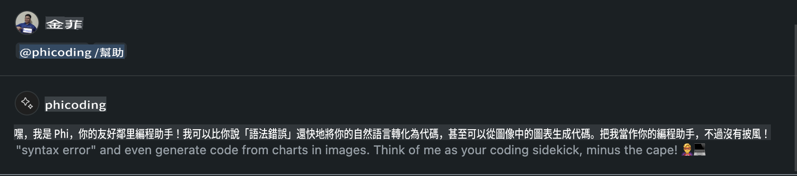
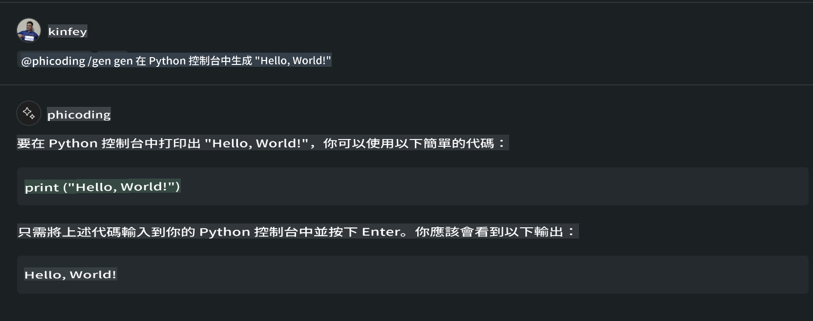
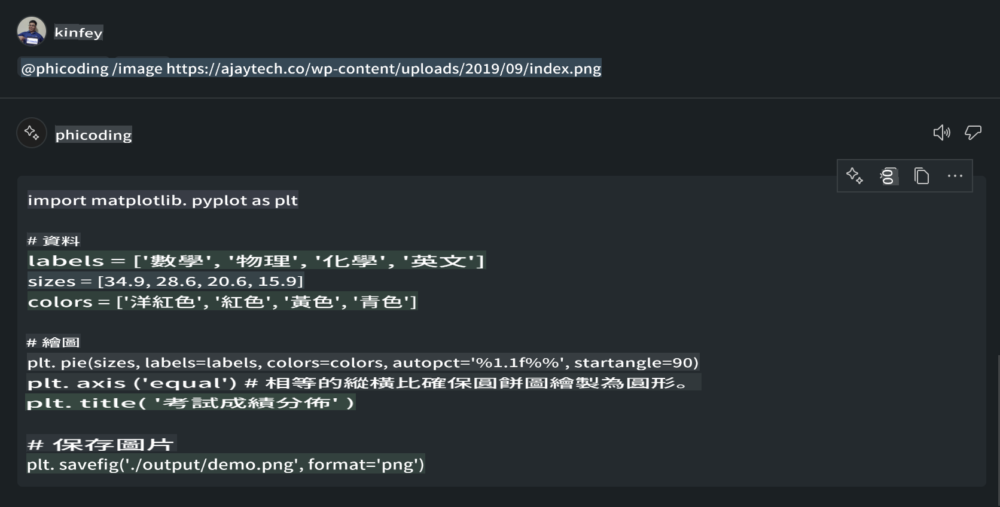

# **用 GitHub Models 的 Phi-3.5 建立你自己的 Visual Studio Code Chat Copilot Agent**

你有用 Visual Studio Code Copilot 嗎？特別是在 Chat 裡，你可以用不同的 agents 來提升在 Visual Studio Code 中創建、撰寫和維護專案的能力。Visual Studio Code 提供了一個 API，讓公司和個人可以根據自己的業務需求建立不同的 agents，從而在專有領域中擴展功能。在這篇文章中，我們會專注於 GitHub Models 的 **Phi-3.5-mini-instruct (128k)** 和 **Phi-3.5-vision-instruct (128k)**，來建立你自己的 Visual Studio Code Agent。

## **關於 GitHub Models 的 Phi-3.5**

我們知道，Phi-3/3.5-mini-instruct 在 Phi-3/3.5 家族中具有強大的程式碼理解和生成能力，並且相較於 Gemma-2-9b 和 Mistral-Nemo-12B-instruct-2407 有明顯優勢。



最新的 GitHub Models 已經提供了 Phi-3.5-mini-instruct (128k) 和 Phi-3.5-vision-instruct (128k) 模型的存取方式。開發者可以通過 OpenAI SDK、Azure AI Inference SDK 和 REST API 來使用它們。



***注意：*** 建議使用 Azure AI Inference SDK，因為它能更好地與生產環境中的 Azure Model Catalog 切換。

以下是 **Phi-3.5-mini-instruct (128k)** 和 **Phi-3.5-vision-instruct (128k)** 在與 GitHub Models 整合後，在程式碼生成場景中的結果，也為後續範例做準備。

**範例：GitHub Models Phi-3.5-mini-instruct (128k) 根據提示生成程式碼** ([點擊這裡](../../../../../../code/09.UpdateSamples/Aug/ghmodel_phi35_instruct_demo.ipynb))

**範例：GitHub Models Phi-3.5-vision-instruct (128k) 根據圖片生成程式碼** ([點擊這裡](../../../../../../code/09.UpdateSamples/Aug/ghmodel_phi35_vision_demo.ipynb))

## **關於 GitHub Copilot Chat Agent**

GitHub Copilot Chat Agent 能根據程式碼，在不同的專案場景中完成不同的任務。系統有四種 agents：workspace、github、terminal、vscode。



透過在 agent 名稱前加上 ‘@’，你可以快速完成對應的工作。對於企業來說，如果能加入與自身業務相關的內容，例如需求、編碼、測試規範和發佈，就可以基於 GitHub Copilot 提供更強大的企業私有功能。

Visual Studio Code Chat Agent 現已正式推出 API，允許企業或企業開發者根據不同的軟體業務生態系統開發 agents。基於 Visual Studio Code 擴展開發的方法，你可以輕鬆存取 Visual Studio Code Chat Agent API 的介面。我們可以根據以下流程進行開發。



開發場景可以支援接入第三方模型 API（例如 GitHub Models、Azure Model Catalog，以及基於開源模型的自建服務），也可以使用 GitHub Copilot 提供的 gpt-35-turbo、gpt-4 和 gpt-4o 模型。

## **基於 Phi-3.5 添加一個 @phicoding Agent**

我們嘗試整合 Phi-3.5 的程式能力，來完成程式碼撰寫、圖片生成程式碼等任務。圍繞 Phi-3.5 建立一個 Agent - @PHI，以下是一些功能：

1. 通過 **@phicoding /help** 指令，使用 GitHub Copilot 提供的 GPT-4o 生成自我介紹。

2. 通過 **@phicoding /gen** 指令，基於 **Phi-3.5-mini-instruct (128k)** 生成不同程式語言的程式碼。

3. 通過 **@phicoding /image** 指令，基於 **Phi-3.5-vision-instruct (128k)** 和圖片完成程式碼生成。


## **相關步驟**

1. 使用 npm 安裝 Visual Studio Code Extension 開發支持。

```bash

npm install --global yo generator-code 

```

2. 建立一個 Visual Studio Code Extension 插件（使用 Typescript 開發模式，命名為 phiext）。

```bash

yo code 

```

3. 打開已建立的專案並修改 package.json。這裡包含相關指令和配置，以及 GitHub Models 的配置。注意需要在這裡添加你的 GitHub Models token。

```json

{
  "name": "phiext",
  "displayName": "phiext",
  "description": "",
  "version": "0.0.1",
  "engines": {
    "vscode": "^1.93.0"
  },
  "categories": [
    "AI",
    "Chat"
  ],
  "activationEvents": [],
  "enabledApiProposals": [
      "chatVariableResolver"
  ],
  "main": "./dist/extension.js",
  "contributes": {
    "chatParticipants": [
        {
            "id": "chat.phicoding",
            "name": "phicoding",
            "description": "Hey! I am Microsoft Phi-3.5, She can help me with coding problems, such as generation code with your natural language, or even generation code about chart from images. Just ask me anything!",
            "isSticky": true,
            "commands": [
                {
                    "name": "help",
                    "description": "Introduce myself to you"
                },
                {
                    "name": "gen",
                    "description": "Generate code for you with Microsoft Phi-3.5-mini-instruct"
                },
                {
                    "name": "image",
                    "description": "Generate code for chart from image(png or jpg) with Microsoft Phi-3.5-vision-instruct, please add image url like this : https://ajaytech.co/wp-content/uploads/2019/09/index.png"
                }
            ]
        }
    ],
    "commands": [
        {
            "command": "phicoding.namesInEditor",
            "title": "Use Microsoft Phi 3.5 in Editor"
        }
    ],
    "configuration": {
      "type": "object",
      "title": "githubmodels",
      "properties": {
        "githubmodels.endpoint": {
          "type": "string",
          "default": "https://models.inference.ai.azure.com",
          "description": "Your GitHub Models Endpoint",
          "order": 0
        },
        "githubmodels.api_key": {
          "type": "string",
          "default": "Your GitHub Models Token",
          "description": "Your GitHub Models Token",
          "order": 1
        },
        "githubmodels.phi35instruct": {
          "type": "string",
          "default": "Phi-3.5-mini-instruct",
          "description": "Your Phi-35-Instruct Model",
          "order": 2
        },
        "githubmodels.phi35vision": {
          "type": "string",
          "default": "Phi-3.5-vision-instruct",
          "description": "Your Phi-35-Vision Model",
          "order": 3
        }
      }
    }
  },
  "scripts": {
    "vscode:prepublish": "npm run package",
    "compile": "webpack",
    "watch": "webpack --watch",
    "package": "webpack --mode production --devtool hidden-source-map",
    "compile-tests": "tsc -p . --outDir out",
    "watch-tests": "tsc -p . -w --outDir out",
    "pretest": "npm run compile-tests && npm run compile && npm run lint",
    "lint": "eslint src",
    "test": "vscode-test"
  },
  "devDependencies": {
    "@types/vscode": "^1.93.0",
    "@types/mocha": "^10.0.7",
    "@types/node": "20.x",
    "@typescript-eslint/eslint-plugin": "^8.3.0",
    "@typescript-eslint/parser": "^8.3.0",
    "eslint": "^9.9.1",
    "typescript": "^5.5.4",
    "ts-loader": "^9.5.1",
    "webpack": "^5.94.0",
    "webpack-cli": "^5.1.4",
    "@vscode/test-cli": "^0.0.10",
    "@vscode/test-electron": "^2.4.1"
  },
  "dependencies": {
    "@types/node-fetch": "^2.6.11",
    "node-fetch": "^3.3.2",
    "@azure-rest/ai-inference": "latest",
    "@azure/core-auth": "latest",
    "@azure/core-sse": "latest"
  }
}


```

4. 修改 src/extension.ts。

```typescript

// The module 'vscode' contains the VS Code extensibility API
// Import the module and reference it with the alias vscode in your code below
import * as vscode from 'vscode';
import ModelClient from "@azure-rest/ai-inference";
import { AzureKeyCredential } from "@azure/core-auth";


interface IPhiChatResult extends vscode.ChatResult {
    metadata: {
        command: string;
    };
}


const MODEL_SELECTOR: vscode.LanguageModelChatSelector = { vendor: 'copilot', family: 'gpt-4o' };

function isValidImageUrl(url: string): boolean {
    const regex = /^(https?:\/\/.*\.(?:png|jpg))$/i;
    return regex.test(url);
}
  

// This method is called when your extension is activated
// Your extension is activated the very first time the command is executed
export function activate(context: vscode.ExtensionContext) {

    const codinghandler: vscode.ChatRequestHandler = async (request: vscode.ChatRequest, context: vscode.ChatContext, stream: vscode.ChatResponseStream, token: vscode.CancellationToken): Promise<IPhiChatResult> => {


        const config : any = vscode.workspace.getConfiguration('githubmodels');
        const endPoint: string = config.get('endpoint');
        const apiKey: string = config.get('api_key');
        const phi35instruct: string = config.get('phi35instruct');
        const phi35vision: string = config.get('phi35vision');
        
        if (request.command === 'help') {

            const content = "Welcome to Coding assistant with Microsoft Phi-3.5"; 
            stream.progress(content);


            try {
                const [model] = await vscode.lm.selectChatModels(MODEL_SELECTOR);
                if (model) {
                    const messages = [
                        vscode.LanguageModelChatMessage.User("Please help me express this content in a humorous way: I am a programming assistant who can help you convert natural language into code and generate code based on the charts in the images. output format like this : Hey I am Phi ......")
                    ];
                    const chatResponse = await model.sendRequest(messages, {}, token);
                    for await (const fragment of chatResponse.text) {
                        stream.markdown(fragment);
                    }
                }
            } catch(err) {
                console.log(err);
            }


            return { metadata: { command: 'help' } };

        }

        
        if (request.command === 'gen') {

            const content = "Welcome to use phi-3.5 to generate code";

            stream.progress(content);

            const client = new ModelClient(endPoint, new AzureKeyCredential(apiKey));

            const response = await client.path("/chat/completions").post({
              body: {
                messages: [
                  { role:"system", content: "You are a coding assistant.Help answer all code generation questions." },
                  { role:"user", content: request.prompt }
                ],
                model: phi35instruct,
                temperature: 0.4,
                max_tokens: 1000,
                top_p: 1.
              }
            });

            stream.markdown(response.body.choices[0].message.content);

            return { metadata: { command: 'gen' } };

        }


        
        if (request.command === 'image') {


            const content = "Welcome to use phi-3.5 to generate code from image(png or jpg),image url like this:https://ajaytech.co/wp-content/uploads/2019/09/index.png";

            stream.progress(content);

            if (!isValidImageUrl(request.prompt)) {
                stream.markdown('Please provide a valid image URL');
                return { metadata: { command: 'image' } };
            }
            else
            {

                const client = new ModelClient(endPoint, new AzureKeyCredential(apiKey));
    
                const response = await client.path("/chat/completions").post({
                    body: {
                      messages: [
                        { role: "system", content: "You are a helpful assistant that describes images in details." },
                        { role: "user", content: [
                            { type: "text", text: "Please generate code according to the chart in the picture according to the following requirements\n1. Keep all information in the chart, including data and text\n2. Do not generate additional information that is not included in the chart\n3. Please extract data from the picture, do not generate it from csv\n4. Please save the regenerated chart as a chart and save it to ./output/demo.png"},
                            { type: "image_url", image_url: {url: request.prompt}
                            }
                          ]
                        }
                      ],
                      model: phi35vision,
                      temperature: 0.4,
                      max_tokens: 2048,
                      top_p: 1.
                    }
                  });
    
                
                stream.markdown(response.body.choices[0].message.content);
    
                return { metadata: { command: 'image' } };
            }


        }


        return { metadata: { command: '' } };
    };


    const phi_ext = vscode.chat.createChatParticipant("chat.phicoding", codinghandler);

    phi_ext.iconPath = new vscode.ThemeIcon('sparkle');


    phi_ext.followupProvider = {
        provideFollowups(result: IPhiChatResult, context: vscode.ChatContext, token: vscode.CancellationToken) {
            return [{
                prompt: 'Let us coding with Phi-3.5 😋😋😋😋',
                label: vscode.l10n.t('Enjoy coding with Phi-3.5'),
                command: 'help'
            } satisfies vscode.ChatFollowup];
        }
    };

    context.subscriptions.push(phi_ext);
}

// This method is called when your extension is deactivated
export function deactivate() {}


```

6. 執行

***/help***



***@phicoding /help***



***@phicoding /gen***



***@phicoding /image***



你可以下載範例程式碼：[點擊這裡](../../../../../../code/09.UpdateSamples/Aug/vscode)

## **資源**

1. 註冊 GitHub Models：[https://gh.io/models](https://gh.io/models)

2. 學習 Visual Studio Code 擴展開發：[https://code.visualstudio.com/api/get-started/your-first-extension](https://code.visualstudio.com/api/get-started/your-first-extension)

3. 瞭解 Visual Studio Code Coilot Chat API：[https://code.visualstudio.com/api/extension-guides/chat](https://code.visualstudio.com/api/extension-guides/chat)

**免責聲明**:  
此文件是使用機器翻譯人工智能服務進行翻譯的。雖然我們努力確保準確性，但請注意，自動翻譯可能包含錯誤或不準確之處。應以原文作為權威來源。如涉及關鍵資訊，建議尋求專業人工翻譯。我們對於因使用此翻譯而引起的任何誤解或誤讀概不負責。