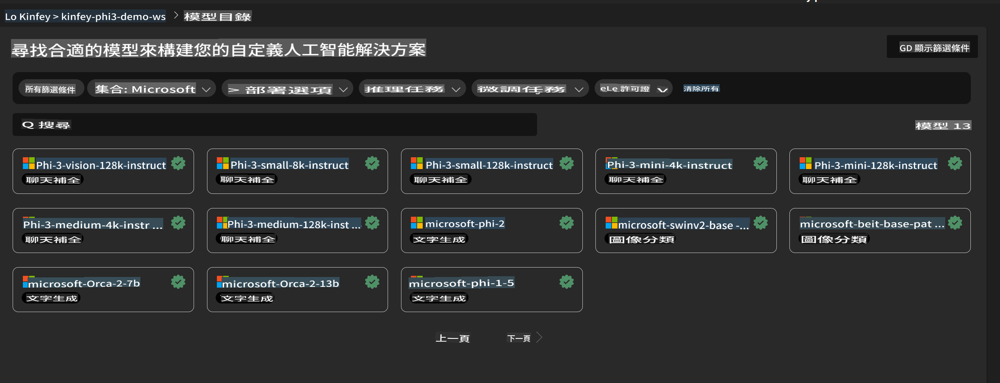
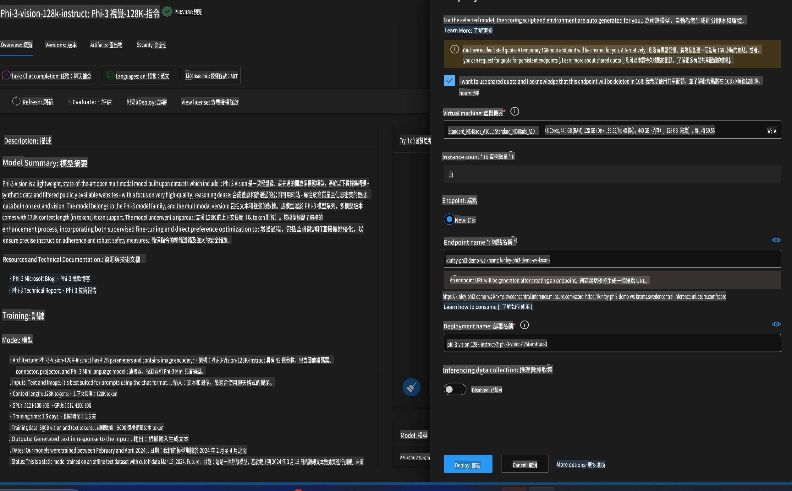
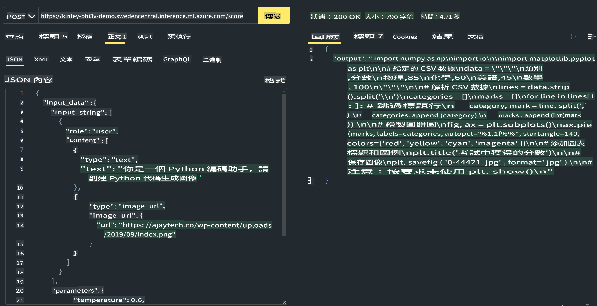

# **Lab 3 - 喺 Azure Machine Learning Service 部署 Phi-3-Vision**

我哋會用 NPU 去完成本地代碼嘅生產部署，之後通過引入 PHI-3-VISION 嘅能力，實現由圖片生成代碼嘅功能。

喺呢個介紹入面，我哋可以快速喺 Azure Machine Learning Service 裡面建立一個 Model As Service Phi-3 Vision 嘅服務。

***注意***：Phi-3 Vision 需要計算資源嚟加快生成內容嘅速度。我哋需要雲端嘅計算能力嚟幫手實現呢個功能。


### **1. 創建 Azure Machine Learning Service**

我哋需要喺 Azure Portal 入面創建一個 Azure Machine Learning Service。如果你想學點樣操作，可以參考呢條鏈接：[https://learn.microsoft.com/azure/machine-learning/quickstart-create-resources?view=azureml-api-2](https://learn.microsoft.com/azure/machine-learning/quickstart-create-resources?view=azureml-api-2)


### **2. 喺 Azure Machine Learning Service 裡面揀 Phi-3 Vision**




### **3. 喺 Azure 部署 Phi-3-Vision**





### **4. 用 Postman 測試 Endpoint**





***注意***

1. 傳遞嘅參數必須包括 Authorization、azureml-model-deployment 同 Content-Type。你需要檢查部署信息嚟獲取相關內容。

2. 傳遞參數時，Phi-3-Vision 需要傳遞一個圖片鏈接。請參考 GPT-4-Vision 嘅方法去傳遞參數，例如：

```json

{
  "input_data":{
    "input_string":[
      {
        "role":"user",
        "content":[ 
          {
            "type": "text",
            "text": "You are a Python coding assistant.Please create Python code for image "
          },
          {
              "type": "image_url",
              "image_url": {
                "url": "https://ajaytech.co/wp-content/uploads/2019/09/index.png"
              }
          }
        ]
      }
    ],
    "parameters":{
          "temperature": 0.6,
          "top_p": 0.9,
          "do_sample": false,
          "max_new_tokens": 2048
    }
  }
}

```

3. 用 Post 方法調用 **/score**

**恭喜你**！你已經完成咗快速部署 PHI-3-VISION，並試用咗點樣由圖片生成代碼。接住落嚟，我哋可以結合 NPU 同雲端建立應用程序。

**免責聲明**：  
本文件使用基於機器的人工智能翻譯服務進行翻譯。我們致力於提供準確的翻譯，但請注意，自動翻譯可能包含錯誤或不準確之處。應以原文文件為權威來源。如涉及關鍵信息，建議尋求專業人工翻譯。我們對因使用此翻譯而引起的任何誤解或誤讀概不承擔責任。