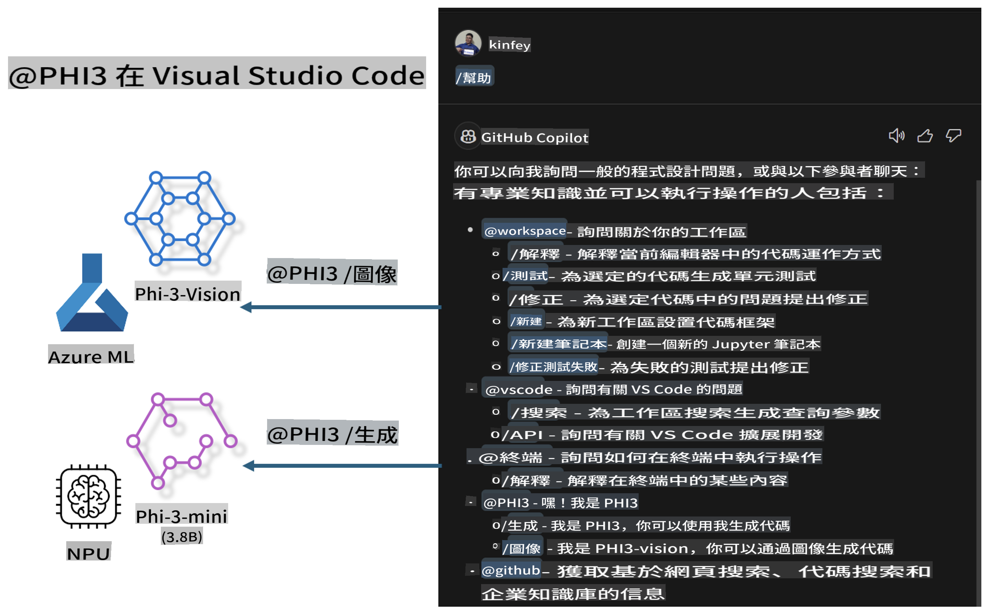

# **打造屬於你自己的 Visual Studio Code GitHub Copilot Chat，結合 Microsoft Phi-3 系列**

你曾經使用過 GitHub Copilot Chat 的工作區代理嗎？想為你自己的團隊打造專屬的代碼代理嗎？這個實操課程希望結合開源模型，幫助你建立企業級的代碼業務代理。

## **基礎知識**

### **為什麼選擇 Microsoft Phi-3**

Phi-3 是一個系列，包括 phi-3-mini、phi-3-small 和 phi-3-medium，根據不同的訓練參數提供文本生成、對話補全和代碼生成功能。此外，還有基於 Vision 的 phi-3-vision。這非常適合企業或不同團隊創建離線生成式 AI 解決方案。

推薦閱讀此連結 [https://github.com/microsoft/PhiCookBook/blob/main/md/01.Introduction/01/01.PhiFamily.md](https://github.com/microsoft/PhiCookBook/blob/main/md/01.Introduction/01/01.PhiFamily.md)

### **Microsoft GitHub Copilot Chat**

GitHub Copilot Chat 擴展提供了一個聊天介面，讓你可以與 GitHub Copilot 互動，直接在 VS Code 中獲得與編碼相關問題的解答，無需瀏覽文件或在線論壇。

Copilot Chat 可能會使用語法高亮、縮排和其他格式化功能來使生成的回應更清晰。根據用戶的問題類型，結果可能包含 Copilot 用於生成回應的上下文的鏈接，例如源代碼文件或文檔，或訪問 VS Code 功能的按鈕。

- Copilot Chat 能夠無縫整合到你的開發流程中，並在需要的地方提供幫助：

- 從編輯器或終端直接啟動內聯聊天對話，獲得編碼時的即時幫助

- 使用聊天視圖，隨時獲得 AI 助手的支持

- 啟動快速聊天功能，提出問題後迅速回到你的工作中

你可以在多種場景中使用 GitHub Copilot Chat，例如：

- 解答如何最佳解決問題的編碼問題

- 解釋他人的代碼並提出改進建議

- 提議代碼修復

- 生成單元測試用例

- 生成代碼文檔

推薦閱讀此連結 [https://code.visualstudio.com/docs/copilot/copilot-chat](https://code.visualstudio.com/docs/copilot/copilot-chat?WT.mc_id=aiml-137032-kinfeylo)

### **Microsoft GitHub Copilot Chat @workspace**

在 Copilot Chat 中引用 **@workspace**，可以讓你針對整個代碼庫提問。根據問題，Copilot 會智能檢索相關文件和符號，並在回答中以鏈接和代碼示例的形式引用它們。

為了解答你的問題，**@workspace** 會檢索開發人員在 VS Code 中瀏覽代碼庫時會使用的相同資源：

- 工作區中的所有文件，除了被 .gitignore 文件忽略的文件

- 包含嵌套文件夾和文件名的目錄結構

- 如果工作區是 GitHub 儲存庫且被代碼搜索索引，則檢索 GitHub 的代碼搜索索引

- 工作區中的符號和定義

- 當前選中的文本或活動編輯器中可見的文本

注意：如果你打開了一個被忽略的文件或選中了其中的文本，.gitignore 將被繞過。

推薦閱讀此連結 [https://code.visualstudio.com/docs/copilot/copilot-chat](https://code.visualstudio.com/docs/copilot/workspace-context?WT.mc_id=aiml-137032-kinfeylo)

## **了解更多關於這個實操課程**

GitHub Copilot 大幅提升了企業的編程效率，每個企業都希望能自定義 GitHub Copilot 的相關功能。許多企業已經根據自身的業務場景和開源模型，定制了類似 GitHub Copilot 的擴展。對於企業來說，自定義擴展更容易掌控，但這也可能影響用戶體驗。畢竟，GitHub Copilot 在處理通用場景和專業性上功能更強。如果能保持一致的體驗，同時又能自定義企業專屬的擴展，將是一種更佳的用戶體驗。

這個實操課程主要使用 Phi-3 模型，結合本地 NPU 和 Azure 混合，構建一個在 GitHub Copilot Chat 中的自定義代理 ***@PHI3***，協助企業開發人員完成代碼生成 ***(@PHI3 /gen)***，以及基於圖像生成代碼 ***(@PHI3 /img)***。

### ***注意：***

此實操課程目前在 Intel CPU 的 AIPC 和 Apple Silicon 上實現。我們將持續更新 Qualcomm NPU 的版本。

## **實操課程**

| 名稱 | 描述 | AIPC | Apple |
| ------------ | ----------- | -------- |-------- |
| Lab0 - 安裝 (✅) | 配置並安裝相關環境和工具 | [Go](./HOL/AIPC/01.Installations.md) |[Go](./HOL/Apple/01.Installations.md) |
| Lab1 - 使用 Phi-3-mini 運行 Prompt flow (✅) | 結合 AIPC / Apple Silicon，通過本地 NPU 使用 Phi-3-mini 進行代碼生成 | [Go](./HOL/AIPC/02.PromptflowWithNPU.md) |  [Go](./HOL/Apple/02.PromptflowWithMLX.md) |
| Lab2 - 部署 Phi-3-vision 到 Azure 機器學習服務 (✅) | 通過部署 Azure 機器學習服務的模型目錄 - Phi-3-vision 圖像生成代碼 | [Go](./HOL/AIPC/03.DeployPhi3VisionOnAzure.md) |[Go](./HOL/Apple/03.DeployPhi3VisionOnAzure.md) |
| Lab3 - 在 GitHub Copilot Chat 中創建 @phi-3 代理 (✅) | 在 GitHub Copilot Chat 中創建自定義 Phi-3 代理，完成代碼生成、圖生成代碼、RAG 等功能 | [Go](./HOL/AIPC/04.CreatePhi3AgentInVSCode.md) | [Go](./HOL/Apple/04.CreatePhi3AgentInVSCode.md) |
| 示例代碼 (✅) | 下載示例代碼 | [Go](../../../../../../../code/07.Lab/01/AIPC) | [Go](../../../../../../../code/07.Lab/01/Apple) |

## **資源**

1. Phi-3 Cookbook [https://github.com/microsoft/Phi-3CookBook](https://github.com/microsoft/Phi-3CookBook)

2. 了解更多關於 GitHub Copilot [https://learn.microsoft.com/training/paths/copilot/](https://learn.microsoft.com/training/paths/copilot/?WT.mc_id=aiml-137032-kinfeylo)

3. 了解更多關於 GitHub Copilot Chat [https://learn.microsoft.com/training/paths/accelerate-app-development-using-github-copilot/](https://learn.microsoft.com/training/paths/accelerate-app-development-using-github-copilot/?WT.mc_id=aiml-137032-kinfeylo)

4. 了解更多關於 GitHub Copilot Chat API [https://code.visualstudio.com/api/extension-guides/chat](https://code.visualstudio.com/api/extension-guides/chat?WT.mc_id=aiml-137032-kinfeylo)

5. 了解更多關於 Azure AI Foundry [https://learn.microsoft.com/training/paths/create-custom-copilots-ai-studio/](https://learn.microsoft.com/training/paths/create-custom-copilots-ai-studio/?WT.mc_id=aiml-137032-kinfeylo)

6. 了解更多關於 Azure AI Foundry 的模型目錄 [https://learn.microsoft.com/azure/ai-studio/how-to/model-catalog-overview](https://learn.microsoft.com/azure/ai-studio/how-to/model-catalog-overview)

**免責聲明**：  
本文件是使用機器人工智能翻譯服務進行翻譯的。我們致力於確保準確性，但請注意，自動翻譯可能包含錯誤或不準確之處。應以原文語言的文件作為權威來源。對於關鍵信息，建議尋求專業人工翻譯。我們對因使用此翻譯而產生的任何誤解或錯誤解釋概不負責。