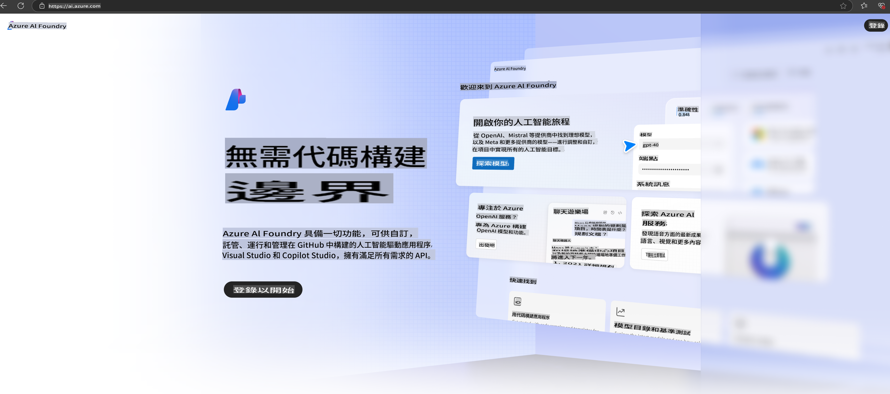

# **在 Azure AI Foundry 中使用 Phi-3**

隨著生成式 AI 的發展，我們希望利用一個統一的平台來管理不同的 LLM 和 SLM、企業數據整合、微調/RAG 操作，以及整合 LLM 和 SLM 後對不同企業業務的評估等，讓生成式 AI 的智能應用更好地落地。[Azure AI Foundry](https://ai.azure.com) 是一個企業級的生成式 AI 應用平台。

透過 Azure AI Foundry，你可以評估大型語言模型（LLM）的回應，並通過 Prompt Flow 組織 Prompt 應用元件以提升效能。該平台支持概念驗證向正式生產的輕鬆轉換，具備良好的可擴展性。持續的監控與改進支持長期成功。

我們可以通過簡單的步驟快速在 Azure AI Foundry 上部署 Phi-3 模型，然後利用 Azure AI Foundry 完成與 Phi-3 相關的 Playground/Chat、微調、評估等相關工作。

## **1. 準備工作**

如果你已經在電腦上安裝了 [Azure Developer CLI](https://learn.microsoft.com/azure/developer/azure-developer-cli/overview?WT.mc_id=aiml-138114-kinfeylo)，使用這個模板只需在新目錄中執行以下命令即可。

## 手動創建

創建 Microsoft Azure AI Foundry 項目和 Hub 是組織和管理 AI 工作的一個好方法。以下是開始的分步指南：

### 在 Azure AI Foundry 中創建項目

1. **進入 Azure AI Foundry**：登入 Azure AI Foundry 入口網站。
2. **創建項目**：
   - 如果你已在某個項目中，點擊頁面左上角的 "Azure AI Foundry" 返回首頁。
   - 點擊 "+ 創建項目"。
   - 輸入項目名稱。
   - 如果你已有 Hub，系統會默認選擇。如果你有多個 Hub，可從下拉列表中選擇其他的。如果想創建新的 Hub，點擊 "創建新 Hub"，並輸入名稱。
   - 點擊 "創建"。

### 在 Azure AI Foundry 中創建 Hub

1. **進入 Azure AI Foundry**：使用你的 Azure 帳戶登入。
2. **創建 Hub**：
   - 從左側菜單選擇管理中心。
   - 點擊 "所有資源"，然後在 "+ 新項目" 旁邊的向下箭頭中選擇 "+ 新 Hub"。
   - 在 "創建新 Hub" 對話框中，輸入 Hub 名稱（例如 contoso-hub），並根據需要修改其他字段。
   - 點擊 "下一步"，檢查信息後點擊 "創建"。

更詳細的說明可參考官方 [Microsoft 文檔](https://learn.microsoft.com/azure/ai-studio/how-to/create-projects)。

創建成功後，你可以通過 [ai.azure.com](https://ai.azure.com/) 訪問你創建的 Studio。

在一個 AI Foundry 上可以有多個項目。請在 AI Foundry 中創建項目以做好準備。

創建 Azure AI Foundry [快速入門](https://learn.microsoft.com/azure/ai-studio/quickstarts/get-started-code)

## **2. 在 Azure AI Foundry 中部署 Phi 模型**

點擊項目的 Explore 選項，進入模型目錄並選擇 Phi-3。

選擇 Phi-3-mini-4k-instruct。

點擊 "Deploy" 部署 Phi-3-mini-4k-instruct 模型。

> [!NOTE]
>
> 部署時可以選擇計算資源。

## **3. 在 Azure AI Foundry 中使用 Phi 的 Playground Chat**

進入部署頁面，選擇 Playground，並與 Azure AI Foundry 的 Phi-3 進行聊天。

## **4. 從 Azure AI Foundry 部署模型**

要從 Azure 模型目錄中部署模型，可按照以下步驟操作：

- 登入 Azure AI Foundry。
- 從 Azure AI Foundry 模型目錄中選擇要部署的模型。
- 在模型的詳細信息頁面上，點擊 Deploy，然後選擇 "Serverless API with Azure AI Content Safety"。
- 選擇你要部署模型的項目。若使用 Serverless API，工作區必須位於 East US 2 或 Sweden Central 區域。你可以自定義部署名稱。
- 在部署向導中，選擇 Pricing and terms，了解價格和使用條款。
- 點擊 Deploy。等待部署完成，系統會將你重定向到部署頁面。
- 點擊 "Open in playground" 開始與模型互動。
- 你可以返回部署頁面，選擇部署，並記下端點的 Target URL 和 Secret Key，用於調用部署並生成補全。
- 你也可以隨時進入 Build 標籤，從 Components 區段選擇 Deployments，找到端點的詳細信息、URL 和訪問密鑰。

> [!NOTE]
> 請注意，你的帳戶必須在資源組中擁有 Azure AI Developer 角色權限才能執行這些步驟。

## **5. 在 Azure AI Foundry 中使用 Phi API**

你可以通過 Postman 的 GET 訪問 https://{Your project name}.region.inference.ml.azure.com/swagger.json，並結合密鑰了解提供的介面。

你可以非常方便地獲取請求參數以及回應參數。

**免責聲明**：  
本文件經由機器翻譯人工智能服務翻譯而成。我們致力於確保翻譯準確，但請注意，自動翻譯可能包含錯誤或不準確之處。原文件的母語版本應被視為權威來源。對於關鍵資訊，建議尋求專業人工翻譯。我們對因使用此翻譯而引起的任何誤解或誤讀概不負責。