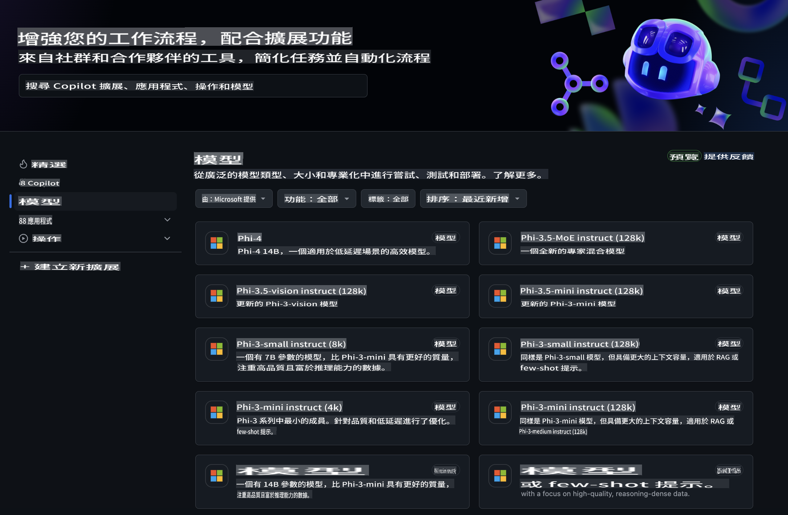
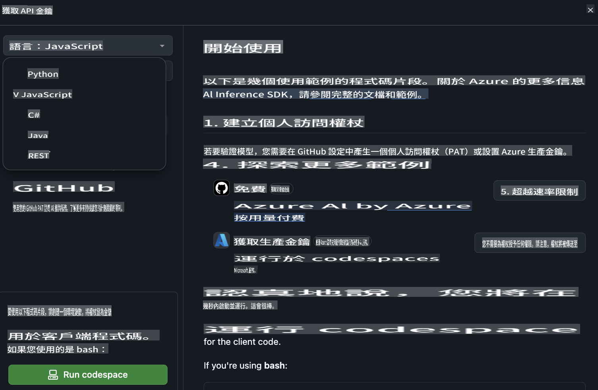
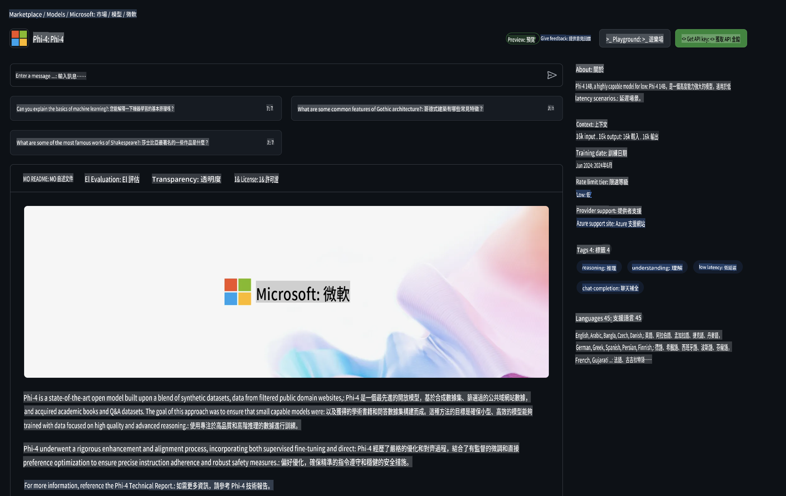

## GitHub Models - 公開測試版（有限）

歡迎來到 [GitHub Models](https://github.com/marketplace/models)！我哋已經準備好一切，等你探索由 Azure AI 托管嘅 AI 模型。



想了解更多關於 GitHub Models 上嘅模型資訊，可以睇下 [GitHub Model Marketplace](https://github.com/marketplace/models)。

## 可用模型

每個模型都有專屬嘅測試平台同埋示例代碼。


### GitHub Model Catalog 裏面嘅 Phi-3 模型

[Phi-3-Medium-128k-Instruct](https://github.com/marketplace/models/azureml/Phi-3-medium-128k-instruct)

[Phi-3-medium-4k-instruct](https://github.com/marketplace/models/azureml/Phi-3-medium-4k-instruct)

[Phi-3-mini-128k-instruct](https://github.com/marketplace/models/azureml/Phi-3-mini-128k-instruct)

[Phi-3-mini-4k-instruct](https://github.com/marketplace/models/azureml/Phi-3-mini-4k-instruct)

[Phi-3-small-128k-instruct](https://github.com/marketplace/models/azureml/Phi-3-small-128k-instruct)

[Phi-3-small-8k-instruct](https://github.com/marketplace/models/azureml/Phi-3-small-8k-instruct)

## 開始使用

我哋已經準備咗一啲簡單嘅示例，你可以即刻試下跑起佢哋。你可以喺 samples 資料夾裏面搵到佢哋。如果你想直接跳到你最鍾意嘅語言，可以喺以下語言中搵到示例：

- Python
- JavaScript
- cURL

另外，仲有專屬嘅 Codespaces 環境可以用嚟跑示例同模型。



## 示例代碼

以下係一啲用例嘅示例代碼片段。如需更多關於 Azure AI Inference SDK 嘅資訊，可以睇完整文檔同示例。

## 設置

1. 創建一個個人訪問令牌  
你唔需要俾呢個令牌任何權限。不過要注意，令牌會發送到 Microsoft 嘅服務。

要使用以下代碼片段，請創建一個環境變量，將你的令牌設置為客戶端代碼嘅密鑰。

如果你用緊 bash：
```
export GITHUB_TOKEN="<your-github-token-goes-here>"
```  
如果你用緊 powershell：

```
$Env:GITHUB_TOKEN="<your-github-token-goes-here>"
```  

如果你用緊 Windows 命令提示符：

```
set GITHUB_TOKEN=<your-github-token-goes-here>
```  

## Python 示例

### 安裝依賴
使用 pip 安裝 Azure AI Inference SDK（需要 Python >=3.8）：

```
pip install azure-ai-inference
```  

### 跑一個簡單嘅示例代碼

呢個示例展示咗點樣基本調用 chat completion API。佢利用 GitHub AI 模型推理端點同埋你嘅 GitHub 令牌。調用係同步嘅。

```
import os
from azure.ai.inference import ChatCompletionsClient
from azure.ai.inference.models import SystemMessage, UserMessage
from azure.core.credentials import AzureKeyCredential

endpoint = "https://models.inference.ai.azure.com"
# Replace Model_Name 
model_name = "Phi-3-small-8k-instruct"
token = os.environ["GITHUB_TOKEN"]

client = ChatCompletionsClient(
    endpoint=endpoint,
    credential=AzureKeyCredential(token),
)

response = client.complete(
    messages=[
        SystemMessage(content="You are a helpful assistant."),
        UserMessage(content="What is the capital of France?"),
    ],
    model=model_name,
    temperature=1.,
    max_tokens=1000,
    top_p=1.
)

print(response.choices[0].message.content)
```  

### 跑多輪對話

呢個示例展示咗點樣用 chat completion API 進行多輪對話。如果用模型嚟做聊天應用，你需要管理對話歷史，並將最新嘅消息發送到模型。

```
import os
from azure.ai.inference import ChatCompletionsClient
from azure.ai.inference.models import AssistantMessage, SystemMessage, UserMessage
from azure.core.credentials import AzureKeyCredential

token = os.environ["GITHUB_TOKEN"]
endpoint = "https://models.inference.ai.azure.com"
# Replace Model_Name
model_name = "Phi-3-small-8k-instruct"

client = ChatCompletionsClient(
    endpoint=endpoint,
    credential=AzureKeyCredential(token),
)

messages = [
    SystemMessage(content="You are a helpful assistant."),
    UserMessage(content="What is the capital of France?"),
    AssistantMessage(content="The capital of France is Paris."),
    UserMessage(content="What about Spain?"),
]

response = client.complete(messages=messages, model=model_name)

print(response.choices[0].message.content)
```  

### 流式輸出

為咗更好嘅用戶體驗，你可能會想流式輸出模型嘅回應，咁第一個 token 可以早啲顯示出嚟，避免等待過長嘅回應。

```
import os
from azure.ai.inference import ChatCompletionsClient
from azure.ai.inference.models import SystemMessage, UserMessage
from azure.core.credentials import AzureKeyCredential

token = os.environ["GITHUB_TOKEN"]
endpoint = "https://models.inference.ai.azure.com"
# Replace Model_Name
model_name = "Phi-3-small-8k-instruct"

client = ChatCompletionsClient(
    endpoint=endpoint,
    credential=AzureKeyCredential(token),
)

response = client.complete(
    stream=True,
    messages=[
        SystemMessage(content="You are a helpful assistant."),
        UserMessage(content="Give me 5 good reasons why I should exercise every day."),
    ],
    model=model_name,
)

for update in response:
    if update.choices:
        print(update.choices[0].delta.content or "", end="")

client.close()
```  

## JavaScript 

### 安裝依賴

安裝 Node.js。

將以下文字複製並保存為 package.json 文件喺你嘅資料夾裏面。

```
{
  "type": "module",
  "dependencies": {
    "@azure-rest/ai-inference": "latest",
    "@azure/core-auth": "latest",
    "@azure/core-sse": "latest"
  }
}
```  

注意：@azure/core-sse 只有喺你流式輸出 chat completions 回應時先需要。

喺呢個資料夾裏面開啟一個終端窗口，執行 npm install。

對於以下每段代碼片段，將內容複製到一個 sample.js 文件裏面，然後用 node sample.js 執行。

### 跑一個簡單嘅示例代碼

呢個示例展示咗點樣基本調用 chat completion API。佢利用 GitHub AI 模型推理端點同埋你嘅 GitHub 令牌。調用係同步嘅。

```
import ModelClient from "@azure-rest/ai-inference";
import { AzureKeyCredential } from "@azure/core-auth";

const token = process.env["GITHUB_TOKEN"];
const endpoint = "https://models.inference.ai.azure.com";
// Update your modelname
const modelName = "Phi-3-small-8k-instruct";

export async function main() {

  const client = new ModelClient(endpoint, new AzureKeyCredential(token));

  const response = await client.path("/chat/completions").post({
    body: {
      messages: [
        { role:"system", content: "You are a helpful assistant." },
        { role:"user", content: "What is the capital of France?" }
      ],
      model: modelName,
      temperature: 1.,
      max_tokens: 1000,
      top_p: 1.
    }
  });

  if (response.status !== "200") {
    throw response.body.error;
  }
  console.log(response.body.choices[0].message.content);
}

main().catch((err) => {
  console.error("The sample encountered an error:", err);
});
```  

### 跑多輪對話

呢個示例展示咗點樣用 chat completion API 進行多輪對話。如果用模型嚟做聊天應用，你需要管理對話歷史，並將最新嘅消息發送到模型。

```
import ModelClient from "@azure-rest/ai-inference";
import { AzureKeyCredential } from "@azure/core-auth";

const token = process.env["GITHUB_TOKEN"];
const endpoint = "https://models.inference.ai.azure.com";
// Update your modelname
const modelName = "Phi-3-small-8k-instruct";

export async function main() {

  const client = new ModelClient(endpoint, new AzureKeyCredential(token));

  const response = await client.path("/chat/completions").post({
    body: {
      messages: [
        { role: "system", content: "You are a helpful assistant." },
        { role: "user", content: "What is the capital of France?" },
        { role: "assistant", content: "The capital of France is Paris." },
        { role: "user", content: "What about Spain?" },
      ],
      model: modelName,
    }
  });

  if (response.status !== "200") {
    throw response.body.error;
  }

  for (const choice of response.body.choices) {
    console.log(choice.message.content);
  }
}

main().catch((err) => {
  console.error("The sample encountered an error:", err);
});
```  

### 流式輸出
為咗更好嘅用戶體驗，你可能會想流式輸出模型嘅回應，咁第一個 token 可以早啲顯示出嚟，避免等待過長嘅回應。

```
import ModelClient from "@azure-rest/ai-inference";
import { AzureKeyCredential } from "@azure/core-auth";
import { createSseStream } from "@azure/core-sse";

const token = process.env["GITHUB_TOKEN"];
const endpoint = "https://models.inference.ai.azure.com";
// Update your modelname
const modelName = "Phi-3-small-8k-instruct";

export async function main() {

  const client = new ModelClient(endpoint, new AzureKeyCredential(token));

  const response = await client.path("/chat/completions").post({
    body: {
      messages: [
        { role: "system", content: "You are a helpful assistant." },
        { role: "user", content: "Give me 5 good reasons why I should exercise every day." },
      ],
      model: modelName,
      stream: true
    }
  }).asNodeStream();

  const stream = response.body;
  if (!stream) {
    throw new Error("The response stream is undefined");
  }

  if (response.status !== "200") {
    stream.destroy();
    throw new Error(`Failed to get chat completions, http operation failed with ${response.status} code`);
  }

  const sseStream = createSseStream(stream);

  for await (const event of sseStream) {
    if (event.data === "[DONE]") {
      return;
    }
    for (const choice of (JSON.parse(event.data)).choices) {
        process.stdout.write(choice.delta?.content ?? ``);
    }
  }
}

main().catch((err) => {
  console.error("The sample encountered an error:", err);
});
```  

## REST 

### 跑一個簡單嘅示例代碼

將以下內容粘貼到 shell：

```
curl -X POST "https://models.inference.ai.azure.com/chat/completions" \
    -H "Content-Type: application/json" \
    -H "Authorization: Bearer $GITHUB_TOKEN" \
    -d '{
        "messages": [
            {
                "role": "system",
                "content": "You are a helpful assistant."
            },
            {
                "role": "user",
                "content": "What is the capital of France?"
            }
        ],
        "model": "Phi-3-small-8k-instruct"
    }'
```  

### 跑多輪對話

調用 chat completion API 並傳遞對話歷史：

```
curl -X POST "https://models.inference.ai.azure.com/chat/completions" \
    -H "Content-Type: application/json" \
    -H "Authorization: Bearer $GITHUB_TOKEN" \
    -d '{
        "messages": [
            {
                "role": "system",
                "content": "You are a helpful assistant."
            },
            {
                "role": "user",
                "content": "What is the capital of France?"
            },
            {
                "role": "assistant",
                "content": "The capital of France is Paris."
            },
            {
                "role": "user",
                "content": "What about Spain?"
            }
        ],
        "model": "Phi-3-small-8k-instruct"
    }'
```  

### 流式輸出

呢個係調用端點並流式輸出回應嘅示例。

```
curl -X POST "https://models.inference.ai.azure.com/chat/completions" \
    -H "Content-Type: application/json" \
    -H "Authorization: Bearer $GITHUB_TOKEN" \
    -d '{
        "messages": [
            {
                "role": "system",
                "content": "You are a helpful assistant."
            },
            {
                "role": "user",
                "content": "Give me 5 good reasons why I should exercise every day."
            }
        ],
        "stream": true,
        "model": "Phi-3-small-8k-instruct"
    }'
```  

## 免費使用 GitHub Models 同速率限制



[遊樂場同免費 API 使用嘅速率限制](https://docs.github.com/en/github-models/prototyping-with-ai-models#rate-limits)係用嚟幫助你實驗模型同開發 AI 應用原型。要超出呢啲限制，或者將應用擴展到更大規模，你需要喺 Azure 賬戶裏面配置資源，並從嗰度進行身份驗證，而唔係用你嘅 GitHub 個人訪問令牌。你嘅代碼唔需要做其他改動。用呢個連結嚟了解點樣喺 Azure AI 中突破免費層限制。

### 聲明

記住，喺同模型交互時，你係喺試驗 AI，所以內容可能會出錯。

呢個功能受多種限制（包括每分鐘請求數、每日請求數、每次請求嘅 token 數量同並發請求數量）影響，並唔係為生產環境使用而設計。

GitHub Models 使用 Azure AI 內容安全。呢啲過濾器係 GitHub Models 體驗嘅一部分，無法關閉。如果你決定通過付費服務使用模型，請根據你嘅需求配置內容過濾器。

呢個服務受 GitHub 嘅預發布條款約束。

**免責聲明**:  
本文件經由機器翻譯人工智能服務翻譯而成。我們致力於確保準確性，但請注意，自動翻譯可能包含錯誤或不準確之處。應以原始語言的文件作為權威來源。對於關鍵資訊，建議使用專業人工翻譯。我們對因使用此翻譯而引起的任何誤解或錯誤解釋概不負責。