# 使用 Azure AI Foundry 微調 Phi-3 模型

讓我們一起探討如何利用 Azure AI Foundry 微調 Microsoft 的 Phi-3 Mini 語言模型。透過微調，你可以將 Phi-3 Mini 調整為適應特定任務，使其更強大且更具上下文感知能力。

## 注意事項

- **功能：** 哪些模型可以進行微調？基礎模型可以被微調來完成哪些工作？
- **成本：** 微調的定價模式是什麼？
- **可自定義性：** 我可以如何以及多大程度地修改基礎模型？
- **便利性：** 微調的實際操作流程是什麼？是否需要撰寫自定義程式碼？是否需要自行提供運算資源？
- **安全性：** 微調後的模型可能存在安全風險，是否有任何防範措施來避免意外傷害？

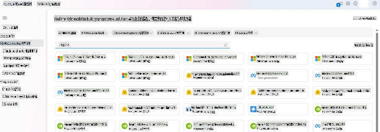

## 微調準備

### 先決條件

> [!NOTE]
> 對於 Phi-3 系列模型，按使用量付費的微調服務僅適用於在 **East US 2** 區域建立的 Hub。

- 一個 Azure 訂閱。如果尚未擁有，請建立 [付費 Azure 帳戶](https://azure.microsoft.com/pricing/purchase-options/pay-as-you-go) 開始使用。

- 一個 [AI Foundry 專案](https://ai.azure.com?WT.mc_id=aiml-138114-kinfeylo)。
- 使用 Azure 角色型存取控制 (Azure RBAC) 授予 Azure AI Foundry 的操作權限。執行本文中的步驟需要將您的使用者帳戶分配為資源群組中的 __Azure AI 開發人員角色__。

### 訂閱供應商註冊

確認訂閱已註冊到 `Microsoft.Network` 資源供應商。

1. 登入 [Azure 入口網站](https://portal.azure.com)。
2. 從左側選單選擇 **訂閱**。
3. 選擇您想使用的訂閱。
4. 從左側選單選擇 **AI 專案設定** > **資源供應商**。
5. 確認 **Microsoft.Network** 是否列在資源供應商清單中。如果沒有，請新增它。

### 數據準備

準備您的訓練和驗證數據來微調模型。訓練和驗證數據集應包括模型執行所需的輸入和輸出範例。

確保所有訓練範例符合推論的預期格式。為了有效微調模型，請確保數據集均衡且多樣化。

這包括保持數據平衡，涵蓋多種情境，並定期優化訓練數據以符合實際需求，從而提高模型的準確性和均衡性。

不同類型的模型需要不同格式的訓練數據。

### 聊天補全

您使用的訓練和驗證數據 **必須** 格式化為 JSON Lines (JSONL) 文件。對於 `Phi-3-mini-128k-instruct`，微調數據集需採用聊天補全 API 使用的對話格式。

### 範例文件格式

```json
    {"messages": [{"role": "system", "content": "You are an Xbox customer support agent whose primary goal is to help users with issues they are experiencing with their Xbox devices. You are friendly and concise. You only provide factual answers to queries, and do not provide answers that are not related to Xbox."}, {"role": "user", "content": "Is Xbox better than PlayStation?"}, {"role": "assistant", "content": "I apologize, but I cannot provide personal opinions. My primary job is to assist you with any issues related to your Xbox device. Do you have any Xbox-related issues that need addressing?"}]}
    {"messages": [{"role": "system", "content": "You are an Xbox customer support agent whose primary goal is to help users with issues they are experiencing with their Xbox devices. You are friendly and concise. You only provide factual answers to queries, and do not provide answers that are not related to Xbox."}, {"role": "user", "content": "Can I play PC games on my Xbox?"}, {"role": "assistant", "content": "While Xbox consoles don't natively support PC games, they can play an array of Xbox games, many of which are also available on PC. Can I assist you with finding games compatible with your Xbox device?"}]}
    {"messages": [{"role": "system", "content": "You are an Xbox customer support agent whose primary goal is to help users with issues they are experiencing with their Xbox devices. You are friendly and concise. You only provide factual answers to queries, and do not provide answers that are not related to Xbox."}, {"role": "user", "content": "I'm having trouble connecting my Xbox to the Wi-Fi."}, {"role": "assistant", "content": "No worries, let's go through the network settings on your Xbox. Can you please tell me what happens when you try to connect it to the Wi-Fi?"}]}
```

支援的文件類型為 JSON Lines。文件會上傳至預設的數據存儲區，並在您的專案中可用。

## 使用 Azure AI Foundry 微調 Phi-3

Azure AI Foundry 讓您能夠透過微調，將大型語言模型調整為適應個人數據集。微調的價值在於能針對特定任務和應用進行自訂和優化，進而提升效能、降低成本、減少延遲並提供更符合需求的輸出。

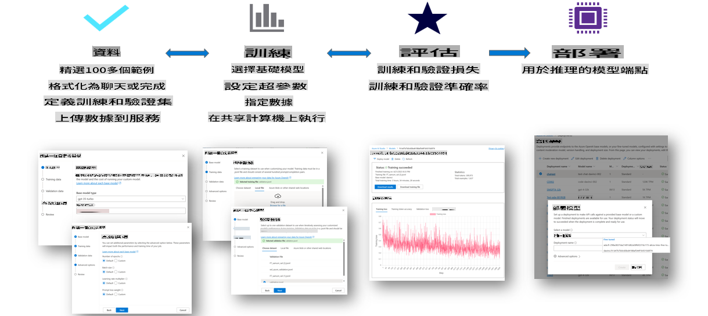

### 建立新專案

1. 登入 [Azure AI Foundry](https://ai.azure.com)。

2. 選擇 **+新專案**，在 Azure AI Foundry 中建立新專案。

    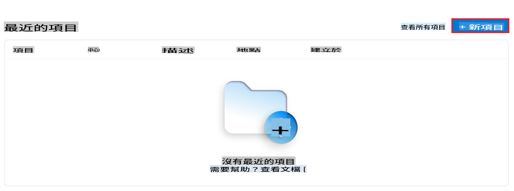

3. 執行以下任務：

    - 專案 **Hub 名稱**。需為唯一值。
    - 選擇要使用的 **Hub**（如有需要可新增）。

    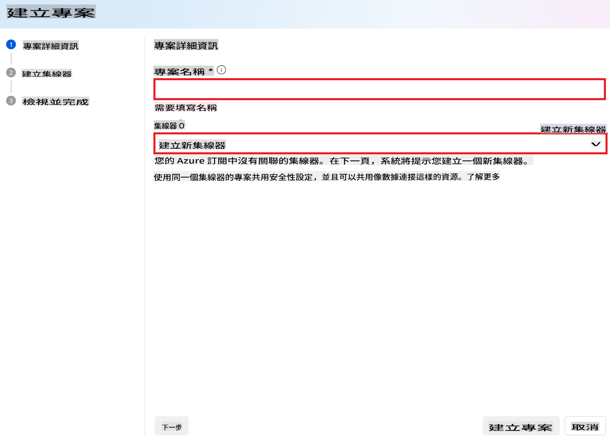

4. 執行以下任務以建立新 Hub：

    - 輸入 **Hub 名稱**。需為唯一值。
    - 選擇您的 Azure **訂閱**。
    - 選擇要使用的 **資源群組**（如有需要可新增）。
    - 選擇您想使用的 **位置**。
    - 選擇 **連接 Azure AI 服務**（如有需要可新增）。
    - 選擇 **連接 Azure AI 搜索** 或 **略過連接**。

    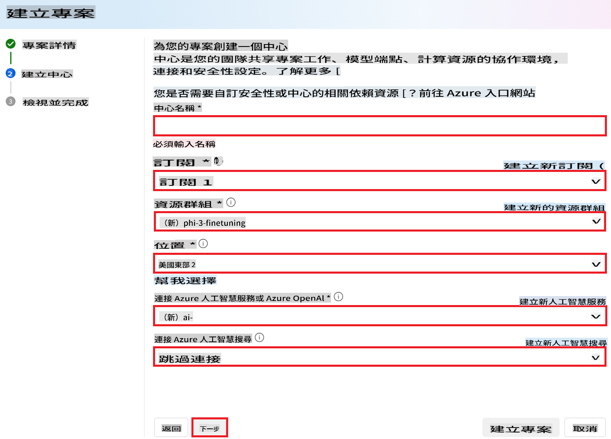

5. 選擇 **下一步**。
6. 選擇 **建立專案**。

### 數據準備

在微調之前，收集或建立與任務相關的數據集，例如聊天指令、問答對或其他相關文字數據。清理並預處理這些數據，去除雜訊、處理遺漏值並對文字進行標記化。

### 在 Azure AI Foundry 中微調 Phi-3 模型

> [!NOTE]
> Phi-3 模型的微調目前僅支援位於 East US 2 的專案。

1. 從左側選單選擇 **模型目錄**。

2. 在 **搜索欄**中輸入 *phi-3*，並選擇您想使用的 phi-3 模型。

    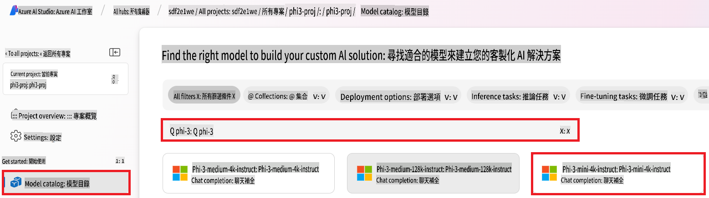

3. 選擇 **微調**。

    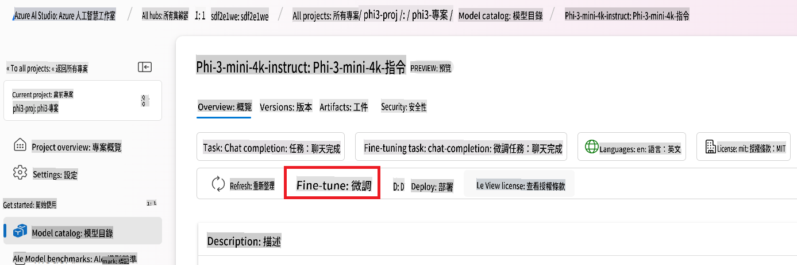

4. 輸入 **微調後的模型名稱**。

    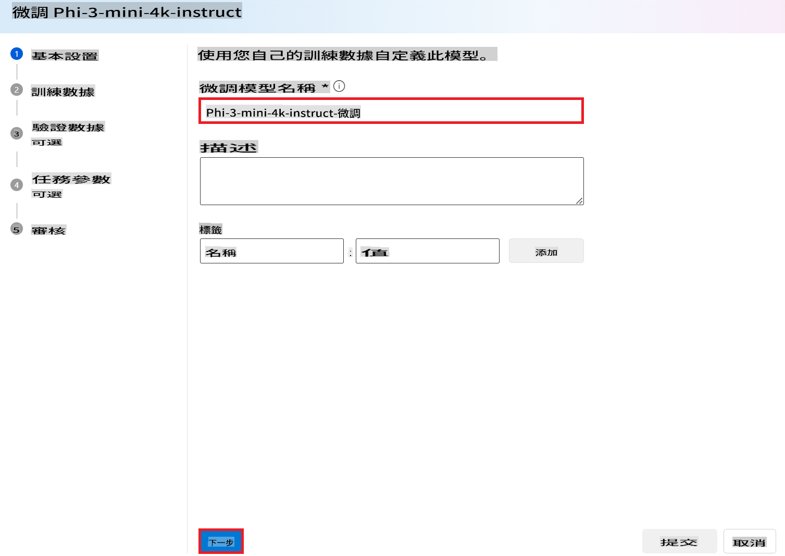

5. 選擇 **下一步**。

6. 執行以下任務：

    - 將 **任務類型** 設定為 **聊天補全**。
    - 選擇您要使用的 **訓練數據**。您可以透過 Azure AI Foundry 上傳數據或從本地環境上傳。

    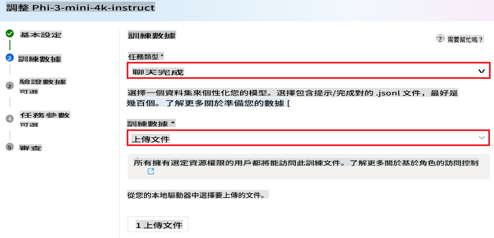

7. 選擇 **下一步**。

8. 上傳您想使用的 **驗證數據**，或選擇 **自動分割訓練數據**。

    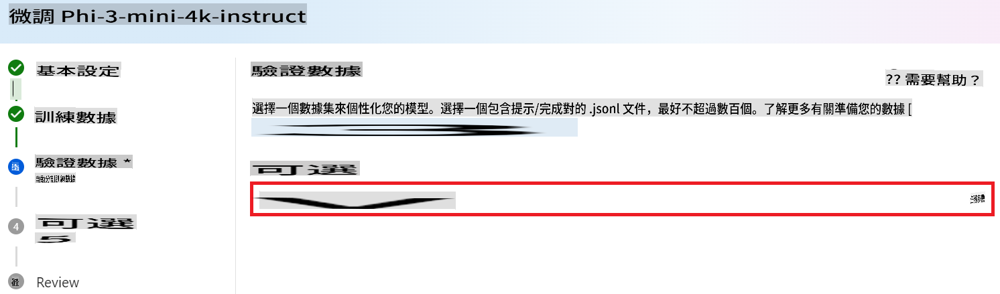

9. 選擇 **下一步**。

10. 執行以下任務：

    - 選擇您想使用的 **批次大小倍數**。
    - 選擇您想使用的 **學習率**。
    - 選擇您想使用的 **訓練輪數**。

    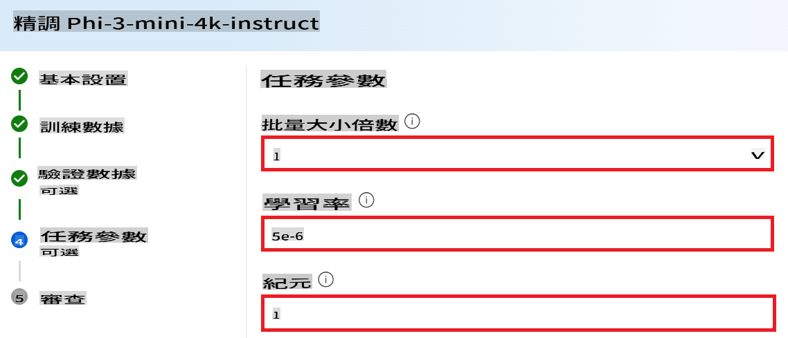

11. 選擇 **提交** 以啟動微調流程。

    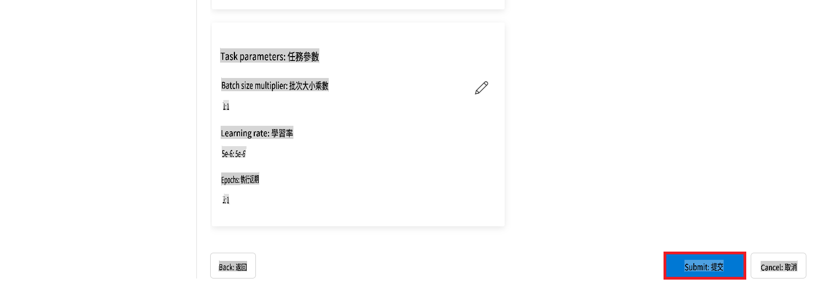

12. 當您的模型微調完成後，狀態將顯示為 **已完成**，如下圖所示。現在您可以部署該模型，並在自己的應用程式、測試平台或提示流程中使用。如需更多資訊，請參閱 [如何使用 Azure AI Foundry 部署 Phi-3 系列的小型語言模型](https://learn.microsoft.com/azure/ai-studio/how-to/deploy-models-phi-3?tabs=phi-3-5&pivots=programming-language-python)。

    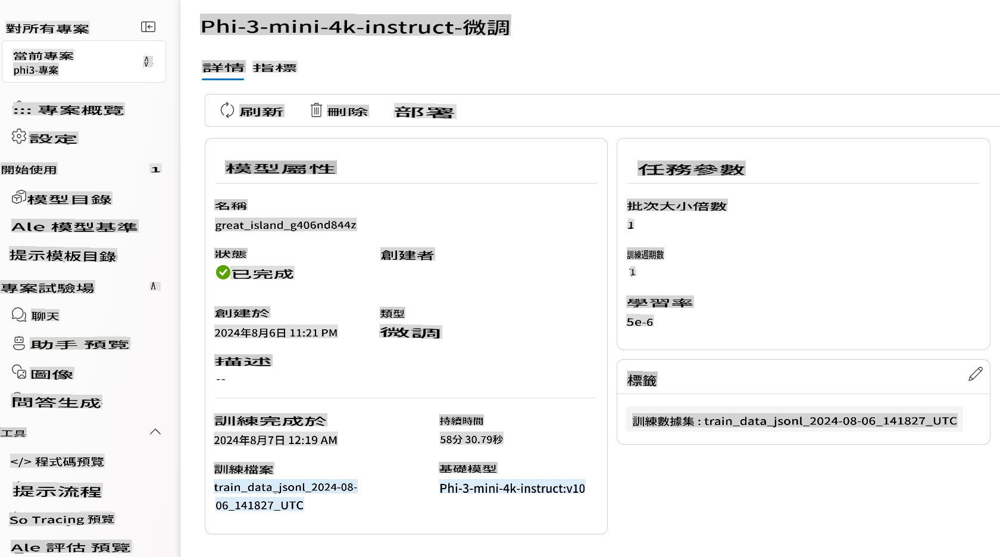

> [!NOTE]
> 有關微調 Phi-3 的更多詳細資訊，請參閱 [在 Azure AI Foundry 中微調 Phi-3 模型](https://learn.microsoft.com/azure/ai-studio/how-to/fine-tune-phi-3?tabs=phi-3-mini)。

## 清理您的微調模型

您可以從 [Azure AI Foundry](https://ai.azure.com) 的微調模型清單或模型詳細頁面中刪除微調模型。從微調頁面中選擇要刪除的微調模型，然後選擇刪除按鈕。

> [!NOTE]
> 如果自定義模型已部署，則無法刪除。您必須先刪除模型部署，然後才能刪除自定義模型。

## 成本與配額

### Phi-3 模型微調服務的成本與配額考量

Phi 模型作為服務進行微調，由 Microsoft 提供並與 Azure AI Foundry 集成。您可以在 [部署](https://learn.microsoft.com/azure/ai-studio/how-to/deploy-models-phi-3?tabs=phi-3-5&pivots=programming-language-python)或微調模型時，透過部署嚮導的定價與條款標籤查看價格。

## 內容過濾

按使用量付費部署的服務模型由 Azure AI Content Safety 保護。部署至即時端點時，您可以選擇停用此功能。啟用 Azure AI 內容安全時，提示和補全都會通過一組分類模型，旨在檢測和防止有害內容的輸出。內容過濾系統會檢測並對輸入提示和輸出補全中的特定潛在有害內容分類採取行動。了解更多 [Azure AI Content Safety](https://learn.microsoft.com/azure/ai-studio/concepts/content-filtering)。

**微調配置**

超參數：定義學習率、批次大小和訓練輪數等超參數。

**損失函數**

選擇適合您任務的損失函數（例如交叉熵）。

**優化器**

選擇優化器（例如 Adam）以在訓練期間更新梯度。

**微調過程**

- 載入預訓練模型：載入 Phi-3 Mini 檢查點。
- 添加自定義層：添加任務特定層（例如聊天指令的分類頭）。

**訓練模型**
使用準備好的數據集微調模型。監控訓練進度並根據需要調整超參數。

**評估與驗證**

驗證集：將數據分為訓練集和驗證集。

**評估效能**

使用準確性、F1 分數或困惑度等指標評估模型效能。

## 保存微調模型

**檢查點**
保存微調後的模型檢查點以供日後使用。

## 部署

- 部署為網路服務：將微調後的模型部署為 Azure AI Foundry 中的網路服務。
- 測試端點：向已部署的端點發送測試查詢以驗證其功能。

## 迭代與改進

迭代：如果效能不滿意，請通過調整超參數、添加更多數據或增加訓練輪數來進行迭代。

## 監控與優化

持續監控模型的行為並根據需要進行優化。

## 自訂與擴展

自訂任務：Phi-3 Mini 可微調用於聊天指令以外的多種任務。探索其他使用場景！
實驗：嘗試不同的架構、層組合和技術來提升效能。

> [!NOTE]
> 微調是一個反覆過程。實驗、學習並調整您的模型，以實現針對特定任務的最佳效果！

**免責聲明**:  
本文件是使用機器翻譯AI服務進行翻譯的。儘管我們努力確保準確性，但請注意，自動翻譯可能包含錯誤或不準確之處。應以原文檔的母語版本作為權威來源。對於關鍵資訊，建議尋求專業人工翻譯。我們對因使用本翻譯而引起的任何誤解或誤讀概不負責。