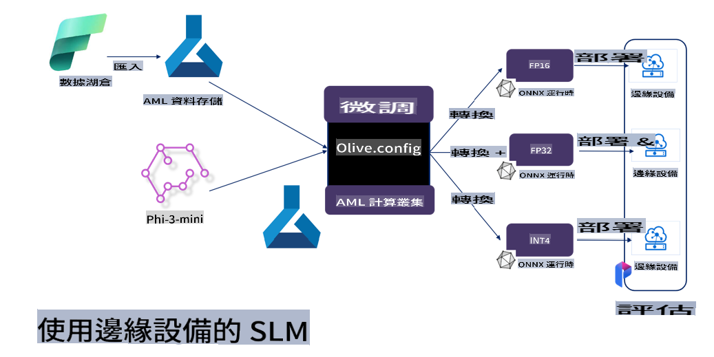

# **用 Microsoft Olive 微調 Phi-3**

[Olive](https://github.com/microsoft/OLive?WT.mc_id=aiml-138114-kinfeylo) 係一個簡單易用、針對硬件嘅模型優化工具，結合咗行業領先嘅模型壓縮、優化同編譯技術。

佢嘅設計目標係簡化機器學習模型嘅優化過程，確保模型可以最有效咁利用特定硬件架構。

無論你係做雲端應用定係邊緣設備，Olive 都可以幫你輕鬆高效咁優化模型。

## 核心功能：
- Olive 集成並自動化咗針對硬件目標嘅優化技術。
- 無一種優化技術可以適用於所有情景，因此 Olive 容許行業專家擴展並加入佢哋嘅創新優化技術。

## 減少工程工作量：
- 開發者通常需要學習並使用多個硬件供應商嘅工具鏈，嚟準備同優化已訓練嘅模型以便部署。
- Olive 簡化咗呢個過程，通過自動化技術，幫助達成硬件需求。

## 即用型全流程優化解決方案：

Olive 通過整合及調整技術，提供一個統一嘅端到端優化方案。
優化過程會考慮到準確度同延遲等限制。

## 使用 Microsoft Olive 進行微調

Microsoft Olive 係一個非常易用嘅開源模型優化工具，可以覆蓋生成式人工智能領域嘅微調同參考。只需簡單配置，結合開源小型語言模型同相關運行環境（AzureML / 本地 GPU、CPU、DirectML），就可以通過自動優化完成模型嘅微調或參考，並搵到最佳模型部署到雲端或者邊緣設備。咁樣企業就可以喺本地同雲端建立自己嘅行業垂直模型。


## 用 Microsoft Olive 微調 Phi-3 



## Phi-3 Olive 範例代碼同示例
喺呢個示例入面，你將會用 Olive 嚟：

- 微調一個 LoRA 適配器，用嚟將短語分類為 Sad、Joy、Fear、Surprise。
- 將適配器嘅權重同基礎模型合併。
- 優化並量化模型至 int4。

[範例代碼](../../code/03.Finetuning/olive-ort-example/README.md)

### 安裝 Microsoft Olive

Microsoft Olive 嘅安裝非常簡單，亦可以針對 CPU、GPU、DirectML 同 Azure ML 進行安裝。

```bash
pip install olive-ai
```

如果你想用 CPU 運行 ONNX 模型，可以用：

```bash
pip install olive-ai[cpu]
```

如果你想用 GPU 運行 ONNX 模型，可以用：

```python
pip install olive-ai[gpu]
```

如果你想用 Azure ML，可以用：

```python
pip install git+https://github.com/microsoft/Olive#egg=olive-ai[azureml]
```

**注意**
操作系統要求：Ubuntu 20.04 / 22.04 

### **Microsoft Olive 嘅 Config.json**

安裝完成後，你可以通過 Config 文件配置唔同模型嘅設置，包括數據、計算、訓練、部署同模型生成。

**1. 數據**

喺 Microsoft Olive 上，可以支持本地數據同雲端數據訓練，並喺設置入面進行配置。

*本地數據設置*

你可以簡單設置需要微調嘅數據集，通常係 json 格式，並用數據模板進行適配。呢個需要根據模型嘅要求進行調整（例如適配 Microsoft Phi-3-mini 所需嘅格式。如果有其他模型，請參考其他模型所需嘅微調格式進行處理）。

```json

    "data_configs": [
        {
            "name": "dataset_default_train",
            "type": "HuggingfaceContainer",
            "load_dataset_config": {
                "params": {
                    "data_name": "json", 
                    "data_files":"dataset/dataset-classification.json",
                    "split": "train"
                }
            },
            "pre_process_data_config": {
                "params": {
                    "dataset_type": "corpus",
                    "text_cols": [
                            "phrase",
                            "tone"
                    ],
                    "text_template": "### Text: {phrase}\n### The tone is:\n{tone}",
                    "corpus_strategy": "join",
                    "source_max_len": 2048,
                    "pad_to_max_len": false,
                    "use_attention_mask": false
                }
            }
        }
    ],
```

**雲端數據源設置**

通過連接 Azure AI Studio/Azure Machine Learning Service 嘅數據存儲，可以引入雲端數據，並通過 Microsoft Fabric 同 Azure Data 將唔同數據源引入 Azure AI Studio/Azure Machine Learning Service，支持數據微調。

```json

    "data_configs": [
        {
            "name": "dataset_default_train",
            "type": "HuggingfaceContainer",
            "load_dataset_config": {
                "params": {
                    "data_name": "json", 
                    "data_files": {
                        "type": "azureml_datastore",
                        "config": {
                            "azureml_client": {
                                "subscription_id": "Your Azure Subscrition ID",
                                "resource_group": "Your Azure Resource Group",
                                "workspace_name": "Your Azure ML Workspaces name"
                            },
                            "datastore_name": "workspaceblobstore",
                            "relative_path": "Your train_data.json Azure ML Location"
                        }
                    },
                    "split": "train"
                }
            },
            "pre_process_data_config": {
                "params": {
                    "dataset_type": "corpus",
                    "text_cols": [
                            "Question",
                            "Best Answer"
                    ],
                    "text_template": "<|user|>\n{Question}<|end|>\n<|assistant|>\n{Best Answer}\n<|end|>",
                    "corpus_strategy": "join",
                    "source_max_len": 2048,
                    "pad_to_max_len": false,
                    "use_attention_mask": false
                }
            }
        }
    ],
    
```

**2. 計算配置**

如果需要本地運行，可以直接使用本地數據資源。如果需要使用 Azure AI Studio / Azure Machine Learning Service 嘅資源，就需要配置相關嘅 Azure 參數、計算資源名稱等。

```json

    "systems": {
        "aml": {
            "type": "AzureML",
            "config": {
                "accelerators": ["gpu"],
                "hf_token": true,
                "aml_compute": "Your Azure AI Studio / Azure Machine Learning Service Compute Name",
                "aml_docker_config": {
                    "base_image": "Your Azure AI Studio / Azure Machine Learning Service docker",
                    "conda_file_path": "conda.yaml"
                }
            }
        },
        "azure_arc": {
            "type": "AzureML",
            "config": {
                "accelerators": ["gpu"],
                "aml_compute": "Your Azure AI Studio / Azure Machine Learning Service Compute Name",
                "aml_docker_config": {
                    "base_image": "Your Azure AI Studio / Azure Machine Learning Service docker",
                    "conda_file_path": "conda.yaml"
                }
            }
        }
    },
```

***注意***

由於喺 Azure AI Studio/Azure Machine Learning Service 上通過容器運行，需要配置所需嘅環境。呢個需要喺 conda.yaml 環境中進行配置。

```yaml

name: project_environment
channels:
  - defaults
dependencies:
  - python=3.8.13
  - pip=22.3.1
  - pip:
      - einops
      - accelerate
      - azure-keyvault-secrets
      - azure-identity
      - bitsandbytes
      - datasets
      - huggingface_hub
      - peft
      - scipy
      - sentencepiece
      - torch>=2.2.0
      - transformers
      - git+https://github.com/microsoft/Olive@jiapli/mlflow_loading_fix#egg=olive-ai[gpu]
      - --extra-index-url https://aiinfra.pkgs.visualstudio.com/PublicPackages/_packaging/ORT-Nightly/pypi/simple/ 
      - ort-nightly-gpu==1.18.0.dev20240307004
      - --extra-index-url https://aiinfra.pkgs.visualstudio.com/PublicPackages/_packaging/onnxruntime-genai/pypi/simple/
      - onnxruntime-genai-cuda

    

```

**3. 選擇你的 SLM**

你可以直接使用 Hugging face 上嘅模型，或者直接結合 Azure AI Studio / Azure Machine Learning 嘅模型目錄，選擇需要使用嘅模型。以下代碼示例會用 Microsoft Phi-3-mini 作為例子。

如果你有本地模型，可以用呢個方法：

```json

    "input_model":{
        "type": "PyTorchModel",
        "config": {
            "hf_config": {
                "model_name": "model-cache/microsoft/phi-3-mini",
                "task": "text-generation",
                "model_loading_args": {
                    "trust_remote_code": true
                }
            }
        }
    },
```

如果你想用 Azure AI Studio / Azure Machine Learning Service 嘅模型，可以用呢個方法：

```json

    "input_model":{
        "type": "PyTorchModel",
        "config": {
            "model_path": {
                "type": "azureml_registry_model",
                "config": {
                    "name": "microsoft/Phi-3-mini-4k-instruct",
                    "registry_name": "azureml-msr",
                    "version": "11"
                }
            },
             "model_file_format": "PyTorch.MLflow",
             "hf_config": {
                "model_name": "microsoft/Phi-3-mini-4k-instruct",
                "task": "text-generation",
                "from_pretrained_args": {
                    "trust_remote_code": true
                }
            }
        }
    },
```

**注意：**
需要同 Azure AI Studio / Azure Machine Learning Service 集成，因此喺設置模型時，請參考版本號同相關命名。

Azure 上所有模型都需要設置為 PyTorch.MLflow。

你需要有 Hugging face 帳號，並將密鑰綁定到 Azure AI Studio / Azure Machine Learning 嘅 Key 值。

**4. 算法**

Microsoft Olive 將 Lora 同 QLora 微調算法封裝得非常好，你只需配置相關參數即可。以下以 QLora 為例。

```json
        "lora": {
            "type": "LoRA",
            "config": {
                "target_modules": [
                    "o_proj",
                    "qkv_proj"
                ],
                "double_quant": true,
                "lora_r": 64,
                "lora_alpha": 64,
                "lora_dropout": 0.1,
                "train_data_config": "dataset_default_train",
                "eval_dataset_size": 0.3,
                "training_args": {
                    "seed": 0,
                    "data_seed": 42,
                    "per_device_train_batch_size": 1,
                    "per_device_eval_batch_size": 1,
                    "gradient_accumulation_steps": 4,
                    "gradient_checkpointing": false,
                    "learning_rate": 0.0001,
                    "num_train_epochs": 3,
                    "max_steps": 10,
                    "logging_steps": 10,
                    "evaluation_strategy": "steps",
                    "eval_steps": 187,
                    "group_by_length": true,
                    "adam_beta2": 0.999,
                    "max_grad_norm": 0.3
                }
            }
        },
```

如果你需要進行量化轉換，Microsoft Olive 主分支已支持 onnxruntime-genai 方法。你可以根據需要進行設置：

1. 將適配器權重合併到基礎模型。
2. 通過 ModelBuilder 將模型轉換為所需精度嘅 onnx 模型。

例如轉換為量化嘅 INT4：

```json

        "merge_adapter_weights": {
            "type": "MergeAdapterWeights"
        },
        "builder": {
            "type": "ModelBuilder",
            "config": {
                "precision": "int4"
            }
        }
```

**注意** 
- 如果你用 QLoRA，暫時唔支持 ONNXRuntime-genai 嘅量化轉換。

- 需要指出嘅係，你可以根據自己需要設置上述步驟，並唔需要完全配置所有步驟。根據需求，你可以直接使用算法步驟而唔進行微調。最後需要配置相關引擎。

```json

    "engine": {
        "log_severity_level": 0,
        "host": "aml",
        "target": "aml",
        "search_strategy": false,
        "execution_providers": ["CUDAExecutionProvider"],
        "cache_dir": "../model-cache/models/phi3-finetuned/cache",
        "output_dir" : "../model-cache/models/phi3-finetuned"
    }
```

**5. 完成微調**

喺命令行中，喺 olive-config.json 所在目錄執行：

```bash
olive run --config olive-config.json  
```

**免責聲明**：  
此文件是使用機器翻譯人工智能服務進行翻譯的。雖然我們努力確保準確性，但請注意，自動翻譯可能包含錯誤或不準確之處。應以原文的母語版本作為權威來源。對於關鍵信息，建議使用專業的人手翻譯。我們對因使用此翻譯而引起的任何誤解或誤釋不承擔責任。